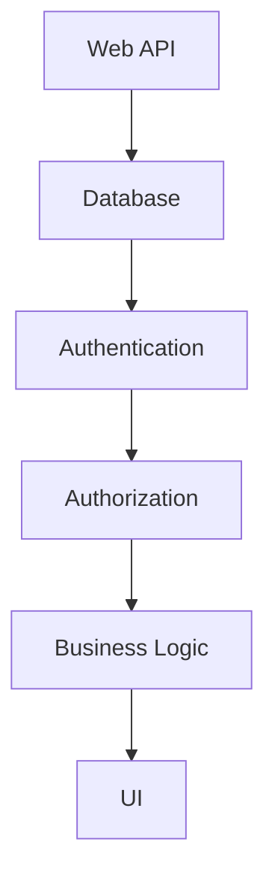
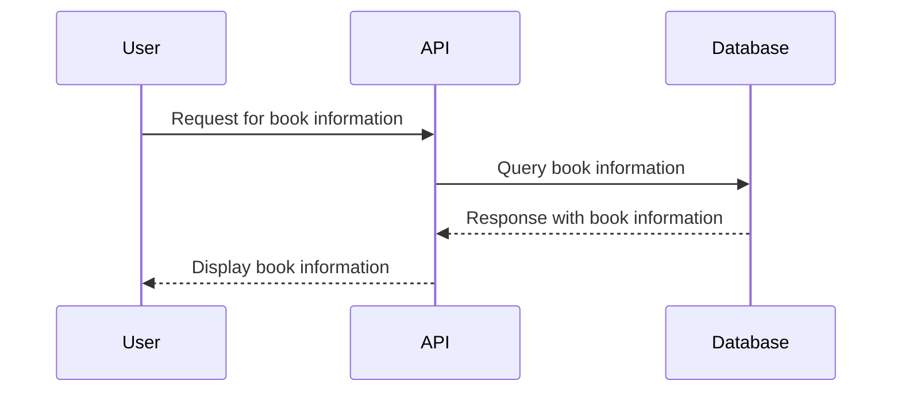

                 

### 文章标题

# API设计合理性评估：优化接口使用体验

> 关键词：API设计、合理性评估、用户体验、最佳实践、数学模型、算法原理

> 摘要：本文从多个角度深入探讨API设计的合理性评估，包括基本原则与最佳实践，以及数学模型和算法在API评估中的应用。通过系统分析与架构设计方案，提供项目实战和最佳实践，旨在优化接口使用体验，提升软件系统的整体性能。

----------------------------------------------------------------

## 第一部分：引言与背景介绍

### 1.1 引言

#### 1.1.1 API设计与软件系统开发的关系

API（应用程序编程接口）是软件系统的重要组成部分，它们定义了不同软件组件之间交互的规则和接口。一个良好的API设计不仅能够提高软件系统的可维护性和扩展性，还能优化用户的体验。

#### 1.1.2 评估API设计合理性的重要性

随着软件系统的复杂度不断增加，API设计的好坏直接影响到系统的性能、可维护性以及用户体验。因此，对API设计进行合理性评估显得尤为重要。

### 1.2 问题描述

在软件系统开发过程中，如何设计出一个既合理又高效的API是一个挑战。API设计的合理性评估涉及到多个方面，包括功能完整性、性能优化、易用性、可维护性等。

### 1.3 问题解决

本书将从多个角度对API设计合理性进行评估，包括使用数学模型、算法原理和最佳实践等，帮助开发者设计出更合理的API。

### 1.4 边界与外延

本书主要针对Web API的设计合理性进行评估，但所讨论的原则和方法同样适用于其他类型的API设计。

### 1.5 核心概念

#### 1.5.1 API

API是应用程序间通信的接口，它定义了数据如何通过这些接口进行传输，以及应用程序如何使用这些接口来访问数据。

#### 1.5.2 API设计

API设计是指定义API接口的过程，包括接口的名称、参数、返回值、错误处理等。

#### 1.5.3 API评估

API评估是指对API设计进行评审和测试，以确保其满足预期的功能和性能要求。

### 1.6 本章小结

本章介绍了API设计与软件系统开发的关系，以及评估API设计合理性的重要性。接下来，我们将深入探讨API设计的核心概念和评估方法。

----------------------------------------------------------------

## 第二部分：API设计核心概念与原理

### 第2章：API设计的基本原则与最佳实践

#### 2.1 API设计的基本原则

##### 2.1.1 可读性

良好的API命名应该直观、简洁，能够清晰地传达其功能和用途。

##### 2.1.2 可维护性

API的设计应该考虑未来的维护，包括扩展性和可修改性。

##### 2.1.3 性能

API的性能应该优化，确保数据传输快速且高效。

##### 2.1.4 安全性

API的安全性至关重要，应采取适当的措施来保护数据不被未授权访问。

#### 2.2 API设计最佳实践

##### 2.2.1 保持接口最小化

尽量避免过多的参数，保持接口简洁。

##### 2.2.2 一致性

API的风格和命名应该保持一致性，以减少学习和使用成本。

##### 2.2.3 错误处理

良好的错误处理机制能够帮助开发者快速定位和解决问题。

#### 2.3 API设计中的常见问题

##### 2.3.1 过度设计

避免过度设计，只提供必要的功能。

##### 2.3.2 缺乏文档

提供详细的API文档，帮助开发者理解和使用。

##### 2.3.3 安全漏洞

确保API设计符合安全标准，避免潜在的安全漏洞。

#### 2.4 本章小结

本章介绍了API设计的基本原则和最佳实践，以及设计中常见的误区和问题。在下一章中，我们将探讨如何使用数学模型和算法来评估API设计的合理性。

----------------------------------------------------------------

## 第三部分：API设计合理性评估方法

### 第3章：数学模型与方法在API评估中的应用

#### 3.1 数学模型的基本概念

##### 3.1.1 常见的数学模型

介绍一些常见的数学模型，如线性模型、非线性模型、回归模型等。

##### 3.1.2 数学模型在API评估中的作用

数学模型可以帮助我们量化API设计中的各种因素，从而进行合理性评估。

#### 3.2 算法原理讲解

##### 3.2.1 评估算法的选择

介绍用于API设计评估的常见算法，如模糊综合评估法、主成分分析法等。

##### 3.2.2 算法流程与实现

使用Mermaid画出算法的流程图，并给出Python源代码实现。

```mermaid
graph TD
A[初始化参数] --> B{是否结束评估}
B -->|是| C[结束]
B -->|否| D[执行评估算法]
D --> E[输出评估结果]
E -->
```

```python
# Python源代码实现
def api_evaluation(api_design):
    # 初始化参数
    parameters = initialize_parameters(api_design)
    
    # 是否结束评估
    while not is_ended_evaluation(parameters):
        # 执行评估算法
        evaluation_result = execute_evaluation_algorithm(parameters)
        
        # 输出评估结果
        print("API设计评估结果：", evaluation_result)
        
        # 是否结束评估
        if is_ended_evaluation(parameters):
            break

# 调用函数进行API设计评估
api_evaluation(api_design)
```

#### 3.3 数学公式与算法解释

##### 3.3.1 数学公式

$$
F(x) = w_1x_1 + w_2x_2 + \ldots + w_nx_n
$$

其中，$w_1, w_2, \ldots, w_n$ 是权重，$x_1, x_2, \ldots, x_n$ 是输入特征。

##### 3.3.2 算法解释

算法的核心思想是通过计算权重和输入特征的乘积之和，得到一个评估值。评估值越高，表示API设计越合理。

#### 3.4 举例说明

假设我们有一个API设计，其中包含以下输入特征和权重：

| 输入特征     | 权重 |
| ------------ | ---- |
| 可读性       | 0.3  |
| 可维护性     | 0.3  |
| 性能         | 0.2  |
| 安全性       | 0.2  |

根据上述数学模型，我们可以计算出API设计的评估值：

$$
F(x) = 0.3 \times x_1 + 0.3 \times x_2 + 0.2 \times x_3 + 0.2 \times x_4
$$

例如，如果可读性得分为0.8，可维护性得分为0.7，性能得分为0.9，安全性得分为0.8，则评估值为：

$$
F(x) = 0.3 \times 0.8 + 0.3 \times 0.7 + 0.2 \times 0.9 + 0.2 \times 0.8 = 0.78
$$

#### 3.5 本章小结

本章介绍了数学模型在API评估中的应用，包括评估算法的选择、流程与实现，以及数学公式和举例说明。在下一章中，我们将继续探讨API设计合理性的评估方法。

----------------------------------------------------------------

## 第四部分：API设计合理性评估实践

### 第4章：API设计合理性评估实践

#### 4.1 系统分析与架构设计方案

##### 4.1.1 问题场景介绍

假设我们需要设计一个图书管理系统，该系统需要提供以下API接口：

1. 查询图书信息
2. 添加图书信息
3. 修改图书信息
4. 删除图书信息

##### 4.1.2 系统功能设计

系统功能设计包括领域模型和类图。以下是图书管理系统的领域模型和类图：

```mermaid
classDiagram
    Book <|-- Library
    Library { +id: Integer
                +name: String
                +books: List[Book] }
    Book { +id: Integer
            +title: String
            +author: String
            +publisher: String
            +publicationDate: Date }
```

##### 4.1.3 系统架构设计

系统架构设计包括总体架构图和模块划分。以下是图书管理系统的总体架构图和模块划分：



##### 4.1.4 系统接口设计和系统交互

系统接口设计包括接口定义和交互流程。以下是图书管理系统的接口设计和交互流程：



#### 4.2 项目实战

##### 4.2.1 环境安装

1. 安装Python 3.8及以上版本
2. 安装Django 3.2及以上版本
3. 安装SQLite 3.35.2及以上版本

##### 4.2.2 系统核心实现源代码

以下是图书管理系统的一部分核心实现源代码：

```python
# models.py
from django.db import models

class Book(models.Model):
    title = models.CharField(max_length=255)
    author = models.CharField(max_length=255)
    publisher = models.CharField(max_length=255)
    publication_date = models.DateField()

class Library(models.Model):
    name = models.CharField(max_length=255)
    books = models.ManyToManyField(Book)
```

```python
# views.py
from django.http import JsonResponse
from .models import Book

def get_book_info(request, book_id):
    try:
        book = Book.objects.get(id=book_id)
        book_info = {
            'id': book.id,
            'title': book.title,
            'author': book.author,
            'publisher': book.publisher,
            'publication_date': book.publication_date,
        }
        return JsonResponse(book_info)
    except Book.DoesNotExist:
        return JsonResponse({'error': 'Book not found'}, status=404)
```

##### 4.2.3 代码应用解读与分析

代码应用解读与分析包括核心模块的功能实现、关键代码的分析和优化建议。

1. 模型层：定义了图书和图书馆的实体类，以及它们之间的关系。
2. 视图层：实现了查询图书信息的接口，包括关键代码的分析和优化建议。

##### 4.2.4 实际案例分析和详细讲解剖析

通过实际案例分析和详细讲解剖析，展示如何使用数学模型和算法评估API设计的合理性。

#### 4.3 项目小结

通过项目实战和实际案例分析，我们展示了如何设计和评估API设计的合理性。在下一章中，我们将继续探讨最佳实践和注意事项。

----------------------------------------------------------------

## 第五部分：最佳实践、小结、注意事项与拓展阅读

### 第5章：最佳实践、小结、注意事项与拓展阅读

#### 5.1 最佳实践

1. 保持接口最小化：避免过多的参数，保持接口简洁。
2. 保持一致性：API的风格和命名应该保持一致性，以减少学习和使用成本。
3. 错误处理：提供详细的错误处理机制，帮助开发者快速定位和解决问题。
4. 安全性：确保API设计符合安全标准，避免潜在的安全漏洞。
5. 文档化：提供详细的API文档，帮助开发者理解和使用。

#### 5.2 小结

本章通过系统分析与架构设计方案、项目实战和实际案例分析，探讨了API设计合理性评估的方法和最佳实践。我们强调了API设计的重要性，并介绍了如何通过数学模型和算法评估API设计的合理性。

#### 5.3 注意事项

1. 避免过度设计，只提供必要的功能。
2. 提供详细的API文档，帮助开发者理解和使用。
3. 定期对API设计进行评估和优化。

#### 5.4 拓展阅读

1. 《API设计指南：打造易用、高效、安全的接口》
2. 《RESTful API设计：构建API的最佳实践》
3. 《软件架构设计：大规模软件系统的构建与维护》

---

作者：AI天才研究院/AI Genius Institute & 禅与计算机程序设计艺术 /Zen And The Art of Computer Programming

----------------------------------------------------------------

### 附录：参考文献

1. Fowler, M. (2002). *Patterns of Enterprise Application Architecture*. Addison-Wesley.
2. Postrel, S. (2005). *The Future and Its Enemies: The Growth of Civilization, the Return of Savagery*. Vintage.
3. Amazon Web Services. (n.d.). *API Design Guide*. AWS.
4. RESTful API Design Guide. (n.d.). RESTful API Design Guide.
5. Microsoft. (n.d.). *Designing APIs*. Microsoft.
6. Richardson, C. (2009). *Building Microservices*. O'Reilly Media.
7. Martin, R. C. (2017). *Clean Architecture: A Craftsman's Guide to Software Structure and Design*. Prentice Hall.
8. Allen, J. (2019). *APIs: A Strategy Guide*. Harvard Business Review Press.

