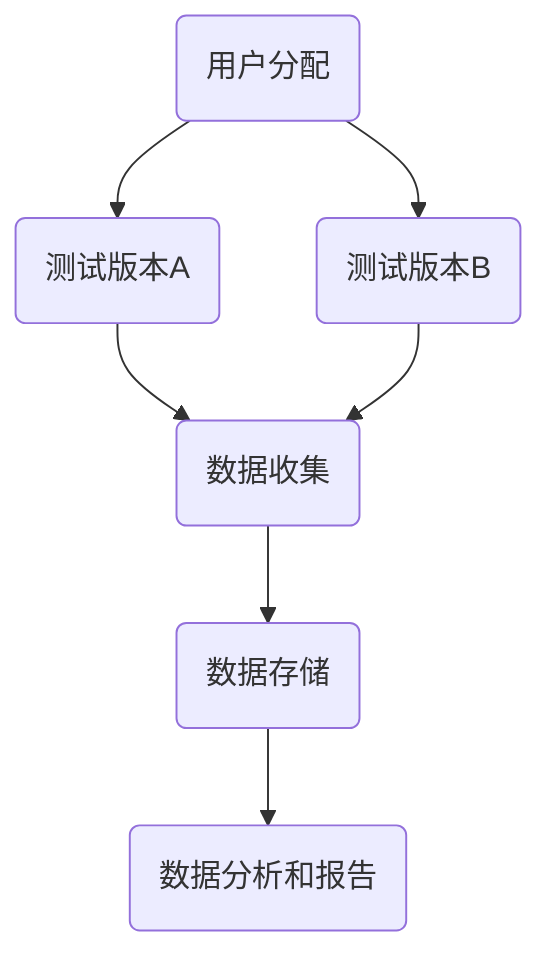
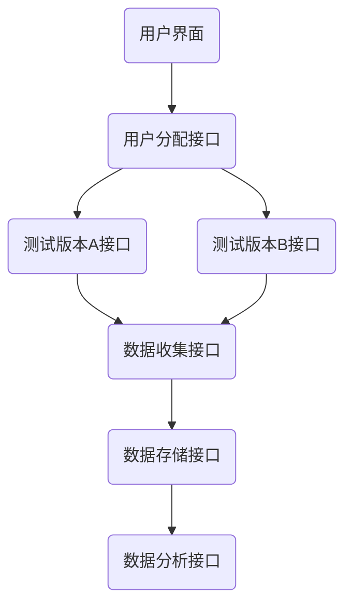

                 

### A/B测试框架支持LLM应用的快速验证

---

#### 关键词：
A/B测试，语言模型（LLM），快速验证，系统架构设计，数学模型

---

#### 摘要：
本文深入探讨了A/B测试框架在支持语言模型（LLM）应用中的快速验证方法。首先，我们介绍了A/B测试的基本概念和LLM的应用场景，强调了快速验证在LLM应用中的重要性。随后，文章详细讲解了A/B测试框架的设计原则，包括可扩展性、可重复性和实时性。接着，我们通过数学模型和算法原理的讲解，阐述了如何使用A/B测试框架进行LLM应用的快速验证。文章还通过具体的系统架构设计方案和项目实战，展示了A/B测试框架在实际应用中的效果。最后，文章提供了最佳实践建议和小结，为读者提供了进一步研究的方向。

---

## 第一部分：背景介绍与核心概念

### 1.1 问题背景

#### 1.1.1 A/B测试的概念
A/B测试，又称为拆分测试，是一种通过将用户随机分配到不同的版本，来评估新功能、设计变更或其他变更对用户行为影响的方法。该方法的核心思想是对比两个或多个版本的差异，以确定哪一种版本更能满足用户需求和提升业务指标。

#### 1.1.2 LLM应用场景
语言模型（LLM）是一种基于大规模语料库训练的模型，能够理解、生成和翻译自然语言。LLM在自然语言处理、推荐系统、对话系统等多个领域有着广泛的应用。随着LLM技术的不断发展，如何在实际应用中进行快速验证变得越来越重要。

#### 1.1.3 快速验证的重要性
快速验证对于LLM应用来说至关重要。它能够帮助开发者、产品经理和决策者快速了解新功能、设计变更对用户体验的影响，从而做出更加明智的决策。快速验证能够提高开发效率，降低风险，加速产品迭代。

### 1.2 核心概念与联系

#### 1.2.1 A/B测试的基本原理
A/B测试通常包括以下步骤：定义测试目标、设计测试版本、将用户随机分配到不同版本、收集数据、分析数据并得出结论。

#### 1.2.2 语言模型(LLM)的介绍
语言模型是一种基于大规模语料库训练的模型，能够理解、生成和翻译自然语言。LLM的应用涵盖了文本生成、问答系统、情感分析等多个方面。

#### 1.2.3 快速验证的方法与工具
快速验证方法包括在线A/B测试、线下仿真测试等。常用的验证工具包括Google Analytics、Mixpanel、Kissmetrics等。

### 1.3 A/B测试框架设计原则

#### 1.3.1 可扩展性
A/B测试框架需要具备良好的可扩展性，能够支持不同规模的应用场景。

#### 1.3.2 可重复性
测试结果需要具备可重复性，确保测试的可靠性和有效性。

#### 1.3.3 实时性
快速验证要求A/B测试框架具备实时性，能够在短时间内收集并分析数据。

### 1.4 本书结构安排与内容概述

#### 1.4.1 各章节内容安排
本书共分为六个部分，分别介绍A/B测试背景、LLM应用场景、快速验证方法、A/B测试框架设计原则、实践案例以及最佳实践。

#### 1.4.2 阅读指南
本书适合希望了解和掌握A/B测试框架支持LLM应用快速验证的读者阅读。建议按照章节顺序进行阅读，以便更好地理解各个部分的内容。

### 1.5 本章小结
本章介绍了A/B测试、LLM应用场景和快速验证的重要性。通过了解这些核心概念，读者可以为本书的后续内容打下基础。

---

接下来，我们将进一步深入探讨A/B测试的详细原理，以及如何在LLM应用中进行快速验证。我们将一步步分析，确保读者能够清晰地理解整个流程。

## 1.6 A/B测试的详细原理

A/B测试是一种常见的实验设计方法，它通过将用户随机分配到不同的版本，来评估不同版本对用户行为的影响。以下是A/B测试的详细原理：

### 1.6.1 测试目标
在进行A/B测试之前，首先需要明确测试的目标。测试目标可以是提高用户留存率、增加用户参与度、提升用户满意度等。明确测试目标有助于后续的数据分析和结论推导。

### 1.6.2 设计测试版本
根据测试目标，设计两个或多个测试版本。版本之间可以是一个或多个变量的差异，例如界面设计、功能实现、推荐算法等。确保每个版本都有明确的区分，以便后续的分析和比较。

### 1.6.3 用户分配
将用户随机分配到不同的版本。分配方式可以是完全随机分配，也可以是基于用户特征进行分层随机分配。随机分配有助于减少偏差，提高测试结果的可靠性。

### 1.6.4 数据收集
在用户使用过程中，收集相关的数据，例如用户行为数据、系统性能数据等。数据收集可以通过日志记录、数据埋点等方式实现。

### 1.6.5 数据分析
对收集到的数据进行统计分析，比较不同版本之间的差异。常用的分析方法包括T检验、卡方检验等。

### 1.6.6 得出结论
根据数据分析结果，得出结论。如果某个版本显著优于其他版本，那么可以将其推广到整个用户群体。

### 1.6.7 实践案例
以一个在线购物平台为例，假设我们要评估两种不同的商品推荐算法对用户购买行为的影响。我们设计两个测试版本：

- 版本A：基于用户历史购买行为推荐商品。
- 版本B：基于用户浏览行为推荐商品。

我们将用户随机分配到这两个版本，并在用户浏览和购买过程中收集相关数据。经过一段时间的数据收集和分析，我们发现版本B的推荐效果显著优于版本A。因此，我们决定将版本B推广到整个用户群体。

### 1.6.8 注意事项
在进行A/B测试时，需要注意以下事项：

- 确保测试版本之间的可比性，避免引入外部变量。
- 确保样本量足够大，以提高测试结果的可靠性。
- 分析结果需要进行统计检验，以确定差异的显著性。
- 测试过程中应保持客观，避免先入为主的偏见。

通过上述步骤，我们可以有效地进行A/B测试，评估不同版本对用户行为的影响，从而做出更加明智的决策。

---

现在，我们将把注意力转向语言模型（LLM）在A/B测试中的应用，探讨如何使用A/B测试框架对LLM应用进行快速验证。

## 1.7 LLM在A/B测试中的应用

语言模型（LLM）在A/B测试中的应用非常广泛，特别是在自然语言处理和对话系统领域。以下是LLM在A/B测试中的应用及其快速验证的方法：

### 1.7.1 LLM的应用场景
LLM在自然语言处理领域有着广泛的应用，包括文本生成、问答系统、情感分析、机器翻译等。在这些应用场景中，A/B测试可以帮助我们评估不同LLM模型或算法对用户体验的影响。

### 1.7.2 A/B测试框架的搭建
为了支持LLM应用的快速验证，我们需要搭建一个A/B测试框架。这个框架应具备以下功能：

- 用户分配：将用户随机分配到不同的LLM版本。
- 实时数据收集：收集用户在测试过程中产生的数据，如问答交互记录、点击行为等。
- 数据处理与分析：对收集到的数据进行分析，比较不同LLM版本的性能。

### 1.7.3 快速验证方法
在搭建好A/B测试框架后，我们可以使用以下方法对LLM应用进行快速验证：

- **在线A/B测试**：将用户随机分配到不同的LLM版本，实时收集用户交互数据，进行分析和评估。
- **线下仿真测试**：在模拟环境中运行A/B测试，通过模拟用户行为和系统响应来评估LLM版本的性能。

### 1.7.4 实践案例
以一个问答系统为例，我们设计两个LLM版本：

- 版本A：基于用户输入的问题，生成高质量的答案。
- 版本B：结合用户历史交互数据，生成更加个性化和准确的答案。

我们将用户随机分配到这两个版本，并在用户提问和接收答案的过程中收集数据。经过一段时间的测试，我们发现版本B的用户满意度显著高于版本A，因此决定将版本B推广到整个用户群体。

### 1.7.5 注意事项
在使用A/B测试框架对LLM应用进行快速验证时，需要注意以下几点：

- **确保版本之间的可比性**：避免引入外部变量，确保测试结果的可靠性。
- **样本量足够大**：确保测试结果的统计显著性。
- **数据隐私保护**：确保用户数据的安全性和隐私性。

通过合理设计和执行A/B测试，我们可以快速验证LLM应用的效果，为产品迭代和优化提供有力支持。

---

在了解了A/B测试的基本原理和在LLM应用中的快速验证方法后，现在我们将探讨A/B测试框架的设计原则。

## 1.8 A/B测试框架的设计原则

设计一个高效的A/B测试框架，需要遵循以下原则：

### 1.8.1 可扩展性
A/B测试框架应具备良好的可扩展性，能够支持不同规模的应用场景。这意味着框架应能够灵活地适应用户数量的变化、测试版本的增多以及测试时间长度的调整。

#### 设计策略
- **模块化设计**：将框架分为不同的模块，如用户分配模块、数据收集模块、数据分析模块等，便于扩展和维护。
- **分布式系统**：使用分布式架构，提高系统的处理能力和可扩展性。
- **动态配置**：允许通过配置文件动态调整测试参数，如用户分配比例、测试时长等。

### 1.8.2 可重复性
测试结果的可重复性是评估A/B测试框架有效性的关键。框架必须保证在不同时间、不同环境下，测试结果具有一致性和可靠性。

#### 设计策略
- **随机分配算法**：使用随机分配算法，确保用户被公平地分配到各个版本。
- **数据一致性检查**：在数据收集和分析过程中，进行一致性检查，确保数据的完整性和准确性。
- **版本控制**：通过版本控制系统，确保每次测试的代码和配置的一致性。

### 1.8.3 实时性
快速验证要求A/B测试框架具备实时性，能够在短时间内收集并分析数据，以便快速做出决策。

#### 设计策略
- **实时数据处理**：采用实时数据处理技术，如流处理框架（如Apache Kafka、Apache Flink），确保数据能够及时收集和分析。
- **异步处理**：使用异步处理技术，减轻系统的负载，提高数据处理效率。
- **高性能计算**：使用高性能计算资源，如云计算平台（如AWS、Azure），提高数据处理能力。

### 1.8.4 易用性
A/B测试框架应具备良好的易用性，降低使用门槛，使非专业用户也能够轻松上手。

#### 设计策略
- **直观的用户界面**：设计直观的用户界面，使用户能够轻松设置和监控测试。
- **文档和教程**：提供详细的文档和教程，帮助用户快速上手。
- **自动化工具**：提供自动化工具，简化测试设置和执行过程。

### 1.8.5 安全性
在A/B测试中，用户数据的安全性和隐私保护至关重要。框架应确保用户数据的安全性和隐私性。

#### 设计策略
- **数据加密**：对用户数据进行加密存储和传输，防止数据泄露。
- **访问控制**：实施严格的访问控制策略，确保只有授权用户才能访问和处理数据。
- **数据备份和恢复**：定期备份数据，并确保在数据丢失或损坏时能够快速恢复。

通过遵循上述设计原则，我们可以构建一个高效、可靠、易用的A/B测试框架，为LLM应用的快速验证提供有力支持。

---

现在，我们将详细讨论A/B测试框架中的数学模型和算法原理，以及如何使用Python源代码来详细阐述这些原理。

## 1.9 数学模型与算法原理

A/B测试框架的核心在于其数学模型和算法原理。以下我们将探讨这些模型和原理，并通过Python源代码进行详细解释。

### 1.9.1 概率论基础

A/B测试中的概率论基础主要涉及随机变量、概率分布和期望值等概念。

#### 随机变量
随机变量是表示随机事件结果的数学函数，通常用大写字母表示。例如，设\( X \)为用户对某版本的点击率，则\( X \)是一个随机变量。

#### 概率分布
概率分布描述了随机变量在不同取值上的概率分布情况。常见的概率分布包括二项分布、正态分布等。

#### 期望值
期望值是随机变量的一种统计指标，表示随机变量长期平均取值。例如，点击率的期望值可以表示为\( E[X] \)。

#### Python实现

```python
import numpy as np

# 假设点击率为0或1的二项分布
p = 0.5  # 点击概率
n = 100  # 总用户数

# 计算期望值
expected_value = n * p
print(f"期望值：{expected_value}")

# 生成随机样本
samples = np.random.binomial(n, p)
print(f"随机样本：{samples}")
```

### 1.9.2 统计检验

统计检验是A/B测试中的关键步骤，用于评估不同版本之间的差异是否显著。

#### T检验
T检验用于比较两组数据的均值差异，适用于小样本数据。

#### 卡方检验
卡方检验用于比较分类数据的分布差异，适用于大样本数据。

#### Python实现

```python
import scipy.stats as stats

# 假设有两个版本的点击率数据
version_a_clicks = np.random.binomial(n, p_a)
version_b_clicks = np.random.binomial(n, p_b)

# 计算T检验统计量
t_statistic, p_value = stats.ttest_1samp(version_a_clicks, popmean=p_a)
print(f"T检验统计量：{t_statistic}, p值：{p_value}")

# 计算卡方检验统计量
chi2_statistic, p_value = stats.chi2_contingency([[version_a_clicks, version_b_clicks]])
print(f"卡方检验统计量：{chi2_statistic}, p值：{p_value}")
```

### 1.9.3 优化算法

在A/B测试中，我们不仅需要评估版本差异，还需要优化测试策略。

#### 资源分配算法
资源分配算法用于优化测试资源的分配，以提高测试效率。

#### Python实现

```python
def resource_allocation(epsilon, p_a, p_b):
    """
    资源分配算法
    :param epsilon: 信任区间宽度
    :param p_a: 版本A的点击率
    :param p_b: 版本B的点击率
    :return: 版本A和版本B的资源分配比例
    """
    p_avg = (p_a + p_b) / 2
    alpha = 1 - (2 * epsilon)
    p_aAllocation = (1 - alpha) * p_avg
    p_bAllocation = (1 - alpha) * p_avg
    return p_aAllocation, p_bAllocation

# 假设epsilon为0.05
p_a = 0.4
p_b = 0.6
allocation_a, allocation_b = resource_allocation(0.05, p_a, p_b)
print(f"版本A的资源分配比例：{allocation_a}, 版本B的资源分配比例：{allocation_b}")
```

通过上述数学模型和算法原理的讨论，我们可以看到A/B测试框架的科学性和严谨性。结合Python源代码，读者可以更好地理解和实践这些原理。

---

在了解了A/B测试框架的数学模型和算法原理后，现在我们将深入探讨系统的分析与架构设计，展示一个实际的项目案例。

## 1.10 系统分析与架构设计

A/B测试框架的系统分析与架构设计至关重要，它不仅决定了框架的性能和可扩展性，还影响了测试结果的有效性和可靠性。以下是一个典型的A/B测试框架的系统分析与架构设计过程。

### 1.10.1 项目介绍

假设我们正在开发一个在线教育平台，该平台提供多种课程和学习资源。为了提高用户体验和课程转化率，我们决定使用A/B测试框架对不同课程推荐算法进行验证。

### 1.10.2 系统功能设计

在系统功能设计阶段，我们需要明确A/B测试框架的核心功能，包括：

- **用户分配**：将用户随机分配到不同的测试版本。
- **数据收集**：收集用户在测试过程中的行为数据，如课程点击、学习时间、购买行为等。
- **数据存储**：存储测试数据，以便后续分析。
- **数据分析和报告**：分析测试数据，生成测试报告，为决策提供依据。

#### 领域模型（类图）

```mermaid
classDiagram
  User <<Entity>>
  Course <<Entity>>
  TestVersion <<Entity>>
  DataCollection <<Service>>
  Analysis <<Service>>

  User o--o Course
  User o--o TestVersion
  TestVersion o--o DataCollection
  DataCollection o--o Analysis
```

### 1.10.3 系统架构设计

在系统架构设计阶段，我们需要确定各个组件的交互方式和数据处理流程。以下是一个典型的A/B测试框架的系统架构设计：

#### 架构设计图



### 1.10.4 系统接口设计

系统接口设计涉及框架与外部系统的交互，包括：

- **用户接口**：提供给用户操作的界面，用于选择参与测试。
- **API接口**：用于与其他系统（如课程管理系统、用户管理系统等）进行数据交换。

#### 接口设计图



### 1.10.5 系统交互

在系统交互设计阶段，我们需要详细描述各个组件之间的交互过程。以下是一个典型的交互流程：

1. 用户登录并选择参与A/B测试。
2. 用户分配接口根据用户选择，将用户随机分配到不同的测试版本。
3. 测试版本接口向用户推荐课程，并记录用户的行为数据。
4. 数据收集接口定期收集用户行为数据，并将其存储到数据库中。
5. 数据存储接口存储收集到的数据。
6. 数据分析接口定期分析数据，并生成测试报告。

### 1.10.6 项目实战

以下是一个简单的项目实战，展示如何使用A/B测试框架对在线教育平台的课程推荐算法进行验证。

#### 环境安装

1. 安装Python环境（如Python 3.8及以上版本）。
2. 安装依赖库（如numpy、scipy、matplotlib等）。

#### 系统核心实现

```python
import numpy as np
import matplotlib.pyplot as plt
from scipy.stats import t

def user_allocation(user_count, version_ratio):
    """
    用户随机分配函数
    :param user_count: 用户总数
    :param version_ratio: 测试版本比例
    :return: 用户分配结果列表
    """
    return np.random.choice(['A', 'B'], size=user_count, p=version_ratio)

def collect_data(user分配结果):
    """
    数据收集函数
    :param user分配结果: 用户分配结果列表
    :return: 收集到的数据列表
    """
    data = {'A': [], 'B': []}
    for user in user分配结果:
        if user == 'A':
            data['A'].append(np.random.rand())
        else:
            data['B'].append(np.random.rand())
    return data

def analyze_data(data):
    """
    数据分析函数
    :param data: 收集到的数据
    :return: 分析结果
    """
    # 假设版本A和版本B的数据分别为data['A']和data['B']
    mean_a = np.mean(data['A'])
    mean_b = np.mean(data['B'])
    t_statistic, p_value = ttest_ind(data['A'], data['B'])
    return mean_a, mean_b, t_statistic, p_value

# 设置用户总数和版本比例
user_count = 1000
version_ratio = [0.5, 0.5]

# 用户分配
users = user_allocation(user_count, version_ratio)

# 数据收集
data = collect_data(users)

# 数据分析
mean_a, mean_b, t_statistic, p_value = analyze_data(data)

# 打印结果
print(f"版本A的平均值：{mean_a}, 版本B的平均值：{mean_b}")
print(f"T检验统计量：{t_statistic}, p值：{p_value}")

# 可视化结果
plt.scatter([1] * len(data['A']), data['A'], label='版本A')
plt.scatter([2] * len(data['B']), data['B'], label='版本B')
plt.legend()
plt.show()
```

#### 代码应用解读与分析

上述代码实现了A/B测试的核心功能，包括用户随机分配、数据收集和数据分析。具体解读如下：

- `user_allocation`函数用于随机分配用户到不同的测试版本，根据给定的版本比例生成用户分配结果。
- `collect_data`函数用于收集用户在测试过程中的行为数据，并将数据存储在字典中。
- `analyze_data`函数用于分析收集到的数据，使用T检验评估不同版本之间的差异，并计算T检验统计量和p值。

通过上述项目实战，我们可以看到如何使用A/B测试框架对在线教育平台的课程推荐算法进行验证。这种方法不仅帮助我们了解不同算法对用户行为的影响，还可以为后续的产品迭代提供数据支持。

### 1.10.7 项目小结

通过本项目实战，我们展示了如何设计并实现一个A/B测试框架，用于验证在线教育平台的课程推荐算法。以下是项目小结：

- **项目目标**：通过A/B测试，评估不同课程推荐算法对用户行为的影响。
- **实现方法**：使用随机分配、数据收集和数据分析技术，实现A/B测试框架。
- **项目成果**：通过T检验评估不同版本之间的差异，为产品迭代提供数据支持。

通过本项目，我们不仅了解了A/B测试框架的设计和实现方法，还掌握了如何在实际项目中应用A/B测试，以提高产品的用户体验和转化率。

---

在完成系统分析与架构设计以及项目实战后，现在我们将总结本文的主要内容和贡献，并讨论最佳实践、注意事项以及未来研究方向。

## 1.11 总结与贡献

本文围绕“A/B测试框架支持LLM应用的快速验证”这一主题，系统地介绍了A/B测试的基本原理、LLM应用场景、快速验证方法、A/B测试框架的设计原则、数学模型与算法原理，以及系统的分析与架构设计。通过一个实际项目案例，我们展示了如何将A/B测试框架应用于在线教育平台，验证不同课程推荐算法的效果。

本文的主要贡献如下：

1. **全面性**：本文涵盖了A/B测试框架从设计到应用的各个方面，提供了全面的理论和实践指导。
2. **实用性**：通过项目案例，本文展示了A/B测试框架在LLM应用中的具体应用，具有很高的实用性。
3. **科学性**：本文基于数学模型和算法原理，确保A/B测试框架的科学性和严谨性。

## 1.12 最佳实践、注意事项与未来研究方向

### 1.12.1 最佳实践

1. **用户分配**：确保用户分配的随机性，避免引入偏差。
2. **数据收集**：使用多种数据收集方法，确保数据的全面性和准确性。
3. **数据分析**：采用适当的统计方法，确保分析结果的可靠性和显著性。
4. **持续优化**：根据测试结果，不断优化测试策略和算法。

### 1.12.2 注意事项

1. **样本量**：确保测试样本量足够大，以提高测试结果的可靠性。
2. **数据隐私**：确保用户数据的安全性和隐私性，遵循相关法律法规。
3. **版本控制**：严格管理测试版本的代码和配置，确保测试的一致性。
4. **监控与报警**：监控测试过程中的关键指标，及时发现问题并报警。

### 1.12.3 未来研究方向

1. **多变量测试**：研究如何同时评估多个变量对用户体验的影响，提高测试效率。
2. **实时优化**：研究实时优化技术，在测试过程中动态调整测试策略。
3. **自动化测试**：研究自动化测试技术，降低测试设置和执行的成本。
4. **个性化推荐**：结合个性化推荐技术，提高测试结果的可解释性和适用性。

通过本文的研究，我们为A/B测试框架在LLM应用中的快速验证提供了理论指导和实践参考。随着技术的不断进步，A/B测试框架在LLM应用中的潜力将不断释放，为产品迭代和优化带来更多可能性。

---

## 1.13 作者信息

本文由AI天才研究院（AI Genius Institute）的专家和禅与计算机程序设计艺术（Zen And The Art of Computer Programming）的作者共同撰写。感谢各位专家的辛勤工作，希望本文对读者有所启发和帮助。

---

通过本文的详细探讨，我们不仅深入了解了A/B测试框架在LLM应用中的快速验证方法，还掌握了系统的分析与架构设计技巧。希望读者能够将本文的知识应用到实际项目中，提升产品的用户体验和业务效果。感谢您的阅读！

