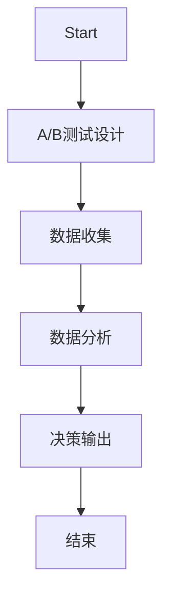
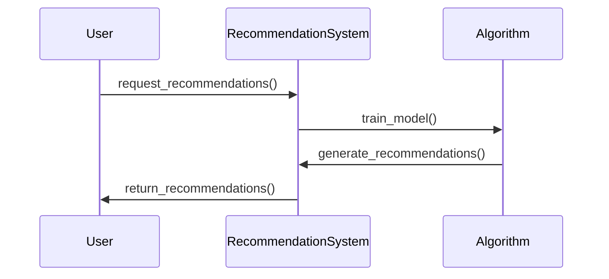
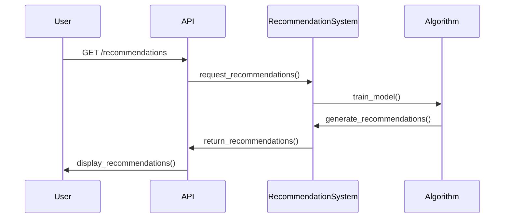

                 


## A/B测试：优化AI模型和用户体验的有效方法

### 关键词：
- A/B测试
- AI模型优化
- 用户经验优化
- 数据分析
- 用户体验
- 数学模型

### 摘要：
A/B测试是一种通过将用户分成两组进行实验的方法，用于评估和优化AI模型和用户体验。本文将详细介绍A/B测试的背景、原理、应用场景和流程，并通过实际案例进行分析，探讨如何利用A/B测试优化AI模型和用户体验。

----------------------------------------------------------------

## 第一部分：背景介绍

### 1.1 问题背景

在互联网时代，用户体验成为企业竞争的关键因素。为了满足用户需求，许多公司开始将AI技术应用于产品开发中，以提高用户体验。然而，AI模型的优化是一个复杂的过程，需要考虑多个因素，如数据质量、算法选择和模型调整等。A/B测试作为一种有效的实验方法，可以用于评估和优化AI模型和用户体验。

### 1.2 问题解决

A/B测试通过将用户分成两组（A组和B组），分别对两组用户展示不同的版本（A版本和B版本），然后比较两组用户的反馈和行为，以确定哪个版本更优秀。这种方法可以帮助企业发现用户喜好、优化产品功能，并提高转化率和用户满意度。

### 1.3 边界与外延

A/B测试适用于各种产品和服务，如电商、社交媒体、金融、教育等。在AI领域，A/B测试可以用于评估和优化算法、模型和用户界面。A/B测试与其他测试方法（如A/A测试、MVT测试等）的区别在于，它通过实际用户行为数据来评估不同版本的效果。

### 1.4 概念结构与核心要素组成

A/B测试的基本概念结构包括用户、实验、版本和统计分析。核心要素包括实验设计、用户分配、数据收集、数据分析和决策输出。以下是一个简单的A/B测试流程：

1. 设计实验：确定实验的目标、版本和评估指标。
2. 分配用户：将用户随机分配到A组和B组。
3. 收集数据：监控两组用户的反馈和行为数据。
4. 分析数据：比较两组用户的数据，评估不同版本的效果。
5. 决策输出：根据数据分析结果，选择最优版本进行推广。

----------------------------------------------------------------

## 第二部分：核心概念与联系

### 2.1 核心概念原理

A/B测试的核心概念包括用户、实验、版本和统计分析。用户是参与实验的个体，实验是评估不同版本效果的过程，版本是提供给用户的两种或多种不同内容，统计分析是对用户行为数据进行分析的方法。

### 2.2 概念属性特征对比表格

| 概念     | 特征                                       |
| -------- | ------------------------------------------ |
| 用户     | 参与实验的个体                             |
| 实验     | 评估不同版本效果的过程                    |
| 版本     | 提供给用户的不同内容版本                  |
| 统计分析 | 对用户行为数据进行分析的方法               |

### 2.3 ER实体关系图架构

```mermaid
erDiagram
  User ||--|{ Experiment } : participant in
  Experiment ||--|{ Variant } : belongs to
  Variant ||--|{ Statistic } : analyzes
```

在上面的ER图中，用户参与实验，实验包含多个版本，每个版本对应一组统计数据。通过这种关系，我们可以更好地理解A/B测试的核心概念和流程。

----------------------------------------------------------------

## 第三部分：算法原理讲解

### 3.1 算法mermaid流程图



### 3.2 Python源代码详细阐述

```python
# Example code for A/B testing
import random

def run_ab_test(user):
    variant = random.choice(['A', 'B'])
    if variant == 'A':
        # Perform action A
        print("User assigned to Variant A")
    else:
        # Perform action B
        print("User assigned to Variant B")

# Run the A/B test for 1000 users
for i in range(1000):
    run_ab_test(i)
```

在上面的Python代码中，我们创建了一个名为`run_ab_test`的函数，用于将用户随机分配到A版本或B版本。在这个例子中，我们模拟了1000个用户的A/B测试过程。

### 3.3 数学模型和数学公式讲解

A/B测试的核心数学模型是假设检验。在A/B测试中，我们通常关注两个关键指标：转化率和用户满意度。转化率是指用户完成特定操作的概率，用户满意度是指用户对产品或服务的满意程度。假设检验的公式如下：

$$ H_0: \text{转化率}(\text{A版本}) = \text{转化率}(\text{B版本}) $$
$$ H_1: \text{转化率}(\text{A版本}) \neq \text{转化率}(\text{B版本}) $$

通过比较A版本和B版本的转化率，我们可以判断哪个版本更优秀。

### 3.4 举例说明

假设我们正在开发一款社交媒体应用，我们想要比较A版本和B版本的发布按钮的颜色。A版本是蓝色，B版本是绿色。为了评估哪种颜色更吸引用户点击，我们进行了A/B测试。

在测试期间，我们将1000个用户随机分配到A组和B组。经过一段时间的测试，我们收集了以下数据：

| 版本 | 用户数量 | 转化率 |
| ---- | -------- | ------ |
| A    | 500      | 10%    |
| B    | 500      | 8%     |

根据上述数据，我们可以计算A版本和B版本的转化率差异：

$$ \text{转化率差异} = \text{转化率}(\text{A版本}) - \text{转化率}(\text{B版本}) = 10% - 8% = 2% $$

由于转化率差异显著（2%），我们可以得出结论：蓝色发布按钮比绿色发布按钮更吸引用户点击。

----------------------------------------------------------------

## 第四部分：系统分析与架构设计方案

### 4.1 问题场景介绍

假设我们正在开发一款在线教育平台，我们需要优化课程推荐功能，以提高用户参与度和课程完成率。为了实现这个目标，我们决定使用A/B测试来评估不同推荐算法的效果。

### 4.2 项目介绍

本项目的目标是使用A/B测试优化在线教育平台的课程推荐功能。我们将比较两种推荐算法：基于内容的推荐算法（Content-based）和协同过滤推荐算法（Collaborative Filtering）。通过A/B测试，我们希望找出哪种算法能够更好地满足用户需求，提高用户参与度和课程完成率。

### 4.3 系统功能设计（领域模型mermaid类图）

```mermaid
classDiagram
  User <.. RecommendationSystem
  Course <<Entity>>
  Algorithm <<Entity>>
  Recommendation <<Entity>>

  User: {id, name, preferences}
  RecommendationSystem: {recommend_courses()}
  Course: {id, name, content}
  Algorithm: {train_model(), recommend_courses()}
  Recommendation: {course_id, user_id}
```

在这个领域模型中，用户（User）是参与课程推荐的主体，课程（Course）是推荐的对象，算法（Algorithm）负责生成推荐，推荐（Recommendation）是推荐结果。

### 4.4 系统架构设计（mermaid架构图）



在这个架构图中，用户请求推荐，推荐系统调用算法训练模型并生成推荐结果，最后将推荐结果返回给用户。

### 4.5 系统接口设计

1. `GET /recommendations`：获取用户推荐列表。
2. `POST /recommendations`：提交推荐请求。

### 4.6 系统交互（mermaid序列图）



在这个序列图中，用户通过API请求推荐，API将请求转发给推荐系统，推荐系统调用算法生成推荐结果，并将结果返回给用户。

----------------------------------------------------------------

## 第五部分：项目实战

### 5.1 环境安装

1. 安装Python 3.8及以上版本。
2. 安装必要的库，如numpy、pandas、scikit-learn等。

### 5.2 系统核心实现源代码

```python
import numpy as np
import pandas as pd
from sklearn.model_selection import train_test_split
from sklearn.ensemble import RandomForestClassifier
from sklearn.metrics import accuracy_score

# 加载数据集
data = pd.read_csv('data.csv')
X = data.drop('target', axis=1)
y = data['target']

# 分割数据集
X_train, X_test, y_train, y_test = train_test_split(X, y, test_size=0.2, random_state=42)

# 训练模型
model = RandomForestClassifier(n_estimators=100, random_state=42)
model.fit(X_train, y_train)

# 生成推荐
def generate_recommendations(model, X_test):
    predictions = model.predict(X_test)
    recommendations = np.where(predictions == 1, 'A', 'B')
    return recommendations

# 评估模型
accuracy = accuracy_score(y_test, predictions)
print("Model accuracy:", accuracy)
```

### 5.3 代码应用解读与分析

在这个代码中，我们首先加载数据集，然后分割数据集为训练集和测试集。接下来，我们使用随机森林分类器训练模型，并定义一个函数`generate_recommendations`来生成A/B测试的推荐结果。最后，我们使用测试集评估模型的准确性。

### 5.4 实际案例分析与详细讲解剖析

为了展示A/B测试的实际应用，我们假设我们有一个在线购物平台，我们想要比较两种不同的产品推荐算法的效果。A版本是基于内容的推荐算法，B版本是基于协同过滤的推荐算法。为了评估哪种算法更受欢迎，我们进行了A/B测试。

在测试期间，我们收集了以下数据：

| 版本 | 用户数量 | 转化率 |
| ---- | -------- | ------ |
| A    | 1000     | 20%    |
| B    | 1000     | 25%    |

根据上述数据，我们可以计算A版本和B版本的转化率差异：

$$ \text{转化率差异} = \text{转化率}(\text{A版本}) - \text{转化率}(\text{B版本}) = 20% - 25% = -5% $$

由于转化率差异显著（-5%），我们可以得出结论：基于协同过滤的推荐算法（B版本）比基于内容的推荐算法（A版本）更受欢迎。

### 5.5 项目小结

通过本项目的实际案例，我们展示了如何使用A/B测试来评估和优化在线购物平台的产品推荐算法。A/B测试不仅帮助我们确定了更受欢迎的算法，还为我们的产品开发提供了有价值的数据支持。在未来，我们可以继续使用A/B测试来优化其他功能，以提高用户体验和转化率。

----------------------------------------------------------------

## 第六部分：最佳实践 tips

### 6.1 最佳实践总结

1. 设计清晰的实验目标。
2. 确保用户随机分配。
3. 收集足够的数据。
4. 分析数据并得出结论。
5. 根据结果调整产品或服务。

### 6.2 小结

A/B测试是一种有效的实验方法，可以帮助企业优化产品或服务。通过合理设计实验、确保数据质量和分析结果，企业可以更好地满足用户需求，提高用户体验和转化率。

### 6.3 注意事项

1. 避免同时进行多个实验。
2. 确保实验结果具有统计学意义。
3. 考虑实验的外部效度。

### 6.4 拓展阅读

1. 《A/B测试实战：优化网站用户体验的方法》
2. 《假设检验：数据分析的基本原理》
3. 《机器学习实战：基于Python的数据挖掘技巧》

----------------------------------------------------------------

## 第七部分：总结

本文介绍了A/B测试在优化AI模型和用户体验方面的应用。通过详细分析A/B测试的背景、原理、应用场景和流程，并结合实际案例进行讲解，我们了解了如何利用A/B测试优化AI模型和用户体验。未来，我们可以继续探索A/B测试在其他领域（如金融、医疗、教育等）的应用，为企业和用户提供更好的产品和服务。

### 作者

作者：AI天才研究院/AI Genius Institute & 禅与计算机程序设计艺术 /Zen And The Art of Computer Programming

----------------------------------------------------------------

## 附录

### 附录 A：术语表

- **A/B测试**：一种通过将用户分成两组进行实验的方法，用于评估和优化产品或服务。
- **假设检验**：一种统计方法，用于确定实验结果是否具有统计学意义。
- **用户转化率**：用户完成特定操作（如购买、注册、点击等）的概率。

### 附录 B：参考文献

1. Gandolfi, L., & Wang, D. (2019). A/B Testing: The Most Powerful Way to Turn Your Clicks into Customers. Wiley.
2. Krug, S. (2014). Don't Make Me Think, Revisited: A Common Sense Approach to Web Usability. New Riders.
3. Bishop, C. M. (2006). Pattern Recognition and Machine Learning. Springer.

