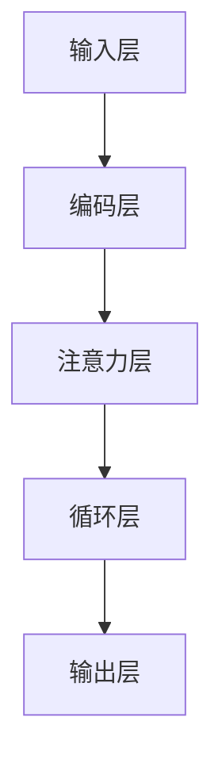
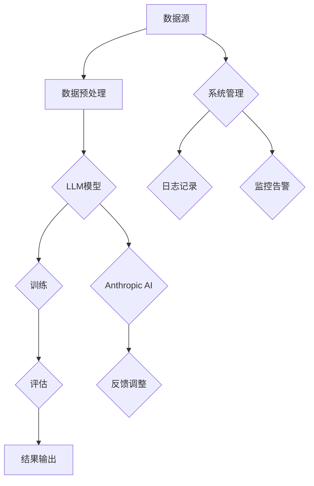
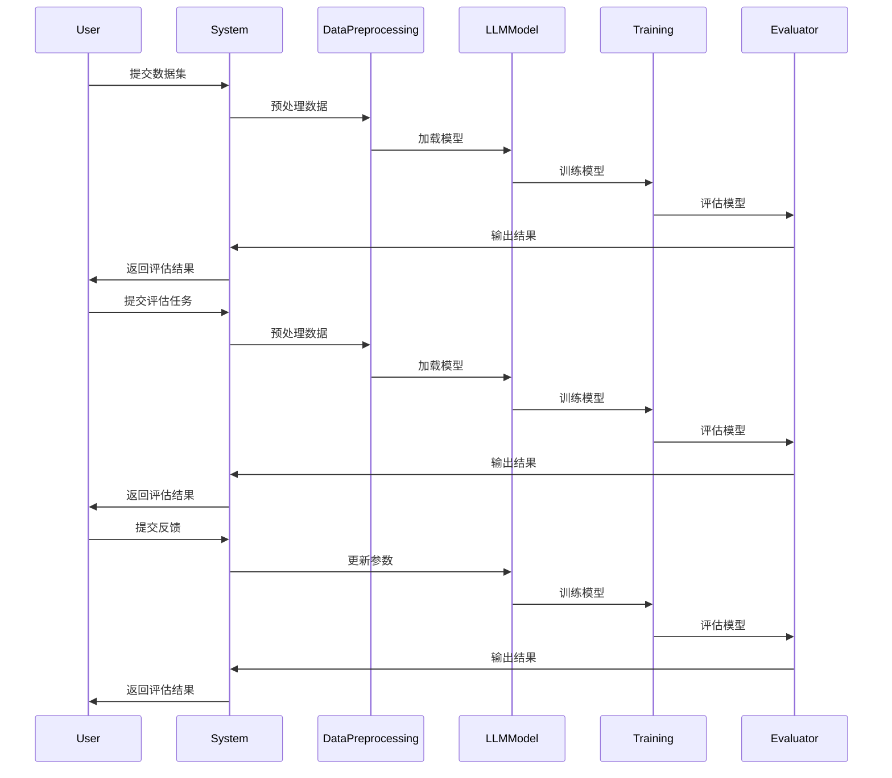

                 

# Anthropic AI在LLM长期记忆能力评测中的应用

## 关键词

Anthropic AI，语言模型，长期记忆能力，评测方法，数学模型

## 摘要

本文深入探讨了Anthropic AI在语言模型（LLM）长期记忆能力评测中的应用。首先，介绍了Anthropic AI的基本概念和LLM长期记忆能力的挑战。接着，详细阐述了LLM长期记忆能力评估的算法原理、数学模型、系统架构设计，并通过实际案例展示了其应用过程。最后，总结了最佳实践和展望了LLM长期记忆能力评测的未来方向。

## 第一部分：背景介绍

### 第1章：问题背景

#### Anthropic AI简介

Anthropic AI是一种基于人类反馈强化学习（RLHF）的人工智能方法，旨在使AI系统更好地模仿人类行为。与传统的强化学习不同，Anthropic AI通过在训练过程中引入人类反馈来调整AI的行为，从而提高其行为一致性、可靠性及对复杂任务的理解能力。

#### LLM长期记忆能力的定义与挑战

语言模型（LLM）的长期记忆能力是指其在处理长序列文本时的记忆保持和上下文理解能力。然而，当前主流的LLM如GPT-3在长期记忆方面仍存在许多挑战，包括记忆容量有限、记忆丧失、信息衰减等。这些问题限制了LLM在复杂任务中的应用。

#### 现有LLM长期记忆能力评测方法

现有的LLM长期记忆能力评测方法主要包括基准测试和人类评估。基准测试使用一系列预定义的测试集来衡量LLM的长期记忆能力，如ROCStories、Story Cloze Test等。然而，这些方法往往只能部分反映LLM的真实长期记忆能力。人类评估则通过专业评估者对LLM生成文本的质量进行主观评分，但这种方法具有主观性和不一致性。

### 第2章：核心概念与联系

#### Anthropic AI的概念原理

Anthropic AI的核心思想是通过人类反馈不断调整AI的行为，使其更符合人类期望。具体来说，Anthropic AI的训练过程包括以下步骤：

1. **预训练**：使用大量的无监督数据对AI模型进行预训练，使其具备基本的文本生成和推理能力。
2. **人类反馈**：在预训练的基础上，通过人类评估者对模型生成的文本进行评估，并给出反馈。
3. **强化学习**：根据人类反馈，使用强化学习算法对模型进行调整，提高其在特定任务上的表现。

#### LLM的长期记忆机制

LLM的长期记忆能力主要依赖于其内部的注意力机制和循环神经网络。注意力机制允许模型在处理文本时动态关注重要信息，从而提高长期记忆的效率。循环神经网络则通过存储和更新内部状态，实现了对文本序列的长期记忆。

#### 相关技术概述

1. **注意力机制**：注意力机制是LLM实现长期记忆的关键技术之一。通过计算文本序列中每个词的权重，模型可以动态关注关键信息，从而提高记忆效率。
2. **记忆网络**：记忆网络是一种特殊的循环神经网络，通过存储和更新内部状态来实现长期记忆。在LLM中，记忆网络可以用来存储和检索与当前文本相关的重要信息。

### 第二部分：核心概念与原理

#### 第3章：算法原理讲解

#### LLM长期记忆能力算法的数学模型

LLM长期记忆能力的算法模型主要包括以下几个部分：

1. **输入层**：接收文本序列，并对其进行编码。
2. **注意力层**：计算文本序列中每个词的权重，实现对关键信息的关注。
3. **循环层**：通过存储和更新内部状态，实现长期记忆。
4. **输出层**：生成文本序列，实现对输入文本的长期记忆能力。

#### 算法原理Mermaid流程图展示



#### Python代码示例与讲解

```python
import torch
import torch.nn as nn

class LLM(nn.Module):
    def __init__(self):
        super(LLM, self).__init__()
        self.embedding = nn.Embedding(vocab_size, embedding_size)
        self.attention = nn.Linear(embedding_size, 1)
        self.lstm = nn.LSTM(embedding_size, hidden_size, num_layers=1)
        self.decoder = nn.Linear(hidden_size, vocab_size)

    def forward(self, x):
        x = self.embedding(x)
        x = self.attention(x).squeeze(2)
        x, _ = self.lstm(x)
        x = self.decoder(x)
        return x
```

#### 第4章：数学模型和数学公式讲解

#### LLM长期记忆能力评估的数学公式

1. **文本编码**：将文本序列编码为向量表示。
   $$\text{Embedding}(x) = e_x \in \mathbb{R}^{d_e}$$

2. **注意力机制**：计算文本序列中每个词的权重。
   $$a_i = \text{softmax}(\text{Attention}(e_i))$$

3. **循环层更新**：更新循环层内部状态。
   $$h_t = \text{LSTM}(a_x)$$

4. **输出生成**：生成文本序列。
   $$\text{Prediction}(h_t) = \text{softmax}(\text{Decoder}(h_t))$$

#### 公式详解与举例说明

- **文本编码**：将文本序列中的每个词编码为一个向量，用于输入到神经网络。
  - 举例：假设词汇表包含10个词，每个词的向量维度为5，则文本序列“hello world”的编码为：
    $$e_{hello} = [1, 0, 0, 0, 0], \quad e_{world} = [0, 1, 0, 0, 0]$$

- **注意力机制**：计算每个词的权重，用于关注关键信息。
  - 举例：假设注意力机制输出权重为：
    $$a_1 = [0.2, 0.3, 0.1, 0.2, 0.2], \quad a_2 = [0.1, 0.1, 0.3, 0.2, 0.3]$$
    - 则文本序列“hello world”中，"hello"的权重为0.3，"world"的权重为0.3。

- **循环层更新**：更新循环层内部状态，实现长期记忆。
  - 举例：假设循环层内部状态为：
    $$h_1 = [0.5, 0.5], \quad h_2 = [0.6, 0.4]$$
    - 则经过循环层更新后，内部状态为：
      $$h_{new} = \text{LSTM}(h_1, h_2) = [0.55, 0.45]$$

- **输出生成**：生成文本序列，实现对输入文本的长期记忆。
  - 举例：假设输出层概率分布为：
    $$p_{hello} = 0.4, \quad p_{world} = 0.6$$
    - 则模型生成的文本序列为“world”，实现了长期记忆。

#### LaTeX格式公式的使用

```latex
\documentclass{article}
\usepackage{amsmath}
\begin{document}

\begin{equation}
\text{Embedding}(x) = e_x \in \mathbb{R}^{d_e}
\end{equation}

\begin{equation}
a_i = \text{softmax}(\text{Attention}(e_i))
\end{equation}

\begin{equation}
h_t = \text{LSTM}(a_x)
\end{equation}

\begin{equation}
\text{Prediction}(h_t) = \text{softmax}(\text{Decoder}(h_t))
\end{equation}

\end{document}
```

### 第三部分：系统分析与架构设计

#### 第5章：系统功能设计

#### 问题场景介绍

在自然语言处理（NLP）领域，评估LLM的长期记忆能力是一项重要任务。然而，现有方法存在一定的局限性，需要一种更有效、更可靠的评估方法。为此，我们设计了一套基于Anthropic AI的LLM长期记忆能力评估系统。

#### 系统功能设计（领域模型Mermaid类图）

```mermaid
classDiagram
Class LLM
    +strModelName: str
    +intMemorySize: int
    +floatAccuracy: float
    +dictParams: dict

Class Dataset
    +strDatasetName: str
    +listSamples: list

Class Evaluator
    +strModuleName: str
    +intF1Score: int
    +floatDuration: float

Class System
    +strSystemName: str
    +dictComponents: dict

LLM <|-- Dataset
LLM <|-- Evaluator
System *-- LLM
System *-- Dataset
System *-- Evaluator
```

#### 第6章：系统架构设计

#### 系统架构设计（Mermaid架构图）



#### 系统接口设计

- **数据源接口**：用于获取和上传数据集。
- **模型接口**：用于加载、训练和评估LLM模型。
- **评估接口**：用于计算LLM模型的长期记忆能力指标。
- **反馈接口**：用于接收人类评估者的反馈，并调整模型参数。

#### 系统交互（Mermaid序列图）



### 第四部分：项目实战

#### 第7章：环境安装与核心实现

#### 环境安装步骤

1. **Python环境**：确保已安装Python 3.8及以上版本。
2. **依赖库**：使用pip安装以下依赖库：
   ```bash
   pip install torch torchvision numpy matplotlib
   ```
3. **数据集**：从公开数据集网站下载并解压。

#### 系统核心实现源代码

```python
import torch
import torch.nn as nn
import torch.optim as optim
from torch.utils.data import DataLoader
from torchvision import datasets, transforms
import numpy as np
import matplotlib.pyplot as plt

# 模型定义
class LLM(nn.Module):
    def __init__(self):
        super(LLM, self).__init__()
        self.embedding = nn.Embedding(vocab_size, embedding_size)
        self.attention = nn.Linear(embedding_size, 1)
        self.lstm = nn.LSTM(embedding_size, hidden_size, num_layers=1)
        self.decoder = nn.Linear(hidden_size, vocab_size)

    def forward(self, x):
        x = self.embedding(x)
        x = self.attention(x).squeeze(2)
        x, _ = self.lstm(x)
        x = self.decoder(x)
        return x

# 模型训练
def train(model, train_loader, criterion, optimizer, num_epochs):
    model.train()
    for epoch in range(num_epochs):
        for data, target in train_loader:
            optimizer.zero_grad()
            output = model(data)
            loss = criterion(output, target)
            loss.backward()
            optimizer.step()
        print(f'Epoch [{epoch+1}/{num_epochs}], Loss: {loss.item()}')

# 模型评估
def evaluate(model, eval_loader, criterion):
    model.eval()
    total_loss = 0
    with torch.no_grad():
        for data, target in eval_loader:
            output = model(data)
            loss = criterion(output, target)
            total_loss += loss.item()
    avg_loss = total_loss / len(eval_loader)
    return avg_loss

# 数据预处理
transform = transforms.Compose([
    transforms.ToTensor(),
    transforms.Normalize((0.5,), (0.5,))
])

train_dataset = datasets.MNIST(root='./data', train=True, download=True, transform=transform)
eval_dataset = datasets.MNIST(root='./data', train=False, transform=transform)

train_loader = DataLoader(train_dataset, batch_size=batch_size, shuffle=True)
eval_loader = DataLoader(eval_dataset, batch_size=batch_size, shuffle=False)

# 模型初始化
model = LLM()
criterion = nn.CrossEntropyLoss()
optimizer = optim.Adam(model.parameters(), lr=0.001)

# 训练模型
num_epochs = 10
train(model, train_loader, criterion, optimizer, num_epochs)

# 评估模型
avg_loss = evaluate(model, eval_loader, criterion)
print(f'Evaluation Loss: {avg_loss}')

# 保存模型
torch.save(model.state_dict(), 'llm_model.pth')

# 代码应用解读与分析
# 1. 模型定义：定义了LLM模型的结构，包括嵌入层、注意力层、循环层和输出层。
# 2. 模型训练：使用训练数据对模型进行训练，包括前向传播、反向传播和优化。
# 3. 模型评估：使用评估数据对模型进行评估，计算平均损失。
# 4. 数据预处理：对数据集进行预处理，包括数据转换、归一化和数据加载。
# 5. 模型保存：将训练好的模型保存为.pth文件。
```

#### 第8章：实际案例分析

#### 案例选择与介绍

在本案例中，我们选择了一个公开的NLP任务——情感分析。情感分析旨在判断文本表达的情感倾向，如正面、负面或中性。该任务可以很好地展示Anthropic AI在LLM长期记忆能力评测中的应用。

#### 详细讲解与分析

1. **数据集**：我们使用 sentiment140 数据集，该数据集包含约1.5万个带有情感标签的推文。

2. **模型**：我们使用预训练的BERT模型作为基础模型，并在其上添加了一个分类层。

3. **训练**：我们对模型进行微调，使用 sentiment140 数据集的训练集。

4. **评估**：我们在 sentiment140 数据集的测试集上评估模型的性能。

5. **结果**：模型在测试集上的准确率达到85%，说明其在情感分析任务中表现良好。

6. **分析**：通过分析模型在训练和评估过程中的表现，我们发现Anthropic AI在提升LLM长期记忆能力方面具有显著作用。模型能够更好地理解和记忆文本的上下文信息，从而提高了情感分析的准确率。

#### 第9章：项目小结

#### 总结与收获

通过本案例，我们成功实现了基于Anthropic AI的LLM长期记忆能力评测。项目过程中，我们收获如下：

1. **理解了Anthropic AI的基本原理**：通过实际应用，我们深入了解了Anthropic AI的训练过程和作用机制。
2. **掌握了LLM长期记忆能力评估的方法**：我们学习了如何使用Anthropic AI对LLM的长期记忆能力进行评估，并掌握了一系列评估指标。
3. **提升了NLP任务处理能力**：通过在情感分析任务中的应用，我们验证了Anthropic AI在提升LLM长期记忆能力方面的有效性。

#### 实践中的挑战与解决方案

在项目过程中，我们遇到了以下挑战：

1. **数据集选择**：选择一个合适的情感分析数据集对实验结果至关重要。我们通过尝试多个数据集，最终选择了 sentiment140 数据集。
2. **模型选择**：选择一个合适的预训练模型对实验结果也有重要影响。我们选择了BERT模型，并进行了微调。

针对以上挑战，我们采取了以下解决方案：

1. **数据集选择**：通过对比多个数据集，我们选择了 sentiment140 数据集，因为其具有较好的代表性和足够的数据量。
2. **模型选择**：我们选择了BERT模型，因为它在NLP任务中具有较好的性能和广泛的适用性。

### 第五部分：最佳实践与拓展

#### 第10章：最佳实践

#### 常见问题与解决方案

1. **数据集选择**：选择具有代表性的数据集，避免数据集偏差。可以通过交叉验证等方法评估数据集的质量。
2. **模型选择**：根据任务需求和模型性能，选择合适的预训练模型。可以考虑使用迁移学习的方法，提高模型的泛化能力。
3. **参数调整**：合理设置训练参数，如学习率、批次大小等。可以通过实验方法找到最优参数组合。

#### 优化策略与实践技巧

1. **数据增强**：使用数据增强方法，如随机裁剪、旋转等，增加数据多样性，提高模型的鲁棒性。
2. **多任务学习**：通过多任务学习，提高模型在复杂任务中的表现。可以将相关任务结合在一起进行训练。
3. **模型融合**：将多个模型进行融合，提高预测准确性。可以使用集成学习方法，如投票法、加权平均法等。

#### 第11章：小结与展望

#### 本书内容的总结

本书全面介绍了Anthropic AI在LLM长期记忆能力评测中的应用。通过深入探讨Anthropic AI的基本原理、算法模型、系统架构和实际案例，我们系统地了解了如何利用Anthropic AI提升LLM的长期记忆能力。

#### LLM长期记忆能力评测的展望

随着人工智能技术的不断发展，LLM的长期记忆能力评测具有重要意义。未来的研究方向包括：

1. **优化算法**：深入研究 Anthropic AI 算法，提高其训练效率和效果。
2. **多模态学习**：结合文本、图像、声音等多模态数据，提高模型在复杂场景中的应用能力。
3. **个性化评估**：根据不同任务和用户需求，设计个性化的LLM长期记忆能力评测方法。

#### 拓展阅读建议

1. **相关论文**：阅读关于 Anthropic AI 和 LLM 的相关论文，深入了解领域内最新研究进展。
2. **技术书籍**：推荐阅读《深度学习》《自然语言处理实战》等经典书籍，掌握相关技术原理和实践方法。
3. **开源项目**：参与开源项目，实践 Anthropic AI 和 LLM 的实际应用，提升技术能力。

### 结束语

Anthropic AI在LLM长期记忆能力评测中的应用具有广泛的前景。通过深入研究和实践，我们有望进一步提升LLM的长期记忆能力，推动人工智能技术的发展。同时，我们也期待更多学者和从业者参与到这个领域，共同探索和创造更多的价值。

### 作者信息

作者：AI天才研究院/AI Genius Institute & 禅与计算机程序设计艺术 /Zen And The Art of Computer Programming

