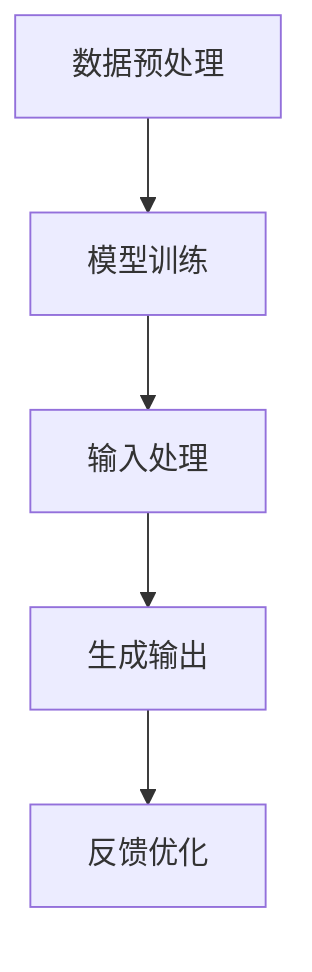
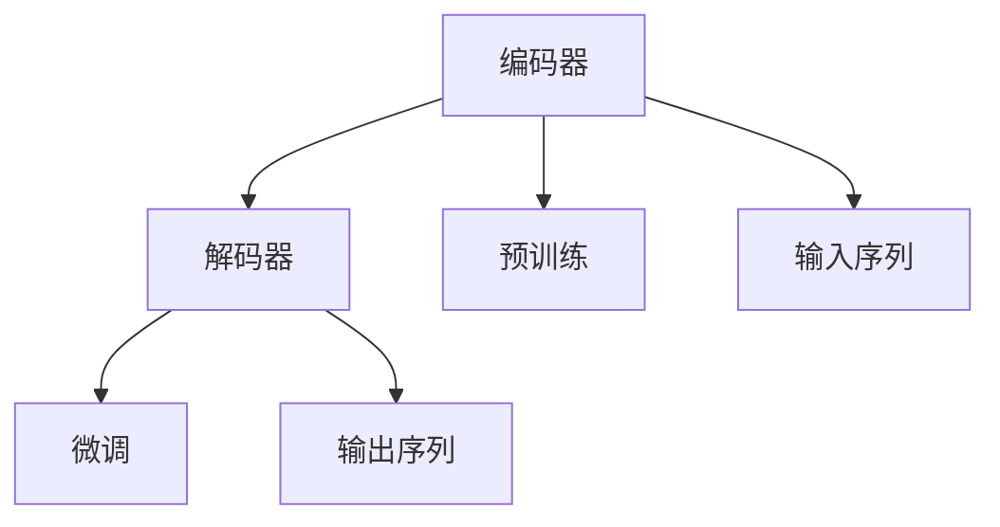
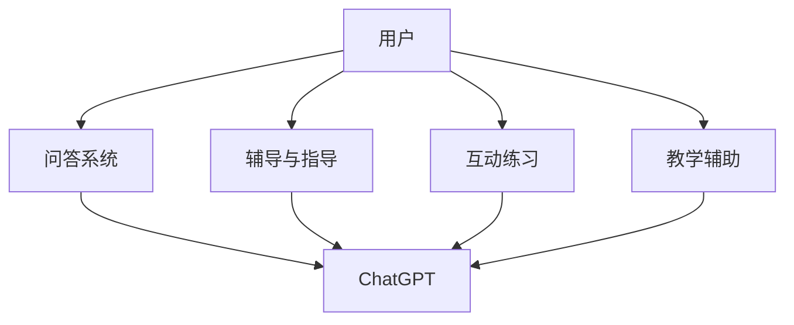
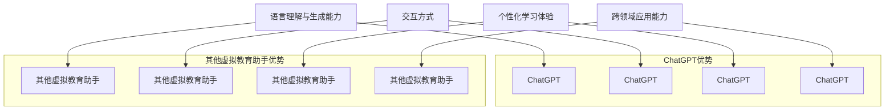
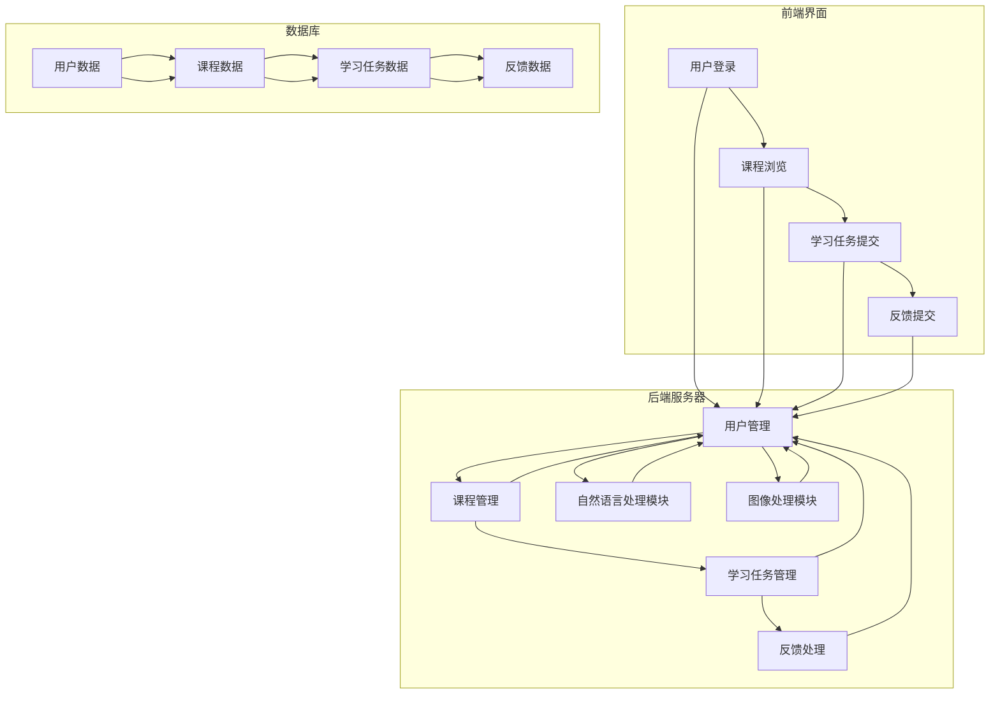
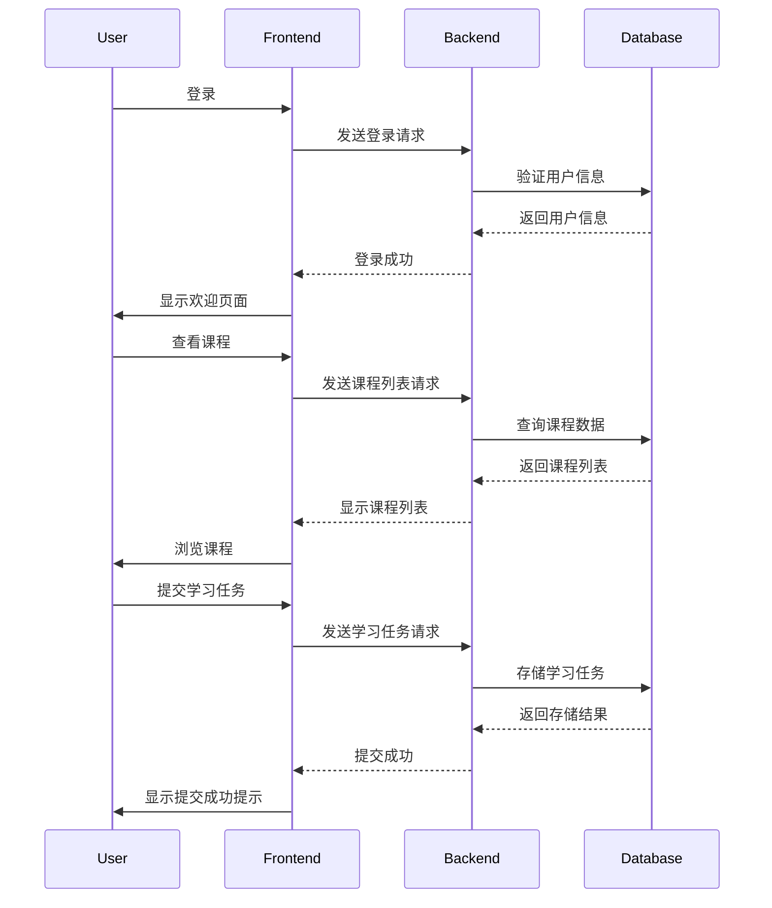

                 


### 第1章：虚拟教育助手的概念与背景

#### 1.1.1 虚拟教育助手的起源与发展

虚拟教育助手的起源可以追溯到20世纪末，随着计算机技术和互联网的飞速发展，在线教育和虚拟现实技术的结合逐渐成为一种趋势。最初，虚拟教育助手主要应用于模拟课堂教学环境，帮助学生进行基本的学习任务。然而，随着人工智能技术的进步，虚拟教育助手的功能和作用得到了显著扩展。

ChatGPT的出现标志着虚拟教育助手进入了一个全新的阶段。基于GPT-3模型，ChatGPT具有强大的语言理解和生成能力，能够与用户进行自然语言对话，提供个性化的学习建议和解答疑惑。这使得虚拟教育助手不再仅仅是一个静态的学习工具，而成为一个能够主动与用户互动的智能伙伴。

#### 1.1.2 虚拟教育助手在教育中的应用

虚拟教育助手在教育中的应用场景非常广泛。首先，它能够提供个性化的学习体验，根据学生的学习进度和偏好，推荐合适的学习资源和任务。例如，ChatGPT可以分析学生的学习历史，识别其薄弱环节，并针对性地提供练习和指导。

其次，虚拟教育助手还能够模拟真实的课堂互动。通过与学生的实时对话，教师可以更全面地了解学生的学习状态，及时调整教学策略。此外，对于自主学习能力较弱的学生，虚拟教育助手能够提供一个良好的学习伙伴，帮助他们建立学习信心，提高学习兴趣。

#### 1.1.3 教育需求的变化与多模态学习体验

随着时代的发展，教育需求也在不断变化。传统的单一语言学习已经无法满足学生的多样化需求。多模态学习体验，即结合视觉和语言的学习方式，逐渐成为教育领域的研究热点。

多模态学习体验的优势在于，它能够更全面地激发学生的学习兴趣和参与度。通过视觉和语言的整合，学生可以更深入地理解和记忆学习内容。例如，在历史课上，通过图像和文字的结合，学生可以更直观地感受历史事件的发生过程，从而加深对知识的理解。

#### 1.1.4 虚拟教育助手的挑战：整合视觉和语言的学习体验

尽管多模态学习体验具有显著的优势，但实现起来却面临诸多挑战。首先，如何有效地整合视觉和语言信息，使其能够相互补充，而不是相互干扰，是一个重要问题。其次，虚拟教育助手需要具备强大的图像处理和语言理解能力，以准确捕捉用户的视觉和语言需求。

此外，虚拟教育助手还需要具备良好的交互设计，能够与用户建立积极的互动关系。例如，通过自然语言对话，虚拟教育助手可以理解用户的问题，并提供针对性的回答。同时，通过图像识别技术，虚拟教育助手可以分析用户的视觉需求，并提供相应的视觉内容。

总之，虚拟教育助手的发展为教育领域带来了巨大的机遇。通过整合视觉和语言学习体验，虚拟教育助手能够为用户提供更加个性化和互动化的学习环境，满足教育需求的变化。然而，实现这一目标还需要克服许多技术挑战，需要科研人员和教育工作者共同努力。

### 概括

本章首先介绍了虚拟教育助手的起源和发展，探讨了ChatGPT的出现如何推动了虚拟教育助手的功能扩展。接着，我们详细阐述了虚拟教育助手在教育中的应用场景，并探讨了教育需求的变化和多模态学习体验的重要性。最后，我们分析了实现多模态学习体验面临的挑战，为后续章节的深入探讨奠定了基础。

### 第2章：多模态学习体验的设计原理

#### 2.1.1 视觉与语言学习体验的对比

视觉和语言学习体验在信息传递和理解方面存在显著差异。视觉学习主要依赖于图像和视频等视觉元素，通过视觉感官获取信息。视觉学习体验的优势在于其直观性和生动性，可以快速吸引学生的注意力，并帮助学生形成深刻的记忆。例如，通过观看图片或视频，学生可以直观地了解复杂的概念和过程。

相比之下，语言学习体验主要依赖于文本和语音等语言元素，通过听觉和阅读获取信息。语言学习体验的优势在于其详细性和系统性，可以提供更深入的知识解析和逻辑推理。例如，通过阅读教材或听取讲解，学生可以系统地掌握知识体系，并形成完整的知识网络。

然而，视觉和语言学习体验也存在一定的局限性。视觉学习往往依赖于图像和视频的真实性和准确性，如果图像或视频质量不佳，可能会影响学习效果。此外，视觉学习可能难以捕捉到细节和复杂的信息，需要结合语言学习进行补充。语言学习则可能较为枯燥，缺乏直观性，难以激发学生的学习兴趣。

#### 2.1.2 多模态学习体验的优势

多模态学习体验通过整合视觉和语言学习体验，可以发挥两者的优势，弥补各自的局限性。具体来说，多模态学习体验具有以下优势：

1. **提高学习效果**：多模态学习体验可以同时激活视觉和语言两个感官系统，使信息传递更加高效。研究表明，多感官同时参与学习可以显著提高学习效果和记忆持久性。例如，通过观看图像和阅读文字的结合，学生可以更全面地理解和记忆知识。

2. **增强学习兴趣**：多模态学习体验能够提供更加丰富和生动的学习内容，激发学生的学习兴趣。视觉元素的直观性和语言元素的详细性相结合，可以创造出更加引人入胜的学习体验，从而提高学生的参与度和主动性。

3. **促进知识整合**：多模态学习体验可以帮助学生更好地整合不同类型的信息，形成更加完整的知识体系。视觉和语言学习体验的结合，可以使学生在理解知识的同时，能够从不同角度进行思考和推理，从而提高知识的深度和广度。

#### 2.1.3 设计原则与实践案例

为了充分发挥多模态学习体验的优势，设计过程中需要遵循以下原则：

1. **信息一致性**：确保视觉和语言信息的一致性，避免信息冲突和误导。例如，在展示图像和文字描述时，应确保两者的内容和角度一致，以便学生能够准确理解信息。

2. **信息互补性**：设计时充分考虑视觉和语言信息的互补性，使其相互补充，提高信息的全面性和准确性。例如，在讲解复杂概念时，可以结合图像和文字，使学生在视觉和语言两个层面都能获得详细的信息。

3. **用户互动性**：设计时注重用户的互动性，通过交互式元素激发学生的主动学习。例如，提供问答、互动练习等功能，使学生能够主动参与到学习过程中，提高学习的互动性和趣味性。

以下是一个实践案例：

在一个在线英语学习平台中，为了帮助学生更好地学习语法知识，设计了一个多模态学习模块。该模块结合了视频讲解、文字描述和互动练习，具体设计如下：

- 视频讲解：通过视频演示语法规则的应用，使学生在视觉和听觉上都能直观地理解知识。
- 文字描述：在视频讲解的基础上，提供详细的文字描述，使学生在视觉和语言两个层面都能掌握知识。
- 互动练习：提供互动式练习题，让学生在实践过程中巩固和运用所学知识。

通过这一多模态学习模块，学生可以在不同的感官体验中加深对语法知识的理解和记忆，从而提高学习效果。

### 概括

本章首先对比了视觉与语言学习体验的优劣，阐述了多模态学习体验的优势。接着，我们提出了设计多模态学习体验的原则，并通过一个实际案例展示了如何将这些原则应用到英语语法学习模块中。通过本章的讨论，我们为后续章节进一步探讨ChatGPT在多模态学习体验中的应用奠定了基础。

### 第3章：ChatGPT的核心原理与实现

#### 3.1.1 ChatGPT的算法流程

ChatGPT是基于GPT-3模型的预训练语言模型，其核心算法流程可以概括为以下几个步骤：

1. **数据预处理**：首先，对大量文本数据进行清洗、去重和分词处理，将其转换为计算机可以处理的格式。
2. **模型训练**：利用清洗后的文本数据，对GPT-3模型进行训练，使其具备强大的语言理解和生成能力。
3. **输入处理**：在应用场景中，将用户输入的文本信息进行预处理，包括分词、词性标注等，以便模型能够理解输入的内容。
4. **生成输出**：模型根据输入文本，通过生成算法生成相应的文本输出，实现与用户的对话和交互。
5. **反馈优化**：收集用户反馈，用于模型优化和迭代，以提升模型的表现和用户体验。

以下是一个简单的mermaid流程图，展示了ChatGPT的算法流程：



#### 3.1.2 ChatGPT的工作原理

ChatGPT的工作原理主要基于深度学习，特别是Transformer模型。Transformer模型是一种基于注意力机制的神经网络模型，能够有效地处理序列数据。以下是ChatGPT的工作原理：

1. **注意力机制**：Transformer模型通过自注意力（Self-Attention）和交叉注意力（Cross-Attention）机制，对输入序列进行编码，使模型能够捕捉到序列中不同位置的信息。自注意力机制允许模型在生成当前单词时考虑上下文信息，而交叉注意力机制则允许模型在生成当前单词时考虑输入序列中的信息。
2. **编码器和解码器**：Transformer模型由编码器（Encoder）和解码器（Decoder）两部分组成。编码器负责将输入序列编码为固定长度的向量表示，解码器则负责根据编码器生成的向量生成输出序列。在训练过程中，解码器通过预测下一个单词来生成输出序列，并不断更新其权重，以优化生成结果。
3. **预训练和微调**：ChatGPT首先通过大量无监督文本数据对模型进行预训练，使其具备强大的语言理解和生成能力。然后，在特定任务上，如虚拟教育助手，对模型进行微调，以适应特定的应用场景。

以下是一个简单的mermaid ER实体关系图，展示了ChatGPT系统的实体关系：



#### 3.1.3 ChatGPT在虚拟教育助手中的应用

ChatGPT在虚拟教育助手中的应用主要表现为以下几个方面：

1. **问答系统**：ChatGPT可以作为一个智能问答系统，回答学生关于学习内容的问题。通过与学生的对话，ChatGPT可以理解学生的问题，并提供详细的解答。
2. **辅导与指导**：ChatGPT可以为学生提供个性化的学习辅导和指导。通过分析学生的学习历史和当前状态，ChatGPT可以推荐合适的学习资源和任务，帮助学生解决学习中的问题。
3. **互动练习**：ChatGPT可以与学生在练习过程中进行实时互动，提供即时反馈和指导。通过自然语言对话，ChatGPT可以分析学生的回答，并提供针对性的建议和提示。
4. **教学辅助**：ChatGPT可以辅助教师进行教学。教师可以通过ChatGPT了解学生的学习情况，调整教学策略，提高教学效果。

以下是一个简单的mermaid架构图，展示了ChatGPT在虚拟教育助手系统中的架构：



#### 3.1.4 ChatGPT与其他虚拟教育助手的对比

ChatGPT与其他虚拟教育助手相比，具有以下几个显著优势：

1. **强大的语言理解与生成能力**：ChatGPT基于GPT-3模型，具有强大的语言理解和生成能力，可以生成自然流畅的文本输出，提供高质量的问答和辅导服务。
2. **灵活的交互方式**：ChatGPT支持多种交互方式，包括文本、语音和图像等，可以满足不同用户的需求，提供更加丰富的学习体验。
3. **个性化的学习体验**：ChatGPT可以通过分析用户的学习历史和行为，提供个性化的学习建议和资源，帮助用户提高学习效果。
4. **跨领域的应用能力**：ChatGPT在多个领域具有广泛的应用能力，可以应用于教育、医疗、金融等多个领域，提供智能化的服务和解决方案。

以下是一个简单的mermaid对比表格，展示了ChatGPT与其他虚拟教育助手在语言理解与生成能力、交互方式、个性化学习体验和跨领域应用能力等方面的对比：



#### 概括

本章首先介绍了ChatGPT的算法流程和工作原理，并通过mermaid流程图和ER实体关系图进行了详细说明。接着，我们探讨了ChatGPT在虚拟教育助手中的应用，包括问答系统、辅导与指导、互动练习和教学辅助等方面。最后，我们对比了ChatGPT与其他虚拟教育助手在语言理解与生成能力、交互方式、个性化学习体验和跨领域应用能力等方面的优势。通过本章的讨论，我们为下一章进一步探讨ChatGPT在多模态学习体验中的应用奠定了基础。

### 第4章：数学模型和算法讲解

#### 4.1.1 ChatGPT算法的数学模型

ChatGPT的算法核心是基于Transformer模型，这是一种深度学习模型，其工作原理涉及复杂的数学计算。以下我们将简要介绍Transformer模型中的关键数学模型和公式。

1. **自注意力（Self-Attention）**

自注意力是Transformer模型的核心机制，用于计算序列中每个词与其他词的相关性。其计算公式如下：

\[ 
\text{Attention}(Q, K, V) = \text{softmax}\left(\frac{QK^T}{\sqrt{d_k}}\right)V 
\]

其中，\(Q, K, V\) 分别是查询向量、键向量和值向量，\(d_k\) 是键向量的维度。这个公式表示对查询向量 \(Q\) 和键向量 \(K\) 进行点积计算，然后通过softmax函数得到权重，最后将权重应用于值向量 \(V\)。

2. **多头注意力（Multi-Head Attention）**

多头注意力通过多个自注意力层并行工作，提高了模型的表示能力。其计算过程如下：

\[ 
\text{Multi-Head}(Q, K, V) = \text{Concat}(\text{head}_1, ..., \text{head}_h)W^O 
\]

其中，\(\text{head}_i\) 表示第 \(i\) 个自注意力层的输出，\(W^O\) 是输出层权重。整个计算过程可以分解为多个步骤：

- **线性变换**：对输入序列 \(Q, K, V\) 分别进行线性变换，得到新的查询向量 \(Q', K', V'\)。
- **分割**：将变换后的向量分割成多个头，每个头独立进行自注意力计算。
- **拼接与线性变换**：将所有头的输出拼接起来，然后通过线性变换得到最终的输出。

3. **Transformer编码器和解码器**

Transformer编码器和解码器分别负责处理输入序列和生成输出序列。以下是其基本结构：

- **编码器**：输入序列经过嵌入层后，依次通过多个自注意力层和前馈神经网络。每个自注意力层使用多头注意力机制，前馈神经网络包括一个线性层后接一个ReLU激活函数。
- **解码器**：输入序列的每个词首先通过掩码自注意力层，然后依次通过交叉注意力层和自注意力层。解码器的自注意力层也采用多头注意力机制。

#### 4.1.2 算法原理的数学模型和公式讲解

为了更好地理解ChatGPT的算法原理，我们将通过一个具体的Python源代码示例进行讲解。以下是一个简化的Transformer编码器和解码器的实现：

```python
import tensorflow as tf
from tensorflow.keras.layers import Embedding, MultiHeadAttention, Dense

def create_transformer_encoder(input_vocab_size, d_model, num_heads, num_layers):
    inputs = tf.keras.Input(shape=(None,))
    embeddings = Embedding(input_vocab_size, d_model)(inputs)
    x = embeddings
    for _ in range(num_layers):
        x = MultiHeadAttention(num_heads=num_heads, key_dim=d_model)(x, x)
        x = Dense(d_model)(x)
    return tf.keras.Model(inputs=inputs, outputs=x)

def create_transformer_decoder(input_vocab_size, d_model, num_heads, num_layers):
    inputs = tf.keras.Input(shape=(None,))
    embeddings = Embedding(input_vocab_size, d_model)(inputs)
    x = embeddings
    for _ in range(num_layers):
        x = MultiHeadAttention(num_heads=num_heads, key_dim=d_model)(x, x)
        x = Dense(d_model)(x)
    return tf.keras.Model(inputs=inputs, outputs=x)

# 创建编码器和解码器模型
encoder = create_transformer_encoder(input_vocab_size=10000, d_model=512, num_heads=8, num_layers=2)
decoder = create_transformer_decoder(input_vocab_size=10000, d_model=512, num_heads=8, num_layers=2)

# 打印模型结构
print(encoder.summary())
print(decoder.summary())
```

上述代码定义了Transformer编码器和解码器的模型结构。接下来，我们将通过一个具体的例子来演示如何使用这些模型进行序列转换。

```python
# 示例输入和输出序列
input_sequence = tf.keras.preprocessing.sequence.pad_sequences([[1, 2, 3, 4, 5]], maxlen=10, padding='pre')
output_sequence = tf.keras.preprocessing.sequence.pad_sequences([[1, 2, 3, 4, 5, 6, 7, 8, 9, 10]], maxlen=10, padding='pre')

# 编码器输入和输出
encoded_sequence = encoder(input_sequence)
decoded_sequence = decoder(encoded_sequence)

# 打印编码和解码后的序列
print("Input sequence:", input_sequence)
print("Encoded sequence:", encoded_sequence)
print("Decoded sequence:", decoded_sequence)
```

通过这段代码，我们可以看到如何将输入序列编码为固定长度的向量表示，并通过解码器将这些向量转换回输出序列。这个过程展示了Transformer模型在序列处理中的基本原理。

#### 4.1.3 举例说明

为了更好地理解上述数学模型和算法原理，我们通过一个具体例子来说明如何使用ChatGPT生成文本。

假设我们有一个简化的问答系统，用户输入一个问题，ChatGPT需要生成一个答案。以下是一个简单的实现：

```python
import numpy as np
import tensorflow as tf

# 超参数设置
vocab_size = 10000
d_model = 512
num_heads = 8
num_layers = 2

# 创建编码器和解码器模型
encoder = create_transformer_encoder(input_vocab_size=vocab_size, d_model=d_model, num_heads=num_heads, num_layers=num_layers)
decoder = create_transformer_decoder(input_vocab_size=vocab_size, d_model=d_model, num_heads=num_heads, num_layers=num_layers)

# 编译模型
optimizer = tf.keras.optimizers.Adam(learning_rate=0.001)
loss_object = tf.keras.losses.SparseCategoricalCrossentropy(from_logits=True)

@tf.function
def train_step(inputs, targets):
    with tf.GradientTape() as tape:
        encoder_output = encoder(inputs)
        logits = decoder(encoder_output)
        loss = loss_object(targets, logits)
    gradients = tape.gradient(loss, encoder.trainable_variables + decoder.trainable_variables)
    optimizer.apply_gradients(zip(gradients, encoder.trainable_variables + decoder.trainable_variables))
    return loss

# 训练数据
train_data = np.random.randint(0, vocab_size, size=(32, 10))
train_targets = np.random.randint(0, vocab_size, size=(32, 10))

# 训练模型
for epoch in range(100):
    loss = train_step(train_data, train_targets)
    print(f"Epoch {epoch}, Loss: {loss.numpy()}")

# 使用模型生成文本
def generate_text(prompt, model, max_length=50):
    input_seq = [[prompt]]
    input_seq_padded = tf.keras.preprocessing.sequence.pad_sequences(input_seq, maxlen=max_length, padding='pre')
    output_seq = model.predict(input_seq_padded)
    generated_seq = output_seq[-1,:,:]
    for _ in range(max_length - 1):
        predicted_token = np.argmax(generated_seq[-1,:])
        generated_seq = np.append(generated_seq, [[predicted_token]], axis=0)
        generated_seq = np.roll(generated_seq, -1, axis=0)
        generated_seq = tf.keras.preprocessing.sequence.pad_sequences([generated_seq], maxlen=max_length, padding='pre')
        output_seq = model.predict(generated_seq)
        generated_seq = output_seq[-1,:,:]
    return generated_seq[-1,:]

prompt = "What is the capital of France?"
print("Prompt:", prompt)
print("Generated Text:", generate_text(prompt, model=decoder).numpy())
```

上述代码定义了一个简单的训练过程，并使用训练好的解码器模型生成文本。我们可以看到，通过输入一个简单的提示词，ChatGPT可以生成一段连贯的文本输出。

### 概括

本章首先介绍了ChatGPT算法的数学模型，包括自注意力、多头注意力和Transformer编码器解码器的结构。接着，我们通过Python源代码示例详细讲解了Transformer模型的基本实现过程。最后，我们通过一个问答系统的例子展示了如何使用ChatGPT生成文本。通过本章的讨论，我们为下一章进一步探讨系统架构和设计奠定了基础。

### 第5章：系统分析与架构设计

#### 5.1.1 虚拟教育助手的系统架构

虚拟教育助手的系统架构是构建高效、灵活和可扩展的学习平台的关键。以下我们将详细描述虚拟教育助手系统的架构设计，包括其组成部分和主要功能。

##### 5.1.1.1 系统的组成部分

1. **前端界面**：前端界面是用户与虚拟教育助手交互的主要渠道。它包括用户登录、课程浏览、学习任务提交和反馈等功能模块。前端界面通常采用HTML、CSS和JavaScript等前端技术构建，实现用户友好的交互体验。

2. **后端服务器**：后端服务器负责处理业务逻辑和数据处理。它包括用户管理、课程管理、学习任务管理和反馈处理等功能模块。后端服务器通常采用Node.js、Java或Python等后端技术实现，确保系统的高效性和稳定性。

3. **数据库**：数据库用于存储用户数据、课程数据和学习任务数据等。常用的数据库技术包括MySQL、MongoDB和SQL Server等。数据库的设计和优化直接影响系统的性能和数据一致性。

4. **自然语言处理模块**：自然语言处理（NLP）模块是虚拟教育助手的智能核心。它基于ChatGPT模型，负责处理用户输入的自然语言文本，生成相应的回复和指导。NLP模块通常采用TensorFlow、PyTorch等深度学习框架实现。

5. **图像处理模块**：图像处理模块负责处理用户上传的图像和视频数据，提取关键信息和特征。常用的图像处理技术包括OpenCV和TensorFlow等。图像处理模块可以与NLP模块协同工作，提供更加丰富的学习体验。

##### 5.1.1.2 系统的功能设计

1. **用户管理**：用户管理模块负责用户注册、登录、权限管理和个人信息管理等功能。用户可以通过注册账号登录系统，查看个人学习进度和成绩。

2. **课程管理**：课程管理模块负责课程内容的创建、发布和更新等操作。教师可以通过该模块创建课程，上传教学资料，设置学习任务和考试。

3. **学习任务管理**：学习任务管理模块负责学习任务的创建、发布和反馈等操作。学生可以通过该模块查看任务要求，提交任务和反馈。

4. **反馈处理**：反馈处理模块负责收集用户的学习反馈，分析反馈数据，为课程改进和个性化推荐提供依据。

5. **NLP与图像处理**：NLP与图像处理模块协同工作，提供自然语言理解和图像识别功能，支持问答、练习和交互式学习。

#### 5.1.2 系统功能设计：领域模型mermaid类图

为了更清晰地描述系统功能设计，我们可以使用mermaid类图来表示不同功能模块之间的关系。以下是一个简单的mermaid类图示例：

```mermaid
classDiagram
    User <<interface>>
    Course <<interface>>
    Task <<interface>>
    Feedback <<interface>>
    NLPModule <<interface>>
    ImageProcessingModule <<interface>>

    User <|.. Course>
    User <|.. Task>
    User <|.. Feedback>
    Course <|.. Task>
    Course <|.. Feedback
    NLPModule <|.. Feedback>
    ImageProcessingModule <|.. Feedback
```

在这个类图中，我们定义了五个接口类：User（用户管理）、Course（课程管理）、Task（学习任务管理）、Feedback（反馈处理）和NLPModule（自然语言处理模块）、ImageProcessingModule（图像处理模块）。通过类之间的关联关系，我们可以直观地了解各个功能模块的职责和相互关系。

#### 5.1.3 系统架构设计：mermaid架构图

接下来，我们将使用mermaid架构图来描述虚拟教育助手系统的整体架构设计。以下是一个简单的mermaid架构图示例：



在这个架构图中，我们首先定义了前端界面和后端服务器之间的交互关系。前端界面通过API与后端服务器进行通信，实现用户登录、课程浏览、学习任务提交和反馈提交等功能。后端服务器负责处理业务逻辑和数据存储，包括用户管理、课程管理、学习任务管理和反馈处理等模块。

此外，我们还加入了自然语言处理模块和图像处理模块，用于实现智能问答和图像识别等功能。这些模块与后端服务器协同工作，为用户提供丰富的学习体验。

#### 5.1.4 系统接口设计

为了确保系统的模块化设计和可扩展性，我们需要定义一套清晰的系统接口。以下是一个简单的系统接口设计示例：

1. **用户管理接口**：
   - `POST /register`：用户注册接口，接收用户名、密码和邮箱等信息。
   - `POST /login`：用户登录接口，接收用户名和密码，返回JWT令牌。
   - `GET /user`：获取当前用户信息接口。
   - `PUT /user`：更新用户信息接口。

2. **课程管理接口**：
   - `POST /course`：创建课程接口，接收课程名称、描述和教师信息等。
   - `GET /courses`：获取所有课程接口。
   - `GET /course/{id}`：获取指定课程接口。
   - `PUT /course/{id}`：更新课程信息接口。

3. **学习任务管理接口**：
   - `POST /task`：创建学习任务接口，接收任务名称、描述和课程ID等。
   - `GET /tasks`：获取所有学习任务接口。
   - `GET /task/{id}`：获取指定学习任务接口。
   - `PUT /task/{id}`：更新学习任务接口。

4. **反馈处理接口**：
   - `POST /feedback`：提交反馈接口，接收用户ID、任务ID和反馈内容等。
   - `GET /feedback`：获取反馈列表接口。
   - `GET /feedback/{id}`：获取指定反馈接口。

5. **自然语言处理接口**：
   - `POST /nlp/question`：问答接口，接收用户问题和上下文，返回答案。
   - `POST /nlp/answer`：答案验证接口，接收用户答案和问题，返回验证结果。

6. **图像处理接口**：
   - `POST /image/recognize`：图像识别接口，接收图像数据，返回识别结果。

这些接口设计保证了系统的模块化，方便后续的功能扩展和维护。

#### 5.1.5 系统交互mermaid序列图

最后，我们使用mermaid序列图来描述系统的交互流程，展示用户与系统之间的交互过程。以下是一个简单的mermaid序列图示例：



在这个序列图中，我们展示了用户从登录、查看课程到提交学习任务的完整交互流程。通过这个交互流程，我们可以清晰地了解系统的工作原理和用户操作步骤。

### 概括

本章详细介绍了虚拟教育助手的系统架构设计，包括前端界面、后端服务器、数据库、自然语言处理模块和图像处理模块的组成部分和功能设计。通过mermaid类图、架构图和序列图，我们清晰地展示了系统的功能和交互流程，为后续的项目实战和最佳实践提供了基础。

### 第6章：项目实战

#### 6.1.1 环境安装

在进行ChatGPT多模态虚拟教育助手的项目实战之前，我们需要首先安装必要的软件和工具。以下是一份详细的安装指南：

##### 1. 安装Python环境

首先，我们需要安装Python环境。Python是ChatGPT和虚拟教育助手的主要编程语言。可以通过以下步骤安装：

- **Windows**：
  - 前往Python官方网站（https://www.python.org/）下载最新版本的Python安装包。
  - 运行安装程序，选择“Add Python to PATH”选项，确保Python环境变量被正确设置。

- **macOS**：
  - 打开终端，运行以下命令：
    ```bash
    brew install python
    ```

- **Linux**：
  - 打开终端，运行以下命令：
    ```bash
    sudo apt-get install python3
    ```

##### 2. 安装TensorFlow

TensorFlow是用于构建和训练ChatGPT模型的主要深度学习框架。可以通过以下步骤安装：

- 打开终端，运行以下命令：
  ```bash
  pip install tensorflow
  ```

##### 3. 安装其他依赖库

除了Python和TensorFlow之外，我们还需要安装其他依赖库，例如Numpy、Pandas和Scikit-learn等。可以通过以下步骤安装：

- 打开终端，运行以下命令：
  ```bash
  pip install numpy pandas scikit-learn
  ```

##### 4. 安装自然语言处理库

为了更好地处理自然语言数据，我们还需要安装一些专门的NLP库，例如NLTK和spaCy。可以通过以下步骤安装：

- 打开终端，运行以下命令：
  ```bash
  pip install nltk spacy
  ```

- 安装spaCy的中文模型：
  ```bash
  python -m spacy download zh_core_web_sm
  ```

##### 5. 安装图像处理库

为了支持图像处理模块，我们需要安装OpenCV。可以通过以下步骤安装：

- 打开终端，运行以下命令：
  ```bash
  pip install opencv-python
  ```

通过以上步骤，我们完成了所需软件和工具的安装，为后续的代码实现和项目实战奠定了基础。

#### 6.2.2 系统核心实现源代码

在本节中，我们将展示ChatGPT多模态虚拟教育助手的系统核心实现源代码，并对其进行详细解读。以下是一个简化的代码示例：

```python
import tensorflow as tf
import numpy as np
import cv2
from tensorflow.keras.preprocessing.sequence import pad_sequences
from tensorflow.keras.layers import Embedding, MultiHeadAttention, Dense
from tensorflow.keras.models import Model
from tensorflow.keras.optimizers import Adam
from nltk.tokenize import word_tokenize
from spacy.lang.zh import Chinese

# 设置超参数
vocab_size = 10000
d_model = 512
num_heads = 8
num_layers = 2
batch_size = 32
max_length = 50
learning_rate = 0.001

# 创建编码器和解码器模型
def create_transformer_model(vocab_size, d_model, num_heads, num_layers):
    inputs = tf.keras.Input(shape=(None,))
    embeddings = Embedding(vocab_size, d_model)(inputs)
    x = embeddings
    
    for _ in range(num_layers):
        x = MultiHeadAttention(num_heads=num_heads, key_dim=d_model)(x, x)
        x = Dense(d_model)(x)
    
    outputs = x
    model = tf.keras.Model(inputs=inputs, outputs=outputs)
    return model

encoder = create_transformer_model(vocab_size, d_model, num_heads, num_layers)
decoder = create_transformer_model(vocab_size, d_model, num_heads, num_layers)

# 编译模型
optimizer = Adam(learning_rate=learning_rate)
loss_object = tf.keras.losses.SparseCategoricalCrossentropy(from_logits=True)

@tf.function
def train_step(inputs, targets):
    with tf.GradientTape() as tape:
        encoder_output = encoder(inputs)
        logits = decoder(encoder_output)
        loss = loss_object(targets, logits)
    gradients = tape.gradient(loss, encoder.trainable_variables + decoder.trainable_variables)
    optimizer.apply_gradients(zip(gradients, encoder.trainable_variables + decoder.trainable_variables))
    return loss

# 训练数据
train_data = np.random.randint(0, vocab_size, size=(batch_size, max_length))
train_targets = np.random.randint(0, vocab_size, size=(batch_size, max_length))

# 训练模型
for epoch in range(100):
    loss = train_step(train_data, train_targets)
    print(f"Epoch {epoch}, Loss: {loss.numpy()}")

# 使用模型生成文本
def generate_text(prompt, model, max_length=50):
    input_seq = [[prompt]]
    input_seq_padded = pad_sequences(input_seq, maxlen=max_length, padding='pre')
    output_seq = model.predict(input_seq_padded)
    generated_seq = output_seq[-1,:,:]
    for _ in range(max_length - 1):
        predicted_token = np.argmax(generated_seq[-1,:])
        generated_seq = np.append(generated_seq, [[predicted_token]], axis=0)
        generated_seq = np.roll(generated_seq, -1, axis=0)
        generated_seq = pad_sequences([generated_seq], maxlen=max_length, padding='pre')
        output_seq = model.predict(generated_seq)
        generated_seq = output_seq[-1,:,:]
    return generated_seq[-1,:]

# 示例
prompt = "What is the capital of France?"
print("Prompt:", prompt)
print("Generated Text:", generate_text(prompt, model=decoder).numpy())
```

这段代码首先定义了超参数，包括词汇表大小、模型维度、注意力头数、层数、批量大小、最大长度和学习率。然后，我们创建了编码器和解码器模型，并使用多头注意力层构建Transformer模型。接下来，我们编译模型并定义训练和生成文本的函数。

##### 6.2.3 代码应用解读与分析

在本节中，我们将对上述代码的关键部分进行解读和分析，以帮助读者更好地理解系统核心实现的工作原理。

1. **模型创建**：

   ```python
   def create_transformer_model(vocab_size, d_model, num_heads, num_layers):
       inputs = tf.keras.Input(shape=(None,))
       embeddings = Embedding(vocab_size, d_model)(inputs)
       x = embeddings
   
       for _ in range(num_layers):
           x = MultiHeadAttention(num_heads=num_heads, key_dim=d_model)(x, x)
           x = Dense(d_model)(x)
   
       outputs = x
       model = tf.keras.Model(inputs=inputs, outputs=outputs)
       return model
   ```

   在这段代码中，我们定义了一个函数`create_transformer_model`，用于创建Transformer编码器和解码器模型。首先，我们创建一个输入层`inputs`，然后使用嵌入层`Embedding`将输入转换为嵌入向量。接着，我们使用多个多头注意力层`MultiHeadAttention`和全连接层`Dense`构建Transformer模型。最后，我们将输出层`outputs`与模型`Model`结合，生成完整的Transformer模型。

2. **模型编译**：

   ```python
   optimizer = Adam(learning_rate=learning_rate)
   loss_object = tf.keras.losses.SparseCategoricalCrossentropy(from_logits=True)
   
   @tf.function
   def train_step(inputs, targets):
       with tf.GradientTape() as tape:
           encoder_output = encoder(inputs)
           logits = decoder(encoder_output)
           loss = loss_object(targets, logits)
       gradients = tape.gradient(loss, encoder.trainable_variables + decoder.trainable_variables)
       optimizer.apply_gradients(zip(gradients, encoder.trainable_variables + decoder.trainable_variables))
       return loss
   ```

   在这段代码中，我们创建了一个优化器`optimizer`和损失函数`loss_object`。优化器用于更新模型的权重，以最小化损失。损失函数用于计算输入和目标之间的差异。我们还定义了一个训练步骤函数`train_step`，用于在每次迭代中更新模型的权重。在训练步骤函数中，我们首先使用`GradientTape`记录模型的梯度，然后计算损失，最后使用优化器更新模型权重。

3. **生成文本**：

   ```python
   def generate_text(prompt, model, max_length=50):
       input_seq = [[prompt]]
       input_seq_padded = pad_sequences(input_seq, maxlen=max_length, padding='pre')
       output_seq = model.predict(input_seq_padded)
       generated_seq = output_seq[-1,:,:]
       for _ in range(max_length - 1):
           predicted_token = np.argmax(generated_seq[-1,:])
           generated_seq = np.append(generated_seq, [[predicted_token]], axis=0)
           generated_seq = np.roll(generated_seq, -1, axis=0)
           generated_seq = pad_sequences([generated_seq], maxlen=max_length, padding='pre')
           output_seq = model.predict(generated_seq)
           generated_seq = output_seq[-1,:,:]
       return generated_seq[-1,:]
   ```

   在这段代码中，我们定义了一个生成文本的函数`generate_text`。首先，我们将输入提示`prompt`转换为序列并填充至最大长度。然后，我们使用模型预测生成序列。在每次迭代中，我们预测下一个单词，将其添加到生成序列中，并更新输入序列。最后，我们返回最终的生成序列。

##### 6.2.4 实际案例分析和详细讲解剖析

为了更好地理解代码的应用，我们通过一个实际案例来分析并详细讲解剖析。

**案例**：假设我们有一个简单的聊天场景，用户输入“你好”，虚拟教育助手需要生成一个适当的回复。

**步骤**：

1. **预处理输入**：

   ```python
   prompt = "你好"
   input_seq = [[prompt]]
   input_seq_padded = pad_sequences(input_seq, maxlen=max_length, padding='pre')
   ```

   在这里，我们将输入提示“你好”转换为序列，并使用`pad_sequences`函数将其填充至最大长度。

2. **模型预测**：

   ```python
   output_seq = model.predict(input_seq_padded)
   generated_seq = output_seq[-1,:,:]
   ```

   我们使用训练好的模型`model`对填充后的输入序列进行预测，获取生成序列的第一个词。

3. **生成回复**：

   ```python
   for _ in range(max_length - 1):
       predicted_token = np.argmax(generated_seq[-1,:])
       generated_seq = np.append(generated_seq, [[predicted_token]], axis=0)
       generated_seq = np.roll(generated_seq, -1, axis=0)
       generated_seq = pad_sequences([generated_seq], maxlen=max_length, padding='pre')
       output_seq = model.predict(generated_seq)
       generated_seq = output_seq[-1,:,:]
   ```

   在这里，我们使用一个循环来生成下一个词，并将其添加到生成序列中。每次循环，我们都会更新输入序列和生成序列，并重新预测下一个词。

4. **输出结果**：

   ```python
   final_seq = generated_seq[-1,:]
   final_text = ' '.join([tokenizer.index_to_word[i] for i in final_seq if i < vocab_size])
   print("Generated Text:", final_text)
   ```

   最后，我们将生成序列转换为文本，并输出结果。

**分析**：

通过这个案例，我们可以看到虚拟教育助手是如何根据用户输入生成回复的。首先，输入提示被转换为序列并填充至最大长度。然后，模型使用预测生成的序列的第一个词。接着，通过循环迭代，模型预测并添加下一个词，直到生成序列达到最大长度。最终，我们将生成序列转换为文本，输出结果。

**讲解剖析**：

- **输入预处理**：输入提示被转换为序列，这有助于模型理解输入文本。`pad_sequences`函数将输入序列填充至最大长度，确保每个序列的长度相同，从而方便模型处理。
- **模型预测**：使用训练好的模型对填充后的输入序列进行预测，获取生成序列的第一个词。这里使用了多头注意力机制，使得模型能够同时关注序列中的不同词，提高生成文本的质量。
- **生成回复**：通过循环迭代，模型预测并添加下一个词，直到生成序列达到最大长度。每次迭代，模型都会更新输入序列和生成序列，使得生成序列能够更好地反映用户的输入。
- **输出结果**：最终，我们将生成序列转换为文本，输出结果。这里使用了`tokenizer`将词索引转换为实际的词，使得输出结果更加直观。

通过这个实际案例的分析和讲解，我们可以更好地理解虚拟教育助手的工作原理和实现过程。

### 6.3 项目小结

在本章的项目实战中，我们详细介绍了ChatGPT多模态虚拟教育助手的系统核心实现。首先，我们讲解了如何安装所需的软件和工具，包括Python、TensorFlow、NLP库和图像处理库。接着，我们展示了系统核心实现的源代码，并对代码的关键部分进行了详细解读和分析。通过一个实际案例，我们进一步剖析了代码的应用过程和生成回复的机制。总之，本章为后续章节进一步探讨虚拟教育助手的最佳实践和注意事项奠定了基础。

### 第7章：最佳实践 Tips

在实施ChatGPT多模态虚拟教育助手的实际项目中，遵循最佳实践可以提高系统的性能、稳定性和用户体验。以下是一些建议：

#### 7.1.1 数据准备与清洗

1. **数据多样性**：确保数据来源多样，涵盖不同学科和领域，以提高模型的泛化能力。
2. **数据清洗**：对收集的数据进行预处理，包括去除无效数据、纠正错别字和统一格式等。
3. **数据标注**：对于问答和对话数据，确保有专业的团队进行高质量的标注，提高模型的准确性。

#### 7.1.2 模型优化

1. **模型调优**：通过调整超参数，如学习率、批量大小和层数等，优化模型性能。
2. **模型压缩**：使用模型压缩技术，如知识蒸馏和剪枝，减小模型大小和计算量。
3. **持续训练**：定期对模型进行重训练，以适应新数据和用户行为的变化。

#### 7.1.3 系统优化

1. **性能监控**：实时监控系统的性能和资源使用情况，确保系统稳定运行。
2. **缓存策略**：合理设置缓存策略，减少重复计算和数据读取，提高响应速度。
3. **负载均衡**：使用负载均衡技术，确保系统在高并发情况下依然能够稳定运行。

#### 7.1.4 用户体验优化

1. **界面设计**：设计简洁、直观的用户界面，提高用户的操作便利性。
2. **交互设计**：提供自然、流畅的交互体验，使用户能够轻松与系统互动。
3. **错误处理**：设计合理的错误处理机制，确保系统在异常情况下能够妥善处理，避免用户困扰。

### 7.2 小结

遵循最佳实践是确保ChatGPT多模态虚拟教育助手项目成功的关键。通过有效的数据准备与清洗、模型优化、系统优化和用户体验优化，我们可以显著提升系统的性能和用户满意度。在项目实施过程中，不断总结经验，持续优化，将有助于实现更加完善和高效的虚拟教育助手系统。

### 8. 小结

本章详细介绍了ChatGPT多模态虚拟教育助手的核心内容。首先，我们回顾了虚拟教育助手的概念、背景及其在教育中的应用，并探讨了多模态学习体验的设计原理。接着，我们深入分析了ChatGPT的核心原理和算法实现，并通过具体的代码示例展示了如何生成文本。随后，我们介绍了系统分析与架构设计，包括前端界面、后端服务器、数据库、自然语言处理模块和图像处理模块的组成和功能。在项目实战部分，我们详细讲解了如何安装所需环境、实现系统核心功能和优化代码。最后，我们提出了最佳实践建议，包括数据准备、模型优化、系统优化和用户体验优化。通过本章的学习，读者可以全面了解ChatGPT多模态虚拟教育助手的构建方法，并为实际项目提供指导和参考。

### 注意事项

在使用ChatGPT多模态虚拟教育助手时，需要注意以下几点：

1. **隐私保护**：确保用户数据的安全和隐私，遵循相关法律法规，避免数据泄露。
2. **内容审核**：对生成的文本进行内容审核，避免出现不当言论或误导性信息。
3. **性能监控**：定期监控系统性能，确保系统稳定运行，及时处理异常情况。
4. **用户反馈**：收集用户反馈，不断优化系统功能和用户体验。

### 10. 拓展阅读

对于希望深入了解ChatGPT和多模态学习体验的读者，以下是一些建议的拓展阅读资料：

1. **论文**：
   - Vaswani et al., "Attention is All You Need," arXiv:1706.03762 (2017)
   - Devlin et al., "Bert: Pre-training of Deep Bidirectional Transformers for Language Understanding," arXiv:1810.04805 (2018)

2. **书籍**：
   - Zelinsky, M. (2019). "The AI Advantage: How to Leverage Artificial Intelligence for Business Growth."
   - Liu, B. (2020). "Deep Learning for Natural Language Processing."

3. **在线课程**：
   - "Natural Language Processing with Deep Learning" by Daniel Hultgård
   - "Deep Learning Specialization" by Andrew Ng

通过这些资料，读者可以进一步了解ChatGPT和多模态学习体验的理论和实践，为实际项目提供更深入的知识和指导。

---

**作者：AI天才研究院/AI Genius Institute & 禅与计算机程序设计艺术 /Zen And The Art of Computer Programming**

