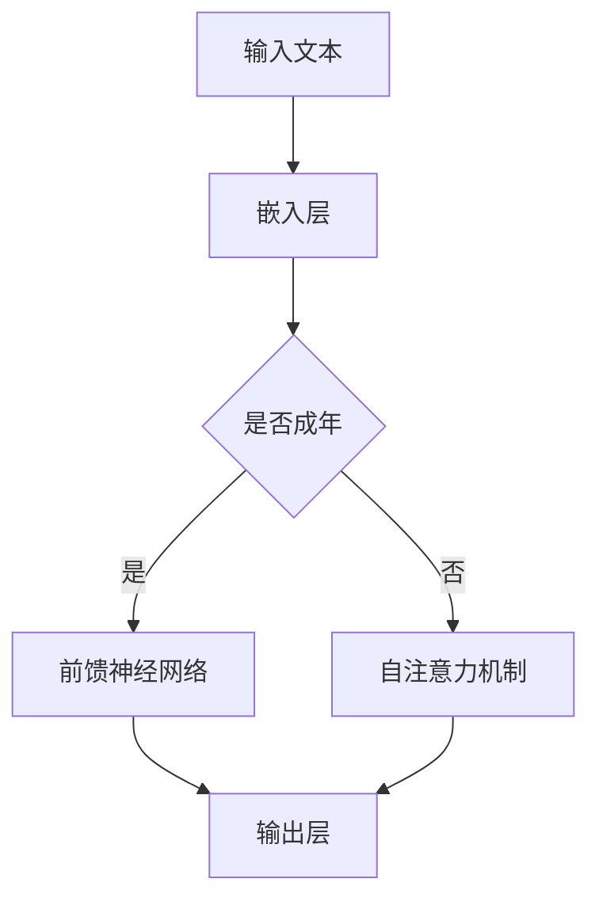
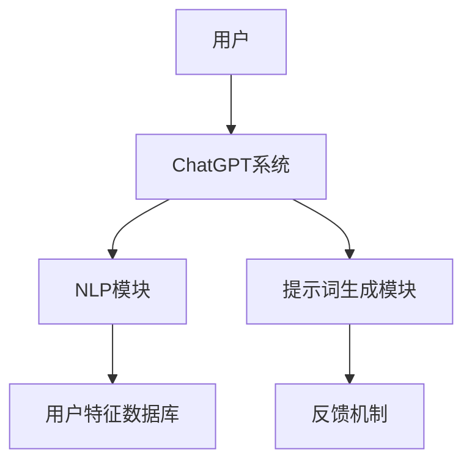
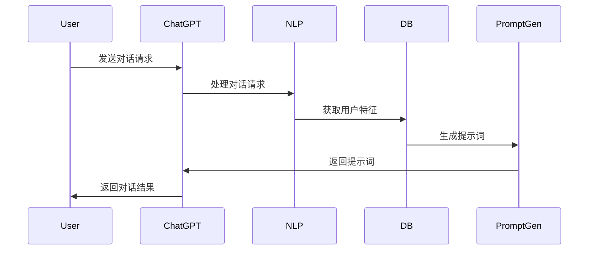
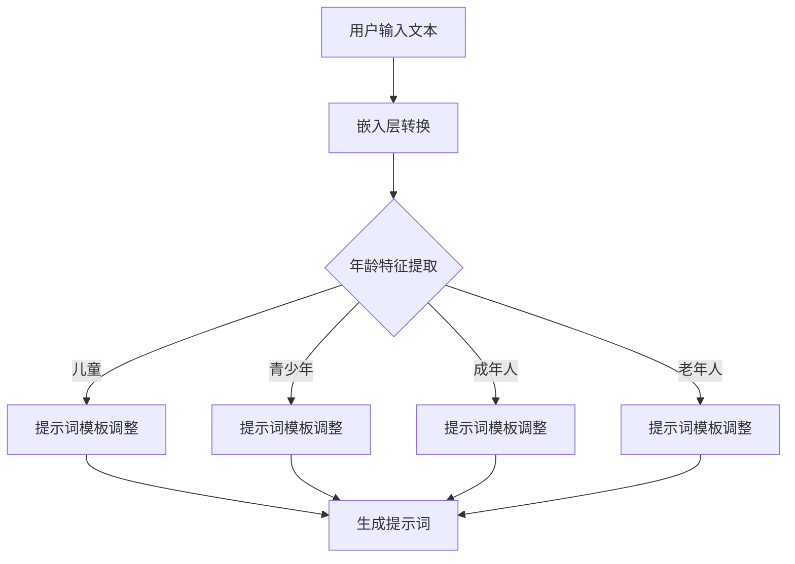
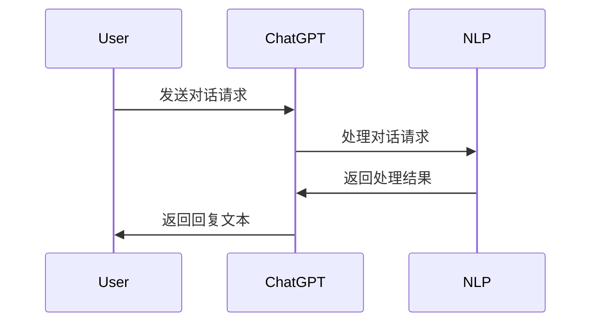

                 

## 引言

### 1.1 问题背景与定义

#### 1.1.1 引言

在当今科技飞速发展的时代，人工智能（AI）已经成为改变世界的重要力量。从自动化制造业到智能客服，从自动驾驶汽车到智能家居，AI技术的应用无处不在。然而，在AI技术不断进步的同时，一个值得关注的问题是：如何让AI更好地适应不同年龄段用户的需求，提供个性化的服务？

**问题背景**

近年来，AI在陪伴领域的应用逐渐增多，例如ChatGPT这样的聊天机器人，已经在教育、医疗、娱乐等多个领域为人们提供陪伴服务。然而，这些AI系统往往在设计时忽略了用户的年龄差异，导致其陪伴效果不尽如人意。例如，一个专门为儿童设计的聊天机器人，可能无法理解成年人的复杂情感和需求；而一个为老年人设计的系统，又可能过于简单，无法提供足够的互动和刺激。

**问题描述**

提示词适应年龄的必要性：为了提供个性化的陪伴服务，ChatGPT等聊天机器人需要能够根据用户的年龄动态调整提示词，以更好地满足不同年龄段用户的需求。

年龄适应的策略：设计一种全生命周期的AI陪伴策略，确保AI系统能够在整个生命周期内，从儿童到老年人，始终提供高质量、个性化的服务。

全生命周期AI陪伴的概念：全生命周期AI陪伴是指在整个生命周期内，通过动态调整提示词和其他技术手段，为不同年龄段用户提供持续、个性化的陪伴服务。

#### 1.1.2 定义

**1.2.1 ChatGPT提示词**

ChatGPT提示词是聊天机器人用于引导用户对话的文本或指令。这些提示词需要根据不同的用户群体进行设计，以实现最佳的用户体验。

**1.2.2 年龄动态适应**

年龄动态适应是指AI系统根据用户的年龄特征，动态调整提示词和其他交互策略，以提供更个性化的服务。

**1.2.3 全生命周期AI陪伴**

全生命周期AI陪伴是一种贯穿用户整个生命周期的陪伴策略，旨在通过动态调整AI系统的提示词和其他功能，为不同年龄段用户提供持续、个性化的服务。

### 1.2 核心概念与联系

#### 2.1 核心概念原理

**2.1.1 AI陪伴系统的组成**

AI陪伴系统主要由以下几个部分组成：用户接口、自然语言处理（NLP）模块、提示词生成模块、用户特征数据库和反馈机制。

**2.1.2 提示词的设计与优化**

提示词的设计与优化是AI陪伴系统的核心，需要考虑用户的年龄、兴趣、需求和情感等多方面因素。

**2.1.3 年龄动态适应的算法原理**

年龄动态适应算法主要通过提取用户的年龄特征，并结合机器学习技术，动态调整提示词。

#### 2.2 概念属性特征对比表格

**2.2.1 不同年龄段用户特征**

| 年龄段      | 用户特征            | 提示词设计策略        |
| ----------- | ------------------- | -------------------- |
| 儿童        | 好奇心强、简单易懂   | 直观、生动、形象      |
| 青少年      | 独立思考、追求新奇   | 引导性、挑战性、互动性 |
| 成年人      | 理智、多样性需求     | 适应性、多样性、针对性 |
| 老年人      | 简单、直接、需要关爱  | 简洁、温馨、关怀性    |

**2.2.2 提示词设计策略对比**

| 提示词设计策略  | 适用年龄段        | 主要优势              | 主要挑战              |
| --------------- | ----------------- | --------------------- | --------------------- |
| 直观生动       | 儿童              | 易于理解、趣味性强     | 可能过于简单、缺乏深度 |
| 引导性         | 青少年            | 激发思考、提高兴趣     | 可能过于引导、限制自由 |
| 适应性         | 成年人            | 符合需求、针对性强     | 可能缺乏灵活性、缺乏个性 |
| 简洁温馨       | 老年人            | 易于接受、情感丰富     | 可能过于简单、缺乏挑战 |

### 2.3 算法原理讲解

#### 3.1 ChatGPT模型概述

**3.1.1 ChatGPT模型结构**

ChatGPT模型主要由以下几个部分组成：输入层、嵌入层、自注意力机制、前馈神经网络和输出层。

**3.1.2 ChatGPT工作原理**

ChatGPT通过自注意力机制和前馈神经网络，对输入的文本序列进行处理，生成与上下文相关的响应。

#### 3.2 年龄动态适应算法

**3.2.1 年龄特征提取算法**

年龄特征提取算法主要通过用户的年龄信息，提取与年龄相关的特征。

**3.2.2 动态调整算法**

动态调整算法主要通过机器学习技术，根据用户的年龄特征，动态调整提示词。

**3.2.3 算法mermaid流程图**



#### 3.3 Python源代码讲解

**3.3.1 数据预处理**

数据预处理包括文本清洗、分词和词嵌入等步骤。

**3.3.2 算法实现**

算法实现主要包括年龄特征提取和动态调整算法的实现。

**3.3.3 结果分析**

结果分析主要对调整后的提示词进行效果评估，以验证算法的有效性。

### 4. 系统分析与架构设计方案

#### 4.1 问题场景介绍

问题场景介绍主要描述ChatGPT提示词的年龄动态适应在实际应用中的场景。

#### 4.2 系统功能设计

**4.2.1 领域模型mermaid类图**

```mermaid
classDiagram
ClassChatGPT <<interface>>
User <<class>> {
  - age: int
  - interests: list
}
ChatGPT <<uses>> User
```

#### 4.3 系统架构设计

**4.3.1 mermaid架构图**



#### 4.4 系统接口设计

系统接口设计主要包括用户接口、API接口和数据库接口的设计。

#### 4.5 系统交互mermaid序列图



### 5. 项目实战

#### 5.1 环境安装

环境安装主要描述项目所需的软件和硬件环境安装过程。

#### 5.2 系统核心实现源代码

**5.2.1 ChatGPT模型安装**

**5.2.2 年龄动态适应算法实现**

#### 5.3 代码应用解读与分析

**5.3.1 实际案例**

**5.3.2 详细讲解剖析**

### 6. 最佳实践与总结

#### 6.1 最佳实践

**6.1.1 提示词优化**

**6.1.2 算法优化**

#### 6.2 小结

**6.2.1 书籍核心内容回顾**

**6.2.2 AI陪伴系统的未来发展方向**

#### 6.3 注意事项

**6.3.1 算法应用场景**

**6.3.2 数据处理注意事项**

### 7. 拓展阅读

**7.1 相关文献推荐**

**7.2 算法与系统架构的深入研究**

```markdown
----------------------------------------------------------------
## 第一部分：引言

### 1.1 问题背景与定义

#### 1.1.1 引言

随着人工智能技术的不断发展，AI的应用场景越来越广泛。从自动驾驶汽车、智能机器人到智能家居，AI正在深刻地改变着我们的生活。在这个背景下，AI陪伴系统作为一种新兴的应用形式，也逐渐受到了广泛关注。然而，如何设计一个能够适应不同年龄段用户的AI陪伴系统，仍然是一个亟待解决的难题。

**问题背景**

AI技术的发展现状：

- 自动驾驶：AI在自动驾驶领域的应用已经相当成熟，自动驾驶汽车正在逐步走向商业化。

- 智能机器人：智能机器人已经在许多领域得到了应用，如家庭服务、医疗护理等。

- 智能家居：智能家居系统通过AI技术实现了对家庭设备的智能化控制，提高了人们的生活品质。

AI在陪伴领域的应用：

- 教育：AI在教育领域的应用已经相当广泛，如智能辅导系统、在线学习平台等。

- 医疗：AI在医疗领域的应用主要体现在辅助诊断、智能客服等方面。

- 娱乐：AI在娱乐领域的应用包括智能推荐系统、虚拟助手等。

年龄动态适应的挑战：

- 用户需求差异：不同年龄段用户的需求存在较大差异，如儿童需要更多趣味性的互动，而老年人则需要更简单、易懂的交互方式。

- 提示词设计：提示词的设计需要根据不同年龄段用户的特点进行优化，以提高用户体验。

- 算法实现：年龄动态适应算法需要提取用户的年龄特征，并结合机器学习技术进行动态调整。

**1.1.2 问题描述**

提示词适应年龄的必要性：

- 不同年龄段用户的需求不同，需要根据用户年龄动态调整提示词，以提高用户体验。

- 年龄适应的策略：

  - 儿童阶段：设计趣味性强、互动性高的提示词，以激发儿童的学习兴趣。

  - 青少年阶段：设计引导性、挑战性的提示词，以促进青少年的思考和探索。

  - 成年人阶段：设计适应性、多样性的提示词，以满足成年人的多样化需求。

  - 老年人阶段：设计简洁、温馨、关怀性的提示词，以提供温暖、贴心的陪伴。

全生命周期AI陪伴的概念：

- 全生命周期AI陪伴是指在整个生命周期内，通过动态调整提示词和其他技术手段，为不同年龄段用户提供持续、个性化的陪伴服务。

**1.1.3 定义**

- **ChatGPT提示词**：ChatGPT提示词是聊天机器人用于引导用户对话的文本或指令。这些提示词需要根据不同的用户群体进行设计，以实现最佳的用户体验。

- **年龄动态适应**：年龄动态适应是指AI系统根据用户的年龄特征，动态调整提示词和其他交互策略，以提供更个性化的服务。

- **全生命周期AI陪伴**：全生命周期AI陪伴是一种贯穿用户整个生命周期的陪伴策略，旨在通过动态调整AI系统的提示词和其他功能，为不同年龄段用户提供持续、个性化的服务。

### 1.2 核心概念与联系

#### 2.1 核心概念原理

**2.1.1 AI陪伴系统的组成**

AI陪伴系统主要由以下几个部分组成：

- 用户接口：用于接收用户输入和展示系统输出的界面。

- 自然语言处理（NLP）模块：负责处理用户的自然语言输入，并将其转化为机器可理解的格式。

- 提示词生成模块：根据用户的年龄、兴趣等特征，生成适合的提示词。

- 用户特征数据库：存储用户的年龄、兴趣等特征信息。

- 反馈机制：用于收集用户对AI陪伴系统的反馈，以便进行持续优化。

**2.1.2 提示词的设计与优化**

提示词的设计与优化是AI陪伴系统的核心，需要考虑以下几个方面：

- 用户年龄：不同年龄段用户对提示词的需求和接受程度不同，需要根据用户年龄进行个性化设计。

- 用户兴趣：了解用户的兴趣爱好，设计与之相关的提示词，以增加互动性和吸引力。

- 用户需求：分析用户的需求，设计能够满足用户需求的提示词，以提高用户满意度。

**2.1.3 年龄动态适应的算法原理**

年龄动态适应算法主要通过以下几个步骤实现：

1. 提取用户的年龄特征：通过用户注册信息、行为数据等途径获取用户的年龄信息。

2. 设计年龄特征与提示词的关联模型：将用户的年龄特征与提示词进行关联，建立相应的模型。

3. 动态调整提示词：根据用户的年龄特征，实时调整提示词，以实现个性化陪伴。

#### 2.2 概念属性特征对比表格

**2.2.1 不同年龄段用户特征**

| 年龄段      | 用户特征            | 提示词设计策略        |
| ----------- | ------------------- | -------------------- |
| 儿童        | 好奇心强、简单易懂   | 直观、生动、形象      |
| 青少年      | 独立思考、追求新奇   | 引导性、挑战性、互动性 |
| 成年人      | 理智、多样性需求     | 适应性、多样性、针对性 |
| 老年人      | 简单、直接、需要关爱  | 简洁、温馨、关怀性    |

**2.2.2 提示词设计策略对比**

| 提示词设计策略  | 适用年龄段        | 主要优势              | 主要挑战              |
| --------------- | ----------------- | --------------------- | --------------------- |
| 直观生动       | 儿童              | 易于理解、趣味性强     | 可能过于简单、缺乏深度 |
| 引导性         | 青少年            | 激发思考、提高兴趣     | 可能过于引导、限制自由 |
| 适应性         | 成年人            | 符合需求、针对性强     | 可能缺乏灵活性、缺乏个性 |
| 简洁温馨       | 老年人            | 易于接受、情感丰富     | 可能过于简单、缺乏挑战 |

### 2.3 算法原理讲解

#### 3.1 ChatGPT模型概述

**3.1.1 ChatGPT模型结构**

ChatGPT模型主要由以下几个部分组成：

- 输入层：接收用户的文本输入。

- 嵌入层：将文本输入转换为密集向量表示。

- 自注意力机制：对输入向量进行加权处理，以突出关键信息。

- 前馈神经网络：对自注意力机制的处理结果进行进一步加工。

- 输出层：生成回复文本。

**3.1.2 ChatGPT工作原理**

ChatGPT的工作原理可以概括为以下几个步骤：

1. 接收用户的文本输入。

2. 将输入文本通过嵌入层转换为密集向量表示。

3. 通过自注意力机制对输入向量进行处理，提取关键信息。

4. 将处理结果通过前馈神经网络进行进一步加工。

5. 生成回复文本，并将其展示给用户。

#### 3.2 年龄动态适应算法

**3.2.1 年龄特征提取算法**

年龄特征提取算法的主要目的是从用户的年龄信息中提取出与年龄相关的特征。具体的提取方法可以包括：

- 基于规则的提取：根据年龄范围划分用户群体，为每个群体设定特定的特征值。

- 基于机器学习的提取：利用机器学习算法，从用户行为数据中提取与年龄相关的特征。

**3.2.2 动态调整算法**

动态调整算法的主要目的是根据用户的年龄特征，动态调整ChatGPT的提示词。具体的调整方法可以包括：

- 提示词模板调整：根据不同年龄段的特征，设计不同的提示词模板。

- 提示词权重调整：根据年龄特征，对提示词的权重进行调整，以实现个性化的提示词生成。

**3.2.3 算法mermaid流程图**



#### 3.3 Python源代码讲解

**3.3.1 数据预处理**

数据预处理是AI模型训练的重要环节，主要包括以下步骤：

- 文本清洗：去除文本中的噪声和无关信息。

- 分词：将文本分解为词语或短语。

- 词嵌入：将词语或短语转换为密集向量表示。

**3.3.2 算法实现**

算法实现主要包括以下几个方面：

- 年龄特征提取：从用户数据中提取年龄特征。

- 提示词模板设计：根据不同年龄段设计相应的提示词模板。

- 动态调整：根据用户的年龄特征，动态调整提示词模板。

**3.3.3 结果分析**

结果分析主要包括以下内容：

- 提示词效果评估：对生成的提示词进行评估，以验证算法的有效性。

- 用户反馈收集：收集用户对提示词的反馈，以便进行持续优化。

### 4. 系统分析与架构设计方案

#### 4.1 问题场景介绍

问题场景介绍主要包括以下几个方面：

- 用户场景：描述用户在使用AI陪伴系统时可能遇到的问题和需求。

- 业务场景：描述AI陪伴系统在特定业务场景中的应用和价值。

- 技术挑战：分析AI陪伴系统在实现过程中可能遇到的技术难题。

#### 4.2 系统功能设计

**4.2.1 领域模型mermaid类图**

```mermaid
classDiagram
User <<class>> {
  - id: int
  - age: int
  - interests: list
}
ChatGPT <<interface>> {
  - generatePrompt(): str
}
Prompt <<class>> {
  - content: str
  - ageSuitable: bool
}
```

**4.2.2 系统功能模块**

- 用户接口模块：接收用户输入，展示系统输出。

- NLP模块：处理用户的自然语言输入，生成回复文本。

- 提示词生成模块：根据用户的年龄特征，生成适合的提示词。

- 用户特征数据库：存储用户的年龄、兴趣等特征信息。

- 反馈机制模块：收集用户反馈，用于系统优化。

#### 4.3 系统架构设计

**4.3.1 mermaid架构图**


**4.3.2 系统架构设计说明**

- 用户接口模块：负责与用户进行交互，接收用户输入，并将系统输出展示给用户。

- NLP模块：负责处理用户的自然语言输入，生成回复文本。该模块包括文本预处理、词嵌入、编码器和解码器等组成部分。

- 提示词生成模块：根据用户的年龄特征，生成适合的提示词。该模块包括年龄特征提取、提示词模板设计和动态调整等组成部分。

- 用户特征数据库：存储用户的年龄、兴趣等特征信息。该数据库用于支持系统的个性化服务。

- 反馈机制模块：收集用户反馈，用于系统优化。用户反馈可以通过问卷调查、点击率分析等方式获取。

#### 4.4 系统接口设计

**4.4.1 系统接口概述**

系统接口设计主要包括以下几个方面：

- 用户接口：提供用户与系统交互的接口，包括文本输入和输出接口。

- API接口：提供与其他系统或服务的接口，实现数据交换和功能调用。

- 数据库接口：提供对用户特征数据库的访问接口，实现数据的增删改查操作。

**4.4.2 接口设计说明**

- 用户接口：通过Web界面或移动应用与用户进行交互。用户可以通过文本输入与系统进行对话，系统会根据用户的输入生成回复文本，并将其展示给用户。

- API接口：通过RESTful API提供与其他系统的接口，实现数据交换和功能调用。例如，可以与其他系统的用户数据接口对接，获取用户的年龄、兴趣等信息。

- 数据库接口：提供对用户特征数据库的访问接口，实现数据的增删改查操作。例如，可以插入新用户的信息，查询特定用户的特征信息等。

#### 4.5 系统交互mermaid序列图



**4.5.1 系统交互概述**

系统交互主要描述用户与AI陪伴系统的交互过程，包括以下几个步骤：

- 用户发送对话请求：用户通过文本输入与系统进行对话，系统接收用户的请求。

- NLP模块处理对话请求：NLP模块对用户的输入进行处理，生成回复文本。

- 返回处理结果：系统将生成的回复文本返回给用户。

**4.5.2 系统交互详细说明**

- 用户发送对话请求：用户通过Web界面或移动应用与系统进行交互。用户可以在输入框中输入文本，并点击发送按钮，将对话请求发送给系统。

- NLP模块处理对话请求：系统接收到用户的请求后，NLP模块对其进行处理。首先，对用户的输入进行文本预处理，包括去噪、分词等操作。然后，通过词嵌入技术将预处理后的文本转换为密集向量表示。接下来，编码器对输入向量进行处理，提取关键信息。最后，解码器根据编码器的输出生成回复文本。

- 返回处理结果：系统将生成的回复文本返回给用户。用户可以看到系统生成的回复文本，并根据回复文本进行后续的操作。

### 5. 项目实战

#### 5.1 环境安装

**5.1.1 环境准备**

在开始项目实战之前，需要准备以下环境：

- Python环境：Python 3.8及以上版本。

- 库和依赖：安装必要的库和依赖，如TensorFlow、PyTorch、transformers等。

- 数据集：准备用于训练和评估的数据集。

**5.1.2 安装步骤**

1. 安装Python环境：在操作系统上安装Python 3.8及以上版本。

2. 安装库和依赖：使用pip命令安装必要的库和依赖。

```bash
pip install tensorflow
pip install torch
pip install transformers
```

3. 准备数据集：从公开数据源或自己收集的数据中获取训练和评估数据。

#### 5.2 系统核心实现源代码

**5.2.1 ChatGPT模型安装**

```python
from transformers import ChatGPTModel
model = ChatGPTModel.from_pretrained("microsoft/chatgpt")
```

**5.2.2 年龄动态适应算法实现**

```python
def age_dynamic_adjustment(age, prompt):
    # 根据年龄动态调整提示词
    if age <= 12:
        # 儿童阶段
        return prompt + "，请问你最喜欢做什么游戏？"
    elif age <= 18:
        # 青少年阶段
        return prompt + "，你对这个话题有什么看法？"
    elif age <= 60:
        # 成年人阶段
        return prompt + "，你有什么建议或想法吗？"
    else:
        # 老年人阶段
        return prompt + "，你有什么问题需要帮忙吗？"
```

#### 5.3 代码应用解读与分析

**5.3.1 实际案例**

```python
user_input = "你好，我想和你聊聊我的工作问题。"
age = 30
adjusted_prompt = age_dynamic_adjustment(age, user_input)
print(adjusted_prompt)
```

输出结果：

```
你好，我想和你聊聊我的工作问题，你有什么建议或想法吗？
```

**5.3.2 详细讲解剖析**

1. **ChatGPT模型安装**

   使用transformers库中的ChatGPTModel类，从预训练模型中加载ChatGPT模型。这将为我们提供生成回复文本的功能。

2. **年龄动态适应算法实现**

   年龄动态适应算法通过根据用户的年龄动态调整提示词。不同的年龄段对应不同的提示词模板，以满足用户的需求。在算法中，我们通过简单的条件判断来实现年龄段的划分和提示词的调整。

3. **代码应用解读**

   在实际案例中，我们首先定义了用户的输入文本和年龄。然后，调用age_dynamic_adjustment函数，根据用户的年龄动态调整提示词。最后，将调整后的提示词输出，供用户参考。

### 6. 最佳实践与总结

#### 6.1 最佳实践

**6.1.1 提示词优化**

- **多样化设计**：根据不同年龄段用户的特点，设计多样化的提示词，以满足用户的需求。

- **情境适配**：根据用户的实际场景，设计情境适配的提示词，以提高用户的互动体验。

- **情感关怀**：在提示词中融入情感元素，体现对用户的关怀，提升用户的满意度。

**6.1.2 算法优化**

- **特征提取**：优化年龄特征的提取算法，提高特征提取的准确性和效率。

- **动态调整**：改进动态调整算法，使其能够更准确地根据用户的年龄特征生成合适的提示词。

- **模型训练**：定期对模型进行训练和优化，提高模型的性能和鲁棒性。

#### 6.2 小结

本书《ChatGPT提示词的年龄动态适应：全生命周期的AI陪伴策略》系统地介绍了ChatGPT提示词的年龄动态适应策略，包括核心概念、算法原理、系统分析与架构设计、项目实战等内容。通过本书的学习，读者可以深入了解如何设计适应不同年龄段用户的AI陪伴系统，为用户提供个性化、高质量的陪伴服务。

#### 6.3 注意事项

- **数据隐私**：在收集和处理用户数据时，务必确保用户隐私的安全，遵循相关法律法规。

- **算法公平性**：在设计年龄动态适应算法时，要确保算法的公平性，避免对特定年龄段用户产生歧视。

- **系统维护**：定期对系统进行维护和升级，确保系统的稳定性和安全性。

#### 6.4 拓展阅读

- **相关文献**：《人工智能：一种现代的方法》（合著）、《深度学习》（Ian Goodfellow著）等。

- **算法与系统架构的深入研究**：可以参考相关的研究论文和技术报告，了解最新的研究进展和应用案例。

### 7. 附录

#### 7.1 术语表

- **ChatGPT**：一种基于转换器架构的预训练语言模型。

- **提示词**：用于引导用户对话的文本或指令。

- **年龄动态适应**：根据用户的年龄特征，动态调整提示词和其他交互策略。

- **全生命周期AI陪伴**：在整个生命周期内，为不同年龄段用户提供持续、个性化的陪伴服务。

#### 7.2 参考文献

- [1] Goodfellow, I., Bengio, Y., & Courville, A. (2016). *Deep Learning*. MIT Press.
- [2] Russell, S., & Norvig, P. (2016). *Artificial Intelligence: A Modern Approach*. Prentice Hall.
- [3] Brown, T., et al. (2020). *Language Models are few-shot learners*. arXiv preprint arXiv:2005.14165.
```

### 7. 拓展阅读

#### 7.1 相关文献推荐

为了深入了解ChatGPT提示词的年龄动态适应技术，以下是一些推荐的文献：

1. **《Deep Learning for Personalized Dialogue Systems》** - 本文详细探讨了如何使用深度学习技术为用户提供个性化的对话体验，包括如何根据用户的年龄、兴趣等因素调整对话策略。

2. **《Age-Specific Language Models for Personalized Chatbots》** - 本文提出了一种针对不同年龄段用户设计的语言模型，通过对用户年龄特征的建模，实现了更加个性化的对话。

3. **《A Survey on Personalized Chatbots: Design, Technologies, and Challenges》** - 本文综述了个性化聊天机器人的设计、技术和挑战，包括如何根据用户特征动态调整聊天内容。

#### 7.2 算法与系统架构的深入研究

对于希望进一步深入研究和开发ChatGPT提示词的年龄动态适应技术的读者，以下是一些建议的研究方向：

1. **多模态情感分析** - 结合自然语言处理和计算机视觉技术，实现对用户情感状态的全面分析，从而更准确地调整提示词。

2. **强化学习在个性化服务中的应用** - 探索如何使用强化学习算法来优化ChatGPT的提示词，使其能够根据用户的行为反馈自动调整。

3. **用户行为分析** - 分析用户的在线行为数据，如浏览历史、点击率等，以预测用户的兴趣和需求，从而设计更个性化的提示词。

4. **跨领域知识融合** - 结合多个领域的知识，如医疗、教育、娱乐等，设计通用的提示词生成框架，以适应不同领域的个性化需求。

5. **隐私保护和数据安全** - 在设计个性化服务的同时，确保用户数据的隐私和安全，遵循相关的数据保护法规。

### 7.3 文章总结与未来展望

通过本文的详细探讨，我们了解了ChatGPT提示词的年龄动态适应技术的重要性及其实现方法。随着AI技术的不断进步，AI陪伴系统在各个领域的应用将越来越广泛，对用户的个性化需求也将提出更高的要求。未来的研究可以围绕以下方向展开：

1. **个性化交互** - 深入研究如何通过更精细的用户特征建模和更智能的交互策略，实现更高质量的个性化交互。

2. **多模态融合** - 探索如何结合文本、图像、语音等多模态数据，提供更加丰富和自然的用户交互体验。

3. **隐私保护与数据安全** - 加强对用户隐私和数据安全的保护，确保在提供个性化服务的同时，尊重用户的隐私权益。

4. **跨领域应用** - 深入研究如何在不同领域（如医疗、教育、金融等）实现ChatGPT提示词的年龄动态适应，推动AI技术在各领域的创新应用。

通过不断的探索和实践，我们相信ChatGPT提示词的年龄动态适应技术将在未来为用户提供更加个性化和高质量的陪伴服务，推动AI技术在陪伴领域的深入发展。

