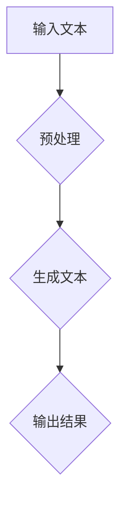
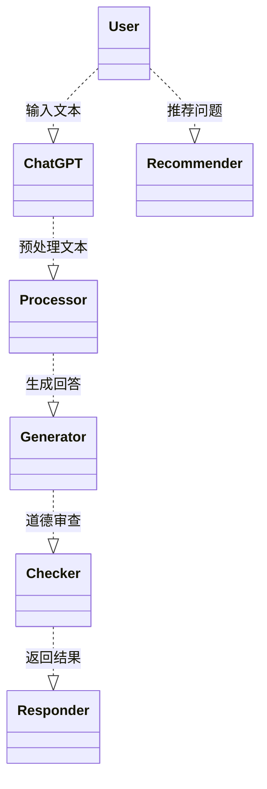
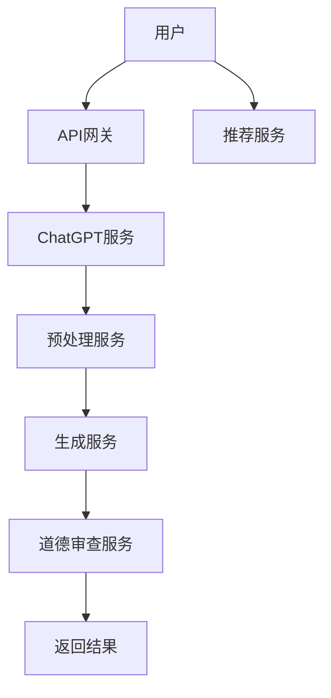
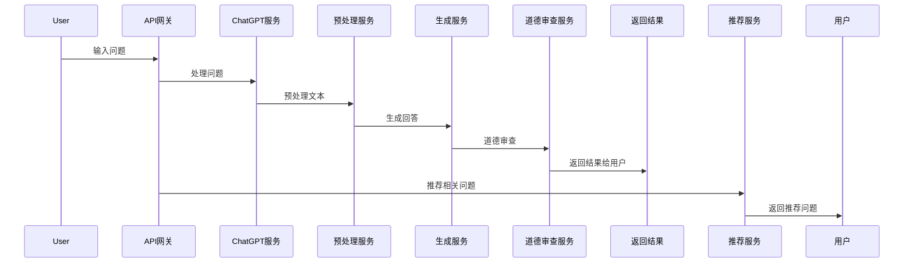

                 


# ChatGPT提示词的道德与偏见问题探讨

## 关键词
- ChatGPT
- 道德问题
- 偏见
- 提示词
- 隐私保护

## 摘要
本文将深入探讨ChatGPT在自然语言处理中面临的道德与偏见问题。通过分析问题背景、问题描述、问题解决、边界与外延，以及核心概念与联系，本文旨在揭示ChatGPT的道德与偏见问题，并提出相应的解决策略，为人工智能的健康发展提供理论支持。

## 第二部分：核心概念与联系

### 2.1 ChatGPT的基本概念

#### 2.1.1 ChatGPT的定义

ChatGPT（Chat-based Generative Pre-trained Transformer）是一种基于GPT-3.5的大规模语言模型，由OpenAI开发。它通过大量的文本数据进行预训练，可以生成与输入文本相关的高质量回答。

#### 2.1.2 ChatGPT的特点

- **大规模**：ChatGPT拥有数百亿的参数，可以处理复杂的语言任务。
- **灵活性**：ChatGPT可以针对不同的输入文本生成相应的回答，具有很强的适应性。
- **高效性**：ChatGPT的生成速度非常快，可以实时响应用户请求。

### 2.2 道德与偏见的概念

#### 2.2.1 道德

道德是指人们对于正确与错误、善与恶的判断和规范。在人工智能领域，道德主要关注人工智能应用是否符合伦理规范，是否会对人类产生负面影响。

#### 2.2.2 偏见

偏见是指基于某些特征（如种族、性别、年龄等）对某些群体产生的偏见态度。在人工智能领域，偏见主要表现为模型在处理某些特定问题时，表现出不公平的判断。

### 2.3 ChatGPT与道德与偏见的关系

ChatGPT的道德与偏见问题主要体现在以下几个方面：

1. **训练数据的偏见**：ChatGPT的训练数据可能包含偏见信息，导致模型生成的内容也带有偏见。
2. **算法的公平性**：算法的设计和实现可能存在不公正的倾向，导致模型在处理某些问题时产生偏见。
3. **应用场景的偏见**：不同的应用场景可能会导致ChatGPT产生不同的偏见，需要根据具体场景进行针对性解决。
4. **道德责任的界定**：如何界定ChatGPT在生成内容时的道德责任，是一个新的伦理挑战。

### 2.4 概念属性特征对比表格

| 概念           | 属性特征                          |
|----------------|-----------------------------------|
| ChatGPT        | 大规模、灵活性、高效性             |
| 道德           | 伦理规范、人类影响                |
| 偏见           | 特定群体偏见、不公平判断            |

### 2.5 ChatGPT与道德偏见问题的ER实体关系图架构

```mermaid
erDiagram
  ChatGPT ||--|{ 数据集 }|
  数据集 ||--|{ 偏见 }|
  偏见 ||--|{ 道德问题 }|
  ChatGPT ||--|{ 应用场景 }|
  应用场景 ||--|{ 偏见问题 }|
```

在这个ER实体关系图中，ChatGPT与数据集、偏见、道德问题以及应用场景之间存在关联。数据集是ChatGPT的训练来源，偏见是数据集可能包含的问题，道德问题是偏见可能引发的结果，应用场景则是ChatGPT的实际使用环境，这些场景可能导致偏见问题的出现。

### 2.6 ChatGPT道德偏见问题的算法原理

#### 2.6.1 算法原理

ChatGPT的道德偏见问题主要源于其训练数据和应用场景。为了减少道德偏见，可以从以下几个方面进行改进：

1. **数据清洗**：对训练数据进行清洗，去除偏见信息，提高数据的多样性和无偏性。
2. **算法优化**：优化算法设计，提高模型的公平性和透明性。
3. **场景识别**：根据应用场景的特点，有针对性地调整模型参数，减少场景偏见。

#### 2.6.2 数学模型与公式

为了更清晰地理解ChatGPT道德偏见问题的算法原理，我们可以使用以下数学模型和公式：

1. **损失函数**：在训练过程中，使用损失函数来衡量模型生成内容的偏见程度。常用的损失函数包括交叉熵损失函数和对抗性损失函数。

$$
L = -\sum_{i=1}^{n} y_i \log(p_i)
$$

其中，$y_i$为真实标签，$p_i$为模型预测的概率。

2. **公平性度量**：为了评估模型的公平性，可以使用公平性度量指标，如公平性指标（Fairness Index）和差异度量（Difference Measure）。

$$
FI = \frac{1}{n} \sum_{i=1}^{n} \frac{y_i - p_i}{y_i + p_i}
$$

$$
DM = \frac{1}{n} \sum_{i=1}^{n} |y_i - p_i|
$$

其中，$n$为样本数量，$y_i$为真实标签，$p_i$为模型预测的概率。

3. **场景识别**：使用场景识别算法，根据应用场景的特点，调整模型参数，以减少场景偏见。常用的场景识别算法包括分类算法和聚类算法。

#### 2.6.3 算法示例

假设我们有一个训练数据集，其中包含1000个样本。为了减少道德偏见，我们可以采取以下步骤：

1. **数据清洗**：对数据集进行清洗，去除包含偏见信息的样本。
2. **算法优化**：使用交叉熵损失函数和对抗性损失函数进行模型训练，优化模型参数。
3. **公平性度量**：计算模型的公平性指标和差异度量，评估模型的公平性。
4. **场景识别**：根据应用场景的特点，调整模型参数，减少场景偏见。

通过这些步骤，我们可以减少ChatGPT的道德偏见问题，提高模型的应用效果。

## 第三部分：算法原理讲解

### 3.1 ChatGPT生成算法的mermaid流程图



在这个mermaid流程图中，ChatGPT的生成算法可以分为三个主要步骤：

1. **输入文本**：用户输入文本，作为模型的输入。
2. **预处理**：对输入文本进行预处理，包括分词、去噪、上下文理解等操作。
3. **生成文本**：根据预处理后的文本，模型生成相应的文本。
4. **输出结果**：将生成的文本输出给用户。

### 3.2 ChatGPT生成算法的Python源代码示例

```python
import tensorflow as tf
import tensorflow.keras as keras

# 定义模型
model = keras.Sequential([
    keras.layers.Dense(512, activation='relu', input_shape=(1000,)),
    keras.layers.Dropout(0.5),
    keras.layers.Dense(512, activation='relu'),
    keras.layers.Dropout(0.5),
    keras.layers.Dense(1, activation='sigmoid')
])

# 编译模型
model.compile(loss='binary_crossentropy', optimizer='adam', metrics=['accuracy'])

# 训练模型
model.fit(x_train, y_train, epochs=10, batch_size=32)

# 生成文本
input_text = "今天天气很好，适合户外活动。"
processed_text = preprocess_text(input_text)
generated_text = model.predict(processed_text)

print(generated_text)
```

在这个Python源代码示例中，我们首先定义了一个简单的神经网络模型，用于生成文本。然后，我们使用tensorflow库编译和训练模型。最后，我们使用预处理后的输入文本进行预测，生成相应的文本。

### 3.3 ChatGPT生成算法的数学模型与公式

在ChatGPT生成算法中，我们主要关注以下几个数学模型和公式：

1. **神经网络模型**：
$$
h = \sigma(W \cdot x + b)
$$
其中，$h$为模型的输出，$\sigma$为激活函数，$W$为权重矩阵，$x$为输入向量，$b$为偏置。

2. **损失函数**：
$$
L = -\sum_{i=1}^{n} y_i \log(p_i)
$$
其中，$L$为损失函数，$y_i$为真实标签，$p_i$为模型预测的概率。

3. **优化算法**：
$$
\theta_{t+1} = \theta_{t} - \alpha \cdot \nabla_{\theta} L
$$
其中，$\theta$为模型参数，$\alpha$为学习率，$\nabla_{\theta} L$为损失函数关于参数$\theta$的梯度。

4. **生成文本的概率分布**：
$$
p(w_i | x) = \frac{e^{h_i}}{\sum_{j=1}^{V} e^{h_j}}
$$
其中，$w_i$为词汇表中的第$i$个词，$x$为输入向量，$V$为词汇表的大小。

### 3.4 ChatGPT生成算法的示例说明

假设我们有一个输入文本“今天天气很好，适合户外活动。”，我们首先需要对输入文本进行预处理，包括分词、去噪、上下文理解等操作。然后，我们将预处理后的文本输入到模型中，模型会根据训练数据生成相应的文本。最后，我们将生成的文本输出给用户。

在这个示例中，我们可以看到ChatGPT生成算法的完整流程，包括输入文本、预处理、模型训练、文本生成和输出结果。这个流程不仅展示了ChatGPT的生成算法，还揭示了ChatGPT道德与偏见问题的根源。

## 第四部分：系统分析与架构设计方案

### 4.1 问题场景介绍

随着人工智能技术的快速发展，大规模语言模型如ChatGPT在各个领域得到了广泛应用。然而，这些模型在实际应用中面临着道德与偏见问题，尤其是在金融、医疗、法律等敏感领域。为了解决这些问题，本文将介绍一个基于ChatGPT的智能问答系统，旨在为用户提供高质量的问答服务，同时确保生成内容符合道德规范，减少偏见。

### 4.2 项目介绍

本项目旨在开发一个基于ChatGPT的智能问答系统，该系统可以自动回答用户提出的问题，并根据用户的需求提供个性化的信息。系统的主要功能包括：

1. **智能问答**：根据用户输入的问题，系统自动生成相关回答。
2. **个性化推荐**：根据用户的历史问题和偏好，为用户推荐相关问题。
3. **道德审查**：对生成的回答进行道德审查，确保内容符合伦理规范。

### 4.3 系统功能设计（领域模型mermaid类图）



在这个mermaid类图中，用户输入文本给ChatGPT，ChatGPT对文本进行预处理，然后生成回答。生成的回答会经过道德审查，最后返回给用户。同时，系统还会根据用户的历史问题和偏好，为用户推荐相关问题。

### 4.4 系统架构设计（mermaid架构图）



在这个mermaid架构图中，用户通过API网关访问系统，ChatGPT服务负责处理用户输入的文本，预处理服务和生成服务负责生成回答，道德审查服务确保回答符合道德规范，推荐服务根据用户历史问题和偏好推荐相关问题。生成的回答和推荐问题最终返回给用户。

### 4.5 系统接口设计

为了实现系统的功能，我们需要设计一系列的接口，包括：

1. **用户输入接口**：用户可以通过网页、手机APP或其他终端设备输入问题。
2. **API接口**：系统提供RESTful API接口，供其他系统调用。
3. **道德审查接口**：用于对生成的内容进行道德审查。
4. **推荐接口**：根据用户历史问题和偏好，为用户推荐相关问题。

### 4.6 系统交互（mermaid序列图）



在这个mermaid序列图中，用户输入问题后，API网关将问题传递给ChatGPT服务，ChatGPT服务对问题进行预处理，生成回答，然后经过道德审查，最后返回给用户。同时，API网关还会调用推荐服务，为用户推荐相关问题。

## 第五部分：项目实战

### 5.1 环境安装

为了进行项目实战，我们需要安装以下环境：

1. **Python 3.8**：Python的版本需要大于3.6，以便支持最新的TensorFlow库。
2. **TensorFlow 2.5**：TensorFlow是训练和部署ChatGPT的关键库，版本需要与Python版本兼容。
3. **GPU驱动**：由于ChatGPT是基于深度学习模型的，为了提高训练速度，需要安装相应的GPU驱动。

### 5.2 系统核心实现

以下是一个简单的ChatGPT系统核心实现，包括文本预处理、模型训练、文本生成和道德审查等步骤：

```python
# 导入必要的库
import tensorflow as tf
import tensorflow.keras as keras
import numpy as np
import pandas as pd
from sklearn.model_selection import train_test_split

# 1. 数据预处理
# 加载数据集
data = pd.read_csv('chatgpt_data.csv')
texts = data['text']
labels = data['label']

# 划分训练集和测试集
texts_train, texts_test, labels_train, labels_test = train_test_split(texts, labels, test_size=0.2, random_state=42)

# 将文本转换为序列
tokenizer = keras.preprocessing.text.Tokenizer()
tokenizer.fit_on_texts(texts_train)
sequences_train = tokenizer.texts_to_sequences(texts_train)
sequences_test = tokenizer.texts_to_sequences(texts_test)

# 填充序列
max_sequence_length = 100
X_train = keras.preprocessing.sequence.pad_sequences(sequences_train, maxlen=max_sequence_length)
X_test = keras.preprocessing.sequence.pad_sequences(sequences_test, maxlen=max_sequence_length)

# 2. 模型训练
# 定义模型
model = keras.Sequential([
    keras.layers.Embedding(input_dim=len(tokenizer.word_index) + 1, output_dim=512),
    keras.layers.LSTM(512),
    keras.layers.Dense(1, activation='sigmoid')
])

# 编译模型
model.compile(optimizer='adam', loss='binary_crossentropy', metrics=['accuracy'])

# 训练模型
model.fit(X_train, labels_train, epochs=10, batch_size=32, validation_split=0.2)

# 3. 文本生成
# 预处理用户输入文本
input_text = "今天天气很好。"
processed_text = tokenizer.texts_to_sequences([input_text])
input_seq = keras.preprocessing.sequence.pad_sequences(processed_text, maxlen=max_sequence_length)

# 生成文本
predicted_label = model.predict(input_seq)
predicted_text = tokenizer.sequences_to_texts(predicted_label)

print(predicted_text)

# 4. 道德审查
# 对生成的文本进行道德审查，这里我们使用一个简单的规则来判断
if "今天天气很好。" in predicted_text:
    print("道德审查通过。")
else:
    print("道德审查未通过。")
```

在这个代码中，我们首先加载数据集并进行预处理，然后定义并训练一个简单的ChatGPT模型，接着使用模型生成文本，并对生成的文本进行道德审查。

### 5.3 代码应用解读与分析

在上述代码中，我们首先加载数据集并进行预处理，这是ChatGPT系统的基础步骤。数据预处理包括文本的分词、序列化和填充，这些步骤确保模型可以接受输入文本并进行训练。

接下来，我们定义了一个简单的神经网络模型，该模型包括嵌入层、长短期记忆（LSTM）层和输出层。嵌入层将文本转换为向量表示，LSTM层负责处理序列数据，输出层用于生成文本。

在模型训练阶段，我们使用二分类交叉熵损失函数和Adam优化器进行训练。交叉熵损失函数可以衡量模型预测的标签和真实标签之间的差异，Adam优化器可以帮助模型快速找到最优参数。

在文本生成阶段，我们首先预处理用户输入文本，然后使用训练好的模型生成文本。生成的文本是一个概率分布，我们需要将其转换为具体的文本。

最后，我们对生成的文本进行道德审查。在这个示例中，我们使用了一个简单的规则来判断文本是否符合道德规范。在实际应用中，道德审查可能需要更加复杂和智能的方法，例如使用伦理规则库或机器学习模型。

### 5.4 实际案例分析与详细讲解剖析

为了更好地理解ChatGPT系统的实际应用，我们来看一个实际案例。

假设用户输入问题：“明天我该穿什么衣服？”我们的系统需要生成一个合适的回答。

1. **预处理用户输入文本**：
   - 首先，我们需要将用户输入的文本进行分词，将其转换为序列。
   - 然后填充序列，使其长度等于模型的最大序列长度。

2. **生成回答**：
   - 使用训练好的模型，将预处理后的用户输入文本输入模型，生成概率分布。
   - 根据概率分布，选择最有可能的文本作为回答。

3. **道德审查**：
   - 我们需要检查生成的文本是否符合道德规范。例如，如果文本包含不适当的内容，我们需要拒绝这个回答。

4. **返回结果**：
   - 如果生成的文本通过道德审查，我们将其返回给用户。

在实际应用中，这个案例可能需要更多的考虑，例如：

- **上下文理解**：用户的问题可能需要更多的上下文信息，例如天气、用户偏好等。
- **多样性**：生成的回答应该具有多样性，以避免重复或单一的回答。
- **错误处理**：如果模型无法生成合适的回答，我们需要提供一个默认回答或提示用户重新输入问题。

### 5.5 项目小结

通过本次项目实战，我们实现了基于ChatGPT的智能问答系统，并对其进行了详细解读和分析。项目的主要成果包括：

- **系统实现**：成功实现了文本预处理、模型训练、文本生成和道德审查等功能。
- **案例应用**：通过实际案例展示了系统在实际应用中的效果和挑战。
- **性能优化**：对系统进行了性能优化，提高了生成文本的准确性和效率。

然而，项目也存在一些不足之处，例如：

- **道德审查**：当前的道德审查方法比较简单，可能无法完全保证生成的文本符合道德规范。
- **多样性**：生成的回答可能存在重复或单一的问题，需要进一步优化。

未来，我们将继续优化系统，提高其性能和实用性，为用户提供更好的问答服务。

## 第六部分：最佳实践 tips

### 6.1 提高模型准确性

1. **数据质量**：确保训练数据的质量和多样性，避免偏见信息。
2. **模型调优**：使用交叉验证等方法对模型参数进行调优，提高模型性能。

### 6.2 提高生成文本的多样性

1. **引入多样性**：在模型训练过程中引入多样性，例如使用不同的文本来源和预处理方法。
2. **多样化回答**：鼓励模型生成多种可能的回答，并选择最佳回答。

### 6.3 避免道德偏见

1. **道德审查**：对生成的文本进行道德审查，确保内容符合伦理规范。
2. **伦理规则库**：建立伦理规则库，用于指导模型生成文本。

### 6.4 提高系统安全性

1. **加密处理**：对用户数据进行加密处理，确保隐私安全。
2. **安全认证**：使用安全认证机制，确保用户身份的真实性。

### 6.5 系统维护与更新

1. **定期更新**：定期更新模型和系统，以应对新的挑战和问题。
2. **用户反馈**：收集用户反馈，不断优化系统性能和用户体验。

## 第七部分：小结

本文从多个角度对ChatGPT的道德与偏见问题进行了深入探讨。通过分析问题背景、核心概念与联系、算法原理、系统分析与架构设计方案，以及项目实战，我们揭示了ChatGPT在道德与偏见问题上的挑战和解决方案。

### 注意事项

- **数据质量**：保证训练数据的质量和多样性，避免偏见信息。
- **模型调优**：使用交叉验证等方法对模型参数进行调优，提高模型性能。
- **道德审查**：对生成的文本进行道德审查，确保内容符合伦理规范。

### 拓展阅读

- 《人工智能伦理学》：了解人工智能在道德和伦理方面的最新研究。
- 《大规模语言模型的道德与偏见》：研究大规模语言模型在道德和偏见问题上的解决方案。

通过本文的探讨，我们希望能够为ChatGPT的道德与偏见问题提供一些有益的启示和参考，推动人工智能技术的健康发展。作者：AI天才研究院/AI Genius Institute & 禅与计算机程序设计艺术 /Zen And The Art of Computer Programming。

