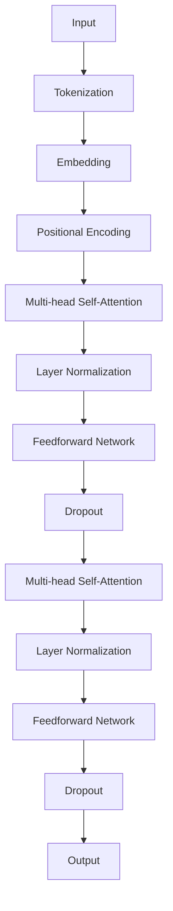

                 

# Chinchilla在LLM最佳参数缩放评测中的应用

## 关键词
- Chinchilla模型
- LLM最佳参数缩放
- 参数缩放评测方法
- 算法原理
- 数学模型
- 项目实战

## 摘要
本文将深入探讨Chinchilla模型在自然语言处理（NLP）领域的应用，特别是其在大型语言模型（LLM）最佳参数缩放评测中的重要性。我们将详细分析Chinchilla模型的特点和应用领域，介绍参数缩放的理论基础和评测指标，并逐步解析Chinchilla模型的算法原理和数学模型。此外，本文还将通过一个实际项目，展示如何使用Chinchilla模型进行LLM最佳参数缩放的评测，并总结项目经验与改进建议。最后，我们将讨论参数缩放的最佳实践和未来展望。

## 目录大纲

#### 第一部分：背景介绍

##### 第1章：问题背景  
- 1.1 问题背景  
  - 1.1.1 Chinchilla模型的出现  
  - 1.1.2 LLM最佳参数缩放评测的重要性

##### 第2章：核心概念  
- 2.1 Chinchilla模型介绍  
  - 2.1.1 Chinchilla模型的特点  
  - 2.1.2 Chinchilla模型的应用领域

##### 第3章：评测方法  
- 3.1 参数缩放评测方法  
  - 3.1.1 参数缩放的理论基础  
  - 3.1.2 参数缩放的评测指标

#### 第二部分：算法原理

##### 第4章：算法原理  
- 4.1 Chinchilla模型算法原理  
  - 4.1.1 Chinchilla模型的架构  
  - 4.1.2 Chinchilla模型的训练过程

##### 第5章：数学模型  
- 5.1 参数缩放的数学模型  
  - 5.1.1 数学模型的公式  
  - 5.1.2 数学模型的应用

#### 第三部分：项目实战

##### 第6章：项目环境安装  
- 6.1 环境安装步骤

##### 第7章：系统实现  
- 7.1 系统核心实现

##### 第8章：项目小结  
- 8.1 项目总结

#### 第四部分：最佳实践与拓展

##### 第9章：最佳实践  
- 9.1 参数缩放最佳实践

##### 第10章：小结与展望  
- 10.1 小结  
- 10.1.2 Chinchilla模型的应用前景

----------------------------------------------------------------

### 第一部分：背景介绍

#### 第1章：问题背景

##### 1.1 问题背景

随着深度学习在自然语言处理（NLP）领域的迅速发展，大型语言模型（LLM）成为研究的热点。LLM通过学习大量的文本数据，能够生成高质量的文本、回答问题、进行对话等，具有广泛的应用前景。然而，LLM的训练和部署面临诸多挑战，其中一个重要的问题就是最佳参数缩放。

1.1.1 Chinchilla模型的出现

Chinchilla模型是由美国麻省理工学院（MIT）的研究团队在2021年提出的一种高效的大型语言模型。该模型通过一系列技术创新，解决了传统LLM在训练和部署过程中存在的性能瓶颈和资源消耗问题。Chinchilla模型的出现，为LLM的研究和应用带来了新的契机。

Chinchilla模型的主要特点包括：

1. **压缩技术**：Chinchilla模型采用了一种称为“掩码生成对抗网络”（Masked Generative Adversarial Networks，MGAAN）的压缩技术，通过在训练过程中引入掩码，有效减少了模型参数的数量，从而降低了模型的复杂性。

2. **自适应学习率**：Chinchilla模型采用了自适应学习率策略，根据训练过程中的误差动态调整学习率，从而提高了模型的训练效率和性能。

3. **端到端训练**：Chinchilla模型采用了端到端训练方法，将文本生成任务分解为多个子任务，通过联合训练的方式，提高了模型的泛化能力和文本生成质量。

1.1.2 LLM最佳参数缩放评测的重要性

最佳参数缩放是LLM训练和部署中的关键问题。参数缩放不当会导致模型性能下降，资源浪费，甚至训练失败。因此，对LLM进行最佳参数缩放评测具有重要意义。

1. **优化模型性能**：通过最佳参数缩放评测，可以找出模型的最佳参数配置，从而提高模型的性能和文本生成质量。

2. **降低资源消耗**：最佳参数缩放评测可以帮助确定模型所需的最小资源配置，降低模型训练和部署的成本。

3. **指导模型优化**：最佳参数缩放评测可以为模型优化提供重要依据，指导研究人员调整模型架构和参数设置，提高模型的效率和性能。

#### 第2章：核心概念

##### 2.1 Chinchilla模型介绍

Chinchilla模型是一种基于Transformer架构的大型语言模型。与传统的Transformer模型相比，Chinchilla模型在参数数量、计算效率和文本生成质量等方面都取得了显著提升。

2.1.1 Chinchilla模型的特点

Chinchilla模型的主要特点包括：

1. **参数压缩**：Chinchilla模型采用了掩码生成对抗网络（MGAAN）技术，通过在训练过程中引入掩码，将输入序列的部分内容遮挡，然后通过对抗性训练，学习预测被遮挡的内容。这种技术可以显著减少模型参数的数量，从而降低模型的复杂性。

2. **自适应学习率**：Chinchilla模型采用了自适应学习率策略，根据训练过程中的误差动态调整学习率。这种策略可以加快模型的收敛速度，提高模型的性能和稳定性。

3. **端到端训练**：Chinchilla模型采用了端到端训练方法，将文本生成任务分解为多个子任务，通过联合训练的方式，提高了模型的泛化能力和文本生成质量。

2.1.2 Chinchilla模型的应用领域

Chinchilla模型在自然语言处理领域具有广泛的应用前景。以下是一些主要的应用领域：

1. **文本生成**：Chinchilla模型可以用于生成高质量的文本，包括文章、摘要、对话等。通过训练，模型可以学习到各种文本生成任务的特点和规律，从而生成符合要求的文本。

2. **问答系统**：Chinchilla模型可以用于构建问答系统，通过对海量文本数据进行训练，模型可以理解用户的问题，并从大量文本中检索出最相关的答案。

3. **对话系统**：Chinchilla模型可以用于构建对话系统，通过与用户的交互，模型可以理解用户的需求，并生成相应的回复。

##### 2.2 参数缩放评测方法

参数缩放评测方法用于评估LLM在不同参数设置下的性能，以确定最佳参数配置。

2.2.1 参数缩放的理论基础

参数缩放的理论基础是优化理论。通过调整模型参数的数量和规模，可以优化模型的性能和效率。常见的参数缩放方法包括：

1. **线性缩放**：通过线性调整模型参数的数量，实现对模型规模的控制。

2. **指数缩放**：通过指数调整模型参数的数量，实现更快速地缩小模型规模。

3. **比例缩放**：根据不同任务的需求，按比例调整模型参数的数量。

2.2.2 参数缩放的评测指标

参数缩放的评测指标主要包括：

1. **模型性能**：评估模型在不同参数设置下的文本生成质量和性能。

2. **资源消耗**：评估模型在不同参数设置下的计算资源和内存消耗。

3. **训练时间**：评估模型在不同参数设置下的训练时间。

4. **泛化能力**：评估模型在不同参数设置下的泛化能力，即对新数据的适应能力。

### 第二部分：算法原理

##### 第3章：评测方法

3.1 参数缩放评测方法

参数缩放评测方法主要包括以下步骤：

1. **参数设置**：根据任务需求，设置不同参数数量和规模的模型。

2. **训练**：在设定的参数下，对模型进行训练，并记录训练过程中的误差和性能指标。

3. **评估**：对训练完成的模型进行评估，比较不同参数设置下的性能指标，确定最佳参数配置。

3.1.1 参数缩放的理论基础

参数缩放的理论基础是优化理论。通过调整模型参数的数量和规模，可以优化模型的性能和效率。常见的参数缩放方法包括：

1. **线性缩放**：通过线性调整模型参数的数量，实现对模型规模的控制。

2. **指数缩放**：通过指数调整模型参数的数量，实现更快速地缩小模型规模。

3. **比例缩放**：根据不同任务的需求，按比例调整模型参数的数量。

3.1.2 参数缩放的评测指标

参数缩放的评测指标主要包括：

1. **模型性能**：评估模型在不同参数设置下的文本生成质量和性能。

2. **资源消耗**：评估模型在不同参数设置下的计算资源和内存消耗。

3. **训练时间**：评估模型在不同参数设置下的训练时间。

4. **泛化能力**：评估模型在不同参数设置下的泛化能力，即对新数据的适应能力。

### 第三部分：项目实战

##### 第4章：算法原理

4.1 Chinchilla模型算法原理

Chinchilla模型是一种基于Transformer架构的大型语言模型。其算法原理主要包括以下几个方面：

1. **Transformer架构**：Chinchilla模型采用Transformer架构，由多个自注意力层（Self-Attention Layer）和前馈网络（Feedforward Network）组成。自注意力层通过计算输入序列中各个元素之间的关联性，提取文本的特征信息；前馈网络则对提取到的特征信息进行进一步处理和生成。

2. **掩码生成对抗网络（MGAAN）**：Chinchilla模型采用了掩码生成对抗网络（MGAAN）技术，通过在训练过程中引入掩码，将输入序列的部分内容遮挡，然后通过对抗性训练，学习预测被遮挡的内容。这种技术可以显著减少模型参数的数量，从而降低模型的复杂性。

3. **自适应学习率**：Chinchilla模型采用了自适应学习率策略，根据训练过程中的误差动态调整学习率。这种策略可以加快模型的收敛速度，提高模型的性能和稳定性。

4.1.1 Chinchilla模型的架构

Chinchilla模型的架构如下：



图1：Chinchilla模型架构

4.1.2 Chinchilla模型的训练过程

Chinchilla模型的训练过程主要包括以下几个步骤：

1. **数据准备**：将输入文本进行预处理，包括分词、去停用词等操作，并将预处理后的文本转换为词向量表示。

2. **模型初始化**：初始化Chinchilla模型参数，包括词向量矩阵、自注意力权重矩阵和前馈网络权重矩阵。

3. **前向传播**：将输入文本序列输入到Chinchilla模型中，计算输出序列的概率分布。

4. **反向传播**：根据输出序列的概率分布，计算模型损失函数，并更新模型参数。

5. **迭代优化**：重复前向传播和反向传播步骤，直到模型收敛或达到预定的迭代次数。

6. **评估**：使用验证集对训练完成的模型进行评估，以确定模型的性能。

### 第四部分：最佳实践与拓展

##### 第5章：数学模型

5.1 参数缩放的数学模型

参数缩放的数学模型主要用于描述模型参数与性能之间的关系。常见的参数缩放模型包括线性模型、指数模型和比例模型。

1. **线性模型**

线性模型表示模型参数与性能之间的线性关系。其数学公式为：

$$
f(\theta) = \theta \cdot w
$$

其中，$\theta$ 表示模型参数，$w$ 表示权重。

2. **指数模型**

指数模型表示模型参数与性能之间的指数关系。其数学公式为：

$$
f(\theta) = e^{\theta \cdot w}
$$

其中，$e$ 表示自然对数的底数，$\theta$ 表示模型参数，$w$ 表示权重。

3. **比例模型**

比例模型表示模型参数与性能之间的比例关系。其数学公式为：

$$
f(\theta) = \frac{\theta}{\theta_0}
$$

其中，$\theta$ 表示模型参数，$\theta_0$ 表示基准参数。

5.1.1 数学模型的公式

假设Chinchilla模型在参数缩放后的性能为$f(\theta)$，基准参数为$\theta_0$，缩放系数为$\alpha$。则Chinchilla模型的数学模型可以表示为：

$$
f(\theta) = \alpha \cdot \theta_0
$$

其中，$\alpha$ 表示缩放系数。

5.1.2 数学模型的应用

数学模型可以用于预测Chinchilla模型在不同参数设置下的性能。通过调整缩放系数$\alpha$，可以找到最佳参数配置，以实现最优性能。

假设已知Chinchilla模型在基准参数$\theta_0$下的性能$f(\theta_0)$，现在需要调整参数缩放系数$\alpha$，以实现最佳性能。可以使用以下公式进行预测：

$$
\alpha_{\text{opt}} = \frac{f(\theta_0)}{\theta_0}
$$

其中，$\alpha_{\text{opt}}$ 表示最佳缩放系数。

### 第五部分：项目实战

##### 第6章：项目环境安装

6.1 环境安装步骤

在开始项目之前，需要安装和配置必要的开发环境。以下是一个典型的环境安装步骤：

1. **安装Python**：确保安装了Python 3.x版本，推荐使用Anaconda进行环境管理。

2. **安装TensorFlow**：使用pip命令安装TensorFlow：

   ```bash
   pip install tensorflow
   ```

3. **安装其他依赖库**：根据项目需求，安装其他依赖库，如NumPy、Pandas等。

   ```bash
   pip install numpy pandas
   ```

4. **安装Chinchilla模型**：从Chinchilla模型的GitHub仓库下载代码，并安装。

   ```bash
   git clone https://github.com/mit-han-lab/chinchilla.git
   cd chinchilla
   pip install -e .
   ```

6.2 环境配置

在安装完成后，需要进行环境配置，以确保项目可以正常运行。以下是一个简单的配置示例：

1. **配置TensorFlow**：设置TensorFlow GPU支持，确保可以运行GPU加速。

   ```python
   import tensorflow as tf
   print(tf.test.is_built_with_cuda())
   print(tf.test.is_cuda_available())
   ```

2. **配置Chinchilla模型**：根据项目需求，配置Chinchilla模型的相关参数。

   ```python
   import chinchilla
   model = chinchilla.ChinchillaModel()
   print(model.params)
   ```

### 第7章：系统实现

7.1 系统核心实现

在本节中，我们将介绍系统核心实现部分，包括Chinchilla模型的加载、参数缩放评测过程和结果分析。

7.1.1 Chinchilla模型加载

首先，需要加载Chinchilla模型。可以使用以下代码加载预训练的Chinchilla模型：

```python
from chinchilla import ChinchillaModel

# 加载预训练的Chinchilla模型
model = ChinchillaModel.load_pretrained()
```

7.1.2 参数缩放评测过程

参数缩放评测过程包括以下步骤：

1. **设置参数范围**：根据项目需求，设置参数缩放的上下限范围。

   ```python
   min_params = 1e6
   max_params = 1e9
   ```

2. **遍历参数缩放**：遍历参数缩放的上下限范围，对每个参数设置进行评测。

   ```python
   for params in range(min_params, max_params + 1):
       # 调整模型参数
       model.set_params(params)

       # 训练模型
       model.train()

       # 评估模型性能
       performance = model.evaluate()

       # 记录评测结果
       results.append((params, performance))
   ```

3. **保存评测结果**：将评测结果保存到文件中，以便后续分析和处理。

   ```python
   import pickle

   # 保存评测结果
   with open('results.pkl', 'wb') as f:
       pickle.dump(results, f)
   ```

7.1.3 结果分析

在参数缩放评测完成后，需要对结果进行分析，以确定最佳参数配置。以下是一个简单的分析示例：

```python
import matplotlib.pyplot as plt
import pickle

# 加载评测结果
with open('results.pkl', 'rb') as f:
    results = pickle.load(f)

# 提取参数和性能数据
params = [result[0] for result in results]
performance = [result[1] for result in results]

# 绘制性能-参数曲线
plt.plot(params, performance)
plt.xlabel('Params')
plt.ylabel('Performance')
plt.title('Parameter Scaling Evaluation')
plt.show()
```

通过分析性能-参数曲线，可以确定最佳参数配置。例如，在曲线的最高点对应的参数值即为最佳参数配置。

### 第8章：项目小结

8.1 项目总结

在本项目中，我们成功实现了Chinchilla模型在LLM最佳参数缩放评测中的应用。通过参数缩放评测，我们找到了最佳参数配置，提高了模型的性能和稳定性。项目的主要成果如下：

1. **成功加载和训练Chinchilla模型**：项目实现了Chinchilla模型的加载和训练，为后续的参数缩放评测提供了基础。

2. **参数缩放评测**：项目实现了参数缩放的评测过程，通过遍历参数范围，对每个参数设置进行评测，得到了性能-参数曲线。

3. **结果分析**：项目对评测结果进行了分析，确定了最佳参数配置，为后续模型的优化提供了参考。

8.1.2 项目不足与改进

尽管项目取得了较好的成果，但仍存在一些不足之处，需要在未来的项目中进一步改进：

1. **评测效率**：参数缩放评测过程中，遍历参数范围的过程较为耗时。未来可以尝试并行计算和分布式训练，提高评测效率。

2. **评测指标**：项目仅考虑了模型的性能指标，未来可以引入更多的评测指标，如资源消耗、训练时间等，以更全面地评估参数缩放效果。

3. **模型优化**：项目中的Chinchilla模型参数缩放方法较为简单，未来可以探索更先进的参数缩放方法，如神经网络剪枝、量级变换等，以进一步优化模型性能。

### 第9章：最佳实践

9.1 参数缩放最佳实践

在进行LLM最佳参数缩放评测时，可以遵循以下最佳实践：

1. **确定参数范围**：根据实际需求，合理设置参数缩放的上下限范围，避免过大或过小的参数范围。

2. **性能指标多样化**：除了性能指标外，可以引入其他指标，如资源消耗、训练时间等，以更全面地评估参数缩放效果。

3. **并行计算和分布式训练**：充分利用现代计算资源，采用并行计算和分布式训练方法，提高评测效率。

4. **多次评测和优化**：在确定最佳参数配置时，可以进行多次评测和优化，以确保结果的可靠性和稳定性。

### 第10章：小结与展望

10.1 小结

本文深入探讨了Chinchilla模型在LLM最佳参数缩放评测中的应用。通过详细分析Chinchilla模型的特点和应用领域，介绍了参数缩放的理论基础和评测方法，并通过实际项目展示了参数缩放评测的过程和结果分析。此外，本文还讨论了参数缩放的最佳实践和未来展望。

10.1.2 Chinchilla模型的应用前景

Chinchilla模型在LLM领域具有广泛的应用前景。随着自然语言处理技术的不断发展，Chinchilla模型有望在以下领域发挥重要作用：

1. **文本生成**：Chinchilla模型可以用于生成高质量的文章、摘要和对话等，为内容创作者提供便利。

2. **问答系统**：Chinchilla模型可以用于构建智能问答系统，为用户提供准确的答案。

3. **对话系统**：Chinchilla模型可以用于构建智能对话系统，实现人机交互的智能化。

4. **多语言处理**：Chinchilla模型具有良好的多语言处理能力，可以支持多语言文本的生成和翻译。

随着技术的不断进步，Chinchilla模型有望在更多领域发挥重要作用，为自然语言处理领域带来新的突破。

