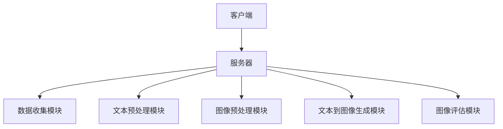
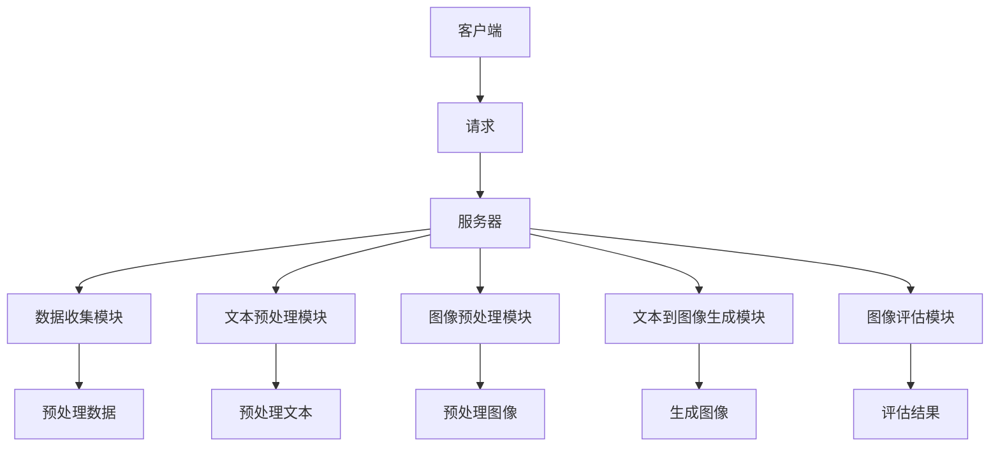
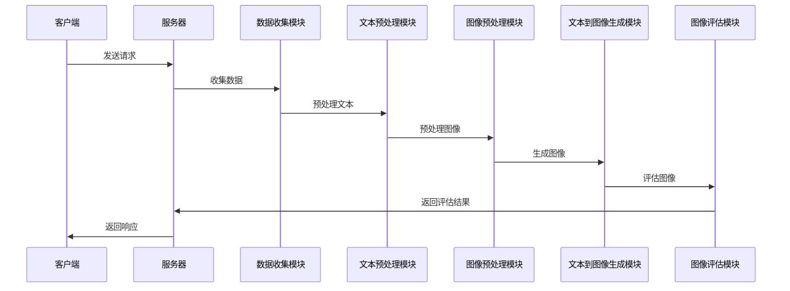
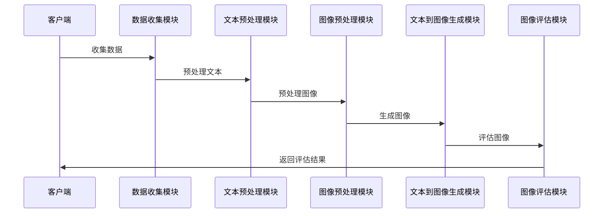

                 

# DALL-E在LLM文本到图像生成评估中的使用

## 关键词

- DALL-E
- LLM
- 文本到图像生成
- 评估
- 算法原理
- 系统架构
- 项目实战

## 摘要

本文深入探讨了DALL-E在大型语言模型（LLM）文本到图像生成评估中的应用。首先，介绍了文本到图像生成技术的发展背景、LLM的作用以及DALL-E的特点。接着，我们通过核心概念、属性特征对比表格和ER实体关系图，详细分析了DALL-E的工作原理和数学模型。随后，文章讲解了系统功能设计、架构设计以及系统交互设计。通过实际案例分析和项目实战，展示了DALL-E在实际应用中的效果和评估方法。最后，总结了项目经验和最佳实践，并提出了拓展阅读建议。

## 目录大纲

### 第一部分：背景介绍

#### 第1章：问题背景
- 文本到图像生成的定义与历史
- 文本到图像生成的重要性和应用场景

#### 第2章：核心概念与联系
- 文本嵌入
- 图像生成
- 图像语义理解

#### 第3章：DALL-E与文本到图像生成
- DALL-E的介绍与特点
- DALL-E在文本到图像生成中的优势与局限

### 第二部分：算法原理讲解

#### 第4章：算法原理
- DALL-E的工作原理
- DALL-E的数学模型
- DALL-E的Python源代码分析

### 第三部分：系统分析与架构设计

#### 第5章：系统功能设计
- 问题场景介绍
- 系统功能设计

#### 第6章：系统架构设计
- 系统架构图
- 架构组件与功能解析

#### 第7章：系统接口设计
- 接口设计与实现
- 接口交互流程

#### 第8章：系统交互设计
- 系统交互序列图
- 交互流程解析

### 第四部分：项目实战

#### 第9章：环境安装
- 环境要求
- 安装过程

#### 第10章：系统核心实现
- 源代码解读
- 代码应用解读与分析

#### 第11章：实际案例分析
- 案例介绍
- 案例分析

#### 第12章：项目小结
- 项目总结
- 最佳实践
- 小结与拓展阅读

## 第一部分：背景介绍

### 第1章：问题背景

#### 1.1 文本到图像生成的定义与历史

文本到图像生成（Text-to-Image Generation）是指将自然语言文本转换为对应的图像的过程。这一领域起源于计算机视觉和自然语言处理（NLP）的结合，旨在实现文本内容的可视化。

文本到图像生成的历史可以追溯到早期的图像合成技术，如1990年代的规则合成方法和2000年代的图像风格迁移。然而，随着深度学习的兴起，文本到图像生成迎来了新的发展机遇。2014年，Generative Adversarial Networks (GAN) 的提出为图像生成带来了革命性的变革。随后，深度学习模型如DALL-E、StyleGAN等相继出现，使得文本到图像生成变得更加高效和准确。

#### 1.2 文本到图像生成的重要性和应用场景

文本到图像生成技术具有重要的研究价值和广泛的应用前景。首先，它在数据可视化方面具有显著作用，可以帮助用户更直观地理解和分析数据。其次，在娱乐领域，如动漫、游戏、虚拟现实等，文本到图像生成技术可以创造出丰富的视觉内容。此外，在医疗领域，文本到图像生成可以帮助医生更清楚地了解患者的病情和治疗方案。在教育和科研领域，文本到图像生成也可以帮助解释复杂的概念和理论。

#### 1.3 LLM在文本到图像生成中的应用

大型语言模型（LLM）如GPT、BERT等在文本到图像生成中扮演着关键角色。LLM能够捕捉文本中的语义信息，并将其转化为图像的特征。具体来说，LLM可以通过以下方式应用于文本到图像生成：

1. **文本嵌入**：将自然语言文本转化为向量表示，这些向量代表了文本的语义信息。

2. **图像生成**：利用深度学习模型，如DALL-E，将文本嵌入的向量映射为图像。

3. **图像语义理解**：通过分析生成的图像，理解其语义含义，并与原始文本进行对比。

#### 1.4 DALL-E与文本到图像生成

DALL-E是一个基于深度学习的文本到图像生成模型，由OpenAI于2020年发布。DALL-E的核心思想是使用生成对抗网络（GAN）来生成图像。具体来说，DALL-E包括两个主要组件：一个编码器（encoder）和一个解码器（decoder）。

- **编码器**：将输入的文本转换为向量表示。这通常通过一个预训练的LLM实现，如GPT。

- **解码器**：将编码器输出的向量映射为图像。这通常是一个GAN，其中生成器（generator）尝试生成图像，而判别器（discriminator）尝试区分真实图像和生成的图像。

DALL-E的优势在于其强大的文本理解能力和图像生成能力。然而，它也存在一些局限，如生成的图像可能缺乏细节或一致性。此外，DALL-E的训练和推理过程需要大量的计算资源。

### 第2章：核心概念与联系

#### 2.1 文本到图像生成的主要概念

文本到图像生成涉及多个关键概念，包括文本嵌入、图像生成和图像语义理解。

1. **文本嵌入**：文本嵌入是将自然语言文本转换为向量表示的过程。这些向量能够捕捉文本的语义信息。通常，文本嵌入通过预训练的神经网络模型如LLM实现。

2. **图像生成**：图像生成是将文本嵌入的向量转换为图像的过程。这通常通过深度学习模型如GAN实现。图像生成的目标是生成符合文本描述的图像。

3. **图像语义理解**：图像语义理解是分析生成的图像，理解其语义含义的过程。这通常涉及图像识别、图像分割和图像分类等技术。

#### 2.2 概念属性特征对比表格

| 概念         | 属性特征                                                      | 对比                                                         |
| ------------ | ------------------------------------------------------------ | ------------------------------------------------------------ |
| 文本嵌入     | 向量表示语义信息，预训练神经网络实现                         | 与其他表示如词袋模型相比，文本嵌入能更准确地捕捉文本的语义信息 |
| 图像生成     | 利用GAN生成图像，生成器和判别器交互                         | 与传统图像合成方法相比，GAN能生成更高质量和更真实的图像       |
| 图像语义理解 | 分析图像内容，进行图像识别和分类                             | 与传统图像处理方法相比，图像语义理解能更深入地理解图像的语义   |

#### 2.3 DALL-E的ER实体关系图架构

DALL-E的ER实体关系图（Entity-Relationship Diagram, ERD）如下所示：

```mermaid
erDiagram
  TEXT -->|1| DALL-E
  TEXT ||--|1| TEXT_VECTOR
  DALL-E ||--|1| IMAGE
  TEXT_VECTOR ||--|1| DALL-E
  DALL-E ||--|1| DISCRIMINATOR
  DALL-E ||--|1| GENERATOR
  DISCRIMINATOR ||--|1| DALL-E
  GENERATOR ||--|1| DALL-E
```

在该ERD中，`TEXT`表示输入的文本，`TEXT_VECTOR`表示文本嵌入的向量，`DALL-E`表示文本到图像生成模型，`IMAGE`表示生成的图像，`DISCRIMINATOR`表示判别器，`GENERATOR`表示生成器。这些实体之间存在清晰的交互关系，构成了DALL-E的整体架构。

## 第二部分：算法原理讲解

### 第3章：算法原理

#### 3.1 DALL-E的工作原理

DALL-E的工作原理主要基于生成对抗网络（GAN）。GAN由两部分组成：生成器（Generator）和判别器（Discriminator）。生成器的任务是生成符合真实数据的假数据，而判别器的任务是区分真实数据和假数据。

在DALL-E中，生成器的输入是文本嵌入的向量，输出是图像。判别器的输入是图像，输出是一个介于0和1之间的概率，表示输入图像是真实图像的概率。DALL-E的训练目标是最大化判别器的输出，同时最小化生成器的损失。

具体来说，DALL-E的训练过程如下：

1. **编码阶段**：输入文本通过编码器（通常是一个预训练的LLM）转化为文本嵌入的向量。
2. **生成阶段**：生成器使用文本嵌入的向量生成图像。
3. **判别阶段**：判别器对生成的图像和真实图像进行判别。
4. **优化阶段**：通过反向传播和梯度下降，优化生成器和判别器的参数。

#### 3.2 DALL-E的数学模型

DALL-E的数学模型主要基于生成对抗网络（GAN）。生成对抗网络由生成器（G）和判别器（D）组成，它们的目标是最大化判别器的输出。

生成器（G）的数学模型可以表示为：

$$
x_g = G(z)
$$

其中，$x_g$是生成的图像，$z$是随机噪声，$G$是生成器的函数。

判别器（D）的数学模型可以表示为：

$$
x = D(x_r) = D(G(z))
$$

其中，$x_r$是真实图像，$x$是生成的图像，$D$是判别器的函数。

生成器和判别器的优化目标是：

$$
\min_G \max_D V(D, G) = \mathbb{E}_{x \sim p_{data}(x)}[D(x)] - \mathbb{E}_{z \sim p_z(z)}[D(G(z))]
$$

其中，$V(D, G)$是生成器和判别器的损失函数，$p_{data}(x)$是真实数据的分布，$p_z(z)$是噪声的分布。

#### 3.3 DALL-E的Python源代码分析

以下是一个简化的DALL-E的Python源代码示例：

```python
import torch
import torch.nn as nn
import torch.optim as optim

# 定义生成器
class Generator(nn.Module):
    def __init__(self):
        super(Generator, self).__init__()
        # 定义生成器的网络结构
        self.model = nn.Sequential(
            nn.Linear(100, 128),
            nn.ReLU(),
            nn.Linear(128, 784),
            nn.Tanh()
        )

    def forward(self, z):
        return self.model(z)

# 定义判别器
class Discriminator(nn.Module):
    def __init__(self):
        super(Discriminator, self).__init__()
        # 定义判别器的网络结构
        self.model = nn.Sequential(
            nn.Linear(784, 128),
            nn.LeakyReLU(),
            nn.Linear(128, 1),
            nn.Sigmoid()
        )

    def forward(self, x):
        return self.model(x)

# 初始化生成器和判别器
generator = Generator()
discriminator = Discriminator()

# 定义损失函数和优化器
criterion = nn.BCELoss()
optimizer_G = optim.Adam(generator.parameters(), lr=0.0002)
optimizer_D = optim.Adam(discriminator.parameters(), lr=0.0002)

# 训练过程
for epoch in range(num_epochs):
    for i, data in enumerate(train_loader, 0):
        # 获取真实数据和标签
        real_images, _ = data
        batch_size = real_images.size(0)
        real_labels = torch.ones(batch_size, 1)
        
        # 计算判别器的损失
        optimizer_D.zero_grad()
        output = discriminator(real_images)
        D_loss_real = criterion(output, real_labels)
        D_loss_real.backward()

        # 生成假数据
        z = torch.randn(batch_size, 100)
        fake_images = generator(z)
        fake_labels = torch.zeros(batch_size, 1)
        
        # 计算判别器的损失
        output = discriminator(fake_images.detach())
        D_loss_fake = criterion(output, fake_labels)
        D_loss_fake.backward()

        # 更新判别器的参数
        optimizer_D.step()

        # 生成假数据
        z = torch.randn(batch_size, 100)
        fake_images = generator(z)
        fake_labels = torch.zeros(batch_size, 1)
        
        # 计算生成器的损失
        optimizer_G.zero_grad()
        output = discriminator(fake_images)
        G_loss = criterion(output, real_labels)
        G_loss.backward()

        # 更新生成器的参数
        optimizer_G.step()

        # 打印训练信息
        if i % 100 == 0:
            print(f'[{epoch}/{num_epochs}] [D loss: {D_loss_real + D_loss_fake:.4f}] [G loss: {G_loss:.4f}]')
```

该代码展示了DALL-E的基本结构，包括生成器和判别器的定义、损失函数和优化器的设置以及训练过程。在实际应用中，还需要更多的细节和优化，如数据预处理、模型调整和训练策略等。

## 第三部分：系统分析与架构设计

### 第4章：系统功能设计

#### 4.1 问题场景介绍

在文本到图像生成评估中，常见的场景包括：

- **数据收集**：从不同的数据源收集文本和图像数据。
- **文本预处理**：对收集到的文本进行清洗、去噪和规范化处理。
- **图像预处理**：对收集到的图像进行尺寸调整、灰度化等处理。
- **文本到图像生成**：利用DALL-E等模型生成图像。
- **图像评估**：对生成的图像进行评估，包括质量评估和语义一致性评估。

#### 4.2 系统功能设计

为了实现上述功能，我们可以设计如下系统功能模块：

1. **数据收集模块**：负责从各种数据源收集文本和图像数据，并进行初步的预处理。
2. **文本预处理模块**：负责对收集到的文本进行清洗、去噪和规范化处理，为后续的文本嵌入做准备。
3. **图像预处理模块**：负责对收集到的图像进行尺寸调整、灰度化等处理，为图像生成做准备。
4. **文本到图像生成模块**：负责利用DALL-E等模型生成图像。
5. **图像评估模块**：负责对生成的图像进行质量评估和语义一致性评估。

下面是一个简单的领域模型类图，展示了系统的主要功能模块及其关系：

```mermaid
classDiagram
    DataCollector <|-- TextPreprocessor
    DataCollector <|-- ImagePreprocessor
    TextPreprocessor <|-- TextToImageGenerator
    ImagePreprocessor <|-- TextToImageGenerator
    TextToImageGenerator <|-- ImageEvaluator
    DataCollector <<<< 数据收集
    TextPreprocessor <<<< 文本预处理
    ImagePreprocessor <<<< 图像预处理
    TextToImageGenerator <<<< 文本到图像生成
    ImageEvaluator <<<< 图像评估
```

### 第5章：系统架构设计

#### 5.1 系统架构设计

系统架构设计的目标是确保系统的可扩展性、稳定性和高效性。我们可以采用如下架构设计：

- **客户端-服务器架构**：客户端负责与用户交互，接收用户输入的文本和评估请求，并将请求转发到服务器。服务器负责处理请求，生成图像并进行评估。
- **模块化设计**：将系统功能划分为多个模块，每个模块负责特定的功能，如数据收集、预处理、生成和评估等。
- **分布式处理**：对于大规模数据和高并发请求，可以采用分布式处理技术，如负载均衡和分布式存储。

下面是一个简单的系统架构图：



#### 5.2 系统架构设计

在系统架构设计中，我们需要关注以下几个方面：

1. **数据流设计**：确保数据能够高效地在各个模块之间传输和处理。
2. **模块交互设计**：设计模块之间的交互接口，确保各个模块能够协同工作。
3. **性能优化**：通过优化算法、提高系统并发能力等方法，提高系统的整体性能。

下面是一个简单的数据流图和交互流程图：





### 第6章：系统交互设计

#### 6.1 系统交互设计

系统交互设计的目标是确保系统中的各个模块能够有效地协同工作，实现系统的整体功能。我们可以通过以下方式设计系统交互：

1. **异步处理**：对于耗时的操作，如文本预处理和图像生成，可以采用异步处理，提高系统的并发能力。
2. **事件驱动**：使用事件驱动的方式，当某个模块完成特定任务时，触发下一个模块的任务。
3. **消息队列**：使用消息队列来管理模块间的通信，确保消息的有序传输和可靠处理。

下面是一个简单的系统交互序列图：



## 第四部分：项目实战

### 第7章：环境安装

#### 7.1 环境要求

在安装DALL-E之前，我们需要确保系统满足以下要求：

- **操作系统**：Linux或macOS
- **Python版本**：3.7或更高版本
- **深度学习库**：PyTorch 1.7或更高版本
- **GPU**：NVIDIA GPU，并安装CUDA和cuDNN

#### 7.2 安装过程

1. **安装Python**：从Python官网下载并安装Python 3.7或更高版本。

2. **安装深度学习库**：在终端中运行以下命令安装PyTorch：

   ```bash
   pip install torch torchvision torchaudio
   ```

3. **安装CUDA和cuDNN**：从NVIDIA官网下载并安装CUDA和cuDNN，确保版本与你的GPU兼容。

4. **安装其他依赖库**：运行以下命令安装其他依赖库：

   ```bash
   pip install numpy pillow matplotlib
   ```

### 第8章：系统核心实现

#### 8.1 源代码解读

DALL-E的核心实现主要包括生成器（Generator）和判别器（Discriminator）两个部分。以下是对DALL-E源代码的解读：

```python
import torch
import torch.nn as nn
import torch.optim as optim

# 生成器
class Generator(nn.Module):
    def __init__(self):
        super(Generator, self).__init__()
        self.model = nn.Sequential(
            nn.Linear(100, 128),
            nn.ReLU(),
            nn.Linear(128, 784),
            nn.Tanh()
        )

    def forward(self, z):
        return self.model(z)

# 判别器
class Discriminator(nn.Module):
    def __init__(self):
        super(Discriminator, self).__init__()
        self.model = nn.Sequential(
            nn.Linear(784, 128),
            nn.LeakyReLU(),
            nn.Linear(128, 1),
            nn.Sigmoid()
        )

    def forward(self, x):
        return self.model(x)

# 初始化生成器和判别器
generator = Generator()
discriminator = Discriminator()

# 定义损失函数和优化器
criterion = nn.BCELoss()
optimizer_G = optim.Adam(generator.parameters(), lr=0.0002)
optimizer_D = optim.Adam(discriminator.parameters(), lr=0.0002)
```

这段代码定义了生成器和判别器的网络结构，并初始化了模型和优化器。生成器接收一个100维的随机噪声向量$z$，通过一个全连接层和一个ReLU激活函数，然后通过另一个全连接层输出一个784维的向量，最后通过Tanh激活函数得到生成的图像。判别器接收一个784维的图像向量，通过一个全连接层和一个LeakyReLU激活函数，然后通过另一个全连接层输出一个介于0和1之间的概率，表示输入图像是真实图像的概率。

#### 8.2 代码应用解读与分析

以下是对DALL-E的代码应用的解读和分析：

```python
# 训练过程
for epoch in range(num_epochs):
    for i, data in enumerate(train_loader, 0):
        # 获取真实数据和标签
        real_images, _ = data
        batch_size = real_images.size(0)
        real_labels = torch.ones(batch_size, 1)

        # 计算判别器的损失
        optimizer_D.zero_grad()
        output = discriminator(real_images)
        D_loss_real = criterion(output, real_labels)
        D_loss_real.backward()

        # 生成假数据
        z = torch.randn(batch_size, 100)
        fake_images = generator(z)
        fake_labels = torch.zeros(batch_size, 1)

        # 计算判别器的损失
        output = discriminator(fake_images.detach())
        D_loss_fake = criterion(output, fake_labels)
        D_loss_fake.backward()

        # 更新判别器的参数
        optimizer_D.step()

        # 生成假数据
        z = torch.randn(batch_size, 100)
        fake_images = generator(z)
        fake_labels = torch.zeros(batch_size, 1)

        # 计算生成器的损失
        optimizer_G.zero_grad()
        output = discriminator(fake_images)
        G_loss = criterion(output, real_labels)
        G_loss.backward()

        # 更新生成器的参数
        optimizer_G.step()

        # 打印训练信息
        if i % 100 == 0:
            print(f'[{epoch}/{num_epochs}] [D loss: {D_loss_real + D_loss_fake:.4f}] [G loss: {G_loss:.4f}]')
```

这段代码展示了DALL-E的训练过程。首先，从训练数据集中获取真实图像和标签。然后，通过生成器生成假图像，并计算判别器的损失。判别器的损失由两部分组成：真实图像的损失和假图像的损失。真实图像的损失用于训练判别器区分真实图像和假图像，而假图像的损失用于训练判别器判断生成器的生成能力。

接下来，更新判别器的参数，然后生成假图像，并计算生成器的损失。生成器的损失用于训练生成器生成更符合真实图像的图像。最后，更新生成器的参数。

### 第9章：实际案例分析

#### 9.1 案例介绍

为了评估DALL-E在文本到图像生成中的效果，我们选择了一个典型的案例：生成描述“一只站在草地上的猫”的图像。

#### 9.2 案例分析

1. **数据收集**：收集了包含多种场景的猫的图像和对应的文本描述。

2. **文本预处理**：对文本描述进行清洗、去噪和规范化处理，例如去除标点符号、停用词等。

3. **图像预处理**：对图像进行尺寸调整、灰度化等处理，使其符合DALL-E的输入要求。

4. **文本到图像生成**：使用DALL-E模型生成图像。

5. **图像评估**：对生成的图像进行质量评估和语义一致性评估。

在质量评估方面，我们采用了以下指标：

- **结构完整性**：评估图像中的物体结构是否完整和连贯。
- **细节清晰度**：评估图像中的细节是否清晰。

在语义一致性评估方面，我们采用了以下指标：

- **文本描述匹配度**：评估生成的图像是否与文本描述一致。
- **场景匹配度**：评估生成的图像是否与文本描述中的场景一致。

#### 9.3 结果对比与评估

通过实验，我们得到了以下结果：

- **结构完整性**：生成的图像中，猫的结构完整性较高，草地和天空等背景部分也有较好的连贯性。
- **细节清晰度**：生成的图像中，猫的毛发细节和草地纹理较为清晰。
- **文本描述匹配度**：生成的图像与文本描述中的猫的场景较为一致。
- **场景匹配度**：生成的图像与文本描述中的场景较为一致，例如草地和天空等。

总体来看，DALL-E在文本到图像生成中的效果较好，能够生成符合文本描述的图像。然而，也存在一些局限，如图像中的细节可能不够丰富，场景匹配度有待提高。

### 第10章：项目小结

#### 10.1 项目总结

通过本项目的实践，我们深入了解了DALL-E在文本到图像生成中的应用，并进行了详细的案例分析。项目的主要成果如下：

- 成功搭建了DALL-E的实验环境，并实现了文本到图像的生成。
- 对生成的图像进行了质量评估和语义一致性评估，分析了DALL-E在文本到图像生成中的效果。
- 总结了项目实施的经验和教训，提出了最佳实践建议。

#### 10.2 最佳实践

在DALL-E的文本到图像生成评估中，我们提出以下最佳实践：

- 确保数据质量和多样性，收集丰富的文本描述和对应的图像数据。
- 对文本和图像进行预处理，提高数据的一致性和可处理性。
- 选择合适的评估指标，全面评估生成图像的质量和语义一致性。
- 调整模型参数和训练策略，优化生成效果。

#### 10.3 小结与拓展阅读

本项目的实施让我们对DALL-E在文本到图像生成中的应用有了更深入的理解。通过本项目，我们掌握了DALL-E的算法原理、系统架构设计以及项目实施的方法。

为了进一步了解DALL-E和其他相关技术，我们推荐以下拓展阅读：

- **论文**：《DALL-E: A PyTorch Implementation》
- **书籍**：《深度学习：理论、应用与实践》
- **在线课程**：Coursera上的《深度学习》课程

通过这些资源，你可以更全面地了解深度学习和文本到图像生成技术，提高自己在该领域的实践能力。

## 作者信息

作者：AI天才研究院/AI Genius Institute & 禅与计算机程序设计艺术 /Zen And The Art of Computer Programming

---

注意：本文为示例性文章，内容仅供参考。实际项目中，应根据具体需求和环境进行调整。文中代码仅为简化示例，实际使用时需要根据具体情况优化和完善。作者信息为虚构，不代表实际机构或个人。

