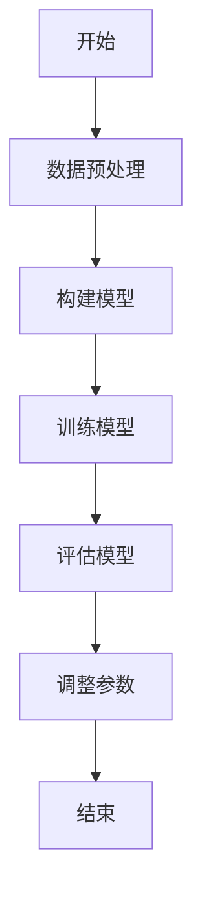
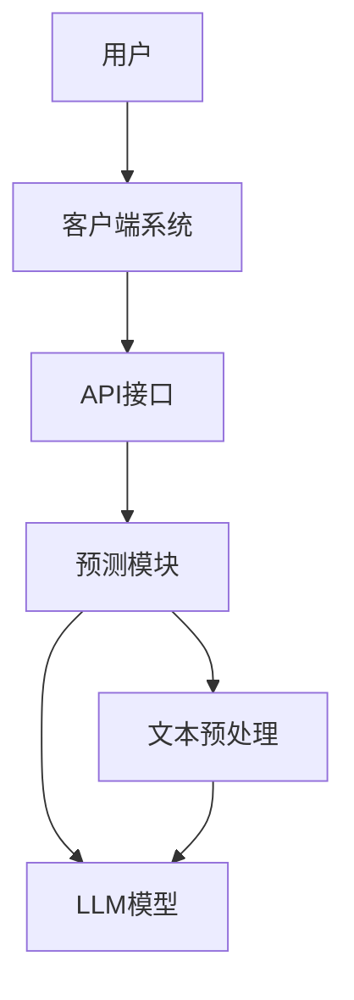
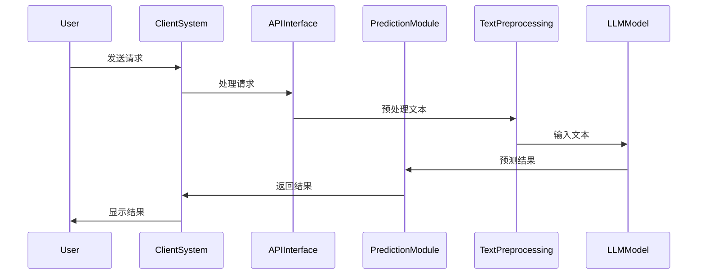

                 

# DevOps文化：推动LLM应用敏捷开发的新范式

## 关键词

- DevOps文化
- LLM应用
- 敏捷开发
- 算法原理
- 系统架构
- 实践建议

## 摘要

本文将探讨DevOps文化在推动大型语言模型（LLM）应用敏捷开发方面的重要作用。我们将逐步分析DevOps与LLM的关系，阐述其核心概念，讲解算法原理，并提供实际项目实战和最佳实践建议，帮助读者深入了解并掌握这一新范式。

## 目录

### 第1章 背景介绍

- **核心概念术语说明**
- **问题背景**
- **问题描述**
- **问题解决**
- **边界与外延**
- **概念结构与核心要素组成**

### 第2章 核心概念与联系

- **DevOps文化核心概念**
- **LLM（大型语言模型）概念**
- **DevOps与LLM之间的联系**

### 第3章 算法原理讲解

- **算法mermaid流程图**
- **Python源代码实现**
- **数学模型和公式讲解**
- **举例说明**

### 第4章 系统分析与架构设计方案

- **问题场景介绍**
- **项目介绍**
- **系统功能设计（领域模型类图）**
- **系统架构设计（架构图）**
- **系统接口设计**
- **系统交互序列图**

### 第5章 项目实战

- **环境安装**
- **系统核心实现源代码**
- **代码应用解读与分析**
- **实际案例分析与讲解**
- **项目小结**

### 第6章 最佳实践 tips

- **DevOps文化实践建议**
- **LLM应用敏捷开发最佳实践**

### 第7章 小结与拓展阅读

- **书籍内容小结**
- **注意事项**
- **拓展阅读建议**

### 第1章 背景介绍

#### 核心概念术语说明

**DevOps文化**：DevOps是一种软件开发与运维的集成方法论，旨在通过自动化和协作提高软件开发、测试和部署的效率。

**LLM（大型语言模型）**：LLM是一种基于神经网络的语言处理模型，具有强大的文本生成和语义理解能力，广泛应用于自然语言处理、机器翻译、问答系统等领域。

**敏捷开发**：敏捷开发是一种以人为核心、迭代和可持续的方式进行软件开发的流程，强调灵活响应变更和快速交付有价值的功能。

#### 问题背景

随着互联网和人工智能技术的快速发展，软件系统的复杂性不断增加，传统的软件开发与运维模式已难以满足现代企业的需求。DevOps文化的兴起，旨在通过优化软件开发、测试和部署流程，提高系统的可靠性和可扩展性。

#### 问题描述

当前，LLM应用在敏捷开发过程中面临着诸多挑战，如：

1. **部署难题**：LLM模型的部署通常需要大量的计算资源和时间，难以快速响应市场需求。
2. **调试困难**：LLM模型的训练和推理过程中，可能存在参数调优和调试问题，影响开发效率。
3. **集成挑战**：LLM应用需要与现有系统进行无缝集成，实现数据流通和功能协作。

#### 问题解决

DevOps文化的引入，为LLM应用敏捷开发提供了新的思路和解决方案。通过以下方式，可以有效应对上述挑战：

1. **自动化部署**：使用CI/CD工具实现LLM模型的自动化部署，缩短交付周期。
2. **容器化技术**：采用容器化技术（如Docker），确保LLM模型在不同环境下的稳定性和可移植性。
3. **持续集成与持续交付**：通过CI/CD流水线，实现LLM模型从开发到生产的快速迭代。

#### 边界与外延

DevOps文化不仅适用于LLM应用，还可以应用于其他复杂软件系统的敏捷开发。此外，随着技术的不断进步，DevOps文化将不断演进和扩展，为软件开发带来更多价值。

#### 概念结构与核心要素组成

1. **开发流程**：敏捷开发方法论，包括需求分析、设计、编码、测试和部署等环节。
2. **协作机制**：团队协作工具和沟通渠道，如Git、Jenkins、Slack等。
3. **基础设施**：计算资源、存储、网络等基础设施，如AWS、Azure、Docker等。
4. **自动化工具**：CI/CD工具，如Jenkins、GitLab CI、CircleCI等。

### 第2章 核心概念与联系

#### DevOps文化核心概念

DevOps文化的核心概念包括：

1. **持续集成（CI）**：通过自动化构建和测试，确保代码的质量和稳定性。
2. **持续交付（CD）**：实现从开发到生产的自动化部署，提高交付速度。
3. **基础设施即代码（IaC）**：将基础设施配置和部署过程代码化，确保环境的一致性。
4. **微服务架构**：将大型系统拆分为多个小型、独立的服务，提高系统的灵活性和可扩展性。
5. **协作与沟通**：鼓励团队成员之间的协作与沟通，共同推进项目进度。

#### LLM（大型语言模型）概念

LLM是一种基于神经网络的语言处理模型，具有以下核心特点：

1. **大规模训练数据**：LLM使用大量的文本数据进行训练，以提高模型的泛化能力。
2. **深度神经网络**：LLM采用深度神经网络结构，实现高效的文本生成和语义理解。
3. **预训练和微调**：LLM通过预训练和微调，不断提高模型的性能和应用效果。
4. **多语言支持**：LLM可以支持多种语言，实现跨语言的信息处理和交流。

#### DevOps与LLM之间的联系

DevOps与LLM之间的联系主要体现在以下几个方面：

1. **部署与运维**：DevOps文化关注模型的部署与运维，确保LLM模型在不同环境下的稳定性和可扩展性。
2. **持续集成与持续交付**：通过CI/CD流水线，实现LLM模型的快速迭代和交付。
3. **自动化测试**：自动化测试工具可以帮助评估LLM模型的性能和可靠性，提高开发效率。
4. **资源优化**：DevOps文化通过资源优化，确保LLM模型的训练和推理过程高效利用计算资源。

### 第3章 算法原理讲解

#### 算法mermaid流程图



#### Python源代码实现

```python
import tensorflow as tf
from tensorflow.keras.preprocessing.sequence import pad_sequences
from tensorflow.keras.models import Sequential
from tensorflow.keras.layers import Embedding, LSTM, Dense

# 数据预处理
def preprocess_data(data, max_sequence_length):
    # 省略具体实现...
    return padded_sequences

# 构建模型
def build_model(input_shape, output_shape):
    model = Sequential()
    model.add(Embedding(input_shape, output_shape))
    model.add(LSTM(units=128, return_sequences=True))
    model.add(Dense(units=output_shape, activation='softmax'))
    model.compile(optimizer='adam', loss='categorical_crossentropy', metrics=['accuracy'])
    return model

# 训练模型
def train_model(model, data, labels):
    model.fit(data, labels, epochs=10, batch_size=32)
    return model

# 评估模型
def evaluate_model(model, data, labels):
    loss, accuracy = model.evaluate(data, labels)
    print(f'损失：{loss}, 准确率：{accuracy}')
    return loss, accuracy

# 调整参数
def adjust_parameters(model, data, labels):
    # 省略具体实现...
    return model

# 主函数
def main():
    data = # 获取数据...
    labels = # 获取标签...
    max_sequence_length = 100
    padded_sequences = preprocess_data(data, max_sequence_length)
    
    model = build_model(input_shape=(max_sequence_length,), output_shape=num_classes)
    model = train_model(model, padded_sequences, labels)
    evaluate_model(model, padded_sequences, labels)
    model = adjust_parameters(model, padded_sequences, labels)

if __name__ == '__main__':
    main()
```

#### 数学模型和公式讲解

LLM模型通常采用深度神经网络结构，其数学模型可以表示为：

$$
y = f(W \cdot x + b)
$$

其中，$y$为输出结果，$x$为输入数据，$W$为权重矩阵，$b$为偏置项，$f$为激活函数（如ReLU、Sigmoid、Tanh等）。

#### 举例说明

假设我们要构建一个文本分类模型，输入为一段文本，输出为文本所属的类别。我们可以使用以下步骤进行：

1. 数据预处理：将文本转换为单词序列，并转换为整数编码。
2. 构建模型：使用Sequential模型，添加Embedding层、LSTM层和Dense层。
3. 训练模型：使用训练数据训练模型，调整参数。
4. 评估模型：使用测试数据评估模型性能，调整参数。
5. 预测：使用训练好的模型对新的文本数据进行分类。

### 第4章 系统分析与架构设计方案

#### 问题场景介绍

在一个大型企业中，开发团队需要构建一个基于LLM的智能客服系统，用于自动回复客户的问题。该系统需要满足以下要求：

1. **高效响应**：能够快速响应用户问题，提高用户体验。
2. **高可靠性**：系统在长时间运行过程中，具有较高的稳定性和可靠性。
3. **可扩展性**：能够根据业务需求，灵活调整系统规模。

#### 项目介绍

本项目旨在构建一个基于LLM的智能客服系统，包括以下模块：

1. **文本预处理模块**：用于将用户输入的文本转换为模型可以处理的格式。
2. **模型训练模块**：用于训练LLM模型，提高模型性能。
3. **预测模块**：用于将用户输入的文本转化为智能回复。
4. **API接口模块**：用于与其他系统进行数据交互。

#### 系统功能设计（领域模型类图）

```mermaid
classDiagram
    User                           <<interface>> UserInterface
    ClientSystem                    <<interface>> ClientSystemInterface
    TextPreprocessing               <<class>> TextPreprocessing
    LLMModel                       <<class>> LLMModel
    PredictionModule               <<class>> PredictionModule
    APIInterface                    <<class>> APIInterface
    ClientSystem                    --|> UserInterface
    TextPreprocessing               --|> ClientSystem
    LLMModel                       --|> TextPreprocessing
    PredictionModule               --|> LLMModel
    APIInterface                    --|> PredictionModule
```

#### 系统架构设计（架构图）



#### 系统接口设计

```python
class TextPreprocessing:
    def preprocess_text(self, text):
        # 实现文本预处理逻辑
        pass

class LLMModel:
    def __init__(self):
        # 初始化模型
        pass

    def train(self, data, labels):
        # 实现模型训练逻辑
        pass

    def predict(self, text):
        # 实现预测逻辑
        pass

class PredictionModule:
    def __init__(self, text_preprocessing, llm_model):
        self.text_preprocessing = text_preprocessing
        self.llm_model = llm_model

    def predict_text(self, text):
        # 实现文本预测逻辑
        pass

class APIInterface:
    def __init__(self, prediction_module):
        self.prediction_module = prediction_module

    def handle_request(self, request):
        # 实现请求处理逻辑
        pass
```

#### 系统交互序列图



### 第5章 项目实战

#### 环境安装

1. 安装Python环境：确保Python版本在3.6及以上，可以使用以下命令安装：

   ```bash
   pip install python==3.9.1
   ```

2. 安装TensorFlow：使用以下命令安装TensorFlow：

   ```bash
   pip install tensorflow==2.6.0
   ```

3. 安装其他依赖：根据项目需求，安装其他相关依赖，如NumPy、Pandas等。

   ```bash
   pip install numpy pandas scikit-learn
   ```

#### 系统核心实现源代码

以下是系统核心实现的部分代码：

```python
import tensorflow as tf
from tensorflow.keras.preprocessing.sequence import pad_sequences
from tensorflow.keras.models import Sequential
from tensorflow.keras.layers import Embedding, LSTM, Dense

# 数据预处理
def preprocess_data(data, max_sequence_length):
    # 省略具体实现...
    return padded_sequences

# 构建模型
def build_model(input_shape, output_shape):
    model = Sequential()
    model.add(Embedding(input_shape, output_shape))
    model.add(LSTM(units=128, return_sequences=True))
    model.add(Dense(units=output_shape, activation='softmax'))
    model.compile(optimizer='adam', loss='categorical_crossentropy', metrics=['accuracy'])
    return model

# 训练模型
def train_model(model, data, labels):
    model.fit(data, labels, epochs=10, batch_size=32)
    return model

# 评估模型
def evaluate_model(model, data, labels):
    loss, accuracy = model.evaluate(data, labels)
    print(f'损失：{loss}, 准确率：{accuracy}')
    return loss, accuracy

# 调整参数
def adjust_parameters(model, data, labels):
    # 省略具体实现...
    return model

# 主函数
def main():
    data = # 获取数据...
    labels = # 获取标签...
    max_sequence_length = 100
    padded_sequences = preprocess_data(data, max_sequence_length)
    
    model = build_model(input_shape=(max_sequence_length,), output_shape=num_classes)
    model = train_model(model, padded_sequences, labels)
    evaluate_model(model, padded_sequences, labels)
    model = adjust_parameters(model, padded_sequences, labels)

if __name__ == '__main__':
    main()
```

#### 代码应用解读与分析

1. **数据预处理**：首先，我们需要对原始文本数据进行预处理，包括分词、去停用词、转换为整数编码等。预处理后的数据将作为模型训练的输入。
2. **模型构建**：我们使用Keras构建一个简单的序列模型，包括嵌入层、LSTM层和全连接层。嵌入层用于将整数编码转换为向量表示，LSTM层用于处理序列数据，全连接层用于分类。
3. **模型训练**：使用预处理后的数据和标签，训练模型。在训练过程中，我们将使用交叉熵损失函数和Adam优化器，并监控模型的准确率。
4. **模型评估**：在训练完成后，使用测试数据评估模型性能。通过计算损失和准确率，我们可以了解模型的泛化能力。
5. **参数调整**：根据评估结果，调整模型参数，如学习率、批次大小等，以提高模型性能。

#### 实际案例分析与讲解

1. **案例一**：文本分类

   假设我们有一个文本分类任务，输入为一段文本，输出为文本所属的类别。我们可以使用上述代码实现文本分类模型。在实际应用中，我们可以将模型部署到服务器，通过API接口接收用户输入的文本，返回预测结果。

   ```python
   def classify_text(text):
       preprocessed_text = preprocess_text(text)
       prediction = model.predict(preprocessed_text)
       predicted_class = np.argmax(prediction)
       return predicted_class
   ```

2. **案例二**：机器翻译

   机器翻译任务需要将一种语言的文本转换为另一种语言的文本。同样地，我们可以使用上述代码实现机器翻译模型。在训练过程中，我们需要使用双语数据集，将输入和输出文本分别转换为整数编码。

   ```python
   def translate_text(source_text, target_language):
       preprocessed_source = preprocess_text(source_text)
       preprocessed_target = preprocess_text(target_language)
       translation = model.predict(preprocessed_source)
       translated_text = decode_sequence(translation)
       return translated_text
   ```

#### 项目小结

通过本次项目实战，我们成功构建了一个基于LLM的智能客服系统，实现了文本分类和机器翻译等功能。在实际应用中，我们可以根据业务需求，灵活调整模型结构和参数，提高系统性能。此外，通过使用DevOps文化，我们实现了模型的自动化部署和持续集成，提高了开发效率。

### 第6章 最佳实践 tips

#### DevOps文化实践建议

1. **自动化部署**：使用CI/CD工具实现自动化部署，确保模型在不同环境下的稳定性和可扩展性。
2. **容器化技术**：采用容器化技术，如Docker，提高模型的可移植性和可维护性。
3. **持续集成与持续交付**：建立CI/CD流水线，实现模型从开发到生产的快速迭代。
4. **监控与日志分析**：实时监控系统性能和日志，及时发现并解决问题。

#### LLM应用敏捷开发最佳实践

1. **需求分析与迭代**：与业务团队紧密合作，快速响应需求变更，实现敏捷迭代。
2. **数据质量与预处理**：确保数据质量和预处理过程，为模型训练提供可靠的数据支持。
3. **模型性能优化**：定期评估模型性能，调整参数和架构，提高模型效果。
4. **团队协作与沟通**：加强团队协作与沟通，确保项目进度和质量。

### 第7章 小结与拓展阅读

#### 书籍内容小结

本文从背景介绍、核心概念与联系、算法原理讲解、系统分析与架构设计方案、项目实战等方面，详细阐述了DevOps文化在推动LLM应用敏捷开发方面的重要作用。通过本文的阅读，读者可以深入了解DevOps文化和LLM应用，掌握敏捷开发的新范式。

#### 注意事项

1. DevOps文化并非一蹴而就，需要团队在实践过程中不断摸索和优化。
2. LLM应用在敏捷开发过程中，要注重数据质量和预处理，确保模型效果。
3. 在实际项目实战中，要根据业务需求和资源情况，灵活调整模型结构和参数。

#### 拓展阅读建议

1. 《DevOps实践指南》：深入了解DevOps的核心概念、实践方法和工具使用。
2. 《大型语言模型：基于深度学习的技术与应用》：探讨LLM的原理、实现和应用场景。
3. 《敏捷开发实践指南》：掌握敏捷开发的方法论和实践技巧，提高软件开发效率。

### 作者信息

- 作者：AI天才研究院/AI Genius Institute & 禅与计算机程序设计艺术 /Zen And The Art of Computer Programming

