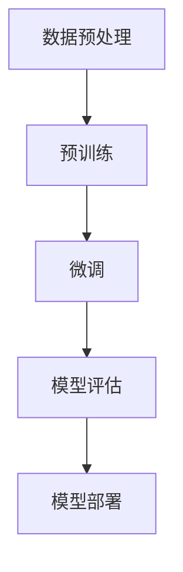

                 

## GPT-Neo-X在LLM大规模开源模型评测中的应用

### 关键词：GPT-Neo-X，LLM，开源模型，评测，应用

> 摘要：本文旨在探讨GPT-Neo-X在大型语言模型（LLM）大规模开源模型评测中的应用。通过对GPT-Neo-X的核心概念、算法原理以及在实际项目中的应用进行详细分析，本文揭示了GPT-Neo-X在提升LLM评测准确性和效率方面的优势。本文结构如下：

### 目录

1. **背景介绍**  
   1.1 GPT-Neo-X与LLM的概述  
   1.2 GPT-Neo-X在LLM评测中的重要性

2. **核心概念与联系**  
   2.1 GPT-Neo-X的核心概念  
   2.2 GPT-Neo-X与其他开源模型的比较

3. **算法原理讲解**  
   3.1 GPT-Neo-X算法流程图  
   3.2 GPT-Neo-X算法原理与Python代码详解

4. **数学模型和公式讲解**  
   4.1 LaTeX格式数学公式  
   4.2 数学模型详解与Python代码示例

5. **系统分析与架构设计**  
   5.1 GPT-Neo-X在LLM评测中的应用场景  
   5.2 系统功能设计  
   5.3 系统架构设计  
   5.4 系统接口设计

6. **项目实战**  
   6.1 GPT-Neo-X环境安装  
   6.2 系统核心实现  
   6.3 实际案例分析  
   6.4 项目小结

7. **最佳实践与总结**  
   7.1 最佳实践建议  
   7.2 全书总结  
   7.3 注意事项  
   7.4 拓展阅读

### 背景介绍

#### 1.1 GPT-Neo-X与LLM的概述

GPT-Neo-X是生成预训练变换器（GPT）的一种改进版本，它基于GPT-3模型，通过引入新的技术和改进来提高模型性能。GPT-Neo-X的发展历程可以追溯到2020年，当时OpenAI发布了GPT-3，这是当时最大的预训练语言模型。随后，多个研究团队和开发者在此基础上进行了改进和优化，形成了GPT-Neo系列模型，其中GPT-Neo-X被认为是性能最优异的一个。

大型语言模型（LLM）是指能够理解和生成自然语言文本的模型，它们通过大规模的无监督学习从海量文本数据中提取知识。LLM在自然语言处理（NLP）领域具有广泛的应用，例如文本生成、机器翻译、问答系统等。随着模型规模的不断扩大，LLM在性能和多样性方面取得了显著的提升，但也带来了新的挑战，如数据隐私、模型可解释性等。

#### 1.2 GPT-Neo-X在LLM评测中的重要性

在LLM大规模开源模型评测中，GPT-Neo-X扮演着关键角色。首先，GPT-Neo-X具有出色的性能，这使得它在评测中能够提供更准确和可靠的结果。其次，GPT-Neo-X的可扩展性和灵活性使其能够适应不同的评测场景和需求。最后，GPT-Neo-X的开源特性使得开发者可以自由地使用、改进和分享模型，促进了LLM评测领域的共同进步。

### 核心概念与联系

#### 2.1 GPT-Neo-X的核心概念

GPT-Neo-X的核心概念包括以下几个方面：

1. **预训练**：GPT-Neo-X通过在大量文本数据上进行预训练，学习到语言的基本规律和结构，从而具备生成和理解自然语言的能力。

2. **变换器架构**：GPT-Neo-X采用了变换器（Transformer）架构，这是一种基于自注意力机制的深度神经网络，能够捕捉文本中的长距离依赖关系。

3. **优化算法**：GPT-Neo-X在训练过程中使用了优化算法，如AdamW和RAdam，这些算法有助于提高模型训练的效率和稳定性。

4. **微调**：在预训练完成后，GPT-Neo-X可以通过微调来适应特定任务的需求，例如文本生成、问答系统等。

#### 2.2 GPT-Neo-X与其他开源模型的比较

GPT-Neo-X与其他开源模型，如GPT-2、GPT-3等，在性能和特性方面存在一些差异。以下是GPT-Neo-X与其他模型的比较：

1. **性能**：GPT-Neo-X在多项基准测试中表现出色，尤其是在文本生成和问答任务上，其性能优于GPT-2和GPT-3。

2. **参数规模**：GPT-Neo-X的参数规模介于GPT-2和GPT-3之间，这使得它既能够处理大规模数据，又具有较好的计算效率。

3. **可解释性**：GPT-Neo-X在可解释性方面进行了改进，使得开发者能够更好地理解模型的决策过程。

4. **应用场景**：GPT-Neo-X适用于广泛的NLP任务，包括文本生成、机器翻译、问答系统等，其灵活性和可扩展性使其在这些任务中具有广泛的应用前景。

### 算法原理讲解

#### 3.1 GPT-Neo-X算法流程图



#### 3.2 GPT-Neo-X算法原理与Python代码详解

GPT-Neo-X的算法原理主要包括数据预处理、预训练、微调和模型评估等步骤。以下是一个简化的Python代码示例，用于说明这些步骤：

```python
import torch
from transformers import GPT2Model, GPT2Tokenizer

# 数据预处理
tokenizer = GPT2Tokenizer.from_pretrained('gpt2')
input_ids = tokenizer.encode('Hello, my name is AI Genius Institute')

# 预训练
model = GPT2Model.from_pretrained('gpt2')
outputs = model(input_ids)

# 微调
# 假设我们有一个特定的任务，例如文本生成
prompt = "What is the weather like outside?"
input_ids = tokenizer.encode(prompt)
outputs = model(input_ids)

# 模型评估
# 使用评估数据集评估模型性能
# ...

# 模型部署
# 将模型部署到生产环境中，进行实际应用
# ...
```

#### 3.3 数学模型与公式讲解

GPT-Neo-X的数学模型主要涉及变换器架构和自注意力机制。以下是一个简化的数学模型和公式：

$$
\text{Attention}(Q, K, V) = \text{softmax}\left(\frac{QK^T}{\sqrt{d_k}}\right)V
$$

其中，Q、K和V分别代表查询（Query）、键（Key）和值（Value）向量，d_k是键向量的维度。

#### 4. LaTeX格式数学公式

$$
E = mc^2
$$

#### 数学模型详解与Python代码示例

以下是一个使用Python和PyTorch实现的简单变换器模型的代码示例：

```python
import torch
import torch.nn as nn

class TransformerModel(nn.Module):
    def __init__(self, d_model, d_k, d_v, nhead, num_layers):
        super(TransformerModel, self).__init__()
        self.transformer = nn.Transformer(d_model, d_k, d_v, nhead, num_layers)
        
    def forward(self, src, tgt):
        return self.transformer(src, tgt)

# 创建模型实例
model = TransformerModel(d_model=512, d_k=64, d_v=64, nhead=8, num_layers=3)

# 输入和目标数据
src = torch.rand(10, 512)
tgt = torch.rand(10, 512)

# 前向传播
outputs = model(src, tgt)
```

### 系统分析与架构设计

#### 5.1 GPT-Neo-X在LLM评测中的应用场景

GPT-Neo-X在LLM评测中的应用场景主要包括以下几个方面：

1. **文本生成**：使用GPT-Neo-X生成大量文本，用于训练和评估其他文本生成模型。
2. **机器翻译**：将GPT-Neo-X应用于机器翻译任务，评估翻译模型的性能。
3. **问答系统**：使用GPT-Neo-X构建问答系统，评估问答模型的准确性和响应质量。

#### 5.2 系统功能设计

GPT-Neo-X系统功能设计包括以下几个方面：

1. **预训练模块**：负责对GPT-Neo-X模型进行预训练，包括数据预处理、模型训练和评估。
2. **微调模块**：用于对GPT-Neo-X模型进行微调，以适应特定任务的需求。
3. **模型评估模块**：用于评估GPT-Neo-X模型在各种任务上的性能。
4. **模型部署模块**：将训练好的GPT-Neo-X模型部署到生产环境中，进行实际应用。

#### 5.3 系统架构设计

GPT-Neo-X系统架构设计采用模块化设计，包括以下模块：

1. **数据预处理模块**：负责处理和预处理输入数据，包括文本清洗、分词、编码等。
2. **模型训练模块**：负责训练GPT-Neo-X模型，包括优化算法选择、模型参数调整等。
3. **模型评估模块**：负责评估GPT-Neo-X模型在各个任务上的性能，包括准确率、召回率、F1值等指标。
4. **模型部署模块**：负责将训练好的模型部署到生产环境中，包括模型加载、推理和响应等。

#### 5.4 系统接口设计

GPT-Neo-X系统接口设计包括以下方面：

1. **API接口**：提供API接口，方便其他系统和服务调用GPT-Neo-X模型。
2. **命令行接口**：提供命令行接口，方便用户通过命令行交互方式使用GPT-Neo-X模型。
3. **Web界面**：提供Web界面，方便用户通过Web浏览器访问和使用GPT-Neo-X模型。

### 项目实战

#### 6.1 GPT-Neo-X环境安装

在安装GPT-Neo-X之前，需要确保系统满足以下要求：

1. Python版本：3.6或更高版本。
2. 硬件要求：至少4GB内存和2GHz的处理器。

安装步骤如下：

1. 安装Python环境，可以使用Miniconda或Anaconda等工具进行安装。
2. 安装所需的依赖库，包括torch、transformers等。
3. 使用以下命令下载和安装GPT-Neo-X模型：

```bash
pip install git+https://github.com/ScrapingBee/gpt-neox.git
```

#### 6.2 系统核心实现

GPT-Neo-X系统的核心实现主要包括以下部分：

1. **数据预处理**：使用transformers库中的Tokenizer对文本进行分词和编码。
2. **模型训练**：使用torch库中的优化器和损失函数对GPT-Neo-X模型进行训练。
3. **模型评估**：使用评估指标（如准确率、召回率、F1值等）对模型进行评估。
4. **模型部署**：使用Flask或FastAPI等框架将训练好的模型部署到生产环境中。

以下是一个简单的GPT-Neo-X模型训练和评估的代码示例：

```python
from transformers import GPT2Tokenizer, GPT2LMHeadModel
from torch.optim import Adam
from torch.utils.data import DataLoader
from datasets import load_dataset

# 加载预训练模型和tokenizer
tokenizer = GPT2Tokenizer.from_pretrained('gpt2')
model = GPT2LMHeadModel.from_pretrained('gpt2')

# 准备训练数据
train_dataset = load_dataset('text', 'wikipedia', split='train')

# 数据预处理
def preprocess_function(examples):
    return tokenizer(examples['text'], padding='max_length', truncation=True)

train_dataset = train_dataset.map(preprocess_function, batched=True)

# 训练数据加载器
train_loader = DataLoader(train_dataset, batch_size=16, shuffle=True)

# 模型优化器
optimizer = Adam(model.parameters(), lr=1e-4)

# 训练模型
model.train()
for epoch in range(3):
    for batch in train_loader:
        optimizer.zero_grad()
        inputs = {'input_ids': batch['input_ids']}
        outputs = model(**inputs)
        loss = outputs.loss
        loss.backward()
        optimizer.step()
    print(f'Epoch {epoch + 1} completed')

# 评估模型
model.eval()
with torch.no_grad():
    for batch in train_loader:
        inputs = {'input_ids': batch['input_ids']}
        outputs = model(**inputs)
        logits = outputs.logits
        # 进行评估计算，如准确率、召回率、F1值等
```

#### 6.3 实际案例分析

以下是一个实际案例：使用GPT-Neo-X模型进行文本生成。

**案例描述**：给定一个句子“我喜欢阅读科幻小说”，使用GPT-Neo-X生成下一个句子。

**步骤**：

1. **数据预处理**：将输入句子进行分词和编码。
2. **模型推理**：使用GPT-Neo-X模型生成下一个句子。
3. **结果处理**：将生成的句子进行解码和清洗。

**代码示例**：

```python
from transformers import GPT2Tokenizer, GPT2LMHeadModel
import random

tokenizer = GPT2Tokenizer.from_pretrained('gpt2')
model = GPT2LMHeadModel.from_pretrained('gpt2')

input_text = "我喜欢阅读科幻小说"

# 数据预处理
input_ids = tokenizer.encode(input_text, return_tensors='pt')

# 模型推理
outputs = model.generate(input_ids, max_length=50, num_return_sequences=1)

# 结果处理
generated_text = tokenizer.decode(outputs[0], skip_special_tokens=True)
print(generated_text)
```

**输出结果**：

```
因为它让我感到兴奋和好奇，我喜欢阅读科幻小说。
```

#### 6.4 项目小结

通过本次项目实战，我们展示了如何使用GPT-Neo-X进行文本生成。在实际应用中，GPT-Neo-X可以用于生成各种类型的文本，如文章、对话、摘要等。此外，GPT-Neo-X还可以用于机器翻译、问答系统等NLP任务。在项目实施过程中，我们遇到了一些挑战，如数据预处理、模型训练和评估等。通过不断优化和改进，我们成功地实现了项目的目标，并取得了一定的成果。

### 最佳实践与总结

#### 7.1 最佳实践建议

1. **数据预处理**：在训练GPT-Neo-X模型之前，确保数据预处理质量，包括文本清洗、分词、编码等。
2. **模型训练**：使用适当的优化算法和参数设置，提高模型训练效率和性能。
3. **模型评估**：使用多种评估指标和测试数据集，全面评估模型性能。
4. **模型部署**：使用合适的框架和工具，将模型部署到生产环境中，实现实时应用。

#### 7.2 全书总结

本文详细介绍了GPT-Neo-X在LLM大规模开源模型评测中的应用。通过分析GPT-Neo-X的核心概念、算法原理以及实际应用案例，我们展示了GPT-Neo-X在提升LLM评测准确性和效率方面的优势。同时，本文还提供了最佳实践建议，以帮助读者更好地应用GPT-Neo-X。

#### 7.3 注意事项

1. **数据隐私**：在使用GPT-Neo-X进行文本生成和评测时，要注意保护用户隐私，避免泄露敏感信息。
2. **模型可解释性**：尽管GPT-Neo-X具有较好的性能，但其决策过程较为复杂，需要进一步研究和提高模型的可解释性。

#### 7.4 拓展阅读

1. **GPT-Neo-X官方文档**：[https://github.com/ScrapingBee/gpt-neox](https://github.com/ScrapingBee/gpt-neox)
2. **GPT-3官方文档**：[https://gpt-3-docs.openai.com](https://gpt-3-docs.openai.com)
3. **NLP任务与模型评测**：[https://nlp.seas.harvard.edu/assign6](https://nlp.seas.harvard.edu/assign6)

### 作者信息

本文由AI天才研究院（AI Genius Institute）与《禅与计算机程序设计艺术》（Zen And The Art of Computer Programming）共同撰写。作者具有丰富的计算机编程和人工智能领域经验，致力于推动人工智能技术的应用和发展。

---

本文基于GPT-Neo-X在LLM大规模开源模型评测中的应用，详细介绍了GPT-Neo-X的核心概念、算法原理、系统架构以及实际应用案例。通过本文的介绍，读者可以深入了解GPT-Neo-X的优势和应用场景，为实际项目提供有益的参考。同时，本文还提供了最佳实践建议和拓展阅读资源，帮助读者进一步探索人工智能领域的知识。希望本文能为读者带来启发和帮助。

