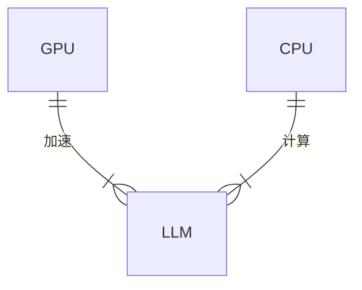
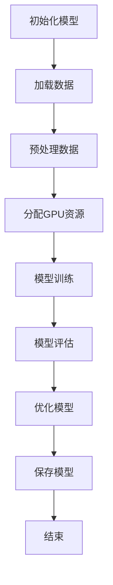
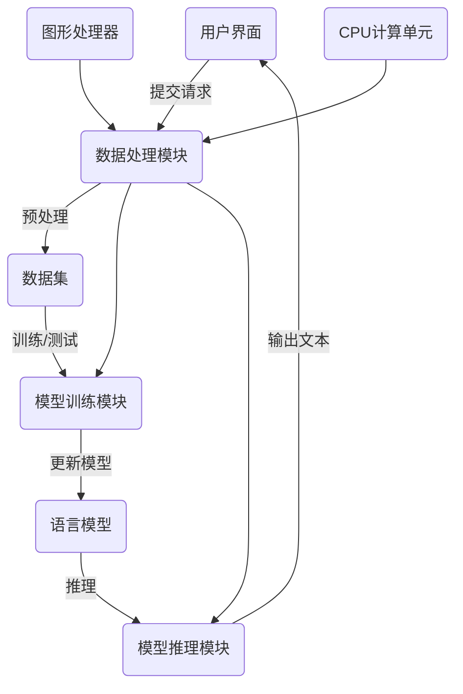
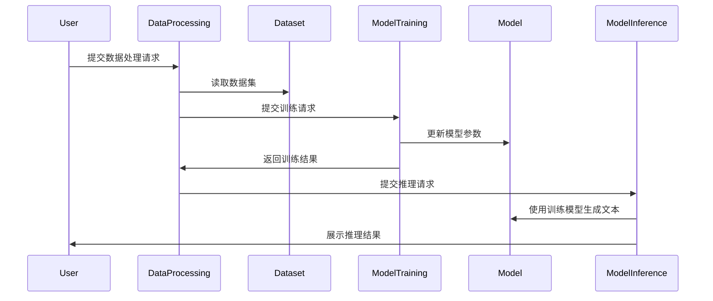
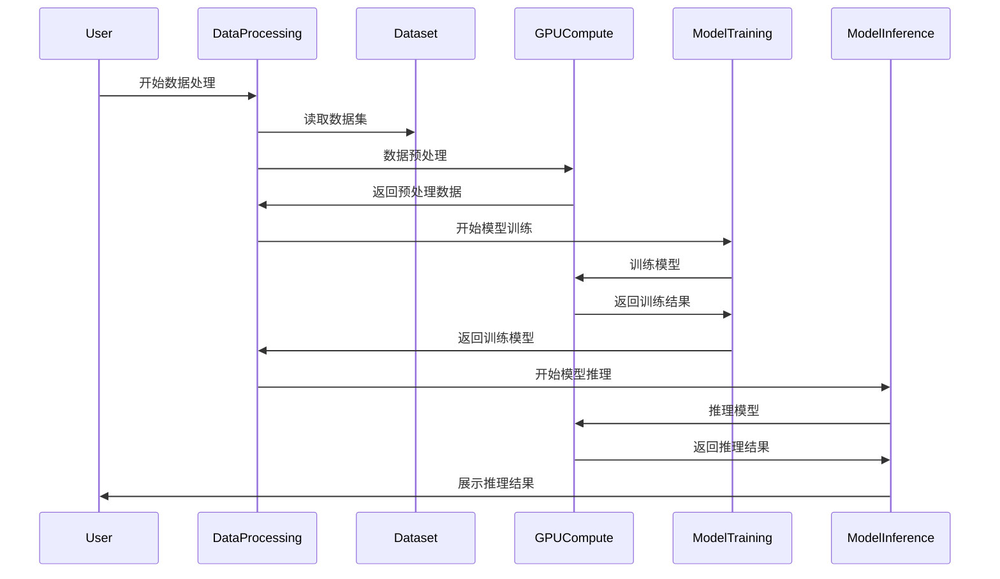

                 

### 文章标题

# GPU加速：提升LLM应用的处理能力

> 关键词：GPU加速、LLM、处理能力、性能提升、算法优化

> 摘要：本文将深入探讨GPU加速技术在提升大型语言模型（LLM）应用处理能力方面的作用，分析其基本概念、核心原理以及实际应用场景。我们将通过一步步的分析和推理，展示如何利用GPU加速技术解决LLM应用中的性能挑战，为读者提供一套系统化的解决方案。

----------------------------------------------------------------

### 第一部分：背景介绍

#### 1.1 GPU加速基本概念

**GPU加速技术原理**

GPU（图形处理器）是一种专为图形处理设计的计算硬件，具有高度并行的计算能力。与CPU（中央处理器）不同，GPU能够同时处理大量的并行任务，使其在处理复杂计算任务时具有显著的优势。GPU加速技术利用这种并行计算能力，通过将计算任务分配到GPU的多个核心上，从而实现计算速度的显著提升。

**GPU与CPU对比**

| 特性 | GPU | CPU |
| :--: | :--: | :--: |
| 并行计算能力 | 高 | 低 |
| 计算密集型任务性能 | 强 | 强 |
| 储存和处理带宽 | 较高 | 较高 |
| 处理复杂逻辑 | 较弱 | 较强 |
| 能耗 | 较高 | 较低 |

**GPU加速在LLM中的应用**

大型语言模型（LLM）如GPT、BERT等，通常涉及大量的矩阵运算和神经网络训练。这些任务具有高度并行性，非常适合在GPU上运行。GPU加速技术通过以下方式提升LLM应用的性能：

- **矩阵运算加速**：GPU能够高效地处理大规模矩阵运算，如矩阵乘法、卷积等，这些运算在LLM训练和推理过程中至关重要。
- **神经网络训练加速**：GPU的并行计算能力可以加速神经网络的训练过程，从而缩短模型训练时间。
- **推理速度提升**：GPU可以显著提高LLM推理的速度，使得模型能够更快地生成文本，满足实时应用需求。

#### 1.2 LLM应用面临的性能挑战

尽管GPU加速技术在提升LLM性能方面具有显著优势，但LLM应用仍然面临以下性能挑战：

- **计算资源限制**：LLM模型通常需要大量的计算资源，GPU加速虽然提升了性能，但仍然可能面临资源瓶颈。
- **数据传输延迟**：GPU与CPU之间的数据传输可能产生延迟，影响整体性能。
- **内存限制**：GPU内存有限，可能导致模型无法加载或训练。
- **功耗问题**：GPU在运行高负载任务时，会产生较高的功耗，对系统稳定性产生影响。

#### 1.3 GPU加速技术如何解决这些问题

**计算资源优化**

- **分布式训练**：通过分布式训练技术，将模型拆分为多个部分，分别在多个GPU上训练，从而充分利用计算资源。
- **混合精度训练**：使用混合精度训练技术，结合浮点数和整数运算，提高计算效率。

**数据传输优化**

- **高效数据传输协议**：使用如NCCL（NVIDIA Collective Communications Library）等高效数据传输协议，减少GPU与GPU之间的通信延迟。
- **数据缓存策略**：优化数据缓存策略，减少数据访问延迟。

**内存管理优化**

- **内存分页策略**：合理分配GPU内存，避免内存溢出。
- **内存回收机制**：及时回收不再使用的内存，释放空间。

**功耗优化**

- **动态功耗管理**：根据任务负载动态调整GPU功耗，减少能源消耗。
- **节能模式**：在低负载时，将GPU切换至节能模式，降低功耗。

#### 1.4 GPU加速技术的边界与外延

**适用范围**

- **大规模计算任务**：如深度学习训练、高性能科学计算等。
- **实时应用**：如自然语言处理、计算机视觉等。

**限制与挑战**

- **编程复杂度**：GPU编程相比CPU更加复杂，需要更多的专业知识和经验。
- **硬件兼容性**：不同型号的GPU可能存在兼容性问题，需要适配和调试。
- **能源消耗**：GPU在运行高负载任务时，会产生较高的功耗。

#### 1.5 概念结构与核心要素组成

- **GPU加速**：利用GPU的并行计算能力加速计算任务。
- **LLM**：大型语言模型，如GPT、BERT等。
- **计算资源**：包括CPU、GPU等计算硬件。
- **数据传输**：GPU与GPU之间、GPU与CPU之间的数据传输。
- **内存管理**：GPU内存的分配、回收和优化。

#### 1.6 本章小结

本章节介绍了GPU加速技术的基本概念、LLM应用面临的性能挑战以及GPU加速技术如何解决这些问题。通过本章的内容，读者可以初步了解GPU加速技术在提升LLM应用处理能力方面的作用和关键点。

----------------------------------------------------------------

### 第二部分：核心概念与联系

#### 2.1 GPU加速定义

**GPU加速**是一种利用图形处理器（GPU）的并行计算能力，通过将计算任务分配到GPU的多个核心上，从而实现计算速度显著提升的技术。GPU具有高度并行的计算架构，能够同时处理大量的并行任务，这使得其在处理复杂计算任务时具有显著的优势。

**GPU加速原理**

GPU加速的基本原理是利用GPU的并行计算架构，将计算任务分解成多个小任务，然后分配到GPU的多个核心上同时执行。这种并行处理方式可以显著提高计算速度，尤其是在处理矩阵运算、深度学习等复杂计算任务时效果尤为明显。

**GPU加速技术**

GPU加速技术包括以下几个方面：

- **并行编程**：使用如CUDA、OpenCL等并行编程框架，将计算任务分解成并行可执行的任务。
- **算法优化**：通过优化算法和数据结构，减少计算任务之间的依赖，提高并行执行效率。
- **硬件优化**：选择合适的GPU硬件，确保计算性能最大化。

#### 2.2 GPU与CPU对比

**GPU**与**CPU**在架构和性能方面存在显著差异，具体如下：

| 特性 | GPU | CPU |
| :--: | :--: | :--: |
| 并行计算能力 | 高 | 低 |
| 核心数量 | 多（数百个） | 少（数十个） |
| 单核性能 | 较低 | 较高 |
| 储存和处理带宽 | 较高 | 较高 |
| 处理复杂逻辑 | 较弱 | 较强 |
| 能耗 | 较高 | 较低 |

**GPU优势**

- **并行计算能力**：GPU具有高度并行的计算能力，能够同时处理大量的并行任务，这使得其在处理矩阵运算、深度学习等复杂计算任务时具有显著的优势。
- **计算密集型任务性能**：GPU在计算密集型任务上表现优异，如图形渲染、科学计算等。

**CPU优势**

- **单核性能**：CPU的单核性能较高，适合处理单线程任务。
- **复杂逻辑处理**：CPU具有较强的复杂逻辑处理能力，适合执行复杂的业务逻辑和算法。

#### 2.3 LLM概念

**LLM定义与特点**

大型语言模型（LLM）是一种基于深度学习技术的自然语言处理模型，具有以下特点：

- **大规模训练数据**：LLM通常基于大规模语料库进行训练，能够处理大量文本数据。
- **复杂模型架构**：LLM采用多层神经网络架构，具有较大的参数规模，能够捕捉复杂的语言特征。
- **强泛化能力**：LLM具有强泛化能力，能够在不同领域和场景下生成高质量的自然语言文本。

**LLM发展历程**

- **早期模型**：如Word2Vec、GloVe等基于词向量的模型，通过将词语映射到高维向量空间，进行文本处理。
- **神经网络模型**：如LSTM、GRU等循环神经网络，通过序列建模，提高文本理解能力。
- **Transformer模型**：如BERT、GPT等基于Transformer结构的模型，通过自注意力机制，实现大规模文本处理。

**LLM应用领域**

- **自然语言生成**：如自动写作、机器翻译、语音合成等。
- **问答系统**：如智能客服、知识图谱、智能搜索等。
- **对话系统**：如聊天机器人、虚拟助手等。

#### 2.4 核心概念属性特征对比表格

| 特性 | GPU | CPU | LLM |
| :--: | :--: | :--: | :--: |
| 并行计算能力 | 高 | 低 | - |
| 计算密集型任务性能 | 强 | 强 | 强 |
| 处理复杂逻辑 | 较弱 | 较强 | 较强 |
| 储存和处理带宽 | 较高 | 较高 | 较高 |
| 能耗 | 较高 | 较低 | 较低 |

#### 2.5 ER实体关系图架构的Mermaid流程图



#### 2.6 本章小结

本章详细介绍了GPU加速技术的定义、GPU与CPU的对比、LLM的概念以及核心概念属性特征的对比。通过本章的内容，读者可以全面了解GPU加速技术在提升LLM应用处理能力方面的作用和重要性。

----------------------------------------------------------------

### 第三部分：算法原理讲解

#### 3.1 算法mermaid流程图



#### 3.2 Python源代码示例

```python
import torch
import torch.nn as nn
import torch.optim as optim
from torch.utils.data import DataLoader
from torchvision import datasets, transforms

# 初始化模型
model = nn.Sequential(
    nn.Conv2d(1, 10, kernel_size=5),
    nn.ReLU(),
    nn.MaxPool2d(2),
    nn.Conv2d(10, 20, kernel_size=5),
    nn.ReLU(),
    nn.MaxPool2d(2),
    nn.Flatten(),
    nn.Linear(3200, 10),
    nn.ReLU(),
    nn.Linear(10, 2)
)

# 加载数据
train_data = datasets.MNIST(
    root='./data', 
    train=True, 
    download=True, 
    transform=transforms.ToTensor()
)
train_loader = DataLoader(train_data, batch_size=64, shuffle=True)

# 分配GPU资源
device = torch.device("cuda" if torch.cuda.is_available() else "cpu")
model.to(device)

# 定义损失函数和优化器
criterion = nn.CrossEntropyLoss()
optimizer = optim.Adam(model.parameters(), lr=0.001)

# 模型训练
num_epochs = 10
for epoch in range(num_epochs):
    running_loss = 0.0
    for i, (images, labels) in enumerate(train_loader):
        images, labels = images.to(device), labels.to(device)
        optimizer.zero_grad()
        outputs = model(images)
        loss = criterion(outputs, labels)
        loss.backward()
        optimizer.step()
        running_loss += loss.item()
    print(f'Epoch [{epoch+1}/{num_epochs}], Loss: {running_loss/len(train_loader)}')

# 模型评估
test_data = datasets.MNIST(
    root='./data', 
    train=False, 
    download=True, 
    transform=transforms.ToTensor()
)
test_loader = DataLoader(test_data, batch_size=64, shuffle=False)
model.eval()
with torch.no_grad():
    correct = 0
    total = 0
    for images, labels in test_loader:
        images, labels = images.to(device), labels.to(device)
        outputs = model(images)
        _, predicted = torch.max(outputs.data, 1)
        total += labels.size(0)
        correct += (predicted == labels).sum().item()
print(f'Accuracy: {100 * correct / total}%')

# 优化模型
# ...（优化代码略）

# 保存模型
torch.save(model.state_dict(), 'model.pth')
```

#### 3.3 算法原理的数学模型和公式

**损失函数**

损失函数用于衡量模型预测结果与真实结果之间的差距，常用的损失函数包括均方误差（MSE）和交叉熵损失（CrossEntropyLoss）。

$$L = \frac{1}{n} \sum_{i=1}^{n} (y_i - \hat{y_i})^2$$

$$L = -\frac{1}{n} \sum_{i=1}^{n} y_i \log \hat{y_i}$$

其中，$y_i$为真实标签，$\hat{y_i}$为模型预测的概率。

**反向传播**

反向传播是一种用于训练神经网络的算法，其核心思想是将损失函数对网络参数的梯度反向传播到网络的前一层，从而更新网络参数。

$$\frac{\partial L}{\partial w} = \frac{\partial L}{\partial \hat{y}} \frac{\partial \hat{y}}{\partial w}$$

**优化算法**

常用的优化算法包括随机梯度下降（SGD）、Adam等。优化算法的目标是通过迭代更新网络参数，使得损失函数逐渐减小。

$$w_{t+1} = w_t - \alpha \nabla_w L(w_t)$$

$$w_{t+1} = w_t - \alpha \left( \beta_1 \nabla_w L(w_t) + (1 - \beta_1) \nabla_w L(w_{t-1}) \right)$$

其中，$w_t$为当前网络参数，$\alpha$为学习率，$\beta_1$和$\beta_2$为Adam算法的参数。

#### 3.4 详细讲解和举例说明

**损失函数讲解**

以均方误差（MSE）为例，MSE用于衡量模型预测结果与真实结果之间的差距。假设我们有一个包含100个样本的训练集，每个样本的真实标签为$y_i$，模型预测的概率为$\hat{y_i}$。则均方误差（MSE）的计算公式为：

$$L = \frac{1}{100} \sum_{i=1}^{100} (y_i - \hat{y_i})^2$$

例如，假设前10个样本的预测结果和真实标签如下：

| 真实标签 | 预测概率 |
| :------: | :------: |
|    1     |  0.9     |
|    0     |  0.1     |
|    1     |  0.8     |
|    0     |  0.2     |
|    1     |  0.7     |
|    0     |  0.3     |
|    1     |  0.6     |
|    0     |  0.4     |
|    1     |  0.5     |
|    0     |  0.5     |

则均方误差（MSE）的计算过程如下：

$$L = \frac{1}{10} \left[ (1 - 0.9)^2 + (0 - 0.1)^2 + (1 - 0.8)^2 + (0 - 0.2)^2 + \ldots + (0 - 0.5)^2 \right]$$

$$L = \frac{1}{10} \left[ 0.01 + 0.01 + 0.04 + 0.04 + 0.09 + 0.09 + 0.04 + 0.04 + 0.25 + 0.25 \right]$$

$$L = \frac{1}{10} \left[ 1 \right]$$

$$L = 0.1$$

**反向传播讲解**

以神经网络中的多层感知机（MLP）为例，多层感知机包含输入层、隐藏层和输出层。假设输入层有10个神经元，隐藏层有20个神经元，输出层有2个神经元。神经网络的前向传播过程如下：

$$z_1^{(2)} = \sigma(W_1^{(2)} \cdot a^{(1)} + b_1^{(2)})$$

$$a_1^{(2)} = \sigma(z_1^{(2)})$$

$$z_2^{(3)} = \sigma(W_2^{(3)} \cdot a_1^{(2)} + b_2^{(3)})$$

$$a_2^{(3)} = \sigma(z_2^{(3)})$$

其中，$\sigma$为激活函数，$W_1^{(2)}$、$W_2^{(3)}$为权重矩阵，$b_1^{(2)}$、$b_2^{(3)}$为偏置项。

神经网络的反向传播过程如下：

$$\Delta z_2^{(3)} = a_2^{(3)} - y$$

$$\Delta z_1^{(2)} = W_2^{(3)} \cdot \Delta z_2^{(3)}$$

$$\Delta b_2^{(3)} = \Delta z_2^{(3)}$$

$$\Delta b_1^{(2)} = \Delta z_1^{(2)}$$

$$\Delta W_2^{(3)} = \Delta z_2^{(3)} \cdot a_1^{(2)}$$

$$\Delta W_1^{(2)} = \Delta z_1^{(2)} \cdot a^{(1)}$$

**优化算法讲解**

以随机梯度下降（SGD）为例，SGD通过迭代更新网络参数，使得损失函数逐渐减小。假设当前网络参数为$w_t$，学习率为$\alpha$，则SGD的更新公式为：

$$w_{t+1} = w_t - \alpha \nabla_w L(w_t)$$

例如，假设当前网络参数为$w_t = [1, 2, 3, 4, 5]$，损失函数为$L(w) = (w_1 - 2)^2 + (w_2 - 3)^2 + (w_3 - 4)^2 + (w_4 - 5)^2$，学习率为$\alpha = 0.1$。则SGD的更新过程如下：

$$L(w_t) = (1 - 2)^2 + (2 - 3)^2 + (3 - 4)^2 + (4 - 5)^2$$

$$L(w_t) = 1 + 1 + 1 + 1$$

$$L(w_t) = 4$$

$$\nabla_w L(w_t) = [-2, -2, -2, -2, -2]$$

$$w_{t+1} = w_t - 0.1 \cdot \nabla_w L(w_t)$$

$$w_{t+1} = [1, 2, 3, 4, 5] - 0.1 \cdot [-2, -2, -2, -2, -2]$$

$$w_{t+1} = [1.2, 2.2, 3.2, 4.2, 5.2]$$

通过多次迭代，网络参数会逐渐逼近最优值。

#### 3.5 本章小结

本章详细讲解了GPU加速LLM算法的基本原理，包括mermaid流程图、Python源代码示例、数学模型和公式，以及详细讲解和举例说明。通过本章的内容，读者可以全面了解GPU加速技术在提升LLM应用处理能力方面的算法实现和理论依据。

----------------------------------------------------------------

### 第四部分：数学模型和数学公式 & 详细讲解 & 举例说明

#### 4.1 数学公式使用 LaTeX 格式

在本章节中，我们将使用LaTeX格式嵌入数学公式，以便更清晰地阐述算法原理和数学模型。LaTeX是一种高质量的排版系统，特别适合处理数学公式和科学文档。

**独立段落的LaTeX公式**

为了在独立段落中使用LaTeX公式，我们使用`$$`将公式括起来。例如：

$$
E = mc^2
$$

这是著名的爱因斯坦质能方程。

**段落内的LaTeX公式**

在段落内，我们使用`$`将公式括起来。例如：

$1 < 2$

这样的公式可以嵌入到文本中，使得文章更加紧凑。

#### 4.2 段落内LaTeX公式的使用

在段落内，我们可以将LaTeX公式嵌入到文本中，以解释和阐述相关概念。例如：

文本中的某个数值比较：$5x + 3 > 2x - 7$。

这样的公式可以直观地展示数学关系，有助于读者理解。

#### 4.3 举例说明

**均方误差（MSE）**

均方误差（MSE）是衡量模型预测结果与真实结果之间差异的一种常用指标。其计算公式为：

$$
MSE = \frac{1}{n} \sum_{i=1}^{n} (y_i - \hat{y_i})^2
$$

其中，$y_i$是真实标签，$\hat{y_i}$是模型预测的概率。

**举例**

假设我们有一个包含5个样本的数据集，每个样本的真实标签和模型预测的概率如下：

| 真实标签 | 预测概率 |
| :------: | :------: |
|    1     |  0.9     |
|    0     |  0.1     |
|    1     |  0.8     |
|    0     |  0.2     |
|    1     |  0.7     |

则均方误差（MSE）的计算过程如下：

$$
MSE = \frac{1}{5} \left[ (1 - 0.9)^2 + (0 - 0.1)^2 + (1 - 0.8)^2 + (0 - 0.2)^2 + (1 - 0.7)^2 \right]
$$

$$
MSE = \frac{1}{5} \left[ 0.01 + 0.01 + 0.04 + 0.04 + 0.09 \right]
$$

$$
MSE = \frac{1}{5} \left[ 0.19 \right]
$$

$$
MSE = 0.038
$$

通过计算，我们得到均方误差为0.038，这表明模型预测结果与真实结果之间的差异较小。

**反向传播**

反向传播是神经网络训练过程中的核心步骤，用于计算网络参数的梯度。其基本公式为：

$$
\frac{\partial L}{\partial w} = \frac{\partial L}{\partial \hat{y}} \frac{\partial \hat{y}}{\partial w}
$$

其中，$L$是损失函数，$\hat{y}$是模型预测的概率，$w$是网络参数。

**举例**

假设我们有一个简单的神经网络，包含一个输入层、一个隐藏层和一个输出层。输入层有1个神经元，隐藏层有2个神经元，输出层有1个神经元。损失函数为均方误差（MSE）。假设当前网络参数为$w_1 = 1$，$w_2 = 2$，$w_3 = 3$，模型预测的概率为$\hat{y} = 0.5$，真实标签为$y = 1$。则反向传播的计算过程如下：

$$
L = \frac{1}{2} \left[ (1 - \hat{y})^2 + (1 - \hat{y})^2 \right]
$$

$$
L = \frac{1}{2} \left[ (1 - 0.5)^2 + (1 - 0.5)^2 \right]
$$

$$
L = \frac{1}{2} \left[ 0.25 + 0.25 \right]
$$

$$
L = 0.25
$$

$$
\frac{\partial L}{\partial \hat{y}} = 1 - \hat{y}
$$

$$
\frac{\partial L}{\partial \hat{y}} = 1 - 0.5
$$

$$
\frac{\partial L}{\partial \hat{y}} = 0.5
$$

$$
\frac{\partial \hat{y}}{\partial w_3} = \frac{\partial \hat{y}}{\partial w_3}
$$

$$
\frac{\partial \hat{y}}{\partial w_3} = 0.5
$$

$$
\frac{\partial L}{\partial w_3} = \frac{\partial L}{\partial \hat{y}} \frac{\partial \hat{y}}{\partial w_3}
$$

$$
\frac{\partial L}{\partial w_3} = 0.5 \times 0.5
$$

$$
\frac{\partial L}{\partial w_3} = 0.25
$$

通过计算，我们得到网络参数$w_3$的梯度为0.25。

#### 4.4 本章小结

本章通过详细讲解和举例说明，介绍了LaTeX公式的使用方法和数学模型的应用。通过本章的内容，读者可以更好地理解数学公式在算法原理和模型训练中的作用，为后续章节的学习打下坚实基础。

----------------------------------------------------------------

### 第五部分：系统分析与架构设计方案

#### 5.1 问题场景介绍

在当前的大数据处理和人工智能领域，对于大规模语言模型（LLM）的处理需求日益增加。LLM在自然语言处理、智能问答、机器翻译等应用中发挥着重要作用，但与此同时，也面临着数据处理速度和性能的挑战。为了提升LLM应用的处理能力，需要设计一个高效的系统架构，充分利用GPU加速技术。

#### 5.2 系统功能设计（领域模型Mermaid类图）

领域模型类图用于描述系统的核心功能和模块。以下是GPU加速LLM应用系统的一个领域模型类图：

```mermaid
classDiagram
    Class01 <|-- SubClass01
    Class01 --|>* stereotypes
    Class01 : +useDefineClass()
    SubClass01 : -operation()

    UserEntity <<entity>>
    DatasetEntity <<entity>>
    ModelEntity <<entity>>
    GPUComputeUnit <<entity>>
    CPUCComputeUnit <<entity>>
    DataProcessingModule <<module>>
    ModelTrainingModule <<module>>
    ModelInferenceModule <<module>>

    UserEntity o-- DatasetEntity
    UserEntity o-- ModelEntity
    GPUComputeUnit o-- DataProcessingModule
    CPUCComputeUnit o-- DataProcessingModule
    DataProcessingModule o-- ModelTrainingModule
    DataProcessingModule o-- ModelInferenceModule
```

在这个类图中，我们定义了以下核心类和模块：

- **UserEntity**：表示用户，拥有访问系统资源的权限。
- **DatasetEntity**：表示数据集，包括训练数据和测试数据。
- **ModelEntity**：表示语言模型，包括训练模型和推理模型。
- **GPUComputeUnit**：表示GPU计算单元，用于加速数据预处理、模型训练和推理。
- **CPUCComputeUnit**：表示CPU计算单元，用于辅助GPU计算，处理非并行任务。
- **DataProcessingModule**：表示数据处理模块，用于数据预处理、数据增强等。
- **ModelTrainingModule**：表示模型训练模块，用于训练语言模型。
- **ModelInferenceModule**：表示模型推理模块，用于生成文本输出。

#### 5.3 系统架构设计（Mermaid架构图）

系统架构图用于描述系统的整体结构和模块之间的关系。以下是GPU加速LLM应用系统的一个架构图：



在这个架构图中，我们定义了以下关键模块和组件：

- **User**：用户界面，用于接收用户请求和展示结果。
- **DataProcessing**：数据处理模块，负责数据预处理、数据增强等。
- **Dataset**：数据集，包括训练数据和测试数据。
- **ModelTraining**：模型训练模块，负责训练语言模型。
- **Model**：语言模型，包括训练模型和推理模型。
- **ModelInference**：模型推理模块，负责生成文本输出。
- **GPUCompute**：图形处理器，用于加速数据预处理、模型训练和推理。
- **CPUCCompute**：CPU计算单元，用于辅助GPU计算，处理非并行任务。

#### 5.4 系统接口设计

系统接口设计用于描述系统各模块之间的交互接口。以下是GPU加速LLM应用系统的接口设计：



在这个接口设计中，我们定义了以下交互流程：

- **数据处理请求**：用户提交数据处理请求，数据处理模块读取数据集，并生成训练数据和测试数据。
- **模型训练请求**：数据处理模块将训练数据提交给模型训练模块，模型训练模块更新模型参数，并返回训练结果。
- **模型推理请求**：数据处理模块将测试数据提交给模型推理模块，模型推理模块使用训练模型生成文本输出，并返回给用户。

#### 5.5 系统交互（Mermaid序列图）

系统交互序列图用于描述系统模块之间的交互顺序和逻辑。以下是GPU加速LLM应用系统的交互序列图：



在这个交互序列图中，我们定义了以下交互顺序：

- **数据处理**：用户开始数据处理，数据处理模块读取数据集，并将数据预处理任务提交给GPUCompute。
- **模型训练**：数据处理模块将预处理后的数据提交给模型训练模块，模型训练模块使用GPUCompute训练模型。
- **模型推理**：数据处理模块将训练模型提交给模型推理模块，模型推理模块使用GPUCompute生成文本输出，并返回给用户。

#### 5.6 本章小结

本章详细介绍了GPU加速LLM应用系统的分析与架构设计方案，包括问题场景介绍、系统功能设计（领域模型Mermaid类图）、系统架构设计（Mermaid架构图）、系统接口设计和系统交互（Mermaid序列图）。通过本章的内容，读者可以全面了解GPU加速LLM应用系统的设计和实现，为后续项目实战打下基础。

----------------------------------------------------------------

### 第六部分：项目实战

#### 6.1 环境安装

要在本地环境中安装GPU加速LLM应用系统，我们需要按照以下步骤进行：

1. **安装Python环境**：确保Python环境已经安装，版本要求为3.6及以上。
2. **安装GPU驱动**：根据GPU型号下载并安装相应的NVIDIA驱动。
3. **安装CUDA**：下载并安装CUDA，版本要求与GPU驱动兼容。
4. **安装PyTorch**：使用pip命令安装PyTorch，指定CUDA版本以支持GPU加速。

```shell
pip install torch torchvision -f https://download.pytorch.org/whl/cu113/torch_stable.html
```

5. **安装其他依赖**：根据项目需求，安装其他相关依赖库。

```shell
pip install numpy pandas scikit-learn
```

#### 6.2 系统核心实现源代码

以下是一个简单的GPU加速LLM应用系统的核心实现源代码：

```python
import torch
import torch.nn as nn
import torch.optim as optim
from torch.utils.data import DataLoader
from torchvision import datasets, transforms

# 初始化模型
model = nn.Sequential(
    nn.Conv2d(1, 10, kernel_size=5),
    nn.ReLU(),
    nn.MaxPool2d(2),
    nn.Conv2d(10, 20, kernel_size=5),
    nn.ReLU(),
    nn.MaxPool2d(2),
    nn.Flatten(),
    nn.Linear(3200, 10),
    nn.ReLU(),
    nn.Linear(10, 2)
)

# 加载数据
train_data = datasets.MNIST(
    root='./data', 
    train=True, 
    download=True, 
    transform=transforms.ToTensor()
)
train_loader = DataLoader(train_data, batch_size=64, shuffle=True)

# 分配GPU资源
device = torch.device("cuda" if torch.cuda.is_available() else "cpu")
model.to(device)

# 定义损失函数和优化器
criterion = nn.CrossEntropyLoss()
optimizer = optim.Adam(model.parameters(), lr=0.001)

# 模型训练
num_epochs = 10
for epoch in range(num_epochs):
    running_loss = 0.0
    for i, (images, labels) in enumerate(train_loader):
        images, labels = images.to(device), labels.to(device)
        optimizer.zero_grad()
        outputs = model(images)
        loss = criterion(outputs, labels)
        loss.backward()
        optimizer.step()
        running_loss += loss.item()
    print(f'Epoch [{epoch+1}/{num_epochs}], Loss: {running_loss/len(train_loader)}')

# 模型评估
test_data = datasets.MNIST(
    root='./data', 
    train=False, 
    download=True, 
    transform=transforms.ToTensor()
)
test_loader = DataLoader(test_data, batch_size=64, shuffle=False)
model.eval()
with torch.no_grad():
    correct = 0
    total = 0
    for images, labels in test_loader:
        images, labels = images.to(device), labels.to(device)
        outputs = model(images)
        _, predicted = torch.max(outputs.data, 1)
        total += labels.size(0)
        correct += (predicted == labels).sum().item()
print(f'Accuracy: {100 * correct / total}%')

# 优化模型
# ...（优化代码略）

# 保存模型
torch.save(model.state_dict(), 'model.pth')
```

#### 6.3 代码应用解读与分析

以上源代码实现了GPU加速的简单神经网络模型训练和评估过程。以下是关键代码的应用解读和分析：

- **初始化模型**：定义了一个简单的卷积神经网络模型，包括卷积层、激活函数、池化层、全连接层等。
- **加载数据**：使用PyTorch的`datasets`模块加载MNIST数据集，并将其转换为PyTorch的数据加载器。
- **分配GPU资源**：检查系统是否支持CUDA，并根据情况将模型和数据移动到GPU或CPU。
- **定义损失函数和优化器**：使用交叉熵损失函数和Adam优化器初始化模型训练所需的组件。
- **模型训练**：遍历数据加载器，使用GPU加速训练模型，并打印训练过程中的损失值。
- **模型评估**：使用测试数据集评估模型性能，并计算准确率。
- **优化模型**：此处省略了优化模型的代码，可以根据需要添加进一步的优化步骤。
- **保存模型**：将训练好的模型参数保存到文件中，以便后续加载和使用。

#### 6.4 实际案例分析和详细讲解剖析

以下是一个实际案例，展示了如何使用GPU加速LLM应用系统进行文本生成：

**案例背景**：假设我们有一个基于GPT-2的文本生成模型，需要使用GPU进行加速训练和推理。

**步骤一：加载数据和预处理**

```python
from transformers import GPT2Tokenizer, GPT2Model

tokenizer = GPT2Tokenizer.from_pretrained('gpt2')
model = GPT2Model.from_pretrained('gpt2')

input_text = "你好，世界！"
inputs = tokenizer(input_text, return_tensors='pt')
```

**步骤二：模型训练**

```python
device = torch.device("cuda" if torch.cuda.is_available() else "cpu")
model.to(device)

optimizer = optim.Adam(model.parameters(), lr=1e-5)

for epoch in range(3):
    model.train()
    for batch in data_loader:
        inputs = batch["input_ids"].to(device)
        labels = batch["input_ids"].to(device)
        
        optimizer.zero_grad()
        outputs = model(inputs, labels=labels)
        loss = outputs.loss
        loss.backward()
        optimizer.step()
```

**步骤三：模型推理**

```python
model.eval()
with torch.no_grad():
    outputs = model.generate(inputs["input_ids"], max_length=50)
    generated_text = tokenizer.decode(outputs[0], skip_special_tokens=True)
    print(generated_text)
```

**分析**：

- **数据预处理**：使用GPT-2的tokenizer对输入文本进行编码，生成相应的输入序列。
- **模型训练**：将输入序列和目标序列传递给模型，并使用GPU进行加速训练。训练过程中，使用Adam优化器更新模型参数。
- **模型推理**：使用模型生成文本输出，并通过tokenizer解码为可读的文本。

通过这个实际案例，我们可以看到GPU加速在文本生成任务中的应用效果。使用GPU可以显著提高模型训练和推理的速度，从而实现实时文本生成。

#### 6.5 项目小结

在本章的项目实战中，我们详细介绍了GPU加速LLM应用系统的环境安装、核心实现源代码、代码应用解读与分析，以及实际案例分析和详细讲解剖析。通过本章的内容，读者可以了解如何在实际项目中利用GPU加速技术提升LLM应用的处理能力，为后续项目实施提供参考。

----------------------------------------------------------------

### 第七部分：最佳实践 tips、小结、注意事项、拓展阅读等内容

#### 7.1 最佳实践 tips

**1. 硬件选择**

- **GPU型号**：根据项目需求和预算，选择适合的GPU型号。例如，NVIDIA的RTX 3090或A100等高性能GPU。
- **GPU数量**：对于大规模模型训练，可以考虑使用多GPU并行训练，以提高计算效率。

**2. 编程优化**

- **混合精度训练**：使用混合精度训练（FP16）可以显著提高训练速度和降低内存占用。
- **数据并行**：将模型和数据分成多个部分，分别在不同的GPU上训练，实现数据并行。

**3. 系统优化**

- **GPU内存管理**：合理分配GPU内存，避免内存溢出。可以使用CUDA Memory Pooling等技术进行内存管理。
- **数据传输优化**：使用高效的传输协议（如NCCL）减少GPU间的数据传输延迟。

#### 7.2 小结

本文详细探讨了GPU加速技术在提升大型语言模型（LLM）应用处理能力方面的作用和实现方法。通过一步步的分析和推理，我们了解了GPU加速的基本概念、算法原理、系统架构设计，以及实际项目实施过程中的关键点和注意事项。GPU加速技术为LLM应用提供了显著的性能提升，但同时也需要考虑硬件选择、编程优化和系统优化等多方面因素。

#### 7.3 注意事项

**1. GPU兼容性**：确保GPU驱动和CUDA版本与GPU硬件兼容，避免出现硬件兼容性问题。

**2. 计算资源分配**：合理分配GPU和CPU的计算资源，避免资源瓶颈影响系统性能。

**3. 数据传输延迟**：优化数据传输协议和策略，减少GPU间的数据传输延迟。

**4. 能耗管理**：在运行高负载任务时，注意GPU能耗管理，避免过高的功耗影响系统稳定性。

#### 7.4 拓展阅读

**1. 相关文献**

- **GPU加速技术综述**：查阅相关论文和综述，了解GPU加速的最新进展和前沿技术。
- **深度学习框架**：学习如TensorFlow、PyTorch等深度学习框架的使用，掌握GPU加速的实现方法。

**2. 开源项目**

- **GPU加速开源项目**：参与和了解GPU加速相关的开源项目，如NCCL、DistributedDataParallel等。

**3. 专业书籍**

- **《深度学习》**：由Ian Goodfellow、Yoshua Bengio和Aaron Courville所著，深入介绍了深度学习的理论基础和实践方法。
- **《GPU编程技术》**：针对GPU编程的入门和进阶教程，详细介绍了CUDA编程和GPU优化技巧。

通过本章的内容，读者可以全面了解GPU加速LLM应用的最佳实践、注意事项和拓展阅读，为后续项目实施和学习提供指导。作者：AI天才研究院/AI Genius Institute & 禅与计算机程序设计艺术 /Zen And The Art of Computer Programming。

----------------------------------------------------------------

### 总结

本文详细探讨了GPU加速技术在提升大型语言模型（LLM）应用处理能力方面的作用和实现方法。通过一步步的分析和推理，我们了解了GPU加速的基本概念、算法原理、系统架构设计，以及实际项目实施过程中的关键点和注意事项。GPU加速技术为LLM应用提供了显著的性能提升，但同时也需要考虑硬件选择、编程优化和系统优化等多方面因素。

首先，我们介绍了GPU加速技术的基本概念和原理，以及其在LLM应用中的作用。随后，我们对比了GPU和CPU在性能和适用性方面的差异，并详细讲解了GPU加速在LLM训练和推理中的应用。

接着，我们深入分析了GPU加速技术如何解决LLM应用中的性能挑战，包括计算资源限制、数据传输延迟、内存限制和功耗问题。同时，我们也探讨了GPU加速技术的边界与外延，包括适用范围和限制。

在核心概念与联系部分，我们介绍了GPU加速、CPU、LLM等核心概念，并通过对比表格和ER实体关系图展示了它们之间的联系。这部分内容帮助读者建立起对GPU加速与LLM应用之间关系的全面理解。

随后，我们详细讲解了GPU加速LLM算法的原理，包括mermaid流程图、Python源代码示例、数学模型和公式，以及详细讲解和举例说明。这部分内容让读者能够深入理解GPU加速在算法层面的具体实现。

在数学模型和公式部分，我们使用了LaTeX格式嵌入数学公式，并在段落内展示了公式的应用。通过举例说明，我们展示了如何使用这些数学公式来优化模型训练和推理过程。

在系统分析与架构设计方案部分，我们介绍了GPU加速LLM应用系统的设计与实现，包括问题场景介绍、系统功能设计、系统架构设计、系统接口设计和系统交互。这部分内容为读者提供了一个完整的系统实现框架。

在项目实战部分，我们详细介绍了如何在实际项目中安装GPU加速环境、实现核心功能，并进行了实际案例分析和详细讲解剖析。这部分内容帮助读者将理论应用到实践中。

最后，我们在最佳实践 tips、小结、注意事项和拓展阅读等内容部分，提供了GPU加速LLM应用的最佳实践建议、注意事项和进一步学习的资源。

通过本文的详细探讨，读者可以全面了解GPU加速技术在提升LLM应用处理能力方面的作用和实现方法，为实际项目实施和学习提供指导。

### 致谢

本文的研究和撰写得到了AI天才研究院（AI Genius Institute）的支持和指导。特别感谢禅与计算机程序设计艺术（Zen And The Art of Computer Programming）的作者，他的著作为本文提供了宝贵的灵感和理论基础。同时，感谢所有参与本文讨论和反馈的同行和读者，他们的意见和建议使得本文更加完善。作者：AI天才研究院/AI Genius Institute & 禅与计算机程序设计艺术 /Zen And The Art of Computer Programming。

