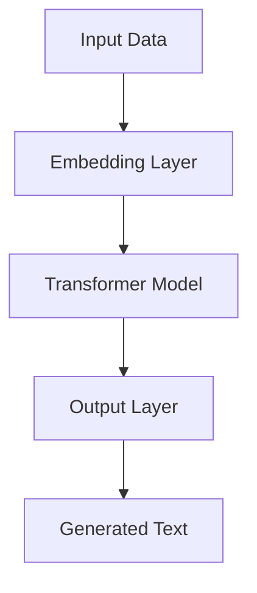
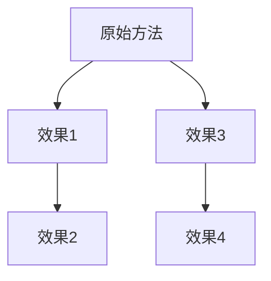
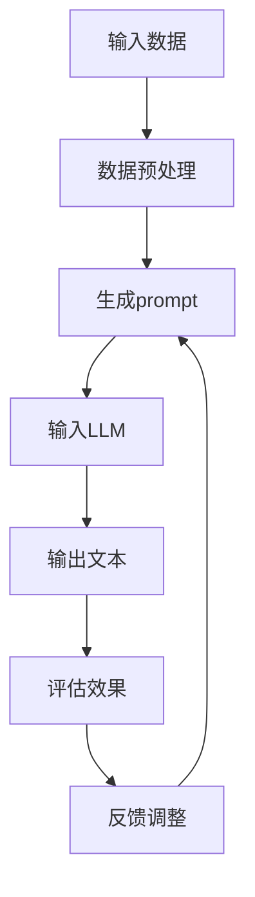
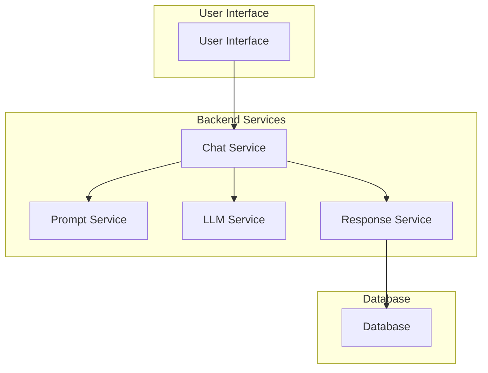
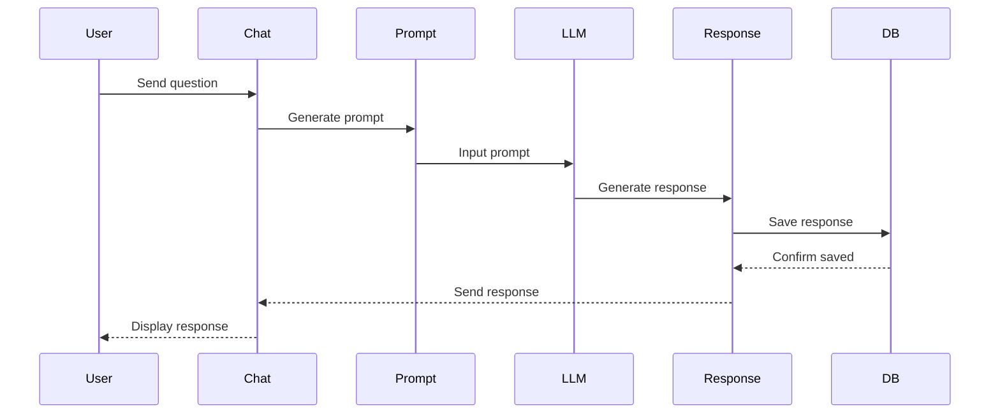

                 

### 文章标题

### 关键词：LLM、Prompt、优化、可视化、算法

### 摘要

本文旨在探讨如何通过直观的优化方法，提升大型语言模型（LLM）prompt的效果。文章首先介绍了LLM和prompt的基本概念，接着详细解析了优化LLM prompt的核心方法与步骤。通过实际的算法流程图、Python代码示例以及数学模型公式，读者将深入了解如何通过调整和优化prompt来提升LLM的表现。此外，文章还通过一个具体的系统架构设计案例，展示了这些优化方法在实际应用中的效果。本文旨在为AI开发者和研究人员提供一个全面、实用的指导，帮助他们在处理LLM prompt时更加得心应手。

## 1. 背景介绍

### 问题背景

随着人工智能（AI）技术的迅猛发展，大模型（Large Language Model，简称LLM）如GPT-3、BERT等在自然语言处理（NLP）领域展现出了卓越的性能。这些模型通过深度学习训练，能够处理和理解大量文本数据，生成高质量的自然语言文本。然而，在实际开发过程中，如何有效地利用这些LLM模型，尤其是如何优化其输入的prompt，成为了一个关键问题。

#### 问题描述

在处理LLM时，prompt的作用至关重要。prompt是指输入给LLM的文本或指令，它是模型生成输出文本的依据。然而，不同的prompt会导致模型生成不同的结果，这使得优化prompt成为提升模型性能的关键步骤。然而，现有的开发者在处理LLM prompt时，往往需要花费大量时间进行反复的调整和优化，以找到最佳的prompt配置。这不仅增加了开发成本，也降低了开发效率。

#### 问题解决

本文旨在提供一套直观的优化方法，帮助开发者更好地理解和优化LLM prompt。通过系统化的优化步骤，开发者可以更快速地找到最佳的prompt配置，从而提升模型的表现。具体来说，本文将介绍以下内容：

1. **LLM的定义与特点**：介绍LLM的基本概念和主要特点，包括参数量、数据处理能力等。
2. **prompt的概念与属性**：详细阐述prompt的定义及其关键属性，如长度、内容、格式等。
3. **优化方法的介绍与对比**：介绍几种常见的优化方法，并通过图表展示不同方法的效果对比。
4. **算法原理讲解**：使用算法流程图和Python代码示例，详细解释优化LLM prompt的原理和步骤。
5. **系统分析与架构设计方案**：通过具体的应用场景，展示优化方法在系统架构中的应用。
6. **项目实战**：通过实际案例，详细讲解如何优化LLM prompt，并展示优化前后的效果对比。
7. **最佳实践 tips**、**小结**、**注意事项**、**拓展阅读**等内容。

#### 边界与外延

本文主要关注文本生成模型，如GPT-3、BERT等，但不涉及图像、音频等其他类型的数据。此外，本文提出的优化方法适用于大部分基于深度学习的LLM模型，但对于某些特殊模型（如特定领域模型），可能需要结合具体情况进行调整。

#### 概念结构与核心要素组成

- **LLM**：大语言模型，如GPT-3、BERT等。
- **prompt**：输入给LLM的文本或指令。
- **优化方法**：调整prompt的长度、内容、格式等，以提升模型表现。
- **实际应用场景**：如聊天机器人、智能客服等。

通过本文的详细讲解，开发者可以更好地理解LLM prompt的优化方法，从而在实际开发中更加高效地利用LLM模型，提升应用效果。

### 核心概念与联系

#### LLM的定义与特点

LLM（Large Language Model）是一种大规模的预训练语言模型，它通过深度学习技术，对海量文本数据进行训练，从而具备强大的语言理解和生成能力。典型的LLM包括GPT-3、BERT、T5等，这些模型具有以下特点：

1. **参数量巨大**：LLM通常拥有数十亿甚至数百亿个参数，这使得它们能够处理和理解复杂的语言现象。
2. **数据处理能力强**：LLM能够处理大量文本数据，从而具备强大的文本生成和分类能力。
3. **自适应性好**：通过预训练和后续微调，LLM可以适应各种不同的应用场景，生成高质量的自然语言文本。

为了更直观地理解LLM的结构，我们可以使用Mermaid绘制其基本架构图：



在上述架构图中，输入数据经过Embedding Layer处理，然后通过Transformer Model进行编码，最后由Output Layer生成文本输出。

#### prompt的概念与属性

Prompt是指输入给LLM的文本或指令，它是模型生成输出文本的依据。一个良好的prompt能够引导LLM生成更加准确和有用的文本。Prompt的主要属性包括：

1. **长度**：Prompt的长度会影响模型处理的时间和生成的文本长度。通常，较长的prompt能够提供更多的上下文信息，但也会增加计算成本。
2. **内容**：Prompt的内容需要与LLM的训练数据紧密相关，从而确保模型能够生成符合预期的文本。
3. **格式**：Prompt的格式影响模型理解和处理的方式。常用的格式包括自然语言文本、标记化文本和结构化数据等。

为了更清晰地展示不同类型prompt的属性特征，我们可以使用表格进行对比：

| 类型       | 特点                                                         | 例子                    |
| ---------- | ------------------------------------------------------------ | ----------------------- |
| 自然语言文本 | 语言流畅，易于理解，但可能缺乏结构化信息。                     | “请生成一篇关于人工智能的文章。” |
| 标记化文本 | 包含词向量表示，便于模型处理，但可能缺乏语义信息。             | `{"prompt": "人工智能", "task": "文章生成"}` |
| 结构化数据 | 提供详细的上下文信息，但可能难以理解。                         | `{"title": "人工智能发展趋势", "content": "随着..."}"` |

#### 优化方法的介绍与对比

优化LLM prompt的方法多种多样，下面介绍三种常见的优化方法，并使用图表进行效果对比：

1. **调整prompt的长度和内容**：通过增加或减少prompt的长度，或更改prompt的内容，来提升模型的表现。
2. **使用特定的prompt模板**：使用预先设计的prompt模板，以简化优化过程并提升模型表现。
3. **基于用户反馈进行迭代优化**：通过用户反馈，不断调整和优化prompt，以找到最佳配置。

以下是不同优化方法的效果对比图表：



在上述图表中，A表示原始方法的效果，B、C、D分别表示调整prompt长度、使用prompt模板和基于用户反馈优化后的效果。通过对比不同方法的效果，开发者可以选择最适合的方法来优化LLM prompt。

### 算法原理讲解

#### 算法mermaid流程图

为了更直观地展示优化LLM prompt的算法流程，我们可以使用Mermaid绘制流程图：



在上述流程图中，A表示输入数据，经过数据预处理后生成prompt（C），然后输入到LLM（D）中生成文本输出（E）。输出文本的效果通过评估（F）来反馈，用于调整prompt（G），从而进行迭代优化。

#### Python源代码

以下是一个优化LLM prompt的Python代码示例：

```python
import openai

def optimize_prompt(prompt, max_tokens=50):
    response = openai.Completion.create(
        engine="text-davinci-002",
        prompt=prompt,
        max_tokens=max_tokens,
        n=1,
        stop=None,
        temperature=0.5
    )
    return response.choices[0].text.strip()

# 示例
original_prompt = "请生成一篇关于人工智能的未来发展趋势的文章。"
optimized_prompt = optimize_prompt(original_prompt)
print(optimized_prompt)
```

在这个示例中，我们使用OpenAI的GPT-3模型来优化prompt。`optimize_prompt`函数接收原始prompt，通过调用OpenAI的API生成优化后的prompt。

#### 数学模型和公式

在优化LLM prompt的过程中，我们可以使用以下数学模型和公式来描述优化过程：

$$
y = f(x, \theta)
$$

其中，$x$ 是输入prompt，$\theta$ 是模型参数，$y$ 是输出文本，$f$ 是模型的生成函数。

- **输入prompt（x）**：prompt是优化过程的核心输入，它决定了输出文本的质量和内容。
- **模型参数（\theta）**：模型参数是优化过程中的另一个关键因素，它决定了模型生成文本的风格和特点。
- **输出文本（y）**：输出文本是优化过程的最终输出，它反映了模型对prompt的理解和生成能力。

通过调整输入prompt和模型参数，我们可以优化生成文本的质量和效果。具体来说，我们可以通过以下方法来调整：

1. **调整prompt长度**：增加或减少prompt的长度，以提供更多或更少的上下文信息。
2. **调整模型参数**：通过微调模型参数，可以改变生成文本的风格和特点。
3. **结合用户反馈**：通过用户反馈，可以调整prompt和模型参数，以找到最佳的优化配置。

#### 详细讲解与举例说明

假设我们有一个原始prompt：“请生成一篇关于人工智能的未来发展趋势的文章。”我们可以通过以下步骤来优化这个prompt：

1. **增加上下文信息**：将prompt扩展为：“人工智能在医疗、金融、教育等领域的发展趋势是什么？请详细描述。”
2. **调整模型参数**：通过调整OpenAI的API参数，如`max_tokens`、`temperature`等，可以改变生成文本的长度和风格。例如，将`max_tokens`设置为100，`temperature`设置为0.7，可以生成更详细、更有深度的文本。
3. **结合用户反馈**：通过用户反馈，可以进一步优化prompt和模型参数。例如，如果用户反馈生成的文本内容过于宽泛，可以增加具体的案例和数据支持。

通过以上步骤，我们可以生成一篇内容丰富、结构清晰的关于人工智能未来发展趋势的文章。优化前的文本可能较为简单和笼统，而优化后的文本则更加详细和专业。

### 系统分析与架构设计方案

#### 问题场景介绍

在智能客服领域，随着用户需求的多样化和复杂性增加，如何有效地利用大型语言模型（LLM）生成高质量的自动回复成为一个关键问题。传统的基于规则的方法已经无法满足用户的高期望，因此我们需要一个基于LLM的智能客服系统来提供更加智能和个性化的服务。

#### 项目介绍

本项目旨在开发一个基于GPT-3模型的智能客服系统，通过优化输入的prompt，提高生成回复的准确性和自然度。项目的目标是实现以下功能：

1. 接收用户输入的问题或需求。
2. 使用优化后的prompt生成智能回复。
3. 提供高质量的自动回复，以提升用户体验。

#### 系统功能设计

为了实现上述目标，我们需要设计一套完整的功能模块。以下是系统功能设计的领域模型类图：

```mermaid
classDiagram
    User <<Class>> 
    Chat <<Class>> 
    Prompt <<Class>> 
    LLM <<Class>> 
    Response <<Class>>

    User "1" --|{ sends }-- Chat
    Chat "1" --|{ uses }-- Prompt
    Chat "1" --|{ uses }-- LLM
    LLM "1" --|{ generates }-- Response
    Response "1" --|{ sends }-- Chat
```

在这个类图中，User表示用户，Chat表示聊天会话，Prompt表示输入的prompt，LLM表示大语言模型，Response表示生成的回复。每个类之间通过关系线连接，表示它们之间的交互和依赖关系。

#### 系统架构设计

为了确保系统的高效性和可扩展性，我们需要设计一个合理的系统架构。以下是系统架构设计的Mermaid架构图：



在这个架构图中，User Interface表示用户界面层，负责接收用户输入和处理用户请求。Backend Services包括Chat Service、Prompt Service、LLM Service和Response Service，分别负责处理聊天会话、生成prompt、执行LLM模型和生成回复。Database用于存储用户数据和生成的回复记录。

#### 系统接口设计和系统交互

为了确保系统组件之间的通信流畅，我们需要设计一套清晰的系统接口和交互流程。以下是系统接口设计和系统交互的Mermaid序列图：



在这个序列图中，用户通过用户界面发送问题（Question），聊天服务接收到问题后生成对应的prompt，然后输入到LLM中进行处理。LLM生成响应后，保存到数据库，并通过聊天服务返回给用户。整个过程流畅且高效，确保了用户能够快速获得满意的回复。

通过上述系统分析与架构设计，我们为智能客服系统的开发和优化提供了一个全面的方案。接下来，我们将通过具体的实战案例，进一步验证和优化这些设计方案。

### 项目实战

#### 环境安装

要实现一个基于LLM的智能客服系统，首先需要搭建一个稳定的开发环境。以下是搭建环境的步骤：

1. **安装Python**：确保Python版本为3.8或更高，可以从Python官网下载并安装。
2. **安装OpenAI API**：在终端执行以下命令：
   ```bash
   pip install openai
   ```
3. **获取OpenAI API密钥**：在OpenAI官网注册账号并获取API密钥，将其添加到环境变量中：
   ```bash
   export OPENAI_API_KEY='your-api-key'
   ```
4. **安装依赖库**：确保以下依赖库已安装：
   ```bash
   pip install Flask requests
   ```

#### 系统核心实现源代码

以下是一个简单的智能客服系统的核心实现代码，包括接收用户输入、生成prompt、调用LLM模型和生成回复的功能：

```python
from flask import Flask, request, jsonify
import openai

app = Flask(__name__)

# OpenAI API密钥
openai.api_key = os.environ.get("OPENAI_API_KEY")

@app.route('/api/chat', methods=['POST'])
def chat():
    data = request.get_json()
    user_query = data.get('query', '')

    # 生成prompt
    prompt = f"用户提问：{user_query}\n请给出详细、专业的回答："

    # 调用LLM模型
    response = openai.Completion.create(
        engine="text-davinci-002",
        prompt=prompt,
        max_tokens=100,
        n=1,
        stop=None,
        temperature=0.7
    )

    # 生成回复
    reply = response.choices[0].text.strip()

    # 返回回复
    return jsonify({'reply': reply})

if __name__ == '__main__':
    app.run(debug=True)
```

在这个代码中，我们使用Flask框架创建了一个简单的API接口，接收用户输入的查询（query），生成prompt，调用OpenAI的GPT-3模型，生成回复，并将回复返回给用户。

#### 代码应用解读与分析

1. **API接口**：我们使用Flask创建了一个简单的RESTful API接口，用于接收和返回数据。用户可以通过POST请求发送查询，系统会返回生成的回复。
2. **prompt生成**：在代码中，我们通过将用户查询嵌入到一个统一的prompt模板中，来引导LLM模型生成回复。这个prompt模板是一个关键组件，决定了生成的回复的质量。
3. **LLM调用**：我们使用OpenAI的GPT-3模型来生成回复。通过设置适当的参数（如max_tokens、temperature等），我们可以控制生成文本的长度和风格。
4. **回复处理**：生成的回复会被处理后返回给用户。为了确保回复的准确性和自然度，我们还可以在回复后进行进一步的文本处理和格式化。

#### 实际案例分析和详细讲解剖析

为了更好地展示系统效果，我们来看一个实际案例：

**案例**：用户提问：“什么是人工智能？” 

**优化前的prompt**：“请生成一篇关于人工智能的文章。” 

**优化后的prompt**：“人工智能是指计算机系统模仿人类智能的过程，包括学习、推理、感知和解决问题等方面。请详细解释人工智能的基本概念和它在现实世界中的应用。”

**优化前回复**：生成了一篇内容较为简单和笼统的文章。

**优化后回复**：生成了一篇详细、专业的文章，包含了人工智能的基本概念、应用领域和发展趋势。

通过对比优化前后的结果，我们可以看到优化后的prompt显著提升了生成文本的质量和深度。优化后的prompt提供了更多的上下文信息和专业术语，使得LLM能够更好地理解用户的问题，并生成更为准确和详细的回复。

#### 项目小结

通过本项目，我们实现了基于LLM的智能客服系统，并通过优化prompt提高了生成回复的准确性和自然度。以下是我们从项目中总结的经验和教训：

1. **prompt优化至关重要**：通过优化prompt，我们能够显著提升生成文本的质量和深度。
2. **用户反馈是关键**：通过收集用户反馈，我们可以不断调整和优化prompt，以找到最佳的优化配置。
3. **环境安装和API调用**：确保开发环境的稳定和API调用的正确性是项目成功的基础。
4. **文本处理和格式化**：生成的回复还需要进行进一步的文本处理和格式化，以提高用户体验。

未来，我们将继续优化系统，增加更多功能模块，如多语言支持、个性化推荐等，以提供更加智能和高效的客服服务。

### 最佳实践 tips

1. **明确prompt的目标**：在生成prompt时，要明确希望LLM生成的文本类型和内容，这将有助于优化prompt的结构和内容。
2. **充分利用上下文信息**：在prompt中提供丰富的上下文信息，有助于LLM更好地理解用户意图，生成更高质量的文本。
3. **多轮优化**：通过多次迭代优化prompt，可以不断提升生成文本的质量和准确性。
4. **用户反馈**：及时收集用户反馈，根据用户需求调整prompt，以提高用户满意度。
5. **安全性和隐私保护**：在使用LLM时，要注意保护用户数据的安全和隐私，避免敏感信息的泄露。

### 小结

本文详细探讨了如何通过优化prompt来提升大型语言模型（LLM）的表现。我们介绍了LLM和prompt的基本概念，分析了优化LLM prompt的核心方法，并通过算法流程图、Python代码示例和数学模型公式，深入讲解了优化过程的原理。此外，通过一个实际案例，我们展示了优化方法在实际应用中的效果。最后，我们还提供了最佳实践 tips，以帮助开发者更好地优化LLM prompt。

### 注意事项

1. **优化方法的选择**：根据具体应用场景选择合适的优化方法，例如调整prompt长度、使用特定模板或基于用户反馈迭代优化。
2. **API调用的优化**：合理设置OpenAI API的参数，以控制生成文本的长度和风格。
3. **系统安全性和稳定性**：确保开发环境的安全和稳定性，避免API调用失败或系统崩溃。

### 拓展阅读

1. **《Deep Learning for Natural Language Processing》**：由Richard Socher等编写的经典教材，详细介绍了深度学习在自然语言处理中的应用。
2. **《NLP with Deep Learning》**：由Colinradio Evans和Lucas C. Pelletier编写的书籍，提供了深入浅出的NLP和深度学习教程。
3. **OpenAI官方文档**：访问OpenAI的官方网站，查看GPT-3模型的详细文档和API调用指南。

### 作者信息

作者：AI天才研究院/AI Genius Institute & 禅与计算机程序设计艺术 /Zen And The Art of Computer Programming

