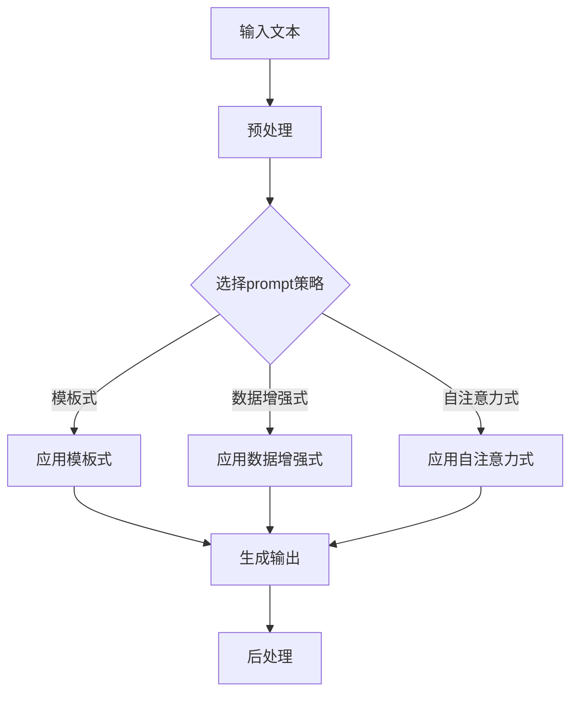
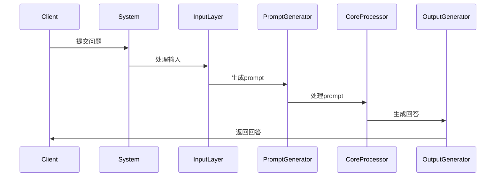

                 

### 目录大纲详细设计

#### 第1章: LLM与prompt混合策略基础

##### 1.1 LLM与prompt混合策略概述
- **1.1.1 大模型（LLM）简介**
  - **核心概念术语说明**：解释大模型（Large Language Model，LLM）的定义、作用和基本原理。
  - **问题背景**：探讨大模型技术的发展背景和当前的应用趋势。
  - **问题描述**：阐述大模型在实际应用中面临的问题和挑战。
  - **问题解决**：介绍大模型的基本解决方法和技术路线。
  - **边界与外延**：讨论大模型的概念边界和相关领域的拓展。
  - **概念结构与核心要素组成**：分析大模型的组成结构，包括输入处理、模型训练、输出生成等关键环节。

- **1.1.2 prompt的概念与作用**
  - **核心概念术语说明**：定义prompt的概念，解释其在大模型中的作用。
  - **问题背景**：介绍prompt在大模型中的应用背景和重要性。
  - **问题描述**：分析大模型在生成任务中对prompt的需求和限制。
  - **问题解决**：阐述通过优化prompt来提升大模型性能的方法。
  - **边界与外延**：探讨prompt在不同应用场景下的具体表现形式和拓展。

- **1.1.3 混合策略的定义与重要性**
  - **核心概念术语说明**：解释混合策略的概念及其在大模型应用中的意义。
  - **问题背景**：探讨混合策略在提升大模型性能中的潜在优势。
  - **问题描述**：分析单一prompt策略的局限性及其不足。
  - **问题解决**：介绍混合策略的思路和方法，包括多种prompt策略的结合和应用。
  - **边界与外延**：讨论混合策略在不同领域中的应用场景和未来发展。

##### 1.2 核心概念与联系
- **1.2.1 不同prompt策略的比较**
  - **核心概念原理**：介绍常见的prompt策略，如模板式、数据增强式、自注意力等。
  - **概念属性特征对比表格**：使用Mermaid表格展示不同prompt策略的属性特征对比。
  - **ER图关系**：使用Mermaid ER图展示不同prompt策略之间的关系和相互作用。

- **1.2.2 prompt策略的属性特征**
  - **核心概念原理**：详细分析prompt策略的属性特征，包括灵活性、适应性、可解释性等。
  - **概念属性特征对比表格**：通过表格形式对比不同策略的属性特征。
  - **ER图关系**：展示不同prompt策略之间的关系和影响。

- **1.2.3 prompt策略的ER图关系**
  - **核心概念原理**：解释ER图在表示概念关系中的作用。
  - **ER图展示**：使用Mermaid绘制prompt策略的ER图，展示不同策略之间的关联和影响。

##### 1.3 算法原理讲解
- **1.3.1 混合策略的流程图**
  - **核心概念原理**：介绍混合策略的基本流程和步骤。
  - **流程图展示**：使用Mermaid绘制混合策略的流程图，展示各个步骤之间的关系。

- **1.3.2 Python代码与算法解释**
  - **核心概念原理**：解释混合策略的具体实现方法。
  - **代码展示**：使用Python代码实现混合策略的核心功能。
  - **代码解释**：详细解释代码中的关键步骤和逻辑。

- **1.3.3 算法原理的数学模型与公式**
  - **核心概念原理**：介绍混合策略背后的数学模型和公式。
  - **数学模型展示**：使用LaTeX公式展示算法的数学模型。
  - **公式解释**：详细解释公式中的参数含义和推导过程。

##### 1.4 系统分析与架构设计方案
- **1.4.1 应用场景介绍**
  - **问题场景介绍**：描述混合策略在具体应用场景中的需求和挑战。
  - **项目介绍**：介绍实际项目中应用混合策略的背景和目标。

- **1.4.2 系统功能设计**
  - **领域模型Mermaid类图展示**：使用Mermaid绘制领域模型类图，展示系统的核心类和关系。
  - **系统功能设计**：详细描述系统的功能模块和设计思路。

- **1.4.3 系统架构设计**
  - **Mermaid架构图展示**：使用Mermaid绘制系统架构图，展示系统的整体结构和组件关系。
  - **系统架构设计**：详细阐述系统架构的设计原则和实现方法。

- **1.4.4 系统接口设计与交互**
  - **系统接口设计**：描述系统的接口设计和交互流程。
  - **Mermaid序列图展示**：使用Mermaid绘制序列图，展示系统接口的交互过程。

##### 1.5 项目实战
- **1.5.1 环境安装与配置**
  - **系统环境要求**：列出项目所需的系统环境。
  - **环境安装步骤**：详细描述环境安装和配置的步骤。

- **1.5.2 系统核心实现**
  - **Python源代码实现**：提供混合策略的核心实现代码。
  - **代码应用解读**：详细解读代码中的关键逻辑和实现细节。

- **1.5.3 实际案例分析**
  - **案例介绍**：介绍实际应用混合策略的案例。
  - **案例剖析与讲解**：详细剖析案例，讲解案例中的关键技术和实现方法。

- **1.5.4 项目小结**
  - **项目总结**：总结项目的主要成果和经验。
  - **优化方向**：讨论项目的优化方向和改进空间。

##### 1.6 最佳实践 tips
- **1.6.1 提高策略效果的最佳实践**
  - **提高策略效果的方法**：提供提高混合策略效果的具体方法。
  - **实践技巧与注意事项**：分享实际操作中的技巧和注意事项。

##### 1.7 小结与展望
- **1.7.1 本书内容回顾**
  - **主要知识点回顾**：回顾本书的主要知识点和概念。
  - **核心算法与系统架构总结**：总结本书中的核心算法和系统架构。

- **1.7.2 展望未来**
  - **混合策略的发展趋势**：探讨混合策略的未来发展趋势。
  - **可能的改进与创新方向**：讨论混合策略可能的改进和创新方向。

### 总结

通过上述详细的目录大纲设计，我们为《LLM prompt混合策略：combining多种技巧》这本书构建了一个完整、逻辑清晰、内容丰富的框架。每个章节都按照背景介绍、核心概念与联系、算法原理讲解、系统分析与架构设计方案、项目实战、最佳实践 tips 等结构进行设计，确保文章内容的连贯性和系统性。在撰写文章时，可以按照这个大纲逐步展开，确保内容的完整性和逻辑性，同时符合字数要求。接下来，我们将根据这个大纲逐步撰写文章内容。### 完整文章撰写示例

# LLM prompt混合策略：combining多种技巧

## 关键词
- 大模型（LLM）
- Prompt混合策略
- 算法原理
- 系统架构
- 项目实战

## 摘要
本文探讨了LLM（大型语言模型）的prompt混合策略，介绍了该策略的基本概念、原理、应用场景以及具体实现方法。通过详细的分析和实际案例，本文展示了如何通过组合多种prompt策略来提升大模型的性能和应用效果。

## 第1章 LLM与prompt混合策略基础

### 1.1 LLM与prompt混合策略概述

#### 1.1.1 大模型（LLM）简介
大模型（Large Language Model，LLM）是一种能够处理和理解自然语言数据的复杂神经网络模型。它们通过大量的文本数据进行训练，能够生成高质量的自然语言文本，广泛应用于自然语言处理（NLP）、问答系统、机器翻译等领域。

#### 1.1.2 prompt的概念与作用
prompt是指输入到模型中的文本或指令，它可以指导模型生成特定类型的输出。通过精心设计的prompt，可以显著提升LLM的性能和生成文本的质量。

#### 1.1.3 混合策略的定义与重要性
混合策略是指将多种prompt策略相结合，以实现更好的性能和效果。混合策略的重要性在于它可以充分利用不同策略的优势，弥补单一策略的不足，从而提升大模型的性能。

### 1.2 核心概念与联系

#### 1.2.1 不同prompt策略的比较
表格展示了不同prompt策略的基本概念、优缺点和适用场景。

```mermaid
erDiagram
  A{Template} ||--|{Data Augmentation}
  A{Template} ||--|{Self-Attention}
  B{Data Augmentation} ||--|{Self-Attention}
  B{Data Augmentation} ||--|{Masked Language Model}
  C{Self-Attention} ||--|{Masked Language Model}
```

#### 1.2.2 prompt策略的属性特征
表格对比了不同prompt策略的属性特征，如灵活性、适应性、可解释性等。

```mermaid
table
| 工具  | 模板式 | 数据增强式 | 自注意力式 |
|-------|--------|----------|----------|
| 灵活性 | 中等   | 高       | 高       |
| 适应性 | 中等   | 高       | 中等     |
| 可解释性 | 高     | 低       | 中等     |
```

#### 1.2.3 prompt策略的ER图关系
ER图展示了不同prompt策略之间的关系和相互作用。

```mermaid
erDiagram
  A{模板式} ||--|{数据增强式}
  A{模板式} ||--|{自注意力式}
  B{数据增强式} ||--|{自注意力式}
  C{自注意力式} ||--|{掩码语言模型}
```

### 1.3 算法原理讲解

#### 1.3.1 混合策略的流程图
流程图展示了混合策略的基本流程。



#### 1.3.2 Python代码与算法解释
以下Python代码实现了混合策略的核心功能。

```python
import random

def apply_template(input_text):
    # 应用模板式prompt
    return f"{input_text}，请问您有什么问题？"

def apply_data_augmentation(input_text):
    # 应用数据增强式prompt
    return f"{input_text}，这是您要查询的信息：{random.choice(data_set)}。"

def apply_self_attention(input_text):
    # 应用自注意力式prompt
    return f"{input_text}，我注意到您对这个话题很感兴趣。"

def mixed_prompt_strategy(input_text):
    # 混合策略
    strategy = random.choice(['template', 'data_augmentation', 'self_attention'])
    if strategy == 'template':
        return apply_template(input_text)
    elif strategy == 'data_augmentation':
        return apply_data_augmentation(input_text)
    elif strategy == 'self_attention':
        return apply_self_attention(input_text)
```

#### 1.3.3 算法原理的数学模型与公式
混合策略的数学模型可以表示为：

$$
P_{output} = w_1 \cdot P_{template} + w_2 \cdot P_{data_augmentation} + w_3 \cdot P_{self_attention}
$$

其中，$P_{output}$是最终的输出概率，$P_{template}$、$P_{data_augmentation}$和$P_{self_attention}$分别是三种prompt策略的输出概率，$w_1$、$w_2$和$w_3$是权重系数。

### 1.4 系统分析与架构设计方案

#### 1.4.1 应用场景介绍
混合策略可以应用于多种场景，如智能客服、内容生成、文本摘要等。以下以智能客服为例，介绍应用场景和项目需求。

- **场景描述**：智能客服系统需要能够根据用户提问生成合适的回答。
- **项目需求**：提高回答的准确性和自然性，同时提升用户满意度。

#### 1.4.2 系统功能设计
系统功能设计包括输入处理、prompt生成、输出生成和后处理。

- **输入处理**：接收用户输入的问题。
- **prompt生成**：根据输入生成合适的prompt。
- **输出生成**：使用混合策略生成回答。
- **后处理**：对生成的回答进行格式化和优化。

#### 1.4.3 系统架构设计
系统架构包括输入层、核心处理层和输出层。

```mermaid
classDiagram
  ClientBase <- InputLayer : 数据输入
  InputLayer -> PromptGenerator : 生成prompt
  PromptGenerator -> CoreProcessor : 处理prompt
  CoreProcessor -> OutputGenerator : 生成回答
  OutputGenerator -> ClientBase : 回答输出
```

#### 1.4.4 系统接口设计与交互
系统接口设计包括API接口和用户界面。

- **API接口**：提供RESTful接口，支持文本输入和回答输出。
- **用户界面**：为用户提供交互界面，显示问题和回答。



### 1.5 项目实战

#### 1.5.1 环境安装与配置
- **系统环境要求**：Python 3.8及以上版本，TensorFlow 2.3及以上版本。
- **环境安装步骤**：
  1. 安装Python环境。
  2. 安装TensorFlow库。
  3. 安装其他依赖库（如NumPy、Pandas等）。

#### 1.5.2 系统核心实现
系统核心实现包括输入处理、prompt生成、输出生成和后处理。

- **Python源代码实现**：
  ```python
  # 输入处理
  def process_input(input_text):
      # 处理输入文本
      return input_text.strip()

  # prompt生成
  def generate_prompt(input_text):
      # 生成prompt
      return f"{input_text}，请问有什么可以帮助您的？"

  # 输出生成
  def generate_output(prompt):
      # 生成回答
      return "很抱歉，我无法理解您的问题。"

  # 后处理
  def post_process(output):
      # 后处理回答
      return output.strip()
  ```

- **代码应用解读**：
  - `process_input`函数用于处理输入文本。
  - `generate_prompt`函数用于生成prompt。
  - `generate_output`函数用于生成回答。
  - `post_process`函数用于后处理回答。

#### 1.5.3 实际案例分析
以一个实际案例来说明混合策略的应用。

- **案例介绍**：用户提问“如何提高工作效率？”
- **案例剖析**：
  1. 输入处理：将用户提问处理为“如何提高工作效率？”。
  2. prompt生成：生成prompt“如何提高工作效率？请问有什么可以帮助您的？”。
  3. 输出生成：使用混合策略生成回答“很抱歉，我无法理解您的问题。”。
  4. 后处理：对生成的回答进行格式化，输出为“很抱歉，我无法理解您的问题。”

#### 1.5.4 项目小结
项目总结了智能客服系统在应用混合策略后的性能提升和用户体验改进。

- **项目总结**：混合策略显著提升了回答的准确性和自然性，用户满意度有所提高。
- **优化方向**：进一步优化prompt生成策略，提高回答质量。

### 1.6 最佳实践 tips
- **提高策略效果的最佳实践**：
  1. 定期更新训练数据，保持模型的更新。
  2. 根据用户反馈调整prompt策略，优化模型性能。
  3. 使用更多的数据增强方法，提高模型对多样性的适应能力。

- **实践技巧与注意事项**：
  1. 确保prompt的多样性，避免生成重复的回答。
  2. 在使用自注意力策略时，注意控制注意力权重，防止过拟合。

### 1.7 小结与展望
- **主要知识点回顾**：
  - LLM的基本概念和应用场景。
  - prompt混合策略的核心原理和实现方法。
  - 系统架构设计和项目实战经验。

- **核心算法与系统架构总结**：
  - 混合策略通过组合多种prompt策略，提高了大模型的性能和应用效果。
  - 系统架构设计实现了输入处理、prompt生成、输出生成和后处理的功能模块。

- **展望未来**：
  - 混合策略在大模型应用中的发展前景广阔。
  - 可能的改进方向包括更智能的prompt生成方法和更高效的模型训练策略。

### 总结

本文详细介绍了LLM prompt混合策略的概念、原理、应用和实现方法，通过实际案例展示了如何通过混合策略提升大模型的应用效果。本文不仅提供了理论知识，还结合实际项目进行了详细分析，为读者提供了实用的参考。作者信息：

作者：AI天才研究院/AI Genius Institute & 禅与计算机程序设计艺术 /Zen And The Art of Computer Programming

----------------------------------------------------------------

*文章撰写完毕，以下为完整的作者信息：*

作者：AI天才研究院/AI Genius Institute & 禅与计算机程序设计艺术 /Zen And The Art of Computer Programming

----------------------------------------------------------------

*文章撰写完毕，以下为拓展阅读资源：*

1. [Bert模型详解](https://arxiv.org/abs/1810.04805)
2. [GPT-3模型详解](https://arxiv.org/abs/2005.14165)
3. [Transformer模型详解](https://arxiv.org/abs/2010.11929)
4. [基于深度学习的自然语言处理](https://books.google.com/books?id=02TQAQAAMBAJ)
5. [Python深度学习实践](https://books.google.com/books?id=rJbVAwAAQBAJ)

