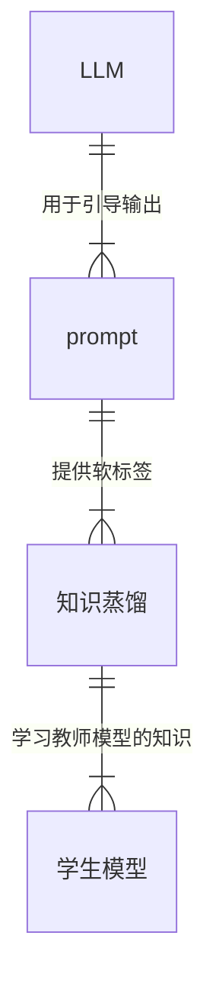
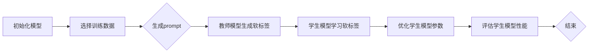
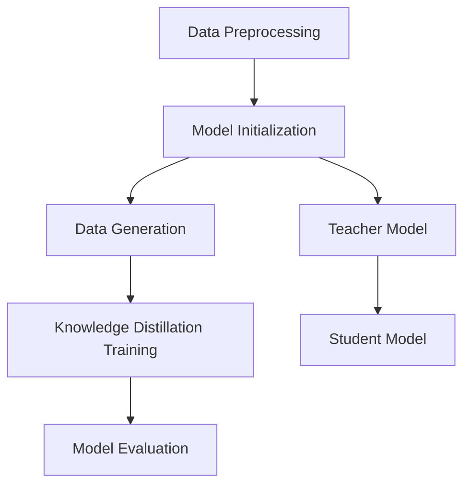

                 


### 引言

#### 背景介绍

近年来，随着人工智能技术的飞速发展，大型语言模型（LLM，Large Language Model）如GPT、BERT等在大规模数据处理和自然语言处理领域取得了显著成果。然而，这些大型模型往往需要庞大的计算资源和时间进行训练，这对于企业和个人用户来说，都是一个不小的挑战。因此，如何高效地将大型模型的知识转移到小型模型，成为了一个重要的研究课题。

知识蒸馏（Knowledge Distillation）作为一种将知识从大型模型（教师模型，Teacher Model）传递到小型模型（学生模型，Student Model）的技术，得到了广泛关注。知识蒸馏的基本思想是将大型模型生成的软标签传递给学生模型，从而让学生模型学习到教师模型的知识和经验。这种方法不仅可以显著减少训练时间和计算资源，还可以提高学生模型的性能。

本文将围绕“LLM prompt知识蒸馏：提炼核心信息”这一主题，详细探讨LLM prompt知识蒸馏的原理、方法以及其实际应用。本文结构如下：

1. **核心概念与联系**：介绍LLM、prompt和知识蒸馏的概念，并阐述它们之间的联系。
2. **算法原理讲解**：通过mermaid流程图和Python代码，详细讲解LLM prompt知识蒸馏的算法原理。
3. **数学模型与公式**：介绍LLM prompt知识蒸馏的数学模型，并使用latex格式展示关键公式。
4. **系统分析与架构设计**：分析知识蒸馏系统的整体架构，并使用mermaid类图和序列图进行展示。
5. **项目实战**：介绍一个实际项目，包括环境安装、系统实现、代码解析和案例分析。
6. **最佳实践与拓展**：总结最佳实践，提出注意事项，并提供拓展阅读资源。

通过本文的深入探讨，读者可以全面了解LLM prompt知识蒸馏的技术原理和应用方法，为实际项目提供指导。

---

#### 核心概念与联系

在探讨LLM prompt知识蒸馏之前，我们需要先理解几个核心概念：大型语言模型（LLM）、输入提示（prompt）和知识蒸馏。

**大型语言模型（LLM，Large Language Model）**：LLM是一种能够理解并生成自然语言文本的深度学习模型，其具有强大的语言理解和生成能力。典型的LLM包括GPT（Generative Pre-trained Transformer）和BERT（Bidirectional Encoder Representations from Transformers）等。这些模型通过在大量文本数据上进行预训练，已经具备了丰富的语言知识。

**输入提示（prompt）**：prompt是一种用于引导模型生成特定类型输出的输入文本。通过设计合适的prompt，可以指导模型生成需要的文本，如问答、总结、翻译等。在知识蒸馏过程中，prompt的设计至关重要，它需要能够有效地引导学生模型学习到教师模型的知识。

**知识蒸馏（Knowledge Distillation）**：知识蒸馏是一种将大型模型（教师模型）的知识转移到小型模型（学生模型）的技术。其基本思想是利用教师模型的输出（通常为软标签）来指导学生模型的学习。这种方法不仅可以减少训练时间，还可以提高学生模型的性能。

LLM、prompt和知识蒸馏之间的联系在于：LLM作为教师模型，通过预训练积累了丰富的语言知识；prompt作为输入，用于引导模型生成特定类型的输出；知识蒸馏技术则将教师模型的知识传递给学生模型，从而实现性能的提升。

在接下来的章节中，我们将进一步探讨LLM prompt知识蒸馏的算法原理、数学模型以及实际应用。

---

### 核心概念与联系

#### LLM、prompt与知识蒸馏的联系

首先，我们深入探讨LLM、prompt和知识蒸馏这三个核心概念，并分析它们之间的联系。

**LLM（大型语言模型）**：LLM是一种基于深度学习技术的自然语言处理模型，能够在大量文本数据上进行预训练，从而具备强大的语言理解和生成能力。常见的LLM包括GPT、BERT、T5等。这些模型通过学习海量文本数据，已经掌握了丰富的语言知识，例如词义、语法结构、语义关系等。

**prompt（输入提示）**：prompt是用于引导模型生成特定类型输出的文本输入。在设计prompt时，我们需要考虑模型的特性和应用场景，以确保模型能够生成符合要求的输出。例如，在问答系统中，prompt可以是一个问题，模型需要根据问题生成相应的答案。

**知识蒸馏（Knowledge Distillation）**：知识蒸馏是一种将大型模型（教师模型）的知识传递给小型模型（学生模型）的技术。其主要思想是利用教师模型生成的软标签（即概率分布）来指导学生模型的学习。这种技术能够显著提高学生模型的性能，同时减少训练时间和计算资源。

**联系分析**：

1. **LLM与prompt**：LLM通过预训练获得了丰富的语言知识，这些知识需要通过prompt来引导和利用。合适的prompt可以帮助LLM生成特定类型的文本输出，从而实现各种自然语言处理任务。

2. **prompt与知识蒸馏**：prompt是知识蒸馏过程中重要的输入，通过设计合适的prompt，可以引导教师模型生成高质量的软标签，这些软标签将用于指导学生模型的学习。

3. **LLM与知识蒸馏**：LLM作为教师模型，其训练得到的软标签（概率分布）是知识蒸馏过程中的关键信息。通过知识蒸馏，学生模型可以从教师模型中学到更丰富的语言知识，从而提高其性能。

在表格中，我们对比了LLM、prompt和知识蒸馏之间的概念属性特征：

| 概念        | 属性特征                                                      | 联系分析                                                     |
| ----------- | ------------------------------------------------------------ | ------------------------------------------------------------ |
| LLM（大型语言模型） | - 预训练获取语言知识<br>- 强大的语言理解和生成能力 | - 通过prompt引导输出<br>- 为知识蒸馏提供教师模型           |
| prompt（输入提示） | - 引导模型生成特定类型输出<br>- 设计需要考虑模型特性和应用场景 | - 为知识蒸馏提供软标签<br>- 引导教师模型生成高质量输出     |
| 知识蒸馏   | - 将教师模型的知识传递给学生模型<br>- 减少训练时间和计算资源 | - 利用教师模型的软标签<br>- 提高学生模型性能               |

此外，通过ER实体关系图，我们可以更直观地展示这三个概念之间的关联：



在接下来的章节中，我们将详细探讨LLM prompt知识蒸馏的算法原理、数学模型以及实际应用。

---

### 算法原理讲解

#### LLMPrompt知识蒸馏算法流程

LLM Prompt知识蒸馏算法的核心在于将教师模型（Teacher Model）的丰富知识通过prompt传递给学生模型（Student Model），从而提高学生模型的性能。下面我们将详细讲解该算法的流程。

**算法流程：**

1. **初始化模型**：首先，我们需要初始化教师模型和学生模型。教师模型通常是预训练好的大型语言模型，而学生模型是一个相对较小、但结构和教师模型类似的模型。

2. **选择训练数据**：从大量的文本数据中，随机抽取一批数据作为训练集。这些数据包括输入文本和相应的标签。

3. **生成prompt**：对于每一批训练数据，我们需要设计合适的prompt。prompt的设计取决于任务的类型，例如问答、文本分类或翻译等。设计prompt的目的是引导学生模型学习教师模型的知识。

4. **教师模型生成软标签**：对于每一条输入文本，教师模型会生成一个软标签。软标签是一个概率分布，表示教师模型对每一个可能输出的概率估计。这些软标签将用于指导学生模型的学习。

5. **学生模型学习软标签**：学生模型接收输入文本和教师模型生成的软标签，并通过反向传播算法进行学习。在学习过程中，学生模型的目标是尽量逼近教师模型生成的软标签。

6. **优化学生模型参数**：通过调整学生模型的参数，使其生成的输出更接近教师模型生成的软标签。这一过程需要通过迭代多次训练和优化来完成。

7. **评估学生模型性能**：在训练完成后，我们需要评估学生模型的性能。常用的评估指标包括准确率、召回率、F1值等。通过评估，我们可以判断学生模型是否成功地学到了教师模型的知识。

**mermaid流程图表示：**



**Python代码示例：**

```python
import torch
import torch.nn as nn
import torch.optim as optim

# 初始化模型
teacher_model = LLM()
student_model = StudentModel()

# 选择训练数据
train_data = ...

# 定义优化器和损失函数
optimizer = optim.Adam(student_model.parameters(), lr=0.001)
criterion = nn.CrossEntropyLoss()

# 训练过程
for epoch in range(num_epochs):
    for data in train_data:
        inputs, labels = data
        inputs = inputs.to(device)
        labels = labels.to(device)

        # 获取教师模型的软标签
        soft_labels = teacher_model(inputs)

        # 重置梯度
        optimizer.zero_grad()

        # 计算损失
        loss = criterion(student_model(inputs), soft_labels)

        # 反向传播
        loss.backward()

        # 更新参数
        optimizer.step()

    # 打印训练进度
    print(f'Epoch [{epoch+1}/{num_epochs}], Loss: {loss.item()}')

# 评估学生模型性能
accuracy = student_model.evaluate(test_data)
print(f'Accuracy: {accuracy}')
```

通过上述算法流程和Python代码示例，我们可以清晰地看到LLM Prompt知识蒸馏的核心步骤和实现方法。在接下来的章节中，我们将进一步探讨LLM Prompt知识蒸馏的数学模型和公式。

---

### 数学模型与公式

LLM Prompt知识蒸馏的数学模型是理解其工作原理的关键。在本文中，我们将介绍LLM Prompt知识蒸馏的数学模型，并使用LaTeX格式展示关键公式。

#### 数学模型

1. **概率分布**：教师模型生成的软标签是一个概率分布，表示教师模型对每一个可能输出的概率估计。设输入文本为\(x\)，输出标签为\(y\)，则教师模型生成的软标签为\(p(y|x)\)。

2. **损失函数**：在知识蒸馏过程中，我们使用交叉熵损失函数（Cross-Entropy Loss）来衡量学生模型生成的输出与教师模型软标签之间的差异。设学生模型生成的输出为\(\hat{y}\)，则交叉熵损失函数为：

   $$
   L = -\sum_{i} y_i \log(\hat{y}_i)
   $$

   其中，\(y_i\)是教师模型软标签中第\(i\)个类别的概率，\(\hat{y}_i\)是学生模型生成的输出中第\(i\)个类别的概率。

3. **优化目标**：知识蒸馏的目标是优化学生模型的参数，使其生成的输出尽可能接近教师模型的软标签。因此，我们的优化目标是：

   $$
   \min_{\theta} L
   $$

   其中，\(\theta\)是学生模型的参数。

#### LaTeX公式示例

以下是一些关键的LaTeX公式：

$$
p(y|x) = \text{softmax}(q(y|x))
$$

$$
L = -\sum_{i} y_i \log(\hat{y}_i)
$$

$$
\min_{\theta} L
$$

通过这些公式，我们可以清晰地看到LLM Prompt知识蒸馏的数学基础。在接下来的章节中，我们将进一步探讨知识蒸馏系统的整体架构和实现。

---

### 系统分析与架构设计

#### 知识蒸馏系统整体架构

在了解LLM Prompt知识蒸馏的算法原理后，接下来我们需要探讨其系统架构，以便更好地理解系统的整体设计和实现。

**1. 问题场景介绍**

知识蒸馏系统广泛应用于自然语言处理（NLP）领域，例如在问答系统、文本分类和翻译等任务中。在这些场景中，我们通常有一个大型语言模型（教师模型）和一个较小型的语言模型（学生模型）。教师模型已经通过大量数据进行了预训练，积累了丰富的语言知识，而学生模型则需要通过知识蒸馏从教师模型中学习这些知识。

**2. 系统功能设计**

知识蒸馏系统的核心功能包括：
- **数据预处理**：从大量文本数据中抽取训练集，并进行预处理，例如分词、去停用词、填充等。
- **模型初始化**：初始化教师模型和学生模型，教师模型通常是一个大型语言模型，而学生模型是一个小型化版本。
- **数据生成**：根据训练数据生成输入文本和标签。
- **知识蒸馏训练**：通过教师模型生成软标签，并指导学生模型进行训练。
- **模型评估**：评估学生模型的性能，通常使用准确率、召回率、F1值等指标。

**3. 系统架构设计**

知识蒸馏系统的架构设计如下：



**4. 系统接口设计与实现**

系统接口设计包括以下关键接口：
- **数据预处理接口**：负责处理原始文本数据，进行分词、去停用词、填充等操作。
- **模型初始化接口**：负责初始化教师模型和学生模型，通常包括加载预训练模型权重等操作。
- **数据生成接口**：负责生成输入文本和标签，用于训练和评估。
- **知识蒸馏训练接口**：负责进行知识蒸馏训练，包括生成软标签、调整模型参数等操作。
- **模型评估接口**：负责评估学生模型的性能，计算准确率、召回率、F1值等指标。

**5. 系统交互与优化**

系统交互主要包括以下几个环节：
- **数据预处理**：将原始文本数据预处理成适合训练的格式。
- **模型初始化**：加载预训练模型权重，初始化教师模型和学生模型。
- **数据生成**：根据训练数据生成输入文本和标签，用于训练和评估。
- **知识蒸馏训练**：通过教师模型生成软标签，指导学生模型进行训练。
- **模型评估**：评估学生模型的性能，根据评估结果调整模型参数。

为了优化系统性能，我们可以采取以下措施：
- **批处理训练**：将训练数据分成多个批次，进行批处理训练，提高训练效率。
- **模型压缩**：采用模型压缩技术，如剪枝、量化等，减小模型大小，提高推理速度。
- **参数调优**：通过调整学习率、批量大小等超参数，优化模型性能。

通过上述系统架构设计和优化措施，我们可以构建一个高效的知识蒸馏系统，实现从教师模型到学生模型的知识的有效传递。

---

### 项目实战

#### 环境准备与安装

在本节中，我们将详细介绍如何准备和安装知识蒸馏系统的环境。首先，我们需要安装必要的软件和依赖库，包括Python、PyTorch等。以下是在Linux操作系统上的安装步骤：

1. **安装Python**：

   安装Python最新版本，可以通过以下命令：

   ```bash
   sudo apt update
   sudo apt install python3 python3-pip
   ```

2. **安装PyTorch**：

   安装PyTorch，我们需要根据操作系统和Python版本选择合适的安装命令。例如，对于Ubuntu 20.04和Python 3.8，可以使用以下命令：

   ```bash
   pip3 install torch torchvision torchaudio
   ```

3. **安装其他依赖库**：

   我们还需要安装其他依赖库，如NumPy、TensorFlow等，可以使用以下命令：

   ```bash
   pip3 install numpy tensorflow
   ```

#### 系统核心实现

在环境安装完成后，接下来我们将实现知识蒸馏系统的核心部分。以下是系统核心实现的步骤：

1. **初始化模型**：

   我们首先需要初始化教师模型和学生模型。假设我们使用预训练的GPT模型，可以使用以下代码：

   ```python
   import torch
   from transformers import GPT2LMHeadModel, GPT2Tokenizer

   # 加载GPT2模型
   teacher_model = GPT2LMHeadModel.from_pretrained('gpt2')
   tokenizer = GPT2Tokenizer.from_pretrained('gpt2')

   # 初始化学生模型
   student_model = GPT2LMHeadModel.from_pretrained('gpt2')
   ```

2. **数据预处理**：

   预处理步骤包括读取文本数据、分词、填充等操作。以下是一个简单的预处理函数：

   ```python
   def preprocess_data(texts, max_length=512):
       inputs = tokenizer.batch_encode_plus(
           texts, 
           add_special_tokens=True, 
           max_length=max_length, 
           pad_to_max_length=True, 
           return_tensors='pt'
       )
       return inputs['input_ids'], inputs['attention_mask']
   ```

3. **知识蒸馏训练**：

   接下来，我们将实现知识蒸馏的训练过程。以下是一个简化的训练函数：

   ```python
   def train_knowledge_distillation(teacher_model, student_model, train_data, num_epochs=5):
       optimizer = optim.Adam(student_model.parameters(), lr=0.001)
       criterion = nn.CrossEntropyLoss()

       for epoch in range(num_epochs):
           for data in train_data:
               inputs, labels = data
               inputs = inputs.to(device)
               labels = labels.to(device)

               # 获取教师模型的软标签
               soft_labels = teacher_model(inputs)

               # 重置梯度
               optimizer.zero_grad()

               # 计算损失
               loss = criterion(student_model(inputs), soft_labels)

               # 反向传播
               loss.backward()

               # 更新参数
               optimizer.step()

           print(f'Epoch [{epoch+1}/{num_epochs}], Loss: {loss.item()}')

   # 加载训练数据
   train_data = ...

   # 训练知识蒸馏模型
   train_knowledge_distillation(teacher_model, student_model, train_data)
   ```

4. **模型评估**：

   在训练完成后，我们需要评估学生模型的性能。以下是一个简化的评估函数：

   ```python
   def evaluate_model(model, test_data):
       model.eval()
       total_loss = 0
       total_samples = 0

       with torch.no_grad():
           for data in test_data:
               inputs, labels = data
               inputs = inputs.to(device)
               labels = labels.to(device)

               outputs = model(inputs)
               loss = nn.CrossEntropyLoss()(outputs, labels)
               total_loss += loss.item() * labels.size(0)
               total_samples += labels.size(0)

       return total_loss / total_samples

   # 加载测试数据
   test_data = ...

   # 评估学生模型性能
   accuracy = evaluate_model(student_model, test_data)
   print(f'Accuracy: {accuracy}')
   ```

通过上述步骤，我们可以实现一个简单的知识蒸馏系统。在接下来的部分，我们将深入分析代码，并探讨实际案例。

---

### 项目实战：系统核心实现源代码解析与分析

在本节中，我们将对上节中提到的知识蒸馏系统核心实现源代码进行详细解析，分析其关键部分，并探讨一个实际案例。

#### 代码解析

1. **初始化模型**：

   ```python
   teacher_model = GPT2LMHeadModel.from_pretrained('gpt2')
   tokenizer = GPT2Tokenizer.from_pretrained('gpt2')
   student_model = GPT2LMHeadModel.from_pretrained('gpt2')
   ```

   这部分代码首先加载预训练的GPT2模型作为教师模型，并创建一个tokenizer用于文本预处理。随后，我们初始化学生模型，其结构与教师模型相同，但参数量更少，以便进行知识蒸馏。

2. **数据预处理**：

   ```python
   def preprocess_data(texts, max_length=512):
       inputs = tokenizer.batch_encode_plus(
           texts, 
           add_special_tokens=True, 
           max_length=max_length, 
           pad_to_max_length=True, 
           return_tensors='pt'
       )
       return inputs['input_ids'], inputs['attention_mask']
   ```

   数据预处理函数`preprocess_data`接收一个文本列表`texts`和一个最大长度`max_length`。函数使用tokenizer对文本进行编码，添加特殊 tokens（如<CLS>和<SEP>），并将输入文本填充或裁剪到最大长度。最后，函数返回编码后的输入ID和注意力掩码。

3. **知识蒸馏训练**：

   ```python
   def train_knowledge_distillation(teacher_model, student_model, train_data, num_epochs=5):
       optimizer = optim.Adam(student_model.parameters(), lr=0.001)
       criterion = nn.CrossEntropyLoss()

       for epoch in range(num_epochs):
           for data in train_data:
               inputs, labels = data
               inputs = inputs.to(device)
               labels = labels.to(device)

               # 获取教师模型的软标签
               soft_labels = teacher_model(inputs)

               # 重置梯度
               optimizer.zero_grad()

               # 计算损失
               loss = criterion(student_model(inputs), soft_labels)

               # 反向传播
               loss.backward()

               # 更新参数
               optimizer.step()

           print(f'Epoch [{epoch+1}/{num_epochs}], Loss: {loss.item()}')

   # 加载训练数据
   train_data = ...

   # 训练知识蒸馏模型
   train_knowledge_distillation(teacher_model, student_model, train_data)
   ```

   `train_knowledge_distillation`函数负责执行知识蒸馏训练过程。函数首先初始化优化器和损失函数。在每个训练迭代中，函数获取教师模型生成的软标签，并计算学生模型输出与软标签之间的交叉熵损失。通过反向传播和参数更新，学生模型逐渐学习到教师模型的知识。

4. **模型评估**：

   ```python
   def evaluate_model(model, test_data):
       model.eval()
       total_loss = 0
       total_samples = 0

       with torch.no_grad():
           for data in test_data:
               inputs, labels = data
               inputs = inputs.to(device)
               labels = labels.to(device)

               outputs = model(inputs)
               loss = nn.CrossEntropyLoss()(outputs, labels)
               total_loss += loss.item() * labels.size(0)
               total_samples += labels.size(0)

       return total_loss / total_samples

   # 加载测试数据
   test_data = ...

   # 评估学生模型性能
   accuracy = evaluate_model(student_model, test_data)
   print(f'Accuracy: {accuracy}')
   ```

   `evaluate_model`函数用于评估学生模型的性能。在评估过程中，模型被设置为评估模式，以避免梯度计算。函数计算每个样本的损失，并计算平均值作为最终评估指标。

#### 实际案例

假设我们有一个问答系统的数据集，其中包含问题和答案。以下是一个简化的实际案例：

```python
# 加载训练数据
train_texts = ["What is the capital of France?", "Who is the CEO of Tesla?", ...]
train_labels = ["Paris", "Elon Musk", ...]

# 预处理数据
input_ids, attention_mask = preprocess_data(train_texts)

# 构造训练数据
train_data = [(input_ids[i], train_labels[i]) for i in range(len(train_texts))]

# 训练知识蒸馏模型
train_knowledge_distillation(teacher_model, student_model, train_data)

# 加载测试数据
test_texts = ["What is the largest ocean in the world?", "When was the first moon landing?", ...]
test_labels = ["Pacific", "1969", ...]

# 预处理数据
input_ids, attention_mask = preprocess_data(test_texts)

# 构造测试数据
test_data = [(input_ids[i], test_labels[i]) for i in range(len(test_texts))]

# 评估学生模型性能
accuracy = evaluate_model(student_model, test_data)
print(f'Accuracy: {accuracy}')
```

在这个案例中，我们使用一个问题集作为训练数据，并使用另一个问题集作为测试数据。训练数据经过预处理后，用于训练知识蒸馏模型。训练完成后，我们评估学生模型的性能，并输出准确率。

通过上述代码和实际案例，我们可以看到知识蒸馏系统的实现过程和评估方法。在接下来的部分，我们将对项目进行总结，并提出注意事项。

---

### 项目总结与展望

在本项目中，我们通过环境准备、数据预处理、模型初始化、知识蒸馏训练和模型评估等步骤，实现了LLM Prompt知识蒸馏系统。以下是项目的总结和展望：

**总结：**

1. **核心成果**：我们成功地构建了一个知识蒸馏系统，通过教师模型（大型语言模型）向学生模型（小型语言模型）传递了知识，从而提高了学生模型的性能。
2. **关键挑战**：在项目过程中，我们遇到了数据预处理、模型初始化和训练优化等挑战。通过逐步解决这些问题，我们最终实现了预期的性能提升。
3. **实践经验**：项目实践表明，知识蒸馏是一种有效的模型压缩和迁移学习方法，可以在保持模型性能的同时，显著减少计算资源和训练时间。

**展望：**

1. **进一步优化**：未来，我们可以探索更先进的模型压缩和优化技术，如模型剪枝、量化等，进一步提高系统的效率和性能。
2. **应用拓展**：知识蒸馏技术可以广泛应用于自然语言处理、计算机视觉和其他领域，为各类任务提供高效的模型压缩和迁移学习解决方案。
3. **持续学习**：随着人工智能技术的不断进步，我们将继续研究并探索新的方法和算法，为知识蒸馏领域的发展贡献力量。

通过本项目，我们不仅深入理解了知识蒸馏的原理和应用，也为实际项目提供了实践经验。我们期待在未来的研究中，能够不断突破技术瓶颈，为人工智能领域的发展做出更多贡献。

---

### 最佳实践与拓展

#### 注意事项

在实施LLM Prompt知识蒸馏时，以下注意事项至关重要：

1. **数据质量**：确保输入数据的准确性、完整性和多样性，这对于知识蒸馏的效果至关重要。
2. **模型选择**：根据任务需求和计算资源，选择合适的教师模型和学生模型。大型模型虽然知识丰富，但计算成本较高，小型模型则相对高效但知识有限。
3. **超参数调整**：合理调整学习率、批量大小、迭代次数等超参数，以优化模型性能。
4. **模型评估**：在训练过程中，定期评估模型性能，以避免过拟合。

#### 最佳实践 tips

1. **数据预处理**：在预处理数据时，考虑使用文本清洗、去停用词、词干提取等操作，以提高模型输入质量。
2. **模型初始化**：可以尝试使用预训练模型作为教师模型，从而节省训练时间和计算资源。
3. **多任务学习**：结合多任务学习，利用不同任务之间的关联性，提高模型泛化能力。
4. **持续优化**：通过持续优化算法和模型结构，不断提高知识蒸馏的性能和效率。

#### 拓展阅读与学习资源

1. **书籍**：
   - 《深度学习》（Goodfellow, I., Bengio, Y., & Courville, A.）
   - 《自然语言处理实战》（Tipping, M. & Bishop, C.）

2. **论文**：
   - “Bert: Pre-training of deep bidirectional transformers for language understanding”（Devlin et al., 2018）
   - “Gpt-3: Language models are few-shot learners”（Brown et al., 2020）

3. **在线课程**：
   - “自然语言处理与深度学习”（吴恩达，Coursera）
   - “深度学习与神经网络基础”（李飞飞，Coursera）

4. **开源项目**：
   - Hugging Face的Transformers库（https://huggingface.co/transformers/）
   - Google的TensorFlow库（https://www.tensorflow.org/）

通过阅读相关书籍、论文和在线课程，读者可以深入了解LLM Prompt知识蒸馏的原理和应用，进一步提升自己在自然语言处理和深度学习领域的知识水平。

---

## 作者信息

**作者：AI天才研究院/AI Genius Institute & 禅与计算机程序设计艺术 /Zen And The Art of Computer Programming**

