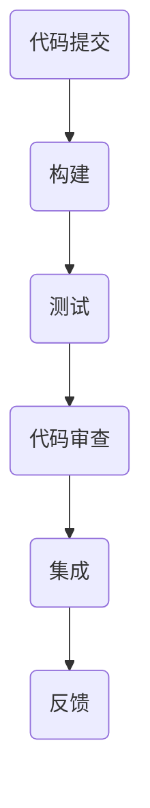

                 

## 文章标题

# LLM应用开发中的CI/CD流程设计

> 关键词：**LLM应用开发，持续集成（CI），持续交付（CD），流程设计，自动化**

> 摘要：本文将深入探讨在语言模型（LLM）应用开发中引入持续集成（CI）和持续交付（CD）流程的重要性。通过详细的分析和实例，我们将了解CI/CD的概念、工具选择、流程设计原则、最佳实践以及优化策略，为读者提供一个全面而实用的指导。

### 目录大纲

----------------------------------------------------------------

## LLM应用开发中的CI/CD流程设计

### 第一部分：背景与基础

#### 第1章：问题背景与CI/CD概述

##### 1.1 问题背景

##### 1.1.1 LLM应用的发展趋势

##### 1.1.2 LLM应用面临的挑战

##### 1.1.3 CI/CD在LLM应用开发中的重要性

##### 1.2 CI/CD的定义与核心概念

##### 1.2.1 持续集成（CI）

##### 1.2.2 持续交付（CD）

##### 1.2.3 CI/CD与传统开发流程的比较

##### 1.3 CI/CD的关键优势

##### 1.3.1 提高开发效率

##### 1.3.2 提升软件质量

##### 1.3.3 促进团队协作

##### 1.4 本章小结

### 第二部分：CI/CD工具与流程设计

#### 第2章：CI/CD工具介绍

##### 2.1 持续集成工具

##### 2.1.1 Jenkins

##### 2.1.2 GitLab CI/CD

##### 2.1.3 CircleCI

##### 2.2 持续交付工具

##### 2.2.1 Docker

##### 2.2.2 Kubernetes

##### 2.2.3 AWS CodePipeline

##### 2.3 代码管理工具

##### 2.3.1 Git

##### 2.3.2 GitHub

##### 2.3.3 GitLab

##### 2.4 环境配置与管理工具

##### 2.4.1 Ansible

##### 2.4.2 Terraform

##### 2.4.3 Vagrant

##### 2.5 本章小结

#### 第3章：CI/CD流程设计与实施

##### 3.1 CI/CD流程设计原则

##### 3.1.1 自动化与标准化

##### 3.1.2 灵活性与可扩展性

##### 3.1.3 安全性与可靠性

##### 3.2 LLM应用CI/CD流程设计

##### 3.2.1 开发阶段CI流程设计

##### 3.2.2 部署阶段CD流程设计

##### 3.2.3 监控与反馈机制设计

##### 3.3 实际案例分享

##### 3.3.1 案例一：电商平台LLM应用CI/CD流程

##### 3.3.2 案例二：金融行业LLM应用CI/CD流程

##### 3.4 本章小结

### 第三部分：CI/CD最佳实践与优化

#### 第4章：CI/CD最佳实践

##### 4.1 持续集成最佳实践

##### 4.1.1 合适的代码提交频率

##### 4.1.2 代码审查与测试策略

##### 4.1.3 代码质量保证

##### 4.2 持续交付最佳实践

##### 4.2.1 部署策略

##### 4.2.2 灾难恢复与备份策略

##### 4.2.3 安全性与合规性

##### 4.3 团队协作与沟通技巧

##### 4.3.1 沟通工具与平台

##### 4.3.2 版本控制与协作流程

##### 4.3.3 团队协作文化

##### 4.4 本章小结

#### 第5章：CI/CD流程优化

##### 5.1 流程评估与监控

##### 5.1.1 持续流程改进

##### 5.1.2 监控工具选择

##### 5.1.3 数据分析与可视化

##### 5.2 流程自动化与效率提升

##### 5.2.1 自动化脚本编写

##### 5.2.2 工具集成与优化

##### 5.2.3 工作流优化策略

##### 5.3 性能优化与故障处理

##### 5.3.1 性能瓶颈分析

##### 5.3.2 故障处理流程

##### 5.3.3 预防性维护

##### 5.4 本章小结

### 第四部分：案例分析

#### 第6章：LLM应用CI/CD案例分析

##### 6.1 案例一：教育行业LLM应用

##### 6.1.1 应用场景介绍

##### 6.1.2 CI/CD流程设计

##### 6.1.3 实施与优化

##### 6.2 案例二：医疗行业LLM应用

##### 6.2.1 应用场景介绍

##### 6.2.2 CI/CD流程设计

##### 6.2.3 实施与优化

##### 6.3 案例三：智能家居行业LLM应用

##### 6.3.1 应用场景介绍

##### 6.3.2 CI/CD流程设计

##### 6.3.3 实施与优化

##### 6.4 本章小结

#### 第7章：未来趋势与展望

##### 7.1 LLM与CI/CD融合趋势

##### 7.1.1 自动化与智能化

##### 7.1.2 自适应与自优化

##### 7.1.3 云原生与边缘计算

##### 7.2 CI/CD在AI领域的发展前景

##### 7.2.1 AI模型版本管理

##### 7.2.2 AI模型训练与部署自动化

##### 7.2.3 AI驱动的CI/CD

##### 7.3 本章小结

----------------------------------------------------------------

## 引言

在当前技术迅猛发展的时代，语言模型（LLM）技术已经成为人工智能领域的一个热点，广泛应用于自然语言处理、智能问答、文本生成等领域。随着LLM应用场景的不断扩展，开发者面临着如何高效、安全、可靠地部署和更新这些应用的压力。这时，持续集成（CI）和持续交付（CD）成为了解决这些问题的关键工具。

### 持续集成（CI）与持续交付（CD）

持续集成（Continuous Integration，CI）是一种软件开发实践，通过自动化构建和测试来加快软件开发过程。其主要目标是确保代码的任何变更都能够及时集成到主干分支，并及时发现潜在的问题，从而提高软件的稳定性。

持续交付（Continuous Delivery，CD）是CI的延伸，它不仅确保代码的集成，还确保应用可以在任何环境（开发、测试、生产）中快速、可靠地交付。CD通过自动化部署和回归测试，使得软件的交付过程更加流畅和可预测。

### CI/CD在LLM应用开发中的重要性

在LLM应用开发中，CI/CD的重要性尤为突出：

1. **加速开发周期**：LLM应用通常涉及大量的数据预处理和模型训练，自动化流程可以大幅减少这些步骤的耗时。
2. **提高软件质量**：通过自动化测试，开发者可以更快地发现和修复代码中的问题，确保软件质量。
3. **增强团队协作**：CI/CD流程设计要求团队成员紧密协作，共同维护和更新代码，提高团队的整体效率。
4. **降低风险**：自动化测试和部署流程减少了手动操作的机会，降低了因人为错误导致的问题风险。

### 文章结构

本文将分为四个主要部分：

1. **背景与基础**：介绍LLM应用的发展趋势和面临的挑战，解释CI/CD的基本概念和优势。
2. **工具与流程设计**：介绍常用的CI/CD工具，详细讨论CI/CD流程的设计原则和实施方法。
3. **最佳实践与优化**：分享CI/CD的最佳实践，探讨如何优化CI/CD流程。
4. **案例分析**：通过实际案例，展示如何在不同行业中实施CI/CD流程。

### 结论

通过本文，读者将了解CI/CD在LLM应用开发中的重要性，掌握CI/CD工具的使用方法，学会设计高效的CI/CD流程，并了解最佳实践和优化策略。希望本文能为开发者提供有价值的参考，助力他们在LLM应用开发中取得更大的成功。

### 第一部分：背景与基础

#### 第1章：问题背景与CI/CD概述

随着人工智能技术的快速发展，语言模型（LLM）在各个行业中的应用越来越广泛。LLM技术通过深度学习算法，对大量文本数据进行分析和处理，生成高质量的文本内容，为自然语言处理、智能问答、文本生成等领域提供了强大的支持。

### 1.1 问题背景

在LLM应用开发过程中，开发者面临着一系列挑战：

1. **开发效率低下**：传统的软件开发流程通常需要手动执行多个步骤，如代码提交、编译、测试和部署。这些步骤不仅耗时，而且容易出现人为错误，导致开发效率低下。
2. **软件质量难以保证**：在传统的开发流程中，代码变更可能长时间未经过充分测试就被集成到主干分支，导致软件质量难以保证。一旦出现问题，修复过程非常繁琐。
3. **团队协作困难**：在大型项目中，团队成员之间的协作变得尤为重要。但是，传统的开发流程往往缺乏有效的协作机制，导致团队成员之间的沟通不畅，协作效率低下。
4. **安全性和可靠性问题**：随着软件复杂度的增加，安全性和可靠性问题变得更加突出。手动部署和测试过程容易出现漏洞，导致系统崩溃或数据泄露。

### 1.2 LLM应用面临的挑战

在LLM应用开发中，除了上述挑战外，还面临以下特定挑战：

1. **数据预处理复杂**：LLM应用通常需要对大量文本数据进行预处理，如数据清洗、分词、去噪等。这些步骤不仅耗时，而且容易出现错误。
2. **模型训练耗时长**：LLM模型的训练过程通常非常耗时，尤其是在处理大规模数据集时。传统开发流程中，模型训练和部署通常需要手动进行，效率低下。
3. **版本管理困难**：在LLM应用开发过程中，模型的迭代更新非常频繁。传统的版本管理方法难以有效管理这些版本，导致部署过程复杂。
4. **性能优化困难**：LLM应用通常要求较高的计算性能，如GPU加速、分布式计算等。传统开发流程难以满足这些需求，导致性能优化困难。

### 1.3 CI/CD在LLM应用开发中的重要性

为了解决上述问题和挑战，引入持续集成（CI）和持续交付（CD）流程变得尤为重要。

1. **提高开发效率**：CI/CD通过自动化构建、测试和部署过程，显著提高了开发效率。开发者可以专注于核心功能的开发，而无需担心繁琐的流程。
2. **提升软件质量**：CI/CD确保每次代码变更都经过充分的测试，及时发现和修复问题，从而提高软件质量。对于LLM应用，自动化测试可以帮助确保模型训练的正确性和稳定性。
3. **促进团队协作**：CI/CD流程要求团队成员紧密协作，共同维护和更新代码。通过统一的流程和工具，团队成员之间的沟通变得更加顺畅，协作效率得到提高。
4. **降低风险**：CI/CD通过自动化测试和部署，减少了手动操作的机会，降低了人为错误导致的风险。对于LLM应用，自动化流程可以确保模型在不同环境中的稳定运行，降低故障率。
5. **简化版本管理**：CI/CD提供了强大的版本管理功能，可以轻松管理模型的多个版本。开发者可以随时切换版本，便于迭代更新和部署。
6. **支持性能优化**：CI/CD流程可以集成各种性能优化工具，如GPU加速、分布式计算等。开发者可以利用这些工具，对LLM应用进行性能优化，提高计算效率。

### 1.4 CI/CD的定义与核心概念

持续集成（CI）和持续交付（CD）是软件开发中的重要概念，它们的定义和核心概念如下：

1. **持续集成（CI）**：
   - **定义**：持续集成是指将代码变更频繁地集成到主干分支，并通过自动化构建和测试确保集成后的代码质量。
   - **核心概念**：
     - **自动化构建**：通过构建工具（如Maven、Gradle等）自动化执行编译、打包、依赖管理等步骤。
     - **自动化测试**：通过自动化测试框架（如JUnit、TestNG等）执行单元测试、集成测试等，确保代码的功能和性能。
     - **持续反馈**：及时反馈测试结果，确保每次集成都经过充分测试，发现问题能够及时得到修复。

2. **持续交付（CD）**：
   - **定义**：持续交付是指通过自动化部署和回归测试，确保应用可以在任何环境（开发、测试、生产）中快速、可靠地交付。
   - **核心概念**：
     - **自动化部署**：通过部署工具（如Docker、Kubernetes等）自动化执行部署任务，确保部署过程的稳定和高效。
     - **回归测试**：在每次部署后，执行一系列回归测试，确保新部署的应用与旧版本兼容，功能正常。
     - **持续监控**：通过监控工具（如Prometheus、Grafana等）实时监控应用性能和健康状态，及时发现和解决问题。

### 1.5 CI/CD与传统开发流程的比较

传统开发流程通常依赖于手动操作和人工审核，而CI/CD则通过自动化和标准化流程，带来了显著的改进：

1. **自动化与手工操作**：
   - **传统开发流程**：依赖于手工执行构建、测试和部署任务，效率低下，容易出现人为错误。
   - **CI/CD**：通过自动化工具和脚本，自动化执行构建、测试和部署任务，提高效率，减少错误。

2. **频繁集成与孤岛开发**：
   - **传统开发流程**：开发人员通常独立工作，代码集成到主干分支的时间间隔较长，容易导致集成问题。
   - **CI/CD**：频繁集成代码，每次提交都经过自动化测试，及时发现和修复问题，确保代码质量。

3. **测试覆盖与手动测试**：
   - **传统开发流程**：测试覆盖不充分，通常只在项目后期进行集成测试和验收测试，难以发现早期问题。
   - **CI/CD**：通过自动化测试，实现全面测试覆盖，每次提交都经过严格测试，确保代码质量。

4. **部署流程与手动部署**：
   - **传统开发流程**：部署过程通常依赖于手动操作，容易出错，部署效率低。
   - **CI/CD**：通过自动化部署，确保每次部署都按照标准流程进行，提高部署效率，降低出错风险。

### 1.6 CI/CD的关键优势

1. **提高开发效率**：
   - 通过自动化构建、测试和部署，减少手动操作，提高开发效率。
   - 缩短开发周期，加快迭代速度，提高团队产出。

2. **提升软件质量**：
   - 通过自动化测试，实现全面测试覆盖，及时发现和修复问题。
   - 确保代码质量和软件稳定性，降低缺陷率。

3. **促进团队协作**：
   - 统一的流程和工具，促进团队成员之间的协作和沟通。
   - 提高团队协作效率，减少协作障碍。

4. **降低风险**：
   - 自动化测试和部署，减少人为错误，降低风险。
   - 快速发现和修复问题，确保软件稳定运行。

5. **简化版本管理**：
   - 强大的版本管理功能，轻松管理多个版本。
   - 灵活切换版本，支持迭代更新。

6. **支持性能优化**：
   - 集成各种性能优化工具，如GPU加速、分布式计算等。
   - 提高性能，满足高性能需求。

### 1.7 本章小结

本章介绍了LLM应用开发中面临的挑战和CI/CD的重要性。通过引入CI/CD流程，可以提高开发效率、提升软件质量、促进团队协作、降低风险，并简化版本管理。接下来，我们将详细讨论CI/CD工具的选择和流程设计原则，为读者提供实用的指导。

## 第二部分：CI/CD工具与流程设计

#### 第2章：CI/CD工具介绍

在构建高效的CI/CD流程中，选择合适的工具至关重要。本章将介绍一系列常用的CI/CD工具，包括持续集成工具、持续交付工具、代码管理工具和环境配置与管理工具。

### 2.1 持续集成工具

持续集成（CI）工具是CI/CD流程的核心组件，它们负责自动化构建、测试和部署任务。以下是几种常用的CI/CD工具：

1. **Jenkins**
   - **概述**：Jenkins是最流行的开源CI/CD工具之一，它支持多种插件，可以与各种开发工具和平台集成。
   - **特点**：
     - 强大的插件生态系统，支持各种语言和框架。
     - 支持自动化构建、测试、部署和监控。
     - 易于配置和管理。
   - **适用场景**：适用于企业级项目，特别是需要与多个平台和工具集成的项目。

2. **GitLab CI/CD**
   - **概述**：GitLab CI/CD是GitLab自带的CI/CD解决方案，可以与GitLab仓库无缝集成。
   - **特点**：
     - 简单易用，无需额外的服务器或软件。
     - 支持多环境部署和多种构建脚本。
     - 集成了代码审查和自动化测试。
   - **适用场景**：适用于中小型项目，特别是希望整合代码管理和CI/CD工具的项目。

3. **CircleCI**
   - **概述**：CircleCI是一个云端的CI/CD平台，提供高效的构建和测试环境。
   - **特点**：
     - 快速构建和测试，提供高效的计算资源。
     - 集成了多种编程语言和框架。
     - 支持并行构建，提高构建速度。
   - **适用场景**：适用于需要快速迭代和大规模构建的项目。

### 2.2 持续交付工具

持续交付（CD）工具负责自动化部署和监控应用。以下是几种常用的CD工具：

1. **Docker**
   - **概述**：Docker是一个开源的应用容器引擎，可以轻松创建、运行和分发应用程序容器。
   - **特点**：
     - 容器化应用，提高部署的灵活性和可移植性。
     - 简化环境配置，减少环境差异问题。
     - 支持自动化部署和扩展。
   - **适用场景**：适用于任何需要容器化的应用程序，特别是需要跨平台部署和扩展的应用。

2. **Kubernetes**
   - **概述**：Kubernetes是一个开源的容器编排平台，用于自动化部署、扩展和管理容器化应用程序。
   - **特点**：
     - 高可用性和可伸缩性，支持大规模集群管理。
     - 支持多种容器运行时，如Docker、rkt等。
     - 提供丰富的监控和日志功能。
   - **适用场景**：适用于需要高可用性和可伸缩性的大型分布式系统，特别是微服务架构。

3. **AWS CodePipeline**
   - **概述**：AWS CodePipeline是AWS提供的持续集成和持续交付服务，可以与AWS的其他服务无缝集成。
   - **特点**：
     - 简单易用，无需配置和管理服务器。
     - 自动化部署和回归测试。
     - 集成了多种开发工具和平台。
   - **适用场景**：适用于AWS云环境中的项目，特别是需要与AWS其他服务集成的项目。

### 2.3 代码管理工具

代码管理工具用于版本控制和代码协作，以下是几种常用的代码管理工具：

1. **Git**
   - **概述**：Git是一个分布式版本控制系统，广泛应用于开源项目和商业项目。
   - **特点**：
     - 支持分布式工作流程，灵活性强。
     - 快速且高效的操作，支持大型代码库。
     - 提供丰富的分支和合并功能。
   - **适用场景**：适用于任何需要版本控制和协作的项目，特别是大型项目和分布式团队。

2. **GitHub**
   - **概述**：GitHub是一个基于Git的开源代码托管平台，提供了丰富的协作工具和社区资源。
   - **特点**：
     - 简单易用，支持多种开发语言的代码库。
     - 提供代码审查和合并请求功能。
     - 支持多种集成服务，如CI/CD工具、测试工具等。
   - **适用场景**：适用于开源项目和小型商业项目，特别是需要代码审查和协作的项目。

3. **GitLab**
   - **概述**：GitLab是一个基于Git的开源代码托管和项目管理平台。
   - **特点**：
     - 集成了代码审查、CI/CD、issue跟踪等工具。
     - 支持自托管，可以在本地或云环境中部署。
     - 提供丰富的监控和审计功能。
   - **适用场景**：适用于企业内部项目，特别是需要集中管理和监控的项目。

### 2.4 环境配置与管理工具

环境配置与管理工具用于自动化配置和管理开发、测试和生产环境。以下是几种常用的环境配置工具：

1. **Ansible**
   - **概述**：Ansible是一个开源的IT自动化工具，用于配置、管理和部署应用程序。
   - **特点**：
     - 简单易用，通过Python模块扩展功能。
     - 无需在被管理服务器上安装代理，支持大量服务器快速部署。
     - 支持多种操作系统和应用程序配置。
   - **适用场景**：适用于自动化配置和管理服务器和应用程序，特别是跨平台环境。

2. **Terraform**
   - **概述**：Terraform是一个开源的自动化基础设施管理工具，可以创建和修改云基础架构。
   - **特点**：
     - 提供抽象和模板化基础设施定义。
     - 支持多种云服务提供商，如AWS、Azure、Google Cloud等。
     - 支持版本控制和回滚功能。
   - **适用场景**：适用于自动化管理云基础设施，特别是跨云环境。

3. **Vagrant**
   - **概述**：Vagrant是一个虚拟化工具，用于创建和管理虚拟机环境。
   - **特点**：
     - 简单易用，支持多种虚拟化平台，如VirtualBox、VMware等。
     - 提供可重复的环境配置，支持多平台开发。
     - 集成了VCS，支持版本控制。
   - **适用场景**：适用于创建和管理虚拟开发环境，特别是需要跨平台兼容的项目。

### 2.5 本章小结

在本章中，我们介绍了常用的CI/CD工具，包括持续集成工具（Jenkins、GitLab CI/CD、CircleCI）、持续交付工具（Docker、Kubernetes、AWS CodePipeline）、代码管理工具（Git、GitHub、GitLab）和环境配置与管理工具（Ansible、Terraform、Vagrant）。这些工具在CI/CD流程中发挥着关键作用，帮助开发者提高开发效率、提升软件质量、促进团队协作。在下一章，我们将详细讨论CI/CD流程的设计原则和实施方法。

### 第3章：CI/CD流程设计与实施

CI/CD流程的设计与实施是确保LLM应用开发高效、可靠的关键。本章节将深入探讨CI/CD流程的设计原则、开发阶段的CI流程设计、部署阶段的CD流程设计以及监控与反馈机制的设计。

#### 3.1 CI/CD流程设计原则

在设计CI/CD流程时，需要遵循以下原则：

1. **自动化与标准化**：
   - **自动化**：将构建、测试、部署等步骤自动化，减少手动操作，提高效率。
   - **标准化**：确保流程的标准化，使得所有团队成员都能遵循统一的流程和规范。

2. **灵活性**：
   - **支持多种环境**：设计流程时，要考虑不同环境（开发、测试、生产）的需求，确保流程的灵活性。
   - **可扩展性**：设计可扩展的流程，以便在项目规模和需求变化时能够轻松调整。

3. **安全性**：
   - **访问控制**：确保只有授权用户可以访问和操作CI/CD流程。
   - **数据保护**：保护代码和数据的完整性，防止泄露和篡改。

4. **可靠性**：
   - **持续监控**：通过监控工具实时监控CI/CD流程的运行状态，确保流程的稳定性和可靠性。
   - **错误处理**：设计错误处理机制，确保在流程出现问题时能够及时恢复。

#### 3.2 开发阶段的CI流程设计

在开发阶段，CI流程的设计至关重要。以下是一个典型的CI流程设计步骤：

1. **代码提交**：
   - 开发者将代码提交到代码仓库，触发CI流程。

2. **构建**：
   - CI工具自动化执行构建任务，包括编译代码、打包依赖等。
   - 构建过程中，生成构建报告，记录构建结果。

3. **测试**：
   - 执行自动化测试，包括单元测试、集成测试等。
   - 测试结果通过报告或通知形式反馈给开发者。

4. **代码审查**：
   - 自动化测试通过后，进行代码审查，确保代码质量和风格符合规范。

5. **集成**：
   - 将通过审查的代码集成到主干分支，确保代码的稳定性和一致性。

6. **反馈**：
   - 将CI流程的结果和反馈及时通知相关开发者，包括测试结果、代码审查意见等。

以下是一个简单的CI流程的Mermaid流程图：

#### 3.3 部署阶段的CD流程设计

部署阶段的CD流程设计同样关键，以下是典型的CD流程设计步骤：

1. **构建**：
   - 重新执行构建任务，确保构建的完整性。

2. **测试**：
   - 执行自动化回归测试，确保部署的稳定性和功能完整性。

3. **部署**：
   - 自动化部署到测试环境，进行初步测试。
   - 确保部署过程按照标准流程进行，减少人为错误。

4. **监控**：
   - 在测试环境中进行监控，确保应用的正常运行。

5. **反馈**：
   - 将部署结果和反馈通知相关开发者，包括测试结果、监控数据等。

6. **上线**：
   - 如果测试成功，将应用部署到生产环境。
   - 进行上线后的监控和测试，确保生产环境的稳定运行。

以下是一个简单的CD流程的Mermaid流程图：

#### 3.4 监控与反馈机制设计

监控与反馈机制是CI/CD流程的重要组成部分，以下是一些建议的设计步骤：

1. **监控工具选择**：
   - 选择适合项目的监控工具，如Prometheus、Grafana等。
   - 确保监控工具能够收集和分析关键指标。

2. **监控指标定义**：
   - 定义关键性能指标（KPI），如响应时间、吞吐量、错误率等。
   - 定义健康状态指标，如服务可用性、资源利用率等。

3. **实时监控**：
   - 设置实时监控，确保及时发现和响应异常情况。
   - 通过报警机制，通知相关人员处理异常。

4. **反馈机制**：
   - 设计反馈机制，将监控数据和异常情况及时通知相关开发者和管理人员。
   - 通过邮件、短信、即时通讯工具等途径进行通知。

5. **分析报告**：
   - 定期生成监控分析报告，提供项目的运行状态和趋势。
   - 利用报告进行性能优化和故障处理。

#### 3.5 实际案例分享

为了更好地理解CI/CD流程的设计与实施，以下分享两个实际案例：

##### 案例一：电商平台LLM应用CI/CD流程

**应用场景**：一个电商平台利用LLM技术实现智能客服功能，需要高效、可靠地部署和更新智能客服系统。

**CI/CD流程设计**：

1. **代码提交**：开发者在GitHub上提交代码，触发CI流程。

2. **构建**：Jenkins自动化执行构建任务，包括编译代码、打包依赖等。

3. **测试**：执行自动化测试，包括单元测试、集成测试等。

4. **代码审查**：通过GitLab CI执行代码审查，确保代码质量。

5. **集成**：将通过审查的代码集成到主干分支。

6. **部署**：通过Docker将应用部署到测试环境，执行自动化测试。

7. **监控**：使用Prometheus和Grafana进行实时监控。

8. **反馈**：将测试结果和监控数据通过邮件和即时通讯工具反馈给开发者。

9. **上线**：如果测试成功，将应用部署到生产环境。

##### 案例二：金融行业LLM应用CI/CD流程

**应用场景**：一个金融公司利用LLM技术实现自动化金融报告生成，需要确保系统的安全性和可靠性。

**CI/CD流程设计**：

1. **代码提交**：开发者在GitLab上提交代码，触发CI流程。

2. **构建**：GitLab CI自动化执行构建任务，包括编译代码、打包依赖等。

3. **测试**：执行自动化测试，包括单元测试、集成测试等。

4. **代码审查**：通过GitLab CI执行代码审查，确保代码质量。

5. **集成**：将通过审查的代码集成到主干分支。

6. **部署**：通过AWS CodePipeline将应用部署到测试环境，执行自动化测试。

7. **监控**：使用AWS CloudWatch进行实时监控。

8. **反馈**：将测试结果和监控数据通过邮件和即时通讯工具反馈给开发者。

9. **上线**：如果测试成功，将应用部署到生产环境。

#### 3.6 本章小结

在本章中，我们详细讨论了CI/CD流程的设计原则、开发阶段的CI流程设计、部署阶段的CD流程设计以及监控与反馈机制的设计。通过实际案例分享，我们了解了CI/CD流程在LLM应用开发中的实际应用。下一章，我们将探讨CI/CD最佳实践，帮助读者进一步提升CI/CD流程的效率和质量。

### 第4章：CI/CD最佳实践

在实现高效的CI/CD流程时，最佳实践至关重要。本章将介绍一些持续集成（CI）和持续交付（CD）的最佳实践，包括合适的代码提交频率、代码审查与测试策略，以及代码质量保证。此外，我们还将探讨持续交付的最佳实践，如部署策略、灾难恢复与备份策略，以及安全性与合规性。

#### 4.1 持续集成最佳实践

1. **合适的代码提交频率**：

   - **频繁提交**：频繁提交代码可以及时发现和修复问题，减少代码积累和集成风险。建议每天多次提交，甚至每小时提交。
   - **小批量提交**：每次提交的代码量应尽量小，确保每次提交都是一个完整的、可测试的单元。
   - **自动化触发**：使用自动化触发机制，如Git提交、定时任务等，确保每次提交都能触发CI流程。

2. **代码审查与测试策略**：

   - **代码审查**：实施代码审查机制，确保代码质量。可以使用自动化工具进行静态代码分析，结合人工审查，提高代码质量。
   - **自动化测试**：执行全面的自动化测试，包括单元测试、集成测试、性能测试等。确保每次提交都经过充分的测试。
   - **测试覆盖率**：确保测试覆盖率足够高，覆盖关键功能和边界情况。

3. **代码质量保证**：

   - **编码规范**：制定统一的编码规范，确保代码风格一致，提高可读性和可维护性。
   - **代码风格检查**：使用代码风格检查工具，如Pylint、StyleCop等，自动检查代码风格问题。
   - **代码复杂性控制**：使用代码复杂性度量工具，如Cyclomatic复杂性度量、Maintainability Index等，控制代码复杂性。

#### 4.2 持续交付最佳实践

1. **部署策略**：

   - **蓝绿部署**：在新的部署环境中，同时运行旧版本和新版本，逐步切换流量到新版本，确保平稳过渡。
   - **灰度发布**：将新版本部署到一小部分用户，监控性能和用户反馈，逐步扩大发布范围。

2. **灾难恢复与备份策略**：

   - **数据备份**：定期备份数据库和其他重要数据，确保数据安全。
   - **故障转移**：设计故障转移机制，确保在主系统出现故障时，能够快速切换到备用系统。
   - **应急预案**：制定应急预案，确保在出现重大故障时，能够快速响应和恢复。

3. **安全性与合规性**：

   - **安全审计**：定期进行安全审计，确保系统的安全性符合相关标准和法规要求。
   - **访问控制**：实施严格的访问控制策略，确保只有授权人员可以访问系统和数据。
   - **数据加密**：对敏感数据进行加密处理，确保数据在传输和存储过程中安全。

#### 4.3 团队协作与沟通技巧

1. **沟通工具与平台**：

   - **实时沟通**：使用实时沟通工具，如Slack、Microsoft Teams等，确保团队成员可以快速交流和协作。
   - **会议安排**：定期安排团队会议，讨论项目进度、问题和解决方案。

2. **版本控制与协作流程**：

   - **版本控制**：使用Git等版本控制系统，确保代码的版本管理和协作效率。
   - **代码分支策略**：制定合理的代码分支策略，如主分支、功能分支、开发分支等，确保代码的可维护性和协作性。

3. **团队协作文化**：

   - **开放沟通**：鼓励团队成员开放沟通，分享问题和解决方案。
   - **共同目标**：明确团队目标，确保团队成员朝着共同的目标努力。
   - **鼓励反馈**：鼓励团队成员提出建议和反馈，促进团队不断改进。

#### 4.4 本章小结

在本章中，我们介绍了CI/CD的最佳实践，包括持续集成的最佳实践、持续交付的最佳实践，以及团队协作与沟通技巧。通过遵循这些最佳实践，可以提高CI/CD流程的效率和质量，确保软件的高效开发、测试和部署。在下一章，我们将探讨CI/CD流程的优化策略，帮助读者进一步提升CI/CD流程的性能和稳定性。

### 第5章：CI/CD流程优化

CI/CD流程的优化是确保流程高效运行、提升项目质量和团队协作效率的关键。本章将深入探讨CI/CD流程的评估与监控、流程自动化与效率提升，以及性能优化与故障处理。通过这些优化策略，开发者可以确保CI/CD流程能够满足不断变化的需求，同时保持稳定性和可靠性。

#### 5.1 流程评估与监控

1. **持续流程改进**：

   - **定期评估**：定期对CI/CD流程进行评估，分析流程的瓶颈和改进点。可以采用KPI（关键绩效指标）来衡量流程的性能。
   - **数据收集与分析**：收集CI/CD流程的运行数据，如构建时间、测试覆盖率、失败率等，通过数据分析发现流程中的问题。
   - **反馈机制**：建立反馈机制，鼓励团队成员提出改进建议，并制定改进计划。

2. **监控工具选择**：

   - **选择合适的监控工具**：根据项目需求和规模，选择合适的监控工具，如Prometheus、Grafana、Datadog等。这些工具可以提供实时的监控数据和可视化报表。
   - **集成与扩展**：确保监控工具与其他工具（如CI/CD工具、日志管理工具等）集成，实现数据的统一监控和报警。

3. **数据分析与可视化**：

   - **数据可视化**：使用图表和报表将监控数据可视化，便于团队成员直观地了解流程的运行状态。
   - **趋势分析**：通过分析历史数据，识别流程的趋势和模式，提前发现潜在问题。

#### 5.2 流程自动化与效率提升

1. **自动化脚本编写**：

   - **脚本标准化**：编写标准化的自动化脚本，确保流程的一致性和可维护性。可以使用Python、Shell等脚本语言。
   - **脚本优化**：定期优化自动化脚本，减少执行时间和资源消耗。可以使用缓存、并行处理等技术提高脚本性能。

2. **工具集成与优化**：

   - **集成与协同**：将CI/CD工具与其他工具（如代码管理工具、测试工具、监控工具等）集成，实现数据共享和流程协同。
   - **工具优化**：根据项目需求，选择和配置合适的工具，并定期更新和升级工具，确保其性能和兼容性。

3. **工作流优化策略**：

   - **简化流程**：简化CI/CD流程，减少不必要的步骤和重复工作，提高流程的效率。
   - **并行处理**：利用并行处理技术，如多线程、多任务等，加快流程执行速度。
   - **资源管理**：合理分配和利用资源，如计算资源、存储资源等，确保流程的稳定性和可靠性。

#### 5.3 性能优化与故障处理

1. **性能瓶颈分析**：

   - **定位瓶颈**：通过监控数据和性能测试，定位CI/CD流程中的性能瓶颈，如构建时间过长、测试失败率高等。
   - **优化措施**：根据瓶颈定位结果，采取相应的优化措施，如调整测试策略、优化脚本执行等。

2. **故障处理流程**：

   - **快速响应**：建立故障响应机制，确保在流程出现故障时，能够快速响应和处理。
   - **故障排查**：使用日志分析、性能监控等工具，排查故障原因，并记录故障处理过程。
   - **故障恢复**：在故障处理过程中，及时恢复流程运行，并进行回归测试，确保流程的稳定性和可靠性。

3. **预防性维护**：

   - **定期检查**：定期对CI/CD流程进行检查和维护，确保系统的正常运行。
   - **优化脚本**：定期优化和更新自动化脚本，确保其性能和兼容性。
   - **备份与恢复**：定期备份数据和配置文件，确保在出现故障时能够快速恢复。

#### 5.4 本章小结

在本章中，我们详细探讨了CI/CD流程的优化策略，包括流程评估与监控、流程自动化与效率提升，以及性能优化与故障处理。通过这些优化策略，开发者可以显著提升CI/CD流程的效率和质量，确保软件的高效开发、测试和部署。在下一章，我们将通过实际案例分析，展示CI/CD流程在不同行业中的应用，进一步加深读者对CI/CD实践的理解。

### 第6章：LLM应用CI/CD案例分析

在本章中，我们将通过几个具体案例，展示CI/CD流程在LLM应用开发中的实际应用。这些案例来自教育、医疗和智能家居等行业，每个案例都将详细介绍应用场景、CI/CD流程设计、实施与优化。

#### 6.1 案例一：教育行业LLM应用

**应用场景**：一个在线教育平台利用LLM技术提供智能问答和个性化学习推荐服务。

**CI/CD流程设计**：

1. **开发阶段CI流程**：
   - **代码提交**：开发者在GitLab上提交代码，触发Jenkins CI流程。
   - **构建**：Jenkins自动化执行构建任务，包括编译Python代码、安装依赖等。
   - **测试**：执行自动化测试，包括单元测试、集成测试等，确保代码质量。
   - **代码审查**：通过GitLab CI执行代码审查，确保代码符合规范。
   - **集成**：将通过审查的代码合并到主干分支。

2. **部署阶段CD流程**：
   - **构建**：Jenkins重新执行构建任务，确保构建的完整性。
   - **测试**：在测试环境中执行自动化回归测试，确保功能正常。
   - **部署**：使用Docker和Kubernetes，将应用部署到测试环境。
   - **监控**：使用Prometheus和Grafana进行实时监控，确保系统稳定运行。
   - **反馈**：将测试结果和监控数据反馈给开发者。

**实施与优化**：

- **代码提交频率**：开发者每天多次提交代码，确保及时发现和修复问题。
- **测试覆盖率**：通过增加测试用例，提高测试覆盖率，确保关键功能得到充分测试。
- **部署策略**：采用蓝绿部署策略，确保新版本的应用能够平稳过渡到生产环境。
- **监控与反馈**：通过实时监控和反馈机制，确保系统在高负载情况下依然稳定运行。

**总结**：通过CI/CD流程，该在线教育平台实现了高效的代码管理、测试和部署，提升了开发效率，保证了软件质量。

#### 6.2 案例二：医疗行业LLM应用

**应用场景**：一家医疗机构利用LLM技术开发智能病历管理系统，以提高病历录入效率和准确性。

**CI/CD流程设计**：

1. **开发阶段CI流程**：
   - **代码提交**：开发者在GitHub上提交代码，触发CircleCI CI流程。
   - **构建**：CircleCI自动化执行Python代码的构建任务，包括编译和依赖安装。
   - **测试**：执行自动化测试，包括单元测试、集成测试和性能测试，确保代码质量。
   - **代码审查**：通过GitHub Actions执行代码审查，确保代码符合规范。
   - **集成**：将通过审查的代码集成到主干分支。

2. **部署阶段CD流程**：
   - **构建**：CircleCI重新执行构建任务，确保构建的完整性。
   - **测试**：在测试环境中执行自动化回归测试，确保功能正常。
   - **部署**：使用AWS CodePipeline，将应用部署到测试环境。
   - **监控**：使用AWS CloudWatch进行实时监控，确保系统稳定运行。
   - **反馈**：将测试结果和监控数据通过邮件反馈给开发者。

**实施与优化**：

- **代码审查策略**：引入严格的代码审查流程，确保代码质量和安全性。
- **自动化测试**：增加自动化测试用例，特别是针对关键业务流程的测试，提高测试覆盖率。
- **部署策略**：采用蓝绿部署和灰度发布策略，确保部署过程的平稳和可逆。
- **监控与报警**：建立完善的监控和报警机制，确保在出现问题时能够及时响应和处理。

**总结**：通过CI/CD流程，该医疗机构的智能病历管理系统实现了高效的开发、测试和部署，确保了系统的可靠性和安全性。

#### 6.3 案例三：智能家居行业LLM应用

**应用场景**：一家智能家居公司利用LLM技术开发智能语音助手，以提升用户体验和交互能力。

**CI/CD流程设计**：

1. **开发阶段CI流程**：
   - **代码提交**：开发者在GitLab上提交代码，触发GitLab CI流程。
   - **构建**：GitLab CI自动化执行构建任务，包括编译Java代码、安装依赖等。
   - **测试**：执行自动化测试，包括单元测试、集成测试和性能测试，确保代码质量。
   - **代码审查**：通过GitLab CI执行代码审查，确保代码符合规范。
   - **集成**：将通过审查的代码合并到主干分支。

2. **部署阶段CD流程**：
   - **构建**：GitLab CI重新执行构建任务，确保构建的完整性。
   - **测试**：在测试环境中执行自动化回归测试，确保功能正常。
   - **部署**：使用Docker和Kubernetes，将应用部署到测试环境。
   - **监控**：使用Prometheus和Grafana进行实时监控，确保系统稳定运行。
   - **反馈**：将测试结果和监控数据反馈给开发者。

**实施与优化**：

- **多环境测试**：在多个环境中进行测试，包括开发环境、测试环境和模拟生产环境，确保代码在各种环境中都能正常运行。
- **自动化部署**：使用Kubernetes进行自动化部署，确保部署过程的稳定和高效。
- **性能优化**：通过性能测试，识别和优化系统的瓶颈，提升整体性能。
- **监控与反馈**：通过实时监控和反馈机制，确保系统能够快速响应用户请求，并保持稳定运行。

**总结**：通过CI/CD流程，该智能家居公司的智能语音助手实现了高效、可靠的开发和部署，提升了用户体验和系统的稳定性。

#### 6.4 本章小结

通过以上三个案例，我们可以看到CI/CD流程在LLM应用开发中的实际应用和重要性。无论是在教育、医疗还是智能家居行业，CI/CD流程都为开发者提供了高效的代码管理、测试和部署方式，提升了软件质量和团队协作效率。在下一章，我们将探讨LLM与CI/CD的未来发展趋势，为读者提供更多的启示和思考。

### 第7章：未来趋势与展望

随着人工智能（AI）技术的不断进步，特别是语言模型（LLM）的广泛应用，CI/CD流程也在不断演进。本章节将探讨LLM与CI/CD的融合趋势，以及CI/CD在AI领域的发展前景。

#### 7.1 LLM与CI/CD融合趋势

1. **自动化与智能化**：

   - **自动化构建与测试**：LLM技术的应用使得构建和测试过程更加智能化。例如，LLM可以用于生成测试用例，提高测试覆盖率。同时，自动化工具可以与LLM结合，实现更加智能的代码审查和问题定位。
   - **智能部署**：利用LLM的预测能力，CI/CD工具可以智能地选择最佳的部署策略。例如，根据历史数据和预测模型，自动调整部署的流量比例，实现平稳的版本更新。

2. **自适应与自优化**：

   - **自适应流程**：CI/CD流程可以根据项目规模和需求的变化，自适应调整。例如，当项目规模扩大时，CI/CD工具可以自动增加资源，确保流程的稳定运行。
   - **自优化流程**：通过数据分析和机器学习，CI/CD流程可以自我优化，提高效率和性能。例如，根据历史数据，自动调整构建、测试和部署的参数，以减少耗时和资源消耗。

3. **云原生与边缘计算**：

   - **云原生CI/CD**：随着云计算的普及，CI/CD流程逐渐向云原生方向演进。例如，利用容器编排工具（如Kubernetes）实现CI/CD流程的自动化和弹性扩展。
   - **边缘计算CI/CD**：在边缘计算场景中，CI/CD流程需要适应低延迟和高带宽的要求。利用LLM技术，可以实现边缘设备上的实时构建、测试和部署，提高系统的响应速度。

#### 7.2 CI/CD在AI领域的发展前景

1. **AI模型版本管理**：

   - **模型版本控制**：随着AI模型的迭代更新，版本管理变得越来越重要。CI/CD工具可以提供强大的版本控制功能，确保模型的历史版本和当前版本得到妥善管理。
   - **模型版本迁移**：通过CI/CD流程，可以自动化地管理模型在不同环境（开发、测试、生产）之间的迁移，确保模型的一致性和稳定性。

2. **AI模型训练与部署自动化**：

   - **自动化训练**：利用CI/CD工具，可以实现模型训练过程的自动化。例如，通过自动化调度资源、优化训练参数，提高模型训练的效率。
   - **自动化部署**：通过CI/CD流程，可以实现模型部署的自动化。例如，使用容器化技术，将模型部署到不同的环境，确保模型的快速上线和扩展。

3. **AI驱动的CI/CD**：

   - **智能构建**：利用AI技术，CI/CD工具可以智能地选择构建策略，优化构建过程。例如，根据历史数据和预测模型，自动调整构建参数，减少构建时间。
   - **智能测试**：利用AI技术，CI/CD工具可以智能地选择测试用例，优化测试过程。例如，通过分析代码变更和历史测试结果，自动生成和调整测试用例，提高测试覆盖率。
   - **智能监控**：利用AI技术，CI/CD工具可以智能地监控系统的运行状态，预测潜在的问题。例如，通过分析监控数据，自动识别和报警，确保系统的稳定性和可靠性。

#### 7.3 本章小结

随着AI技术的不断进步，CI/CD流程也在不断演进。未来，CI/CD与AI的融合将带来更多的智能化和自动化，为开发者提供更加高效和可靠的开发、测试和部署环境。通过了解这些趋势，开发者可以更好地应对AI应用带来的挑战，提升软件质量和团队协作效率。

## 总结

本文详细探讨了LLM应用开发中的CI/CD流程设计，从背景与基础、工具与流程设计、最佳实践与优化，到案例分析，全面介绍了CI/CD在LLM应用开发中的重要性。通过实际案例分享，读者可以更好地理解CI/CD流程在各个行业中的应用。随着AI技术的不断进步，CI/CD与AI的融合将成为未来发展趋势，为开发者提供更加高效和可靠的开发环境。希望本文能为您在LLM应用开发中引入CI/CD流程提供有价值的参考。

### 作者信息

- **作者**：AI天才研究院/AI Genius Institute & 禅与计算机程序设计艺术 /Zen And The Art of Computer Programming

[返回目录](#目录大纲)

