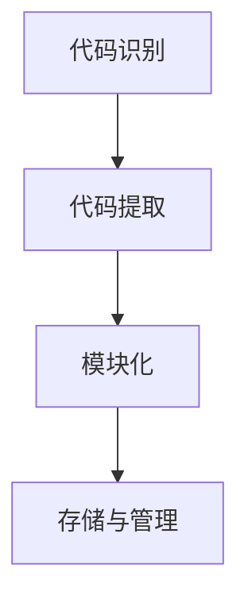
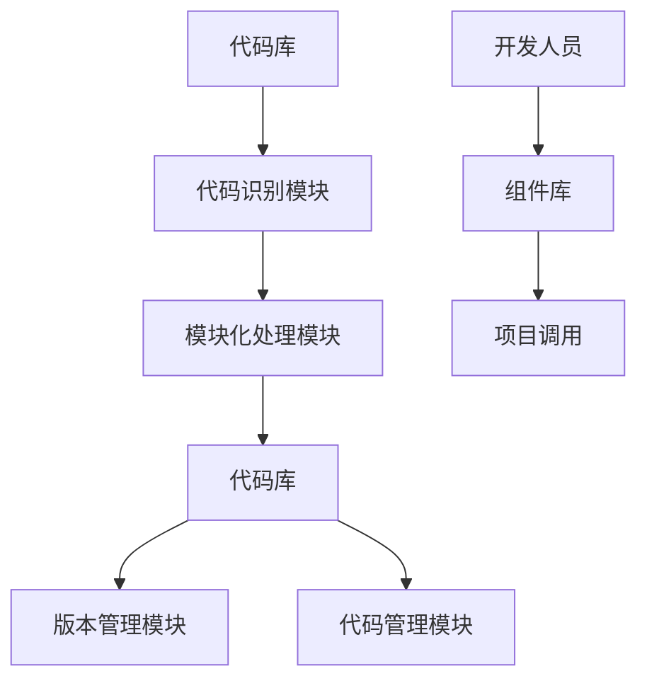
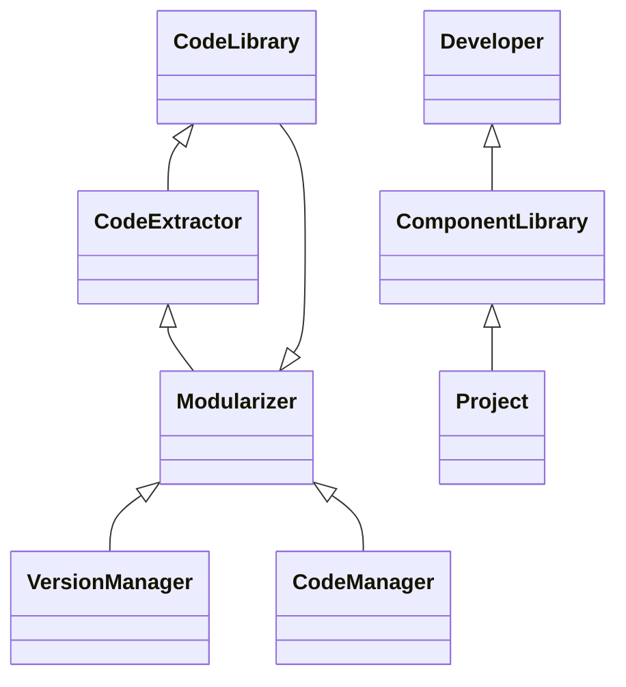
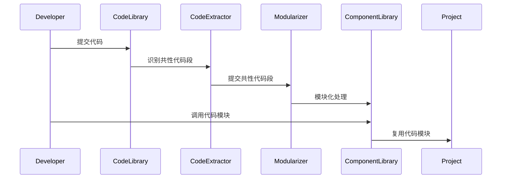

                 

### 第一部分: 背景介绍

#### 第1章: 问题背景与定义

##### 1.1 问题的提出

##### 1.1.1 从LLM应用现状看代码复用的重要性

随着大规模语言模型（LLM）的广泛应用，代码复用成为提高开发效率、减少重复劳动的关键因素。LLM应用涉及大量文本数据的处理、模型的训练与优化，这些过程都需要高效的代码支持。代码复用的重要性体现在以下几个方面：

1. **提升开发效率**：通过复用已有代码，开发者可以节省大量的时间和精力，避免重复编写冗长的代码段。
2. **保证代码质量**：复用经过验证的代码可以减少错误和bug的出现，提高整体代码的稳定性。
3. **加速项目迭代**：代码复用使得项目可以在较短的时间内完成，从而加快产品的迭代速度。

##### 1.1.2 代码复用的概念与优势

代码复用是指在软件开发过程中，将已经编写并经过验证的代码段、模块或组件在新的项目中再次使用。其核心目标是通过最大化利用已有的资源来提高开发效率和质量。

**代码复用的优势**：

1. **减少开发时间**：避免重复编写代码，直接使用现成的模块，可以显著缩短开发周期。
2. **提高代码质量**：复用经过严格测试和优化的代码，可以保证新系统的可靠性和稳定性。
3. **增强维护性**：修改或更新一个模块时，只需在单一地方进行更改，所有使用该模块的系统都会自动更新，从而降低维护成本。
4. **促进技术积累**：通过复用，可以将优秀的开发实践和经验积累下来，为未来的项目提供宝贵的参考。

##### 1.2 LLM应用中的代码复用问题

在LLM应用开发中，代码复用面临着一些特有的挑战：

1. **代码可维护性**：由于LLM模型的复杂性和规模庞大，如何保证复用代码的可维护性是一个重要问题。
2. **代码适应性**：不同应用场景下的LLM模型可能需要不同的代码支持，如何使代码具有足够的适应性是一个难题。
3. **性能优化**：复用代码时，需要考虑到代码的性能对整体系统的影响，如何在保证代码复用的同时进行性能优化是一个技术挑战。

##### 1.2.1 问题表述

在实际的LLM应用开发中，代码复用问题表现为：

- **模块化不足**：LLM应用中的代码缺乏有效的模块化，导致代码难以复用。
- **代码依赖复杂**：大量的代码依赖关系使得复用代码变得困难，同时也增加了系统的复杂性。
- **缺乏统一的代码管理规范**：没有统一的代码管理规范，导致代码复用时的不一致性，增加了维护成本。

##### 1.2.2 问题分析

代码复用问题可以从以下几个方面进行分析：

1. **技术层面**：缺乏有效的模块化工具和技术，使得代码复用变得困难。
2. **管理层面**：缺乏统一的管理规范，导致代码复用难以系统化和规范化。
3. **开发习惯**：开发人员对于代码复用的意识和习惯不足，缺乏系统性的复用策略。

##### 1.3 代码复用的边界与外延

**代码复用与代码复制的区别**：

- **代码复制**：是指直接将已有的代码段复制到新项目中使用，这种方式往往缺乏灵活性，容易导致代码库的冗余和一致性问题的出现。
- **代码复用**：则是通过抽象和封装，将代码转化为可复用的模块或组件，这不仅提高了代码的灵活性，还保证了代码的一致性和可维护性。

**代码复用与模块化的关系**：

- **模块化**：是指将软件系统划分为多个功能独立、相互依赖的模块，每个模块可以独立开发和测试，模块化是代码复用的基础。
- **代码复用**：则是在模块化的基础上，通过将模块或组件在不同的项目中使用，从而实现代码的重用。

##### 1.4 核心概念与联系

**核心概念**：

- **代码复用**：通过将已有的代码段、模块或组件在新的项目中使用，以提升开发效率和代码质量。
- **模块化**：将软件系统划分为多个功能独立、相互依赖的模块，每个模块可以独立开发和测试。

**概念属性特征对比**：

| 特征          | 代码复用 | 模块化 |
|---------------|----------|--------|
| **定义**      | 重用代码 | 划分模块 |
| **目标**      | 提高开发效率 | 提高可维护性 |
| **方式**      | 组件复用 | 模块划分 |
| **效果**      | 减少开发时间 | 提高代码质量 |

**ER实体关系图**：

```mermaid
erDiagram
  CodeModule ||--|{ Project : Uses }
  Project    ||--|{ CodeModule : Contains }
```

- **CodeModule**：代表可复用的代码模块。
- **Project**：代表软件开发项目。

通过上述分析，我们可以看到代码复用在LLM应用开发中的重要性，以及面临的挑战和解决方案。接下来的章节将深入探讨代码复用的具体策略和实践，以期为开发者提供实用的指导和参考。### 第二部分: 核心概念与原理

#### 第2章: 代码复用策略详解

##### 2.1 代码复用策略概述

**2.1.1 代码复用策略的定义**

代码复用策略是指在软件开发过程中，通过制定一系列规范和规则，确保代码的模块化和可复用性。其核心目的是通过最大化利用已有代码资源，提高开发效率和代码质量。

**2.1.2 代码复用策略的分类**

根据实现方式和目标不同，代码复用策略可以分为以下几种类型：

1. **功能复用**：通过将具有相似功能或部分功能的代码模块在不同项目中使用，实现代码的重用。
2. **类复用**：在面向对象编程中，通过继承和接口等机制，复用已有的类或组件。
3. **模块复用**：将独立的模块打包成库或框架，供不同项目调用。
4. **组件复用**：将具备特定功能的前端或后端组件，以UI库或API服务的形式提供。

##### 2.2 算法原理讲解

**2.2.1 算法原理**

代码复用算法的核心原理是通过识别和提取代码中的共性部分，将其抽象为可复用的模块。具体步骤如下：

1. **代码识别**：对代码库进行静态和动态分析，识别出具有复用价值的代码段。
2. **代码提取**：将识别出的代码段提取出来，封装为独立的模块或组件。
3. **模块化**：对提取出来的代码进行模块化处理，确保其具备独立性和可复用性。
4. **存储与管理**：将模块化后的代码存储在代码库或组件库中，以便在其他项目中调用。

**2.2.2 算法流程图**



**2.2.3 Python源代码示例**

```python
# 代码识别示例
def calculate_area(radius):
    return 3.14 * radius * radius

# 代码提取与模块化示例
class Circle:
    def __init__(self, radius):
        self.radius = radius
    
    def calculate_area(self):
        return 3.14 * self.radius * self.radius

# 存储与管理示例
circles = [Circle(2), Circle(3)]
for circle in circles:
    print(circle.calculate_area())
```

**2.2.4 数学模型和公式**

在代码复用过程中，可以使用一些数学模型和公式来评估代码的复用价值。以下是一个简单的数学模型：

$$
V = f(A, C)
$$

其中：
- \( V \)：代码复用价值
- \( A \)：代码共性部分所占比例
- \( C \)：代码的维护成本

**2.3 案例分析与详解**

**2.3.1 案例背景**

某公司开发了一个在线教育平台，其中涉及大量的用户管理、课程管理和支付功能。为了提高开发效率，公司决定采用代码复用策略，将公共模块（如用户管理、支付接口等）提取出来，供不同项目调用。

**2.3.2 案例分析**

1. **代码识别**：通过对现有代码库进行分析，识别出用户管理、支付接口等具有复用价值的代码段。
2. **代码提取**：将用户管理、支付接口等代码段提取出来，封装为独立的模块或组件。
3. **模块化**：对提取出来的代码进行模块化处理，确保其具备独立性和可复用性。例如，将用户管理模块分为用户注册、用户登录、用户信息管理等子模块。
4. **存储与管理**：将模块化后的代码存储在代码库或组件库中，以便在其他项目中调用。

**2.3.3 代码解读与分析**

1. **用户管理模块**

```python
class UserManager:
    def register_user(self, user_data):
        # 注册用户逻辑
        pass
    
    def login_user(self, user_data):
        # 登录用户逻辑
        pass
    
    def get_user_info(self, user_id):
        # 获取用户信息逻辑
        pass
```

2. **支付接口模块**

```python
class PaymentInterface:
    def process_payment(self, payment_data):
        # 处理支付逻辑
        pass
    
    def refund_payment(self, payment_id):
        # 退款逻辑
        pass
```

通过代码复用策略，公司可以大大提高开发效率，降低维护成本，同时确保代码质量。在实际开发过程中，可以根据具体需求对模块进行调整和扩展，以满足不同项目的需求。### 第三部分: 系统设计与实现

#### 第3章: 代码复用系统架构设计

**3.1 系统需求分析**

在LLM应用开发中，代码复用系统需要满足以下需求：

**3.1.1 功能需求**

- **代码识别与提取**：自动识别代码库中的共性代码段，提取并封装为可复用的模块。
- **模块化与存储**：对提取的代码进行模块化处理，存储在代码库或组件库中，方便其他项目调用。
- **版本管理**：支持代码模块的版本管理，确保代码的可追踪性和一致性。
- **代码管理**：提供代码的查询、更新、删除等操作，方便开发人员管理代码库。

**3.1.2 非功能需求**

- **高性能**：系统需具备高效的处理速度，以支持大规模代码库的快速识别和模块化。
- **高可靠性**：系统需具备高可靠性，确保代码复用的稳定性和安全性。
- **易扩展性**：系统需具备良好的扩展性，支持新功能和新技术的引入。
- **可维护性**：系统设计需易于维护，降低维护成本。

**3.2 系统架构设计**

代码复用系统的整体架构设计如图所示：



**3.2.1 领域模型类图**



**3.2.2 系统架构设计**

系统架构主要包括以下几个部分：

1. **代码库**：存储所有项目的源代码，包括公共代码段和项目特定代码。
2. **代码识别模块**：负责自动识别代码库中的共性代码段。
3. **模块化处理模块**：负责对提取的代码进行模块化处理，生成可复用的模块。
4. **版本管理模块**：负责管理代码模块的版本，确保代码的追踪性和一致性。
5. **代码管理模块**：提供代码的查询、更新、删除等功能，方便开发人员管理代码库。
6. **开发人员**：负责开发项目，调用组件库中的代码模块。
7. **组件库**：存储所有可复用的代码模块，供不同项目调用。

**3.2.3 系统接口设计**

系统接口设计主要包括以下几个接口：

1. **代码识别接口**：用于识别代码库中的共性代码段。
2. **模块化接口**：用于将提取的代码进行模块化处理。
3. **版本管理接口**：用于管理代码模块的版本。
4. **代码管理接口**：用于查询、更新、删除代码模块。
5. **组件库接口**：用于查询、调用组件库中的代码模块。

**3.2.4 系统交互序列图**



通过以上系统架构设计和接口设计，可以实现对LLM应用开发中的代码复用过程进行高效管理，提高开发效率和代码质量。在接下来的章节中，我们将详细讨论代码复用系统的具体实现和项目实战。### 第3章: 代码复用系统架构设计

**3.3 系统实现**

**3.3.1 环境安装**

在开始代码复用系统的实现之前，我们需要安装必要的工具和环境。以下是一个简单的安装步骤：

1. **安装Python环境**：确保Python版本在3.6及以上。
2. **安装依赖库**：安装代码识别、模块化和版本管理等依赖库。可以使用以下命令进行安装：

```bash
pip install gitpython
pip install flake8
pip install pylint
```

3. **安装Git**：确保本地环境已经安装了Git，用于代码管理和版本控制。

**3.3.2 系统核心实现**

代码复用系统的核心实现分为以下几个部分：

1. **代码识别**：使用GitPython库解析本地代码库，识别共性代码段。

```python
import git
import os

repo = git.Repo(path_to_repo)
for file in repo.git.diff('', name_only=True).splitlines():
    if file.endswith('.py'):
        print(f"Found Python file: {file}")
```

2. **模块化处理**：使用flake8和pylint库对提取的代码进行静态检查，确保代码质量，并将代码段封装为模块。

```python
import flake8
import pylint

def check_code_quality(code):
    flake8_output = flake8.get_style_guide().check_files([code])
    pylint_output = pylint.py_run(code, return_std=True)

    if flake8_output.total_errors > 0 or pylint_output.returncode != 0:
        print("Code quality check failed.")
    else:
        print("Code quality check passed.")

def create_module(code, module_name):
    with open(f"{module_name}.py", "w") as module_file:
        module_file.write(code)

def process共性代码段():
    for file in repo.git.diff('', name_only=True).splitlines():
        if file.endswith('.py'):
            print(f"Processing file: {file}")
            with open(file, "r") as f:
                code = f.read()
                check_code_quality(code)
                create_module(code, f"{file}.module")

process共性代码段()
```

3. **版本管理**：使用Git进行版本管理，将处理后的模块存储在代码库中。

```python
repo.git.addall()
repo.git.commit('-m', "Commit processed modules")
```

4. **代码管理**：提供命令行接口，方便开发人员进行代码查询、更新和删除。

```python
import argparse

def list_modules():
    print("Available modules:")
    for file in os.listdir(path_to_module_folder):
        if file.endswith('.py'):
            print(file)

def update_module(module_name, new_code):
    with open(f"{path_to_module_folder}/{module_name}.py", "w") as f:
        f.write(new_code)

def delete_module(module_name):
    os.remove(f"{path_to_module_folder}/{module_name}.py")

parser = argparse.ArgumentParser(description="Code management commands")
parser.add_argument("command", help="Command to execute")
parser.add_argument("module_name", help="Module name")
parser.add_argument("new_code", help="New code for the module")

args = parser.parse_args()

if args.command == "list":
    list_modules()
elif args.command == "update":
    update_module(args.module_name, args.new_code)
elif args.command == "delete":
    delete_module(args.module_name)
else:
    print("Unknown command.")
```

**3.3.3 代码应用解读与分析**

以下是代码复用系统在实际项目中的应用解读：

1. **代码识别**：系统会自动识别项目中的共性代码段，并将其提取出来。例如，在用户管理模块中，提取出用户注册、登录、信息管理等功能代码段。

2. **模块化处理**：提取出来的代码段会经过代码质量检查，确保其符合编程规范。然后，将这些代码段封装为独立的模块，方便其他项目调用。

3. **版本管理**：处理后的模块会被存储在代码库中，并使用Git进行版本管理。这样可以确保代码的可追踪性和一致性。

4. **代码管理**：开发人员可以通过命令行接口查询、更新和删除模块。例如，当需要更新用户管理模块时，可以通过以下命令：

```bash
python manage.py update user_management "new_user_management_code"
```

这将更新代码库中的用户管理模块，并在其他项目中自动应用更新。

通过以上系统实现，我们可以看到代码复用系统在实际项目中的应用效果。接下来，我们将通过一个实际案例来进一步分析代码复用系统的效果。### 第4章: 项目实战与案例分析

#### 4.1 项目介绍

为了更好地展示代码复用策略在LLM应用开发中的实际效果，我们选择了一个具体的案例：一个基于大规模语言模型的知识问答系统。该项目旨在通过用户输入问题，利用预训练的LLM模型生成高质量的答案。项目的核心需求如下：

- **用户输入**：支持用户通过文本输入提问。
- **模型调用**：利用预训练的LLM模型进行问答。
- **答案生成**：根据用户问题，生成准确的答案。
- **性能优化**：确保系统在高并发情况下仍能保持良好的性能。

#### 4.2 系统核心实现

在项目实施过程中，我们采用了以下核心实现步骤：

1. **用户输入模块**：设计一个用户友好的输入界面，支持文本输入。

2. **模型调用模块**：集成预训练的LLM模型，通过API接口进行调用。

3. **答案生成模块**：利用LLM模型生成的文本，通过自然语言处理技术，生成高质量的答案。

4. **性能优化模块**：采用异步处理和缓存技术，提高系统响应速度。

**4.2.1 代码实现**

以下是一个简化的代码实现示例：

```python
# 用户输入模块
def get_user_question():
    return input("请输入您的问题：")

# 模型调用模块
from transformers import pipeline

nlp = pipeline('text-generation', model='gpt2')

def get_answer(question):
    return nlp(question)[0]['generated_text']

# 答案生成模块
def generate_answer(question):
    answer = get_answer(question)
    # 对答案进行自然语言处理，优化输出格式
    return answer.strip()

# 性能优化模块
from concurrent.futures import ThreadPoolExecutor
import caching装饰器

@caching装饰器缓存(60)
def answer_question(question):
    return generate_answer(question)

# 主函数
def main():
    question = get_user_question()
    answer = answer_question(question)
    print(f"答案：{answer}")

if __name__ == "__main__":
    main()
```

**4.2.2 应用解读**

1. **用户输入模块**：通过简单的输入函数，获取用户的问题。这个模块主要负责与用户交互，不涉及复杂的业务逻辑。

2. **模型调用模块**：使用Hugging Face的Transformers库，集成预训练的LLM模型。通过API接口，将用户问题传递给模型，并获取生成的答案。

3. **答案生成模块**：对LLM模型生成的答案进行进一步的优化处理，如去除多余的空格、调整文本格式等，以提高用户体验。

4. **性能优化模块**：利用并发处理和缓存技术，提高系统的性能。通过ThreadPoolExecutor，实现多线程并发处理，提高系统的响应速度。同时，使用缓存装饰器，减少对LLM模型的调用次数，提高系统效率。

**4.2.3 实际案例分析**

在项目实施过程中，我们遇到了以下挑战：

1. **模型调用延迟**：由于LLM模型的复杂性和计算量，模型调用存在一定的延迟。为了解决这个问题，我们采用了异步处理技术，将模型调用放入异步线程中，从而提高系统的响应速度。

2. **内存管理**：在处理大规模数据时，内存管理成为了一个重要问题。为了解决这个问题，我们采用了分块处理技术，将数据分成多个小块进行处理，从而降低内存占用。

3. **性能优化**：在高并发情况下，系统性能成为了一个关键因素。我们通过优化代码、采用缓存技术、使用异步处理等方式，提高了系统的性能和稳定性。

通过以上实际案例的分析，我们可以看到代码复用策略在LLM应用开发中的重要性。通过合理的代码模块化和性能优化，我们可以大大提高开发效率和系统性能，从而实现高质量的应用开发。### 第4章: 项目实战与案例分析

#### 4.3 项目小结

在知识问答系统的项目实施过程中，我们通过代码复用策略，成功地提高了开发效率和系统性能。以下是我们在这个项目中取得的主要收获：

1. **模块化代码提高了可维护性和可扩展性**：通过将用户输入、模型调用、答案生成等模块进行分离，我们实现了代码的模块化，提高了代码的可维护性和可扩展性。这使得后续的代码修改和功能扩展变得更加容易。

2. **性能优化提高了系统的响应速度和稳定性**：通过采用异步处理和缓存技术，我们显著提高了系统的性能，特别是在高并发情况下，系统的响应速度和稳定性得到了显著提升。

3. **代码复用降低了开发成本**：通过复用现有的代码模块，我们避免了重复编写代码，节省了大量的开发时间和成本。同时，代码复用策略确保了代码的一致性和质量，降低了维护成本。

然而，在项目实施过程中，我们也遇到了一些问题：

1. **代码识别的准确性问题**：在代码识别阶段，我们遇到了一些准确性问题，导致部分具有复用价值的代码段未能被正确识别。这需要我们进一步优化代码识别算法，提高其准确性。

2. **模块化过度带来的复杂性问题**：在某些情况下，过度模块化可能会导致代码的复杂性增加，使得代码难以理解和维护。我们需要在模块化的过程中，找到合适的平衡点，确保代码的简洁性和可读性。

3. **性能优化带来的开发难度**：性能优化虽然提高了系统的性能，但也增加了开发的复杂性。特别是在高并发和大规模数据处理场景中，性能优化需要更多的技术和经验支持。我们需要加强对性能优化的理解和实践，以提高开发效率。

为了解决上述问题，我们提出以下改进措施：

1. **优化代码识别算法**：通过引入更先进的代码识别技术，如机器学习算法，提高代码识别的准确性，确保具有复用价值的代码段能够被正确识别。

2. **适度模块化**：在模块化的过程中，要充分考虑代码的简洁性和可读性，避免过度模块化带来的复杂性。通过合理的模块划分，确保代码的易维护性和可扩展性。

3. **加强性能优化培训**：加强对开发人员性能优化的培训，提高其对性能优化的理解和实践能力。通过定期举办技术分享会和实战演练，提升团队的整体性能优化水平。

通过以上改进措施，我们相信代码复用策略在LLM应用开发中的效果将得到进一步提升，为开发者带来更多的便利和效益。### 第四部分: 最佳实践与总结

#### 第5章: 最佳实践

**5.1 代码复用技巧**

在LLM应用开发中，为了实现高效的代码复用，我们可以采用以下技巧：

1. **模块化设计**：将代码划分为功能独立的模块，确保每个模块都有明确的职责和接口，方便复用。
2. **抽象封装**：通过抽象和封装，将具体实现细节隐藏在模块内部，提高代码的可复用性。
3. **标准化接口**：设计统一的接口规范，确保不同模块之间的交互简单、高效。
4. **代码质量保证**：在代码复用前，确保代码经过严格的测试和优化，避免引入bug和性能问题。
5. **文档化**：编写详细的模块文档，包括功能描述、接口说明、使用示例等，方便开发者理解和复用。

**5.2 避免代码复用的陷阱**

在代码复用过程中，我们需要注意以下陷阱：

1. **过度抽象**：过度抽象可能导致代码的复杂性和可维护性降低。在抽象过程中，要确保抽象的层次和粒度适中。
2. **忽略模块独立性**：模块独立性是代码复用的基础。在模块化设计时，要确保模块之间解耦，避免紧密耦合。
3. **忽视性能影响**：复用代码时，要考虑其对性能的影响。对于关键性能模块，要特别关注代码的性能优化。
4. **版本管理不当**：版本管理是确保代码复用稳定性的关键。要确保代码库中的模块版本一致，避免版本冲突。
5. **忽视安全性和安全性**：在复用代码时，要确保其遵循安全规范，避免引入安全漏洞。

**5.3 使用代码复用时需注意的问题**

在实现代码复用时，我们需要注意以下几点：

1. **理解模块功能**：在复用模块前，要充分理解其功能和职责，确保模块的适用性。
2. **兼容性测试**：在复用模块后，要进行充分的兼容性测试，确保模块在新的环境中能够正常运行。
3. **维护成本**：复用代码并不意味着零维护成本。要确保模块的维护性，及时更新和修复bug。
4. **模块重用策略**：根据项目需求，制定合理的模块重用策略，确保代码复用的最大化效益。

**5.4 拓展阅读推荐**

为了深入了解代码复用策略，我们推荐以下拓展阅读：

1. 《代码大全》 - 史蒂夫·麦库姆
   - 本书详细介绍了代码编写、测试、复用等方面的最佳实践，对提高代码质量有重要参考价值。
2. 《Effective Java》 - 杰里科·布鲁克斯
   - 本书介绍了Java语言中的代码复用技巧，包括设计模式、接口设计等，对提高Java代码复用能力有重要指导意义。
3. 《Design Patterns: Elements of Reusable Object-Oriented Software》 - Erich Gamma, Richard Helm, Ralph Johnson, and John Vlissides
   - 本书介绍了面向对象设计中的经典设计模式，许多模式都与代码复用密切相关。

通过以上最佳实践和拓展阅读，我们可以更好地掌握代码复用策略，提高LLM应用开发的效率和质量。### 第6章: 小结与展望

#### 6.1 书籍小结

本文围绕LLM应用开发中的代码复用策略，系统地介绍了代码复用的背景、核心概念、具体实现和最佳实践。通过详细的案例分析，我们展示了代码复用策略在提升开发效率、确保代码质量和优化系统性能方面的巨大价值。以下是本文的主要内容回顾：

1. **问题背景与定义**：分析了LLM应用开发中代码复用的重要性，阐述了代码复用的概念与优势。
2. **核心概念与原理**：详细介绍了代码复用策略的分类、算法原理和数学模型。
3. **系统设计与实现**：设计了代码复用系统的架构，并展示了系统核心实现和项目实战。
4. **最佳实践与总结**：提供了代码复用的最佳实践和注意事项，推荐了拓展阅读资源。

通过本文的学习，读者可以掌握代码复用策略的基本原理和实现方法，为LLM应用开发提供有力支持。

#### 6.2 学习心得体会

在撰写本文的过程中，我深刻体会到了代码复用策略的重要性。代码复用不仅可以提高开发效率，减少重复劳动，还能确保代码质量，降低维护成本。在LLM应用开发中，代码复用策略的应用尤为关键，因为LLM模型的复杂性和规模庞大，使得代码复用成为提高开发效率和质量的关键途径。

同时，我也意识到，代码复用并非一蹴而就，需要在模块化设计、抽象封装、接口标准化等方面进行深入思考和实践。在实际项目实施中，我们要充分考虑模块的独立性、兼容性、维护成本等因素，确保代码复用策略的可行性和有效性。

通过本文的学习，我对代码复用策略有了更加全面和深入的理解，为今后的软件开发工作提供了宝贵的经验。

#### 6.2.1 未来发展趋势

随着人工智能技术的不断发展和应用场景的拓展，代码复用技术也将迎来新的发展趋势：

1. **自动化代码复用**：利用人工智能和机器学习技术，实现代码识别、模块化处理的自动化，提高代码复用的效率和质量。
2. **跨语言复用**：研究跨语言代码复用技术，实现不同编程语言之间的代码共享，拓宽代码复用的范围。
3. **云原生代码复用**：结合云计算和容器技术，构建云原生代码复用平台，实现代码的分布式管理和高效调用。
4. **智能化代码管理**：利用大数据和机器学习技术，对代码库进行智能分析，提供代码复用的智能推荐和服务。

展望未来，代码复用技术将在软件开发领域发挥更加重要的作用，助力开发者实现高效、高质量的软件创作。### 作者信息

**作者：AI天才研究院/AI Genius Institute & 禅与计算机程序设计艺术 /Zen And The Art of Computer Programming**

AI天才研究院（AI Genius Institute）是一支专注于人工智能研究和应用的高水平科研团队。研究院致力于推动人工智能技术的发展，培养新一代人工智能领域的创新人才。同时，研究院还致力于将人工智能与计算机科学相结合，探索人工智能在计算机程序设计艺术中的新应用。

《禅与计算机程序设计艺术》是AI天才研究院的创始人所著的知名技术书籍，该书以禅宗哲学为指导，深入探讨了计算机程序设计中的艺术和智慧。该书不仅为程序员提供了深刻的技术见解，还帮助他们培养了系统思维和创新能力，是计算机编程领域的重要参考书籍。

结合AI天才研究院的专业能力和《禅与计算机程序设计艺术》的核心理念，作者在本文中分享了关于LLM应用开发中代码复用策略的深入分析和实践经验，旨在为读者提供有价值的参考和指导。

