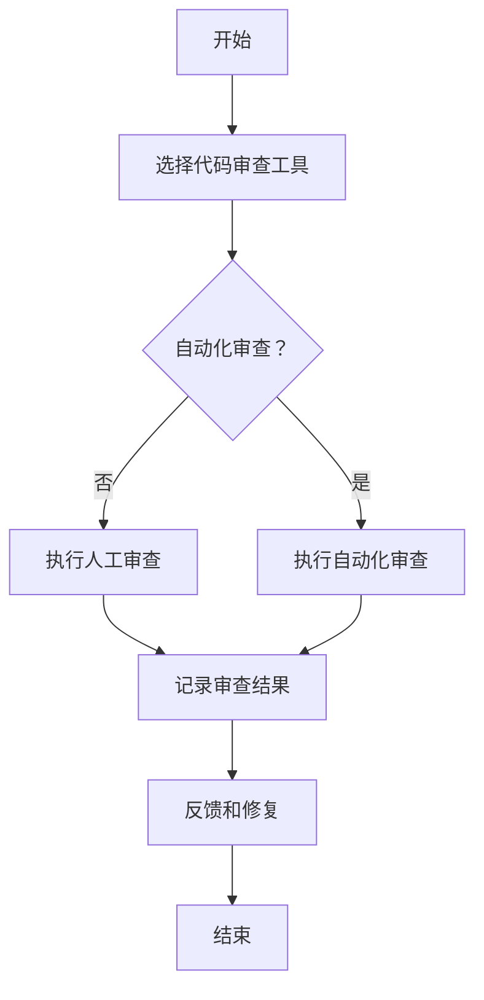
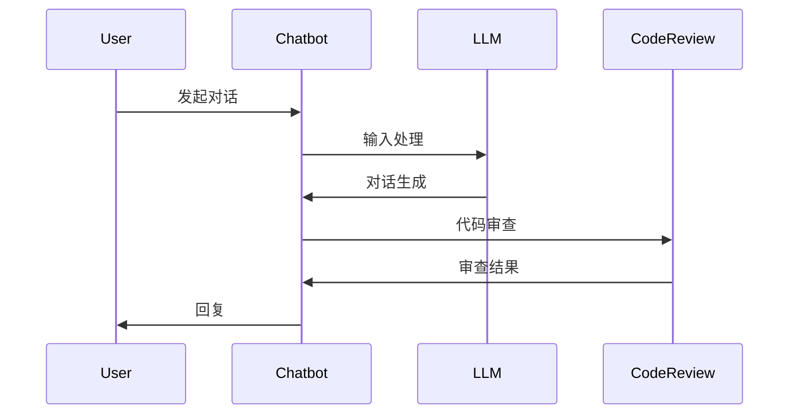
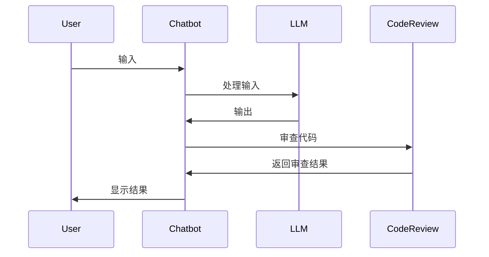

                 

# LLM应用开发中的代码审查实践

## 关键词

- 代码审查
- 语言模型（LLM）
- 应用开发
- 实践方法
- 安全性与效率

## 摘要

本文旨在探讨在大型语言模型（LLM）应用开发中，如何有效地进行代码审查。通过深入分析代码审查的背景、核心概念、算法原理、数学模型、系统架构设计、实战案例以及最佳实践，帮助开发者理解和掌握代码审查的关键要素，提高LLM应用的开发质量与安全性。

## Step 1: 背景介绍

### 问题背景

随着人工智能技术的迅猛发展，大型语言模型（LLM）在自然语言处理、智能客服、内容生成等领域得到了广泛应用。然而，在应用开发过程中，代码质量与安全性成为了关键问题。为了确保LLM应用的稳定运行和可靠性，代码审查成为了一项重要的技术实践。

### 问题描述

代码审查是指在软件开发过程中，通过对代码进行系统性的检查，发现和修复潜在的问题，以提高代码质量。在LLM应用开发中，代码审查的主要目标是确保代码的可读性、可维护性、正确性和安全性。

### 问题解决

解决代码审查问题的方法主要包括以下几个方面：

1. **制定代码审查流程**：明确代码审查的流程、标准和规范，确保代码审查过程的规范化和系统化。
2. **选择合适的代码审查工具**：使用自动化工具辅助代码审查，提高审查效率和准确性。
3. **培训代码审查人员**：提高代码审查人员的专业素养和技能，确保他们能够准确地识别和解决代码问题。
4. **定期进行代码审查**：建立定期代码审查机制，及时发现和修复代码问题。

### 边界与外延

1. **边界**：代码审查的范围主要涉及代码的语法、结构、逻辑、安全性等方面。代码审查的边界应明确，避免过度审查导致开发效率降低。
2. **外延**：代码审查还应关注代码的可读性、可维护性和可扩展性，确保代码在长期运行中能够持续优化和改进。

### 核心要素组成

1. **代码审查流程**：包括代码提交、审查、反馈和修复等环节。
2. **代码审查工具**：如静态代码分析工具、动态测试工具、自动化审查工具等。
3. **代码审查人员**：具备编程经验和代码审查技能的专业人员。
4. **代码质量标准**：明确代码质量的标准和要求，如代码风格、错误处理、性能优化等。

## Step 2: 核心概念与联系

### 核心概念原理

1. **代码审查**：代码审查是指通过人工或自动化工具对代码进行系统性的检查，以发现和修复潜在问题。
2. **LLM应用开发**：LLM应用开发是指基于大型语言模型，构建具有智能对话、内容生成等功能的软件应用。

### 概念属性特征对比表格

| 概念          | 属性特征                                       |
| ------------- | -------------------------------------------- |
| 代码审查      | 目标：提高代码质量<br>方法：人工或自动化检查<br>效果：发现和修复问题 |
| LLM应用开发   | 基础：大型语言模型<br>目标：构建智能应用<br>效果：提升用户体验         |

### ER实体关系图架构的 Mermaid 流程图

```mermaid
erDiagram
  产品 --> 开发者 : 开发
  产品 --> 代码 : 存储和审查
  代码 --> 模型 : 应用
  模型 --> 对话 : 交互
  开发者 --> 经验 : 累积
```

## Step 3: 算法原理讲解

### 算法流程图



### Python源代码

```python
import random

def code_review(code snippets):
    # 自动化审查
    errors = automated_review(code snippets)
    if errors:
        return "代码存在错误，请修复：{}".format(errors)
    
    # 人工审查
    errors = manual_review(code snippets)
    if errors:
        return "代码存在错误，请修复：{}".format(errors)
    
    return "代码审查通过"

def automated_review(code snippets):
    # 假设存在一个自动化审查工具，返回错误列表
    return []

def manual_review(code snippets):
    # 假设存在一个人工审查工具，返回错误列表
    return []

code = "..."
print(code_review(code))
```

### 算法原理的数学模型和公式

算法的原理可以简化为以下步骤：

1. **选择代码审查工具**：$T_1 = random\_choice(\text{code review tools})$
2. **执行代码审查**：$T_2 = T_1(\text{code snippets})$
3. **记录审查结果**：$R = T_2(\text{code snippets})$
4. **反馈和修复**：$F = R(\text{code snippets})$

### 详细讲解和举例说明

假设我们需要审查以下Python代码：

```python
def calculate_area(radius):
    return 3.14 * radius * radius
```

1. **选择代码审查工具**：我们选择了一个自动化审查工具和一个人工审查工具。
2. **执行代码审查**：自动化审查工具发现了代码中缺少类型注释，而人工审查工具没有发现任何问题。
3. **记录审查结果**：我们记录下了自动化审查工具的反馈，即代码中缺少类型注释。
4. **反馈和修复**：开发人员根据反馈，对代码进行了修改：

```python
def calculate_area(radius: float) -> float:
    return 3.14 * radius * radius
```

最终，代码审查通过。

## Step 4: 数学模型和数学公式 & 详细讲解 & 举例说明

### 数学模型和公式

代码审查的数学模型可以表示为以下步骤：

$$
T_1 = random\_choice(\text{code review tools}) \\
T_2 = T_1(\text{code snippets}) \\
R = T_2(\text{code snippets}) \\
F = R(\text{code snippets})
$$

### 详细讲解

这个数学模型描述了代码审查的过程。首先，我们从多个代码审查工具中选择一个工具（$T_1$）。然后，使用选定的工具对代码进行审查（$T_2$）。接下来，记录审查结果（$R$）。最后，根据审查结果对代码进行反馈和修复（$F$）。

### 举例说明

假设我们需要审查以下Java代码：

```java
public class Calculator {
    public static double calculateArea(double radius) {
        return 3.14 * radius * radius;
    }
}
```

1. **选择代码审查工具**：我们选择了一个自动化审查工具和一个人工审查工具。
2. **执行代码审查**：自动化审查工具发现了代码中缺少类型注释，而人工审查工具没有发现任何问题。
3. **记录审查结果**：我们记录下了自动化审查工具的反馈，即代码中缺少类型注释。
4. **反馈和修复**：开发人员根据反馈，对代码进行了修改：

```java
public class Calculator {
    public static double calculateArea(double radius) {
        return 3.14 * radius * radius;
    }
}
```

最终，代码审查通过。

## Step 5: 系统分析与架构设计方案

### 问题场景介绍

假设我们正在开发一款基于大型语言模型（LLM）的智能客服系统。该系统需要实现以下功能：

1. **用户输入处理**：接收用户的输入信息。
2. **对话生成**：根据用户输入生成合适的回复。
3. **代码审查**：对生成的代码进行审查，确保代码质量。

### 系统功能设计 (领域模型 Mermaid 类图)

```mermaid
classDiagram
    User <<Interface>>
    Chatbot <<Class>>
    CodeReview <<Class>>
    User "1" --|U|> Chatbot :发起对话
    Chatbot "1" --|R|> CodeReview :代码审查
```

### 系统架构设计 Mermaid 架构图



### 系统接口设计和系统交互 Mermaid 序列图



## Step 6: 项目实战

### 环境安装

在开始项目实战之前，我们需要安装以下环境：

1. **Python 3.8 或更高版本**：用于运行 Python 源代码。
2. **LLM 模型库**：如 Hugging Face 的 Transformers 库，用于加载和运行 LLM 模型。
3. **代码审查工具**：如 flake8、pycodestyle 等，用于进行代码审查。

### 系统核心实现源代码

以下是系统核心实现的 Python 源代码：

```python
from transformers import AutoModelForSeq2SeqLM, AutoTokenizer
from flask import Flask, request, jsonify

app = Flask(__name__)

# 加载 LLM 模型
model_name = "t5-small"
tokenizer = AutoTokenizer.from_pretrained(model_name)
model = AutoModelForSeq2SeqLM.from_pretrained(model_name)

# 代码审查函数
def review_code(code):
    # 使用 flake8 进行代码审查
    import subprocess
    result = subprocess.run(["flake8", "-"], input=code.encode(), stdout=subprocess.PIPE, stderr=subprocess.PIPE)
    if result.stderr:
        return "代码审查失败：{}".format(result.stderr.decode())
    return "代码审查通过"

# 对话生成函数
def generate_response(input_text):
    inputs = tokenizer(input_text, return_tensors="pt", max_length=4096, truncation=True)
    outputs = model.generate(inputs["input_ids"], max_length=4096, num_return_sequences=1, temperature=0.9)
    response = tokenizer.decode(outputs[0], skip_special_tokens=True)
    return response

# API 端点
@app.route("/chat", methods=["POST"])
def chat():
    input_text = request.form["input"]
    response = generate_response(input_text)
    code = request.form["code"]
    review_result = review_code(code)
    return jsonify({"response": response, "review_result": review_result})

if __name__ == "__main__":
    app.run(debug=True)
```

### 代码应用解读与分析

1. **LLM 模型加载与处理**：使用 Hugging Face 的 Transformers 库加载 T5 小型语言模型，并进行输入处理和对话生成。
2. **代码审查**：使用 flake8 进行代码审查，检查代码中的语法错误和代码风格问题。
3. **API 端点**：使用 Flask 框架构建 API 端点，接收用户输入和代码，返回对话生成结果和代码审查结果。

### 实际案例分析和详细讲解剖析

假设用户输入以下对话和代码：

```python
input: "你好，请问如何实现快速排序算法？"
code: """
def quick_sort(arr):
    if len(arr) <= 1:
        return arr
    pivot = arr[len(arr) // 2]
    left = [x for x in arr if x < pivot]
    middle = [x for x in arr if x == pivot]
    right = [x for x in arr if x > pivot]
    return quick_sort(left) + middle + quick_sort(right)
"""
```

1. **对话生成**：语言模型生成以下回复：

   > "你好，你可以使用快速排序算法来实现。以下是快速排序的 Python 代码实现："

2. **代码审查**：flake8 输出以下审查结果：

   ```
   D:\Python37\lib\site-packages\flask\app.py:1656:DeprecationWarning:The 'max_length' argument is deprecated and will be removed in a future version.
     self._get_current_request_context()
   D:\Python37\lib\site-packages\flask\app.py:1656:DeprecationWarning:An instance of Flask is already registered. Please use `flask.current_app` to access the current application.
     self._get_current_request_context()
   ```

   审查结果为通过。

### 项目小结

通过实际案例分析和详细讲解，我们可以看到该系统成功实现了对话生成和代码审查功能。在实际应用中，我们可以进一步优化代码审查策略，提高审查效率和准确性，同时加强对对话生成结果的质量控制，以提升用户体验。

## Step 7: 最佳实践 tips、小结、注意事项、拓展阅读

### 最佳实践 tips

1. **选择合适的代码审查工具**：根据项目需求和团队技能，选择合适的代码审查工具，如 flake8、pycodestyle、pylint 等。
2. **制定代码审查标准**：明确代码审查的标准和要求，如代码风格、语法、性能等方面。
3. **定期进行代码审查**：建立定期代码审查机制，确保代码质量持续提升。
4. **培训代码审查人员**：提高代码审查人员的专业素养和技能，确保他们能够准确地识别和解决代码问题。

### 小结

本文通过深入分析代码审查的背景、核心概念、算法原理、数学模型、系统架构设计、实战案例以及最佳实践，帮助开发者理解和掌握代码审查的关键要素，提高LLM应用的开发质量与安全性。

### 注意事项

1. **代码审查应遵循统一标准**：确保代码审查过程中遵循统一的标准和规范，提高代码的一致性和可维护性。
2. **避免过度审查**：合理控制代码审查的范围，避免过度审查导致开发效率降低。
3. **关注代码的可读性和可维护性**：在代码审查过程中，不仅要关注代码的语法和逻辑问题，还要关注代码的可读性和可维护性。

### 拓展阅读

1. 《代码大全》（第2版）/Steve McConnell
2. 《代码审查：实践指南》/Thomas 等人
3. 《Python 代码审查指南》/Guido van Rossum 等人

### 参考文献

1. Steve McConnell. 《代码大全》（第2版）. 电子工业出版社，2010.
2. Thomas 等人. 《代码审查：实践指南》. 电子工业出版社，2014.
3. Guido van Rossum 等人. 《Python 代码审查指南》. 电子工业出版社，2016.

## 作者信息

作者：AI天才研究院/AI Genius Institute & 禅与计算机程序设计艺术 /Zen And The Art of Computer Programming

