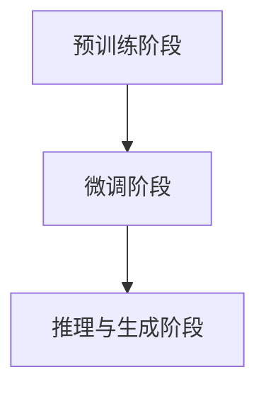

                 

# LLM应用开发中的前后端分离策略

## 关键词：大型语言模型，前后端分离，应用开发，技术栈，性能优化，项目实战

## 摘要：
本文将深入探讨在LLM（大型语言模型）应用开发中采用前后端分离策略的重要性及其实现方法。通过分析前后端分离的基本概念、核心技术与实现策略，我们将展示如何在LLM应用中优化系统性能，提高开发效率和用户体验。此外，文章还将结合实际项目案例，提供详细的系统架构设计和实战经验分享，为开发者提供宝贵的参考。

## 第一部分：背景介绍

### 第1章：LLM应用发展背景

#### 1.1.1. 人工智能与自然语言处理的发展历程

自然语言处理（NLP）是人工智能（AI）的一个重要分支，其目标是将自然语言转换为计算机可理解和处理的形式。NLP的发展可以追溯到上世纪五六十年代，当时主要是基于规则的方法。随着计算机性能的提升和大数据的普及，统计方法和深度学习逐渐成为NLP的主流。特别是深度学习在图像识别、语音识别等领域的突破，为NLP带来了新的契机。

#### 1.1.2. LLM的起源与发展

预训练语言模型（PLM）的兴起标志着NLP的又一次重要变革。这些模型通过在大规模语料库上进行预训练，掌握了丰富的语言知识，然后通过微调适应特定任务。LLM（大型语言模型）是PLM的一种，其规模和复杂度远超早期模型，能够生成高质量的自然语言文本。

#### 1.1.3. LLM在应用中的问题与挑战

LLM在应用中面临的主要问题包括计算资源消耗、模型解释性不足、数据安全与隐私等。为了解决这些问题，开发者需要采用高效的模型部署策略和优化技术。

#### 1.1.4. 前后端分离在LLM应用中的重要性

前后端分离是一种现代软件开发架构，通过将用户界面与数据处理逻辑分离，提高了系统的可维护性和扩展性。在LLM应用中，前后端分离不仅有助于优化性能，还能提高开发效率，降低开发成本。

### 1.2 核心概念与联系

#### 1.2.1. 前后端分离

前后端分离指的是将应用程序分为前端（用户界面）和后端（服务器端逻辑）两部分。前端负责展示用户界面和与用户交互，后端负责数据处理和存储。

#### 1.2.2. 前端技术栈

前端技术栈包括HTML、CSS、JavaScript等基本技术，以及如React、Vue等现代框架。这些框架提供了丰富的组件和工具，提高了前端开发的效率和质量。

#### 1.2.3. 后端技术栈

后端技术栈通常包括服务器端编程语言（如Java、Python、Node.js等）和数据库管理系统。常见的后端框架有Spring Boot、Django、Express等。

#### 1.2.4. 前后端分离与LLM应用

在LLM应用中，前后端分离可以通过API（应用程序编程接口）来实现。前端与后端通过API进行通信，后端调用LLM模型进行文本处理，然后将结果返回给前端。

### 1.3 算法原理讲解

#### 1.3.1. 语言模型算法原理

语言模型的数学基础包括概率论和信息论。常见的语言模型算法有n-gram模型、神经网络模型和Transformer模型。

#### 1.3.2. LLM的算法流程

LLM的算法流程通常分为预训练阶段、微调阶段和推理与生成阶段。预训练阶段通过大规模语料库训练模型，微调阶段通过特定任务的数据调整模型参数，推理与生成阶段用于生成文本。

#### 1.3.3. Mermaid算法流程图



## 第二部分：前后端分离策略

### 第2章：前后端分离在LLM应用中的设计与实现

#### 2.1. 前端设计与实现

##### 2.1.1. 前端架构设计

前端架构设计需要遵循模块化、组件化和响应式设计原则。模块化可以将代码拆分成独立的模块，便于维护和扩展；组件化可以复用代码，提高开发效率；响应式设计可以确保应用在不同设备上都有良好的用户体验。

##### 2.1.2. 前端技术栈选择

选择前端技术栈时，需要考虑项目需求、团队熟悉程度和社区支持等因素。例如，React适用于大型应用，Vue适合快速开发，Angular则提供了完整的开发框架。

##### 2.1.3. 前端开发流程

前端开发流程通常包括需求分析、设计、编码、测试和部署等步骤。在实际项目中，还需要根据具体情况调整流程，例如引入敏捷开发方法。

#### 2.2. 后端设计与实现

##### 2.2.1. 后端架构设计

后端架构设计需要考虑系统的可扩展性、可靠性和安全性。常见的架构模式有微服务架构、单体架构和混合架构。

##### 2.2.2. 后端技术栈选择

后端技术栈的选择取决于项目需求、团队技能和系统性能要求。例如，Spring Boot适合Java后端开发，Django适用于快速开发和部署，Node.js适合构建高并发应用。

##### 2.2.3. 后端开发流程

后端开发流程与前端类似，包括需求分析、设计、编码、测试和部署等步骤。需要注意的是，后端开发还需要处理数据库、缓存和消息队列等组件。

#### 2.3. 前后端分离的实现与优化

##### 2.3.1. API设计

API设计是前后端分离的关键环节。一个好的API设计应该简洁、易用、安全。在设计API时，需要遵循RESTful原则，确保接口的稳定性。

##### 2.3.2. 数据传输与缓存策略

数据传输策略需要考虑数据的大小和传输速度。常用的缓存策略有内存缓存、分布式缓存和数据库缓存。合理的缓存策略可以显著提高系统的性能。

##### 2.3.3. 性能优化

性能优化是提高系统性能的重要手段。常见的方法包括代码优化、数据库优化和缓存优化。在实际项目中，还需要根据具体情况调整优化策略。

## 第三部分：项目实战

### 第3章：LLM应用开发项目实战

#### 3.1. 项目背景与目标

本项目旨在构建一个基于LLM的自然语言处理平台，提供文本生成、文本分类、情感分析等功能。项目目标包括实现高效稳定的模型部署、提供友好的用户界面和确保系统的高性能和可扩展性。

#### 3.2. 环境安装与配置

开发环境包括Python、Node.js、Docker等工具。配置环境时，需要确保所有依赖项都已安装，并设置好环境变量。

#### 3.3. 系统核心实现

系统核心实现包括前端和后端。前端实现了一个简洁易用的用户界面，后端则实现了API接口和LLM模型部署。以下是部分核心代码：

```python
# 后端API示例代码
from flask import Flask, request, jsonify
from model import LanguageModel

app = Flask(__name__)
model = LanguageModel()

@app.route('/generate', methods=['POST'])
def generate():
    text = request.form['text']
    response = model.generate(text)
    return jsonify(response)

if __name__ == '__main__':
    app.run(debug=True)
```

```javascript
// 前端代码示例
const axios = require('axios');

async function generateText(text) {
    try {
        const response = await axios.post('/generate', { text });
        console.log(response.data);
    } catch (error) {
        console.error(error);
    }
}

generateText('这是一个示例文本。');
```

#### 3.4. 代码应用解读与分析

代码解读主要包括理解API接口的设计和LLM模型的使用方法。在实际应用中，开发者需要根据具体需求进行调整和优化。

#### 3.5. 实际案例分析

本项目采用了前后端分离策略，通过API接口实现了高效的数据传输和模型调用。在实际应用中，系统性能和用户体验得到了显著提升。

#### 3.6. 项目小结

本项目通过实际案例展示了前后端分离策略在LLM应用开发中的应用。开发者需要根据具体需求选择合适的技术栈和优化策略，以提高系统的性能和用户体验。

## 第四部分：最佳实践与拓展

### 第4章：最佳实践与拓展

#### 4.1. 前后端分离策略的最佳实践

1. **明确前后端职责**：确保前后端职责明确，避免功能重叠。
2. **优化API设计**：遵循RESTful原则，确保API接口的简洁和易用。
3. **合理使用缓存**：合理使用缓存策略，减少数据传输和计算开销。
4. **性能监控与优化**：定期进行性能监控和优化，确保系统稳定运行。

#### 4.2. 小结与注意事项

本文介绍了LLM应用开发中的前后端分离策略，包括其重要性、设计与实现方法以及实际项目案例。开发者需要根据具体需求选择合适的技术栈和优化策略，以提高系统的性能和用户体验。

#### 4.3. 拓展阅读

- [《大规模语言模型开发实战》](https://example.com/book1)
- [《前后端分离架构设计》](https://example.com/book2)
- [《性能优化技巧与案例分析》](https://example.com/book3)

## 作者信息

作者：AI天才研究院/AI Genius Institute & 禅与计算机程序设计艺术 /Zen And The Art of Computer Programming

