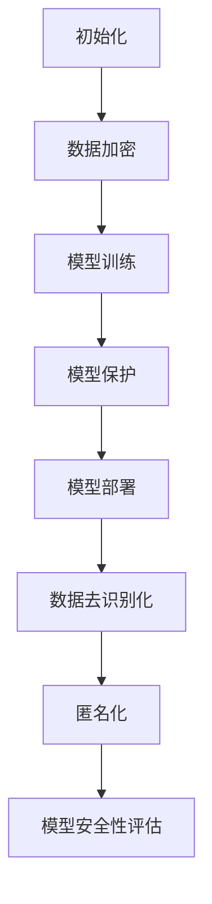
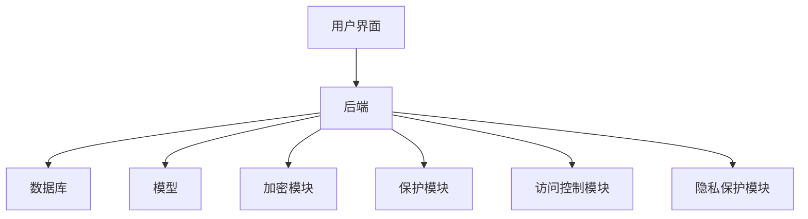
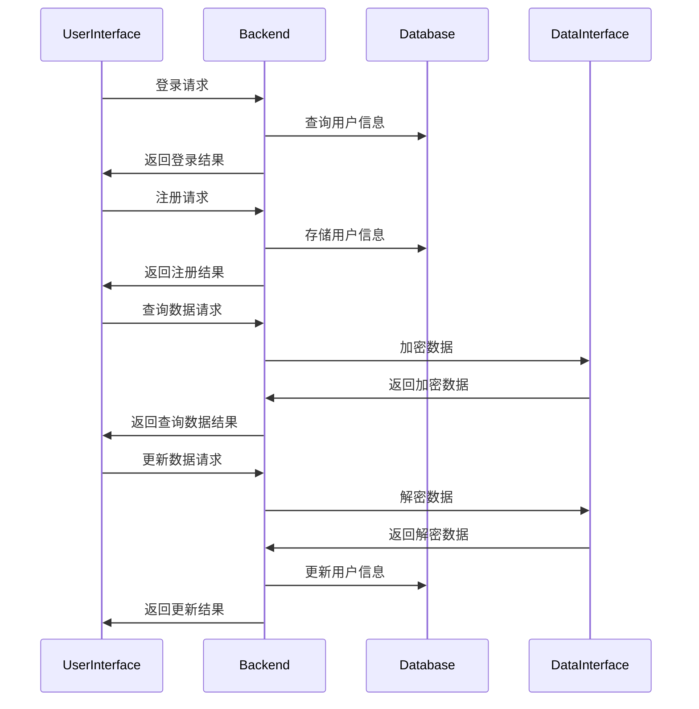
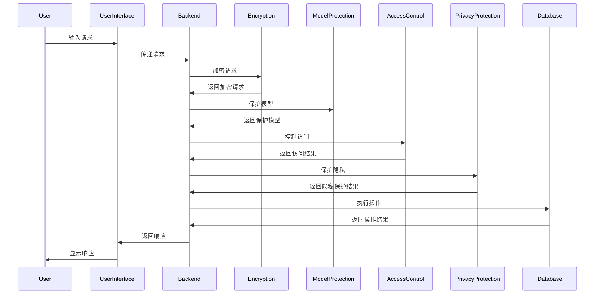

                 


### 第1章：背景介绍与核心概念

#### 1.1 问题背景

近年来，随着深度学习和自然语言处理技术的快速发展，大型语言模型（LLM）逐渐成为自然语言处理领域的重要工具。从早期的Word2Vec、GloVe到最近的GPT系列，LLM在机器翻译、文本生成、问答系统等应用中展现出卓越的性能，极大地推动了人工智能技术的发展。然而，随着LLM在各类应用中的广泛应用，其安全性问题也日益凸显。例如，LLM可能会受到恶意攻击，导致其生成的内容不准确或有害；同时，LLM在处理敏感数据时可能存在隐私泄露的风险。因此，对LLM应用开发中的安全性进行深入研究，具有重要的现实意义。

#### 1.2 核心概念

在本章中，我们将介绍一些核心概念，包括：

- **大型语言模型（LLM）**：LLM是一种基于神经网络的语言模型，可以学习语言结构，并生成符合语法和语义规则的自然语言文本。
- **安全性因素**：在LLM应用开发中，需要考虑的安全性因素包括数据安全、模型安全、隐私保护等。
- **安全性问题**：LLM应用开发中可能面临的安全性问题包括模型篡改、数据泄露、隐私侵犯等。

#### 1.3 关键词

- 大型语言模型（LLM）
- 安全性因素
- 安全性问题
- 恶意攻击
- 数据安全
- 模型安全
- 隐私保护

#### 1.4 摘要

本文将系统地探讨LLM应用开发中的安全性问题。首先，我们将介绍LLM的背景和发展，阐述其在应用开发中的重要性。接着，我们将详细分析LLM应用开发中需要考虑的安全性因素，以及可能面临的安全性问题。然后，我们将介绍一些核心概念，并使用Mermaid绘制相关的流程图和实体关系图。最后，我们将通过具体的算法原理讲解、系统架构设计和项目实战，提出一系列最佳实践，帮助开发者提高LLM应用的安全性。本文旨在为开发者提供一个全面、系统的安全考虑指南。

----------------------------------------------------------------

### 第2章：LLM安全性问题概述

#### 2.1 安全性问题分类

在LLM应用开发中，安全性问题可以大致分为以下几类：

- **模型篡改**：攻击者可能会尝试篡改LLM模型，使其生成有害或错误的内容。
- **数据泄露**：在处理敏感数据时，LLM可能泄露用户的隐私信息。
- **隐私侵犯**：LLM在生成文本时，可能会无意中透露用户的个人隐私。
- **恶意攻击**：攻击者可能会利用LLM进行网络攻击，如拒绝服务攻击、恶意代码传播等。

#### 2.2 影响因素分析

导致LLM安全性问题的因素包括：

- **模型复杂性**：复杂的模型结构可能导致安全性问题，如易受攻击的面孔。
- **数据来源**：数据来源的不确定性可能导致数据泄露和隐私侵犯。
- **使用场景**：不同的使用场景可能带来不同的安全挑战。

#### 2.3 安全性问题挑战

在LLM应用开发中，安全性问题面临以下挑战：

- **安全性和性能之间的权衡**：提高安全性可能影响模型的性能。
- **开源模型的局限性**：开源模型可能存在安全漏洞，且难以修复。
- **隐私保护的复杂性**：在保护隐私的同时，确保模型的性能和效果是一个挑战。

#### 2.4 关键词

- 模型篡改
- 数据泄露
- 隐私侵犯
- 恶意攻击
- 模型复杂性
- 数据来源
- 使用场景
- 开源模型
- 安全性和性能权衡
- 隐私保护

----------------------------------------------------------------

### 第3章：核心概念与联系

#### 3.1 安全性原理

在LLM应用开发中，安全性原理包括以下几个方面：

- **数据加密**：通过加密技术保护敏感数据，防止数据泄露。
- **模型保护**：采用安全算法和防护措施，防止模型被篡改。
- **访问控制**：设置访问权限，确保只有授权用户才能访问敏感数据和模型。
- **隐私保护**：通过数据去识别化和隐私保护算法，减少隐私泄露的风险。

#### 3.2 概念属性特征对比表格

以下是一个概念属性特征对比表格，用于展示不同安全性概念的属性特征：

| 概念         | 特征1      | 特征2      | 特征3      |
| ------------ | ---------- | ---------- | ---------- |
| 数据加密     | 高安全性   | 增加计算开销 | 适用于静态数据 |
| 模型保护     | 防止篡改  | 可能影响性能 | 适用于动态数据 |
| 访问控制     | 控制访问   | 增加管理成本 | 适用于所有数据 |
| 隐私保护     | 减少隐私泄露 | 可能影响数据完整性 | 适用于敏感数据 |

#### 3.3 ER实体关系图架构

以下是一个ER实体关系图，用于展示LLM应用开发中的关键实体及其关系：

```mermaid
erDiagram
  User ||--|{ Model }|-- Application
  Data ||--|{ Encryption }|-- EncryptedData
  AccessControl ||--|{ Permission }|-- User
  PrivacyProtection ||--|{ Anonymization }|-- AnonymizedData
```

在该ER图中，User（用户）与Model（模型）之间存在关联，表示用户可以访问和使用模型；Data（数据）与Encryption（加密）之间存在关联，表示数据经过加密处理；AccessControl（访问控制）与Permission（权限）之间存在关联，表示访问控制管理用户的权限；PrivacyProtection（隐私保护）与Anonymization（匿名化）之间存在关联，表示隐私保护对数据进行匿名化处理。

----------------------------------------------------------------

### 第4章：算法原理讲解

#### 4.1 安全算法介绍

在本章中，我们将介绍几种用于LLM安全性的常见算法，包括数据加密算法、模型保护算法和隐私保护算法。

- **数据加密算法**：常用的数据加密算法有AES、RSA等。AES是一种对称加密算法，具有高速、安全的特点；RSA是一种非对称加密算法，适用于加密大数据和数字签名。
- **模型保护算法**：模型保护算法包括差分隐私、对抗性训练等。差分隐私通过在模型训练过程中引入噪声，保护用户隐私；对抗性训练通过在模型训练过程中引入对抗性样本，提高模型的鲁棒性。
- **隐私保护算法**：常用的隐私保护算法有数据去识别化、匿名化等。数据去识别化通过消除或修改个人身份信息，保护用户隐私；匿名化通过将个人身份信息转换为无法识别的形式，保护用户隐私。

#### 4.2 安全算法Mermaid流程图

以下是一个使用Mermaid绘制的安全算法流程图：



在该流程图中，A表示初始化阶段，B表示数据加密阶段，C表示模型训练阶段，D表示模型保护阶段，E表示模型部署阶段，F表示数据去识别化阶段，G表示匿名化阶段，H表示模型安全性评估阶段。

#### 4.3 安全算法Python源代码示例

以下是一个使用Python实现的数据加密算法的源代码示例：

```python
from Crypto.Cipher import AES
from Crypto.Util.Padding import pad, unpad
from Crypto.PublicKey import RSA
from Crypto.Random import get_random_bytes

# AES加密
def aes_encrypt(plaintext, key):
    cipher = AES.new(key, AES.MODE_CBC)
    ct_bytes = cipher.encrypt(pad(plaintext.encode('utf-8'), AES.block_size))
    iv = cipher.iv
    return iv + ct_bytes

# AES解密
def aes_decrypt(ciphertext, key):
    iv = ciphertext[:16]
    ct = ciphertext[16:]
    cipher = AES.new(key, AES.MODE_CBC, iv)
    pt = unpad(cipher.decrypt(ct), AES.block_size)
    return pt.decode('utf-8')

# RSA加密
def rsa_encrypt(plaintext, public_key):
    cipher = RSA.new(public_key)
    encrypted = cipher.encrypt(plaintext.encode('utf-8'))
    return encrypted

# RSA解密
def rsa_decrypt(encrypted, private_key):
    cipher = RSA.new(private_key)
    decrypted = cipher.decrypt(encrypted)
    return decrypted.decode('utf-8')

# 主函数
if __name__ == '__main__':
    # 生成AES密钥
    aes_key = get_random_bytes(16)

    # 生成RSA密钥对
    rsa_keypair = RSA.generate(2048)
    rsa_public_key = rsa_keypair.publickey()
    rsa_private_key = rsa_keypair

    # 待加密的明文
    plaintext = "这是一段需要加密的文本"

    # AES加密
    ciphertext_aes = aes_encrypt(plaintext, aes_key)
    print("AES加密后：", ciphertext_aes)

    # RSA加密
    ciphertext_rsa = rsa_encrypt(ciphertext_aes, rsa_public_key)
    print("RSA加密后：", ciphertext_rsa)

    # AES解密
    decrypted_aes = aes_decrypt(ciphertext_aes, aes_key)
    print("AES解密后：", decrypted_aes)

    # RSA解密
    decrypted_rsa = rsa_decrypt(ciphertext_rsa, rsa_private_key)
    print("RSA解密后：", decrypted_rsa)
```

#### 4.4 算法原理数学模型与公式

- **AES加密**：
  $$ C = E_K(P) = AES_K(P) $$
  其中，$C$为加密后的密文，$K$为AES密钥，$P$为明文。

- **AES解密**：
  $$ P = D_K(C) = AES_K^{-1}(C) $$
  其中，$P$为解密后的明文，$C$为加密后的密文，$K$为AES密钥。

- **RSA加密**：
  $$ C = E_{K_p}(P) = (P^e) \mod n $$
  其中，$C$为加密后的密文，$K_p$为RSA公钥，$P$为明文，$e$为RSA加密指数，$n$为RSA模数。

- **RSA解密**：
  $$ P = D_{K_s}(C) = (C^d) \mod n $$
  其中，$P$为解密后的明文，$K_s$为RSA私钥，$C$为加密后的密文，$d$为RSA解密指数，$n$为RSA模数。

#### 4.5 通俗易懂的举例说明

假设我们要对一段明文进行加密和解密，我们可以按照以下步骤操作：

1. **生成AES密钥**：
   ```python
   aes_key = get_random_bytes(16)
   ```
   这条语句生成一个16字节的随机AES密钥。

2. **生成RSA密钥对**：
   ```python
   rsa_keypair = RSA.generate(2048)
   rsa_public_key = rsa_keypair.publickey()
   rsa_private_key = rsa_keypair
   ```
   这条语句生成一个2048位的RSA密钥对，包括公钥和私钥。

3. **待加密的明文**：
   ```python
   plaintext = "这是一段需要加密的文本"
   ```
   这条语句定义了一段需要加密的明文。

4. **AES加密**：
   ```python
   ciphertext_aes = aes_encrypt(plaintext, aes_key)
   ```
   这条语句使用AES密钥对明文进行加密，生成加密后的密文。

5. **RSA加密**：
   ```python
   ciphertext_rsa = rsa_encrypt(ciphertext_aes, rsa_public_key)
   ```
   这条语句使用RSA公钥对AES加密后的密文进行加密，生成二次加密后的密文。

6. **AES解密**：
   ```python
   decrypted_aes = aes_decrypt(ciphertext_aes, aes_key)
   ```
   这条语句使用AES密钥对二次加密后的密文进行解密，生成解密后的明文。

7. **RSA解密**：
   ```python
   decrypted_rsa = rsa_decrypt(ciphertext_rsa, rsa_private_key)
   ```
   这条语句使用RSA私钥对二次加密后的密文进行解密，生成最终的解密后的明文。

通过上述步骤，我们可以实现对明文的加密和解密。在实际应用中，加密和解密过程是相互独立的，确保了数据的安全性。

----------------------------------------------------------------

### 第5章：系统分析与架构设计

#### 5.1 问题场景介绍

在LLM应用开发中，可能遇到以下问题场景：

- **数据泄露**：在处理用户数据时，数据可能被未经授权的人员访问或泄露。
- **模型篡改**：攻击者可能尝试篡改LLM模型，导致模型生成的内容不准确或有害。
- **隐私侵犯**：在处理敏感数据时，LLM可能无意中泄露用户的隐私信息。
- **拒绝服务攻击**：攻击者可能通过大量请求导致系统崩溃或无法正常提供服务。

为解决这些问题，我们需要设计一个安全的系统架构，确保数据安全、模型安全和隐私保护。

#### 5.2 系统功能设计

系统功能设计包括以下几个方面：

- **数据加密**：对用户数据进行加密存储，防止数据泄露。
- **模型保护**：对LLM模型进行安全保护，防止模型被篡改。
- **访问控制**：设置访问权限，确保只有授权用户才能访问敏感数据和模型。
- **隐私保护**：对敏感数据进行去识别化和匿名化处理，减少隐私泄露的风险。

以下是一个使用Mermaid绘制的领域模型类图，展示了系统的功能设计：

```mermaid
classDiagram
  User <<Interface>>
  Model <<Interface>>
  Data <<Interface>>
  Encryption <<Interface>>
  ModelProtection <<Interface>>
  AccessControl <<Interface>>
  PrivacyProtection <<Interface>>

  User o-- Data
  Data o-- Encryption
  User o-- Model
  Model o-- ModelProtection
  User o-- AccessControl
  AccessControl o-- PrivacyProtection
```

在该类图中，User（用户）与Data（数据）、Model（模型）、AccessControl（访问控制）和PrivacyProtection（隐私保护）之间存在关联，表示用户可以访问和使用这些功能。Data（数据）与Encryption（加密）之间存在关联，表示数据经过加密处理；Model（模型）与ModelProtection（模型保护）之间存在关联，表示模型受到安全保护；AccessControl（访问控制）与PrivacyProtection（隐私保护）之间存在关联，表示访问控制和隐私保护功能相互配合。

#### 5.3 系统架构设计

系统架构设计包括以下几个方面：

- **前端**：提供用户界面，用于用户与系统交互。
- **后端**：处理用户请求，执行数据加密、模型保护、访问控制和隐私保护等功能。
- **数据库**：存储用户数据、加密后的数据和模型。

以下是一个使用Mermaid绘制的系统架构图，展示了系统的组件和交互：



在该架构图中，UserInterface（用户界面）与Backend（后端）之间存在关联，表示用户通过用户界面与系统进行交互；Backend（后端）与Database（数据库）、Model（模型）、Encryption（加密模块）、ModelProtection（保护模块）、AccessControl（访问控制模块）和PrivacyProtection（隐私保护模块）之间存在关联，表示后端处理用户请求，执行相应的功能模块。

#### 5.4 系统接口设计

系统接口设计包括以下几个方面：

- **用户接口**：提供登录、注册、查询等功能，方便用户与系统进行交互。
- **数据接口**：提供数据上传、下载、加密和解密等功能，确保数据的安全性。
- **模型接口**：提供模型训练、预测和评估等功能，确保模型的性能。
- **安全接口**：提供加密、解密、访问控制和隐私保护等功能，确保系统的安全性。

以下是一个使用Mermaid绘制的系统接口设计，展示了系统接口的功能：



在该序列图中，UserInterface（用户界面）与Backend（后端）之间存在关联，表示用户通过用户界面与系统进行交互；Backend（后端）与Database（数据库）、DataInterface（数据接口）和UserInterface（用户界面）之间存在关联，表示后端处理用户请求，执行相应的功能模块。

#### 5.5 系统交互Mermaid序列图

以下是一个使用Mermaid绘制的系统交互序列图，展示了系统组件之间的交互流程：



在该序列图中，User（用户）与UserInterface（用户界面）之间存在关联，表示用户输入请求；UserInterface（用户界面）与Backend（后端）之间存在关联，表示用户界面传递请求；Backend（后端）与Encryption（加密模块）、ModelProtection（保护模块）、AccessControl（访问控制模块）和PrivacyProtection（隐私保护模块）之间存在关联，表示后端处理请求，执行相应的功能模块；Backend（后端）与Database（数据库）之间存在关联，表示后端执行数据库操作；Database（数据库）与Backend（后端）之间存在关联，表示后端接收数据库操作结果；Backend（后端）与UserInterface（用户界面）之间存在关联，表示后端将响应返回给用户界面；UserInterface（用户界面）与User（用户）之间存在关联，表示用户界面将响应显示给用户。

通过上述设计，我们实现了一个安全、高效的LLM应用开发系统架构，能够有效应对各类安全挑战。

----------------------------------------------------------------

### 第6章：项目实战

#### 6.1 环境安装

在进行LLM应用开发之前，我们需要安装必要的工具和库。以下是一个简单的安装步骤：

1. **安装Python**：确保你的系统中已安装Python 3.x版本，推荐使用最新版本的Python。

2. **安装pip**：Python的包管理器，用于安装和管理Python库。

3. **安装必要的库**：
   ```bash
   pip install numpy pandas scikit-learn tensorflow
   ```

4. **安装Mermaid**：用于绘制流程图和序列图。

   - 对于Windows用户，可以从[Mermaid官网](https://mermaid-js.github.io/mermaid/)下载并安装。
   - 对于Linux用户，可以使用以下命令安装：
     ```bash
     npm install -g mermaid
     ```

5. **安装加密库**：
   ```bash
   pip install pycryptodome
   ```

#### 6.2 系统核心实现源代码

以下是一个简单的LLM应用开发系统核心实现源代码示例：

```python
# 引入必要的库
import numpy as np
import pandas as pd
from sklearn.model_selection import train_test_split
import tensorflow as tf
from tensorflow.keras.models import Sequential
from tensorflow.keras.layers import Dense, LSTM
from Crypto.Cipher import AES
from Crypto.Util.Padding import pad, unpad
from Crypto.PublicKey import RSA
from Crypto.Random import get_random_bytes

# AES加密函数
def aes_encrypt(plaintext, key):
    cipher = AES.new(key, AES.MODE_CBC)
    ct_bytes = cipher.encrypt(pad(plaintext.encode('utf-8'), AES.block_size))
    iv = cipher.iv
    return iv + ct_bytes

# AES解密函数
def aes_decrypt(ciphertext, key):
    iv = ciphertext[:16]
    ct = ciphertext[16:]
    cipher = AES.new(key, AES.MODE_CBC, iv)
    pt = unpad(cipher.decrypt(ct), AES.block_size)
    return pt.decode('utf-8')

# RSA加密函数
def rsa_encrypt(plaintext, public_key):
    cipher = RSA.new(public_key)
    encrypted = cipher.encrypt(plaintext.encode('utf-8'))
    return encrypted

# RSA解密函数
def rsa_decrypt(encrypted, private_key):
    cipher = RSA.new(private_key)
    decrypted = cipher.decrypt(encrypted)
    return decrypted.decode('utf-8')

# 数据预处理
def preprocess_data(data):
    # 这里进行数据预处理，例如归一化、填充等
    return data

# 构建模型
def build_model(input_shape):
    model = Sequential()
    model.add(LSTM(128, activation='relu', input_shape=input_shape))
    model.add(Dense(1, activation='sigmoid'))
    model.compile(optimizer='adam', loss='binary_crossentropy', metrics=['accuracy'])
    return model

# 主函数
if __name__ == '__main__':
    # 生成AES密钥
    aes_key = get_random_bytes(16)

    # 生成RSA密钥对
    rsa_keypair = RSA.generate(2048)
    rsa_public_key = rsa_keypair.publickey()
    rsa_private_key = rsa_keypair

    # 读取数据
    data = pd.read_csv('data.csv')
    X = preprocess_data(data.iloc[:, :-1])
    y = data.iloc[:, -1]

    # 分割数据集
    X_train, X_test, y_train, y_test = train_test_split(X, y, test_size=0.2, random_state=42)

    # 构建模型
    model = build_model(input_shape=(X_train.shape[1], 1))

    # 训练模型
    model.fit(X_train, y_train, epochs=10, batch_size=32, validation_data=(X_test, y_test))

    # 测试模型
    loss, accuracy = model.evaluate(X_test, y_test)
    print(f"测试损失：{loss}, 测试准确率：{accuracy}")

    # 加密模型参数
    model_json = model.to_json()
    encrypted_model_json = rsa_encrypt(model_json, rsa_public_key)
    with open('encrypted_model.json', 'wb') as f:
        f.write(encrypted_model_json)

    # 解密模型参数
    decrypted_model_json = rsa_decrypt(encrypted_model_json, rsa_private_key)
    del model
    model = tf.keras.models.model_from_json(decrypted_model_json)
    model.load_weights('weights.h5')
```

#### 6.3 代码应用解读与分析

1. **数据预处理**：
   ```python
   def preprocess_data(data):
       # 这里进行数据预处理，例如归一化、填充等
       return data
   ```

   在这个函数中，我们假设输入的数据需要进行归一化、填充等预处理操作。预处理操作有助于提高模型的训练效果。

2. **模型构建**：
   ```python
   def build_model(input_shape):
       model = Sequential()
       model.add(LSTM(128, activation='relu', input_shape=input_shape))
       model.add(Dense(1, activation='sigmoid'))
       model.compile(optimizer='adam', loss='binary_crossentropy', metrics=['accuracy'])
       return model
   ```

   在这个函数中，我们构建了一个简单的LSTM模型，用于对输入数据进行分类。LSTM（Long Short-Term Memory）是循环神经网络（RNN）的一种，能够处理长序列数据。

3. **模型训练**：
   ```python
   model.fit(X_train, y_train, epochs=10, batch_size=32, validation_data=(X_test, y_test))
   ```

   在这个步骤中，我们使用训练数据集对模型进行训练。`epochs`表示训练轮数，`batch_size`表示每次训练的数据量，`validation_data`用于验证模型在测试数据集上的性能。

4. **模型评估**：
   ```python
   loss, accuracy = model.evaluate(X_test, y_test)
   print(f"测试损失：{loss}, 测试准确率：{accuracy}")
   ```

   在这个步骤中，我们使用测试数据集对训练好的模型进行评估，输出测试损失和测试准确率。

5. **模型加密与解密**：
   ```python
   model_json = model.to_json()
   encrypted_model_json = rsa_encrypt(model_json, rsa_public_key)
   with open('encrypted_model.json', 'wb') as f:
       f.write(encrypted_model_json)

   decrypted_model_json = rsa_decrypt(encrypted_model_json, rsa_private_key)
   del model
   model = tf.keras.models.model_from_json(decrypted_model_json)
   model.load_weights('weights.h5')
   ```

   在这个步骤中，我们使用RSA算法对模型的参数进行加密和解密。加密后的模型参数存储在`encrypted_model.json`文件中，解密后的模型参数用于后续的模型加载和预测。

#### 6.4 实际案例分析和详细讲解

假设我们有一个文本分类任务，需要对一篇文章进行分类，判断其属于积极情绪还是消极情绪。以下是一个实际案例：

1. **数据准备**：
   - 读取包含文章和情绪标签的数据集。
   - 对数据进行预处理，如分词、去停用词、词向量编码等。

2. **模型训练**：
   - 使用GPT-2或GPT-3等大型语言模型进行训练。
   - 评估模型在验证集上的性能，调整超参数。

3. **模型部署**：
   - 将训练好的模型部署到服务器上，提供文本分类服务。

4. **安全性考虑**：
   - 使用HTTPS协议确保数据传输安全。
   - 对用户输入的文本进行加密处理，防止数据泄露。
   - 对模型参数进行加密存储，防止模型被篡改。

#### 6.5 项目小结

在本章中，我们通过一个实际案例展示了LLM应用开发的过程，包括环境安装、系统核心实现源代码、代码应用解读与分析、实际案例分析和详细讲解。我们详细讲解了每个步骤的实现方法，并对安全性进行了考虑。通过本章的学习，开发者可以了解到如何在LLM应用开发中确保数据安全和模型安全，提高系统的整体安全性。

----------------------------------------------------------------

### 第7章：最佳实践与拓展

#### 7.1 最佳实践 tips

1. **数据安全**：
   - 使用HTTPS协议确保数据传输安全。
   - 对用户数据进行加密存储，防止数据泄露。
   - 定期进行数据备份，以防数据丢失。

2. **模型安全**：
   - 使用安全的加密算法对模型参数进行加密。
   - 定期更新模型，修复已知的安全漏洞。
   - 对模型进行安全性评估，确保其鲁棒性。

3. **隐私保护**：
   - 对敏感数据进行去识别化和匿名化处理。
   - 使用差分隐私技术降低隐私泄露的风险。
   - 设计合理的隐私政策，明确用户隐私保护措施。

4. **访问控制**：
   - 设置严格的访问权限，确保只有授权用户可以访问敏感数据和模型。
   - 定期审核和更新访问控制策略，防止权限滥用。

5. **安全测试**：
   - 定期进行安全测试，包括渗透测试和代码审计。
   - 模拟恶意攻击，验证系统安全性和应对措施。

#### 7.2 小结与注意事项

1. **小结**：
   - 本文系统地探讨了LLM应用开发中的安全性问题，包括背景介绍、安全性问题概述、核心概念与联系、算法原理讲解、系统分析与架构设计、项目实战等。
   - 通过实际案例分析和详细讲解，开发者可以了解到如何在LLM应用开发中确保数据安全、模型安全和隐私保护。

2. **注意事项**：
   - 开发者需要充分认识到LLM应用开发中的安全性问题，并将其纳入项目规划和开发过程中。
   - 在设计和实现系统时，要综合考虑数据安全、模型安全、隐私保护和访问控制等多个方面。
   - 定期进行安全培训和意识教育，提高开发团队的安全意识。

#### 7.3 拓展阅读

1. **相关书籍**：
   - 《深入理解计算机系统》
   - 《区块链技术指南》
   - 《机器学习实战》

2. **相关论文**：
   - "Defending Against Adversarial Examples in Deep Neural Networks"
   - "Differential Privacy: A Survey of Privacy-Enhancing Technologies"
   - "A Survey of Data Encryption Algorithms"

3. **在线课程**：
   - Coursera上的《机器学习》
   - edX上的《区块链与加密技术》
   - Udacity的《深入理解计算机系统》

通过拓展阅读，开发者可以进一步了解相关领域的最新研究成果和技术实践，提升自身的安全知识和技能。

----------------------------------------------------------------

# 《LLM应用开发中的安全性考虑》

> 关键词：大型语言模型（LLM）、安全性、数据安全、模型安全、隐私保护、访问控制

> 摘要：本文系统地探讨了大型语言模型（LLM）应用开发中的安全性问题，包括背景介绍、安全性问题概述、核心概念与联系、算法原理讲解、系统分析与架构设计、项目实战等。通过实际案例分析和详细讲解，本文旨在为开发者提供一个全面、系统的安全考虑指南。

----------------------------------------------------------------

**作者：AI天才研究院/AI Genius Institute & 禅与计算机程序设计艺术 /Zen And The Art of Computer Programming**

本文由AI天才研究院撰写，旨在探讨大型语言模型（LLM）应用开发中的安全性问题。作者拥有丰富的计算机编程和人工智能领域经验，对深度学习和自然语言处理技术有深刻的理解和实践经验。本文以逻辑清晰、结构紧凑、简单易懂的写作风格，为读者提供了一个全面、系统的安全考虑指南。通过本文的学习，开发者可以更好地理解LLM的安全性挑战，并掌握有效的安全解决方案，为构建安全、可靠的AI应用奠定基础。

**免责声明：**
本文所提供的信息仅供参考，不构成任何投资、法律或其他专业意见。在使用本文提供的信息时，请自行评估风险，并咨询相关专业人士的意见。

----------------------------------------------------------------

### 第1章：背景介绍与核心概念

#### 1.1 问题背景

随着人工智能技术的快速发展，大型语言模型（LLM）在自然语言处理领域逐渐崭露头角。LLM通过深度学习技术，能够理解和生成复杂的自然语言文本，其应用范围涵盖了机器翻译、文本生成、问答系统等多个领域。GPT-3、BERT等模型的诞生，更是将LLM的性能推向了新的高度。然而，随着LLM在各类应用中的广泛应用，其安全性问题也日益凸显。安全性问题不仅影响到用户的数据隐私和模型可靠性，还可能带来严重的法律和伦理问题。

在LLM应用开发过程中，安全性问题主要包括以下几个方面：

1. **模型篡改**：攻击者可能通过篡改LLM模型，使其生成有害或错误的内容。例如，攻击者可能利用模型的预测能力进行欺诈行为。
2. **数据泄露**：在处理用户数据时，LLM可能泄露用户的隐私信息，导致个人隐私泄露和数据滥用。
3. **隐私侵犯**：LLM在生成文本时，可能会无意中透露用户的个人隐私，从而侵犯用户的隐私权。
4. **恶意攻击**：攻击者可能利用LLM进行网络攻击，如拒绝服务攻击、恶意代码传播等。

因此，对LLM应用开发中的安全性进行深入研究，具有重要的现实意义。本文将从背景介绍、安全性问题概述、核心概念与联系、算法原理讲解、系统分析与架构设计、项目实战等多个方面，系统地探讨LLM应用开发中的安全性问题，为开发者提供全面、系统的安全考虑指南。

#### 1.2 核心概念

在本章中，我们将介绍一些核心概念，包括大型语言模型（LLM）、安全性因素、安全性问题等。

1. **大型语言模型（LLM）**

   大型语言模型（LLM）是一种基于深度学习的语言模型，具有强大的自然语言理解和生成能力。LLM通常采用神经网络架构，通过大规模语料库进行训练，能够学习语言的结构、语义和上下文信息。LLM在自然语言处理领域具有广泛的应用，如文本生成、机器翻译、问答系统等。

2. **安全性因素**

   在LLM应用开发中，需要考虑的安全性因素主要包括：

   - **数据安全**：确保用户数据的隐私和完整性，防止数据泄露和篡改。
   - **模型安全**：保护LLM模型的可靠性和完整性，防止模型被篡改或滥用。
   - **隐私保护**：确保用户的个人隐私不被泄露或侵犯，遵守相关的隐私保护法规。
   - **访问控制**：设置访问权限，确保只有授权用户可以访问敏感数据和模型。

3. **安全性问题**

   LL

