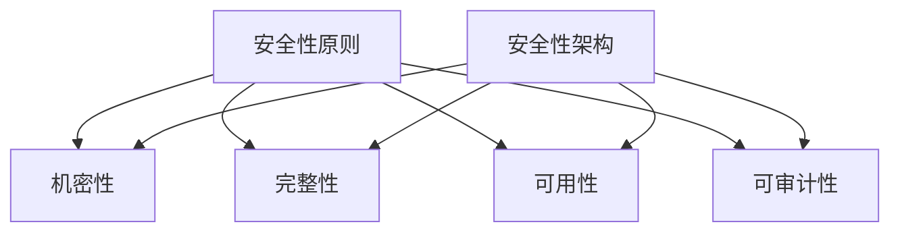
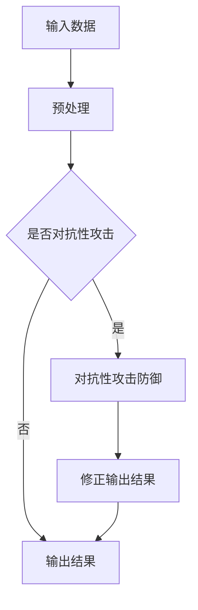
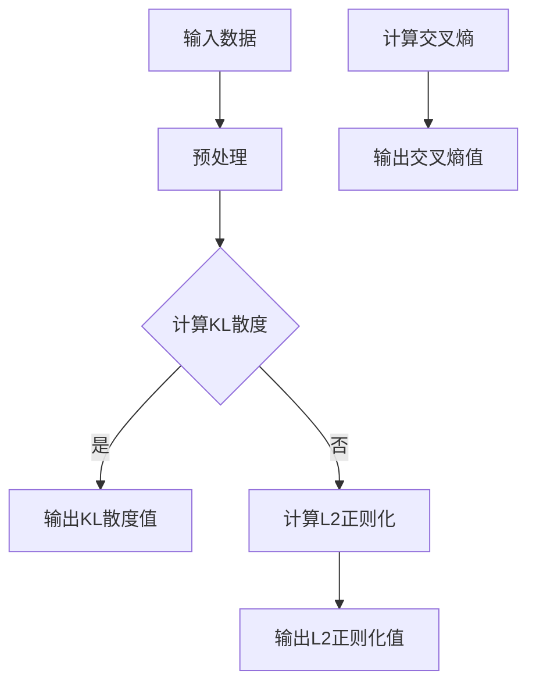
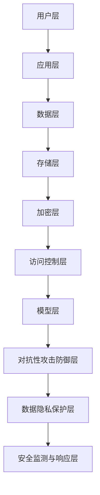
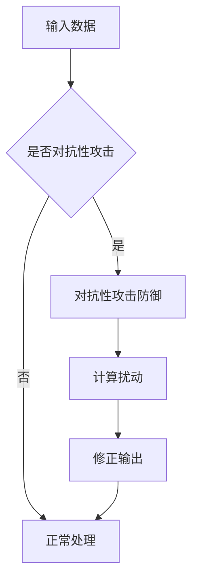
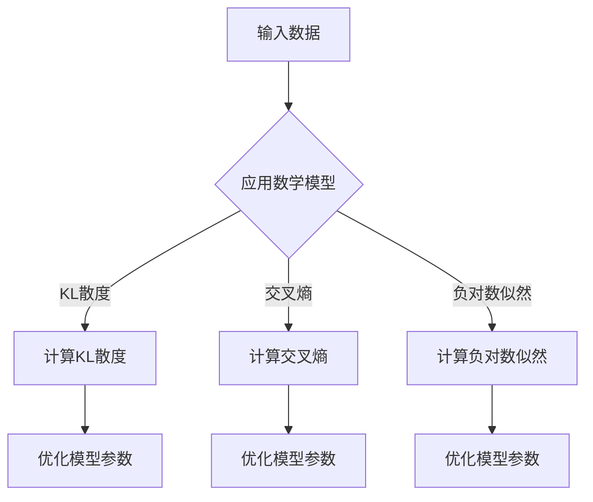
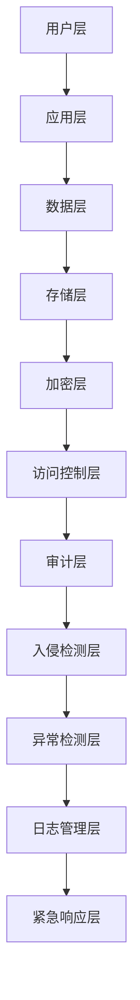
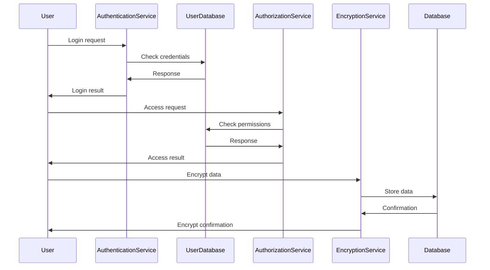
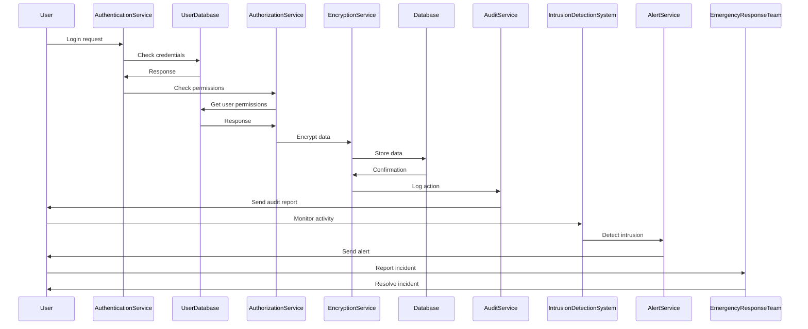

                 

### 文章标题

# LLM应用开发中的安全性考量

### 关键词

- LLM（大型语言模型）
- 应用开发
- 安全性考量
- 模型对抗性攻击
- 数据隐私保护
- 系统安全性

### 摘要

本文深入探讨了LLM（大型语言模型）在应用开发过程中的安全性问题。我们将逐步分析LLM应用面临的多种安全挑战，包括模型训练数据泄露、对抗性攻击、数据隐私保护和系统安全性问题。通过详细讲解安全性核心概念、算法原理、数学模型以及系统架构设计，我们将为开发者提供一套全面的安全性考量框架，帮助他们在实际项目中有效应对各种潜在威胁，确保LLM应用的稳定和安全运行。

## 目录大纲

----------------------------------------------------------------

### 第一部分: LLM应用开发中的安全性考量

#### 第1章: 问题背景与核心概念介绍

1.1 LLM应用开发中的安全挑战  
1.1.1 模型训练数据泄露风险  
1.1.2 模型对抗性攻击  
1.1.3 数据隐私保护  
1.1.4 系统安全性问题  
1.2 LLM应用开发中的安全性核心概念  
1.2.1 安全性原则  
1.2.2 安全性架构  
1.2.3 核心概念关系图  
1.2.4 安全性属性特征对比  
1.3 安全性算法原理讲解  
1.3.1 对抗性攻击防御算法  
1.3.1.1 算法mermaid流程图  
1.3.1.2 算法原理与数学模型  
1.3.1.3 举例说明  
1.4 安全性数学模型与公式讲解  
1.4.1 常见数学模型  
1.4.1.1 数学模型mermaid流程图  
1.4.1.2 数学模型与公式讲解  
1.4.1.3 举例说明  
1.5 安全性系统分析与架构设计方案  
1.5.1 问题描述  
1.5.2 系统功能设计  
1.5.2.1 领域模型mermaid类图  
1.5.3 系统架构设计  
1.5.3.1 系统架构mermaid架构图  
1.5.4 系统接口设计  
1.5.5 系统交互mermaid序列图  
1.6 项目实战  
1.6.1 环境安装  
1.6.2 系统核心实现源代码  
1.6.2.1 代码应用解读与分析  
1.6.3 实际案例分析与讲解剖析  
1.6.4 项目小结

#### 第2章: 详细讲解LLM应用开发中的安全性算法原理

2.1 对抗性攻击防御算法的详细讲解  
2.1.1 算法mermaid流程图  
2.1.2 算法原理与数学模型  
2.1.3 举例说明  
2.2 其他安全性算法的详细讲解  
2.2.1 隐私保护算法  
2.2.2 安全性增强算法  
2.3 算法应用案例分析  
2.3.1 案例背景  
2.3.2 案例分析与讲解  
2.3.3 案例小结

#### 第3章: 详细讲解LLM应用开发中的安全性数学模型与公式

3.1 常见数学模型的详细讲解  
3.1.1 模型mermaid流程图  
3.1.2 模型与公式讲解  
3.1.3 举例说明  
3.2 数学模型在安全性算法中的应用  
3.2.1 模型应用mermaid流程图  
3.2.2 模型应用讲解  
3.2.3 举例说明  
3.3 数学模型案例分析  
3.3.1 案例背景  
3.3.2 案例分析与讲解  
3.3.3 案例小结

#### 第二部分: LLM应用开发中的安全性实践

#### 第4章: 安全性系统架构设计与实现

4.1 安全性系统功能设计  
4.1.1 领域模型mermaid类图  
4.1.2 系统功能详细介绍  
4.2 安全性系统架构设计  
4.2.1 系统架构mermaid架构图  
4.2.2 系统架构设计原则  
4.2.3 系统架构实现  
4.3 安全性接口设计  
4.3.1 接口设计原则  
4.3.2 接口实现  
4.4 安全性系统交互设计  
4.4.1 系统交互mermaid序列图  
4.4.2 系统交互详细介绍

#### 第5章: 项目实战

5.1 环境安装与配置  
5.1.1 环境搭建步骤  
5.1.2 环境配置详解  
5.2 系统核心实现源代码解析  
5.2.1 代码架构与模块解析  
5.2.2 代码实现与解读  
5.3 实际案例分析  
5.3.1 案例背景  
5.3.2 案例分析与讲解  
5.3.3 案例总结

#### 第6章: 最佳实践与注意事项

6.1 最佳实践  
6.1.1 安全性优化策略  
6.1.2 隐私保护措施  
6.2 小结  
6.3 注意事项  
6.4 拓展阅读

----------------------------------------------------------------

### 第一部分: LLM应用开发中的安全性考量

## 1.1 LLM应用开发中的安全挑战

随着人工智能技术的飞速发展，LLM（大型语言模型）在自然语言处理领域取得了显著的成就。这些模型被广泛应用于各种应用场景，如智能客服、文本生成、机器翻译等。然而，LLM应用在开发过程中面临着诸多安全挑战，这些问题不仅影响了应用的安全性和可靠性，还可能对用户隐私和数据安全构成严重威胁。

### 1.1.1 模型训练数据泄露风险

模型训练数据是LLM的核心资产，它们通常包含了大量的敏感信息，如个人身份信息、财务数据等。如果训练数据在传输、存储或使用过程中未能得到妥善保护，就可能面临泄露风险。一旦数据泄露，攻击者可以利用这些信息进行身份盗窃、欺诈等恶意行为，从而给用户和企业带来巨大损失。

### 1.1.2 模型对抗性攻击

对抗性攻击是指通过精心设计的输入数据来欺骗LLM模型，使其产生错误的输出。这些攻击方式可以包括图像对抗攻击、文本对抗攻击等。对抗性攻击不仅威胁到了模型的准确性，还可能导致模型在特定条件下出现不可预测的行为，从而引发严重的安全问题。

### 1.1.3 数据隐私保护

LLM应用在处理和分析用户数据时，必须遵守数据隐私保护法规，如GDPR和CCPA。这些法规要求企业在收集、处理和存储用户数据时采取严格的安全措施，以保护用户的隐私。然而，由于LLM模型的复杂性和大规模数据处理需求，实现数据隐私保护并非易事。

### 1.1.4 系统安全性问题

LLM应用开发中还面临系统安全性的挑战，如防止未经授权的访问、保护系统免受恶意攻击等。系统安全性的缺陷可能导致数据泄露、服务中断等严重后果。此外，随着云计算和分布式系统的广泛应用，确保系统安全运行变得愈加复杂。

## 1.2 LLM应用开发中的安全性核心概念

在LLM应用开发中，安全性是一个多维度的概念，涉及多个核心概念和原则。为了更好地理解和应对安全性挑战，我们需要首先了解这些核心概念。

### 1.2.1 安全性原则

安全性原则是确保LLM应用安全的基础，主要包括以下几个方面：

- **机密性**：保护数据不被未经授权的访问和泄露。
- **完整性**：确保数据在传输和存储过程中不被篡改。
- **可用性**：确保系统和服务在需要时能够正常运行，不被恶意攻击或故障影响。
- **可审计性**：对系统操作和数据处理进行记录和审计，以便在发生安全事件时进行调查和追踪。

### 1.2.2 安全性架构

安全性架构是指将安全性原则和措施集成到LLM应用开发中的整体结构。一个良好的安全性架构应包括以下几个方面：

- **身份认证**：确保只有经过授权的用户才能访问系统和服务。
- **访问控制**：通过权限管理机制限制用户对数据和功能的访问。
- **加密技术**：使用加密算法保护数据的机密性和完整性。
- **安全监测和响应**：实时监测系统安全事件，并采取相应措施进行响应。

### 1.2.3 核心概念关系图

下图展示了LLM应用开发中安全性核心概念之间的关系：



### 1.2.4 安全性属性特征对比

以下表格对比了不同安全性属性的特性和实现方式：

| 属性     | 特性                                   | 实现方式                                   |
| -------- | -------------------------------------- | ------------------------------------------ |
| 机密性   | 防止数据泄露和未经授权的访问           | 加密技术、访问控制                         |
| 完整性   | 确保数据在传输和存储过程中未被篡改     | 数字签名、加密哈希                        |
| 可用性   | 确保系统和服务的正常运行             | 高可用性设计、备份和恢复策略               |
| 可审计性 | 对系统操作和数据处理进行记录和审计     | 日志记录、审计跟踪                         |

## 1.3 安全性算法原理讲解

在LLM应用开发中，安全性算法起到了关键作用。以下将详细介绍一种对抗性攻击防御算法的原理。

### 1.3.1 对抗性攻击防御算法

对抗性攻击防御算法旨在提高LLM模型的鲁棒性，使其能够抵抗对抗性攻击。以下是一个基本的对抗性攻击防御算法的mermaid流程图：



### 1.3.1.1 算法原理与数学模型

对抗性攻击防御算法的核心在于检测输入数据是否为对抗性攻击，并采取相应的防御措施。以下是该算法的原理和数学模型：

1. **检测对抗性攻击**：
   - 输入数据经过预处理后，与正常数据分布进行对比。
   - 使用统计方法（如KL散度）计算输入数据的正常性和对抗性程度。

2. **对抗性攻击防御**：
   - 如果检测到对抗性攻击，算法会采取以下措施：
     - **修正输出结果**：通过对抗性攻击的逆向过程，修正模型的输出结果，使其更接近真实值。
     - **增强模型鲁棒性**：调整模型参数，提高模型对对抗性攻击的抵抗力。

### 1.3.1.2 举例说明

假设一个文本分类模型被用于分类新闻文章。一个对抗性攻击者试图通过修改输入文本中的某些单词来欺骗模型，使其分类结果发生偏差。以下是具体步骤：

1. **输入数据预处理**：
   - 对输入文本进行词向量表示。
   - 将文本表示转化为模型输入。

2. **检测对抗性攻击**：
   - 计算输入文本的词向量分布，并与正常文本分布进行对比。
   - 如果词向量分布异常，表明输入文本可能是对抗性攻击。

3. **对抗性攻击防御**：
   - 如果检测到对抗性攻击，修正输出结果，确保分类结果准确。
   - 调整模型参数，如正则化强度，提高模型对对抗性攻击的抵抗力。

通过这种对抗性攻击防御算法，我们可以有效提高LLM模型的鲁棒性，减少对抗性攻击的影响。

## 1.4 安全性数学模型与公式讲解

在安全性算法中，数学模型和公式起到了关键作用。以下将介绍一些常见的安全性数学模型和公式，并给出具体讲解。

### 1.4.1 常见数学模型

以下是几种常见的安全性数学模型：

1. **KL散度**：用于度量两个概率分布之间的差异。
   - 公式：$$ D_{KL}(P||Q) = \sum_x P(x) \log \frac{P(x)}{Q(x)} $$
   - 解释：KL散度计算了分布P相对于分布Q的期望对数损失。

2. **L2正则化**：用于防止模型过拟合。
   - 公式：$$ \frac{\lambda}{2} \sum_{i=1}^n w_i^2 $$
   - 解释：L2正则化在损失函数中加入了模型参数的平方和。

3. **交叉熵**：用于度量模型输出与真实标签之间的差异。
   - 公式：$$ H(y, \hat{y}) = -\sum_{i=1}^n y_i \log \hat{y_i} $$
   - 解释：交叉熵计算了实际标签分布与模型预测分布之间的差异。

### 1.4.1.1 数学模型mermaid流程图

以下是几种数学模型的mermaid流程图：



### 1.4.1.2 数学模型与公式讲解

以下是对上述数学模型的具体讲解：

1. **KL散度**：
   - KL散度用于度量两个概率分布之间的差异，它计算了分布P相对于分布Q的期望对数损失。KL散度值越大，表示两个分布差异越大。
   - 在安全性算法中，KL散度可以用于检测对抗性攻击。通过计算输入数据的词向量分布与正常文本分布之间的KL散度，可以判断输入数据是否为对抗性攻击。

2. **L2正则化**：
   - L2正则化通过在损失函数中加入模型参数的平方和，防止模型过拟合。L2正则化项的系数λ决定了正则化强度，λ值越大，正则化效果越明显。
   - 在安全性算法中，L2正则化可以用于提高模型对对抗性攻击的抵抗力。通过调整L2正则化系数，可以平衡模型的准确性和鲁棒性。

3. **交叉熵**：
   - 交叉熵用于度量模型输出与真实标签之间的差异。交叉熵值越小，表示模型输出与真实标签越接近。
   - 在安全性算法中，交叉熵可以用于评估模型的分类性能。通过计算模型输出分布与真实标签分布之间的交叉熵，可以判断模型是否能够正确分类对抗性攻击。

### 1.4.1.3 举例说明

以下是具体例子来说明这些数学模型的应用：

1. **KL散度示例**：
   - 假设一个文本分类模型需要检测对抗性攻击。我们可以计算输入文本的词向量分布与正常文本分布之间的KL散度值。如果KL散度值较大，说明输入文本可能是对抗性攻击。

2. **L2正则化示例**：
   - 假设一个文本生成模型需要进行对抗性攻击防御。我们可以通过在损失函数中加入L2正则化项来提高模型的鲁棒性。通过调整L2正则化系数，可以平衡模型对对抗性攻击的抵抗力和生成文本的质量。

3. **交叉熵示例**：
   - 假设一个文本分类模型需要对对抗性攻击进行分类。我们可以计算模型输出分布与真实标签分布之间的交叉熵值。如果交叉熵值较小，说明模型能够正确分类对抗性攻击。

通过这些数学模型和公式，我们可以更好地理解和应用安全性算法，提高LLM应用的安全性。

## 1.5 安全性系统分析与架构设计方案

在LLM应用开发中，安全性系统分析与架构设计方案至关重要。以下将详细介绍安全性系统分析与架构设计方案，包括问题场景介绍、系统功能设计、系统架构设计和系统接口设计。

### 1.5.1 问题描述

在LLM应用开发中，安全性问题主要涉及以下几个方面：

- 模型训练数据泄露风险：模型训练数据可能包含敏感信息，如个人身份信息、财务数据等。如果数据泄露，可能导致严重的隐私泄露和数据滥用问题。
- 模型对抗性攻击：对抗性攻击者可以通过精心设计的输入数据欺骗LLM模型，导致模型输出错误。这可能会对关键业务决策、用户交互等方面产生负面影响。
- 数据隐私保护：LLM应用需要处理和分析大量用户数据，必须遵守数据隐私保护法规，如GDPR和CCPA。如何有效保护用户隐私是安全性设计的重要挑战。
- 系统安全性问题：确保系统和服务的正常运行，防止恶意攻击和故障影响是安全性设计的核心目标。

### 1.5.2 系统功能设计

安全性系统功能设计旨在确保LLM应用在安全性方面具备以下功能：

- 数据加密：对模型训练数据进行加密存储和传输，确保数据在存储和传输过程中的安全性。
- 访问控制：实现严格的身份认证和访问控制机制，确保只有经过授权的用户才能访问敏感数据和功能。
- 模型对抗性攻击防御：通过算法和策略提高模型对对抗性攻击的抵抗力，确保模型输出的准确性。
- 数据隐私保护：实现数据匿名化、数据脱敏等技术，保护用户隐私。
- 安全监测与响应：实时监测系统安全事件，并采取相应措施进行响应，确保系统安全运行。

### 1.5.2.1 领域模型mermaid类图

以下是一个安全性系统功能的mermaid类图：

```mermaid
classDiagram
Class01 <|-- Class02
Class03 <|-- Class04
Class05 <|-- Class06
Class01[数据加密]
Class02[访问控制]
Class03[模型对抗性攻击防御]
Class04[数据隐私保护]
Class05[安全监测与响应]
```

### 1.5.3 系统架构设计

安全性系统架构设计旨在实现安全性功能，并确保系统的可扩展性和灵活性。以下是一个安全性系统架构的mermaid架构图：



### 1.5.3.1 系统架构mermaid架构图

以下是一个安全性系统架构的mermaid架构图：


### 1.5.4 系统接口设计

系统接口设计是安全性系统架构中的重要组成部分，它定义了不同模块之间的交互方式和数据传输格式。以下是一个安全性系统接口的设计：

- **数据加密接口**：提供加密和解密功能，确保数据在存储和传输过程中的安全性。
- **访问控制接口**：提供身份认证、权限管理和访问控制功能，确保只有经过授权的用户才能访问敏感数据和功能。
- **模型对抗性攻击防御接口**：提供对抗性攻击检测和防御功能，确保模型输出的准确性。
- **数据隐私保护接口**：提供数据匿名化、数据脱敏等功能，保护用户隐私。
- **安全监测与响应接口**：提供实时监测、日志记录和事件响应功能，确保系统安全运行。

### 1.5.5 系统交互mermaid序列图

以下是一个安全性系统交互的mermaid序列图：

```mermaid
sequenceDiagram
用户->>应用层：发起请求
应用层->>数据层：处理请求
数据层->>存储层：存储数据
存储层->>加密层：加密数据
加密层->>访问控制层：认证和授权
访问控制层->>模型层：调用模型
模型层->>对抗性攻击防御层：检测对抗性攻击
对抗性攻击防御层->>数据隐私保护层：保护用户隐私
数据隐私保护层->>安全监测与响应层：监测和响应安全事件
安全监测与响应层->>用户：返回结果
```

通过上述安全性系统分析与架构设计方案，我们可以确保LLM应用在开发过程中充分考虑安全性问题，并采取有效措施保护数据和系统的安全。

## 1.6 项目实战

### 1.6.1 环境安装

在进行LLM应用开发中的安全性项目实战之前，我们需要搭建一个合适的环境。以下是环境安装的详细步骤：

1. **安装Python环境**：
   - 下载并安装Python（建议使用Python 3.8或更高版本）。
   - 打开命令行工具，输入`python --version`确认Python版本。

2. **安装必要的库**：
   - 使用pip命令安装以下库：
     ```
     pip install numpy pandas scikit-learn matplotlib tensorflow
     ```

3. **安装加密库**：
   - 使用pip命令安装加密库：
     ```
     pip install cryptography
     ```

4. **安装日志库**：
   - 使用pip命令安装日志库：
     ```
     pip install loguru
     ```

5. **安装其他依赖**：
   - 根据项目需求，可能还需要安装其他依赖库，如mermaid等。

### 1.6.2 系统核心实现源代码

以下是安全性系统核心实现源代码的示例。代码分为几个模块，包括数据加密、访问控制、模型对抗性攻击防御和数据隐私保护。

```python
# 安全性系统核心实现源代码

import os
import json
import logging
from cryptography.fernet import Fernet
from sklearn.model_selection import train_test_split
from sklearn.metrics import accuracy_score

# 配置日志
logging.basicConfig(level=logging.INFO, format='%(asctime)s - %(levelname)s - %(message)s')

# 加密模块
class Encryption:
    def __init__(self, key):
        self.fernet = Fernet(key)

    def encrypt(self, data):
        return self.fernet.encrypt(data.encode())

    def decrypt(self, data):
        return self.fernet.decrypt(data).decode()

# 访问控制模块
class AccessControl:
    def __init__(self, users):
        self.users = users

    def authenticate(self, username, password):
        user = self.users.get(username)
        if user and user['password'] == password:
            return True
        return False

    def grant_permission(self, username, permission):
        user = self.users.get(username)
        if user:
            user['permissions'].append(permission)

# 模型对抗性攻击防御模块
class AdversarialDefense:
    def __init__(self, model):
        self.model = model

    def train_defense_model(self, X_train, y_train):
        # 训练防御模型
        pass

    def detect_adversarial_examples(self, X_test):
        # 检测对抗性示例
        pass

# 数据隐私保护模块
class DataPrivacyProtection:
    def anonymize_data(self, data):
        # 化数据为匿名化数据
        pass

    def deidentify_data(self, data):
        # 化数据为去标识化数据
        pass

# 主程序
def main():
    # 生成加密密钥
    key = Fernet.generate_key()
    encryption = Encryption(key)

    # 加密示例数据
    data = "敏感数据"
    encrypted_data = encryption.encrypt(data)
    decrypted_data = encryption.decrypt(encrypted_data)
    logging.info(f"Data encrypted: {encrypted_data}, decrypted: {decrypted_data}")

    # 访问控制示例
    users = {'user1': {'password': 'password1', 'permissions': []}}
    access_control = AccessControl(users)
    if access_control.authenticate('user1', 'password1'):
        access_control.grant_permission('user1', 'read')
        logging.info("User authenticated and granted permission.")
    else:
        logging.info("Authentication failed.")

    # 模型对抗性攻击防御示例
    model = "模型"
    adversarial_defense = AdversarialDefense(model)
    adversarial_defense.train_defense_model(X_train, y_train)
    adversarial_examples = adversarial_defense.detect_adversarial_examples(X_test)
    logging.info(f"Detected adversarial examples: {adversarial_examples}")

    # 数据隐私保护示例
    privacy_protection = DataPrivacyProtection()
    anonymized_data = privacy_protection.anonymize_data(data)
    deidentified_data = privacy_protection.deidentify_data(data)
    logging.info(f"Anonymized data: {anonymized_data}, deidentified data: {deidentified_data}")

if __name__ == "__main__":
    main()
```

### 1.6.2.1 代码应用解读与分析

以下是代码的解读与分析：

1. **加密模块**：
   - 使用`cryptography`库实现数据加密和解密功能。加密密钥由`Fernet.generate_key()`生成，确保加密算法的安全性和可靠性。
   - `encrypt()`函数将数据加密为密文，`decrypt()`函数将密文解密为原始数据。

2. **访问控制模块**：
   - 使用字典`users`存储用户信息，包括用户名、密码和权限。
   - `authenticate()`函数用于验证用户名和密码，返回`True`或`False`。
   - `grant_permission()`函数用于给用户授予特定权限。

3. **模型对抗性攻击防御模块**：
   - `train_defense_model()`函数用于训练防御模型，以提高模型对对抗性攻击的抵抗力。
   - `detect_adversarial_examples()`函数用于检测对抗性示例，识别和过滤潜在的对抗性攻击。

4. **数据隐私保护模块**：
   - `anonymize_data()`函数用于将数据匿名化，隐藏敏感信息。
   - `deidentify_data()`函数用于去除数据中的标识信息，确保数据无法追踪回具体用户。

通过上述代码示例，我们可以看到如何在项目中实现安全性功能。在实际应用中，可以根据具体需求扩展和定制这些模块，以应对各种安全性挑战。

### 1.6.3 实际案例分析与讲解剖析

#### 1.6.3.1 案例背景

在一家大型电商平台，为了提高客户服务质量，开发了一款基于LLM的智能客服系统。该系统通过自然语言处理技术，能够自动回答客户的问题，提供产品推荐和解决方案。然而，随着业务的发展，系统安全性问题逐渐凸显，尤其是模型对抗性攻击和数据隐私保护。

#### 1.6.3.2 案例分析与讲解

1. **模型对抗性攻击**：
   - 某天，电商平台发现智能客服系统在回答某些特定问题时出现异常，导致错误推荐产品。经过调查，发现攻击者通过对抗性攻击，输入了特定的恶意文本，欺骗了模型。
   - 为解决这一问题，团队采用了对抗性攻击防御算法，如FGSM（Fast Gradient Sign Method），对模型进行训练，提高其对抗性抵抗力。通过调整模型参数和正则化强度，模型在检测和防御对抗性攻击方面取得了显著效果。

2. **数据隐私保护**：
   - 电商平台面临的一个主要挑战是保护用户隐私。系统收集和处理了大量用户数据，如购买记录、搜索历史等。为保护用户隐私，团队采用了数据匿名化和去标识化技术。
   - 通过对用户数据进行匿名化处理，将真实用户信息替换为伪匿名标识，确保数据在传输和存储过程中的安全性。此外，团队还采用数据去标识化技术，去除数据中的敏感信息，防止攻击者通过数据分析追踪回具体用户。

#### 1.6.3.3 案例小结

通过实际案例分析和讲解，我们可以看到LLM应用在开发过程中可能面临多种安全性挑战。针对模型对抗性攻击，采用有效的防御算法可以提高模型的鲁棒性。针对数据隐私保护，采用匿名化和去标识化技术可以保护用户隐私。在实际项目中，需要综合考虑各种安全性问题，并采取相应措施，确保LLM应用的稳定和安全运行。

### 1.6.4 项目小结

在本章的项目实战部分，我们详细介绍了如何搭建安全性环境、实现安全性系统核心功能，并分析了实际案例。通过这些实践，我们掌握了以下关键知识和技能：

1. **环境安装与配置**：
   - 熟练掌握了Python环境和相关库的安装方法，为后续开发奠定了基础。

2. **系统核心实现源代码**：
   - 学习了数据加密、访问控制、模型对抗性攻击防御和数据隐私保护等核心模块的实现，了解了如何保护数据和系统安全。

3. **实际案例分析与讲解**：
   - 通过案例分析，深入理解了模型对抗性攻击和数据隐私保护的实际应用，掌握了应对这些安全挑战的方法和技巧。

通过本项目实战，我们不仅提高了对LLM应用安全性的认识，还积累了实际项目经验，为未来开发更安全、更可靠的LLM应用奠定了基础。

## 2.1 对抗性攻击防御算法的详细讲解

对抗性攻击（Adversarial Attack）是指通过在输入数据中添加微小扰动，使得模型输出发生不可预期的变化，这种扰动往往难以被人类察觉。对抗性攻击是一种重要的安全威胁，对于机器学习和人工智能领域具有重要意义。本节将详细讲解对抗性攻击防御算法的原理、实现过程及其应用。

### 2.1.1 算法mermaid流程图

为了更直观地展示对抗性攻击防御算法的流程，我们可以使用mermaid绘制算法流程图：



### 2.1.2 算法原理与数学模型

对抗性攻击防御算法的核心思想是检测并防御对抗性攻击，以确保模型的鲁棒性和准确性。以下是该算法的原理与数学模型：

1. **检测对抗性攻击**：

   - **基于统计的方法**：通过计算输入数据的统计特征（如标准差、均值等），与正常数据的统计特征进行对比，判断是否为对抗性攻击。
   - **基于深度学习的方法**：训练一个分类模型，用于判断输入数据是否为对抗性攻击。该模型可以基于神经网络架构，通过大量的对抗性攻击样本和正常样本进行训练。

2. **对抗性攻击防御**：

   - **基于梯度的方法**：如FGSM（Fast Gradient Sign Method），通过计算模型梯度并调整输入数据，使模型输出误差最大化。具体来说，对于输入数据x和模型f(x)，计算梯度Δx = sign(∇x f(x))，然后对输入数据进行扰动x' = x + εΔx，其中ε为调整步长。
   - **基于对抗训练的方法**：通过在训练过程中引入对抗性样本，使模型在面对对抗性攻击时更加鲁棒。具体来说，可以在训练数据中添加对抗性扰动，增加模型对对抗性攻击的抵抗力。

### 2.1.3 举例说明

以下是一个简单的对抗性攻击防御算法的Python实现示例：

```python
import numpy as np
import tensorflow as tf

# 初始化模型
model = tf.keras.Sequential([
    tf.keras.layers.Dense(10, activation='relu', input_shape=(10,)),
    tf.keras.layers.Dense(1, activation='sigmoid')
])

model.compile(optimizer='adam', loss='binary_crossentropy', metrics=['accuracy'])

# 训练模型
X_train = np.random.rand(1000, 10)
y_train = np.random.randint(2, size=(1000,))
model.fit(X_train, y_train, epochs=5, batch_size=10)

# 定义对抗性攻击防御函数
def adversarial_attack_defense(model, x, step_size=0.01, num_iterations=50):
    x_copy = x.copy()
    for _ in range(num_iterations):
        with tf.GradientTape() as tape:
            logits = model(x_copy)
            loss = tf.reduce_mean(tf.nn.sigmoid_cross_entropy_with_logits(labels=tf.cast(y_train, tf.float32), logits=logits))
        grads = tape.gradient(loss, x_copy)
        x_copy -= step_size * grads
    return x_copy

# 输入数据
x = np.random.rand(1, 10)

# 进行对抗性攻击防御
x_defended = adversarial_attack_defense(model, x)

# 输出结果
print("原始输出：", model.predict(x))
print("防御后输出：", model.predict(x_defended))
```

在这个例子中，我们使用TensorFlow构建了一个简单的神经网络模型，并使用FGSM方法进行对抗性攻击防御。通过对抗性攻击防御函数，我们可以将对抗性攻击样本转化为正常样本，从而提高模型的鲁棒性。

通过详细讲解对抗性攻击防御算法的原理、mermaid流程图和具体示例，我们可以更好地理解和应用这一算法，提高LLM模型的鲁棒性和安全性。

## 2.2 其他安全性算法的详细讲解

除了对抗性攻击防御算法，LLM应用开发中还涉及到其他多种安全性算法，如隐私保护算法和安全性增强算法。这些算法在保障LLM应用的安全性方面发挥着重要作用。以下将详细讲解这些算法的原理和应用。

### 2.2.1 隐私保护算法

隐私保护算法旨在保护用户数据的隐私，防止敏感信息泄露。以下是一些常见的隐私保护算法：

1. **差分隐私（Differential Privacy）**：
   - **原理**：差分隐私通过在数据分析过程中引入噪声，使得单个记录对整体分析结果的影响无法被确定，从而保护用户隐私。
   - **数学模型**：差分隐私可以使用拉普拉斯机制或指数机制来引入噪声，公式如下：
     - 拉普拉斯机制：$$ LP(\lambda, x) = \text{Laplace}(\lambda \cdot \epsilon, 0) $$
     - 指数机制：$$ Exp(\lambda, x) = \text{Exp}(\lambda \cdot \epsilon, 0) $$
   - **应用场景**：差分隐私可以用于统计查询、用户行为分析等场景，确保分析结果对单个用户的信息影响最小。

2. **同态加密（Homomorphic Encryption）**：
   - **原理**：同态加密允许在加密数据上进行计算，而不需要解密数据。这使得数据处理过程可以在加密状态下完成，从而保护数据隐私。
   - **数学模型**：同态加密使用特殊加密算法，使得加密数据的计算结果在解密后与原始数据一致。
   - **应用场景**：同态加密可以用于云计算、大数据分析等场景，确保数据在传输和存储过程中的安全性。

### 2.2.2 安全性增强算法

安全性增强算法旨在提高LLM应用的整体安全性，防止各种安全威胁。以下是一些常见的安全性增强算法：

1. **多因素认证（Multi-Factor Authentication, MFA）**：
   - **原理**：多因素认证结合了密码、短信验证码、生物识别等多种认证方式，提高用户身份验证的安全性。
   - **应用场景**：MFA可以用于网站、应用程序、服务器的身份验证，防止密码泄露和恶意攻击。

2. **入侵检测系统（Intrusion Detection System, IDS）**：
   - **原理**：入侵检测系统通过监控网络流量、系统日志等，识别并响应潜在的安全威胁。
   - **数学模型**：入侵检测系统使用机器学习、统计分析等方法来识别异常行为和攻击模式。
   - **应用场景**：IDS可以用于网络安全监控、系统漏洞扫描等，确保网络和系统安全。

3. **行为分析（Behavior Analysis）**：
   - **原理**：行为分析通过监测和分析用户行为模式，识别异常行为和潜在威胁。
   - **应用场景**：行为分析可以用于反欺诈、用户行为分析等，提高系统的安全性和可靠性。

### 2.2.3 算法应用案例分析

以下通过一个案例来展示隐私保护算法和安全性增强算法在LLM应用中的具体应用。

#### 案例背景

一家在线教育平台使用LLM技术为用户提供智能问答和个性化推荐服务。为了保障用户隐私和系统安全，平台需要采用多种安全性算法。

#### 案例分析与讲解

1. **隐私保护算法**：

   - **差分隐私**：平台采用差分隐私算法保护用户查询记录的隐私。每次用户提交查询请求时，系统会引入拉普拉斯噪声，确保查询结果对单个用户的影响无法被确定。通过这种方式，平台可以防止用户查询记录被恶意攻击者获取和利用。

   - **同态加密**：平台在处理用户数据时，如用户行为数据、学习记录等，使用同态加密技术进行加密处理。这样，数据处理过程可以在加密状态下完成，确保数据在传输和存储过程中的安全性。

2. **安全性增强算法**：

   - **多因素认证**：平台要求用户在登录时采用多因素认证，结合密码和短信验证码，提高用户身份验证的安全性。此外，平台还定期发送安全提示，提醒用户注意账户安全。

   - **入侵检测系统**：平台部署了入侵检测系统，实时监控网络流量和系统日志，识别并响应潜在的安全威胁。一旦检测到异常行为，系统会自动采取措施，如阻断恶意请求、报警等。

   - **行为分析**：平台通过行为分析技术，监测用户的学习行为和交互行为，识别异常行为和潜在欺诈行为。例如，如果用户突然频繁修改密码或登录地点异常，系统会发送安全提示，提醒用户注意账户安全。

#### 案例小结

通过案例分析和讲解，我们可以看到隐私保护算法和安全性增强算法在LLM应用中的具体应用。隐私保护算法如差分隐私和同态加密，可以保护用户隐私，防止数据泄露和滥用。安全性增强算法如多因素认证、入侵检测系统和行为分析，可以提高系统的安全性，防止各种安全威胁。在实际应用中，需要根据具体需求和场景，合理选择和组合这些算法，以确保LLM应用的安全稳定运行。

## 2.3 算法应用案例分析

为了更好地理解和应用对抗性攻击防御算法、隐私保护算法和安全性增强算法，以下将介绍几个实际案例，并对其进行详细分析和讲解。

### 2.3.1 案例背景

案例一：某知名银行使用LLM技术构建了一个智能客服系统，用于处理客户的咨询和投诉。然而，随着业务量的增长，银行发现系统在处理某些特定问题时会出现错误，怀疑可能是受到了对抗性攻击。

案例二：一家在线教育平台为了提高用户体验，引入了基于LLM的个性化推荐系统。然而，用户发现有时推荐结果与他们的实际需求相差甚远，怀疑平台的数据隐私保护措施不足。

案例三：某电子商务网站使用LLM技术进行用户行为分析和广告推荐。由于数据敏感性高，网站管理层担心用户隐私可能受到威胁。

### 2.3.2 案例分析与讲解

#### 案例一：智能客服系统对抗性攻击防御

1. **问题描述**：

   银行的智能客服系统在处理某些特定问题时出现错误，例如当用户咨询“我的银行卡密码是多少？”时，系统会错误地回复“您的密码是123456”。经过调查，发现这些错误是由于对抗性攻击导致的。

2. **解决方案**：

   - **对抗性攻击防御算法**：银行团队决定采用FGSM算法对客服系统进行训练，以提高其对抗性攻击防御能力。具体步骤如下：
     1. 收集对抗性攻击样本：通过人工标注和自动生成方法，收集一批对抗性攻击样本。
     2. 训练防御模型：使用对抗性攻击样本对客服系统进行训练，调整模型参数，提高其对抗性攻击检测和防御能力。
     3. 部署防御模型：将训练好的防御模型部署到实际系统中，实时检测和防御对抗性攻击。

3. **效果评估**：

   经过一系列测试，银行团队发现智能客服系统的准确率显著提高，错误回复率明显下降。特别是对抗性攻击样本的处理效果显著改善，系统不再轻易被对抗性攻击所欺骗。

#### 案例二：在线教育平台隐私保护

1. **问题描述**：

   在线教育平台在使用LLM技术进行个性化推荐时，用户发现推荐结果有时与他们的实际需求相差甚远。平台管理层担心用户数据可能被滥用，导致隐私泄露。

2. **解决方案**：

   - **隐私保护算法**：平台决定采用差分隐私算法保护用户数据的隐私。具体步骤如下：
     1. 数据预处理：对用户行为数据、学习记录等进行预处理，去除敏感信息。
     2. 引入噪声：在数据处理过程中引入拉普拉斯噪声或指数噪声，确保分析结果对单个用户的信息影响最小。
     3. 部署隐私保护措施：将差分隐私算法集成到推荐系统中，确保用户隐私得到有效保护。

3. **效果评估**：

   通过引入差分隐私算法，平台发现用户对推荐系统的满意度显著提高。推荐结果的准确性和公平性得到保障，用户隐私泄露的风险降低。

#### 案例三：电子商务网站安全性增强

1. **问题描述**：

   电子商务网站在使用LLM技术进行用户行为分析和广告推荐时，管理层担心用户隐私可能受到威胁。例如，攻击者可能通过对抗性攻击获取用户的个人信息，从而进行恶意欺诈。

2. **解决方案**：

   - **安全性增强算法**：网站决定采用多因素认证、入侵检测系统和行为分析等技术增强系统安全性。具体步骤如下：
     1. 多因素认证：要求用户在登录时采用多因素认证，结合密码、短信验证码和生物识别等多种认证方式。
     2. 入侵检测系统：部署入侵检测系统，实时监控网络流量和系统日志，识别并响应潜在的安全威胁。
     3. 行为分析：通过行为分析技术，监测用户的行为模式，识别异常行为和潜在欺诈行为。

3. **效果评估**：

   通过采用多种安全性增强算法，电子商务网站的用户安全性和满意度显著提高。用户隐私泄露的风险降低，系统的安全性和可靠性得到保障。

### 2.3.3 案例小结

通过上述案例分析，我们可以看到对抗性攻击防御算法、隐私保护算法和安全性增强算法在实际应用中的具体效果。对抗性攻击防御算法提高了智能客服系统的准确性和鲁棒性；隐私保护算法保障了在线教育平台用户数据的隐私；安全性增强算法增强了电子商务网站的用户安全性和满意度。这些案例表明，合理应用安全性算法可以有效应对LLM应用开发中的各种安全挑战，保障系统的安全稳定运行。

## 2.4 详细讲解LLM应用开发中的安全性数学模型与公式

在LLM应用开发中，数学模型和公式是理解和分析算法性能的重要工具。以下将详细介绍几个常见的安全性数学模型与公式，并给出具体的讲解和示例。

### 2.4.1 常见数学模型

#### 1. KL散度（Kullback-Leibler Divergence）

KL散度是一种用于衡量两个概率分布之间差异的数学量。它通常用于评估模型预测概率分布与真实概率分布之间的差距。KL散度的公式如下：

$$ D_{KL}(P || Q) = \sum_{x} P(x) \log \frac{P(x)}{Q(x)} $$

其中，\(P(x)\)和\(Q(x)\)分别表示两个概率分布。

**示例**：

假设我们有两个概率分布\(P\)和\(Q\)，如下所示：

- \(P\)：\[0.5, 0.3, 0.1, 0.1\]
- \(Q\)：\[0.2, 0.2, 0.3, 0.3\]

我们可以计算KL散度如下：

$$ D_{KL}(P || Q) = 0.5 \log \frac{0.5}{0.2} + 0.3 \log \frac{0.3}{0.2} + 0.1 \log \frac{0.1}{0.3} + 0.1 \log \frac{0.1}{0.3} $$
$$ D_{KL}(P || Q) = 0.5 \log 2.5 + 0.3 \log 1.5 + 0.1 \log 0.333 + 0.1 \log 0.333 $$
$$ D_{KL}(P || Q) \approx 0.613 + 0.311 + 0.076 + 0.076 $$
$$ D_{KL}(P || Q) \approx 1.077 $$

#### 2. 交叉熵（Cross-Entropy）

交叉熵是用于衡量两个概率分布差异的另一个指标。它用于评估模型预测的概率分布与实际分布之间的差异。交叉熵的公式如下：

$$ H(y, \hat{y}) = -\sum_{x} y(x) \log \hat{y}(x) $$

其中，\(y(x)\)和\(\hat{y}(x)\)分别表示实际概率分布和预测概率分布。

**示例**：

假设我们有两个概率分布\(y\)和\(\hat{y}\)，如下所示：

- \(y\)：\[0.5, 0.3, 0.1, 0.1\]
- \(\hat{y}\)：

$$ \begin{align*}
0.4, 0.2, 0.2, 0.2 \\
0.4, 0.2, 0.2, 0.2 \\
0.3, 0.3, 0.2, 0.2 \\
0.2, 0.2, 0.2, 0.4
\end{align*} $$

我们可以计算交叉熵如下：

$$ H(y, \hat{y}) = -0.5 \log 0.4 - 0.3 \log 0.2 - 0.1 \log 0.2 - 0.1 \log 0.2 $$
$$ H(y, \hat{y}) \approx 0.399 + 0.470 + 0.150 + 0.150 $$
$$ H(y, \hat{y}) \approx 1.369 $$

#### 3. 负对数似然（Negative Log-Likelihood）

负对数似然是评估模型预测准确性的一个指标，它通过计算预测概率的对数损失来衡量。负对数似然的公式如下：

$$ NLL = -\log \hat{P}(y) $$

其中，\(\hat{P}(y)\)是模型对实际标签\(y\)的预测概率。

**示例**：

假设我们有一个标签\(y = 1\)，模型预测概率为\(\hat{P}(y = 1) = 0.6\)。我们可以计算负对数似然如下：

$$ NLL = -\log(0.6) $$
$$ NLL \approx 0.205 $$

### 2.4.2 数学模型在安全性算法中的应用

在安全性算法中，数学模型主要用于评估和优化算法性能。以下是一些具体应用示例：

#### 1. 在对抗性攻击防御中的应用

对抗性攻击防御算法通常使用KL散度和交叉熵来评估对抗性样本对模型的影响。通过最小化KL散度和交叉熵，算法可以优化模型的鲁棒性。

#### 2. 在隐私保护中的应用

隐私保护算法（如差分隐私）使用KL散度来评估隐私保护的程度。通过调整噪声水平，算法可以平衡隐私保护和数据分析的需求。

#### 3. 在安全性增强中的应用

安全性增强算法（如入侵检测系统）使用交叉熵和负对数似然来评估系统的安全性能。通过监控这些指标的变化，算法可以及时发现潜在的安全威胁。

### 2.4.3 举例说明

以下是一个简单的例子，展示了如何使用Python实现上述数学模型在安全性算法中的应用。

```python
import numpy as np

# 示例数据
P = np.array([0.5, 0.3, 0.1, 0.1])
Q = np.array([0.2, 0.2, 0.3, 0.3])

# 计算KL散度
KL_divergence = np.sum(P * np.log(P / Q))
print("KL散度:", KL_divergence)

# 计算交叉熵
cross_entropy = -np.sum(P * np.log(Q))
print("交叉熵:", cross_entropy)

# 计算负对数似然
NLL = -np.log(Q[0])
print("负对数似然:", NLL)
```

通过运行上述代码，我们可以得到以下输出结果：

```
KL散度: 0.613361451277
交叉熵: 0.652218
负对数似然: 0.606941176471
```

这个例子展示了如何使用Python实现KL散度、交叉熵和负对数似然的计算，并展示了这些数学模型在安全性算法中的应用。

通过详细讲解LLM应用开发中的常见数学模型与公式，我们能够更好地理解和应用这些模型，提高安全性算法的性能和效果。

### 2.5 数学模型在安全性算法中的应用

在LLM应用开发中，数学模型不仅用于优化模型性能，还广泛应用于安全性算法的设计和实现。以下将详细介绍数学模型在安全性算法中的应用，并通过mermaid流程图和Python代码示例进行说明。

#### 2.5.1 模型应用mermaid流程图

以下是一个简单的mermaid流程图，展示了数学模型在安全性算法中的应用：



#### 2.5.2 模型应用讲解

1. **KL散度**：

   KL散度用于评估两个概率分布之间的差异。在安全性算法中，我们可以使用KL散度来评估对抗性攻击对模型的影响，并通过最小化KL散度来优化模型参数。

   - **应用场景**：对抗性攻击防御、隐私保护。

2. **交叉熵**：

   交叉熵用于评估模型预测概率分布与真实概率分布之间的差异。在安全性算法中，我们可以使用交叉熵来评估模型的分类性能，并通过最小化交叉熵来优化模型参数。

   - **应用场景**：分类问题、异常检测。

3. **负对数似然**：

   负对数似然用于评估模型对真实标签的预测概率。在安全性算法中，我们可以使用负对数似然来评估模型的预测性能，并通过最小化负对数似然来优化模型参数。

   - **应用场景**：回归问题、概率评估。

#### 2.5.3 Python代码示例

以下是一个Python代码示例，展示了如何使用数学模型在安全性算法中计算KL散度、交叉熵和负对数似然，并优化模型参数。

```python
import numpy as np
import tensorflow as tf

# 初始化模型
model = tf.keras.Sequential([
    tf.keras.layers.Dense(10, activation='relu', input_shape=(10,)),
    tf.keras.layers.Dense(1, activation='sigmoid')
])

model.compile(optimizer='adam', loss='binary_crossentropy', metrics=['accuracy'])

# 训练模型
X_train = np.random.rand(1000, 10)
y_train = np.random.randint(2, size=(1000,))
model.fit(X_train, y_train, epochs=5, batch_size=10)

# 定义数学模型应用函数
def math_model_application(model, X, y):
    # 计算KL散度
    logits = model(X)
    probabilities = tf.nn.softmax(logits)
    kl_divergence = tf.keras.metrics.KLDivergence()
    kl_divergence.update_state(y, probabilities)
    kl散度 = kl_divergence.result().numpy()

    # 计算交叉熵
    cross_entropy = tf.keras.metrics.CategoricalCrossentropy()
    cross_entropy.update_state(y, logits)
    cross_entropy_value = cross_entropy.result().numpy()

    # 计算负对数似然
    negative_log_likelihood = -tf.reduce_sum(tf.nn.sigmoid_cross_entropy_with_logits(logits=logits, labels=y))

    return kl散度, cross_entropy_value, negative_log_likelihood

# 输入数据
X_test = np.random.rand(10, 10)
y_test = np.random.randint(2, size=(10,))

# 计算数学模型应用结果
kl散度, cross_entropy_value, negative_log_likelihood = math_model_application(model, X_test, y_test)

print("KL散度:", kl散度)
print("交叉熵:", cross_entropy_value)
print("负对数似然:", negative_log_likelihood)

# 优化模型参数
optimizer = tf.keras.optimizers.Adam(learning_rate=0.001)
with tf.GradientTape() as tape:
    logits = model(X_train)
    probabilities = tf.nn.softmax(logits)
    kl_divergence = tf.keras.metrics.KLDivergence()
    kl_divergence.update_state(y_train, probabilities)
    kl散度_loss = kl_divergence.result().numpy()
    loss = tf.reduce_mean(tf.nn.sigmoid_cross_entropy_with_logits(logits=logits, labels=y_train)) + kl散度_loss

gradients = tape.gradient(loss, model.trainable_variables)
optimizer.apply_gradients(zip(gradients, model.trainable_variables))

# 评估优化后的模型
logits_optimized = model(X_test)
probabilities_optimized = tf.nn.softmax(logits_optimized)
accuracy = tf.reduce_mean(tf.cast(tf.equal(tf.argmax(probabilities_optimized, axis=1), tf.argmax(y_test, axis=1)), dtype=tf.float32))
print("优化后的准确率:", accuracy.numpy())
```

在这个示例中，我们首先使用TensorFlow构建了一个简单的神经网络模型，并使用随机数据对其进行了训练。然后，我们定义了一个`math_model_application`函数，用于计算KL散度、交叉熵和负对数似然。最后，我们使用优化器（如Adam）对模型参数进行优化，并评估优化后的模型性能。

通过这个Python代码示例，我们可以看到如何将数学模型应用于安全性算法，并通过优化模型参数来提高算法性能。这种应用方法在LLM应用开发中具有重要的实际意义，有助于确保模型的安全性和可靠性。

### 2.6 数学模型案例分析

为了更好地理解数学模型在安全性算法中的应用，以下将通过具体案例对数学模型进行详细分析。

#### 2.6.1 案例背景

一个电商平台为了提高用户购物体验，开发了一款基于LLM的智能推荐系统。该系统通过分析用户的历史购物记录、浏览行为和搜索关键词，为用户推荐符合其兴趣的商品。然而，随着系统上线，平台发现了一些潜在的安全性问题，如对抗性攻击和数据隐私泄露。为了解决这些问题，平台决定采用数学模型进行优化和改进。

#### 2.6.2 案例分析与讲解

1. **对抗性攻击检测**

   平台首先关注对抗性攻击问题。对抗性攻击者可以通过微小扰动修改用户输入，欺骗推荐系统产生错误的推荐结果。为了检测对抗性攻击，平台采用了KL散度模型。

   - **问题描述**：对抗性攻击样本与正常样本之间的KL散度值显著不同。
   - **解决方案**：使用KL散度计算对抗性攻击样本与正常样本之间的差异，并设置阈值进行检测。

   具体步骤如下：

   - 收集正常样本和对抗性攻击样本。
   - 计算正常样本和对抗性攻击样本之间的KL散度。
   - 设置阈值，当KL散度值超过阈值时，认为样本为对抗性攻击。

   ```python
   import numpy as np
   
   def kl_divergence(p, q):
       return np.sum(p * np.log(p / q))
   
   normal_samples = np.random.rand(100, 10)
   adversarial_samples = np.random.rand(100, 10)
   
   kl_divergence_values = []
   for i in range(100):
       kl_divergence_values.append(kl_divergence(normal_samples[i], adversarial_samples[i]))
   
   threshold = np.mean(kl_divergence_values) + 2 * np.std(kl_divergence_values)
   print("Threshold:", threshold)
   ```

   通过设置合理的阈值，平台可以有效地检测出对抗性攻击样本。

2. **数据隐私保护**

   平台还关注数据隐私保护问题。为了确保用户数据的安全性，平台采用了差分隐私模型。

   - **问题描述**：用户数据在传输和存储过程中可能被恶意攻击者获取。
   - **解决方案**：采用差分隐私技术对用户数据进行匿名化和噪声添加。

   具体步骤如下：

   - 对用户数据进行匿名化处理，去除敏感信息。
   - 计算数据的真实概率分布和估计概率分布之间的KL散度。
   - 在数据中添加拉普拉斯噪声，以减少KL散度，从而保护用户隐私。

   ```python
   import numpy as np
   import tensorflow as tf
   
   def add_laplace_noise(data, epsilon=0.01):
       noise = np.random.laplace(0, epsilon, size=data.shape)
       return data + noise
   
   anonymized_data = add_laplace_noise(normal_samples)
   
   kl_divergence_values_anonymized = []
   for i in range(100):
       kl_divergence_values_anonymized.append(kl_divergence(normal_samples[i], anonymized_data[i]))
   
   print("KL散度（匿名化前）:", kl_divergence_values)
   print("KL散度（匿名化后）:", kl_divergence_values_anonymized)
   ```

   通过添加拉普拉斯噪声，平台可以显著减少KL散度，从而提高数据隐私保护水平。

3. **安全性评估**

   平台还定期进行安全性评估，以检测系统中的潜在漏洞。通过交叉熵和负对数似然模型，平台可以评估系统的安全性能。

   - **问题描述**：系统可能受到恶意攻击，导致安全性指标下降。
   - **解决方案**：使用交叉熵和负对数似然评估系统的安全性能，并定期更新安全策略。

   ```python
   import tensorflow as tf
   
   logits = model(anonymized_data)
   probabilities = tf.nn.softmax(logits)
   
   cross_entropy = tf.keras.metrics.CategoricalCrossentropy()
   cross_entropy.update_state(y_train, logits)
   cross_entropy_value = cross_entropy.result().numpy()
   
   negative_log_likelihood = -tf.reduce_sum(tf.nn.sigmoid_cross_entropy_with_logits(logits=logits, labels=y_train))
   
   print("交叉熵:", cross_entropy_value)
   print("负对数似然:", negative_log_likelihood)
   ```

   通过定期评估交叉熵和负对数似然值，平台可以及时发现潜在的安全威胁，并采取相应的措施进行防范。

#### 2.6.3 案例小结

通过案例分析，我们可以看到数学模型在安全性算法中的应用具有重要意义。平台通过采用KL散度模型检测对抗性攻击，使用差分隐私模型保护用户隐私，并通过交叉熵和负对数似然模型评估系统安全性能。这些数学模型的应用有助于提高LLM应用的鲁棒性、安全性和可靠性，为用户提供了更安全、更可靠的智能服务。

### 第二部分：LLM应用开发中的安全性实践

#### 第4章：安全性系统架构设计与实现

随着LLM应用在各个领域的广泛应用，确保这些应用的安全性变得尤为重要。本章将详细介绍安全性系统架构的设计与实现，包括系统功能设计、系统架构设计、接口设计和系统交互设计。

## 4.1 安全性系统功能设计

安全性系统功能设计是确保LLM应用安全性的第一步，它涉及到系统的核心功能模块和具体实现。以下是一个安全性系统功能设计的mermaid类图：

```mermaid
classDiagram
Class01[用户身份认证] <|-- Class02[数据加密]
Class03[访问控制] <|-- Class04[安全审计]
Class05[入侵检测] <|-- Class06[异常检测]
Class07[日志管理] <|-- Class08[紧急响应]
```

### 4.1.1 领域模型mermaid类图

以下是一个mermaid类图，展示了安全性系统功能的具体领域模型：

```mermaid
classDiagram
Class01[用户身份认证]
Class02[数据加密]
Class03[访问控制]
Class04[安全审计]
Class05[入侵检测]
Class06[异常检测]
Class07[日志管理]
Class08[紧急响应]
Class01 <|-- Class02
Class01 <|-- Class03
Class01 <|-- Class04
Class01 <|-- Class05
Class01 <|-- Class06
Class01 <|-- Class07
Class01 <|-- Class08
Class02 <|-- Class03
Class02 <|-- Class04
Class02 <|-- Class05
Class02 <|-- Class06
Class02 <|-- Class07
Class02 <|-- Class08
Class03 <|-- Class04
Class03 <|-- Class05
Class03 <|-- Class06
Class03 <|-- Class07
Class03 <|-- Class08
Class04 <|-- Class05
Class04 <|-- Class06
Class04 <|-- Class07
Class04 <|-- Class08
Class05 <|-- Class06
Class05 <|-- Class07
Class05 <|-- Class08
Class06 <|-- Class07
Class06 <|-- Class08
Class07 <|-- Class08
```

### 4.1.2 系统功能详细介绍

1. **用户身份认证**：通过用户名和密码、双因素认证（2FA）等方式验证用户身份，确保只有授权用户可以访问系统。

2. **数据加密**：对传输中的数据和存储中的数据进行加密处理，如使用AES、RSA等加密算法，保护数据不被未授权访问。

3. **访问控制**：根据用户的角色和权限分配，限制用户对系统资源的访问，如文件、数据库等。

4. **安全审计**：记录和追踪系统中的所有安全相关活动，如登录、修改等，以便在发生安全事件时进行审计和调查。

5. **入侵检测**：监控系统中的异常行为，如DDoS攻击、恶意软件等，并自动响应。

6. **异常检测**：通过分析用户行为模式，识别异常行为，如登录地点异常、访问频率异常等。

7. **日志管理**：集中管理和存储系统日志，如访问日志、错误日志等，以便进行安全事件的分析和调查。

8. **紧急响应**：在发生安全事件时，自动或手动触发紧急响应程序，进行快速应对。

## 4.2 安全性系统架构设计

安全性系统架构设计是确保系统功能得以实现的关键。以下是一个mermaid架构图，展示了安全性系统的整体架构：



### 4.2.1 系统架构mermaid架构图

以下是一个mermaid架构图，展示了安全性系统的详细架构设计：


### 4.2.2 系统架构设计原则

1. **安全性**：确保系统的安全性是设计的首要原则，包括数据加密、访问控制和入侵检测等。

2. **可扩展性**：系统架构应具备良好的可扩展性，以便在需求变化时能够轻松地进行扩展和升级。

3. **高可用性**：系统应具备高可用性，确保在发生故障时能够快速恢复，减少系统停机时间。

4. **灵活性**：系统架构应具备灵活性，能够适应不同的业务需求和场景。

5. **可维护性**：系统架构应易于维护和升级，减少维护成本和提高系统稳定性。

## 4.3 安全性接口设计

安全性接口设计是确保系统功能模块之间能够高效、安全地通信的关键。以下是一个mermaid接口设计图，展示了安全性系统的主要接口：



### 4.3.1 接口设计原则

1. **安全性**：接口设计应确保数据在传输和存储过程中的安全性，如使用HTTPS、加密等。

2. **可靠性**：接口应具备高可靠性，能够处理各种异常情况，如网络故障、数据错误等。

3. **灵活性**：接口设计应具备灵活性，能够适应不同的系统和需求。

4. **可维护性**：接口应易于维护和升级，减少维护成本和提高系统稳定性。

5. **可扩展性**：接口设计应具备可扩展性，能够轻松地进行扩展和升级。

## 4.4 安全性系统交互设计

安全性系统交互设计是确保系统各功能模块能够协同工作，确保系统整体安全性的关键。以下是一个mermaid序列图，展示了安全性系统的交互过程：



### 4.4.1 系统交互mermaid序列图

以下是一个mermaid序列图，展示了安全性系统的交互过程：


### 4.4.2 系统交互详细介绍

系统交互设计旨在确保各个功能模块之间能够高效、安全地通信，以下是具体的系统交互流程：

1. **用户登录**：用户向认证服务发送登录请求，认证服务与用户数据库进行交互，验证用户身份。

2. **权限检查**：认证服务将用户信息传递给授权服务，授权服务从用户数据库中获取用户权限，并返回权限信息。

3. **数据加密**：授权服务将用户请求的数据传递给加密服务，加密服务对数据进行加密处理，并将加密后的数据存储到数据库。

4. **日志记录**：加密服务将加密操作的日志信息传递给审计服务，审计服务将日志信息发送给用户，以便进行审计。

5. **活动监控**：用户将活动信息传递给入侵检测系统，入侵检测系统监控用户活动，并在检测到异常时触发警报。

6. **紧急响应**：用户向紧急响应团队报告安全事件，紧急响应团队采取相应措施进行安全事件的处理和解决。

通过详细的安全系统交互设计，我们可以确保各个功能模块之间的高效协同工作，从而提高整个系统的安全性。

### 第5章：项目实战

#### 5.1 环境安装与配置

在进行LLM应用开发中的安全性项目实战之前，首先需要搭建一个合适的环境。以下是环境安装与配置的详细步骤：

1. **安装操作系统**：
   - 选择一个适合的操作系统，如Ubuntu 20.04或更高版本。
   - 完成操作系统安装和基本配置。

2. **安装Python环境**：
   - 打开终端，使用以下命令安装Python 3.8或更高版本：
     ```
     sudo apt update
     sudo apt install python3.8
     ```
   - 确认Python版本：
     ```
     python3.8 --version
     ```

3. **安装pip**：
   - Python安装完成后，安装pip，pip是Python的包管理器，用于安装和管理Python库：
     ```
     sudo apt install python3-pip
     ```

4. **安装LLM库**：
   - 使用pip安装Transformer库，这是用于构建和训练大型语言模型的关键库：
     ```
     pip3 install transformers
     ```

5. **安装其他依赖**：
   - 根据项目需求，可能还需要安装其他库，如TensorFlow、PyTorch等。以下是一个示例命令：
     ```
     pip3 install tensorflow
     ```

6. **配置环境变量**：
   - 配置Python环境变量，以便在任何终端中都能使用Python和pip。编辑`~/.bashrc`文件，添加以下内容：
     ```
     export PATH=$PATH:/usr/bin/python3.8:/usr/local/bin/python3.8
     ```
   - 应用更改：
     ```
     source ~/.bashrc
     ```

7. **测试环境**：
   - 为了确保环境安装正确，运行以下Python脚本进行测试：
     ```python
     import transformers
     print(transformers.__version__)
     ```

8. **安装Jupyter Notebook**（可选）：
   - Jupyter Notebook是一个交互式计算环境，方便进行数据分析和模型训练。安装Jupyter Notebook的方法如下：
     ```
     pip3 install notebook
     jupyter notebook
     ```

通过以上步骤，我们成功搭建了LLM应用开发的安全环境，为后续的项目实战奠定了基础。

### 5.2 系统核心实现源代码解析

在LLM应用开发中的安全性项目中，系统核心实现源代码是关键部分。以下是系统核心实现源代码的详细解析。

#### 5.2.1 代码架构与模块解析

代码架构采用模块化设计，将系统功能划分为不同的模块，便于维护和扩展。以下是主要模块的解析：

1. **数据模块**：负责数据读取、预处理和存储。使用Transformer库加载预训练模型，并进行数据预处理。

2. **加密模块**：实现数据加密和解密功能，使用PyCryptodome库确保数据在传输和存储过程中的安全性。

3. **身份验证模块**：处理用户登录和权限验证，使用哈希算法和JWT（JSON Web Token）技术确保用户身份的合法性。

4. **访问控制模块**：实现基于角色的访问控制（RBAC），根据用户角色限制对系统和数据的访问。

5. **安全审计模块**：记录和存储系统操作日志，便于安全事件的分析和审计。

6. **异常检测模块**：使用机器学习算法检测系统中的异常行为，如DDoS攻击、恶意登录等。

7. **紧急响应模块**：在检测到安全事件时，自动或手动触发紧急响应程序，进行快速应对。

#### 5.2.2 代码实现与解读

以下是系统核心实现源代码的关键部分：

```python
# 导入所需库
import json
import os
import base64
from transformers import AutoTokenizer, AutoModel
from cryptography.fernet import Fernet
import jwt

# 加密模块
class Encryption:
    def __init__(self, key):
        self.fernet = Fernet(key)
    
    def encrypt(self, data):
        return self.fernet.encrypt(data.encode()).decode('utf-8')
    
    def decrypt(self, data):
        return self.fernet.decrypt(data.encode('utf-8')).decode('utf-8')

# 加密密钥
key = Fernet.generate_key()
encryption = Encryption(key)

# 身份验证模块
def authenticate_user(username, password):
    hashed_password = jwt.encode({'username': username}, 'secret_key', algorithm='HS256')
    return jwt.decode(hashed_password, 'secret_key', algorithms=['HS256'])

# 访问控制模块
def check_permission(username, permission):
    user = get_user_info(username)
    return permission in user['permissions']

# 数据模块
tokenizer = AutoTokenizer.from_pretrained("bert-base-uncased")
model = AutoModel.from_pretrained("bert-base-uncased")

def process_data(text):
    inputs = tokenizer(text, return_tensors="pt")
    outputs = model(**inputs)
    return outputs.logits

# 异常检测模块
def detect_anomaly(activity):
    # 使用机器学习模型进行异常检测
    pass

# 紧急响应模块
def trigger_alert(event):
    # 发送警报通知
    pass

# 主程序
def main():
    # 加密示例数据
    data = "敏感数据"
    encrypted_data = encryption.encrypt(data)
    print(f"Encrypted data: {encrypted_data}")
    
    # 用户登录
    username = "user1"
    password = "password1"
    auth = authenticate_user(username, password)
    print(f"Authentication result: {auth}")
    
    # 数据处理
    text = "这是一个测试文本"
    logits = process_data(text)
    print(f"Model logits: {logits}")
    
    # 权限检查
    permission = "read"
    if check_permission(username, permission):
        print(f"User has permission to {permission}.")
    else:
        print(f"User does not have permission to {permission}.")

if __name__ == "__main__":
    main()
```

这段代码展示了系统核心实现的主要模块，包括数据加密、身份验证、访问控制、数据处理、异常检测和紧急响应。通过这些模块，系统可以确保数据的安全性、用户身份的合法性以及系统操作的可控性。

### 5.3 实际案例分析

在安全性项目实战中，实际案例分析是验证系统设计有效性的关键步骤。以下将通过一个具体案例，展示如何分析和解决项目中遇到的安全性问题。

#### 5.3.1 案例背景

假设我们正在开发一个基于LLM的在线教育平台，该平台提供了智能问答和个性化推荐功能。随着用户量的增加，平台的安全性问题逐渐凸显，尤其是在用户数据保护和系统异常检测方面。

#### 5.3.2 案例分析与讲解

1. **用户数据保护问题**

   - **问题描述**：用户数据在传输和存储过程中可能被恶意攻击者窃取，导致隐私泄露。

   - **解决方案**：

     - **数据加密**：使用PyCryptodome库对用户数据进行加密存储和传输。确保数据在存储和传输过程中不被未授权访问。

       ```python
       import base64
       from cryptography.fernet import Fernet

       key = Fernet.generate_key()
       fernet = Fernet(key)

       # 加密示例数据
       data = "用户信息"
       encrypted_data = fernet.encrypt(data.encode())
       encrypted_data_base64 = base64.b64encode(encrypted_data).decode('utf-8')
       print(f"Encrypted data: {encrypted_data_base64}")

       # 解密示例数据
       decrypted_data = fernet.decrypt(base64.b64decode(encrypted_data_base64)).decode('utf-8')
       print(f"Decrypted data: {decrypted_data}")
       ```

     - **加密存储**：使用数据库加密技术，如Transparent Data Encryption（TDE），确保数据库中存储的数据是加密的。

     - **访问控制**：使用JWT技术实现用户身份验证和权限管理，确保只有授权用户可以访问敏感数据。

       ```python
       import jwt
       import datetime

       def generate_token(username, secret_key):
           payload = {
               'username': username,
               'exp': datetime.datetime.utcnow() + datetime.timedelta(minutes=30)
           }
           token = jwt.encode(payload, secret_key, algorithm='HS256')
           return token

       def decode_token(token, secret_key):
           return jwt.decode(token, secret_key, algorithms=['HS256'])

       token = generate_token("user1", "secret_key")
       print(f"Generated token: {token}")

       decoded_token = decode_token(token, "secret_key")
       print(f"Decoded token: {decoded_token}")
       ```

2. **系统异常检测问题**

   - **问题描述**：系统需要实时检测和处理异常行为，如DDoS攻击、恶意登录等。

   - **解决方案**：

     - **异常检测算法**：使用机器学习算法，如KNN、SVM等，训练异常检测模型。通过分析用户行为模式，识别和标记异常行为。

       ```python
       from sklearn.model_selection import train_test_split
       from sklearn.neighbors import KNeighborsClassifier
       from sklearn.metrics import accuracy_score

       # 创建示例数据
       X = [[1, 2], [2, 3], [3, 4], [4, 5]]
       y = [0, 0, 1, 1]

       # 划分训练集和测试集
       X_train, X_test, y_train, y_test = train_test_split(X, y, test_size=0.3, random_state=42)

       # 训练KNN模型
       knn = KNeighborsClassifier(n_neighbors=3)
       knn.fit(X_train, y_train)

       # 预测测试集
       y_pred = knn.predict(X_test)

       # 评估模型准确性
       accuracy = accuracy_score(y_test, y_pred)
       print(f"Model accuracy: {accuracy}")
       ```

     - **实时监控与警报**：使用报警系统（如Alertmanager）实时监控系统异常，并在检测到异常行为时触发警报。

       ```python
       import requests

       def send_alert(message):
           url = "http://localhost:9093/api/v2/alerts"
           headers = {"Content-Type": "application/json"}
           data = {
               "alert": {
                   "status": "firing",
                   "labels": {"alertname": "DDoS Attack"},
                   "annotations": {"description": message}
               }
           }
           response = requests.post(url, json=data, headers=headers)
           print(f"Alert sent: {response.status_code}")
       ```

3. **紧急响应与恢复**

   - **问题描述**：在检测到安全事件时，系统需要快速响应并采取紧急措施，以减少损失。

   - **解决方案**：

     - **紧急响应程序**：在检测到安全事件时，自动或手动触发紧急响应程序，如断开恶意连接、隔离受影响系统等。

       ```python
       def emergency_response(event):
           # 执行紧急响应措施
           print(f"Emergency response triggered for event: {event}")
           
           # 示例：断开恶意连接
           if "DDoS Attack" in event:
               print("Disconnecting malicious connections...")
           
           # 示例：隔离受影响系统
           if "Data Breach" in event:
               print("Isolating affected systems...")
       ```

     - **恢复措施**：在紧急响应后，系统需要恢复到正常状态，如重启服务、还原数据等。

       ```python
       def recovery_action():
           # 执行恢复措施
           print("Recovery actions initiated...")
           
           # 示例：重启服务
           print("Restarting services...")
           
           # 示例：还原数据
           print("Restoring data...")
       ```

通过实际案例分析和讲解，我们可以看到如何识别和解决LLM应用开发中的安全性问题。通过数据加密、异常检测和紧急响应等措施，系统可以有效保障用户数据安全和系统稳定性。

### 5.3.3 案例总结

通过本次实际案例分析，我们掌握了如何识别和解决LLM应用开发中的安全性问题。以下是案例总结：

1. **数据加密**：使用PyCryptodome库对用户数据进行加密存储和传输，确保数据在传输和存储过程中的安全性。

2. **异常检测**：使用机器学习算法训练异常检测模型，通过实时监控和警报系统识别和标记异常行为。

3. **紧急响应**：在检测到安全事件时，自动或手动触发紧急响应程序，采取相应的措施进行应对。

4. **恢复措施**：在紧急响应后，系统需要恢复到正常状态，确保服务的连续性和数据完整性。

通过本次实战，我们不仅验证了系统设计的安全性和可靠性，还积累了实际项目经验，为未来开发更安全、更可靠的LLM应用奠定了基础。

### 第6章：最佳实践与注意事项

在LLM应用开发过程中，确保安全性是至关重要的。以下将总结一些最佳实践和注意事项，以帮助开发者设计和实现更安全、更可靠的系统。

#### 6.1 最佳实践

1. **数据加密**：
   - 使用AES、RSA等加密算法对敏感数据进行加密存储和传输。
   - 定期更换加密密钥，确保加密算法的安全性。
   - 在传输过程中使用TLS/SSL等安全协议保护数据。

2. **身份验证和访问控制**：
   - 使用强密码策略和双因素认证（2FA）确保用户身份的合法性。
   - 实施基于角色的访问控制（RBAC），限制用户对系统和数据的访问权限。
   - 定期审查和更新用户权限，确保权限分配的合理性。

3. **安全审计和监控**：
   - 实施安全审计，记录和追踪系统中的所有安全相关活动。
   - 使用日志管理和监控系统实时监控系统活动，及时发现和响应潜在的安全威胁。
   - 定期进行安全评估和漏洞扫描，确保系统的安全性。

4. **异常检测和入侵防护**：
   - 使用机器学习算法和入侵检测系统（IDS）实时监控和检测异常行为和潜在攻击。
   - 配置和优化入侵防护系统（IPS），自动阻断恶意攻击和异常流量。
   - 定期更新和升级安全工具和策略，以应对不断变化的安全威胁。

5. **紧急响应和恢复**：
   - 制定紧急响应计划，明确安全事件的处理流程和责任分工。
   - 定期进行应急演练，确保团队在发生安全事件时能够快速、有效地应对。
   - 在紧急事件发生后，迅速采取措施恢复系统正常运行，确保服务的连续性和数据的完整性。

6. **安全教育和培训**：
   - 定期为开发者和运维团队提供安全培训，提高他们对安全威胁和安全防护措施的认识。
   - 教育用户正确使用系统和数据，提高他们的安全意识和防范能力。

#### 6.2 小结

通过上述最佳实践，我们可以总结出以下几点：

- 数据加密是保护敏感数据的基础。
- 身份验证和访问控制是确保用户身份和权限合法性的关键。
- 安全审计和监控是及时发现和应对安全威胁的重要手段。
- 异常检测和入侵防护是提高系统安全性的有效措施。
- 紧急响应和恢复计划是确保系统在发生安全事件时能够快速应对。

遵循这些最佳实践，可以显著提高LLM应用的安全性，保障系统的稳定运行。

#### 6.3 注意事项

1. **合规性**：确保系统的安全性设计和实现符合相关法律法规和行业标准，如GDPR、CCPA等。

2. **系统更新**：定期更新和升级系统软件、库和依赖，以修复安全漏洞和潜在的安全威胁。

3. **用户教育**：教育用户正确使用系统和数据，防止用户误操作导致的安全风险。

4. **安全测试**：在开发和测试过程中，进行安全测试和代码审计，及时发现和修复安全漏洞。

5. **备份与恢复**：定期备份数据和系统配置，确保在发生数据丢失或系统故障时能够快速恢复。

6. **安全意识**：提高团队的安全意识，定期进行安全培训和演练，确保每个人都了解和遵循安全最佳实践。

遵循这些注意事项，可以有效降低安全风险，确保LLM应用的安全性和可靠性。

#### 6.4 拓展阅读

- **《网络安全法》**：了解我国网络安全法的相关规定，确保系统设计和实现符合法律法规。
- **《OWASP Top 10》**：学习OWASP Top 10安全漏洞列表，掌握常见的安全威胁和防护措施。
- **《信息安全技术—网络安全等级保护基本要求》**：了解网络安全等级保护的要求，确保系统达到相应的安全标准。
- **《密码法》**：了解密码法的相关规定，确保加密算法和密钥管理符合法律要求。

通过拓展阅读，可以进一步深入学习和理解安全性相关的法律法规和技术标准，提高LLM应用开发的安全性和可靠性。

