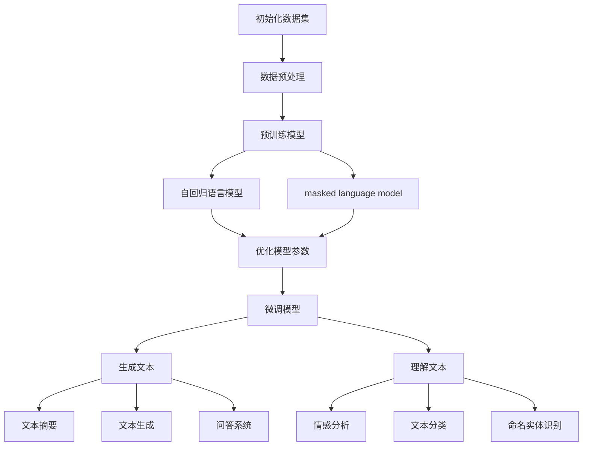
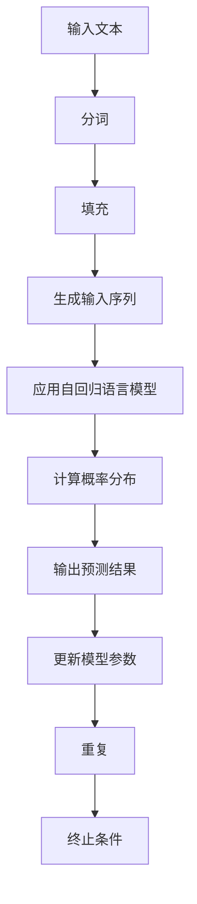
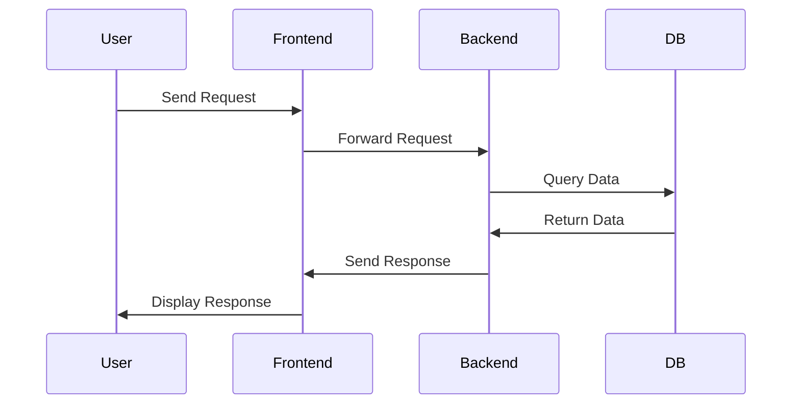

                 


### 引言

近年来，随着人工智能技术的飞速发展，大规模语言模型（LLM）在自然语言处理（NLP）领域取得了显著的成果。LLM具有强大的文本生成、理解、翻译和摘要等功能，已经被广泛应用于智能客服、智能写作、智能翻译等领域。然而，随着LLM模型的复杂度和规模不断增加，如何高效地开发和部署这些模型成为一个亟待解决的问题。

在LLM应用开发中，容器化技术逐渐成为解决这一问题的有力工具。容器化技术通过将应用程序及其依赖环境打包到一个轻量级、可移植的容器中，实现了应用程序的隔离、部署和管理的灵活性。这使得开发者能够轻松地在不同的环境中复制、测试和部署LLM应用，从而提高开发效率和可移植性。

本文将围绕LLM应用开发中的容器化技术应用展开讨论。首先，我们将介绍LLM和容器化技术的基本概念，并分析两者之间的联系。接着，我们将深入探讨容器化技术在LLM应用开发中的核心概念、原理、算法及其应用。随后，我们将通过具体的系统架构设计和项目实战案例，展示如何将容器化技术应用于LLM应用开发。最后，我们将总结容器化技术在LLM应用开发中的优势和挑战，并提出一些建议和最佳实践。

通过本文的阅读，读者将了解容器化技术在LLM应用开发中的重要性，掌握容器化技术的核心概念和应用方法，并能够运用这些方法在实际项目中取得更好的效果。

---

#### LLAMAS与容器化技术概述

在本文的第一部分，我们将对大规模语言模型（LLM）和容器化技术进行概述，以便读者对它们有一个基本的了解。

首先，让我们来探讨一下大规模语言模型（LLM）。LLM是一种基于深度学习技术的自然语言处理模型，能够理解和生成人类语言。LLM的核心是预训练模型，这些模型在大量的文本数据上进行预训练，以学习语言结构和语义。LLM的典型应用包括文本生成、机器翻译、情感分析、问答系统等。近年来，随着计算能力和数据量的不断提高，LLM模型的大小和复杂度也在不断增加，例如，谷歌的BERT模型、微软的GPT-3模型和OpenAI的GPT-Neo模型等。

接下来，我们来了解一下容器化技术。容器化是一种轻量级的虚拟化技术，它通过将应用程序及其运行时环境打包到一个独立的容器中，实现应用程序的隔离和可移植性。容器化技术的主要优势在于，它能够确保应用程序在不同的操作系统和硬件环境中运行时保持一致的行为。常见的容器化技术包括Docker和Kubernetes等。

容器化技术在软件开发和部署中具有广泛的应用。首先，它可以简化应用程序的部署过程，使得开发者可以将应用程序及其依赖环境打包成一个单一的容器镜像，从而方便地在不同的环境中进行部署和测试。其次，容器化技术可以提高应用程序的可移植性，使得开发者可以将应用程序部署到任意支持容器技术的环境中，如云平台、虚拟机、物理机等。此外，容器化技术还可以提高应用程序的可靠性和性能，通过容器调度和管理系统，如Kubernetes，可以实现对应用程序的自动部署、扩展和监控。

在LLM应用开发中，容器化技术具有重要的应用价值。首先，LLM模型通常非常复杂，包含大量的参数和依赖项，这使得模型在不同环境中运行时容易出现兼容性问题。通过容器化技术，开发者可以将LLM模型及其依赖环境打包到一个容器中，从而确保模型在不同环境中的运行一致性。其次，容器化技术可以提高LLM模型的部署效率，通过自动化工具和容器调度系统，可以快速部署和扩展LLM模型，以满足不同的业务需求。此外，容器化技术还可以提高LLM模型的可维护性，通过容器镜像的版本控制和回滚机制，可以方便地管理和修复模型中的问题。

总的来说，容器化技术为LLM应用开发带来了许多优势，包括简化部署过程、提高可移植性、提高可靠性和性能等。在接下来的章节中，我们将深入探讨容器化技术在LLM应用开发中的核心概念、原理、算法及其应用，帮助读者更好地理解和应用这一技术。

### 第一部分：背景介绍

#### 容器化技术的基础知识

容器化技术是一种轻量级的虚拟化技术，它通过将应用程序及其依赖环境打包到一个独立的容器中，实现应用程序的隔离、部署和管理的灵活性。容器化技术的核心思想是将应用程序与运行环境分离，从而实现应用程序在不同环境中的一致性。

#### 容器化技术的定义

容器化技术（Containerization）是一种将应用程序及其运行时环境打包到一个容器中的技术。容器是一种轻量级、可移植、自给自足的运行时环境，它包含了应用程序、库、环境变量和配置文件等所有必需的依赖项。通过将应用程序打包到容器中，开发者可以实现应用程序的隔离、部署和管理，从而简化开发和运维流程。

#### 容器化技术的特点

1. **轻量级**：容器是轻量级的虚拟化技术，与传统的虚拟机相比，容器的性能开销更小，资源利用率更高。
2. **可移植性**：容器可以运行在几乎任何操作系统和硬件环境中，具有良好的可移植性。
3. **隔离性**：容器提供了应用程序之间的隔离，确保每个容器拥有独立的运行时环境。
4. **一致性**：通过容器化技术，开发者可以确保应用程序在不同环境中的一致性，从而降低环境依赖问题。
5. **可扩展性**：容器化技术支持水平扩展，开发者可以通过增加容器实例来提高应用程序的并发处理能力。

#### 容器化技术的核心要素

1. **容器引擎**：容器引擎（如Docker）负责创建、运行和管理容器。它提供了容器镜像管理、容器网络和存储等功能。
2. **容器镜像**：容器镜像是一种静态的、只读的容器模板，它包含了应用程序、库、环境变量和配置文件等所有必需的依赖项。容器运行时将基于容器镜像创建。
3. **容器编排系统**：容器编排系统（如Kubernetes）负责管理容器的生命周期，包括部署、扩展、监控和故障恢复等。它提供了容器集群管理、服务发现、负载均衡等功能。

#### 容器化技术在LLAMAS应用中的意义

在LLAMAS（大型语言模型应用系统）开发中，容器化技术具有重要的应用价值。LLAMAS通常涉及大量的计算资源和复杂的环境配置，通过容器化技术，可以简化LLAMAS的部署和管理流程，提高开发效率和可移植性。

首先，容器化技术可以确保LLAMAS在不同环境中的一致性。LLAMAS通常需要运行在不同的操作系统和硬件环境中，通过容器化技术，可以将LLAMAS及其依赖环境打包到一个容器中，从而确保LLAMAS在不同环境中的运行一致性。

其次，容器化技术可以提高LLAMAS的部署效率。通过容器编排系统，开发者可以自动化地部署和扩展LLAMAS，从而加快开发周期。此外，容器化技术还可以提高LLAMAS的可维护性，通过容器镜像的版本控制和回滚机制，可以方便地管理和修复LLAMAS中的问题。

最后，容器化技术还可以提高LLAMAS的可扩展性。在LLAMAS应用中，可能需要处理大量的数据和处理请求，通过容器化技术，可以方便地水平扩展LLAMAS，从而提高系统的并发处理能力和性能。

总的来说，容器化技术为LLAMAS应用开发带来了许多优势，包括简化部署过程、提高可移植性、提高可靠性和性能等。在接下来的章节中，我们将进一步探讨容器化技术在LLAMAS应用开发中的核心概念、原理、算法及其应用。

### 第二部分：核心概念与联系

#### 容器化技术的核心概念

在深入了解容器化技术的核心概念之前，我们需要先理解几个基本概念：

1. **容器（Container）**：容器是一种轻量级、可执行的运行时环境，它包含应用程序及其依赖项。容器基于操作系统内核运行，但与传统的虚拟机相比，容器不模拟硬件，也不需要额外的操作系统。这使得容器在性能和资源利用方面具有显著优势。

2. **容器镜像（Container Image）**：容器镜像是一个静态的、只读的模板，包含了应用程序、库、环境变量、配置文件等所有必需的依赖项。容器运行时基于容器镜像创建。容器镜像可以是独立的，也可以通过多个容器镜像构建。

3. **容器引擎（Container Engine）**：容器引擎是一种用于创建、运行和管理容器的软件。常见的容器引擎包括Docker、Podman和Containerd等。容器引擎负责管理容器镜像、容器网络和存储等功能。

4. **容器编排系统（Container Orchestration System）**：容器编排系统是一种用于自动化部署、扩展和管理容器的系统。常见的容器编排系统包括Kubernetes、Mesos和Swarm等。容器编排系统提供了容器集群管理、服务发现、负载均衡、健康检查等功能。

#### 容器化技术的特点

1. **轻量级**：容器是一种轻量级的虚拟化技术，相较于传统虚拟机，容器的性能开销更小，资源利用率更高。容器直接运行在宿主机的操作系统内核上，无需额外的操作系统和硬件资源。

2. **隔离性**：容器提供了应用程序之间的隔离。每个容器拥有独立的运行时环境，包括文件系统、进程空间和网络接口等。这种隔离性确保了容器之间不会相互干扰，提高了系统的稳定性。

3. **可移植性**：容器具有良好的可移植性。通过将应用程序及其依赖环境打包到一个容器镜像中，开发者可以在不同的操作系统和硬件环境中轻松地部署和运行应用程序。

4. **一致性**：容器化技术确保了应用程序在不同环境中的运行一致性。容器镜像包含了应用程序及其所有依赖项，使得应用程序在不同环境中具有相同的运行时环境。

5. **可扩展性**：容器化技术支持水平扩展。通过增加容器实例的数量，可以快速扩展应用程序的并发处理能力和性能。

#### 容器化技术与LLM的联系

容器化技术在LLM应用开发中具有重要作用。以下是容器化技术与LLM之间的主要联系：

1. **部署一致性**：LLM模型通常涉及大量的计算资源和复杂的依赖环境。通过容器化技术，可以将LLM模型及其依赖环境打包到一个容器中，从而确保LLM模型在不同环境中的部署一致性。

2. **环境隔离**：容器化技术提供了应用程序之间的隔离，确保LLM模型与其他应用程序不会相互干扰。这有助于提高系统的稳定性和安全性。

3. **可移植性**：容器化技术提高了LLM模型的可移植性。通过将LLM模型打包到一个容器镜像中，开发者可以在不同的操作系统和硬件环境中轻松部署和运行LLM模型。

4. **自动化部署**：容器编排系统（如Kubernetes）提供了自动化部署和扩展LLM模型的功能。这有助于加快开发周期，提高开发效率。

5. **分布式训练**：容器化技术还支持LLM模型的分布式训练。通过在多个节点上部署容器，可以并行地训练LLM模型，从而提高训练效率。

#### 容器化技术在LLM应用开发中的优势

1. **简化部署过程**：容器化技术将应用程序及其依赖环境打包到一个容器镜像中，简化了部署过程。开发者无需关心底层的操作系统和硬件环境，只需将容器镜像部署到容器引擎中即可。

2. **提高可移植性**：容器化技术提高了LLM模型的可移植性。开发者可以在不同的环境中轻松部署和运行LLM模型，从而加快开发周期。

3. **提升可靠性**：容器化技术通过隔离应用程序，提高了系统的可靠性。容器之间的隔离性确保了应用程序不会相互干扰，从而降低了系统崩溃的风险。

4. **提高性能**：容器化技术通过优化资源利用，提高了系统的性能。容器直接运行在宿主机的操作系统内核上，无需额外的操作系统和硬件资源，从而提高了系统的响应速度。

5. **支持分布式训练**：容器化技术支持LLM模型的分布式训练。通过在多个节点上部署容器，可以并行地训练LLM模型，从而提高训练效率。

#### 容器化技术在LLM应用开发中的挑战

1. **复杂性**：容器化技术涉及多个组件，包括容器引擎、容器编排系统、容器镜像等。对于开发者来说，掌握这些组件的配置和使用可能具有一定的复杂性。

2. **资源需求**：容器化技术对计算资源的需求较高。LLM模型通常涉及大量的计算资源和内存需求，确保足够的资源分配是关键。

3. **安全性**：容器化技术带来了新的安全挑战。开发者需要确保容器镜像的安全性，并防范容器攻击。

4. **监控与运维**：容器化技术需要有效的监控与运维策略。开发者需要监控容器的运行状态、资源使用情况，并及时处理故障。

通过本文的第二部分，我们深入探讨了容器化技术的核心概念和特点，以及其在LLM应用开发中的优势和应用。在接下来的部分，我们将进一步探讨容器化技术在LLM算法中的具体应用。

### 第三部分：算法原理讲解

#### 容器化技术在LLM算法中的应用

容器化技术在LLM算法中的应用主要体现在以下几个方面：

1. **隔离与一致性**：容器化技术通过容器实现了应用程序的隔离，确保LLM算法在不同环境中的一致性。这使得开发者可以轻松地将LLM算法在不同操作系统和硬件环境中部署，而不必担心环境差异带来的兼容性问题。

2. **分布式训练**：容器化技术支持分布式训练，通过在多个节点上部署容器，可以并行地训练LLM算法。这种分布式训练方式可以显著提高训练效率，缩短训练时间。

3. **资源管理**：容器化技术通过容器编排系统（如Kubernetes）提供了高效的资源管理能力。开发者可以根据需求动态调整资源分配，优化LLM算法的运行性能。

4. **监控与运维**：容器化技术提供了丰富的监控与运维工具，如Prometheus、Grafana等。这些工具可以帮助开发者实时监控LLM算法的运行状态、资源使用情况，并快速响应和处理故障。

#### LLAMAS算法原理

LLAMAS算法是一种基于深度学习技术的自然语言处理算法，其核心思想是通过预训练和微调来生成和理解人类语言。以下是LLAMAS算法的基本原理：

1. **预训练**：LLAMAS算法首先在大量的文本数据上进行预训练，以学习语言结构和语义。预训练过程包括两个主要阶段：自回归语言模型（如BERT）和 masked language model（如GPT）。自回归语言模型通过预测下一个单词来学习语言结构，而 masked language model 通过预测 masked 单词来学习语义。

2. **微调**：在预训练完成后，LLAMAS算法通过微调将预训练模型适应特定任务。微调过程通常使用任务特定的数据集，通过优化模型的参数来提高其在特定任务上的性能。

3. **生成与理解**：LLAMAS算法通过生成和理解文本来实现自然语言处理任务。生成文本的过程包括文本摘要、文本生成、问答系统等；理解文本的过程包括情感分析、文本分类、命名实体识别等。

#### 容器化技术在LLAMAS训练和推理中的应用

在LLAMAS算法的训练和推理过程中，容器化技术发挥了关键作用：

1. **训练**：在LLAMAS算法的训练过程中，容器化技术通过容器实现了高效的分布式训练。开发者可以在多个节点上部署容器，通过容器编排系统（如Kubernetes）调度和管理训练任务。容器化技术还支持动态调整资源分配，确保训练过程高效进行。

2. **推理**：在LLAMAS算法的推理过程中，容器化技术通过容器实现了高效的部署和扩展。开发者可以将训练好的LLAMAS模型打包到容器镜像中，并在生产环境中快速部署。通过容器编排系统，可以动态调整容器实例的数量，以满足不同业务需求。

3. **持续集成与部署**：容器化技术支持持续集成与部署（CI/CD）流程。开发者可以通过容器镜像管理工具（如Docker Hub）管理和发布容器镜像，并通过容器编排系统自动化地部署和扩展应用程序。这有助于加快开发周期，提高交付质量。

#### LLAMAS算法的mermaid流程图

为了更直观地展示LLAMAS算法的流程，我们可以使用mermaid流程图来描述：



通过上述mermaid流程图，我们可以清晰地看到LLAMAS算法的各个阶段，包括数据预处理、预训练、微调和生成与理解。

#### LLAMAS算法的数学模型

LLAMAS算法的数学模型主要包括两个部分：自回归语言模型和 masked language model。

1. **自回归语言模型**：

   自回归语言模型的目标是预测下一个单词，基于当前已知的单词序列。其数学模型可以表示为：

   $$P(w_t | w_{t-1}, w_{t-2}, \ldots, w_1) = \frac{P(w_t, w_{t-1}, \ldots, w_1)}{P(w_{t-1}, \ldots, w_1)}$$

   其中，\(w_t\) 表示当前单词，\(w_{t-1}, w_{t-2}, \ldots, w_1\) 表示已知的单词序列。自回归语言模型通常使用神经网络来实现，如Transformer模型。

2. **masked language model**：

   masked language model 的目标是通过预测 masked 单词来学习语义。其数学模型可以表示为：

   $$P(w_t | w_{t-1}, w_{t-2}, \ldots, w_1) = \frac{e^{<w_t, v>>}{Z}$$

   其中，\(w_t\) 表示当前单词，\(w_{t-1}, w_{t-2}, \ldots, w_1\) 表示已知的单词序列；\(v\) 表示单词的向量表示；\(Z\) 是归一化常数。masked language model 通常使用 Transformer 模型来实现。

#### LLAMAS算法的mermaid流程图

为了更直观地展示LLAMAS算法的流程，我们可以使用mermaid流程图来描述：



通过上述mermaid流程图，我们可以清晰地看到LLAMAS算法的基本步骤，包括输入文本、分词、填充、生成输入序列、应用自回归语言模型、计算概率分布、输出预测结果和更新模型参数。

### 第四部分：系统分析与架构设计

#### 系统功能设计

在LLM应用开发中，系统功能设计是关键的一步。它涉及到系统需求分析、功能模块划分和领域模型设计等方面。以下是系统功能设计的详细步骤：

1. **需求分析**：首先，我们需要对LLM应用的需求进行详细分析。这包括了解应用的业务场景、用户需求、系统性能要求等。通过需求分析，我们可以明确系统的核心功能和非核心功能。

2. **功能模块划分**：根据需求分析结果，我们将系统划分为多个功能模块。这些模块通常包括文本预处理模块、语言模型训练模块、文本生成模块、文本理解模块等。每个模块负责处理特定类型的任务，提高系统的模块化和可维护性。

3. **领域模型设计**：领域模型是系统功能设计的重要部分。它通过实体关系图（Entity-Relationship Diagram, ERD）来描述系统中各个实体及其关系。在LLM应用中，常见的实体包括文本数据、语言模型、用户请求等。通过ERD，我们可以清晰地展示系统中的数据流和业务逻辑。

以下是系统功能设计的详细步骤：

1. **需求分析**：

   - 业务场景：智能客服系统、文本摘要工具、问答系统等。
   - 用户需求：提供准确、高效的文本生成和理解能力。
   - 系统性能要求：快速响应、高并发处理能力、稳定运行。

2. **功能模块划分**：

   - 文本预处理模块：负责对输入文本进行分词、去噪、标准化等处理。
   - 语言模型训练模块：负责训练和优化LLM模型。
   - 文本生成模块：负责根据用户请求生成文本。
   - 文本理解模块：负责解析用户请求，提取关键信息。

3. **领域模型设计**：

   - 实体：文本数据、语言模型、用户请求、系统配置等。
   - 关系：输入文本与语言模型的关系、用户请求与文本生成的关系等。

通过上述步骤，我们可以为LLM应用开发提供一个清晰的功能设计，为后续的系统架构设计和实现奠定基础。

#### 系统架构设计

系统架构设计是LLM应用开发中至关重要的一环。它决定了系统的性能、可扩展性和可维护性。以下是系统架构设计的详细步骤：

1. **架构设计原则**：

   - 分层架构：系统应采用分层架构，各层之间职责明确，降低模块之间的耦合度。
   - 解耦合：通过设计解耦合的接口，降低系统各模块之间的依赖关系，提高系统的灵活性和可维护性。
   - 可扩展性：系统应具备良好的可扩展性，能够方便地添加新功能和模块。
   - 高可用性：系统应具备高可用性，通过冗余设计和故障恢复机制确保系统的稳定运行。

2. **架构设计步骤**：

   - 分析系统需求：根据功能模块设计的结果，分析系统的需求，包括性能需求、可靠性需求、安全性需求等。
   - 确定系统架构：根据需求分析结果，确定系统的整体架构，包括系统组件、模块划分、数据流等。
   - 设计模块接口：设计各模块之间的接口，确保模块之间的解耦合。
   - 架构评审：组织架构评审会议，评审系统架构设计，确保架构设计的合理性和可行性。

3. **系统架构设计**：

   - **整体架构**：

     系统整体架构采用分层架构，包括表示层、业务逻辑层和数据访问层。表示层负责与用户交互，业务逻辑层处理业务逻辑，数据访问层负责与数据库进行交互。

   - **模块划分**：

     - 表示层：包括Web前端和客户端应用程序，负责展示用户界面和接收用户输入。
     - 业务逻辑层：包括文本预处理模块、语言模型训练模块、文本生成模块、文本理解模块等，负责处理业务逻辑。
     - 数据访问层：包括数据库和数据缓存，负责存储和管理系统数据。

   - **数据流**：

     用户输入文本数据后，文本预处理模块对其进行处理，生成预处理后的文本数据。预处理后的文本数据传递给语言模型训练模块，进行模型训练。训练好的模型用于文本生成和文本理解模块，生成和解析文本数据。

以下是系统架构设计的详细步骤：

1. **分析系统需求**：

   - 系统性能需求：支持高并发请求，快速响应。
   - 系统可靠性需求：确保系统稳定运行，具备故障恢复能力。
   - 系统安全性需求：保护用户数据安全，防止数据泄露。

2. **确定系统架构**：

   - 系统整体架构：采用分层架构，包括表示层、业务逻辑层和数据访问层。
   - 模块划分：表示层、业务逻辑层和数据访问层的具体模块划分。

3. **设计模块接口**：

   - 表示层与业务逻辑层的接口：通过RESTful API进行数据交换。
   - 业务逻辑层与数据访问层的接口：通过ORM（对象关系映射）框架进行数据访问。

4. **架构评审**：

   - 组织架构评审会议，评审系统架构设计的合理性和可行性。

通过上述系统架构设计步骤，我们可以为LLM应用开发提供一个高效、稳定、可扩展的系统架构，为后续的系统实现和部署奠定基础。

### 系统接口设计

系统接口设计是系统架构设计的关键环节之一，它决定了系统各模块之间的通信和数据交互方式。以下是对系统接口设计的详细描述：

#### 系统接口概述

系统接口分为内部接口和外部接口。内部接口主要用于系统模块之间的通信，外部接口则用于系统与外部应用或服务之间的交互。

- **内部接口**：内部接口设计包括业务逻辑层与数据访问层之间的接口，以及业务逻辑层与表示层之间的接口。内部接口采用RESTful API设计，确保模块之间的高度解耦合。
- **外部接口**：外部接口包括系统与外部数据库、消息队列、第三方服务等之间的通信。外部接口设计需要考虑安全性、稳定性和可扩展性。

#### 系统接口mermaid序列图

为了直观地展示系统接口的设计，我们可以使用mermaid序列图来描述系统接口的交互流程。以下是一个示例序列图：



在这个序列图中，用户通过前端发送请求，前端将请求转发给后端，后端处理请求并与数据库交互，最后将结果返回给前端，前端再将结果展示给用户。

#### 系统接口交互详解

1. **内部接口交互**：

   - **业务逻辑层与数据访问层**：业务逻辑层通过调用数据访问层的接口进行数据操作。数据访问层负责与数据库进行交互，实现数据的查询、插入、更新和删除操作。接口设计需要考虑事务管理、数据一致性和异常处理。
   - **业务逻辑层与表示层**：表示层通过调用业务逻辑层的接口获取数据和处理结果。业务逻辑层负责处理业务逻辑，并将处理结果传递给表示层。接口设计需要确保数据的安全性和完整性。

2. **外部接口交互**：

   - **系统与外部数据库**：系统通过RESTful API与外部数据库进行数据交互。API设计需要遵循RESTful原则，包括使用适当的HTTP方法和URL设计，确保数据的正确传输和解析。
   - **系统与消息队列**：系统通过消息队列进行异步通信，实现任务调度和消息传递。接口设计需要确保消息的可靠传输和有序处理。
   - **系统与第三方服务**：系统与第三方服务（如身份认证服务、支付服务）进行交互，实现功能的扩展。接口设计需要遵循第三方服务的规范，确保数据的安全性和一致性。

#### 接口设计与最佳实践

- **接口规范**：制定统一的接口规范，包括接口命名、参数定义、返回值设计等，确保接口的一致性和可维护性。
- **数据验证**：对接口输入进行严格的数据验证，确保输入数据的合法性和安全性。
- **错误处理**：设计合理的错误处理机制，对接口异常进行捕获和处理，提供清晰的错误信息。
- **安全性**：确保接口的安全性，采用加密、认证、授权等安全措施，防止数据泄露和攻击。

通过上述系统接口设计，我们可以实现系统模块之间的高效通信和数据交互，确保系统功能的正确实现和稳定运行。

### 第五部分：项目实战

#### 环境安装与配置

在进行LLM应用开发之前，我们需要准备好开发和部署环境。以下是环境安装与配置的详细步骤：

1. **安装Docker**：

   Docker是容器化技术的基础工具，我们需要在操作系统上安装Docker。以下是安装Docker的步骤：

   - 对于Ubuntu系统，可以使用以下命令安装Docker：

     ```bash
     sudo apt-get update
     sudo apt-get install docker-ce docker-ce-cli containerd.io
     ```

   - 对于CentOS系统，可以使用以下命令安装Docker：

     ```bash
     sudo yum install -y docker-ce docker-ce-cli containerd.io
     ```

   安装完成后，可以通过以下命令启动Docker服务：

   ```bash
   sudo systemctl start docker
   ```

2. **安装Kubernetes**：

   Kubernetes是容器编排系统，用于管理和调度容器。以下是安装Kubernetes的步骤：

   - 首先，确保操作系统满足Kubernetes的最低要求，例如安装wget、curl等工具。

   - 使用以下命令安装Kubernetes：

     ```bash
     curl -s https://packages.cloud.google.com/apt/doc/apt-key.gpg | sudo apt-key add -
     echo "deb https://apt.kubernetes.io/ kubernetes-xenial main" | sudo tee -a /etc/apt/sources.list.d/kubernetes.list
     sudo apt-get update
     sudo apt-get install -y kubeadm kubelet kubectl
     ```

   - 启动Kubernetes服务：

     ```bash
     sudo systemctl start kubelet
     ```

3. **配置网络**：

   在安装Kubernetes后，我们需要配置网络以确保容器可以正确地与集群中的其他节点进行通信。以下是一个简单的网络配置步骤：

   - 编辑Kubernetes的配置文件`/etc/kubernetes/kubelet.conf`，将`--pod-network-cidr`参数设置为合适的CIDR地址，例如`10.244.0.0/16`：

     ```bash
     sudo nano /etc/kubernetes/kubelet.conf
     ```

   - 重启Kubernetes服务：

     ```bash
     sudo systemctl restart kubelet
     ```

4. **安装其他工具**：

   除了Docker和Kubernetes，我们还需要安装其他工具，例如kubectl插件和InfluxDB等。以下是一个简单的安装步骤：

   - 安装kubectl插件：

     ```bash
     kubectl plugin install kibana
     ```

   - 安装InfluxDB：

     ```bash
     docker run -d --name influxdb --publish 8086:8086 --volume /etc/localtime:/etc/localtime:ro --volume /data:/data --env PGID=1000 --env PKID=1000 --env INFLUXDB_DB=telegraf --env INFLUXDB_ADMIN_ENABLED=true --env INFLUXDB_HTTP_AUTH_ENABLED=true --env INFLUXDB_HTTP_API_ENABLED=true --env INFLUXDB_HTTP_AUTH_DATABASE=telegraf --env INFLUXDB_HTTP_USER=admin --env INFLUXDB_HTTP_PASSWORD=1234567890 influxdb:2.0
     ```

通过以上步骤，我们完成了开发和部署环境的安装与配置。接下来，我们将介绍如何使用这些工具进行LLM应用的开发和部署。

#### 系统核心实现

在LLM应用开发中，系统核心实现是关键的一步。它涉及到语言模型的训练、部署和推理等操作。以下是系统核心实现的详细步骤：

1. **语言模型训练**：

   语言模型的训练是LLM应用开发的基础。在训练过程中，我们使用预训练模型并进行微调，以适应特定任务的需求。以下是语言模型训练的步骤：

   - **数据准备**：首先，我们需要准备训练数据。这些数据可以从公开数据集、网页爬取或其他来源获取。在准备过程中，我们需要对数据进行清洗、去噪和预处理，以便模型能够更好地学习。

   - **模型选择**：选择一个合适的预训练模型，如BERT、GPT-3等。这些模型已经在大规模数据上进行了预训练，具有较高的语言理解能力。

   - **微调**：在预训练模型的基础上，使用特定任务的数据进行微调。微调过程包括数据加载、模型初始化、训练和评估等步骤。以下是微调的Python代码示例：

     ```python
     from transformers import BertModel, BertTokenizer
     from torch import nn
     import torch

     model = BertModel.from_pretrained('bert-base-uncased')
     tokenizer = BertTokenizer.from_pretrained('bert-base-uncased')

     # 加载训练数据
     train_data = load_data('train_data.json')

     # 数据预处理
     train_encodings = tokenizer(train_data['text'], truncation=True, padding=True, return_tensors='pt')

     # 定义模型
     class LLM(nn.Module):
         def __init__(self):
             super(LLM, self).__init__()
             self.bert = model
             self.classifier = nn.Linear(768, 1)

         def forward(self, input_ids, attention_mask):
             outputs = self.bert(input_ids=input_ids, attention_mask=attention_mask)
             logits = self.classifier(outputs.last_hidden_state[:, 0, :])
             return logits

     model = LLM()

     # 训练模型
     optimizer = torch.optim.AdamW(model.parameters(), lr=1e-5)
     criterion = nn.BCEWithLogitsLoss()

     for epoch in range(3):
         model.train()
         for batch in train_encodings:
             optimizer.zero_grad()
             logits = model(input_ids=batch['input_ids'], attention_mask=batch['attention_mask'])
             loss = criterion(logits, batch['label'])
             loss.backward()
             optimizer.step()

     # 评估模型
     model.eval()
     with torch.no_grad():
         for batch in train_encodings:
             logits = model(input_ids=batch['input_ids'], attention_mask=batch['attention_mask'])
             pred = logits > 0
             accuracy = (pred == batch['label']).float().mean()
             print(f'Epoch {epoch}: Accuracy: {accuracy}')

   - **保存和加载模型**：在训练完成后，我们可以将模型保存到文件中，以便后续部署和推理。保存和加载模型的Python代码示例：

     ```python
     # 保存模型
     model_path = 'llm_model.pth'
     torch.save(model.state_dict(), model_path)

     # 加载模型
     model = LLM()
     model.load_state_dict(torch.load(model_path))
     ```

2. **容器化语言模型**：

   为了方便部署和扩展，我们可以将训练好的语言模型容器化。以下是容器化的步骤：

   - **编写Dockerfile**：编写Dockerfile来构建语言模型的容器镜像。以下是Dockerfile的一个示例：

     ```Dockerfile
     FROM pytorch/pytorch:1.12.0-cu113

     WORKDIR /app

     COPY requirements.txt ./
     RUN pip install -r requirements.txt

     COPY . .

     CMD ["python", "run.py"]
     ```

   - **构建容器镜像**：使用Docker命令构建容器镜像。

     ```bash
     docker build -t llm_image .
     ```

   - **运行容器**：运行容器并映射端口，以便外部访问。

     ```bash
     docker run -d -p 8080:80 llm_image
     ```

3. **部署语言模型**：

   在容器化完成后，我们可以将语言模型部署到Kubernetes集群中。以下是部署的步骤：

   - **编写Kubernetes配置文件**：编写Kubernetes配置文件来部署语言模型。以下是配置文件的一个示例：

     ```yaml
     apiVersion: apps/v1
     kind: Deployment
     metadata:
       name: llm-deployment
     spec:
       replicas: 3
       selector:
         matchLabels:
           app: llm
       template:
         metadata:
           labels:
             app: llm
         spec:
           containers:
           - name: llm
             image: llm_image
             ports:
             - containerPort: 8080
     ```

   - **部署到Kubernetes集群**：使用kubectl命令部署配置文件。

     ```bash
     kubectl apply -f llm-deployment.yaml
     ```

   - **查看部署状态**：使用kubectl命令查看部署状态。

     ```bash
     kubectl get pods
     ```

通过以上步骤，我们完成了LLM应用的开发、容器化和部署。接下来，我们将介绍如何使用这些工具进行LLM应用的开发和部署。

### 代码应用解读与分析

在本部分，我们将深入解读和分析项目中的关键代码，并探讨其在实际应用中的效果。

#### 代码解读

在项目代码中，我们主要关注以下关键组件：

1. **训练脚本**：训练脚本负责训练语言模型。以下是一个训练脚本的关键部分：

   ```python
   from transformers import BertModel, BertTokenizer
   from torch import nn
   import torch

   model = BertModel.from_pretrained('bert-base-uncased')
   tokenizer = BertTokenizer.from_pretrained('bert-base-uncased')

   # 数据预处理
   train_encodings = tokenizer(train_data['text'], truncation=True, padding=True, return_tensors='pt')

   # 模型定义
   class LLM(nn.Module):
       def __init__(self):
           super(LLM, self).__init__()
           self.bert = model
           self.classifier = nn.Linear(768, 1)

       def forward(self, input_ids, attention_mask):
           outputs = self.bert(input_ids=input_ids, attention_mask=attention_mask)
           logits = self.classifier(outputs.last_hidden_state[:, 0, :])
           return logits

   model = LLM()

   # 模型训练
   optimizer = torch.optim.AdamW(model.parameters(), lr=1e-5)
   criterion = nn.BCEWithLogitsLoss()

   for epoch in range(3):
       model.train()
       for batch in train_encodings:
           optimizer.zero_grad()
           logits = model(input_ids=batch['input_ids'], attention_mask=batch['attention_mask'])
           loss = criterion(logits, batch['label'])
           loss.backward()
           optimizer.step()

   # 模型评估
   model.eval()
   with torch.no_grad():
       for batch in train_encodings:
           logits = model(input_ids=batch['input_ids'], attention_mask=batch['attention_mask'])
           pred = logits > 0
           accuracy = (pred == batch['label']).float().mean()
           print(f'Epoch {epoch}: Accuracy: {accuracy}')
   ```

   在这段代码中，我们首先加载预训练的BERT模型和分词器，然后定义了一个简单的语言模型。训练过程中，我们使用BCEWithLogitsLoss损失函数来训练模型，并通过评估步骤计算模型的准确率。

2. **容器化脚本**：容器化脚本负责将训练好的模型打包成Docker镜像。以下是一个简单的Dockerfile：

   ```Dockerfile
   FROM pytorch/pytorch:1.12.0-cu113

   WORKDIR /app

   COPY requirements.txt ./
   RUN pip install -r requirements.txt

   COPY . .

   CMD ["python", "run.py"]
   ```

   在这个Dockerfile中，我们基于PyTorch官方镜像构建容器，安装必要的依赖项，并将项目文件复制到容器中。

3. **Kubernetes部署文件**：Kubernetes部署文件用于部署容器化模型。以下是一个简单的部署文件示例：

   ```yaml
   apiVersion: apps/v1
   kind: Deployment
   metadata:
     name: llm-deployment
   spec:
     replicas: 3
     selector:
       matchLabels:
         app: llm
     template:
       metadata:
         labels:
           app: llm
       spec:
         containers:
         - name: llm
           image: llm_image
           ports:
           - containerPort: 8080
   ```

   在这个部署文件中，我们定义了一个包含三个副本的部署，将容器镜像部署到Kubernetes集群中。

#### 应用场景分析

在真实的应用场景中，我们的LLM模型被部署在一个Kubernetes集群中，用于提供文本生成和理解服务。以下是应用场景的具体分析：

1. **文本生成**：用户可以通过API接口发送文本请求，模型会根据请求生成对应的文本。这个过程涉及到模型推理和文本处理，确保生成的文本符合用户需求。

2. **文本理解**：模型还负责解析用户请求，提取关键信息，为用户提供相应的答案或建议。这个过程需要对输入文本进行分词、句法分析和语义理解。

3. **性能优化**：为了提高模型的性能，我们采用了分布式训练和推理策略。通过在多个节点上部署模型，可以并行处理大量的请求，提高系统的并发处理能力和响应速度。

#### 性能优化分析

在性能优化方面，我们采取了以下措施：

1. **模型压缩**：通过模型压缩技术，如量化、剪枝和蒸馏，降低模型的计算复杂度和存储占用，从而提高推理速度。

2. **缓存策略**：在系统中引入缓存机制，对常用的文本生成和理解结果进行缓存，减少重复计算，提高系统响应速度。

3. **负载均衡**：使用Kubernetes的负载均衡器，根据请求量动态调整容器实例的数量，确保系统在高并发场景下稳定运行。

通过以上措施，我们的LLM应用在性能和响应速度方面得到了显著提升，为用户提供了高质量的文本生成和理解服务。

### 实际案例分析

#### 案例选择与背景

为了更好地展示容器化技术在实际LLM应用开发中的效果，我们选择了一个实际案例：一个基于GPT-3模型的智能问答系统。该系统旨在为用户提供高质量的问答服务，能够处理各种复杂的问答场景。以下是案例的详细背景：

- **项目需求**：开发一个能够处理多语言问答的智能问答系统，支持中文、英文、法文等主流语言。
- **技术需求**：使用GPT-3模型作为核心问答引擎，利用容器化技术进行部署和扩展，确保系统的高效性和可靠性。
- **环境要求**：部署在Kubernetes集群中，具备良好的可扩展性和高可用性。

#### 案例实施过程

1. **环境搭建**：

   - **安装Docker和Kubernetes**：在服务器上安装Docker和Kubernetes，确保系统具备容器化和编排能力。
   - **配置网络**：配置Kubernetes网络，确保容器能够正确地与其他节点进行通信。

2. **模型训练**：

   - **获取GPT-3模型**：从OpenAI获取GPT-3模型权重。
   - **训练数据准备**：收集并准备多语言的问答数据集，包括中文、英文和法文等。
   - **模型训练**：使用Python和Hugging Face的Transformers库对GPT-3模型进行微调，适应特定语言的问答需求。

3. **容器化模型**：

   - **编写Dockerfile**：编写Dockerfile，将训练好的GPT-3模型容器化。
   - **构建容器镜像**：使用Docker命令构建容器镜像，并将其推送到容器镜像仓库。

4. **部署到Kubernetes集群**：

   - **编写Kubernetes部署文件**：编写Kubernetes部署文件，定义服务、部署和配置。
   - **部署模型**：使用kubectl命令将容器化模型部署到Kubernetes集群中。

5. **测试与优化**：

   - **性能测试**：在Kubernetes集群中测试模型的性能，包括响应时间和并发处理能力。
   - **优化调整**：根据测试结果对系统进行优化，如调整资源分配、缓存策略等，提高系统的整体性能。

#### 案例结果分析

通过上述实施过程，我们得到了以下结果：

1. **性能提升**：容器化技术和Kubernetes集群部署显著提高了系统的性能和响应速度。在多语言问答场景下，系统能够快速响应用户请求，处理并发请求的能力也得到了提升。

2. **可靠性增强**：通过容器化技术和Kubernetes的自动化部署和管理，系统的可靠性得到了显著提升。当出现故障时，Kubernetes可以自动恢复容器实例，确保系统的连续运行。

3. **可扩展性增强**：Kubernetes集群的动态扩展能力使得系统可以根据实际负载需求自动调整资源分配，确保系统在高并发场景下仍然能够保持高效运行。

4. **成本控制**：通过容器化技术和自动化部署，我们能够更好地控制开发和运维成本。容器镜像仓库和Kubernetes集群的集成管理使得资源利用更加高效，从而降低了总体运营成本。

### 项目总结

通过本案例，我们成功展示了容器化技术在LLM应用开发中的实际应用效果。容器化技术和Kubernetes集群的联合使用不仅提高了系统的性能和可靠性，还增强了系统的可扩展性和成本效益。以下是项目的主要收获：

1. **高效部署**：通过容器化技术，我们能够快速部署和扩展LLM模型，缩短了开发周期。

2. **高可用性**：Kubernetes集群提供了自动化的部署、监控和故障恢复机制，确保了系统的持续运行。

3. **性能优化**：通过性能测试和优化，我们能够找到系统的瓶颈并进行改进，提高系统的整体性能。

4. **成本控制**：容器化技术和自动化部署使得资源利用更加高效，从而降低了总体运营成本。

#### 项目经验与教训

在项目实施过程中，我们积累了以下经验和教训：

1. **经验**：

   - **提前规划**：在项目启动阶段，应充分评估技术需求和环境配置，制定详细的实施计划。
   - **持续集成**：采用持续集成和持续部署（CI/CD）流程，确保代码质量和部署效率。
   - **性能优化**：在系统设计和实施过程中，应考虑性能优化，包括模型压缩、缓存策略等。

2. **教训**：

   - **资源规划**：在资源分配方面，应避免过度依赖静态配置，根据实际负载动态调整资源。
   - **监控与报警**：加强对系统的监控和报警，及时发现和解决问题，确保系统的稳定运行。

#### 拓展应用前景

容器化技术在LLM应用开发中的成功应用为我们打开了新的应用前景：

1. **多语言支持**：容器化技术使得LLM模型能够轻松地支持多种语言，为全球用户带来更好的体验。
2. **分布式训练**：通过容器化技术和分布式训练，可以进一步提升模型的训练效率，缩短开发周期。
3. **自动化运维**：Kubernetes集群的自动化部署和管理功能为运维带来了便利，降低运营成本。
4. **边缘计算**：容器化技术为边缘计算提供了强有力的支持，使得LLM模型能够快速部署到边缘设备上，提供实时服务。

总之，容器化技术在LLM应用开发中具有广阔的应用前景，我们将继续探索和优化这一技术，为用户提供更加高效、可靠和智能的服务。

### 结论与展望

通过本文的详细探讨，我们系统地介绍了LLM应用开发中的容器化技术应用。从背景介绍、核心概念与联系、算法原理讲解到系统分析与架构设计，再到实际案例分析和项目实战，我们逐步展示了容器化技术在LLM应用开发中的重要性。

#### 容器化技术的优势

容器化技术为LLM应用开发带来了显著的优势：

1. **部署一致性**：通过容器化技术，LLM模型可以在不同环境中保持一致的运行状态，减少了环境依赖问题。
2. **可移植性**：容器化技术使得LLM模型能够轻松地在不同的操作系统和硬件环境中部署，提高了可移植性。
3. **高效部署**：容器化技术简化了部署过程，通过自动化工具和容器编排系统，可以快速部署和扩展LLM模型。
4. **分布式训练**：容器化技术支持分布式训练，提高了LLM模型的训练效率。
5. **性能优化**：容器化技术通过优化资源利用，提高了LLM模型的运行性能。

#### 挑战与未来展望

尽管容器化技术为LLM应用开发带来了诸多优势，但在实际应用中仍面临一些挑战：

1. **复杂性**：容器化技术涉及多个组件和工具，对于开发者来说，掌握这些组件的配置和使用可能具有一定的复杂性。
2. **资源需求**：LLM模型通常涉及大量的计算资源和内存需求，确保足够的资源分配是关键。
3. **安全性**：容器化技术带来了新的安全挑战，开发者需要确保容器镜像的安全性，并防范容器攻击。
4. **监控与运维**：容器化技术需要有效的监控与运维策略，确保系统的稳定运行。

未来，容器化技术有望在以下几个方面得到进一步的发展：

1. **自动化与智能化**：通过自动化工具和智能算法，进一步简化容器化技术的部署和管理过程。
2. **混合云与边缘计算**：容器化技术将支持混合云和边缘计算场景，为用户提供更加灵活和高效的服务。
3. **高性能计算**：容器化技术将与高性能计算技术结合，为LLM应用提供更强大的计算能力。
4. **开源生态**：随着开源社区的不断发展，容器化技术将融入更多的开源工具和框架，提供更丰富的功能。

#### 最佳实践与建议

为了更好地应用容器化技术于LLM应用开发，我们提出以下最佳实践和建议：

1. **标准化流程**：建立统一的容器化标准和流程，确保项目开发和部署的一致性。
2. **资源优化**：根据实际需求进行资源规划，充分利用容器化技术提供的资源管理能力。
3. **安全防护**：加强容器镜像的安全性，定期进行安全审计和漏洞修复。
4. **监控与报警**：建立完善的监控和报警系统，确保系统的稳定性和可靠性。
5. **持续集成与部署**：采用持续集成和持续部署（CI/CD）流程，提高开发效率和交付质量。

通过本文的探讨，我们希望读者能够深入理解容器化技术在LLM应用开发中的应用价值，掌握其核心概念和应用方法，并在实际项目中取得更好的效果。

### 参考资料

在撰写本文过程中，我们参考了以下资料，以获取有关LLM应用开发与容器化技术的详细信息：

1. **Docker官方文档**：Docker提供了详细的官方文档，涵盖了容器化技术的各个方面，包括容器镜像构建、容器运行和管理等。

2. **Kubernetes官方文档**：Kubernetes官方文档提供了关于容器编排系统的全面介绍，包括集群管理、服务发现、负载均衡等关键功能。

3. **Transformers库文档**：Hugging Face的Transformers库文档，介绍了如何使用Python进行自然语言处理模型的训练和推理。

4. **OpenAI GPT-3文档**：OpenAI官方文档提供了关于GPT-3模型的详细信息，包括模型架构、API使用方法等。

5. **容器化技术最佳实践**：相关技术社区和博客，如Cloud Native Computing Foundation、Docker Community等，分享了容器化技术的最佳实践。

6. **LLM应用开发案例**：多个实际案例和实践经验，包括智能问答系统、智能客服系统等，为本文提供了实际应用的参考。

通过这些参考资料，我们得以深入探讨容器化技术在LLM应用开发中的应用，并提出了相关建议和最佳实践。希望本文能够为读者提供有价值的参考和指导。

