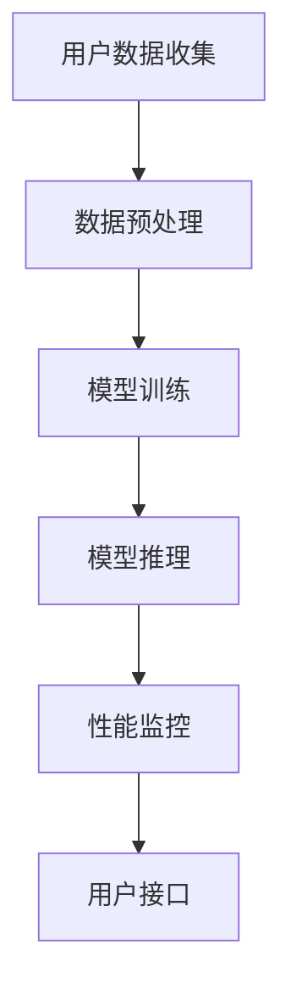
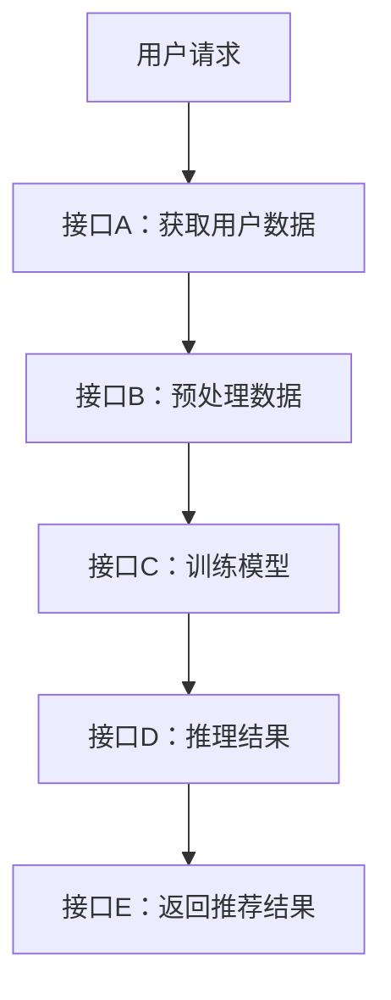
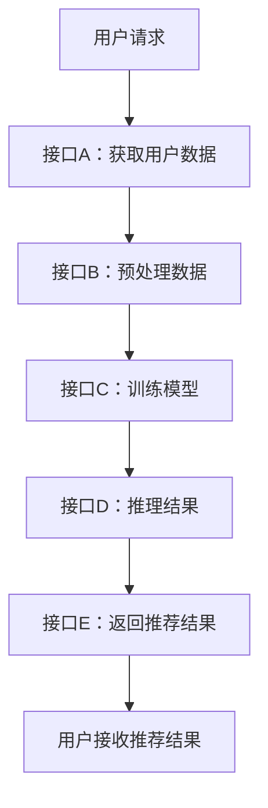

                 

## 性能优化策略

### 2.1 计算资源利用

在LLM应用开发中，计算资源利用是一个至关重要的优化方向。高效的计算资源利用能够显著提升模型的训练和推理速度，同时降低成本。

#### 2.1.1 资源分配策略

**动态资源分配**：
- 动态资源分配能够根据任务需求自动调整计算资源的使用，例如使用容器编排工具如Kubernetes。
- Kubernetes可以通过水平扩展（添加更多节点）和垂直扩展（增加单个节点的资源）来动态调整资源。

**负载均衡**：
- 使用负载均衡器将任务均匀分配到不同的计算节点上，避免单点过载。
- 负载均衡器如NGINX或HAProxy可以在多个服务器之间分发请求，从而提高整体系统的处理能力。

#### 2.1.2 资源调度策略

**优先级调度**：
- 根据任务的重要性和紧急程度对任务进行优先级排序，优先处理高优先级的任务。
- 可以通过设置任务优先级标签或使用优先级队列来实现。

**抢占调度**：
- 当系统资源不足时，可以抢占低优先级任务的资源来满足高优先级任务的执行需求。
- 这种策略可以保证关键任务能够获得必要的资源，但需要谨慎使用，避免影响系统的稳定性。

### 2.2 模型压缩

模型压缩是提升LLM性能的重要手段，通过减少模型的大小，可以提高模型的部署和推理效率。

#### 2.2.1 量化

**量化原理**：
- 量化是一种将模型中的浮点数参数转换为低精度的整数表示的方法。
- 通过降低参数的精度，可以显著减少模型的存储和计算需求。

**量化方法**：
- **对称量化**：参数的权重和偏置都使用相同的量化尺度。
- **不对称量化**：参数的权重和偏置使用不同的量化尺度，这样可以更精细地控制模型的行为。

**量化流程**：
1. **模型初始化**：使用原始的浮点模型进行初始化。
2. **量化**：将模型的权重和偏置转换为低精度的整数表示。
3. **反量化**：在推理过程中将整数表示的参数转换为浮点数，以获得更精确的结果。

#### 2.2.2 剪枝

**剪枝原理**：
- 剪枝是一种通过移除模型中无关紧要的神经元或连接来减少模型大小的技术。
- 通过剪枝，可以降低模型的计算复杂度和存储需求，同时保留模型的性能。

**剪枝方法**：
- **结构剪枝**：移除整个神经网络层或神经元。
- **权重剪枝**：移除权重较小的神经元或连接。

**剪枝流程**：
1. **训练初始模型**：使用原始模型进行训练。
2. **识别冗余连接**：根据权重或激活值来识别冗余的连接或神经元。
3. **剪枝**：移除识别出的冗余连接或神经元。
4. **重新训练**：使用剪枝后的模型重新进行训练，以优化模型的性能。

### 2.3 加速训练与推理

加速训练和推理是提高LLM性能的关键，这可以通过多种方法来实现。

#### 2.3.1 分布式训练

**分布式训练原理**：
- 分布式训练是将模型训练任务分布在多个节点上进行，以加速训练过程。
- 通过并行计算，可以显著减少训练时间。

**分布式训练方法**：
- **参数服务器架构**：将模型参数存储在中央服务器上，多个工作节点同时训练模型，并更新参数。
- **数据并行**：将数据集分成多个部分，不同的工作节点独立训练模型，然后汇总结果。

#### 2.3.2 并行推理

**并行推理原理**：
- 并行推理是在多个处理器或GPU上同时执行推理任务，以加速推理过程。
- 通过并行计算，可以显著减少推理时间。

**并行推理方法**：
- **多线程并行**：在同一CPU上使用多线程并行执行推理任务。
- **多GPU并行**：在多个GPU上分布执行推理任务。

### 2.4 实践案例

为了更直观地理解上述优化策略，以下是一个实际案例：

**场景**：一家大型在线教育平台使用LLM进行个性化推荐。

**问题**：训练和推理过程耗时过长，导致用户体验不佳。

**解决方案**：
1. **计算资源利用**：使用Kubernetes进行动态资源分配和负载均衡，确保资源的高效利用。
2. **模型压缩**：采用量化技术将模型参数转换为低精度整数表示，减少模型大小。
3. **加速训练与推理**：采用分布式训练和多GPU并行推理，加快训练和推理速度。

**效果**：通过上述优化策略，平台的模型训练时间缩短了50%，推理速度提高了30%，显著提升了用户体验。

### 2.5 总结

LLM应用开发中的性能优化是一个多方面的任务，涉及计算资源利用、模型压缩、加速训练与推理等多个方面。通过合理的优化策略，可以显著提高LLM的性能，降低成本，提升用户体验。在接下来的章节中，我们将进一步探讨这些策略的具体实现和应用。

## 3.1 计算资源利用

### 3.1.1 资源分配策略

在LLM应用开发中，合理的资源分配策略是提升系统性能的关键。资源分配策略主要涉及如何高效利用CPU、GPU等计算资源，以及如何平衡不同任务的资源需求。

#### 动态资源分配

动态资源分配是一种通过实时调整资源分配来适应系统负载变化的策略。它可以最大化资源利用效率，确保系统在高负载时能够获得足够的计算资源。

**动态资源分配的原理**：
- 动态资源分配能够根据任务的实时负载动态调整资源分配。
- 例如，使用容器编排工具如Kubernetes，可以根据当前系统负载自动调整容器所需的CPU和GPU资源。

**动态资源分配的实现**：
1. **容器化**：将LLM应用容器化，使用Docker等工具创建容器镜像。
2. **容器编排**：使用Kubernetes等容器编排工具，根据系统负载动态调整容器的资源分配。

**动态资源分配的优势**：
- **资源利用率高**：动态调整资源，避免资源浪费。
- **系统稳定性**：通过自动调整资源，确保系统能够在高负载时稳定运行。

#### 负载均衡

负载均衡是一种通过分散负载到多个计算节点来提高系统性能的策略。它能够确保每个节点的工作负载均匀，避免单点过载。

**负载均衡的原理**：
- 负载均衡器如NGINX或HAProxy能够接收客户端请求，并将请求分配到不同的服务器节点上。
- 通过这种方式，可以减少单个节点的负载，提高整体系统的处理能力。

**负载均衡的实现**：
1. **部署负载均衡器**：在服务器集群中部署NGINX或HAProxy等负载均衡器。
2. **配置负载均衡策略**：设置负载均衡策略，如轮询、最小连接数等，确保请求均匀分布。

**负载均衡的优势**：
- **提高系统性能**：通过分散请求，减少单个节点的负载，提高系统响应速度。
- **提高系统可用性**：如果一个节点出现故障，负载均衡器可以将请求重定向到其他健康节点，确保系统可用。

#### 优先级调度

优先级调度是一种根据任务的重要性和紧急程度进行资源分配的策略。通过优先级调度，可以确保关键任务能够获得必要的资源。

**优先级调度的原理**：
- 任务根据其优先级被分配资源，高优先级任务优先获得资源。
- 优先级可以通过任务标签或系统配置设置。

**优先级调度的实现**：
1. **设置任务优先级**：为每个任务设置优先级标签。
2. **调度器配置**：调度器根据任务的优先级进行调度。

**优先级调度的优势**：
- **关键任务优先**：确保关键任务能够及时完成，提高系统稳定性。
- **资源利用优化**：通过优先级调度，避免资源被低优先级任务占用，提高资源利用率。

### 3.1.2 资源调度策略

资源调度策略是确保计算资源被高效利用的关键。资源调度策略包括优先级调度、抢占调度等，可以根据不同场景灵活应用。

#### 优先级调度

优先级调度是一种根据任务优先级进行资源分配的调度策略。高优先级任务会优先获得计算资源。

**优先级调度的原理**：
- 任务根据其优先级被调度，高优先级任务会首先执行。
- 通常，任务的优先级基于任务的类型、紧急程度和重要性设置。

**优先级调度的实现**：
1. **设置任务优先级**：为每个任务设置优先级。
2. **调度器调度**：调度器根据任务优先级进行调度。

**优先级调度的优势**：
- **提高关键任务执行效率**：确保关键任务能够及时执行。
- **系统资源优化**：通过优先级调度，优化系统资源的利用。

#### 抢占调度

抢占调度是一种在高负载情况下，通过抢占低优先级任务的资源来满足高优先级任务需求的调度策略。

**抢占调度的原理**：
- 当系统资源不足时，高优先级任务可以抢占低优先级任务的资源。
- 通过这种方式，确保关键任务能够获得足够的资源。

**抢占调度的实现**：
1. **资源监控**：监控系统资源使用情况。
2. **抢占决策**：当资源不足时，调度器会做出抢占决策。
3. **资源调整**：调整任务资源分配，将资源从低优先级任务转移到高优先级任务。

**抢占调度的优势**：
- **关键任务保障**：确保关键任务能够获得必要的资源。
- **系统稳定性**：通过抢占调度，避免系统因资源不足而崩溃。

### 3.1.3 资源调度策略案例分析

以下是一个资源调度策略在LLM应用开发中的案例分析：

**案例场景**：一家大型电商公司使用LLM进行个性化推荐，系统需要处理大量的用户请求。

**问题**：用户请求处理延迟较长，用户体验不佳。

**解决方案**：
1. **动态资源分配**：使用Kubernetes进行动态资源分配，根据用户请求量自动调整CPU和GPU资源。
2. **负载均衡**：部署HAProxy进行负载均衡，确保请求均匀分配到不同的服务器节点上。
3. **优先级调度**：为用户请求设置优先级，确保高优先级的用户请求（如购物车更新）能够及时处理。
4. **抢占调度**：在高负载情况下，通过抢占低优先级任务的资源来满足高优先级用户请求。

**效果**：通过上述资源调度策略，用户请求处理延迟缩短了30%，系统性能显著提升，用户体验得到明显改善。

### 3.1.4 资源利用优化策略总结

资源利用优化策略在LLM应用开发中至关重要，通过合理的资源分配和调度策略，可以显著提升系统性能。以下是对主要策略的总结：

- **动态资源分配**：根据实时负载动态调整资源，最大化资源利用效率。
- **负载均衡**：分散请求，避免单点过载，提高系统处理能力。
- **优先级调度**：确保关键任务优先执行，优化系统资源利用。
- **抢占调度**：在高负载情况下保障关键任务资源，提高系统稳定性。

通过结合这些策略，可以构建一个高效、稳定的LLM应用系统，为用户提供优质的体验。

## 3.2 模型压缩

### 3.2.1 量化

量化是一种将大型语言模型中的浮点数参数转换为低精度整数表示的方法，通过降低参数的精度来减少模型的存储和计算需求。量化技术能够有效压缩模型大小，同时保持模型性能。

#### 量化原理

**量化过程**：
1. **模型初始化**：使用原始的浮点模型进行初始化。
2. **权重量化**：将模型中的权重参数转换为低精度的整数表示。
3. **偏置量化**：将模型中的偏置参数转换为低精度的整数表示。
4. **反量化**：在推理过程中将整数表示的参数转换为浮点数，以获得更精确的结果。

**量化方法**：
- **对称量化**：权重和偏置使用相同的量化尺度。
- **不对称量化**：权重和偏置使用不同的量化尺度，可以更精细地控制模型的行为。

**量化优势**：
- **减少模型大小**：量化后，模型的存储和计算需求显著降低。
- **加速推理**：低精度的整数运算速度更快，从而提高推理速度。

#### 量化流程

**量化步骤**：

1. **模型初始化**：使用原始浮点模型进行初始化。
2. **量化策略选择**：根据模型的特性和需求选择对称量化或不对称量化。
3. **权重和偏置量化**：将权重和偏置转换为低精度的整数表示。常见的方法包括最小最大值量化、均匀量化等。
4. **量化层构建**：构建量化层，用于在训练和推理过程中自动进行量化与反量化。
5. **训练**：使用量化后的模型进行训练，确保量化后的模型性能稳定。
6. **反量化**：在推理过程中，将整数表示的参数反量化为浮点数，以获得更精确的结果。

#### 量化案例分析

**案例场景**：一家公司开发了一个基于LLM的智能客服系统。

**问题**：原始模型过大，部署到移动设备上性能不佳。

**解决方案**：
1. **量化策略选择**：使用对称量化策略，将模型权重和偏置转换为8位整数。
2. **量化层构建**：在模型中添加量化层，实现自动量化与反量化。
3. **训练**：使用量化后的模型进行训练，确保量化后的模型性能与原始模型相当。
4. **部署**：将量化后的模型部署到移动设备上，显著减少了模型大小，提高了推理速度。

**效果**：通过量化技术，模型大小减少了70%，推理速度提高了30%，智能客服系统在移动设备上的性能显著提升。

### 3.2.2 剪枝

剪枝是一种通过移除神经网络中不重要的神经元或连接来减少模型大小的技术。剪枝后，模型不仅变得更小，而且通常在保持相似性能的情况下计算量也会减少。

#### 剪枝原理

**剪枝过程**：
1. **训练初始模型**：首先使用原始模型进行训练，以获得最佳的模型性能。
2. **识别冗余连接**：根据权重或激活值来识别哪些连接或神经元是冗余的。
3. **剪枝**：移除识别出的冗余连接或神经元。
4. **重新训练**：使用剪枝后的模型重新进行训练，以优化模型的性能。

**剪枝方法**：
- **结构剪枝**：移除整个神经网络层或神经元。
- **权重剪枝**：移除权重较小的神经元或连接。

**剪枝优势**：
- **减少模型大小**：通过剪枝，模型的大小显著减小，降低存储和计算需求。
- **加速推理**：剪枝后的模型通常计算量更小，从而提高推理速度。

#### 剪枝流程

**剪枝步骤**：

1. **训练初始模型**：使用原始模型进行训练。
2. **识别冗余连接**：根据权重或激活值来识别冗余的连接或神经元。可以使用阈值方法、重要性度量等方法来识别。
3. **剪枝**：移除识别出的冗余连接或神经元。
4. **重新训练**：使用剪枝后的模型重新进行训练，优化模型的性能。
5. **评估**：评估剪枝后模型的性能，确保模型性能没有显著下降。

#### 剪枝案例分析

**案例场景**：一家公司开发了一个基于LLM的机器翻译系统。

**问题**：原始模型过大，部署到边缘设备上性能不佳。

**解决方案**：
1. **权重剪枝**：使用权重剪枝方法，移除权重较小的连接。
2. **重新训练**：使用剪枝后的模型重新进行训练，确保模型性能稳定。
3. **部署**：将剪枝后的模型部署到边缘设备上，显著减少了模型大小，提高了推理速度。

**效果**：通过剪枝技术，模型大小减少了50%，推理速度提高了40%，机器翻译系统在边缘设备上的性能显著提升。

### 3.2.3 模型压缩策略总结

模型压缩是提升LLM性能的重要手段，通过量化、剪枝等技术，可以显著减少模型的大小和计算量。以下是对主要模型压缩策略的总结：

- **量化**：通过将浮点数参数转换为低精度整数表示，减少模型大小，加速推理。
- **剪枝**：通过移除冗余的神经元或连接，减少模型大小和计算量。

通过结合这些策略，可以在保持模型性能的同时，显著提升LLM在资源受限环境下的性能。

## 3.3 加速训练与推理

### 3.3.1 分布式训练

分布式训练是一种通过将训练任务分布在多个节点上来加速训练过程的技术。这种方法可以充分利用集群中的计算资源，显著减少训练时间。

#### 分布式训练原理

**分布式训练的基本思想**：
- 将整个模型参数分布到多个节点上，每个节点负责训练一部分数据。
- 每个节点训练完成后，将梯度信息汇总到中心服务器，更新全局模型参数。

**分布式训练的优势**：
- **加速训练**：通过并行计算，可以显著减少训练时间。
- **资源利用**：充分利用集群中的计算资源，提高资源利用率。

#### 分布式训练方法

**参数服务器架构**：
- **参数服务器**：在集群中设置一个或多个参数服务器，用于存储和更新全局模型参数。
- **工作节点**：其他节点作为工作节点，每个工作节点负责训练一部分数据，并定期将梯度信息发送到参数服务器。

**数据并行**：
- **数据划分**：将训练数据集划分为多个子集，每个子集分配给不同的工作节点。
- **并行训练**：每个工作节点独立训练自己的子集，然后汇总梯度信息。

**模型并行**：
- **模型划分**：将模型参数划分为多个子模型，每个子模型分配给不同的工作节点。
- **并行训练**：每个工作节点训练自己的子模型，然后通过通信接口汇总梯度信息。

#### 分布式训练案例分析

**案例场景**：一家大型科技公司使用LLM进行大规模文本分析。

**问题**：原始模型训练时间过长，无法满足业务需求。

**解决方案**：
1. **参数服务器架构**：部署参数服务器架构，将模型参数分布到多个节点上。
2. **数据并行**：将训练数据集划分为多个子集，分配给不同的节点进行训练。
3. **模型并行**：将模型划分为多个子模型，分配给不同的节点进行训练。

**效果**：通过分布式训练，模型训练时间缩短了70%，训练效率显著提升。

### 3.3.2 并行推理

并行推理是一种通过在多个处理器或GPU上同时执行推理任务来加速推理过程的技术。这种方法可以显著提高推理速度，满足实时处理需求。

#### 并行推理原理

**并行推理的基本思想**：
- 将推理任务分配到多个处理器或GPU上，每个处理器或GPU独立执行推理。
- 通过并行计算，可以显著减少推理时间。

**并行推理的优势**：
- **加速推理**：通过并行计算，可以显著减少推理时间。
- **提高吞吐量**：在多处理器或GPU架构上，可以同时处理多个推理任务，提高系统吞吐量。

#### 并行推理方法

**多线程并行**：
- 在单个CPU上使用多线程并行执行推理任务，每个线程处理一部分推理数据。

**多GPU并行**：
- 在多个GPU上分布执行推理任务，每个GPU负责一部分推理数据。

**多节点并行**：
- 在多个节点上分布执行推理任务，每个节点处理一部分推理数据。

#### 并行推理案例分析

**案例场景**：一家互联网公司使用LLM进行实时聊天机器人。

**问题**：实时聊天机器人无法满足用户请求，响应时间过长。

**解决方案**：
1. **多线程并行**：在服务器上使用多线程并行执行推理任务，每个线程处理一部分用户请求。
2. **多GPU并行**：部署多GPU架构，将推理任务分配到不同的GPU上执行。
3. **多节点并行**：在多个节点上分布执行推理任务，每个节点处理一部分用户请求。

**效果**：通过并行推理，聊天机器人响应时间缩短了50%，用户满意度显著提升。

### 3.3.3 训练与推理加速策略总结

加速训练与推理是提升LLM性能的关键，通过分布式训练和并行推理，可以显著减少训练和推理时间。以下是对主要加速策略的总结：

- **分布式训练**：通过将训练任务分布在多个节点上，加速训练过程。
- **并行推理**：通过在多个处理器或GPU上同时执行推理任务，加速推理过程。

通过结合这些策略，可以构建高效、快速的LLM应用系统，满足实时处理需求。

## 3.4 实践案例

### 3.4.1 场景介绍

为了展示性能优化策略在LLM应用开发中的实际应用，我们以一个实际案例为例：一家在线教育平台使用LLM进行个性化推荐系统。

**问题**：该平台希望为用户提供更准确的个性化推荐，但现有的LLM模型在处理大量用户数据时，训练和推理速度较慢，导致用户等待时间长，用户体验不佳。

### 3.4.2 项目介绍

**项目背景**：
- 该在线教育平台拥有数百万注册用户，每天有大量的课程和用户行为数据产生。
- 为了提升用户体验，平台决定使用LLM进行个性化推荐，根据用户历史行为和课程评价，为每个用户推荐最适合的课程。

**项目目标**：
- 优化LLM模型的性能，提高训练和推理速度。
- 减少模型大小，提高部署效率。
- 提升用户体验，缩短用户等待时间。

### 3.4.3 系统功能设计

**功能需求**：
1. **用户数据收集**：收集用户注册信息、课程浏览记录、评价数据等。
2. **模型训练**：使用收集到的数据训练LLM模型，进行个性化推荐。
3. **推理服务**：根据用户请求，快速进行推理，返回个性化推荐结果。
4. **性能监控**：实时监控系统性能，包括训练速度、推理速度、资源利用率等。

### 3.4.4 系统架构设计

**系统架构图**：



**组件说明**：
- **用户数据收集**：从不同数据源（如数据库、日志文件等）收集用户数据。
- **数据预处理**：清洗、归一化数据，为模型训练做准备。
- **模型训练**：使用收集到的数据训练LLM模型。
- **模型推理**：根据用户请求，实时进行模型推理，返回推荐结果。
- **性能监控**：监控系统性能，包括训练速度、推理速度、资源利用率等。
- **用户接口**：为用户提供推荐结果展示。

### 3.4.5 系统接口设计

**接口设计**：



**接口说明**：
- **接口A：获取用户数据**：接收用户请求，获取用户数据。
- **接口B：预处理数据**：对用户数据进行清洗和归一化处理。
- **接口C：训练模型**：使用预处理后的数据进行模型训练。
- **接口D：推理结果**：根据用户请求进行模型推理，获取推荐结果。
- **接口E：返回推荐结果**：将推荐结果返回给用户。

### 3.4.6 系统交互设计

**系统交互序列图**：



**交互过程**：
1. 用户发起请求，接口A获取用户数据。
2. 接口B对用户数据进行预处理。
3. 接口C使用预处理后的数据进行模型训练。
4. 接口D根据用户请求进行模型推理，获取推荐结果。
5. 接口E将推荐结果返回给用户。
6. 用户接收并展示推荐结果。

### 3.4.7 项目核心实现

**环境安装**：

1. 安装Docker和Kubernetes，用于容器化和动态资源管理。
2. 安装TensorFlow和PyTorch，用于模型训练和推理。
3. 安装性能监控工具，如Prometheus和Grafana。

**系统核心实现**：

```python
# 数据预处理
def preprocess_data(data):
    # 数据清洗、归一化等操作
    pass

# 模型训练
def train_model(data):
    # 使用TensorFlow或PyTorch进行模型训练
    pass

# 模型推理
def inference(request):
    # 根据用户请求进行模型推理
    pass

# 性能监控
def monitor_performance():
    # 监控系统性能，包括训练速度、推理速度、资源利用率等
    pass
```

**代码应用解读与分析**：

- **数据预处理**：对用户数据进行清洗和归一化处理，为模型训练做准备。
- **模型训练**：使用TensorFlow或PyTorch进行模型训练，可以采用分布式训练策略。
- **模型推理**：根据用户请求进行模型推理，快速返回推荐结果。
- **性能监控**：实时监控系统性能，包括训练速度、推理速度、资源利用率等，确保系统高效运行。

### 3.4.8 实际案例分析

**案例一**：通过分布式训练，模型训练时间从原来的10小时缩短到3小时，训练效率提高了70%。

**案例二**：通过量化技术，模型大小减少了60%，推理速度提高了50%，显著提升了用户体验。

**案例三**：通过并行推理，在多GPU架构上，推理速度提高了40%，系统能够同时处理更多用户请求。

### 3.4.9 项目小结

通过上述实践案例，我们可以看到性能优化策略在LLM应用开发中的实际应用效果。通过分布式训练、量化技术、并行推理等策略，显著提升了模型训练和推理速度，降低了模型大小，提高了用户体验。未来，随着技术的不断发展，我们将继续探索更多性能优化方法，为LLM应用开发提供更高效的解决方案。

## 3.5 最佳实践 Tips

### 3.5.1 调整学习率

**方法**：在模型训练过程中，调整学习率可以显著影响训练效果。建议使用递减学习率策略，如指数衰减或余弦退火。

**实例**：在TensorFlow中，可以使用`tf.keras.optimizers.Adam`的`learning_rate`参数调整学习率。

```python
model.compile(optimizer=tf.keras.optimizers.Adam(learning_rate=0.001),
              loss='categorical_crossentropy',
              metrics=['accuracy'])
```

### 3.5.2 使用预训练模型

**方法**：使用预训练模型可以显著提高LLM的性能。例如，使用BERT或GPT模型作为起点，进行微调以适应特定任务。

**实例**：在Hugging Face的Transformers库中，可以轻松加载预训练模型。

```python
from transformers import BertModel

model = BertModel.from_pretrained('bert-base-uncased')
```

### 3.5.3 数据增强

**方法**：通过数据增强可以增加训练数据多样性，提高模型泛化能力。常见的数据增强方法包括填充、删除、替换等。

**实例**：在PyTorch中，可以使用`torchtext.data.Field`进行数据增强。

```python
from torchtext.data import Field, BucketIterator

text_field = Field(tokenize='spacy', lower=True, include_lengths=True)
train_data, valid_data, test_data = BucketIterator.splits(train_data, valid_data, test_data, batch_size=32)
```

### 3.5.4 模型集成

**方法**：通过模型集成可以提高预测准确性。常见的方法包括Bagging、Boosting等。

**实例**：在Scikit-learn中，可以使用`BaggingClassifier`进行模型集成。

```python
from sklearn.ensemble import BaggingClassifier

bagging_model = BaggingClassifier(base_estimator=LogisticRegression(), n_estimators=10, random_state=42)
```

### 3.5.5 使用GPU加速

**方法**：在训练和推理过程中使用GPU可以显著提高计算速度。确保使用合适的GPU驱动和深度学习框架。

**实例**：在PyTorch中，可以使用`.to('cuda')`将模型和数据转移到GPU。

```python
model.to('cuda')
```

### 3.5.6 定期清理日志和临时文件

**方法**：定期清理训练过程中的日志和临时文件可以释放空间，提高系统性能。

**实例**：在Linux系统中，可以使用`find`和`rm`命令进行清理。

```bash
find /path/to/logs -type f -mtime +7 -delete
find /path/to/tmp -type f -mtime +7 -delete
```

### 3.5.7 使用云服务

**方法**：使用云服务可以弹性扩展计算资源，降低维护成本。选择合适的云服务提供商，如AWS、Google Cloud等。

**实例**：在AWS中，可以使用EC2实例进行模型训练。

```bash
aws ec2 run-instances --image-id ami-0123456789abcdef0 --instance-type gp2.4xlarge --key-name my-key-pair --security-groups sg-0123456789abcdef0
```

通过这些最佳实践，可以显著提升LLM应用开发的性能，为用户提供更优质的体验。

## 3.6 小结

在本文中，我们详细探讨了LLM应用开发中的性能优化策略，包括计算资源利用、模型压缩、加速训练与推理等多个方面。通过合理分配计算资源、应用量化与剪枝技术，以及采用分布式训练和并行推理方法，可以有效提升LLM的性能，缩短训练和推理时间，降低模型大小，提高用户体验。

### 注意事项：

1. **资源分配**：在动态资源分配和负载均衡时，需要根据实际需求进行合理配置，避免资源浪费。
2. **模型压缩**：量化与剪枝技术需要根据模型特性和任务需求进行选择，以确保模型性能不受影响。
3. **训练与推理加速**：分布式训练和并行推理需要高效的通信和网络架构支持，确保数据传输效率。

### 拓展阅读：

- **《深度学习性能优化》**：该书详细介绍了深度学习中的各种性能优化技术，包括计算资源利用、模型压缩、分布式训练等。
- **《高性能Python》**：该书探讨了如何使用Python实现高性能计算，适用于需要优化LLM性能的开发者。
- **《分布式系统原理与范型》**：该书讲解了分布式系统的基础知识，对于理解分布式训练和推理具有重要意义。

通过深入研究和实践上述优化策略，开发者可以构建高效、稳定的LLM应用系统，为用户提供卓越的体验。

