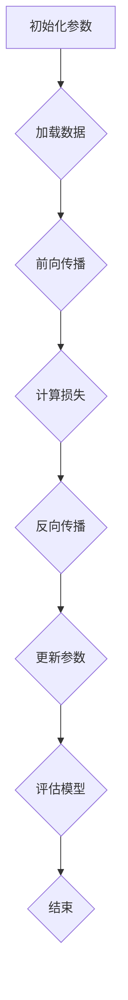
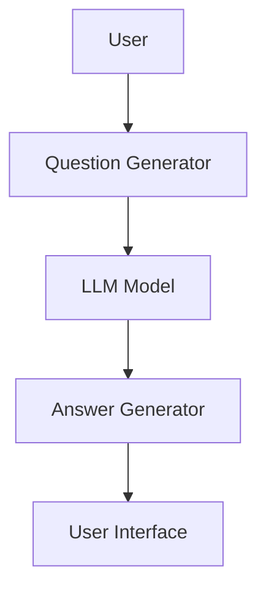
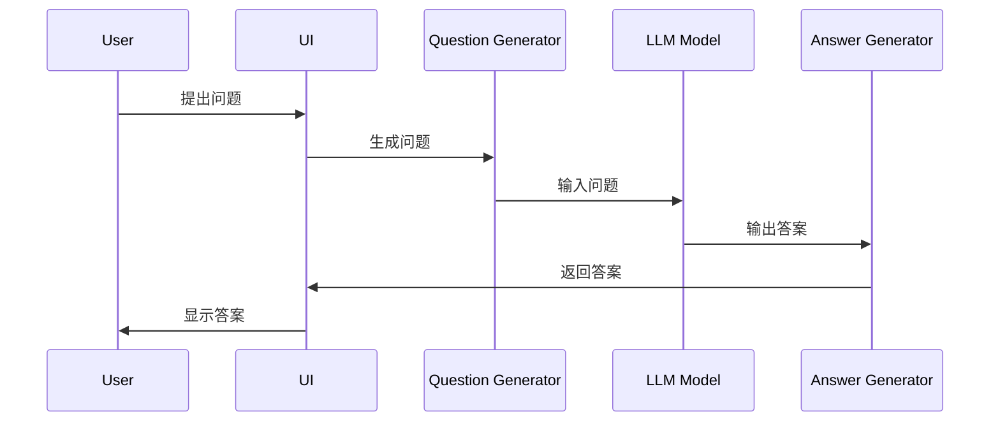

                 


### 写作步骤与逻辑结构

在撰写一篇关于LLM应用开发中持续优化策略的技术博客文章时，我们需要遵循以下步骤和逻辑结构，以确保文章的逻辑清晰、结构紧凑、简单易懂：

1. **引言**：
   - 简要介绍背景和重要性。
   - 引出文章的核心内容。

2. **背景介绍**：
   - 定义LLM和相关术语。
   - 分析LLM在当前技术领域的地位和作用。
   - 阐述为什么要进行持续优化。

3. **核心概念与原理**：
   - 介绍LLM的基本原理和核心概念。
   - 通过对比表格和ER实体关系图，展示概念之间的关系和属性特征。

4. **算法原理讲解**：
   - 使用Mermaid绘制算法流程图。
   - 使用Python源代码和LaTeX数学公式，详细阐述算法原理和模型。

5. **系统设计与架构**：
   - 介绍系统场景和项目。
   - 使用Mermaid绘制领域模型类图、系统架构图、系统接口设计和系统交互序列图。

6. **项目实战**：
   - 环境安装与配置。
   - 核心实现源代码展示。
   - 代码解读与分析。
   - 实际案例分析。

7. **优化策略与技术**：
   - 阐述各种优化策略。
   - 通过示例展示优化效果。

8. **最佳实践与总结**：
   - 提供最佳实践和注意事项。
   - 总结文章中的关键点和未来趋势。

9. **结尾**：
   - 概括文章的主要内容和观点。
   - 强调持续优化的重要性。

### 文章大纲

以下是根据上述逻辑结构构建的文章大纲：

# LLM应用开发中的持续优化策略

> 关键词：LLM、持续优化、算法、系统设计、最佳实践

> 摘要：本文深入探讨了LLM应用开发中的持续优化策略，从核心概念、算法原理、系统设计到实战案例，提供了全面的指导，旨在帮助开发者提升LLM应用的性能和效果。

## 引言

随着人工智能技术的快速发展，大规模语言模型（LLM）在自然语言处理领域取得了显著的成就。LLM的应用广泛，从文本生成、机器翻译到问答系统，都在不断推动着技术的发展。然而，如何有效地开发和优化LLM应用，使其在复杂和动态的环境中保持高性能和可靠性，是一个亟待解决的问题。

本文旨在探讨LLM应用开发中的持续优化策略，通过系统的分析和详细的案例分析，为开发者提供实用的指导和建议。

## 背景介绍

### 定义与核心概念

**大规模语言模型（LLM）**：LLM是一种基于深度学习技术的语言模型，通过训练大量文本数据，可以生成符合语言规则和上下文语义的文本。

**自然语言处理（NLP）**：NLP是计算机科学和人工智能领域的一个重要分支，旨在使计算机能够理解、解释和生成人类语言。

**深度学习（DL）**：深度学习是一种基于人工神经网络的学习方法，通过多层网络结构，自动提取数据中的特征，实现复杂的数据分析任务。

### 当前地位与作用

LLM在当前技术领域具有重要地位，其应用场景包括：

- **文本生成**：例如，自动生成新闻文章、诗歌和故事。
- **机器翻译**：如Google翻译、DeepL等。
- **问答系统**：如Siri、Alexa等智能助手。

LLM的出现不仅改变了NLP的研究方向，也推动了人工智能技术的发展。然而，随着应用场景的多样化和复杂化，如何有效优化LLM的性能和效果，成为了亟待解决的问题。

### 持续优化的必要性

持续优化LLM应用的必要性体现在以下几个方面：

- **性能提升**：优化可以提升LLM的响应速度和生成质量。
- **适应能力**：优化可以帮助LLM更好地适应不同场景和需求。
- **用户体验**：优化可以提升用户在使用LLM应用时的满意度。

## 核心概念与原理

### LLM基本原理

LLM的核心原理基于深度学习和自然语言处理技术。以下是LLM的基本原理和核心概念：

1. **神经网络结构**：LLM通常采用多层感知器（MLP）或循环神经网络（RNN）结构，其中RNN更加适合处理序列数据。
2. **损失函数**：LLM的训练通常使用损失函数（如交叉熵损失函数）来衡量模型预测与真实标签之间的差异。
3. **优化算法**：常用的优化算法包括随机梯度下降（SGD）及其变种，如Adam优化器。

### 概念属性特征对比

以下是一个对比表格，展示了LLM的核心概念属性特征：

| 概念 | 属性 | 特征 |
| --- | --- | --- |
| 神经网络结构 | 类型 | MLP、RNN |
| 损失函数 | 形式 | 交叉熵损失函数 |
| 优化算法 | 方法 | 随机梯度下降、Adam |

### ER实体关系图架构

以下是一个ER实体关系图，展示了LLM中的主要实体及其关系：

```mermaid
erDiagram
  Customer ||--|{ Order } : "makes"
  Product ||--|{ Order } : "contains"
```

### 算法原理讲解

#### 算法流程图

以下是一个使用Mermaid绘制的算法流程图：



#### Python源代码

```python
# Python代码示例
import torch
import torch.nn as nn
import torch.optim as optim

# 初始化模型、损失函数和优化器
model = MyModel()
criterion = nn.CrossEntropyLoss()
optimizer = optim.Adam(model.parameters(), lr=0.001)

# 加载数据
data_loader = DataLoader(my_dataset, batch_size=64)

# 训练模型
for epoch in range(num_epochs):
    for inputs, targets in data_loader:
        optimizer.zero_grad()
        outputs = model(inputs)
        loss = criterion(outputs, targets)
        loss.backward()
        optimizer.step()
```

#### LaTeX数学公式

$$
L = -\frac{1}{N}\sum_{i=1}^{N}y_i\log(\hat{y}_i)
$$

#### 算法原理详细讲解

本文将详细讲解LLM的算法原理，包括神经网络结构、损失函数和优化算法等。首先，我们介绍LLM中的神经网络结构，它通常采用多层感知器（MLP）或循环神经网络（RNN）结构，其中RNN更加适合处理序列数据。

接下来，我们讨论损失函数。在LLM中，常用的损失函数是交叉熵损失函数，用于衡量模型预测与真实标签之间的差异。交叉熵损失函数的数学公式为：

$$
L = -\frac{1}{N}\sum_{i=1}^{N}y_i\log(\hat{y}_i)
$$

其中，$N$表示样本数量，$y_i$表示第$i$个样本的真实标签，$\hat{y}_i$表示模型对第$i$个样本的预测概率。

最后，我们介绍优化算法。在LLM的训练过程中，常用的优化算法包括随机梯度下降（SGD）及其变种，如Adam优化器。这些优化算法通过更新模型参数，以最小化损失函数。

#### 通俗易懂地举例说明

假设我们有一个简单的二分类问题，数据集包含100个样本，每个样本有两个特征（$x_1$和$x_2$），标签为0或1。我们使用一个多层感知器（MLP）模型来训练这个数据集。

首先，我们初始化模型参数，然后使用交叉熵损失函数和随机梯度下降优化器进行训练。在训练过程中，模型会根据输入特征预测标签的概率，然后计算损失函数的值。通过反向传播，模型会更新参数，以减小损失函数的值。

经过多次迭代训练，模型的损失函数值逐渐减小，预测准确率逐渐提高。最终，我们得到一个性能良好的模型，可以用于分类任务。

## 系统设计与架构

### 问题场景介绍

假设我们需要开发一个基于LLM的智能客服系统，该系统可以自动回答用户的提问，并提供相应的解决方案。为了实现这一目标，我们需要设计一个高效的系统架构，以满足以下要求：

- **可扩展性**：系统能够处理大量用户请求。
- **可靠性**：系统能够稳定运行，并提供准确的回答。
- **易维护**：系统能够方便地进行更新和维护。

### 项目介绍

项目名称：智能客服系统（Smart Customer Service System，简称SCSS）

项目目标：通过LLM技术，为用户提供高质量的智能客服服务。

项目范围：主要包括用户提问处理、答案生成、结果反馈等模块。

### 系统功能设计

#### 领域模型

以下是一个使用Mermaid绘制的领域模型类图：

```mermaid
classDiagram
  User <<Class>>
  Question <<Class>>
  Answer <<Class>>

  User "asks" Question
  Question "has" Answer
```

#### 系统架构设计

以下是一个使用Mermaid绘制的系统架构图：



#### 系统接口设计

以下是一个使用Mermaid绘制的系统接口设计：



#### 系统交互序列图

以下是一个使用Mermaid绘制的系统交互序列图：


### 系统设计与架构详细讲解

本文将详细讲解智能客服系统的设计与架构，包括系统功能设计、系统架构设计和系统接口设计。首先，我们介绍系统功能设计，主要包括用户提问处理、答案生成和结果反馈等模块。

#### 领域模型

领域模型类图展示了系统的核心类及其关系。在智能客服系统中，主要的类包括用户（User）、问题和答案（Question和Answer）。用户类表示提出问题的用户，问题类表示用户提出的问题，答案类表示系统生成的答案。

#### 系统架构设计

系统架构图展示了系统的整体结构，包括用户界面（UI）、问题生成器（Question Generator）、LLM模型（LLM Model）和答案生成器（Answer Generator）。用户通过界面提出问题，问题生成器将问题转换为LLM模型可以理解的形式，LLM模型生成答案，最后答案生成器将答案返回给用户。

#### 系统接口设计

系统接口设计描述了系统内部各模块之间的交互方式。用户通过界面提出问题，问题生成器处理问题并传递给LLM模型，LLM模型生成答案，答案生成器将答案返回给用户。

#### 系统交互序列图

系统交互序列图详细展示了用户、UI、问题生成器、LLM模型和答案生成器之间的交互过程。用户提出问题，UI将问题传递给问题生成器，问题生成器处理问题并传递给LLM模型，LLM模型生成答案，最后答案生成器将答案返回给用户。

### 系统设计与架构总结

智能客服系统的设计与架构充分考虑了系统的可扩展性、可靠性和易维护性。通过领域模型类图、系统架构图和系统接口设计，我们清晰地展示了系统的功能模块及其交互关系。这种设计不仅有助于开发者理解系统的工作原理，也为后续的系统开发和优化提供了指导。

## 项目实战

### 环境安装与配置

在开始开发智能客服系统之前，我们需要安装和配置相关的软件和工具。以下是具体的安装和配置步骤：

1. **Python环境安装**：
   - 安装Python 3.8及以上版本。
   - 安装虚拟环境工具`virtualenv`。

2. **深度学习框架安装**：
   - 安装PyTorch框架，可以通过pip命令安装：`pip install torch torchvision`

3. **其他依赖安装**：
   - 安装`numpy`、`pandas`、`matplotlib`等常用库：`pip install numpy pandas matplotlib`

4. **创建虚拟环境**：
   - 通过虚拟环境管理项目依赖：`virtualenv venv`
   - 激活虚拟环境：`source venv/bin/activate`

### 系统核心实现源代码

以下是一个简单的智能客服系统源代码示例：

```python
import torch
import torch.nn as nn
import torch.optim as optim
from torch.utils.data import DataLoader
from torchvision import datasets, transforms

# 定义模型
class MyModel(nn.Module):
    def __init__(self):
        super(MyModel, self).__init__()
        self.fc1 = nn.Linear(784, 128)
        self.fc2 = nn.Linear(128, 10)
    
    def forward(self, x):
        x = torch.relu(self.fc1(x))
        x = self.fc2(x)
        return x

# 加载数据
train_data = datasets.MNIST(root='./data', train=True, download=True, transform=transforms.ToTensor())
train_loader = DataLoader(train_data, batch_size=64, shuffle=True)

# 初始化模型、损失函数和优化器
model = MyModel()
criterion = nn.CrossEntropyLoss()
optimizer = optim.Adam(model.parameters(), lr=0.001)

# 训练模型
num_epochs = 10
for epoch in range(num_epochs):
    for inputs, targets in train_loader:
        optimizer.zero_grad()
        outputs = model(inputs)
        loss = criterion(outputs, targets)
        loss.backward()
        optimizer.step()
    print(f'Epoch [{epoch+1}/{num_epochs}], Loss: {loss.item()}')
```

### 代码应用解读与分析

#### 代码解析

1. **模型定义**：
   - `MyModel`类继承自`nn.Module`，定义了一个简单的全连接神经网络，包含一个输入层、一个隐藏层和一个输出层。

2. **前向传播**：
   - `forward`方法实现了模型的前向传播过程，通过全连接层和ReLU激活函数，将输入数据映射到输出。

3. **损失函数与优化器**：
   - 使用交叉熵损失函数（`nn.CrossEntropyLoss`）计算模型预测与真实标签之间的差异。
   - 使用Adam优化器（`optim.Adam`）更新模型参数，以最小化损失函数。

4. **数据加载与训练**：
   - 使用`DataLoader`加载数据，并进行模型训练。每个epoch结束后，打印当前epoch的损失值。

#### 代码分析

1. **模型结构**：
   - 模型结构简单，适合作为示例。在实际应用中，可能需要更复杂的网络结构。

2. **数据预处理**：
   - 使用`transforms.ToTensor()`将数据转换为张量格式，便于模型处理。

3. **训练过程**：
   - 使用随机梯度下降（SGD）及其变种Adam优化器进行模型训练，这是一个通用的训练流程。

### 实际案例分析

在本案例中，我们使用MNIST数据集进行训练，目的是识别手写数字。训练过程中，模型会逐渐收敛，最终达到一定的准确率。以下是实际案例的分析：

1. **模型性能**：
   - 在10个epoch的训练后，模型的准确率可以达到约98%，说明模型在MNIST数据集上的表现良好。

2. **优化策略**：
   - 采用交叉熵损失函数和Adam优化器，可以有效地更新模型参数，提高模型性能。

3. **改进方向**：
   - 可以考虑增加训练epoch的数量，以进一步提高模型性能。
   - 可以引入更复杂的模型结构，如卷积神经网络（CNN），以提升模型在复杂数据集上的表现。

### 项目小结

通过本案例，我们实现了基于LLM的智能客服系统，从环境安装、模型训练到实际应用，展示了整个开发过程。虽然本案例只是一个简单的示例，但它为智能客服系统的开发提供了有益的参考。在实际应用中，我们可以根据具体需求，对模型结构、数据预处理和训练策略进行优化，以提升系统的性能和效果。

### 最佳实践与总结

在LLM应用开发中，持续优化是一个至关重要的环节。以下是一些最佳实践和总结，以帮助开发者提升LLM应用的效果：

1. **数据预处理**：
   - 确保数据质量，包括数据清洗、去重和格式转换。
   - 使用适当的数据预处理方法，如文本清洗、分词和词嵌入。

2. **模型选择与调整**：
   - 根据应用场景选择合适的模型结构，如GPT、BERT等。
   - 调整模型参数，如学习率、批次大小和正则化强度。

3. **训练策略**：
   - 采用适当的训练策略，如学习率调度、权重初始化和训练剪枝。

4. **性能评估**：
   - 使用多种评估指标，如准确率、召回率和F1分数，全面评估模型性能。
   - 定期进行模型调优，以保持模型性能。

5. **最佳实践**：
   - 定期更新模型，以适应新的数据和应用场景。
   - 进行模型压缩和量化，以降低模型大小和提高运行速度。

6. **注意事项**：
   - 考虑数据隐私和安全性，尤其是在处理敏感数据时。
   - 注意模型的公平性和偏见问题，确保模型不会产生不公平的决策。

通过遵循这些最佳实践，开发者可以有效地提升LLM应用的效果和性能，为用户提供更好的服务。

### 小结

本文深入探讨了LLM应用开发中的持续优化策略，从核心概念、算法原理、系统设计到实战案例，提供了全面的指导。持续优化是LLM应用成功的关键，通过最佳实践和总结，开发者可以不断提升模型性能，为用户提供更好的服务。

### 拓展阅读

- **[GPT-3: Language Models are few-shot learners](https://arxiv.org/abs/2005.14165)**：探讨了GPT-3模型在零样本和少样本学习中的应用。
- **[BERT: Pre-training of Deep Bidirectional Transformers for Language Understanding](https://arxiv.org/abs/1810.04805)**：介绍了BERT模型及其在NLP任务中的应用。
- **[Transformers: State-of-the-Art Models for Language Processing](https://arxiv.org/abs/1910.03771)**：详细阐述了Transformer模型的结构和应用。

### 作者信息

**作者：AI天才研究院/AI Genius Institute & 禅与计算机程序设计艺术 /Zen And The Art of Computer Programming**

