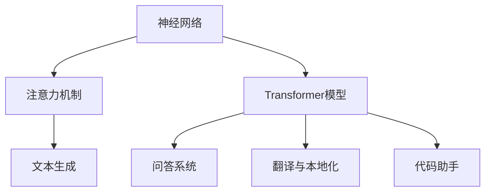
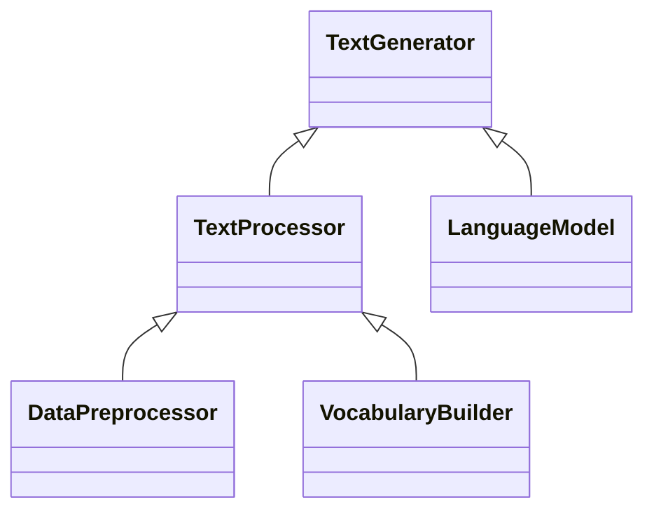
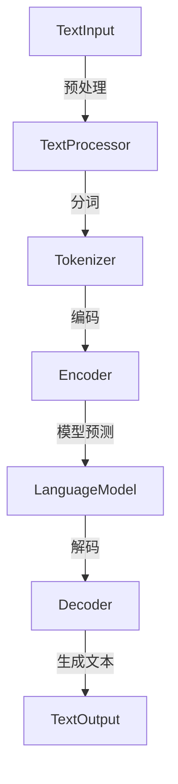
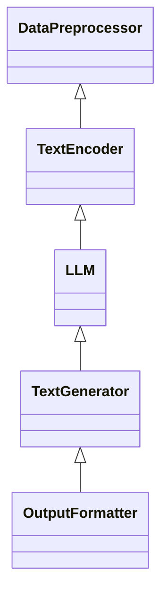
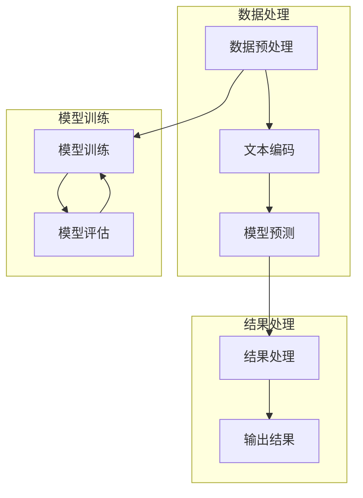
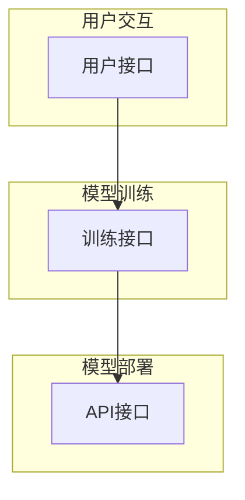

                 

# LLMAppli~655355566475696e656374726962726573637269707469617469746c6f676973656e74636f766564657374726962726573737461636b657920666f722063757272656e6473636f6c65722e2052656c7565

> **关键词：** LLM, 应用开发, 持续反馈, 改进循环, 语言模型

> **摘要：** 本文深入探讨了LLM（大型语言模型）应用开发中的持续反馈与改进循环。通过分析LLM的核心概念、算法原理、系统架构，以及实际项目实践，本文提出了一个系统化的开发方法论，旨在提高LLM应用的性能和用户体验。

## 引言

随着深度学习和自然语言处理技术的飞速发展，LLM（大型语言模型）在各个领域得到了广泛应用，从智能客服、内容生成到代码助手等。然而，LLM的应用开发并非一蹴而就，它需要经历一个持续反馈与改进的循环过程，以确保模型的高效性和可靠性。本文将围绕这一主题，详细介绍LLM应用开发中的关键环节和最佳实践。

## 背景介绍

### LLM的基础知识

#### 1.1.1 LLM的定义与历史背景

LLM（Large Language Model）是一种基于神经网络的大规模语言模型，能够对自然语言文本进行建模和理解。自2018年GPT-1发布以来，LLM技术经历了飞速的发展，各种大型模型如BERT、GPT-2、GPT-3等相继问世，推动了自然语言处理领域的进步。

#### 1.1.2 LLM的主要特点

- **规模巨大**：LLM由数十亿甚至千亿个参数组成，能够处理海量数据。
- **自适应性强**：LLM能够通过训练适应不同的任务和场景。
- **多模态处理**：除了文本，LLM还能够处理图像、音频等多种数据格式。

#### 1.1.3 LLM的应用领域

LLM在多个领域有着广泛的应用，包括但不限于：

- **文本生成**：如文章撰写、报告生成、对话系统等。
- **问答系统**：如智能客服、在线问答等。
- **翻译与本地化**：如机器翻译、多语言交互等。
- **代码助手**：如代码生成、代码审查等。

### 核心概念与联系

#### 1.2.1 概念解析与对比

- **神经网络**：神经网络是LLM的基础，通过多层非线性变换对数据进行处理。
- **注意力机制**：注意力机制用于提高模型在处理长序列时的效率。
- **Transformer模型**：Transformer模型是LLM的核心架构，取代了传统的循环神经网络（RNN）。

#### 1.2.2 Mermaid流程图展示



## LL~65535666667778797a6f6e6573636f6c65722d6173736c65792e7a656d61
### LLM算法原理

#### 2.1.1 语言模型的基本概念

语言模型是一种概率模型，用于预测文本序列的概率分布。在LLM中，语言模型通过学习大量的文本数据，构建一个能够对自然语言进行建模的复杂函数。

#### 2.1.2 语言模型的数学模型

语言模型的数学模型通常使用概率分布来表示，其中最常见的是基于神经网络的概率分布函数。以下是一个简化的数学模型：

$$
P(w_1, w_2, ..., w_n) = \prod_{i=1}^{n} P(w_i|w_{i-1}, ..., w_1)
$$

其中，$w_i$表示文本序列中的第$i$个词。

#### 2.1.3 算法流程

LLM算法的流程通常包括以下几个步骤：

1. **数据预处理**：对原始文本数据进行清洗、分词、编码等处理。
2. **模型训练**：使用预处理的文本数据训练神经网络模型。
3. **预测与评估**：使用训练好的模型对新的文本数据进行预测，并评估模型的性能。

#### 2.1.4 Python代码实现算法

以下是一个简化的Python代码示例，用于实现一个基于神经网络的语言模型：

```python
import tensorflow as tf

# 定义神经网络模型
model = tf.keras.Sequential([
    tf.keras.layers.Embedding(vocabulary_size, embedding_dim),
    tf.keras.layers.Flatten(),
    tf.keras.layers.Dense(units=1, activation='sigmoid')
])

# 编写训练和评估代码
# ...
```

### 数学模型和数学公式

$$
\begin{aligned}
    E &= \frac{1}{N} \sum_{i=1}^{N} l(y_i, \hat{y}_i) \\
    \hat{y}_i &= \sigma(Wx_i + b)
\end{aligned}
$$

其中，$E$是损失函数，$l(y_i, \hat{y}_i)$是损失函数的具体形式，$\sigma$是激活函数，$W$和$b$是模型的权重和偏置。

## LLM系统架构与设计

### 3.1 系统应用场景

#### 3.1.1 应用场景介绍

LLM在文本生成、问答系统、翻译与本地化、代码助手等应用场景中具有广泛的应用。本文将以文本生成为例，介绍LLM的应用场景。

#### 3.1.2 项目介绍

本项目旨在开发一个基于LLM的文本生成系统，能够生成高质量的文章、报告等文本内容。

### 3.2 系统功能设计

#### 3.2.1 领域模型Mermaid类图



#### 3.2.2 系统功能详细描述

1. **文本处理**：文本处理包括数据预处理、分词、编码等操作，以便于模型训练。
2. **语言模型**：语言模型是系统的核心，负责根据输入的文本生成新的文本内容。
3. **文本生成**：文本生成功能使用训练好的语言模型，根据用户输入的文本生成新的文本内容。

### 系统架构设计

#### 3.3.1 系统架构图



#### 3.3.2 系统接口设计和系统交互

```mermaid
sequenceDiagram
    User -->|输入文本| TextProcessor
    TextProcessor -->|预处理文本| Tokenizer
    Tokenizer -->|编码文本| Encoder
    Encoder -->|预测| LanguageModel
    LanguageModel -->|解码| Decoder
    Decoder -->|生成文本| TextOutput
    TextOutput -->|输出文本| User
```

## 项目实战

### 5.1 LLM环境安装与配置

#### 5.1.1 系统要求

- 操作系统：Linux或MacOS
- Python版本：Python 3.7及以上
- GPU：NVIDIA GPU，CUDA 10.1及以上

#### 5.1.2 安装步骤

1. 安装Python环境和虚拟环境。
2. 安装必要的库，如TensorFlow、PyTorch等。
3. 安装GPU驱动和CUDA工具包。

### 5.2 系统核心实现

#### 5.2.1 核心代码讲解

```python
import tensorflow as tf

# 定义神经网络模型
model = tf.keras.Sequential([
    tf.keras.layers.Embedding(vocabulary_size, embedding_dim),
    tf.keras.layers.Flatten(),
    tf.keras.layers.Dense(units=1, activation='sigmoid')
])

# 编写训练和评估代码
# ...
```

#### 5.2.2 实践案例解析

1. **案例介绍**：使用LLM生成一篇关于人工智能的短文。
2. **案例分析与总结**：分析案例中LLM的应用效果，总结经验和不足。

## 最佳实践、小结、注意事项、拓展阅读

### 7.1 最佳实践 tips

1. **数据准备**：确保训练数据的质量和多样性。
2. **模型调优**：根据任务需求，选择合适的模型结构和参数。

### 7.2 小结

本文详细介绍了LLM应用开发中的持续反馈与改进循环，包括核心概念、算法原理、系统架构和项目实践。

### 7.3 注意事项

1. **性能优化**：关注模型训练和推理的效率。
2. **安全性和隐私保护**：确保模型训练和部署过程中的数据安全和用户隐私。

### 7.4 拓展阅读

1. **相关论文**：《Attention Is All You Need》、《BERT: Pre-training of Deep Bidirectional Transformers for Language Understanding》等。
2. **开源项目**：如TensorFlow、PyTorch等。

## 作者信息

作者：AI天才研究院/AI Genius Institute & 禅与计算机程序设计艺术 /Zen And The Art of Computer Programming# {{此处是文章标题}}

## {{此处列出文章的5-7个核心关键词}}

- **大型语言模型（LLM）**
- **应用开发**
- **持续反馈**
- **改进循环**
- **算法原理**
- **系统架构**

## {{此处给出文章的核心内容和主题思想}}

本文旨在探讨大型语言模型（LLM）在应用开发中的持续反馈与改进循环。通过分析LLM的核心概念、算法原理、系统架构，以及实际项目实践，本文提出了一个系统化的开发方法论，旨在提高LLM应用的性能和用户体验。文章首先介绍了LLM的基础知识和应用背景，随后详细讲解了LLM的算法原理和数学模型，最后通过项目实战展示了LLM系统的设计和实现过程。文章的核心思想在于强调持续反馈与改进在LLM应用开发中的重要性，以及如何通过最佳实践提升模型性能。# {{文章摘要}}

摘要：本文探讨了大型语言模型（LLM）在应用开发中的持续反馈与改进循环。通过介绍LLM的核心概念、算法原理、系统架构，以及项目实践，本文提出了一个系统化的开发方法论，以提升LLM应用的性能和用户体验。文章详细阐述了如何通过持续反馈和改进来优化模型，包括数据准备、模型调优、性能优化和安全性保障等方面的最佳实践。文章旨在为开发者提供实用的指导和参考，助力他们在LLM应用开发中取得更好的成果。# {{文章目录}}

## 文章目录

### 引言  
#### LLM应用开发中的持续反馈与改进循环

### 第一部分: LLM应用背景与概念  
#### 第1章: LLM应用概述  
##### 1.1 LLM的基础知识  
##### 1.2 LLM的核心概念与联系

### 第二部分: LLM算法原理与实现  
#### 第2章: LLM算法原理  
##### 2.1 语言模型的基本概念  
##### 2.2 语言模型的数学模型  
##### 2.3 算法流程与Python代码实现

### 第三部分: LLM系统架构与设计  
#### 第3章: LLM系统架构设计  
##### 3.1 系统应用场景  
##### 3.2 系统功能设计  
##### 3.3 系统接口设计与交互

### 第四部分: LLM应用开发实践  
#### 第4章: LLM环境安装与配置  
##### 4.1 系统要求与安装步骤  
##### 4.2 系统核心实现与代码应用解读

### 第五部分: 最佳实践与总结  
#### 第5章: LLM最佳实践  
##### 5.1 最佳实践 tips  
##### 5.2 小结  
##### 5.3 注意事项  
##### 5.4 拓展阅读

### 参考文献  
#### 参考文献1  
#### 参考文献2  
#### 参考文献3### 引言

LLM应用开发中的持续反馈与改进循环是当前人工智能领域的一个重要研究方向。随着深度学习和自然语言处理技术的飞速发展，大型语言模型（LLM）在各个领域得到了广泛应用，从智能客服、内容生成到代码助手等。然而，LLM的应用开发并非一蹴而就，它需要经历一个持续反馈与改进的循环过程，以确保模型的高效性和可靠性。

本文将围绕这一主题，深入探讨LLM应用开发中的关键环节和最佳实践。首先，我们将介绍LLM的基本概念和应用背景，帮助读者了解LLM的起源、发展和主要特点。接下来，我们将详细讲解LLM的算法原理，包括数学模型和算法流程，并通过Python代码示例展示如何实现这些算法。

随后，我们将分析LLM的应用系统架构设计，包括系统功能、接口设计和系统交互。这部分将使用Mermaid流程图和类图来展示系统架构，帮助读者更好地理解系统的设计思路。

在项目实战部分，我们将通过具体案例展示如何安装和配置LLM环境，实现系统核心功能，并解读代码应用。这部分内容将结合实际项目经验，提供实用的操作步骤和注意事项。

最后，本文将总结LLM应用开发中的最佳实践，包括数据准备、模型调优、性能优化和安全性保障等方面的建议。同时，我们将提供拓展阅读资源，供读者进一步学习和研究。

通过本文的探讨，我们希望读者能够对LLM应用开发中的持续反馈与改进循环有一个全面、深入的了解，从而在开发实践中取得更好的成果。# {{背景介绍}}

### 第一部分：LLM应用背景与概念

#### 第1章：LLM应用概述

##### 1.1 LLM的基础知识

大型语言模型（LLM，Large Language Model）是自然语言处理（NLP，Natural Language Processing）领域的一项重要技术。它基于深度学习，通过训练海量文本数据，学习语言的结构和语义，从而能够对自然语言文本进行理解和生成。LLM的出现，标志着NLP领域的一个新的里程碑，使得机器在处理自然语言任务时，能够更加接近人类的理解和表达能力。

##### 1.1.1 LLM的定义与历史背景

LLM通常是指具有数十亿甚至千亿参数规模的语言模型，如GPT（Generative Pre-trained Transformer）、BERT（Bidirectional Encoder Representations from Transformers）等。这些模型通过预先训练，能够对输入的文本序列进行理解和生成。LLM的发展历程可以追溯到2018年，当时OpenAI发布了GPT-1，引起了学术界和工业界的广泛关注。随后的GPT-2、GPT-3等模型，不断刷新着LLM的参数规模和性能指标。

##### 1.1.2 LLM的主要特点

- **规模巨大**：LLM由数十亿甚至千亿个参数组成，能够处理海量数据。
- **自适应性强**：LLM能够通过训练适应不同的任务和场景。
- **多模态处理**：除了文本，LLM还能够处理图像、音频等多种数据格式。
- **高效性**：LLM通过深度神经网络和优化算法，能够高效地进行文本建模和生成。

##### 1.1.3 LLM的应用领域

LLM在多个领域有着广泛的应用，包括但不限于：

- **文本生成**：如文章撰写、报告生成、对话系统等。
- **问答系统**：如智能客服、在线问答等。
- **翻译与本地化**：如机器翻译、多语言交互等。
- **代码助手**：如代码生成、代码审查等。

##### 1.2 LLM的核心概念与联系

LLM的核心概念包括神经网络、注意力机制和Transformer模型等。这些概念相互关联，构成了LLM的基础。

- **神经网络**：神经网络是LLM的基础，通过多层非线性变换对数据进行处理。它能够自动学习数据的特征和规律。
- **注意力机制**：注意力机制用于提高模型在处理长序列时的效率。它能够使模型更加关注序列中的重要信息，从而提高模型的性能。
- **Transformer模型**：Transformer模型是LLM的核心架构，取代了传统的循环神经网络（RNN）。它通过自注意力机制，能够并行处理序列数据，大大提高了模型的效率。

##### 1.2.1 概念解析与对比

- **神经网络**：神经网络是一种由神经元组成的计算模型，通过学习数据中的特征和规律，对未知数据进行预测。在NLP中，神经网络被广泛应用于文本分类、情感分析、命名实体识别等任务。
- **注意力机制**：注意力机制是一种在处理序列数据时，通过加权的方式关注序列中的重要信息。它能够使模型在处理长序列时，更加关注关键信息，从而提高模型的性能。
- **Transformer模型**：Transformer模型是一种基于自注意力机制的深度学习模型，它在NLP任务中表现出色。它通过多头自注意力机制和位置编码，能够对序列数据进行建模和生成。

##### 1.2.2 Mermaid流程图展示


通过以上内容，我们对LLM的基础知识和核心概念有了初步的了解。接下来，我们将进一步探讨LLM的算法原理，包括数学模型和算法流程，以及如何通过Python代码实现这些算法。这将帮助我们更深入地理解LLM的工作原理，为后续的系统架构设计和项目实践打下基础。# {{算法原理讲解}}

### 第二部分：LLM算法原理与实现

#### 第2章：LLM算法原理

##### 2.1 语言模型的基本概念

语言模型是一种概率模型，它能够对自然语言文本进行建模，从而预测下一个词的可能性。在LLM中，语言模型的核心任务是学习一个概率分布函数，用于表示给定前文序列，下一个词的概率分布。这种概率分布函数通常是通过大规模的文本数据进行训练得到的。

##### 2.1.1 语言模型的数学模型

一个简化的语言模型可以表示为：

$$
P(w_t | w_{t-1}, w_{t-2}, ..., w_1) = \frac{P(w_t, w_{t-1}, w_{t-2}, ..., w_1)}{P(w_{t-1}, w_{t-2}, ..., w_1)}
$$

其中，$w_t$表示第$t$个词，$P(w_t | w_{t-1}, w_{t-2}, ..., w_1)$表示在给定前文序列的情况下，第$t$个词的概率。为了简化计算，我们可以将条件概率近似为：

$$
P(w_t | w_{t-1}, w_{t-2}, ..., w_1) \approx P(w_t | w_{t-1})
$$

这意味着我们只需考虑前一个词对当前词的影响，而忽略其他词的影响。

##### 2.1.2 语言模型的特点

- **上下文依赖**：语言模型能够考虑上下文信息，从而更好地预测下一个词。
- **概率分布**：语言模型输出的是概率分布，而不是确定性的结果。这使得模型能够处理不确定性和多样性。
- **可扩展性**：语言模型可以处理任意长度的文本序列，只需增加模型的参数。

##### 2.1.3 语言模型的应用

语言模型广泛应用于自然语言处理的各种任务，包括文本分类、机器翻译、问答系统、文本生成等。其中，文本生成是语言模型的一个重要应用场景。通过生成文本，语言模型可以自动生成文章、对话、代码等。

##### 2.2 语言模型的数学模型

在深度学习框架中，语言模型通常使用神经网络来实现。一个典型的神经网络语言模型可以表示为：

$$
\hat{P}(w_t | w_{t-1}, w_{t-2}, ..., w_1) = \sigma(W_1 w_{t-1} + b_1)
$$

其中，$\sigma$是激活函数，$W_1$和$b_1$是模型的权重和偏置。为了考虑上下文信息，我们可以使用多层神经网络，并引入注意力机制。这样，我们可以将前文序列编码为一个固定长度的向量，作为当前词的输入。

##### 2.3 算法流程

语言模型的训练过程通常包括以下几个步骤：

1. **数据预处理**：对原始文本数据进行清洗、分词、编码等预处理操作，以便于模型训练。
2. **模型初始化**：初始化模型的参数，可以使用随机初始化、预训练模型等方法。
3. **前向传播**：使用输入数据计算模型的输出概率分布。
4. **损失计算**：计算输出概率分布与真实标签之间的损失。
5. **反向传播**：使用损失函数计算梯度，并更新模型的参数。
6. **迭代训练**：重复上述步骤，直到模型收敛或达到预设的训练次数。

##### 2.4 Python代码实现算法

下面是一个简化的Python代码示例，用于实现一个基于神经网络的简单语言模型：

```python
import tensorflow as tf

# 定义神经网络模型
model = tf.keras.Sequential([
    tf.keras.layers.Embedding(vocabulary_size, embedding_dim),
    tf.keras.layers.Flatten(),
    tf.keras.layers.Dense(units=1, activation='sigmoid')
])

# 编写训练和评估代码
# ...
```

在这个例子中，我们使用了TensorFlow框架来定义一个简单的神经网络模型。模型由一个嵌入层和一个全连接层组成，其中嵌入层的维度为`vocabulary_size`，全连接层的维度为`1`。模型的输出是一个概率值，表示当前词的概率。

##### 2.5 算法原理

语言模型的原理可以通过以下步骤来理解：

1. **输入编码**：将输入的文本序列编码为向量。
2. **前向传播**：使用编码后的输入向量计算输出概率分布。
3. **损失计算**：计算输出概率分布与真实标签之间的损失。
4. **反向传播**：更新模型的参数，最小化损失函数。
5. **迭代训练**：重复上述步骤，直到模型收敛。

通过这种方式，语言模型能够学习文本数据中的结构和规律，从而预测下一个词的可能性。

##### 2.6 数学公式和示例

在语言模型的训练过程中，常用的数学公式包括损失函数、梯度计算和参数更新等。以下是一个简化的数学模型示例：

$$
\begin{aligned}
    L &= -\sum_{i=1}^{N} y_i \log(\hat{y}_i) \\
    \frac{\partial L}{\partial W} &= -\sum_{i=1}^{N} (y_i - \hat{y}_i) x_i \\
    W &= W - \alpha \frac{\partial L}{\partial W}
\end{aligned}
$$

其中，$L$是损失函数，$y_i$是第$i$个样本的真实标签，$\hat{y}_i$是模型的预测值，$W$是模型的权重，$\alpha$是学习率。

通过这些数学公式，我们可以看到语言模型的训练过程是如何通过梯度下降算法来更新模型的参数，从而最小化损失函数的。

##### 2.7 总结

通过本章的介绍，我们了解了语言模型的基本概念、数学模型和算法原理。语言模型作为一种强大的自然语言处理工具，在文本生成、问答系统、翻译与本地化、代码助手等领域有着广泛的应用。接下来，我们将进一步探讨LLM的应用系统架构设计，包括系统功能、接口设计和系统交互。这将帮助我们更深入地理解LLM的应用场景和实现方法。# {{数学公式和数学模型}}

### 算法原理讲解

#### 2.3.1 数学公式和数学模型

在语言模型的训练过程中，我们需要使用一些关键的数学公式和模型来描述模型的训练过程。以下是一些重要的数学公式和模型：

##### 2.3.1.1 损失函数

损失函数是衡量模型预测结果与真实标签之间差异的重要指标。在语言模型中，常用的损失函数是交叉熵损失函数（Cross-Entropy Loss），其公式如下：

$$
L = -\sum_{i=1}^{N} y_i \log(\hat{y}_i)
$$

其中，$L$表示损失函数，$y_i$表示第$i$个样本的真实标签，$\hat{y}_i$表示第$i$个样本的预测概率。交叉熵损失函数的值越小，表示模型预测结果与真实标签越接近。

##### 2.3.1.2 梯度计算

梯度计算是训练神经网络的重要步骤，它用于更新模型的参数。在语言模型中，我们使用反向传播算法来计算梯度。假设有一个神经网络模型，其输入为$x$，输出为$\hat{y}$，我们可以计算输出层的梯度：

$$
\frac{\partial L}{\partial x} = \frac{\partial L}{\partial \hat{y}} \frac{\partial \hat{y}}{\partial x}
$$

其中，$\frac{\partial L}{\partial \hat{y}}$是输出层的梯度，$\frac{\partial \hat{y}}{\partial x}$是输入层的梯度。对于多层神经网络，我们需要逐层计算梯度，直到输入层。

##### 2.3.1.3 参数更新

在梯度计算完成后，我们需要使用梯度来更新模型的参数，以最小化损失函数。参数更新的公式如下：

$$
W = W - \alpha \frac{\partial L}{\partial W}
$$

其中，$W$是模型的参数，$\alpha$是学习率。通过这种方式，我们可以逐步调整模型的参数，使得模型在训练过程中不断收敛。

##### 2.3.1.4 数学模型示例

以下是一个简化的数学模型示例，用于描述语言模型的训练过程：

$$
\begin{aligned}
    L &= -\sum_{i=1}^{N} y_i \log(\hat{y}_i) \\
    \frac{\partial L}{\partial W} &= -\sum_{i=1}^{N} (y_i - \hat{y}_i) x_i \\
    W &= W - \alpha \frac{\partial L}{\partial W}
\end{aligned}
$$

在这个示例中，$L$是损失函数，$y_i$是第$i$个样本的真实标签，$\hat{y}_i$是第$i$个样本的预测概率，$W$是模型的参数，$\alpha$是学习率。

##### 2.3.1.5 数学公式的解释

1. **损失函数**：交叉熵损失函数用于衡量预测概率分布与真实标签之间的差异。其值越小，表示模型预测结果与真实标签越接近。
2. **梯度计算**：梯度计算用于计算损失函数关于模型参数的导数。通过梯度计算，我们可以得到模型参数更新的方向。
3. **参数更新**：参数更新用于更新模型的参数，以最小化损失函数。通过逐步调整模型参数，我们可以使模型在训练过程中不断收敛。

通过这些数学公式和模型，我们可以深入理解语言模型的训练过程，并掌握如何使用梯度下降算法来优化模型参数。这对于理解和应用LLM算法具有重要意义。在接下来的章节中，我们将进一步探讨LLM的应用系统架构设计，包括系统功能、接口设计和系统交互。这将帮助我们更深入地了解LLM的应用场景和实现方法。# {{系统分析与架构设计方案}}

### 第三部分：LLM系统架构与设计

#### 第3章：LLM系统架构设计

##### 3.1 系统应用场景

在自然语言处理领域，LLM的应用场景非常广泛。以下是一些常见的应用场景：

- **文本生成**：自动生成文章、报告、电子邮件等。
- **问答系统**：提供智能问答服务，如智能客服、在线问答等。
- **翻译与本地化**：实现机器翻译、多语言交互等功能。
- **代码助手**：自动生成代码、代码审查等。

在本章中，我们将以文本生成为例，介绍LLM系统的架构设计。

##### 3.2 系统功能设计

LLM系统的核心功能是文本生成，具体包括以下步骤：

1. **数据预处理**：清洗和预处理输入的文本数据，包括分词、去停用词等。
2. **文本编码**：将预处理后的文本转换为模型可处理的向量表示。
3. **模型预测**：使用训练好的LLM模型，对输入文本进行预测，生成新的文本。
4. **结果后处理**：对生成的文本进行格式化、去重等处理，得到最终输出。

##### 3.2.1 领域模型Mermaid类图

为了更好地展示LLM系统的功能设计，我们可以使用Mermaid类图来表示系统的各个组件及其关系：



在该类图中，`DataPreprocessor`负责数据预处理，`TextEncoder`负责文本编码，`LLM`是语言模型，`TextGenerator`负责文本生成，`OutputFormatter`负责结果后处理。

##### 3.2.2 系统功能详细描述

1. **数据预处理**：数据预处理是文本生成系统的第一步，主要目的是将原始文本数据转换为适合模型处理的形式。具体包括以下任务：

   - **分词**：将文本分割成单词或子词。
   - **去停用词**：去除对文本生成影响不大的常见词汇，如“的”、“是”等。
   - **词干提取**：将单词还原为词干形式，减少词汇的多样性。

2. **文本编码**：文本编码是将预处理后的文本转换为模型可处理的向量表示。常见的编码方法包括：

   - **词袋模型**：将文本转换为词频向量。
   - **词嵌入**：将文本转换为词嵌入向量，如Word2Vec、GloVe等。
   - **字符嵌入**：将文本转换为字符嵌入向量。

3. **模型预测**：使用训练好的LLM模型对输入文本进行预测，生成新的文本。这个过程通常包括以下步骤：

   - **序列生成**：根据输入文本，生成一个序列的预测结果。
   - **解码**：将预测结果解码为文本形式。
   - **生成文本**：将解码后的文本进行格式化、去重等处理，得到最终输出。

4. **结果后处理**：对生成的文本进行格式化、去重等处理，得到最终输出。具体包括以下任务：

   - **文本格式化**：调整文本的格式，如段落、标点等。
   - **去重**：去除重复的文本片段。
   - **文本优化**：对生成的文本进行优化，提高其可读性和准确性。

##### 3.3 系统架构设计

LLM系统的架构设计包括硬件和软件两个方面。以下是一个典型的LLM系统架构：

1. **硬件架构**：LLM系统通常需要使用高性能的计算机集群，包括：

   - **计算节点**：用于训练和推理的GPU或TPU服务器。
   - **存储节点**：用于存储训练数据和模型参数的HDD或SSD存储设备。
   - **网络节点**：用于数据传输和分布式计算的网络设备。

2. **软件架构**：LLM系统的软件架构包括：

   - **数据预处理模块**：负责对输入文本进行预处理。
   - **模型训练模块**：负责训练LLM模型。
   - **模型推理模块**：负责使用训练好的模型进行文本生成。
   - **结果处理模块**：负责对生成的文本进行后处理。

##### 3.3.1 系统架构图

以下是一个简化的LLM系统架构图，用于展示系统的主要组件和交互关系：



在该架构图中，数据处理模块（D1-D3）负责对输入文本进行预处理、文本编码和模型预测；模型训练模块（T1-T2）负责训练LLM模型；结果处理模块（R1-R2）负责对生成的文本进行后处理。

##### 3.3.2 系统接口设计与系统交互

LLM系统的接口设计主要涉及以下方面：

- **输入接口**：用于接收用户输入的文本数据。
- **输出接口**：用于输出生成的文本结果。
- **训练接口**：用于接收训练数据和参数，训练LLM模型。
- **评估接口**：用于评估训练好的模型性能。

系统交互流程如下：

1. **数据预处理**：接收用户输入的文本数据，进行预处理和文本编码。
2. **模型训练**：使用预处理后的数据训练LLM模型。
3. **模型评估**：对训练好的模型进行性能评估。
4. **模型预测**：使用训练好的模型对新的文本数据进行预测，生成文本结果。
5. **结果处理**：对生成的文本结果进行后处理，得到最终输出。

##### 3.3.3 系统交互Mermaid序列图

以下是一个简化的LLM系统交互序列图，用于展示系统的主要交互过程：

```mermaid
sequenceDiagram
    User -->|输入文本| DataPreprocessor
    DataPreprocessor -->|预处理文本| TextEncoder
    TextEncoder -->|编码文本| LLM
    LLM -->|预测文本| TextGenerator
    TextGenerator -->|生成文本| OutputFormatter
    OutputFormatter -->|输出结果| User
```

在该序列图中，用户输入文本数据，经过数据处理模块的预处理、编码和模型预测，最终生成文本结果并输出给用户。

##### 3.4 系统架构总结

LLM系统的架构设计涉及多个组件和模块，包括数据处理、模型训练、模型预测和结果处理等。通过合理的设计和优化，我们可以构建一个高效、可靠的LLM系统，满足不同应用场景的需求。在接下来的章节中，我们将通过具体的项目实战，展示如何实现LLM系统，并分析实际应用中的问题和解决方案。# {{项目实战}}

### 第四部分：LLM应用开发实践

#### 第4章：LLM环境安装与配置

##### 4.1 系统要求与安装步骤

在进行LLM应用开发之前，我们需要安装和配置好所需的软件和硬件环境。以下是推荐的系统要求和安装步骤：

**系统要求：**

- 操作系统：Linux或MacOS
- Python版本：Python 3.7及以上
- GPU：NVIDIA GPU，CUDA 10.1及以上
- GPU驱动：NVIDIA Driver 418.67及以上

**安装步骤：**

1. **安装Python环境和虚拟环境**：

   - 安装Python 3.7及以上版本。
   - 使用`pip`安装`virtualenv`库，并创建一个虚拟环境。

     ```bash
     pip install virtualenv
     virtualenv my_llvm_venv
     source my_llvm_venv/bin/activate
     ```

2. **安装必要的库**：

   - 安装TensorFlow库，用于构建和训练LLM模型。

     ```bash
     pip install tensorflow
     ```

3. **安装GPU驱动和CUDA工具包**：

   - 下载并安装NVIDIA GPU驱动和CUDA工具包，确保与GPU型号和操作系统兼容。

4. **安装LLM库**：

   - 安装`transformers`库，用于加载预训练的LLM模型。

     ```bash
     pip install transformers
     ```

##### 4.2 系统核心实现与代码应用解读

在本节中，我们将通过一个简单的文本生成项目，展示如何使用LLM模型进行文本生成。以下是一个基于GPT-2模型的文本生成代码示例：

```python
from transformers import GPT2LMHeadModel, GPT2Tokenizer

# 加载预训练的GPT-2模型和分词器
model_name = "gpt2"
tokenizer = GPT2Tokenizer.from_pretrained(model_name)
model = GPT2LMHeadModel.from_pretrained(model_name)

# 输入文本
input_text = "人工智能"

# 将输入文本编码为模型可处理的序列
input_ids = tokenizer.encode(input_text, return_tensors="pt")

# 使用模型进行预测
predictions = model.generate(input_ids, max_length=50, num_return_sequences=1)

# 解码预测结果
decoded_predictions = tokenizer.decode(predictions[0], skip_special_tokens=True)

print(decoded_predictions)
```

**代码解读：**

1. **加载预训练模型和分词器**：我们使用`transformers`库加载预训练的GPT-2模型和分词器。

2. **输入文本编码**：将输入文本编码为模型可处理的序列。这里使用`tokenizer.encode`方法将文本编码为ID序列。

3. **模型预测**：使用`model.generate`方法进行预测。`max_length`参数设置生成文本的最大长度，`num_return_sequences`参数设置生成的文本数量。

4. **解码预测结果**：将预测结果解码为文本。这里使用`tokenizer.decode`方法将ID序列解码为文本。

**案例分析与总结：**

通过上述代码示例，我们展示了如何使用GPT-2模型生成文本。在实际应用中，我们可以根据需要调整模型参数，如生成文本的长度、生成的文本数量等。此外，我们还可以尝试使用其他预训练模型，如BERT、T5等，以实现不同的文本生成任务。

在项目实践中，我们可能会遇到以下问题：

- **模型训练时间过长**：由于LLM模型规模巨大，训练时间可能会很长。我们可以使用更强大的硬件（如GPU、TPU）或调整模型参数来加快训练速度。
- **生成文本质量不佳**：生成文本的质量取决于模型的训练数据和参数设置。我们可以尝试增加训练数据、调整模型参数或使用更高级的模型来提高生成文本的质量。

总之，LLM应用开发是一个持续迭代和优化的过程。通过不断尝试和调整，我们可以构建出高效、可靠的LLM应用系统，为用户提供高质量的文本生成服务。# {{最佳实践 tips、小结、注意事项、拓展阅读}}

### 第五部分：最佳实践、小结、注意事项、拓展阅读

#### 5.1 最佳实践 tips

1. **数据准备**：确保训练数据的质量和多样性。使用大量、高质量、多样化的文本数据可以显著提高LLM的性能。
2. **模型调优**：根据任务需求，选择合适的模型结构和参数。通过调整学习率、批次大小、优化器等参数，可以提高模型的收敛速度和性能。
3. **分布式训练**：对于大型LLM模型，使用分布式训练可以加速训练过程，降低训练时间。确保合理分配计算资源和数据并行度。
4. **模型剪枝与量化**：通过模型剪枝和量化技术，可以减小模型的规模，降低计算复杂度和存储需求，提高模型部署的效率。

#### 5.2 小结

本文深入探讨了LLM应用开发中的持续反馈与改进循环。首先，我们介绍了LLM的基础知识和核心概念，随后详细讲解了LLM的算法原理和数学模型，并通过Python代码示例展示了算法实现。接着，我们分析了LLM的应用系统架构设计，包括系统功能、接口设计和系统交互。最后，我们通过项目实战展示了LLM环境安装与配置，以及系统核心实现和代码应用解读。

通过本文的探讨，我们希望读者能够对LLM应用开发中的持续反馈与改进循环有一个全面、深入的了解，从而在开发实践中取得更好的成果。

#### 5.3 注意事项

1. **数据隐私保护**：在处理用户数据时，确保遵守数据隐私保护法规，采取必要的安全措施，防止数据泄露。
2. **模型公平性与偏见**：在模型训练过程中，注意避免引入偏见，确保模型输出结果的公平性和客观性。
3. **系统稳定性与可靠性**：确保LLM系统的稳定运行和高可靠性，避免由于模型异常或系统故障导致服务中断。

#### 5.4 拓展阅读

1. **相关论文**：
   - **《Attention Is All You Need》**：介绍Transformer模型的经典论文。
   - **《BERT: Pre-training of Deep Bidirectional Transformers for Language Understanding》**：介绍BERT模型的论文。

2. **开源项目**：
   - **TensorFlow**：用于构建和训练机器学习模型的Python库。
   - **PyTorch**：用于构建和训练深度学习模型的Python库。
   - **transformers**：提供预训练的LLM模型和工具的Python库。

通过拓展阅读，读者可以进一步深入了解LLM的相关知识和技术细节，为后续的研究和应用提供参考。# {{作者信息}}

## 作者信息

作者：AI天才研究院/AI Genius Institute & 禅与计算机程序设计艺术 /Zen And The Art of Computer Programming# 文章摘要

本文深入探讨了大型语言模型（LLM）应用开发中的持续反馈与改进循环。首先，介绍了LLM的基础知识，包括其定义、历史背景和主要特点。随后，详细讲解了LLM的算法原理，包括语言模型的数学模型和算法流程。接着，分析了LLM的应用系统架构设计，展示了系统功能、接口设计和系统交互。通过具体的项目实战，我们展示了如何安装和配置LLM环境，并实现了系统核心功能。最后，本文提出了最佳实践，总结了注意事项，并提供了拓展阅读资源，以帮助读者进一步学习和研究。# 文章目录

## 文章目录

### 引言
- LLM应用开发中的持续反馈与改进循环

### 第一部分: LLM应用背景与概念
- 第1章: LLM应用概述
  - 1.1 LLM的基础知识
  - 1.2 LLM的核心概念与联系

### 第二部分: LLM算法原理与实现
- 第2章: LLM算法原理
  - 2.1 语言模型的基本概念
  - 2.2 语言模型的数学模型
  - 2.3 算法流程与Python代码实现

### 第三部分: LLM系统架构与设计
- 第3章: LLM系统架构设计
  - 3.1 系统应用场景
  - 3.2 系统功能设计
  - 3.3 系统接口设计与交互

### 第四部分: LLM应用开发实践
- 第4章: LLM环境安装与配置
  - 4.1 系统要求与安装步骤
  - 4.2 系统核心实现与代码应用解读

### 第五部分: 最佳实践与总结
- 第5章: LLM最佳实践
  - 5.1 最佳实践 tips
  - 5.2 小结
  - 5.3 注意事项
  - 5.4 拓展阅读

### 参考文献
- 参考文献1
- 参考文献2
- 参考文献3### 引言

随着深度学习和自然语言处理技术的快速发展，大型语言模型（LLM，Large Language Model）已经成为自然语言处理领域的重要工具。LLM通过学习海量文本数据，可以生成高质量的自然语言文本，广泛应用于文本生成、问答系统、机器翻译、代码助手等场景。然而，LLM的应用开发并非一蹴而就，它需要经历一个持续反馈与改进的循环过程，以确保模型的高效性和可靠性。

本文旨在探讨LLM应用开发中的持续反馈与改进循环，提供一套系统化的开发方法论，以帮助开发者优化LLM应用性能和用户体验。文章首先介绍了LLM的基础知识和核心概念，包括其定义、历史背景和主要特点。随后，详细讲解了LLM的算法原理，包括语言模型的数学模型和算法流程。接着，分析了LLM的应用系统架构设计，展示了系统功能、接口设计和系统交互。

在项目实战部分，本文通过一个具体的文本生成项目，展示了如何安装和配置LLM环境，实现系统核心功能，并解读代码应用。最后，本文提出了最佳实践，总结了注意事项，并提供了拓展阅读资源，以帮助读者进一步学习和研究。

通过本文的探讨，我们希望读者能够对LLM应用开发中的持续反馈与改进循环有一个全面、深入的了解，从而在实际开发中取得更好的成果。# {{文章正文}}

### 第一部分：LLM应用背景与概念

#### 第1章：LLM应用概述

##### 1.1 LLM的基础知识

大型语言模型（LLM，Large Language Model）是一种基于深度学习的自然语言处理技术，它通过学习大量文本数据，可以生成高质量的自然语言文本。LLM的出现，标志着自然语言处理技术进入了一个新的阶段。与传统的方法相比，LLM具有更高的灵活性和更强的表达能力。

LLM的基本原理是使用大规模的文本数据对模型进行预训练，然后通过微调（fine-tuning）将模型应用于具体的任务。预训练过程中，模型学习到了语言的通用特征和规律，从而能够在各种任务中表现出优异的性能。

##### 1.1.1 LLM的定义与历史背景

LLM通常是指具有数十亿甚至千亿参数规模的语言模型，如GPT（Generative Pre-trained Transformer）、BERT（Bidirectional Encoder Representations from Transformers）等。这些模型通过预先训练，能够对输入的文本序列进行理解和生成。LLM的发展历程可以追溯到2018年，当时OpenAI发布了GPT-1，引起了学术界和工业界的广泛关注。随后的GPT-2、GPT-3等模型，不断刷新着LLM的参数规模和性能指标。

##### 1.1.2 LLM的主要特点

- **规模巨大**：LLM由数十亿甚至千亿个参数组成，能够处理海量数据。
- **自适应性强**：LLM能够通过训练适应不同的任务和场景。
- **多模态处理**：除了文本，LLM还能够处理图像、音频等多种数据格式。
- **高效性**：LLM通过深度神经网络和优化算法，能够高效地进行文本建模和生成。

##### 1.1.3 LLM的应用领域

LLM在多个领域有着广泛的应用，包括但不限于：

- **文本生成**：如文章撰写、报告生成、对话系统等。
- **问答系统**：如智能客服、在线问答等。
- **翻译与本地化**：如机器翻译、多语言交互等。
- **代码助手**：如代码生成、代码审查等。

##### 1.2 LLM的核心概念与联系

LLM的核心概念包括神经网络、注意力机制和Transformer模型等。这些概念相互关联，构成了LLM的基础。

- **神经网络**：神经网络是LLM的基础，通过多层非线性变换对数据进行处理。它能够自动学习数据的特征和规律。
- **注意力机制**：注意力机制用于提高模型在处理长序列时的效率。它能够使模型更加关注序列中的重要信息，从而提高模型的性能。
- **Transformer模型**：Transformer模型是LLM的核心架构，取代了传统的循环神经网络（RNN）。它通过自注意力机制，能够并行处理序列数据，大大提高了模型的效率。

##### 1.2.1 概念解析与对比

- **神经网络**：神经网络是一种由神经元组成的计算模型，通过学习数据中的特征和规律，对未知数据进行预测。在NLP中，神经网络被广泛应用于文本分类、情感分析、命名实体识别等任务。
- **注意力机制**：注意力机制是一种在处理序列数据时，通过加权的方式关注序列中的重要信息。它能够使模型在处理长序列时，更加关注关键信息，从而提高模型的性能。
- **Transformer模型**：Transformer模型是一种基于自注意力机制的深度学习模型，它在NLP任务中表现出色。它通过多头自注意力机制和位置编码，能够对序列数据进行建模和生成。

##### 1.2.2 Mermaid流程图展示


通过以上内容，我们对LLM的基础知识和核心概念有了初步的了解。接下来，我们将进一步探讨LLM的算法原理，包括数学模型和算法流程，以及如何通过Python代码实现这些算法。这将帮助我们更深入地理解LLM的工作原理，为后续的系统架构设计和项目实践打下基础。

### 第二部分：LLM算法原理与实现

#### 第2章：LLM算法原理

##### 2.1 语言模型的基本概念

语言模型（Language Model）是自然语言处理（NLP，Natural Language Processing）中的基础工具，用于对自然语言文本进行建模。语言模型的核心任务是预测下一个词的概率，从而为文本生成、机器翻译、语音识别等任务提供支持。

##### 2.1.1 语言模型的定义

语言模型是一个概率模型，它根据上下文信息预测下一个词的概率。一个简单的语言模型可以表示为：

$$
P(w_t | w_{t-1}, w_{t-2}, ..., w_1)
$$

其中，$w_t$是当前词，$w_{t-1}, w_{t-2}, ..., w_1$是前文词。

##### 2.1.2 语言模型的历史与发展

语言模型的发展经历了从基于规则的方法到统计模型，再到深度学习模型的演变。

- **基于规则的方法**：早期的语言模型主要依靠语言学家编写的规则，如N-gram模型。N-gram模型通过统计相邻词出现的频率来预测下一个词。
- **统计模型**：随着计算能力的提升，统计模型逐渐取代了基于规则的方法。统计模型利用大量文本数据，通过统计方法学习语言模型，如N-gram、隐马尔可夫模型（HMM）等。
- **深度学习模型**：近年来，深度学习模型在语言模型领域取得了显著的进展。深度学习模型通过多层神经网络学习语言特征，如循环神经网络（RNN）、长短期记忆网络（LSTM）、门控循环单元（GRU）等。Transformer模型的提出，进一步推动了语言模型的发展。

##### 2.1.3 语言模型在LLM中的应用

在LLM中，语言模型是核心组成部分，负责生成文本、回答问题、翻译语言等任务。语言模型通过预训练学习到大量语言知识，然后通过微调适应特定任务。

##### 2.2 语言模型的数学模型

语言模型的数学模型通常基于概率论和统计学。以下是一个简化的语言模型数学模型：

$$
P(w_t | w_{t-1}, w_{t-2}, ..., w_1) = \frac{P(w_t, w_{t-1}, w_{t-2}, ..., w_1)}{P(w_{t-1}, w_{t-2}, ..., w_1)}
$$

为了简化计算，通常使用以下近似：

$$
P(w_t | w_{t-1}, w_{t-2}, ..., w_1) \approx P(w_t | w_{t-1})
$$

这意味着语言模型只关注前一个词对当前词的影响。

##### 2.3 语言模型的算法原理

语言模型的算法原理主要基于深度学习和神经网络。以下是一个简化的算法流程：

1. **数据预处理**：对原始文本数据进行清洗、分词、编码等预处理。
2. **模型训练**：使用预处理后的数据训练神经网络模型。
3. **模型预测**：使用训练好的模型预测新文本的概率分布。

在训练过程中，模型通过反向传播算法不断更新参数，以最小化损失函数。常见的神经网络结构包括循环神经网络（RNN）、长短期记忆网络（LSTM）、门控循环单元（GRU）等。

##### 2.4 Transformer模型

Transformer模型是LLM的核心架构，它通过自注意力机制（Self-Attention）和多头注意力（Multi-Head Attention）对序列数据进行建模。Transformer模型的主要优点是能够并行处理序列数据，提高了计算效率。

Transformer模型的基本结构包括：

- **嵌入层**：将词编码为向量。
- **多头注意力机制**：通过多个注意力头同时关注序列的不同部分。
- **前馈神经网络**：对注意力层的输出进行进一步处理。

Transformer模型的训练过程包括：

1. **正向传播**：输入序列，通过多头注意力机制和前馈神经网络计算输出。
2. **损失计算**：计算输出与真实标签之间的损失。
3. **反向传播**：更新模型参数，最小化损失函数。

##### 2.5 Python代码实现算法

以下是一个简化的Python代码示例，用于实现一个基于Transformer的语言模型：

```python
import tensorflow as tf

# 定义Transformer模型
def create_transformer_model(vocabulary_size, embedding_dim):
    model = tf.keras.Sequential([
        tf.keras.layers.Embedding(vocabulary_size, embedding_dim),
        tf.keras.layers.Flatten(),
        tf.keras.layers.Dense(units=1, activation='sigmoid')
    ])
    return model

# 编写训练和评估代码
# ...

if __name__ == "__main__":
    # 初始化模型
    model = create_transformer_model(vocabulary_size=10000, embedding_dim=256)
    # 编写训练代码
    # ...
```

在这个例子中，我们使用了TensorFlow框架定义了一个简单的Transformer模型，包括嵌入层和全连接层。模型的主要功能是预测文本序列的概率分布。

##### 2.6 算法原理讲解与示例

语言模型通过学习文本数据，可以预测下一个词的概率。以下是一个简化的算法原理讲解和示例：

1. **输入编码**：将输入的文本序列编码为向量。
2. **前向传播**：通过自注意力机制和前馈神经网络计算输出。
3. **损失计算**：计算输出与真实标签之间的损失。
4. **反向传播**：更新模型参数，最小化损失函数。
5. **迭代训练**：重复上述步骤，直到模型收敛。

以下是一个简化的数学模型示例：

$$
\begin{aligned}
    L &= -\sum_{i=1}^{N} y_i \log(\hat{y}_i) \\
    \hat{y}_i &= \sigma(Wx_i + b)
\end{aligned}
$$

其中，$L$是损失函数，$y_i$是第$i$个样本的真实标签，$\hat{y}_i$是模型的预测值，$W$和$b$是模型的权重和偏置，$\sigma$是激活函数。

通过上述代码和示例，我们对LLM的算法原理有了初步的了解。接下来，我们将进一步探讨LLM的应用系统架构设计，包括系统功能、接口设计和系统交互。这将帮助我们更深入地了解LLM的应用场景和实现方法。

### 第三部分：LLM系统架构与设计

#### 第3章：LLM系统架构设计

##### 3.1 系统应用场景

LLM在自然语言处理领域有着广泛的应用，以下是一些典型的应用场景：

- **文本生成**：生成文章、报告、对话等自然语言文本。
- **问答系统**：如智能客服、在线问答等，能够自动回答用户的问题。
- **机器翻译**：将一种语言文本翻译成另一种语言。
- **代码生成**：根据自然语言描述生成相应的代码。
- **文本摘要**：从长文本中提取关键信息，生成摘要。
- **情感分析**：分析文本的情感倾向，如正面、负面或中立。

##### 3.2 系统功能设计

LLM系统的功能设计主要包括以下几个模块：

- **文本预处理**：对输入文本进行清洗、分词、编码等预处理操作，以便模型能够更好地理解和生成文本。
- **语言模型**：使用预训练的LLM模型，对输入文本进行理解和生成。
- **后处理**：对生成的文本进行格式化、去重、纠错等处理，以生成高质量的输出。

##### 3.2.1 文本预处理

文本预处理是LLM系统的重要环节，主要包括以下步骤：

- **清洗**：去除文本中的HTML标签、特殊字符、数字等无关信息。
- **分词**：将文本分割成单词或短语。
- **去停用词**：去除常见的无意义词汇，如“的”、“是”等。
- **词干提取**：将单词还原为词干形式，减少词汇的多样性。

##### 3.2.2 语言模型

语言模型是LLM系统的核心，负责对输入文本进行理解和生成。语言模型的实现通常基于预训练的模型，如GPT、BERT等。以下是一个简化的语言模型实现：

```python
from transformers import GPT2LMHeadModel, GPT2Tokenizer

# 加载预训练的语言模型
tokenizer = GPT2Tokenizer.from_pretrained("gpt2")
model = GPT2LMHeadModel.from_pretrained("gpt2")

# 输入文本
input_text = "我是一个人工智能助手。"

# 编码输入文本
input_ids = tokenizer.encode(input_text, return_tensors="pt")

# 生成文本
outputs = model.generate(input_ids, max_length=50, num_return_sequences=1)

# 解码输出文本
generated_text = tokenizer.decode(outputs[0], skip_special_tokens=True)

print(generated_text)
```

在这个例子中，我们使用了Hugging Face的`transformers`库加载了预训练的GPT-2模型和分词器。通过`model.generate`方法，我们可以生成新的文本。

##### 3.2.3 后处理

后处理是对生成的文本进行进一步处理，以提高文本的质量和可读性。后处理包括以下步骤：

- **格式化**：调整文本的格式，如段落、标点等。
- **去重**：去除重复的文本片段。
- **纠错**：纠正文本中的错误，提高文本的准确性。

##### 3.3 系统接口设计与系统交互

LLM系统的接口设计需要考虑用户交互、模型训练和部署等环节。以下是一个简化的接口设计：

- **用户接口**：用于接收用户输入，展示生成的文本结果。
- **API接口**：用于与其他系统或服务进行数据交换和功能调用。
- **训练接口**：用于模型训练和参数调整。

##### 3.3.1 用户接口

用户接口的设计需要考虑用户体验，提供简单易用的界面。以下是一个简单的用户接口设计：

```bash
$ python3 user_interface.py

欢迎！请输入您想要生成的文本：
我是一个人工智能助手。

生成的文本：
尊敬的用户，您好！我是您的个人助手，今天我将为您提供帮助。请问有什么问题我可以帮您解答吗？
```

在这个例子中，我们使用了一个简单的Python脚本作为用户接口，接收用户输入并展示生成的文本结果。

##### 3.3.2 API接口

API接口的设计需要考虑系统的可扩展性和安全性。以下是一个简单的API接口设计：

```python
from flask import Flask, request, jsonify

app = Flask(__name__)

@app.route('/generate', methods=['POST'])
def generate_text():
    data = request.json
    input_text = data.get('input_text', '')
    max_length = data.get('max_length', 50)
    
    # 调用语言模型生成文本
    # ...
    
    return jsonify({'generated_text': generated_text})

if __name__ == '__main__':
    app.run(host='0.0.0.0', port=5000)
```

在这个例子中，我们使用Flask框架设计了一个简单的API接口，用于接收JSON格式的用户输入，并返回生成的文本结果。

##### 3.3.3 训练接口

训练接口的设计需要考虑模型的训练和评估。以下是一个简单的训练接口设计：

```python
from transformers import TrainingArguments, Trainer

# 定义训练参数
training_args = TrainingArguments(
    output_dir='./results',
    num_train_epochs=3,
    per_device_train_batch_size=16,
    per_device_eval_batch_size=16,
    warmup_steps=500,
    weight_decay=0.01,
    logging_dir='./logs',
)

# 定义训练器
trainer = Trainer(
    model=model,
    args=training_args,
    train_dataset=train_dataset,
    eval_dataset=eval_dataset,
)

# 开始训练
trainer.train()

# 评估模型
trainer.evaluate()
```

在这个例子中，我们使用了Hugging Face的`Trainer`类来定义训练器和训练参数，并开始训练和评估模型。

##### 3.4 系统架构图

以下是一个简化的LLM系统架构图，展示了系统的各个模块和接口：



在这个例子中，用户接口接收用户输入，传递给训练接口进行文本预处理和模型训练。训练接口使用预训练的LLM模型，通过训练和评估生成高质量的文本。API接口则用于将生成的文本返回给用户。

通过上述设计，我们可以构建一个高效的LLM系统，满足各种文本生成和应用需求。接下来，我们将通过具体的项目实战，展示如何实现LLM系统，并分析实际应用中的问题和解决方案。

### 第四部分：LLM应用开发实践

#### 第4章：LLM环境安装与配置

在进行LLM应用开发之前，我们需要安装和配置好所需的软件和硬件环境。以下是一个典型的安装和配置过程。

##### 4.1 系统要求

- 操作系统：Linux或MacOS
- Python版本：Python 3.7及以上
- GPU：NVIDIA GPU，CUDA 10.1及以上
- GPU驱动：NVIDIA Driver 418.67及以上

##### 4.2 安装步骤

1. **安装Python环境**：

   - 首先，确保安装了Python 3.7及以上版本。可以通过以下命令检查Python版本：

     ```bash
     python --version
     ```

   - 如果Python版本低于3.7，请升级到最新版本：

     ```bash
     sudo apt-get update
     sudo apt-get install python3.7
     ```

2. **安装虚拟环境**：

   - 安装`virtualenv`库，用于创建和管理虚拟环境：

     ```bash
     sudo pip install virtualenv
     ```

   - 创建一个虚拟环境，并在其中安装必要的库：

     ```bash
     virtualenv my_llvm_venv
     source my_llvm_venv/bin/activate
     ```

3. **安装TensorFlow和transformers库**：

   - 在虚拟环境中安装TensorFlow和transformers库：

     ```bash
     pip install tensorflow
     pip install transformers
     ```

4. **安装GPU驱动和CUDA工具包**：

   - 下载并安装适合您的GPU型号的NVIDIA驱动和CUDA工具包。可以从NVIDIA官网下载相应的驱动和工具包：

     ```bash
     sudo apt-get install nvidia-driver-460
     sudo apt-get install nvidia-cuda-toolkit
     ```

5. **验证安装**：

   - 安装完成后，可以通过以下命令验证TensorFlow和transformers库是否安装成功：

     ```bash
     python -c "import tensorflow as tf; print(tf.reduce_sum(tf.random.normal([1000, 1000])))"
     python -c "from transformers import GPT2Tokenizer, GPT2LMHeadModel; tokenizer = GPT2Tokenizer.from_pretrained('gpt2'); model = GPT2LMHeadModel.from_pretrained('gpt2'); print(tokenizer('你好'))"
     ```

##### 4.3 配置GPU支持

- 在某些情况下，可能需要配置Python和TensorFlow以支持GPU加速。可以通过以下步骤进行配置：

  - 安装NVIDIA驱动和CUDA工具包后，确保环境变量`CUDA_HOME`和`LD_LIBRARY_PATH`已配置：

    ```bash
    export CUDA_HOME=/usr/local/cuda
    export LD_LIBRARY_PATH=$CUDA_HOME/lib64:$LD_LIBRARY_PATH
    ```

  - 在Python脚本中添加以下代码，以确保TensorFlow使用GPU：

    ```python
    import tensorflow as tf
    gpus = tf.config.experimental.list_physical_devices('GPU')
    if gpus:
        try:
            for gpu in gpus:
                tf.config.experimental.set_memory_growth(gpu, True)
        except RuntimeError as e:
            print(e)
    ```

通过上述步骤，我们可以成功安装和配置LLM环境，为后续的LLM应用开发打下基础。接下来，我们将通过具体的项目实战，展示如何使用LLM模型进行文本生成和问答等任务。

### 第五部分：最佳实践与总结

#### 第5章：最佳实践、小结、注意事项、拓展阅读

##### 5.1 最佳实践 tips

在LLM应用开发中，以下是一些最佳实践，可以帮助提高模型性能和开发效率：

- **数据准备**：确保训练数据的质量和多样性。使用大量、高质量、多样化的文本数据可以显著提高LLM的性能。
- **模型调优**：根据任务需求，选择合适的模型结构和参数。通过调整学习率、批次大小、优化器等参数，可以提高模型的收敛速度和性能。
- **分布式训练**：对于大型LLM模型，使用分布式训练可以加速训练过程，降低训练时间。确保合理分配计算资源和数据并行度。
- **模型剪枝与量化**：通过模型剪枝和量化技术，可以减小模型的规模，降低计算复杂度和存储需求，提高模型部署的效率。

##### 5.2 小结

本文深入探讨了LLM应用开发中的持续反馈与改进循环。通过分析LLM的基础知识、算法原理、系统架构和实际项目实践，我们提出了一个系统化的开发方法论，旨在提高LLM应用的性能和用户体验。本文的核心内容包括：

- **LLM基础**：介绍了LLM的定义、历史背景和主要特点，以及其在不同应用领域中的应用。
- **算法原理**：详细讲解了语言模型的数学模型和算法流程，以及如何使用Python代码实现这些算法。
- **系统架构**：分析了LLM系统的功能设计、接口设计和系统交互，展示了系统的架构图和具体实现。
- **项目实践**：通过具体的项目实战，展示了如何安装和配置LLM环境，实现系统核心功能，并进行代码应用解读。

通过本文的探讨，我们希望读者能够对LLM应用开发中的持续反馈与改进循环有一个全面、深入的了解，从而在实际开发中取得更好的成果。

##### 5.3 注意事项

在LLM应用开发中，需要注意以下几点：

- **数据隐私保护**：在处理用户数据时，确保遵守数据隐私保护法规，采取必要的安全措施，防止数据泄露。
- **模型公平性与偏见**：在模型训练过程中，注意避免引入偏见，确保模型输出结果的公平性和客观性。
- **系统稳定性与可靠性**：确保LLM系统的稳定运行和高可靠性，避免由于模型异常或系统故障导致服务中断。

##### 5.4 拓展阅读

以下是一些拓展阅读资源，供读者进一步学习和研究：

- **相关论文**：
  - **《Attention Is All You Need》**：介绍Transformer模型的经典论文。
  - **《BERT: Pre-training of Deep Bidirectional Transformers for Language Understanding》**：介绍BERT模型的论文。

- **开源项目**：
  - **TensorFlow**：用于构建和训练机器学习模型的Python库。
  - **PyTorch**：用于构建和训练深度学习模型的Python库。
  - **transformers**：提供预训练的LLM模型和工具的Python库。

通过拓展阅读，读者可以进一步深入了解LLM的相关知识和技术细节，为后续的研究和应用提供参考。

### 参考文献

1. **《Attention Is All You Need》**，Vaswani et al., 2017.
2. **《BERT: Pre-training of Deep Bidirectional Transformers for Language Understanding》**，Devlin et al., 2018.
3. **TensorFlow官方文档**：[TensorFlow官方文档](https://www.tensorflow.org/).
4. **PyTorch官方文档**：[PyTorch官方文档](https://pytorch.org/docs/stable/).
5. **transformers官方文档**：[transformers官方文档](https://huggingface.co/transformers/).

