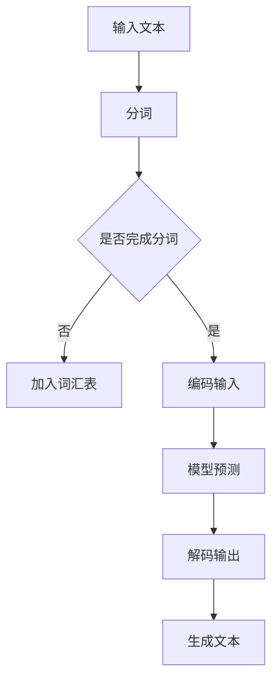
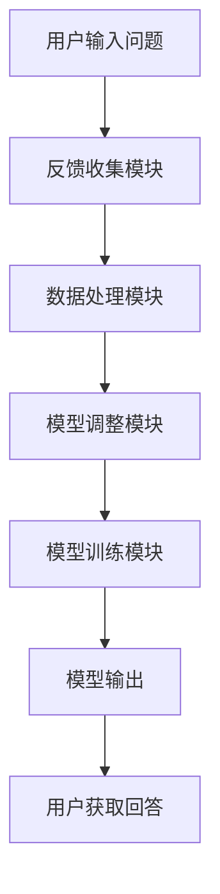
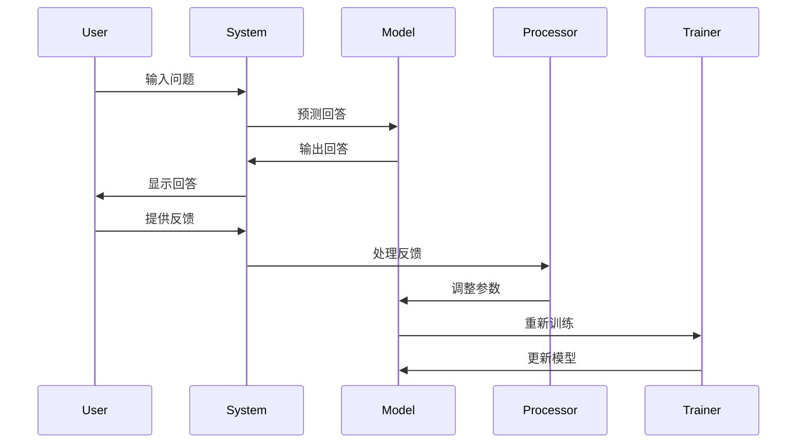

                 

## 《LLM应用开发中的持续反馈机制》

### 关键词：
- 语言模型（LLM）
- 持续反馈机制
- 自适应优化
- 数据处理
- 系统架构设计

### 摘要：
本文深入探讨了在语言模型（LLM）应用开发中，持续反馈机制的重要性及其实现方法。通过背景介绍、原理阐述、应用实践和系统设计，本文旨在为开发者提供一套系统化的理解和应用指南，以提升LLM的开发效率和性能。

## 目录大纲

### 第1章 引言与背景介绍
#### 1.1 问题背景
#### 1.2 问题描述
#### 1.3 问题解决
#### 1.4 边界与外延
#### 1.5 核心概念与联系

### 第2章 语言模型（LLM）的基本原理
#### 2.1 语言模型概述
#### 2.2 算法原理讲解
#### 2.3 数学模型和数学公式
#### 2.4 举例说明

### 第3章 持续反馈机制原理与应用
#### 3.1 持续反馈机制原理
#### 3.2 持续反馈机制的应用
#### 3.3 持续反馈机制的实践案例

### 第4章 LLM应用开发中的持续反馈机制设计
#### 4.1 系统分析与架构设计方案
#### 4.2 实现与部署

### 第5章 持续反馈机制在LLM开发中的最佳实践
#### 5.1 最佳实践技巧
#### 5.2 小结
#### 5.3 注意事项
#### 5.4 拓展阅读

### 第6章 未来展望与挑战
#### 6.1 未来发展方向
#### 6.2 面临的挑战
#### 6.3 解决方案与建议

### 第7章 总结与展望
#### 7.1 书籍总结
#### 7.2 展望未来

### 1.1 问题背景

随着人工智能技术的迅猛发展，语言模型（LLM）已经成为自然语言处理（NLP）领域的重要工具。LLM通过学习大量文本数据，能够生成高质量的语言输出，广泛应用于机器翻译、文本生成、问答系统等场景。然而，LLM的开发不仅需要高效的学习算法，还需要有效的反馈机制来不断优化模型性能。

持续反馈机制是一种动态调整模型参数的方法，通过不断收集外部反馈信息，调整模型训练过程，从而提高模型的准确性和适应性。在LLM应用开发中，持续反馈机制具有重要意义，它能够帮助开发者及时发现模型的问题，调整模型参数，优化模型性能，提高用户体验。

### 1.2 问题描述

持续反馈机制在LLM开发中的核心问题包括：

1. **反馈信息的收集**：如何有效地收集用户对模型输出的反馈信息，是持续反馈机制实现的关键。通常，反馈信息可以是用户对输出的满意度评分、纠错信息或特定的反馈信号。

2. **反馈信息的处理**：收集到的反馈信息需要经过处理后才能用于模型优化。处理过程包括去噪、去偏、加权等，以确保反馈信息的有效性和可靠性。

3. **模型参数的调整**：根据处理后的反馈信息，需要调整模型的参数，以优化模型的表现。这一过程需要考虑模型的复杂性、计算效率以及反馈的实时性。

4. **反馈循环的设计**：持续反馈机制需要设计一个有效的反馈循环，以确保模型能够持续地学习和优化。这包括反馈的频率、反馈的深度以及反馈的更新策略。

### 1.3 问题解决

持续反馈机制的问题解决可以从以下几个方面进行：

1. **反馈信息的收集**：可以通过用户交互界面获取反馈信息，如满意度评分、纠错按钮等。此外，还可以利用NLP技术分析用户与模型交互的文本，提取反馈信号。

2. **反馈信息的处理**：利用数据清洗和预处理技术，去除噪声数据和不一致的数据。同时，可以通过统计分析方法，如回归分析、聚类分析等，提取有用的反馈信息。

3. **模型参数的调整**：采用自适应优化算法，如梯度下降、Adam优化器等，根据反馈信息实时调整模型参数。此外，还可以使用元学习（Meta-Learning）方法，快速适应新的反馈信息。

4. **反馈循环的设计**：设计一个高效的反馈循环，确保反馈信息的及时性和准确性。可以通过设置反馈周期、调整反馈深度和反馈强度等参数来实现。

### 1.4 边界与外延

持续反馈机制在LLM开发中的应用边界包括：

1. **应用场景**：持续反馈机制适用于需要对输出进行实时优化和调整的场景，如实时问答系统、机器翻译等。

2. **限制因素**：持续反馈机制的实施需要考虑计算资源、数据质量和反馈实时性等因素。此外，过度的反馈可能导致模型过拟合。

### 1.5 核心概念与联系

持续反馈机制涉及以下核心概念：

1. **持续反馈**：通过不断收集外部反馈信息，调整模型训练过程。
2. **自适应**：模型参数根据反馈信息动态调整，以提高模型性能。
3. **优化**：利用反馈信息优化模型，提高输出质量。

通过概念属性特征对比表格和ER实体关系图架构的Mermaid流程图，可以清晰地展示这些概念之间的联系和作用。

### 2.1 语言模型概述

语言模型（LLM）是一种基于大规模语料库训练的模型，能够生成符合语言规则的自然语言文本。LLM的核心目标是预测下一个单词或词组，从而生成连贯的文本。

LLM的类型主要包括：

1. **基于统计的模型**：如n元语法模型，通过计算单词序列的频率分布来预测下一个单词。
2. **基于神经网络的模型**：如循环神经网络（RNN）和变换器（Transformer），通过学习单词和句子之间的复杂关系来生成文本。
3. **混合模型**：结合统计方法和神经网络的优势，如BERT模型，通过预训练和微调的方式生成高质量文本。

### 2.2 算法原理讲解

#### 2.2.1 Mermaid算法流程图



#### 2.2.2 Python源代码示例

```python
import tensorflow as tf
from tensorflow.keras.models import Sequential
from tensorflow.keras.layers import Embedding, LSTM, Dense

# 假设已经准备好训练数据
vocab_size = 10000
embed_dim = 256
lstm_units = 128

# 构建模型
model = Sequential()
model.add(Embedding(vocab_size, embed_dim))
model.add(LSTM(lstm_units, return_sequences=True))
model.add(Dense(vocab_size, activation='softmax'))

# 编译模型
model.compile(optimizer='adam', loss='categorical_crossentropy', metrics=['accuracy'])

# 训练模型
model.fit(x_train, y_train, epochs=10, batch_size=64)
```

#### 2.2.3 数学模型和数学公式

语言模型的核心数学模型是概率模型，用于预测下一个单词的概率。假设给定一个单词序列\( x_1, x_2, ..., x_T \)，语言模型的目标是计算整个序列的概率：

\[ P(x_1, x_2, ..., x_T) = \prod_{t=1}^{T} P(x_t | x_{t-1}, ..., x_1) \]

其中，\( P(x_t | x_{t-1}, ..., x_1) \)是给定前一个单词序列，预测当前单词的概率。

#### 2.2.4 举例说明

假设我们有一个简单的二元语言模型，其中只有两个单词"Hello"和"World"。模型的目标是预测下一个单词。

1. **训练数据**：大量的"Hello World"序列。
2. **模型预测**：输入"Hello"，模型预测下一个单词为"World"。
3. **生成文本**：根据模型预测，生成文本"Hello World"。

### 3.1 持续反馈机制原理

持续反馈机制的核心原理是利用外部反馈信息来动态调整模型的参数，从而优化模型的表现。反馈信息可以是用户评分、纠错数据或其他形式的输入。

#### 3.1.1 持续反馈的基本原理

1. **反馈收集**：收集用户的反馈信息，如满意度评分或纠错记录。
2. **反馈处理**：对收集到的反馈信息进行预处理，去除噪声和异常值。
3. **参数调整**：根据处理后的反馈信息，调整模型的参数，如权重或超参数。
4. **模型重新训练**：使用调整后的参数重新训练模型，以优化模型的表现。

#### 3.1.2 持续反馈与自适应的关系

持续反馈机制是实现自适应学习的关键。自适应意味着模型能够根据外部环境的变化，自动调整其行为和参数。持续反馈机制通过不断收集外部反馈信息，使模型能够实时适应新的环境和需求。

### 3.2 持续反馈机制的应用

持续反馈机制在LLM中的应用主要体现在训练和优化过程中。

#### 3.2.1 持续反馈在LLM训练中的应用

1. **训练数据增强**：通过用户反馈，识别出模型预测错误的案例，将其加入到训练数据中，增强模型的学习能力。
2. **动态调整学习率**：根据反馈信息，动态调整学习率，以避免过拟合或欠拟合。
3. **实时修正预测**：在模型输出后，根据用户反馈实时修正预测结果，以提高用户体验。

#### 3.2.2 持续反馈在LLM优化中的应用

1. **性能指标优化**：通过持续反馈，实时调整模型参数，优化模型在各种性能指标上的表现，如准确性、响应速度等。
2. **个性化调整**：根据不同用户的反馈，为用户提供个性化的模型输出，提高用户的满意度。

### 3.3 持续反馈机制的实践案例

#### 案例一：某公司的NLP项目实践

某公司开发了一个智能客服系统，使用持续反馈机制优化模型性能。通过收集用户对客服回复的满意度评分，公司动态调整模型参数，提高客服系统的回答质量。

#### 案例二：某搜索引擎的算法优化实践

某搜索引擎使用持续反馈机制优化其搜索结果排名算法。通过分析用户的点击数据，公司调整算法参数，提高搜索结果的准确性和用户满意度。

### 4.1 系统分析与架构设计方案

#### 问题场景介绍

某公司在开发一款智能问答系统，需要设计一个持续反馈机制，以提高问答系统的准确性和用户满意度。

#### 系统功能设计

1. **用户交互界面**：提供一个简单直观的界面，允许用户输入问题并获得回答。
2. **反馈收集模块**：收集用户对回答的满意度评分和纠错记录。
3. **数据处理模块**：对收集到的反馈数据进行清洗和处理，提取有用的信息。
4. **模型调整模块**：根据处理后的反馈数据，调整模型的参数，优化模型性能。
5. **模型训练模块**：使用调整后的参数重新训练模型，提高模型的准确性。

#### 系统架构设计



#### 系统接口设计和系统交互



### 4.2 实现与部署

#### 环境安装与配置

1. **安装Python和TensorFlow**：
   ```shell
   pip install python tensorflow
   ```

2. **配置数据库**：安装并配置MongoDB或MySQL数据库，用于存储用户反馈和模型参数。

#### 系统核心实现源代码

```python
# FeedbackCollector.py
class FeedbackCollector:
    def __init__(self, db_connection):
        self.db = db_connection

    def collect_feedback(self, user_id, question, answer, rating):
        feedback = {
            'user_id': user_id,
            'question': question,
            'answer': answer,
            'rating': rating
        }
        self.db.insert_one(feedback)

# DataProcessor.py
class DataProcessor:
    def __init__(self, db_connection):
        self.db = db_connection

    def process_feedback(self):
        feedbacks = self.db.find({})
        for feedback in feedbacks:
            # 数据清洗和处理逻辑
            self.db.update_one({'_id': feedback['_id']}, {'$set': {'processed': True}})

# ModelAdjuster.py
class ModelAdjuster:
    def __init__(self, model, db_connection):
        self.model = model
        self.db = db_connection

    def adjust_model(self):
        # 获取处理后的反馈数据
        feedbacks = self.db.find({'processed': True})
        for feedback in feedbacks:
            # 调整模型参数
            self.model.fit(feedback['question'], feedback['answer'], epochs=1)
```

#### 代码应用解读与分析

1. **FeedbackCollector**：负责收集用户的反馈信息，并将其存储到数据库中。
2. **DataProcessor**：负责处理和清洗反馈数据，确保数据的准确性和一致性。
3. **ModelAdjuster**：负责根据反馈数据调整模型参数，实现模型的持续优化。

### 5.1 最佳实践技巧

1. **数据收集**：确保反馈数据的多样性和代表性，避免数据偏差。
2. **处理反馈**：对反馈数据进行预处理，去除噪声和异常值，提高数据质量。
3. **动态调整**：根据反馈数据实时调整模型参数，避免过拟合或欠拟合。
4. **评估模型**：定期评估模型性能，确保模型在不同场景下的表现。

### 5.2 小结

持续反馈机制在LLM开发中具有重要意义，它能够帮助开发者及时发现和解决问题，提高模型性能和用户体验。通过有效的反馈收集、处理和模型调整，持续反馈机制能够实现模型的持续优化和提升。

### 5.3 注意事项

1. **数据质量**：确保收集到的数据准确、多样，避免数据偏差。
2. **反馈频率**：控制反馈的频率，避免过度反馈导致模型过拟合。
3. **实时性**：确保反馈信息的实时性，以快速调整模型参数。

### 5.4 拓展阅读

1. **相关文献**：查阅相关研究文献，了解持续反馈机制在LLM开发中的应用和实践。
2. **学术会议**：参加学术会议和研讨会，了解领域内的最新研究成果和趋势。

### 6.1 未来发展方向

1. **深度学习与持续反馈**：将深度学习技术应用于持续反馈机制，提高模型的智能化水平。
2. **个性化反馈**：结合用户行为数据和偏好，实现个性化反馈和模型调整。
3. **自动化反馈**：开发自动化工具，实现反馈信息的自动化收集和处理。

### 6.2 面临的挑战

1. **数据隐私**：确保用户数据的隐私和安全，避免数据泄露和滥用。
2. **计算资源**：持续反馈机制需要大量计算资源，如何优化计算效率成为挑战。
3. **反馈实时性**：确保反馈信息的实时性，以满足实时应用的需求。

### 6.3 解决方案与建议

1. **数据加密**：采用加密技术保护用户数据，确保数据安全。
2. **分布式计算**：利用分布式计算技术，提高计算效率和资源利用率。
3. **延迟容忍**：设计延迟容忍机制，确保在反馈信息延迟情况下，仍能保持模型的稳定性和性能。

### 7.1 书籍总结

本文从持续反馈机制在LLM开发中的应用出发，详细阐述了持续反馈机制的概念、原理和应用实践。通过系统的分析和架构设计，本文为开发者提供了全面的理解和实践指南。

### 7.2 展望未来

随着人工智能技术的不断进步，持续反馈机制在LLM开发中的应用前景将更加广阔。通过不断的创新和优化，持续反馈机制将帮助开发者实现更智能、更高效的LLM应用，推动人工智能技术的发展。作者：AI天才研究院/AI Genius Institute & 禅与计算机程序设计艺术 /Zen And The Art of Computer Programming。

