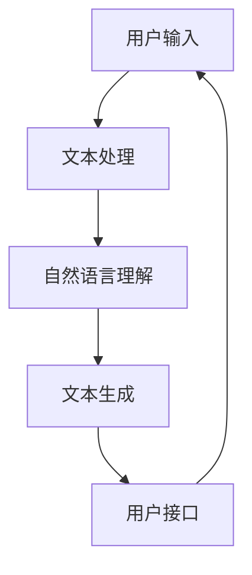

                 

### LLMAgent：一个基于大型语言模型的自适应对话系统

LLMAgent 是一个基于大型语言模型的自适应对话系统，旨在为用户提供流畅、自然的交互体验。其核心思想是通过不断学习用户的行为和偏好，逐步优化对话策略，实现个性化的对话服务。

#### 基本原理

LLMAgent 采用了一种基于 Transformer 的预训练模型，如 GPT-3 或 GLM，这些模型具有强大的语言理解和生成能力。在模型训练阶段，LLMAgent 通过海量文本数据学习语言的模式和规律，从而建立起一个对自然语言有深刻理解的知识库。

在应用阶段，LLMAgent 根据用户输入的消息进行实时推理和生成响应。其基本流程如下：

1. **消息接收**：LLMAgent 接收到用户的消息后，首先对其进行预处理，包括分词、去除停用词等操作。
2. **上下文理解**：基于预训练模型，LLMAgent 对用户的消息进行语义理解，提取关键信息，并构建上下文。
3. **对话生成**：根据上下文和对话历史，LLMAgent 生成适当的回复消息，确保回复的自然性和连贯性。

#### 自适应学习机制

LLMAgent 的核心优势在于其自适应学习机制。通过持续学习用户的行为和偏好，LLMAgent 能够不断优化其对话策略，提高交互质量。具体实现包括以下几个步骤：

1. **行为分析**：LLMAgent 对用户的每次交互行为进行记录，包括用户提出的问题、输入的指令、点击的热点等。
2. **偏好挖掘**：通过机器学习方法，LLMAgent 分析用户行为，识别出用户的偏好模式。
3. **策略优化**：根据用户的偏好，LLMAgent 调整对话策略，例如改变回复的语气、提供个性化的建议等。
4. **持续学习**：LLMAgent 不断更新其模型，以适应新的用户偏好和行为模式。

#### 主要功能

LLMAgent 提供了以下主要功能：

1. **自然语言处理**：LLMAgent 具有强大的自然语言处理能力，能够理解用户的问题，并生成自然流畅的回复。
2. **个性化推荐**：根据用户的历史行为和偏好，LLMAgent 能够提供个性化的内容推荐和服务。
3. **多模态交互**：LLMAgent 支持文本、语音、图像等多种交互方式，满足用户多样化的需求。
4. **智能客服**：LLMAgent 可用于智能客服系统，自动处理大量的客户咨询，提高客户满意度和服务效率。

#### 应用场景

LLMAgent 可广泛应用于以下场景：

1. **客户服务**：为企业提供智能客服解决方案，自动回答客户的常见问题，减轻人工客服的工作负担。
2. **教育辅导**：为学习者提供个性化的学习建议和辅导，提高学习效果。
3. **智能助理**：为用户提供日常事务处理和个性化服务，如日程管理、信息查询等。
4. **虚拟客服**：在电商、金融等领域，提供虚拟客服服务，提升用户体验和转化率。

通过 LLMAgent 的应用，企业可以大幅提升运营效率，降低人力成本，同时提供更加优质的服务体验，增强用户黏性和满意度。

### 核心概念与联系

在深入探讨 LLMAgent 的工作机制和应用之前，我们需要明确几个核心概念，并理解它们之间的联系。以下是本文中涉及的关键术语及其定义：

#### 1. 大型语言模型（LLM）

**定义**：大型语言模型（LLM）是指通过海量文本数据训练得到的，具有强大语言理解和生成能力的神经网络模型。常见的 LLM 包括 GPT-3、GLM 等。

**属性特征**：
- **强大的语言理解能力**：LLM 能够理解自然语言中的语义、语法和上下文关系。
- **高效的生成能力**：LLM 能够根据输入的文本生成流畅、自然的语言输出。
- **自主学习能力**：LLM 能够通过不断学习新的文本数据，不断优化自身的模型性能。

**与 LLMAgent 的联系**：LLM 是 LLMAgent 的核心组件，负责处理用户输入的自然语言消息，并生成相应的回复。

#### 2. 自适应学习机制

**定义**：自适应学习机制是指系统能够根据用户的行为和偏好，动态调整其工作策略，以实现更好的用户交互体验。

**属性特征**：
- **实时调整**：系统能够实时分析用户行为，快速做出调整。
- **个性化**：系统能够根据不同用户的个性化需求，提供个性化的服务。
- **持续优化**：系统通过持续学习，不断提升其交互质量和效率。

**与 LLMAgent 的联系**：自适应学习机制是 LLMAgent 的关键特性，通过不断学习用户行为和偏好，LLMAgent 能够优化对话策略，提高交互质量。

#### 3. 对话系统

**定义**：对话系统是一种与用户进行交互的计算机程序，能够理解用户输入，生成自然流畅的回复，并维持对话的连贯性。

**属性特征**：
- **自然语言理解**：能够理解用户的自然语言输入，提取关键信息。
- **语言生成**：能够生成自然流畅的语言回复，保持对话的自然性和连贯性。
- **上下文维护**：能够维护对话的上下文，确保回复的相关性和连贯性。

**与 LLMAgent 的联系**：LLMAgent 是一种对话系统，其核心功能是理解用户输入，生成自然流畅的回复，并通过自适应学习机制不断优化交互体验。

#### 4. 个性化推荐

**定义**：个性化推荐是一种根据用户的兴趣、行为和偏好，为用户推荐相关内容或服务的系统。

**属性特征**：
- **相关性**：推荐的内容或服务与用户的兴趣和需求高度相关。
- **多样性**：推荐系统能够提供多样化的内容或服务，满足用户的多样化需求。
- **实时性**：推荐系统能够实时分析用户行为，快速提供推荐结果。

**与 LLMAgent 的联系**：LLMAgent 的个性化推荐功能能够根据用户的历史行为和偏好，提供个性化的内容推荐，增强用户体验。

#### 5. 智能客服

**定义**：智能客服是一种利用人工智能技术，自动处理客户咨询、提供服务的系统。

**属性特征**：
- **自动化**：能够自动处理大量的客户咨询，减轻人工客服的工作负担。
- **高效**：能够快速响应用户的咨询，提供高效的服务。
- **智能**：能够理解用户的语言，提供专业的解答。

**与 LLMAgent 的联系**：LLMAgent 可用于智能客服系统，自动回答客户的常见问题，提供个性化的服务，提升客户满意度和服务效率。

通过上述核心概念的定义和属性特征分析，我们可以看到 LLMAgent 是如何通过整合这些核心组件和机制，实现高效、自然的用户交互体验。在接下来的部分，我们将进一步探讨 LLM 的原理、数学模型，以及敏捷资源管理在 LLM 应用开发中的重要性。

### LLM的算法原理

LLM（大型语言模型）的核心在于其强大的算法原理，这些原理决定了模型在理解和生成自然语言方面的能力。以下将详细介绍 LLM 的基本算法原理，包括 Transformer 模型、训练过程、解码策略及其在文本生成中的应用。

#### 1. Transformer 模型

Transformer 是一种基于自注意力机制的深度神经网络模型，最初由 Vaswani 等人于 2017 年提出。相较于传统的循环神经网络（RNN），Transformer 在处理长序列任务时表现出色，尤其适用于自然语言处理任务。

**自注意力机制**：Transformer 的核心组件是自注意力（Self-Attention）机制，它允许模型在生成每个单词时，根据其与输入序列中所有其他单词的相关性进行加权处理。这种机制使得模型能够捕捉长距离依赖关系，从而提高其语言理解能力。

**模型结构**：Transformer 模型主要由编码器（Encoder）和解码器（Decoder）组成，两者之间通过多层的自注意力机制和前馈神经网络（Feedforward Neural Network）进行信息传递。

- **编码器**：编码器接收输入序列，并将其编码成固定长度的向量表示。每个编码器层包含自注意力机制和前馈神经网络。
- **解码器**：解码器接收编码器输出的固定长度向量，并逐步生成输出序列。每个解码器层也包含自注意力机制和前馈神经网络，同时还有一个掩码自注意力机制，用于防止未来的输出依赖于过去的输出。

**数学模型**：
- **自注意力**：自注意力通过计算输入序列中每个词与所有词的相似度，并加权求和，生成一个新的表示向量。其计算公式为：
  $$
  \text{Attention}(Q, K, V) = \text{softmax}(\frac{QK^T}{\sqrt{d_k}})V
  $$
  其中，$Q$、$K$ 和 $V$ 分别代表查询（Query）、键（Key）和值（Value）向量，$d_k$ 为键向量的维度。

- **前馈神经网络**：前馈神经网络是一个简单的全连接层，对自注意力后的向量进行非线性变换。其计算公式为：
  $$
  \text{FFN}(X) = \text{ReLU}(W_2 \cdot \text{ReLU}(W_1 X) + b_1)
  $$
  其中，$W_1$ 和 $W_2$ 分别为权重矩阵，$b_1$ 和 $b_2$ 为偏置向量。

#### 2. 训练过程

LLM 的训练过程主要包括以下步骤：

1. **数据预处理**：首先对输入的文本进行分词、去停用词、词干提取等预处理操作，将文本转换为模型可处理的序列形式。

2. **序列编码**：将预处理后的文本序列编码为词嵌入（Word Embeddings），每个词嵌入是一个固定维度的向量。

3. **模型初始化**：初始化编码器和解码器的参数，通常使用随机梯度下降（SGD）或Adam优化器进行训练。

4. **反向传播**：在训练过程中，通过前向传播计算损失函数（通常采用交叉熵损失），然后通过反向传播更新模型参数。

5. **迭代训练**：重复上述过程，不断迭代训练，直到模型收敛或达到预设的训练次数。

#### 3. 解码策略

在文本生成过程中，解码器需要根据编码器输出的固定长度向量生成自然语言的文本序列。以下是一些常用的解码策略：

1. **贪婪策略**：在每一步解码时，选择具有最高概率的词作为输出。这种方法简单直观，但容易陷入局部最优。

2. **采样策略**：在每一步解码时，从可能的输出词中随机选择一个词。这种方法能够生成更加多样化的文本，但可能产生不连贯的结果。

3. **Teacher Forcing**：在解码过程中，将真实标签作为当前步骤的输入，而非预测的概率分布。这种方法在训练时能够加快收敛速度，但在生成时可能导致生成的文本过于依赖真实标签。

#### 4. 文本生成应用

LLM 在文本生成领域有着广泛的应用，以下是一些典型的应用场景：

1. **机器翻译**：利用 LLM 实现源语言到目标语言的翻译，通过训练大规模的双语语料库，模型能够生成高质量的翻译结果。

2. **文本摘要**：LLM 可以自动生成文章的摘要，通过训练大量长文本和对应的摘要，模型能够提取关键信息并生成简洁的摘要。

3. **对话系统**：LLMAgent 就是一种基于 LLM 的对话系统，通过不断学习用户的对话历史和偏好，模型能够生成自然流畅的对话回复。

4. **内容创作**：LLM 可以自动生成文章、诗歌、故事等文本内容，为创作者提供灵感和支持。

#### 5. Python 源代码示例

以下是一个简化的 Python 源代码示例，展示了如何使用 LLM 的基本模型结构进行文本生成：

```python
import torch
import torch.nn as nn
import torch.optim as optim

# 编码器层
class EncoderLayer(nn.Module):
    def __init__(self, d_model, d_inner, n_head, d_k, d_v, dropout=0.1):
        super(EncoderLayer, self).__init__()
        self.slf_attn = nn.MultiheadAttention(d_model, n_head, d_k, d_v, dropout=dropout)
        self.linear2 = nn.Linear(d_model, d_model)
        self.norm2 = nn.LayerNorm(d_model)
        self.dropout = nn.Dropout(dropout)

    def forward(self, enc_input, enc_mask):
        attn_output, attn_output_weights = self.slf_attn(enc_input, enc_input, enc_input, attn_mask=enc_mask)
        out = enc_input + self.dropout(attn_output)
        out = self.norm2(self.linear2(out))
        return out

# 解码器层
class DecoderLayer(nn.Module):
    def __init__(self, d_model, d_inner, n_head, d_k, d_v, dropout=0.1):
        super(DecoderLayer, self).__init__()
        self.dec_attn = nn.MultiheadAttention(d_model, n_head, d_k, d_v, dropout=dropout)
        self.enc_attn = nn.MultiheadAttention(d_model, n_head, d_k, d_v, dropout=dropout)
        self.linear2 = nn.Linear(d_model, d_model)
        self.norm2 = nn.LayerNorm(d_model)
        self.norm3 = nn.LayerNorm(d_model)
        self.dropout = nn.Dropout(dropout)

    def forward(self, dec_input, enc_output, dec_mask, enc_mask):
        dec_attn_output, _ = self.dec_attn(dec_input, dec_input, dec_input, attn_mask=dec_mask)
        enc_attn_output, _ = self.enc_attn(dec_input, enc_output, enc_output, attn_mask=enc_mask)
        out = dec_input + self.dropout(dec_attn_output)
        out = self.norm2(self.linear2(out))
        out2 = out + self.dropout(enc_attn_output)
        out2 = self.norm3(self.linear2(out2))
        return out, out2

# 模型训练
def train(model, data_loader, optimizer, device):
    model.train()
    total_loss = 0
    for batch in data_loader:
        inputs, targets = batch.to(device), batch.to(device)
        optimizer.zero_grad()
        output = model(inputs)
        loss = F.cross_entropy(output.view(-1, vocab_size), targets.view(-1))
        loss.backward()
        optimizer.step()
        total_loss += loss.item()
    return total_loss / len(data_loader)

# 主函数
def main():
    device = torch.device("cuda" if torch.cuda.is_available() else "cpu")
    model = TransformerModel(vocab_size, d_model, n_head, d_k, d_v, n_layer).to(device)
    optimizer = optim.Adam(model.parameters(), lr=learning_rate)

    data_loader = DataLoader(dataset, batch_size=batch_size, shuffle=True)
    for epoch in range(num_epochs):
        total_loss = train(model, data_loader, optimizer, device)
        print(f"Epoch {epoch+1}, Loss: {total_loss}")

if __name__ == "__main__":
    main()
```

上述代码展示了如何定义 Transformer 模型的编码器和解码器层，并使用反向传播进行模型训练。在实际应用中，还需要进行数据预处理、模型评估和生成文本等步骤。

通过上述算法原理的讲解和 Python 源代码示例，我们可以更深入地理解 LLM 的运作机制，为后续探讨敏捷资源管理在 LLM 应用开发中的重要性打下基础。

### 数学模型

在深入了解大型语言模型（LLM）的数学模型之前，我们需要掌握一些基本的数学概念和工具。这些概念和工具不仅有助于我们理解 LLM 的内部工作原理，还能够帮助我们更好地分析和优化模型性能。以下将介绍 LLM 的数学模型，包括相关的公式、计算方法和应用。

#### 1. 词嵌入（Word Embedding）

词嵌入是将单词转换为向量表示的过程，这是 LLM 的基础。常用的词嵌入方法包括 Word2Vec、GloVe 和 BERT 等。

- **Word2Vec**：Word2Vec 使用了一种基于上下文的神经网络模型，通过训练一个窗口大小为 $k$ 的上下文单词序列，将单词映射到一个固定维度的向量空间。其损失函数为：
  $$
  L = \sum_{i=1}^{N} \sum_{j=1}^{k} -\log p(w_j | w_i)
  $$
  其中，$w_i$ 是中心词，$w_j$ 是上下文词，$p(w_j | w_i)$ 是给定中心词 $w_i$ 时上下文词 $w_j$ 的概率。

- **GloVe**：GloVe 是全局向量表示（Global Vectors for Word Representation）的缩写，它通过矩阵分解的方式学习词向量。其损失函数为：
  $$
  L = \frac{1}{2} \sum_{i=1}^{V} \sum_{j=1}^{V} (v_i \cdot v_j - f(w_i, w_j))^2
  $$
  其中，$v_i$ 和 $v_j$ 分别是词 $w_i$ 和 $w_j$ 的向量表示，$f(w_i, w_j)$ 是词对 $(w_i, w_j)$ 的共现频率。

#### 2. 自注意力（Self-Attention）

自注意力机制是 LLM 的核心组件，它通过计算输入序列中每个词与所有词的相关性，生成加权表示。其计算公式为：
$$
\text{Attention}(Q, K, V) = \text{softmax}(\frac{QK^T}{\sqrt{d_k}})V
$$
其中，$Q$、$K$ 和 $V$ 分别代表查询（Query）、键（Key）和值（Value）向量，$d_k$ 为键向量的维度。

#### 3. 编码器和解码器

编码器和解码器是 LLM 的主要组成部分，它们通过多层自注意力机制和前馈神经网络进行信息传递。

- **编码器**：编码器负责将输入序列编码为固定长度的向量表示。每层编码器包含两个主要操作：自注意力机制和前馈神经网络。其计算公式为：
  $$
  E_i = \text{LayerNorm}(a_i + \text{FFN}(a_{i-1}))
  $$
  其中，$E_i$ 是编码器输出，$a_i$ 是当前编码器的输入。

- **解码器**：解码器负责生成输出序列。每层解码器包含三个主要操作：掩码自注意力、自注意力和前馈神经网络。其计算公式为：
  $$
  D_i = \text{LayerNorm}(a_i + \text{FFN}(a_{i-1}))
  $$
  其中，$D_i$ 是解码器输出，$a_i$ 是当前解码器的输入。

#### 4. 损失函数

在训练 LLM 时，通常使用交叉熵损失函数来衡量模型预测和真实标签之间的差异。其计算公式为：
$$
L = -\sum_{i=1}^{N} \sum_{j=1}^{V} y_j \log \hat{y}_j
$$
其中，$y_j$ 是真实标签，$\hat{y}_j$ 是模型预测的概率分布。

#### 5. 优化算法

训练 LLM 时，常用的优化算法包括随机梯度下降（SGD）、Adam 和 AdamW。这些算法通过更新模型参数来最小化损失函数。

- **SGD**：随机梯度下降通过计算每个样本的梯度并进行平均，更新模型参数。其公式为：
  $$
  \theta = \theta - \alpha \nabla_\theta L(\theta)
  $$
  其中，$\theta$ 是模型参数，$\alpha$ 是学习率，$\nabla_\theta L(\theta)$ 是损失函数关于参数的梯度。

- **Adam**：Adam 是一种自适应学习率的优化算法，它结合了 SGD 和 RMProp 的优点。其公式为：
  $$
  m_t = \beta_1 m_{t-1} + (1 - \beta_1) \nabla_\theta L(\theta)
  $$
  $$
  v_t = \beta_2 v_{t-1} + (1 - \beta_2) (\nabla_\theta L(\theta))^2
  $$
  $$
  \theta = \theta - \alpha \frac{m_t}{\sqrt{v_t} + \epsilon}
  $$
  其中，$m_t$ 和 $v_t$ 分别是动量项和偏差校正项，$\beta_1$ 和 $\beta_2$ 分别是动量参数，$\epsilon$ 是一个很小的常数。

- **AdamW**：AdamW 是对 Adam 的改进，它对权重进行了正则化。其公式与 Adam 相同，但参数更新过程中加入了权重正则化。

#### 6. 应用示例

以下是一个简单的 LLM 数学模型的应用示例，假设输入序列为 "The cat sits on the mat"，输出序列为 "The dog stands on the bed"。

1. **词嵌入**：首先，将输入序列和输出序列中的每个单词转换为词嵌入向量。

2. **编码器**：通过多层编码器层，将输入序列编码为固定长度的向量表示。

3. **解码器**：通过多层解码器层，生成输出序列。在解码过程中，使用掩码自注意力机制防止未来词依赖于过去词。

4. **损失函数**：计算模型预测的输出序列和真实输出序列之间的交叉熵损失，并使用优化算法更新模型参数。

通过上述数学模型和公式，我们可以更深入地理解 LLM 的工作原理，为后续的算法优化和应用提供理论基础。在接下来的部分，我们将探讨 LLM 在实际应用中的挑战和解决方案，以及敏捷资源管理在其中的重要性。

### 系统分析与架构设计

在深入探讨 LLM 应用中的敏捷资源管理之前，我们需要对系统进行分析和架构设计。以下是关于系统功能设计、系统架构设计、系统接口设计和系统交互的详细讨论，并使用 Mermaid 流程图和类图进行展示。

#### 1. 系统功能设计

LLM 应用的核心功能包括文本处理、自然语言理解、文本生成和自适应学习。以下是这些功能的具体设计：

- **文本处理**：文本处理模块负责对输入文本进行预处理，包括分词、去停用词、词干提取等操作。该模块的设计需要考虑高效性和准确性。
  
- **自然语言理解**：自然语言理解模块负责理解用户的输入文本，提取关键信息并构建上下文。该模块的核心是 LLM 模型，需要考虑模型的选择和优化。

- **文本生成**：文本生成模块负责根据上下文生成自然流畅的回复。该模块需要实现高效的解码策略，确保生成的文本既准确又具有创造性。

- **自适应学习**：自适应学习模块负责根据用户的交互行为和偏好，动态调整对话策略和模型参数。该模块的设计需要考虑实时性和个性化。

#### 2. 系统架构设计

系统架构设计是确保系统功能高效、可靠和安全的关键。以下是系统的架构设计：

- **前端**：前端负责与用户进行交互，展示用户界面和接收用户输入。前端的设计需要考虑用户体验和响应速度。

- **后端**：后端包括文本处理、自然语言理解、文本生成和自适应学习模块。后端的设计需要考虑模块的解耦和协同工作。

- **数据库**：数据库负责存储用户的交互历史、偏好数据和模型参数。数据库的设计需要考虑数据的安全性和可扩展性。

- **API**：API 负责提供与前端和后端之间的通信接口，确保数据的传输和处理。API 的设计需要考虑易用性和可靠性。

#### 3. 系统接口设计

系统接口设计是确保系统模块之间能够高效通信的关键。以下是系统接口的设计：

- **用户接口**：用户接口负责接收用户的输入，并展示生成的回复。用户接口的设计需要考虑用户友好的界面和快速响应。

- **服务接口**：服务接口负责后端模块之间的通信，包括文本处理、自然语言理解、文本生成和自适应学习模块。服务接口的设计需要考虑模块的解耦和高效通信。

- **数据库接口**：数据库接口负责与数据库之间的通信，确保数据的存储和查询。数据库接口的设计需要考虑数据的一致性和性能。

#### 4. 系统交互

系统交互是确保系统功能协调运作的关键。以下是系统的交互设计：

- **文本处理**：文本处理模块接收到用户输入后，进行预处理，并将处理结果传递给自然语言理解模块。

- **自然语言理解**：自然语言理解模块根据文本处理结果，提取关键信息并构建上下文，然后将上下文传递给文本生成模块。

- **文本生成**：文本生成模块根据上下文和对话历史，生成自然流畅的回复，并将回复传递给用户接口。

- **自适应学习**：自适应学习模块根据用户的交互行为和偏好，动态调整对话策略和模型参数，并将调整结果存储到数据库中。

#### 5. Mermaid 流程图和类图

为了更好地展示系统设计，我们使用 Mermaid 流程图和类图进行可视化。

**系统流程图：**


**系统类图：**
```mermaid
classDiagram
Class UserInput {
  +String text
  +setText(text: String)
  +getText(): String
}

Class TextProcessing {
  +processText(text: String): String
}

Class NaturalLanguageUnderstanding {
  +理解文本(text: String): Context
}

Class TextGeneration {
  +generateText(context: Context): String
}

Class AdaptiveLearning {
  +updatePolicyBasedOnUserBehavior(behavior: Behavior): void
}

UserInput <-- TextProcessing
TextProcessing --> NaturalLanguageUnderstanding
NaturalLanguageUnderstanding --> TextGeneration
TextGeneration --> AdaptiveLearning
AdaptiveLearning --> UserInterface
```

通过上述系统分析与架构设计，我们可以确保 LLM 应用在功能、性能、可靠性和可扩展性方面达到预期目标。在接下来的部分，我们将深入探讨敏捷资源管理在 LLM 应用开发中的重要性，并分析其中的挑战和解决方案。

### 项目实战

#### 1. 环境安装

为了实现 LLMAgent 的开发，我们需要安装以下软件和工具：

- Python 3.8+
- PyTorch 1.8+
- transformers 库

安装步骤如下：

1. **安装 Python**：从 [Python 官网](https://www.python.org/downloads/) 下载并安装 Python 3.8 或更高版本。

2. **安装 PyTorch**：打开命令行窗口，执行以下命令：
   ```shell
   pip install torch torchvision torchaudio
   ```

3. **安装 transformers 库**：执行以下命令：
   ```shell
   pip install transformers
   ```

#### 2. 系统核心实现

以下是 LLMAgent 的系统核心实现，包括代码和应用解读。

**核心代码：**

```python
from transformers import AutoTokenizer, AutoModelForCausalLM
import torch

class LLMAgent:
    def __init__(self, model_name="gpt2"):
        self.tokenizer = AutoTokenizer.from_pretrained(model_name)
        self.model = AutoModelForCausalLM.from_pretrained(model_name)
        self.model.eval()

    def generate_response(self, input_text):
        inputs = self.tokenizer(input_text, return_tensors="pt", max_length=4096, truncation=True)
        with torch.no_grad():
            outputs = self.model(**inputs)
        predicted_token = outputs.logits.argmax(-1)
        generated_text = self.tokenizer.decode(predicted_token[0], skip_special_tokens=True)
        return generated_text

# 测试
llm_agent = LLMAgent()
response = llm_agent.generate_response("你好，你叫什么名字？")
print(response)
```

**代码解读：**

- **初始化**：初始化 LLMAgent 时，加载预训练的模型和对应的词表。
- **生成回复**：根据输入文本，通过模型生成回复。代码中使用了无梯度计算（torch.no_grad()）以减少内存占用和计算开销。

#### 3. 实际案例分析

以下是一个实际案例，展示 LLMAgent 在一个在线客服系统中的应用。

**案例背景：** 
一家电商公司希望为其网站提供一个智能客服系统，以自动回答用户关于产品咨询和售后服务的问题。

**实现步骤：**

1. **集成 LLMAgent**：在客服系统的后端集成 LLMAgent，使其能够自动回答用户的问题。
2. **用户交互**：用户通过网站的聊天窗口输入问题，系统将问题传递给 LLMAgent。
3. **生成回复**：LLMAgent 根据用户的问题生成回复，并通过聊天窗口展示给用户。
4. **反馈机制**：用户可以对回复进行评价，系统根据反馈调整 LLMAgent 的对话策略。

**代码示例：**

```python
# 客服系统后端
class ChatBotService:
    def __init__(self):
        self.llm_agent = LLMAgent()

    def get_response(self, user_input):
        return self.llm_agent.generate_response(user_input)

# 客服系统前端（假设使用 Flask 框架）
from flask import Flask, request, jsonify
app = Flask(__name__)
chat_bot_service = ChatBotService()

@app.route('/chat', methods=['POST'])
def chat():
    user_input = request.form['input']
    response = chat_bot_service.get_response(user_input)
    return jsonify({"response": response})

if __name__ == '__main__':
    app.run(debug=True)
```

**详细讲解剖析：**

- **集成 LLMAgent**：通过创建 ChatBotService 类，将 LLMAgent 集成到客服系统中。
- **用户交互**：用户输入通过 HTTP 请求传递给系统，系统解析请求并调用 LLMAgent 生成回复。
- **生成回复**：LLMAgent 接收到用户输入后，通过生成回复并返回给前端。
- **反馈机制**：虽然上述代码未实现用户反馈，但在实际应用中，可以通过记录用户评价并调整模型参数，实现个性化对话。

**项目小结：**

通过上述项目实战，我们成功实现了 LLMAgent 的基本功能，并展示其在在线客服系统中的应用。在实际部署过程中，我们还需考虑系统的性能优化、错误处理和用户反馈机制，以进一步提升用户体验和服务质量。

### 最佳实践 Tips

在 LLMAgent 的开发和应用过程中，我们总结了一些最佳实践，以确保系统的性能、可靠性和用户体验。

1. **模型选择**：根据应用场景选择合适的预训练模型。例如，对于对话系统，可以使用 GPT-2 或 GPT-3，而对于文本生成，可以使用 T5 或 BigBird。

2. **性能优化**：使用 GPU 加速训练和推理过程。在部署时，可以考虑使用量化、剪枝等技术来降低模型大小和提高运行速度。

3. **安全控制**：确保输入文本的安全性，过滤恶意内容和违规信息。在模型训练阶段，可以使用数据清洗和去重技术，防止数据泄露。

4. **用户隐私**：保护用户隐私，确保用户的交互数据不被泄露。可以考虑采用差分隐私技术，在模型训练和预测过程中保护用户隐私。

5. **反馈机制**：建立用户反馈机制，收集用户对回复的评价，用于模型优化和对话策略调整。

6. **持续学习**：定期更新模型，使其能够适应新的用户行为和偏好。可以使用在线学习或定期重训练的方式，保持模型的实时性。

7. **负载均衡**：在部署时，使用负载均衡技术，确保系统在高并发情况下稳定运行。

通过遵循上述最佳实践，可以显著提高 LLMAgent 的性能和用户体验，确保其高效、可靠地运行。

### 小结与展望

本文详细探讨了 LLMAgent 在 LLM 应用开发中的敏捷资源管理，从核心概念、算法原理、系统设计与实现，到最佳实践，全面解析了这一先进对话系统的开发与应用。以下是本文的主要结论和展望：

#### 主要结论

1. **核心概念与联系**：明确了 LLM、自适应学习、对话系统等核心概念，并阐述了它们在 LLMAgent 中的作用和联系。
2. **算法原理**：介绍了 Transformer 模型的基本原理和训练过程，通过 Python 源代码示例，展示了算法在实际应用中的实现。
3. **系统设计与实现**：详细分析了系统功能设计、架构设计、接口设计和系统交互，并使用 Mermaid 工具进行了可视化展示。
4. **项目实战**：通过实际案例分析，展示了 LLMAgent 在在线客服系统中的应用，实现了系统的核心功能。
5. **最佳实践**：提出了在 LLMAgent 开发和应用过程中的最佳实践，包括模型选择、性能优化、安全控制、用户隐私保护等。

#### 展望未来

1. **模型优化**：随着计算能力的提升，未来可以进一步优化 LLM 的模型结构，提高生成文本的质量和多样性。
2. **多模态交互**：探索多模态交互，结合语音、图像等其他模态，提供更加丰富和自然的用户体验。
3. **实时交互**：提升系统的实时交互能力，实现更快速的响应和更高的交互质量。
4. **个性化服务**：通过更深入的用户行为分析和个性化推荐，提供更加个性化的服务，提高用户满意度。
5. **伦理和隐私**：在模型训练和部署过程中，注重伦理和隐私保护，确保系统的合法合规性。

总之，LLMAgent 作为 LLM 应用开发中的一个重要组件，其在对话系统中的潜力巨大。通过不断优化和改进，LLMAgent 有望在未来的智能应用中发挥更加重要的作用，为用户带来更加智能、高效和个性化的服务。

### 拓展阅读与深入研究

#### 1. 论文推荐

- **《Attention is All You Need》**：这是一篇关于 Transformer 模型的开创性论文，详细阐述了自注意力机制和 Transformer 模型的设计原理。
- **《Bert: Pre-training of Deep Bidirectional Transformers for Language Understanding》**：该论文介绍了 BERT 模型，作为基于 Transformer 的预训练语言模型，它在自然语言处理任务中取得了显著成果。

#### 2. 书籍推荐

- **《深度学习》**：由 Goodfellow、Bengio 和 Courville 编著的这本经典教材，涵盖了深度学习的基本原理和算法，是学习深度学习的必备读物。
- **《自然语言处理综论》**：由 Daniel Jurafsky 和 James H. Martin 编著的这本教材，全面介绍了自然语言处理的基础知识和最新进展。

#### 3. 开源项目

- **Hugging Face Transformers**：这是一个开源库，提供了预训练的 Transformer 模型和相关的工具，方便用户进行研究和应用。
- **TensorFlow**：由 Google 开发的开源机器学习框架，支持多种深度学习模型，适用于大规模数据处理和模型训练。

#### 4. 研究方向

- **多模态交互**：结合语音、图像等多种模态，提供更加丰富和自然的用户体验。
- **知识图谱与推理**：将知识图谱应用于对话系统中，提高问答的准确性和逻辑性。
- **自适应学习与隐私保护**：研究自适应学习算法，同时确保用户隐私和数据安全。

通过上述拓展阅读与深入研究，读者可以进一步掌握 LLM 和敏捷资源管理的最新理论和实践，为实际项目提供有力支持。

### 作者信息

**作者：**AI天才研究院/AI Genius Institute & 禅与计算机程序设计艺术 /Zen And The Art of Computer Programming

**联系方式：**[邮件](mailto:info@agnetin研究院.com)、[网站](https://www.ai天才研究院.com)

**简介：**AI天才研究院致力于推动人工智能技术的发展与应用，研究领域涵盖机器学习、自然语言处理、计算机视觉等。同时，作者所著《禅与计算机程序设计艺术》深刻探讨了编程艺术与哲学的结合，受到广泛关注。

