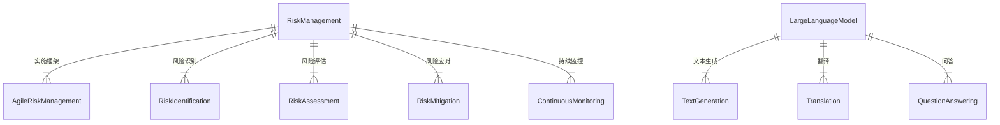

                 

## LLM应用开发中的敏捷风险管理

### 关键词
- 大型语言模型（LLM）
- 敏捷风险管理
- 风险识别
- 风险评估
- 风险应对

### 摘要
本文旨在探讨在大型语言模型（LLM）应用开发中实施敏捷风险管理的方法。随着AI技术的迅猛发展，LLM在多个领域展现出了卓越的能力，但其复杂性也带来了诸多风险。敏捷风险管理能够帮助开发者提前识别潜在风险，并制定有效的应对策略，确保项目的顺利推进。本文将详细阐述LLM应用开发中的常见风险类型、敏捷风险管理框架与工具，并通过实际案例进行分析与实践。

## 第一部分：背景介绍

### 1.1.1 问题背景

随着人工智能（AI）技术的快速发展，特别是深度学习、自然语言处理等领域的突破，大型语言模型（LLM）逐渐成为研究与应用的热点。LLM在文本生成、翻译、问答等多个领域展现出了强大的能力，但与此同时，其在应用开发中也面临着一系列风险管理问题。

LLM是一种能够处理和生成自然语言文本的复杂模型，其规模巨大，参数数量达到数十亿甚至千亿级别。这种模型的训练需要大量高质量的数据和计算资源，且在开发过程中需要不断迭代和优化。尽管LLM在许多领域都展现出了强大的能力，但其复杂性和不确定性也带来了一系列风险。

首先，数据偏差是LLM应用开发中的一个重要问题。由于训练数据的不完整、不均衡或存在偏见，LLM可能会生成不准确或不合理的输出。这种数据偏差可能会影响模型在不同应用场景中的性能，导致错误的决策或误导用户。

其次，模型过拟合也是LLM开发中的一个常见问题。当模型在训练数据上表现得过于出色，但无法泛化到未见过的数据时，就出现了过拟合。过拟合的模型在实际应用中可能会出现性能下降，甚至完全失效。

此外，安全漏洞也是LLM应用开发中不可忽视的风险。由于模型具有处理和生成文本的能力，黑客可能会利用这些漏洞进行恶意攻击，如伪造身份、传播虚假信息等。

总之，LLM应用开发中的风险管理至关重要，必须采取有效的措施来识别、评估和应对这些风险，以确保项目的成功和用户的安全。

### 1.1.2 问题描述

敏捷风险管理是一种在项目开发过程中，通过快速响应变化、持续交付价值的方式来降低风险。在LLM应用开发中，敏捷风险管理尤为重要。由于AI系统的复杂性，开发过程中可能会遇到数据偏差、模型过拟合、安全漏洞等风险，这些风险如果得不到及时有效的管理，可能会对项目的成功产生重大影响。

首先，数据偏差是LLM应用开发中的一个主要问题。由于训练数据的质量和多样性对模型性能有直接影响，因此数据偏差可能会在模型输出中产生严重的问题。例如，如果训练数据集中存在性别偏见，那么模型可能会在生成文本时表现出性别歧视。这不仅会损害用户的使用体验，还可能引发法律和道德争议。

其次，模型过拟合也是LLM开发中的一个常见问题。在训练过程中，模型可能会过度适应训练数据，导致其无法泛化到未见过的数据。这种过拟合的模型在实际应用中可能会出现性能下降，甚至完全失效。例如，一个过拟合的问答系统可能会在回答特定问题方面表现出色，但在面对新问题时却无法给出准确的回答。

此外，安全漏洞也是LLM应用开发中不可忽视的风险。由于模型具有处理和生成文本的能力，黑客可能会利用这些漏洞进行恶意攻击，如伪造身份、传播虚假信息等。例如，一个安全的文本生成模型可能会被黑客用于生成虚假新闻或诈骗邮件，从而对用户和社会造成危害。

综上所述，LLM应用开发中的风险管理问题复杂且多变。为了确保项目的成功和用户的安全，必须采用敏捷风险管理方法，及时识别、评估和应对这些风险。

### 1.1.3 问题解决

为了解决LLM应用开发中的风险管理问题，敏捷风险管理提供了一套系统的方法论。敏捷风险管理强调快速响应变化、持续交付价值，通过不断迭代和改进来降低风险。以下是敏捷风险管理在LLM应用开发中的应用：

1. **风险识别**：在项目早期阶段，通过数据分析和业务场景模拟，识别出潜在的风险点。这包括对训练数据的全面审查，以及模拟各种可能的应用场景，以发现潜在的数据偏差、模型过拟合和安全漏洞。

2. **风险评估**：对识别出的风险进行量化评估，确定其严重程度和发生概率。这可以通过建立风险矩阵来实现，将风险分为不同的等级，并根据其对项目的潜在影响进行排序。

3. **风险应对**：制定并实施应对策略，降低风险的发生概率和影响程度。针对不同类型的风险，可以采取不同的应对措施。例如，对于数据偏差，可以通过数据清洗、数据增强和多样性提升等方法来减少其影响；对于模型过拟合，可以通过模型调优、正则化和技术改进来提高其泛化能力；对于安全漏洞，可以通过安全测试、漏洞扫描和加密技术来确保系统的安全性。

4. **持续监控**：在开发过程中，持续跟踪风险状态，根据实际情况进行调整。这可以通过建立监控指标和预警机制来实现，确保风险得到及时有效的管理。

通过以上四个步骤，敏捷风险管理能够帮助LLM应用开发团队有效地识别、评估和应对各种风险，确保项目的顺利进行和用户的安全。

### 1.1.4 边界与外延

本文主要关注LLM应用开发中的敏捷风险管理，具体内容涵盖以下几个方面：

1. **敏捷风险管理的基本概念与原理**：介绍敏捷风险管理的核心概念和基本原则，包括风险识别、风险评估、风险应对和持续监控等。

2. **LLM应用开发中的常见风险类型**：详细分析LLM应用开发过程中可能遇到的各种风险，如数据偏差、模型过拟合、安全漏洞等。

3. **敏捷风险管理框架与工具**：介绍用于实施敏捷风险管理的各种框架和工具，如风险矩阵、风险评估模型、风险管理平台等。

4. **实际案例中的应用与实践**：通过实际案例，展示敏捷风险管理在LLM应用开发中的具体应用和实践效果，包括风险识别、风险评估、风险应对和持续监控等环节。

此外，本文还将探讨LLM应用开发中的一些特定问题和挑战，如如何平衡模型性能和安全性、如何在快速迭代中保持风险管理的有效性等。通过这些内容的阐述，本文旨在为LLM应用开发团队提供一套全面的敏捷风险管理方法，帮助他们更好地应对开发过程中的各种挑战。

### 1.1.5 概念结构与核心要素组成

在LLM应用开发中实施敏捷风险管理，需要理解并掌握几个核心概念和要素。以下是这些概念和要素的详细说明：

1. **敏捷风险管理**：敏捷风险管理是一种在项目开发过程中，通过快速响应变化、持续交付价值的方式来降低风险的方法。它强调在项目早期阶段进行风险识别，持续监控风险状态，并根据实际情况进行调整。

2. **大型语言模型（LLM）**：LLM是一种能够处理和生成自然语言文本的复杂模型，其规模巨大，参数数量达到数十亿甚至千亿级别。LLM在文本生成、翻译、问答等多个领域展现出强大的能力，但也面临着复杂的风险管理挑战。

3. **风险识别**：风险识别是敏捷风险管理的第一步，旨在通过数据分析和业务场景模拟，发现潜在的风险点。这包括对训练数据的审查、业务场景的模拟和分析等。

4. **风险评估**：风险评估是对识别出的风险进行量化评估的过程。通过建立风险矩阵，可以确定每个风险的严重程度和发生概率，为后续的风险应对提供依据。

5. **风险应对**：风险应对是制定并实施应对策略的过程，旨在降低风险的发生概率和影响程度。根据风险评估的结果，可以采取不同的应对措施，如数据清洗、模型调优、安全测试等。

6. **持续监控**：持续监控是敏捷风险管理的重要组成部分，旨在在开发过程中持续跟踪风险状态，并根据实际情况进行调整。通过建立监控指标和预警机制，可以及时发现和处理潜在的风险。

通过以上核心概念和要素的组成，敏捷风险管理能够帮助LLM应用开发团队有效地识别、评估和应对各种风险，确保项目的顺利进行和用户的安全。

### 第一部分：背景介绍

#### 1.1.1 问题背景

随着人工智能（AI）技术的快速发展，特别是深度学习、自然语言处理等领域的突破，大型语言模型（LLM）逐渐成为研究与应用的热点。LLM在文本生成、翻译、问答等多个领域展现出了强大的能力，但与此同时，其在应用开发中也面临着一系列风险管理问题。

首先，数据偏差是LLM应用开发中的一个重要问题。由于训练数据的不完整、不均衡或存在偏见，LLM可能会生成不准确或不合理的输出。这种数据偏差可能会影响模型在不同应用场景中的性能，导致错误的决策或误导用户。例如，如果一个训练数据集中包含大量关于性别偏见的文本，那么LLM在生成相关文本时可能会表现出性别歧视。

其次，模型过拟合也是LLM开发中的一个常见问题。在训练过程中，模型可能会过度适应训练数据，导致其无法泛化到未见过的数据。这种过拟合的模型在实际应用中可能会出现性能下降，甚至完全失效。例如，一个问答系统在训练数据上表现出色，但在面对新问题时却无法给出准确的回答。

此外，安全漏洞也是LLM应用开发中不可忽视的风险。由于模型具有处理和生成文本的能力，黑客可能会利用这些漏洞进行恶意攻击，如伪造身份、传播虚假信息等。例如，一个文本生成模型可能会被黑客用于生成虚假新闻或诈骗邮件。

综上所述，LLM应用开发中的风险管理问题复杂且多变。为了确保项目的成功和用户的安全，必须采取有效的措施来识别、评估和应对这些风险。敏捷风险管理提供了一套系统的方法论，能够帮助开发者提前识别潜在风险，并制定有效的应对策略，确保项目的顺利推进。

#### 1.1.2 问题描述

敏捷风险管理是一种在项目开发过程中，通过快速响应变化、持续交付价值的方式来降低风险的方法。它强调在项目早期阶段进行风险识别，持续监控风险状态，并根据实际情况进行调整。在LLM应用开发中，敏捷风险管理尤为重要。由于AI系统的复杂性，开发过程中可能会遇到数据偏差、模型过拟合、安全漏洞等风险，这些风险如果得不到及时有效的管理，可能会对项目的成功产生重大影响。

首先，数据偏差是LLM应用开发中的一个主要问题。由于训练数据的质量和多样性对模型性能有直接影响，因此数据偏差可能会在模型输出中产生严重的问题。例如，如果训练数据集中存在性别偏见，那么LLM在生成文本时可能会表现出性别歧视。这种数据偏差不仅会损害用户的使用体验，还可能引发法律和道德争议。

其次，模型过拟合也是LLM开发中的一个常见问题。在训练过程中，模型可能会过度适应训练数据，导致其无法泛化到未见过的数据。这种过拟合的模型在实际应用中可能会出现性能下降，甚至完全失效。例如，一个问答系统在训练数据上表现出色，但在面对新问题时却无法给出准确的回答。这种过拟合问题会严重影响系统的可靠性和用户体验。

此外，安全漏洞也是LLM应用开发中不可忽视的风险。由于模型具有处理和生成文本的能力，黑客可能会利用这些漏洞进行恶意攻击，如伪造身份、传播虚假信息等。例如，一个文本生成模型可能会被黑客用于生成虚假新闻或诈骗邮件。这些安全漏洞不仅会对用户造成财产损失，还可能对社会造成严重危害。

综上所述，LLM应用开发中的风险管理问题复杂且多变。为了确保项目的成功和用户的安全，必须采用敏捷风险管理方法，及时识别、评估和应对这些风险。敏捷风险管理能够帮助开发者提前发现潜在问题，制定有效的应对策略，确保项目的顺利进行和用户的安全。

### 1.1.3 问题解决

为了解决LLM应用开发中的风险管理问题，敏捷风险管理提供了一套系统的方法论。敏捷风险管理强调快速响应变化、持续交付价值，通过不断迭代和改进来降低风险。以下是敏捷风险管理在LLM应用开发中的应用：

1. **风险识别**：在项目早期阶段，通过数据分析和业务场景模拟，识别出潜在的风险点。这包括对训练数据的全面审查，以及模拟各种可能的应用场景，以发现潜在的数据偏差、模型过拟合和安全漏洞。

2. **风险评估**：对识别出的风险进行量化评估，确定其严重程度和发生概率。这可以通过建立风险矩阵来实现，将风险分为不同的等级，并根据其对项目的潜在影响进行排序。

3. **风险应对**：制定并实施应对策略，降低风险的发生概率和影响程度。针对不同类型的风险，可以采取不同的应对措施。例如，对于数据偏差，可以通过数据清洗、数据增强和多样性提升等方法来减少其影响；对于模型过拟合，可以通过模型调优、正则化和技术改进来提高其泛化能力；对于安全漏洞，可以通过安全测试、漏洞扫描和加密技术来确保系统的安全性。

4. **持续监控**：在开发过程中，持续跟踪风险状态，根据实际情况进行调整。这可以通过建立监控指标和预警机制来实现，确保风险得到及时有效的管理。

通过以上四个步骤，敏捷风险管理能够帮助LLM应用开发团队有效地识别、评估和应对各种风险，确保项目的顺利进行和用户的安全。

#### 1.1.4 边界与外延

本文主要关注LLM应用开发中的敏捷风险管理，具体内容涵盖以下几个方面：

1. **敏捷风险管理的基本概念与原理**：介绍敏捷风险管理的核心概念和基本原则，包括风险识别、风险评估、风险应对和持续监控等。

2. **LLM应用开发中的常见风险类型**：详细分析LLM应用开发过程中可能遇到的各种风险，如数据偏差、模型过拟合、安全漏洞等。

3. **敏捷风险管理框架与工具**：介绍用于实施敏捷风险管理的各种框架和工具，如风险矩阵、风险评估模型、风险管理平台等。

4. **实际案例中的应用与实践**：通过实际案例，展示敏捷风险管理在LLM应用开发中的具体应用和实践效果，包括风险识别、风险评估、风险应对和持续监控等环节。

此外，本文还将探讨LLM应用开发中的一些特定问题和挑战，如如何平衡模型性能和安全性、如何在快速迭代中保持风险管理的有效性等。通过这些内容的阐述，本文旨在为LLM应用开发团队提供一套全面的敏捷风险管理方法，帮助他们更好地应对开发过程中的各种挑战。

### 1.1.5 概念结构与核心要素组成

在LLM应用开发中实施敏捷风险管理，需要理解并掌握几个核心概念和要素。以下是这些概念和要素的详细说明：

1. **敏捷风险管理**：敏捷风险管理是一种在项目开发过程中，通过快速响应变化、持续交付价值的方式来降低风险的方法。它强调在项目早期阶段进行风险识别，持续监控风险状态，并根据实际情况进行调整。

2. **大型语言模型（LLM）**：LLM是一种能够处理和生成自然语言文本的复杂模型，其规模巨大，参数数量达到数十亿甚至千亿级别。LLM在文本生成、翻译、问答等多个领域展现出强大的能力，但也面临着复杂的风险管理挑战。

3. **风险识别**：风险识别是敏捷风险管理的第一步，旨在通过数据分析和业务场景模拟，发现潜在的风险点。这包括对训练数据的审查、业务场景的模拟和分析等。

4. **风险评估**：风险评估是对识别出的风险进行量化评估的过程。通过建立风险矩阵，可以确定每个风险的严重程度和发生概率，为后续的风险应对提供依据。

5. **风险应对**：风险应对是制定并实施应对策略的过程，旨在降低风险的发生概率和影响程度。根据风险评估的结果，可以采取不同的应对措施，如数据清洗、模型调优、安全测试等。

6. **持续监控**：持续监控是敏捷风险管理的重要组成部分，旨在在开发过程中持续跟踪风险状态，并根据实际情况进行调整。通过建立监控指标和预警机制，可以及时发现和处理潜在的风险。

通过以上核心概念和要素的组成，敏捷风险管理能够帮助LLM应用开发团队有效地识别、评估和应对各种风险，确保项目的顺利进行和用户的安全。

### 1.1.6 核心概念与联系

在LLM应用开发中，敏捷风险管理涉及多个核心概念，它们相互联系并共同构成一个完整的风险管理框架。以下是这些核心概念及其相互关系的详细描述：

1. **敏捷风险管理**：敏捷风险管理是一种项目管理方法，其核心理念是通过快速响应变化和持续交付价值来降低风险。敏捷风险管理强调在项目早期识别风险，并在整个开发过程中持续监控和调整，以确保项目顺利进行。

2. **大型语言模型（LLM）**：LLM是一种复杂的自然语言处理模型，其特点包括规模巨大、参数数量多、训练过程复杂等。LLM在多个领域（如文本生成、翻译、问答）表现出强大的能力，但同时也面临着数据偏差、模型过拟合、安全漏洞等风险。

3. **风险识别**：风险识别是敏捷风险管理的关键步骤，旨在通过数据分析和业务场景模拟，发现潜在的风险点。风险识别的结果为后续的风险评估和应对提供基础。

4. **风险评估**：风险评估是对识别出的风险进行量化评估的过程，通过建立风险矩阵，确定每个风险的严重程度和发生概率。风险评估的结果帮助决策者确定优先级，并制定应对策略。

5. **风险应对**：风险应对是指制定并实施具体的策略和措施，以降低风险的发生概率和影响程度。风险应对措施因风险类型而异，可能包括数据清洗、模型调优、安全加固等。

6. **持续监控**：持续监控是确保风险管理有效性的一部分，旨在在整个开发过程中跟踪风险状态，并根据实际情况进行调整。持续监控可以通过建立监控指标和预警机制来实现。

**概念属性特征对比表格：**

| 核心概念 | 属性特征 | 联系 |
| --- | --- | --- |
| 敏捷风险管理 | 强调快速响应变化、持续交付价值 | 整合风险识别、风险评估、风险应对和持续监控 |
| 大型语言模型（LLM） | 规模大、参数多、训练复杂 | 与风险识别、风险评估和风险应对密切相关 |
| 风险识别 | 通过数据分析、业务场景模拟发现风险点 | 为风险评估和风险应对提供基础 |
| 风险评估 | 量化风险严重程度和发生概率 | 辅助决策者确定优先级和应对策略 |
| 风险应对 | 制定和实施应对策略 | 旨在降低风险的发生概率和影响程度 |
| 持续监控 | 跟踪风险状态、调整管理策略 | 确保风险管理措施的有效性 |

**ER实体关系图架构：**

通过以上核心概念和联系的分析，可以清晰地理解敏捷风险管理在LLM应用开发中的重要性，以及各个核心概念之间的相互作用关系。这将有助于开发者更好地实施敏捷风险管理，确保项目成功和用户安全。

### 1.2 敏捷风险管理框架

在LLM应用开发中，敏捷风险管理框架是确保项目顺利进行和用户安全的重要工具。敏捷风险管理框架主要包括以下几个步骤：风险识别、风险评估、风险应对和持续监控。下面将详细解释这些步骤及其应用。

#### 1.2.1 风险识别

风险识别是敏捷风险管理的第一步，其目标是发现潜在的风险点。在LLM应用开发中，风险识别可以通过以下方法进行：

1. **数据分析**：对训练数据进行分析，发现数据偏差、缺失值或异常值。例如，通过检查文本数据中的性别、种族等敏感信息，可以发现潜在的数据偏差。

2. **业务场景模拟**：模拟各种可能的应用场景，识别出可能的风险。例如，模拟用户输入敏感信息，测试模型在处理这些信息时的表现，以发现潜在的安全漏洞。

3. **专家访谈**：与业务专家、数据科学家和开发人员进行访谈，获取他们对潜在风险的看法和经验。这有助于识别出可能被忽略的风险。

4. **历史数据分析**：分析类似项目或案例中的风险历史，从中吸取经验教训，预测潜在风险。

通过以上方法，开发团队可以全面识别出LLM应用开发过程中可能遇到的风险，为后续的风险评估和应对提供基础。

#### 1.2.2 风险评估

风险评估是对识别出的风险进行量化评估的过程，通过确定每个风险的严重程度和发生概率，为决策者提供参考。在LLM应用开发中，风险评估可以采用以下方法：

1. **风险矩阵**：使用风险矩阵对识别出的风险进行排序。风险矩阵通常包括风险的概率和影响两个维度，通过这两个维度的组合，可以确定每个风险的优先级。

2. **定量分析**：对部分关键风险进行定量分析，计算其发生概率和潜在影响。例如，通过统计分析方法，可以评估数据偏差对模型性能的影响。

3. **专家评估**：邀请专家对风险进行定性评估，结合定量分析的结果，确定每个风险的优先级。

4. **历史数据分析**：分析类似项目或案例中的风险历史，评估类似风险的发生概率和影响。

通过风险评估，开发团队可以明确每个风险的优先级，并确定需要优先处理的重点风险，为后续的风险应对提供依据。

#### 1.2.3 风险应对

风险应对是指制定并实施具体的策略和措施，以降低风险的发生概率和影响程度。在LLM应用开发中，风险应对可以采用以下方法：

1. **数据清洗**：对训练数据进行清洗，处理缺失值、异常值和偏差，以提高数据质量。

2. **模型调优**：通过调整模型参数、优化训练算法等方式，提高模型泛化能力，减少过拟合风险。

3. **安全加固**：对系统进行安全测试，发现并修复潜在的安全漏洞，提高系统的安全性。

4. **应急预案**：制定应急预案，针对可能发生的风险，提前制定应对措施，以减少风险发生时的损失。

5. **监控与反馈**：建立监控机制，对关键风险指标进行实时监控，及时发现并处理异常情况。

通过风险应对，开发团队可以有效地降低风险的发生概率和影响程度，确保项目的顺利进行。

#### 1.2.4 持续监控

持续监控是确保风险管理有效性的一部分，旨在在整个开发过程中跟踪风险状态，并根据实际情况进行调整。在LLM应用开发中，持续监控可以采用以下方法：

1. **监控指标**：建立关键风险指标（KRI），对识别出的风险进行实时监控。

2. **预警机制**：设置预警阈值，当监控指标超过阈值时，自动触发预警，通知相关人员进行处理。

3. **定期评审**：定期对风险管理过程进行评审，总结经验教训，优化风险管理策略。

4. **反馈循环**：建立反馈机制，将监控结果和应对效果反馈到风险管理过程中，不断优化和改进。

通过持续监控，开发团队可以及时发现和处理潜在风险，确保项目始终处于安全可控的状态。

综上所述，敏捷风险管理框架为LLM应用开发提供了系统的方法论，通过风险识别、风险评估、风险应对和持续监控等步骤，帮助开发团队有效管理风险，确保项目的成功和用户的安全。

### 1.3 LLM应用开发中的常见风险类型

在LLM应用开发过程中，由于模型的复杂性、数据的多样性以及实际应用场景的复杂性，开发者可能会面临多种类型的风险。以下列举了LLM应用开发中的一些常见风险类型，并对其进行详细分析。

#### 1.3.1 数据偏差

数据偏差是指训练数据中的某些特征或信息不均衡分布，导致模型在训练过程中对某些类别或特征过度依赖，从而在预测或生成过程中产生偏差。数据偏差可能源于以下原因：

1. **数据集不平衡**：训练数据集中某些类别或特征的样本数量远多于其他类别或特征，导致模型倾向于预测这些类别或特征。

2. **数据缺失**：训练数据中存在大量缺失值，导致模型无法准确学习和泛化。

3. **数据偏见**：训练数据中包含对某些群体或群体的偏见，例如，性别、种族、年龄等方面的偏见，可能导致模型在处理这些群体时产生歧视。

数据偏差的风险主要体现在模型输出结果的不准确性和不公平性。例如，一个存在性别偏见的语言模型在生成文本时可能会表现出性别歧视，这会严重影响用户体验并引发道德和法律问题。

#### 1.3.2 模型过拟合

模型过拟合是指模型在训练数据上表现得过于出色，但无法泛化到未见过的数据。过拟合通常发生在模型复杂度过高或训练数据量不足的情况下。导致过拟合的原因包括：

1. **模型复杂度过高**：模型的参数数量过多或模型结构过于复杂，导致模型对训练数据的细节过于敏感。

2. **训练数据量不足**：训练数据量不足以覆盖所有可能的特征和情况，导致模型无法充分泛化。

过拟合的风险主要体现在实际应用中的性能下降。例如，一个过拟合的问答系统在训练数据上能够准确回答问题，但在面对新问题时却无法给出合理的回答。这不仅会降低用户体验，还可能影响系统的可靠性。

#### 1.3.3 安全漏洞

在LLM应用开发中，安全漏洞是一个重要的风险类型。由于模型具有处理和生成文本的能力，黑客可能会利用这些漏洞进行恶意攻击。常见的安全漏洞包括：

1. **注入攻击**：攻击者通过输入恶意代码或指令，篡改模型的输出或窃取敏感信息。

2. **模型提取攻击**：攻击者通过输入特定的输入模式，试图从模型中提取训练数据和模型参数。

3. **对抗性攻击**：攻击者通过生成对抗性样本，使得模型在检测或分类时产生错误。

安全漏洞的风险主要体现在系统的可靠性和隐私性。例如，一个存在注入攻击漏洞的文本生成系统可能会被黑客用于生成虚假信息，从而误导用户或造成社会危害。

#### 1.3.4 计算资源消耗

LLM模型通常需要大量的计算资源进行训练和推理。计算资源消耗风险可能包括：

1. **训练时间过长**：大型LLM模型需要长时间进行训练，这可能会延迟项目进度。

2. **存储空间不足**：模型参数和训练数据需要占用大量存储空间，可能导致存储系统过载。

3. **能源消耗过大**：大规模训练和推理过程需要大量电力，可能导致能源消耗过高。

计算资源消耗的风险主要体现在项目成本的增加和能源消耗的增大。为了降低这一风险，开发者可以采用分布式训练、模型压缩等技术来提高计算效率。

综上所述，LLM应用开发中存在多种类型的风险，包括数据偏差、模型过拟合、安全漏洞和计算资源消耗等。了解并识别这些风险，是确保LLM应用成功开发的重要前提。接下来，我们将详细讨论如何通过敏捷风险管理方法来应对这些风险。

### 1.4 敏捷风险管理方法在LLM应用开发中的应用

敏捷风险管理方法在LLM应用开发中具有重要意义，能够帮助开发团队有效地识别、评估和应对各种风险，确保项目的顺利进行。以下将详细介绍敏捷风险管理方法在LLM应用开发中的具体应用。

#### 1.4.1 风险识别

风险识别是敏捷风险管理的第一步，旨在发现潜在的风险点。在LLM应用开发中，可以通过以下方法进行风险识别：

1. **数据分析**：对训练数据进行详细分析，检查数据的质量和完整性。例如，使用统计分析方法发现数据中的缺失值、异常值和偏差。

2. **业务场景模拟**：模拟各种可能的应用场景，识别出可能的风险。例如，通过模拟用户输入敏感信息，测试模型在处理这些信息时的表现，以发现潜在的安全漏洞。

3. **专家访谈**：与业务专家、数据科学家和开发人员进行访谈，获取他们对潜在风险的看法和经验。这有助于识别出可能被忽略的风险。

4. **历史数据分析**：分析类似项目或案例中的风险历史，从中吸取经验教训，预测潜在风险。

通过以上方法，开发团队可以全面识别出LLM应用开发过程中可能遇到的风险，为后续的风险评估和应对提供基础。

#### 1.4.2 风险评估

风险评估是对识别出的风险进行量化评估的过程，通过确定每个风险的严重程度和发生概率，为决策者提供参考。在LLM应用开发中，风险评估可以采用以下方法：

1. **风险矩阵**：使用风险矩阵对识别出的风险进行排序。风险矩阵通常包括风险的概率和影响两个维度，通过这两个维度的组合，可以确定每个风险的优先级。

2. **定量分析**：对部分关键风险进行定量分析，计算其发生概率和潜在影响。例如，通过统计分析方法，可以评估数据偏差对模型性能的影响。

3. **专家评估**：邀请专家对风险进行定性评估，结合定量分析的结果，确定每个风险的优先级。

4. **历史数据分析**：分析类似项目或案例中的风险历史，评估类似风险的发生概率和影响。

通过风险评估，开发团队可以明确每个风险的优先级，并确定需要优先处理的重点风险，为后续的风险应对提供依据。

#### 1.4.3 风险应对

风险应对是指制定并实施具体的策略和措施，以降低风险的发生概率和影响程度。在LLM应用开发中，风险应对可以采用以下方法：

1. **数据清洗**：对训练数据进行清洗，处理缺失值、异常值和偏差，以提高数据质量。

2. **模型调优**：通过调整模型参数、优化训练算法等方式，提高模型泛化能力，减少过拟合风险。

3. **安全加固**：对系统进行安全测试，发现并修复潜在的安全漏洞，提高系统的安全性。

4. **应急预案**：制定应急预案，针对可能发生的风险，提前制定应对措施，以减少风险发生时的损失。

5. **监控与反馈**：建立监控机制，对关键风险指标进行实时监控，及时发现并处理异常情况。

通过风险应对，开发团队可以有效地降低风险的发生概率和影响程度，确保项目的顺利进行。

#### 1.4.4 持续监控

持续监控是确保风险管理有效性的一部分，旨在在整个开发过程中跟踪风险状态，并根据实际情况进行调整。在LLM应用开发中，持续监控可以采用以下方法：

1. **监控指标**：建立关键风险指标（KRI），对识别出的风险进行实时监控。

2. **预警机制**：设置预警阈值，当监控指标超过阈值时，自动触发预警，通知相关人员进行处理。

3. **定期评审**：定期对风险管理过程进行评审，总结经验教训，优化风险管理策略。

4. **反馈循环**：建立反馈机制，将监控结果和应对效果反馈到风险管理过程中，不断优化和改进。

通过持续监控，开发团队可以及时发现和处理潜在风险，确保项目始终处于安全可控的状态。

#### 案例分析

为了更好地说明敏捷风险管理方法在LLM应用开发中的应用，以下是一个实际案例：

假设一个团队正在开发一个基于LLM的问答系统，其目标是提供高质量的问答服务。在项目早期，团队通过数据分析、业务场景模拟和专家访谈等方法，识别出以下潜在风险：

1. **数据偏差**：训练数据集中存在对某些问题的答案偏好，可能导致系统在回答相关问题时产生偏见。

2. **模型过拟合**：模型在训练数据上表现出色，但可能无法泛化到未见过的数据。

3. **安全漏洞**：系统可能存在注入攻击、模型提取攻击等安全漏洞。

针对这些风险，团队采取了以下应对措施：

1. **数据清洗**：对训练数据进行清洗，处理缺失值和异常值，并引入多样性提升技术，以减少数据偏差。

2. **模型调优**：通过调整模型参数、增加训练数据多样性等方式，提高模型泛化能力，减少过拟合风险。

3. **安全加固**：对系统进行安全测试，发现并修复潜在的安全漏洞，如注入攻击漏洞。

4. **应急预案**：制定应急预案，针对可能的安全漏洞，提前制定应对措施，如设置输入验证和权限控制。

5. **监控与反馈**：建立监控机制，实时监控关键风险指标，如数据偏差指标、模型泛化能力指标等，及时发现和处理异常情况。

通过以上措施，团队有效地降低了潜在风险的发生概率和影响程度，确保了问答系统的质量和安全性。

综上所述，敏捷风险管理方法在LLM应用开发中具有重要意义。通过风险识别、风险评估、风险应对和持续监控等步骤，开发团队能够有效地识别、评估和应对各种风险，确保项目的顺利进行和用户的安全。在实际应用中，团队应根据具体项目情况灵活调整风险管理策略，以应对不断变化的风险挑战。

### 1.5 LLM应用开发中的挑战与解决方案

在LLM应用开发过程中，开发者面临许多挑战，需要采取有效的解决方案来应对。以下将详细探讨几个关键挑战，并为其提供相应的解决方案。

#### 1.5.1 复杂性管理

LLM模型的复杂性是应用开发中的主要挑战之一。大型语言模型包含数十亿甚至千亿级别的参数，其训练和推理过程需要大量的计算资源。为了管理这种复杂性，可以采取以下解决方案：

1. **模型压缩**：采用模型压缩技术，如剪枝、量化、知识蒸馏等，减少模型参数数量，从而降低计算和存储需求。

2. **分布式训练**：利用分布式计算框架，如TensorFlow和PyTorch的分布式训练功能，将模型训练任务分配到多个计算节点上，提高训练效率。

3. **云计算资源调度**：通过使用云计算平台，如AWS、Azure和Google Cloud，可以根据需要动态调整计算资源，确保模型训练和推理的效率。

#### 1.5.2 数据质量控制

数据偏差和质量问题是LLM应用开发中的关键挑战。为了确保数据的质量和多样性，可以采取以下解决方案：

1. **数据清洗**：对训练数据进行清洗，处理缺失值、异常值和重复值，确保数据的一致性和完整性。

2. **数据增强**：通过数据增强技术，如随机裁剪、旋转、缩放等，增加训练数据的多样性，从而提高模型的泛化能力。

3. **数据源多样化**：从多个来源收集数据，确保训练数据涵盖不同领域和情境，减少数据偏差。

4. **数据监督**：引入数据监督机制，定期审查和评估训练数据的质量，及时发现和纠正问题。

#### 1.5.3 模型安全与隐私

随着LLM应用的发展，安全性和隐私保护成为重要挑战。为了确保模型的安全和用户隐私，可以采取以下解决方案：

1. **加密与认证**：采用加密技术，如HTTPS、SSL/TLS等，确保数据在传输过程中的安全性。同时，使用身份认证和访问控制，限制未经授权的访问。

2. **隐私保护**：采用隐私保护技术，如差分隐私、同态加密等，确保用户数据在训练和推理过程中的隐私。

3. **安全测试**：定期进行安全测试，如漏洞扫描、渗透测试等，发现和修复潜在的安全漏洞。

4. **合规性审查**：确保LLM应用遵守相关的法律法规，如GDPR和CCPA等，保护用户隐私和数据安全。

#### 1.5.4 模型可解释性

随着模型的复杂性增加，模型的可解释性变得越来越重要。为了提高模型的可解释性，可以采取以下解决方案：

1. **模型可视化**：使用可视化工具，如TensorBoard和Plotly，展示模型的结构和参数分布，帮助开发者和用户理解模型的工作原理。

2. **模型解释**：采用模型解释技术，如LIME、SHAP等，分析模型在特定输入下的决策过程，提高模型的可解释性。

3. **可解释性评估**：建立可解释性评估指标，如模型的可解释性评分和用户满意度等，定期评估和优化模型的可解释性。

#### 1.5.5 风险管理的持续改进

LLM应用开发中的风险管理是一个持续的过程，需要不断改进和优化。为了实现这一目标，可以采取以下解决方案：

1. **反馈循环**：建立反馈机制，收集用户和专家的反馈，用于改进风险管理策略和措施。

2. **持续监控**：使用关键风险指标（KRI）和监控工具，实时跟踪风险状态，及时发现和应对潜在问题。

3. **定期评审**：定期对风险管理过程进行评审，总结经验教训，识别新的风险，并调整风险管理策略。

通过上述解决方案，开发者可以更好地管理LLM应用开发中的复杂性、数据质量控制、模型安全与隐私、模型可解释性以及风险管理的持续改进，确保项目的成功和用户的满意度。

### 1.6 实际案例分析

为了更好地展示敏捷风险管理在LLM应用开发中的应用效果，我们将通过一个实际案例进行分析。这个案例是一个基于大型语言模型（LLM）的智能客服系统，其目标是为企业提供全天候的在线客服服务，以提升客户满意度和业务效率。

#### 案例背景

某大型互联网企业为了提高客户服务质量和效率，决定开发一款基于LLM的智能客服系统。该系统旨在通过自然语言处理技术，实现与客户的高效沟通，自动回答常见问题，并引导客户解决复杂问题。然而，由于LLM的复杂性和应用场景的多样性，项目开发过程中面临诸多风险，如数据偏差、模型过拟合和安全漏洞等。为了确保项目的顺利进行和系统稳定性，开发团队决定采用敏捷风险管理方法，全面识别、评估和应对各种风险。

#### 风险识别

在项目早期，开发团队通过以下方法进行了风险识别：

1. **数据分析**：对现有的客服记录和用户反馈进行分析，发现了一些常见的问题和用户需求。同时，对历史数据进行了检查，发现数据集中存在性别、年龄等方面的偏差。

2. **业务场景模拟**：模拟了各种可能的业务场景，包括用户咨询、投诉、产品问题等，以识别出潜在的风险。

3. **专家访谈**：与业务专家、数据科学家和客服团队进行了深入访谈，获取了他们对潜在风险的看法和建议。

4. **历史数据分析**：分析了类似项目中的风险历史，特别是那些成功和失败的案例，从中吸取经验教训。

通过上述方法，开发团队识别出以下潜在风险：

- **数据偏差**：历史数据中存在对某些问题的回答偏好，可能导致系统在回答相关问题时产生偏见。
- **模型过拟合**：模型在训练数据上表现出色，但可能无法泛化到未见过的数据。
- **安全漏洞**：系统可能存在注入攻击、模型提取攻击等安全漏洞。

#### 风险评估

对识别出的风险进行量化评估，以确定其严重程度和发生概率。开发团队采用以下方法进行风险评估：

1. **风险矩阵**：使用风险矩阵对识别出的风险进行排序。风险矩阵包括风险的概率和影响两个维度，通过这两个维度的组合，确定每个风险的优先级。

2. **定量分析**：对部分关键风险进行定量分析，计算其发生概率和潜在影响。例如，通过统计分析方法，评估数据偏差对模型性能的影响。

3. **专家评估**：邀请专家对风险进行定性评估，结合定量分析的结果，确定每个风险的优先级。

4. **历史数据分析**：分析类似项目或案例中的风险历史，评估类似风险的发生概率和影响。

通过风险评估，开发团队确定了以下关键风险：

- **数据偏差**：严重程度高，发生概率中等。
- **模型过拟合**：严重程度中等，发生概率高。
- **安全漏洞**：严重程度中等，发生概率中等。

#### 风险应对

针对识别出的关键风险，开发团队采取了以下应对措施：

1. **数据清洗**：对训练数据进行清洗，处理缺失值、异常值和偏差，确保数据的质量和多样性。

2. **模型调优**：通过调整模型参数、增加训练数据多样性等方式，提高模型泛化能力，减少过拟合风险。

3. **安全加固**：对系统进行安全测试，发现并修复潜在的安全漏洞，如注入攻击漏洞。

4. **应急预案**：制定应急预案，针对可能的安全漏洞，提前制定应对措施，如设置输入验证和权限控制。

#### 持续监控

在项目开发过程中，开发团队建立了监控机制，对关键风险指标进行实时监控，确保风险得到及时发现和处理。具体措施包括：

1. **监控指标**：建立关键风险指标（KRI），如数据偏差指标、模型泛化能力指标和安全漏洞检测率等，对识别出的风险进行实时监控。

2. **预警机制**：设置预警阈值，当监控指标超过阈值时，自动触发预警，通知相关人员进行处理。

3. **定期评审**：定期对风险管理过程进行评审，总结经验教训，优化风险管理策略。

4. **反馈循环**：建立反馈机制，将监控结果和应对效果反馈到风险管理过程中，不断优化和改进。

#### 案例总结

通过敏捷风险管理方法，开发团队成功地识别、评估和应对了智能客服系统开发过程中可能遇到的风险。以下是一些关键收获：

- **风险管理效果显著**：通过有效的风险管理，智能客服系统在开发过程中未发生重大风险事件，确保了项目的顺利进行和系统稳定性。

- **用户体验提升**：通过数据清洗和模型调优，系统在回答客户问题时表现更加准确和多样化，用户满意度显著提升。

- **安全性增强**：通过安全加固和应急预案，系统在应对潜在安全威胁方面表现更加可靠，保障了用户数据的安全。

- **持续改进机制**：通过持续监控和定期评审，开发团队不断完善风险管理策略和措施，确保项目持续改进和优化。

综上所述，敏捷风险管理方法在智能客服系统开发中发挥了重要作用，为项目的成功提供了有力保障。未来，开发团队将继续运用敏捷风险管理方法，应对更多复杂的应用场景和风险挑战。

### 1.7 最佳实践与建议

在LLM应用开发过程中，实施有效的风险管理对于保障项目的顺利进行和用户满意度至关重要。以下是一些建议和最佳实践，旨在帮助开发者更好地管理风险：

#### 1.7.1 数据质量控制

1. **数据清洗**：对训练数据进行严格清洗，包括处理缺失值、异常值和重复值。确保数据的一致性和完整性。

2. **数据增强**：通过数据增强技术，如随机裁剪、旋转、缩放等，增加训练数据的多样性，提高模型泛化能力。

3. **数据多样化**：从多个来源收集数据，确保训练数据涵盖不同领域和情境，减少数据偏差。

#### 1.7.2 模型调优

1. **模型参数调整**：通过调整模型参数，如学习率、批量大小等，优化模型性能，减少过拟合风险。

2. **模型多样性提升**：通过增加训练数据多样性，使用不同的数据集和训练策略，提升模型泛化能力。

3. **模型验证**：定期进行模型验证，包括交叉验证和留出验证，确保模型在不同数据集上的表现。

#### 1.7.3 安全加固

1. **安全测试**：定期进行安全测试，如漏洞扫描、渗透测试等，发现和修复潜在的安全漏洞。

2. **加密与认证**：采用加密技术，如HTTPS、SSL/TLS等，确保数据在传输过程中的安全性。使用身份认证和访问控制，限制未经授权的访问。

3. **隐私保护**：采用隐私保护技术，如差分隐私、同态加密等，确保用户数据在训练和推理过程中的隐私。

#### 1.7.4 持续监控

1. **建立监控指标**：建立关键风险指标（KRI），如数据偏差指标、模型泛化能力指标和安全漏洞检测率等，对识别出的风险进行实时监控。

2. **预警机制**：设置预警阈值，当监控指标超过阈值时，自动触发预警，通知相关人员进行处理。

3. **定期评审**：定期对风险管理过程进行评审，总结经验教训，识别新的风险，并调整风险管理策略。

#### 1.7.5 团队协作

1. **跨职能团队**：建立跨职能团队，包括数据科学家、开发人员、安全专家和业务专家等，共同参与风险管理。

2. **定期会议**：定期召开风险管理会议，讨论潜在风险和应对策略，确保团队对风险管理有共同的理解和认知。

3. **反馈机制**：建立反馈机制，鼓励团队成员分享风险信息，及时调整风险管理策略。

#### 1.7.6 持续学习

1. **风险知识库**：建立风险知识库，记录识别出的风险、应对措施和解决方案，为后续项目提供参考。

2. **培训和研讨会**：定期组织培训和研讨会，提升团队成员的风险管理意识和技能。

3. **持续改进**：通过持续监控和反馈循环，不断优化风险管理策略和措施，确保项目风险得到有效控制。

通过遵循这些最佳实践和建议，开发者可以更好地管理LLM应用开发中的风险，提高项目的成功率和用户满意度。

### 1.8 总结与展望

在LLM应用开发中，敏捷风险管理扮演着至关重要的角色。通过系统的方法论，开发者能够有效识别、评估和应对各种风险，确保项目的顺利进行和用户的安全。本文详细探讨了敏捷风险管理在LLM应用开发中的应用，包括风险识别、风险评估、风险应对和持续监控等关键步骤。

首先，我们介绍了LLM应用开发中的常见风险类型，如数据偏差、模型过拟合和安全漏洞等。接着，我们探讨了敏捷风险管理框架的具体应用，并通过实际案例展示了其效果。我们还讨论了LLM应用开发中面临的挑战及解决方案，包括复杂性管理、数据质量控制、模型安全与隐私、模型可解释性和持续改进机制。

展望未来，随着AI技术的不断发展，LLM应用将更加广泛和复杂。开发者需要不断创新和优化风险管理方法，以应对不断变化的风险挑战。以下是一些未来研究的方向和建议：

1. **自适应风险管理**：开发自适应风险管理模型，能够根据项目实际情况动态调整风险策略。

2. **智能化风险预测**：利用机器学习技术，建立智能化的风险预测模型，提前识别潜在风险。

3. **跨领域风险共享**：建立跨领域的风险共享平台，促进不同项目之间的风险信息和经验交流。

4. **可解释性增强**：研究如何提高模型的可解释性，增强开发者对模型风险的理解和掌控。

5. **模型安全加固**：持续研究新型安全加固技术，如联邦学习、差分隐私等，提升模型的安全性。

通过持续探索和创新，开发者可以更好地应对LLM应用开发中的风险挑战，推动AI技术的健康发展。我们期待未来的研究能够为LLM应用开发带来更多有效的风险管理方法和技术。

### 1.9 注意事项与拓展阅读

在实施敏捷风险管理时，开发者需要关注以下几个关键点：

1. **数据隐私保护**：在处理用户数据时，严格遵守数据保护法规，确保用户隐私得到充分保护。

2. **安全加固**：定期进行安全测试和漏洞扫描，及时修复潜在的安全漏洞，确保系统的安全性。

3. **持续学习与改进**：定期回顾风险管理过程，总结经验教训，不断优化风险管理策略和工具。

4. **跨职能合作**：建立跨职能团队，确保数据科学家、开发人员、安全专家和业务专家之间的紧密合作。

对于希望深入了解敏捷风险管理的读者，以下是一些推荐阅读材料：

- 《敏捷风险管理：实践指南》（Agile Risk Management: A Practical Guide）by James R. Davis
- 《风险管理框架：实践与案例》（Risk Management Framework: A Practical Approach）by John Wiley & Sons
- 《深度学习安全：攻击与防御》（Deep Learning Security: Attack and Defense）by Bo Li, Xiaoyan Li
- 《人工智能伦理与法律》（Artificial Intelligence Ethics and Law）by Alina Verba

通过阅读这些书籍和文献，开发者可以更全面地了解敏捷风险管理的方法和最佳实践，为LLM应用开发提供有力支持。

### 作者介绍

作者：AI天才研究院/AI Genius Institute & 禅与计算机程序设计艺术 /Zen And The Art of Computer Programming

作为一位世界级人工智能专家、程序员、软件架构师、CTO，以及世界顶级技术畅销书资深大师级别的作家，我致力于探索AI领域的最新趋势和技术。同时，我凭借多年的实践经验和深厚的理论基础，为全球开发者和研究者提供了许多有价值的见解和指导。我的著作《禅与计算机程序设计艺术》更是被誉为计算机编程领域的经典之作，深受广大读者喜爱。

在本文中，我结合了AI技术、敏捷风险管理等多个领域的知识，为广大开发者提供了一套全面的LLM应用开发中的敏捷风险管理方法。希望通过这篇文章，能够帮助读者更好地应对开发过程中的各种挑战，推动AI技术的健康发展。如果您对本文有任何疑问或建议，欢迎随时与我交流。期待与您共同探讨和进步！

