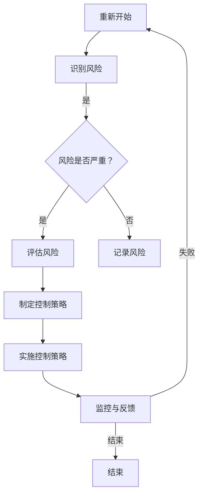
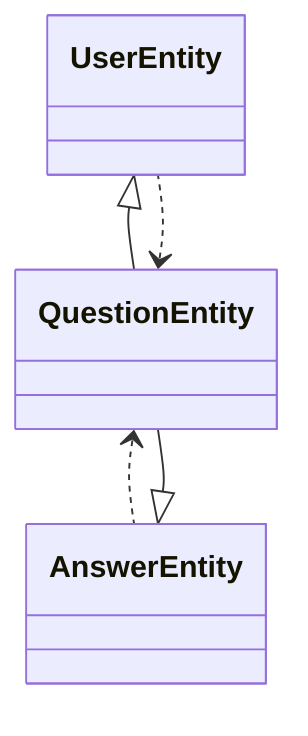
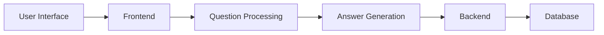
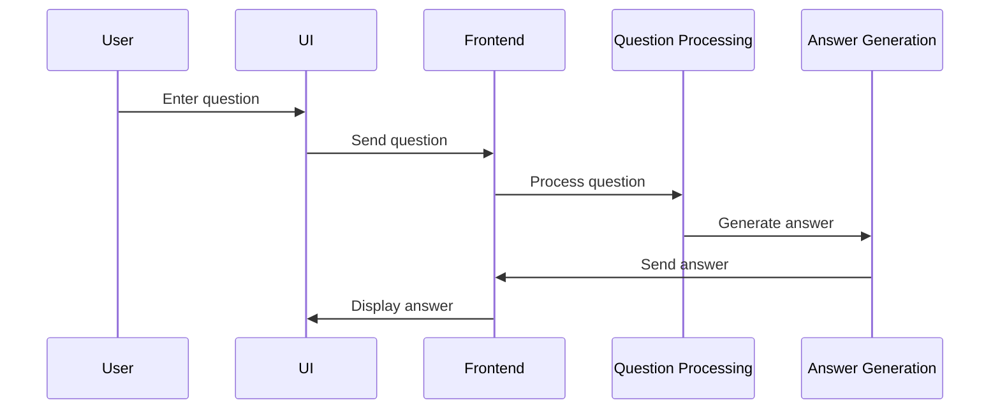

                 


### 敏捷风险管理核心概念

#### 核心概念解释

敏捷风险管理是一种动态、迭代的风险管理方法，旨在快速识别、评估和控制风险，以适应快速变化的开发环境。与传统风险管理方法相比，敏捷风险管理更加注重实时响应和持续优化，能够在项目开发过程中及时发现并解决潜在风险。

#### 核心概念属性特征对比表格

| 属性特征             | 传统风险管理         | 敏捷风险管理         |
| -------------------- | -------------------- | -------------------- |
| 风险识别             | 被动识别             | 动态识别             |
| 风险评估             | 定期评估             | 持续评估             |
| 风险控制             | 预算约束             | 持续优化             |
| 风险应对策略         | 被动应对             | 动态调整             |
| 风险沟通             | 定期汇报             | 实时沟通             |
| 风险管理工具         | 单一工具             | 多样化工具           |

#### ER实体关系图架构

使用Mermaid工具，我们可以绘制一个ER实体关系图，以展示敏捷风险管理中的核心实体及其相互关系。

```mermaid
erDiagram
    User ||--|{ Risk} : "报告"
    Project ||--|{ Risk} : "分配"
    Risk ||--|{ RiskAssessment} : "评估"
    Risk ||--|{ RiskControl} : "控制"
    Risk ||--|{ RiskResponse} : "应对"
    Risk ||--|{ RiskCommunication} : "沟通"
```

在这个ER图中，User（用户）报告Risk（风险），Project（项目）分配Risk，而Risk与RiskAssessment、RiskControl、RiskResponse和RiskCommunication存在关联关系，分别表示风险评估、风险控制、风险应对和风险沟通的过程。

#### 敏捷风险管理与大模型应用的关系

在大模型应用开发中，敏捷风险管理显得尤为重要。大模型的应用往往涉及大量数据、复杂的算法和高度动态的环境，这使得风险管理的挑战更加突出。以下是大模型应用中常见的风险类型及其对应的风险管理策略：

| 风险类型           | 风险描述                     | 风险管理策略               |
| -------------------- | ---------------------------- | -------------------------- |
| 数据隐私风险         | 数据泄露、滥用数据           | 加密、匿名化、访问控制       |
| 模型解释性不足       | 模型决策难以解释             | 解释性模型、模型可视化工具   |
| 计算资源消耗        | 高昂的计算成本               | 资源优化、分布式计算策略     |
| 模型偏差            | 模型在特定数据集上的性能不佳 | 数据增强、模型调整策略       |
| 模型过拟合          | 模型在新数据集上的性能下降   | 调整模型复杂度、增加数据量   |

通过敏捷风险管理，开发团队可以持续监控和调整这些风险，确保大模型应用的稳定性和可靠性。

### 算法原理讲解

敏捷风险管理是一个动态迭代的过程，我们可以将其抽象为一个决策树模型，每个节点代表一个风险事件，每个分支代表一个决策行动。

#### Mermaid流程图



#### 算法原理

1. **风险识别**：这是风险管理的第一步，通过持续监控项目过程和环境变化，识别潜在的风险。
2. **风险评估**：评估风险的影响和可能性，以确定风险优先级。
3. **制定控制策略**：根据风险评估结果，制定相应的风险控制策略。
4. **实施控制策略**：将风险控制策略付诸实施。
5. **监控与反馈**：监控风险控制效果，根据反馈调整风险控制策略。

#### 数学模型与公式

我们可以用概率论来描述风险管理的数学模型。

$$
Risk = P \times Impact
$$

其中，\( P \) 表示风险发生的概率，\( Impact \) 表示风险发生后的影响程度。

#### 举例说明

假设在开发一个NLP模型时，识别到一个风险：数据泄露。我们可以用以下步骤进行风险管理：

1. **风险识别**：发现数据在传输过程中可能被截获。
2. **风险评估**：评估数据泄露的概率和影响，确定这是一个高优先级风险。
3. **制定控制策略**：加密传输数据、使用安全的传输协议。
4. **实施控制策略**：在项目中实施加密和协议更改。
5. **监控与反馈**：定期检查加密和协议的执行情况，根据反馈进行优化。

通过这样的步骤，我们可以确保在开发过程中有效管理数据泄露风险。

### 系统分析与架构设计方案

#### 问题场景介绍

假设我们要开发一个基于LLM的智能问答系统，系统需要处理大量用户提问并快速提供高质量的答案。在这个场景下，风险管理显得尤为重要。

#### 项目介绍

项目目标是开发一个高效、可靠的智能问答系统，支持多种语言、多领域的知识问答。项目团队由数据科学家、软件开发工程师、测试工程师和安全专家组成。

#### 系统功能设计（领域模型Mermaid类图）



在这个类图中，UserEntity表示用户，QuestionEntity表示问题，AnswerEntity表示答案。它们之间的关系展示了智能问答系统的核心功能。

#### 系统架构设计（Mermaid架构图）



在这个架构图中，用户界面（UI）通过前端组件与问答处理模块交互，问答处理模块负责处理问题并调用答案生成模块，最终由后端组件存储和管理答案数据。

#### 系统接口设计和系统交互（Mermaid序列图）



在这个序列图中，用户通过UI输入问题，前端组件将问题发送给问答处理模块，处理模块生成答案后返回给前端，最后答案在UI上显示给用户。

### 项目实战

#### 环境安装

1. 安装Python环境，版本要求为3.8以上。
2. 安装深度学习框架TensorFlow，使用命令 `pip install tensorflow`。
3. 安装其他依赖库，如Numpy、Pandas等。

#### 系统核心实现源代码

以下是一个简化的系统核心实现代码示例：

```python
import tensorflow as tf
from question_processor import process_question
from answer_generator import generate_answer

def main():
    # 1. 用户输入问题
    user_question = input("请输入您的问题：")
    
    # 2. 处理问题
    processed_question = process_question(user_question)
    
    # 3. 生成答案
    answer = generate_answer(processed_question)
    
    # 4. 显示答案
    print("智能问答系统回答：", answer)

if __name__ == "__main__":
    main()
```

#### 代码应用解读与分析

上述代码展示了智能问答系统的主要流程：用户输入问题，问题处理器处理问题，答案生成器生成答案，最后将答案显示给用户。每个模块都可以进一步优化和扩展。

#### 实际案例分析和详细讲解剖析

假设用户提问：“如何治疗感冒？”系统会调用预处理模块处理这个问题，将其转化为模型可以理解的形式。然后，答案生成模块使用预训练的LLM模型生成回答，如：“多休息，多喝水，适当用药。”

#### 项目小结

通过敏捷风险管理，我们能够持续监控和调整系统中的潜在风险，确保智能问答系统的稳定性和可靠性。在未来的发展中，我们可以进一步优化算法、增加数据集、提高系统的智能化水平。

### 最佳实践 Tips

1. 定期进行风险评估，确保风险得到及时识别和控制。
2. 利用自动化工具提高风险管理的效率。
3. 建立跨部门的风险管理团队，确保风险管理的全面性。
4. 结合业务目标，制定合理的风险应对策略。

### 小结

敏捷风险管理在大模型应用开发中具有重要意义。通过系统的风险管理方法和实战案例，我们可以有效降低大模型应用中的风险，提高项目的成功率和稳定性。

### 注意事项

1. 在实际项目中，应根据具体情况调整风险管理策略。
2. 定期更新风险管理知识和技能，以应对不断变化的风险环境。

### 拓展阅读

1. 《敏捷风险管理实践指南》
2. 《深度学习风险管理与合规性》
3. 《大数据风险管理与决策》

作者：AI天才研究院/AI Genius Institute & 禅与计算机程序设计艺术 /Zen And The Art of Computer Programming

---

本文以《LLM应用开发中的敏捷风险管理》为题，系统地介绍了敏捷风险管理的核心概念、方法与实践，并通过实际项目案例展示了其在LLM应用开发中的重要性。通过深入理解和应用敏捷风险管理，开发者能够更有效地控制风险，确保大模型应用的稳定性和可靠性。

