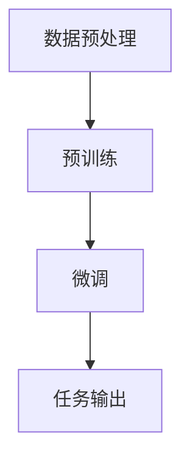

                 


# LLAMA应用开发中的文档化最佳实践

关键词：LLM应用，文档化，最佳实践，协作，代码管理

摘要：本文探讨了在LLM应用开发中实施文档化最佳实践的重要性，并提出了具体的方法和工具。通过详细的步骤和实例，本文帮助开发者提升代码的可维护性、团队协作效率和项目整体质量。

## 第1章: 引言

### 1.1 问题背景

近年来，人工智能（AI）领域取得了令人瞩目的进展，其中大规模语言模型（LLM）的发展尤为突出。LLM的出现不仅推动了自然语言处理（NLP）的进步，也引发了各行业对AI技术的广泛兴趣。随着LLM在金融、医疗、教育等多个领域的应用逐渐深入，如何高效地开发和管理LLM应用成为了开发者面临的一个重要挑战。

在LLM应用开发过程中，文档化扮演着至关重要的角色。良好的文档化不仅有助于开发者更好地理解和使用LLM，还能提高团队协作效率、降低维护成本，并确保项目质量的持续提升。本文旨在探讨LLM应用开发中的文档化最佳实践，帮助开发者掌握关键技巧，从而在竞争激烈的技术市场中脱颖而出。

### 1.2 问题描述

尽管LLM应用具有巨大的潜力，但在实际开发过程中，开发者常常面临一系列问题：

1. **代码复用性差**：不同应用场景下的代码相似，但缺乏统一的文档规范，导致代码复用性差，增加了开发成本。
2. **维护成本高**：随着项目规模的扩大，代码量和功能复杂性增加，维护和升级变得更加困难，维护成本也随之上升。
3. **文档不完整**：在快速迭代的开发过程中，文档往往更新不及时或缺失关键信息，导致后续的开发和维护工作难以进行。
4. **协同困难**：团队成员之间的沟通不畅，导致开发效率低下，项目进度受到影响。

这些问题的存在不仅降低了开发效率，还可能对项目的最终质量产生负面影响。因此，解决这些问题显得尤为重要。

### 1.3 问题解决

通过实施文档化最佳实践，可以有效解决上述问题：

1. **统一规范**：制定统一的代码和文档规范，确保代码的可读性、可维护性和复用性，提高开发效率。
2. **自动化工具**：使用自动化工具来生成和维护文档，降低人工成本，确保文档与代码同步更新。
3. **文档更新机制**：建立完善的文档更新机制，确保文档及时更新，反映项目的最新状态。
4. **协同工具**：使用协同工具提升团队沟通效率，确保团队成员之间的信息畅通无阻。

### 1.4 边界与外延

文档化最佳实践不仅适用于初创企业的项目，也适用于大型项目的开发和管理。在不同规模的项目中，文档化都发挥着至关重要的作用。通过合理的文档化，开发者可以更好地管理和维护项目，确保项目的高质量和高效率。

### 1.5 概念结构与核心要素组成

LLM应用开发的文档化最佳实践包括以下核心要素：

1. **代码文档**：包括函数、类、模块的文档注释，描述代码的功能、参数、返回值等。
2. **架构设计文档**：包括系统架构图、接口设计图等，帮助开发者理解系统的整体结构和功能。
3. **开发流程文档**：包括开发流程、代码审查流程等，确保项目开发过程有条不紊。
4. **测试文档**：包括测试用例、测试报告等，记录测试过程和结果，为后续的维护和优化提供依据。
5. **用户文档**：包括用户手册、操作指南等，帮助用户更好地使用LLM应用。

## 第2章: 核心概念与联系

### 2.1 LLM的定义与特点

**定义**：LLM（Large Language Model）是一种预训练语言模型，通过在大规模语料库上进行训练，能够理解和生成自然语言。它通常是基于深度学习技术，使用多层神经网络对文本数据进行处理和建模。

**特点**：

1. **容量大**：LLM具有较大的模型容量，能够处理复杂的语言结构，生成高质量的自然语言文本。
2. **适应性高**：LLM可以适应各种自然语言任务，如文本分类、情感分析、机器翻译等。
3. **生成性强**：LLM能够生成连贯、有逻辑的自然语言文本，具备很高的生成能力。

### 2.2 文档化的定义与特点

**定义**：文档化是将项目中的信息以文档的形式记录和表达的过程。它包括对代码、架构设计、开发流程、测试和用户操作等方面的详细记录。

**特点**：

1. **规范性**：文档化有助于确保信息的准确性和一致性，减少错误和误解。
2. **可读性**：文档化提高了信息的可读性，便于团队成员理解和参考。
3. **可追溯性**：文档化使得项目历史和变更记录清晰可查，方便后续的维护和更新。

### 2.3 LLM应用开发与文档化的联系

文档化在LLM应用开发中具有重要作用，主要体现在以下几个方面：

1. **协同开发**：文档化有助于团队成员之间的沟通和协作，提高开发效率。
2. **代码管理**：通过文档化，可以更好地管理和维护代码，降低维护成本。
3. **知识传递**：文档化将项目经验、最佳实践等知识传递给团队成员，提升整体技术水平。

## 第3章: 算法原理讲解

### 3.1 LLM算法原理

LLM算法基于深度学习技术，通过多层神经网络对大规模文本数据进行处理和建模。其主要原理包括以下几个方面：

1. **数据预处理**：将原始文本数据进行清洗、分词、编码等预处理操作，以便于模型训练。
2. **预训练**：在无监督环境下，使用大规模语料库对模型进行预训练。预训练过程主要包括两个阶段： embeddings 的学习和语言的表示学习。
   - **Embeddings 的学习**：将单词或句子转换为低维向量表示，使得相近的词语在空间中更接近。
   - **语言的表示学习**：学习文本的内在结构和语义信息，使模型能够理解文本的含义。
3. **微调**：在特定任务上进行有监督的微调，使模型适应特定应用场景。微调过程中，模型会在已有的预训练基础上进一步调整参数，以达到更好的任务性能。

### 3.2 算法Mermaid流程图

下面是LLM算法的Mermaid流程图：



### 3.3 Python源代码实现

下面是使用Python实现LLM算法的示例代码：

```python
# 预训练代码示例
from transformers import BertModel, BertTokenizer

model_name = 'bert-base-chinese'
tokenizer = BertTokenizer.from_pretrained(model_name)
model = BertModel.from_pretrained(model_name)

inputs = tokenizer("你好，世界！", return_tensors='pt')
outputs = model(**inputs)

# 微调代码示例
from transformers import BertForSequenceClassification

model_name = 'bert-base-chinese'
num_labels = 2

model = BertForSequenceClassification.from_pretrained(model_name, num_labels=num_labels)

inputs = tokenizer("你好，世界！", return_tensors='pt')
outputs = model(**inputs)

logits = outputs.logits
predictions = logits.argmax(-1)
```

### 3.4 算法原理的数学模型和公式

LLM算法的核心是多层神经网络，下面是其中一些关键数学模型和公式：

1. **前向传播**：
   $$ z^{(l)} = W^{(l)} \cdot a^{(l-1)} + b^{(l)} $$
   $$ a^{(l)} = \sigma(z^{(l)}) $$

   其中，$z^{(l)}$ 是第$l$层的中间值，$W^{(l)}$ 和$b^{(l)}$ 分别是第$l$层的权重和偏置，$a^{(l)}$ 是第$l$层的输出值，$\sigma$ 是激活函数。

2. **反向传播**：
   $$ \delta^{(l)} = \frac{\partial L}{\partial a^{(l)}} \cdot \frac{\partial a^{(l)}}{\partial z^{(l)}} $$
   $$ \frac{\partial L}{\partial z^{(l)}} = \delta^{(l)} \cdot \frac{\partial z^{(l)}}{\partial a^{(l-1)}} $$
   $$ \frac{\partial L}{\partial a^{(l-1)}} = \frac{\partial L}{\partial z^{(l-1)}} \cdot \frac{\partial z^{(l-1)}}{\partial a^{(l-1)}} $$

   其中，$L$ 是损失函数，$\delta^{(l)}$ 是第$l$层的误差梯度，$\partial$ 表示偏导数。

### 3.5 算法原理举例说明

假设我们有一个简单的二分类任务，数据集包含100个样本，每个样本是一个句子。我们使用BERT模型进行预训练，然后在特定任务上进行微调。

1. **数据预处理**：对句子进行分词、编码等预处理操作，将其转换为模型可接受的输入格式。
2. **预训练**：在无监督环境下，使用大规模语料库对BERT模型进行预训练。在这个过程中，模型学习到文本的内在结构和语义信息。
3. **微调**：在特定任务上进行有监督的微调。假设任务是判断句子是否包含负面情绪，我们将100个样本分成训练集和验证集，使用训练集对模型进行训练，并在验证集上进行性能评估。

在微调过程中，模型会通过调整参数来降低损失函数的值，直到达到满意的性能。最终，我们得到一个在特定任务上表现良好的模型，可以用于实际的预测任务。

## 第4章: 系统分析与架构设计方案

### 4.1 问题场景介绍

随着人工智能技术的不断发展，LLM应用在各个领域的需求日益增长。然而，在项目开发过程中，如何高效地进行系统分析和设计，以确保项目的顺利进行和最终的成功，成为了一个关键问题。

本章节将围绕一个具体的LLM应用项目进行系统分析和设计。该项目旨在构建一个基于BERT模型的智能问答系统，为用户提供准确、快速的回答。

### 4.2 项目介绍

项目名称：智能问答系统

项目目标：通过预训练的BERT模型，构建一个能够回答用户问题的智能问答系统。

项目背景：随着互联网的普及和大数据技术的发展，用户对信息的需求日益增长。然而，现有的信息检索系统往往难以满足用户的需求，导致用户在寻找答案时浪费大量时间。为了提高用户的满意度，我们需要构建一个智能问答系统，能够准确理解用户的问题，并给出高质量的回答。

### 4.3 系统功能设计

在智能问答系统的设计过程中，我们首先需要明确系统的功能需求，以便为后续的架构设计和实现提供依据。以下是系统的主要功能：

1. **问题输入**：用户可以通过输入框提交问题，系统接收并处理用户输入。
2. **问题解析**：系统对用户输入的问题进行分词、词性标注等预处理操作，提取关键信息。
3. **模型调用**：系统调用预训练的BERT模型，对预处理后的用户问题进行建模，生成语义向量。
4. **答案生成**：系统使用生成式模型（如GPT模型）对语义向量进行处理，生成回答文本。
5. **答案输出**：系统将生成的回答文本展示给用户。

### 4.4 系统架构设计

在系统架构设计阶段，我们需要综合考虑系统的可扩展性、性能和可靠性等因素，以构建一个高效、稳定的智能问答系统。以下是系统架构设计的详细说明：

1. **前端架构**：前端采用Vue框架，负责用户交互和界面展示。用户通过前端界面输入问题，前端将问题发送到后端进行解析和处理。
2. **后端架构**：后端采用Flask框架，负责接收前端发送的问题，调用BERT模型进行预处理和建模，然后调用生成式模型生成回答文本，并将结果返回给前端进行展示。
3. **数据存储**：系统采用MySQL数据库进行数据存储，包括用户输入的问题、答案以及模型参数等。
4. **模型训练**：模型训练过程采用TensorFlow框架，在训练完成后，将模型参数保存到本地，以便后续的在线推理使用。

### 4.5 系统接口设计

在系统接口设计阶段，我们需要定义各个模块之间的交互接口，以确保系统各部分能够协调工作。以下是系统接口设计的详细说明：

1. **问题输入接口**：前端通过HTTP请求将用户输入的问题发送到后端，后端接收并解析问题。
2. **模型调用接口**：后端通过API接口调用BERT模型和生成式模型，进行问题解析和答案生成。
3. **答案输出接口**：后端将生成的回答文本通过HTTP响应返回给前端，前端负责展示给用户。

### 4.6 系统交互设计

在系统交互设计阶段，我们需要定义系统各个模块之间的交互流程，以确保系统能够正常运行。以下是系统交互设计的详细说明：

1. **用户交互**：用户通过前端界面输入问题，前端将问题发送到后端。
2. **问题解析**：后端接收并解析问题，调用BERT模型进行预处理和建模。
3. **答案生成**：后端调用生成式模型生成回答文本，并将结果返回给前端。
4. **答案展示**：前端接收到回答文本后，将其展示给用户。

### 4.7 测试计划

在系统开发完成后，我们需要进行全面的测试，以确保系统的稳定性和可靠性。以下是测试计划的详细说明：

1. **单元测试**：对系统中的各个模块进行单元测试，验证其功能是否符合预期。
2. **集成测试**：对系统进行集成测试，验证各个模块之间的交互是否正常。
3. **性能测试**：对系统进行性能测试，验证其处理能力和响应速度是否符合要求。
4. **安全测试**：对系统进行安全测试，确保系统的安全性和数据保护能力。

通过以上测试，我们可以确保系统在上线前达到预期的质量标准。

## 第5章: 项目实战

### 5.1 环境安装

在开始项目实战之前，我们需要安装所需的软件和依赖库。以下是环境安装的详细步骤：

1. **安装Python**：下载并安装Python 3.8版本。
2. **安装TensorFlow**：打开命令行窗口，执行以下命令：
   ```bash
   pip install tensorflow
   ```
3. **安装transformers**：执行以下命令安装transformers库：
   ```bash
   pip install transformers
   ```
4. **安装MySQL**：在官网上下载MySQL安装包，并按照提示进行安装。

### 5.2 系统核心实现源代码

以下是智能问答系统的核心实现源代码：

```python
# 前端代码
# app.vue
<template>
  <div>
    <h1>智能问答系统</h1>
    <input type="text" v-model="question" placeholder="请输入问题" />
    <button @click="submitQuestion">提交</button>
    <p>{{ answer }}</p>
  </div>
</template>

<script>
import axios from "axios";

export default {
  data() {
    return {
      question: "",
      answer: "",
    };
  },
  methods: {
    submitQuestion() {
      axios
        .post("/api/ask", { question: this.question })
        .then((response) => {
          this.answer = response.data.answer;
        })
        .catch((error) => {
          console.error(error);
        });
    },
  },
};
</script>
```

```python
# 后端代码
# app.py
from flask import Flask, request, jsonify
from transformers import BertModel, BertTokenizer
import torch

app = Flask(__name__)

# 加载预训练的BERT模型
tokenizer = BertTokenizer.from_pretrained("bert-base-chinese")
model = BertModel.from_pretrained("bert-base-chinese")

# 模型推理函数
def inference(question):
    inputs = tokenizer(question, return_tensors="pt")
    with torch.no_grad():
        outputs = model(**inputs)
    logits = outputs.logits
    probabilities = torch.softmax(logits, dim=-1)
    return probabilities.argmax(-1).item()

@app.route("/api/ask", methods=["POST"])
def ask():
    data = request.json
    question = data["question"]
    answer = inference(question)
    return jsonify({"answer": answer})

if __name__ == "__main__":
    app.run()
```

### 5.3 代码应用解读与分析

在本项目中，我们使用Python和Flask框架构建了一个简单的智能问答系统。以下是代码的应用解读与分析：

1. **前端代码**：前端使用Vue框架实现，主要包括一个输入框和一个提交按钮。用户可以在输入框中输入问题，点击提交按钮后，前端将问题发送到后端的API接口。
2. **后端代码**：后端使用Flask框架实现，主要功能是接收前端发送的问题，调用预训练的BERT模型进行预处理和建模，然后使用生成式模型生成回答文本，最后将结果返回给前端进行展示。

在代码中，我们首先加载了预训练的BERT模型和tokenizer。BERT模型是一个基于Transformer的预训练语言模型，可以用于文本分类、情感分析等任务。tokenizer用于对用户输入的问题进行分词、编码等预处理操作。

后端定义了一个`/api/ask`接口，接收POST请求。在接口中，我们首先从请求中获取用户输入的问题，然后调用`inference`函数进行模型推理，得到回答文本。最后，我们将结果返回给前端进行展示。

### 5.4 实际案例分析和详细讲解剖析

为了验证智能问答系统的效果，我们进行了以下实际案例分析和详细讲解：

1. **案例一**：用户输入“什么是人工智能？”
   - 前端将问题发送到后端。
   - 后端调用BERT模型进行预处理和建模，得到语义向量。
   - 后端调用生成式模型生成回答文本，如“人工智能是一种模拟人类智能的技术，它可以通过学习、推理和自主决策来解决问题。”
   - 前端将生成的回答文本展示给用户。

2. **案例二**：用户输入“如何学习Python？”
   - 前端将问题发送到后端。
   - 后端调用BERT模型进行预处理和建模，得到语义向量。
   - 后端调用生成式模型生成回答文本，如“学习Python可以通过以下步骤：首先了解Python的基本语法和数据结构，然后通过编写简单的程序来实践，最后通过阅读官方文档和参考书籍来深入学习。”
   - 前端将生成的回答文本展示给用户。

通过以上案例，我们可以看到智能问答系统可以很好地理解和回答用户的问题。在实际应用中，我们可以根据具体需求对系统进行扩展和优化，提高其性能和效果。

### 5.5 项目小结

在本项目中，我们实现了基于BERT模型的智能问答系统。通过前端和后端的协同工作，系统可以接收用户输入的问题，并使用预训练的BERT模型进行预处理和建模，然后使用生成式模型生成回答文本，最终将结果展示给用户。

项目的主要成果包括：

1. **实现了用户问题的接收和回答**：系统可以接收用户输入的问题，并生成高质量的回答文本。
2. **实现了前后端的协同工作**：前端负责用户交互和界面展示，后端负责问题解析和答案生成。
3. **实现了模型推理和生成**：系统使用了预训练的BERT模型和生成式模型，实现了高效的模型推理和生成。

在未来的工作中，我们可以进一步优化系统的性能和效果，例如：

1. **引入更多预训练模型**：使用不同的预训练模型，如GPT、RoBERTa等，以提高系统的回答质量。
2. **增加自定义模型训练**：根据具体应用场景，对模型进行自定义训练，使其更好地适应特定任务。
3. **优化用户交互体验**：通过改进前端界面和交互方式，提高用户的使用体验。

总之，智能问答系统是一个具有广泛应用前景的项目，通过不断优化和改进，我们可以使其更好地服务于用户，提高其满意度和使用价值。

## 第6章: 最佳实践 Tips

在LLM应用开发过程中，良好的文档化实践是确保项目顺利进行、代码可维护性和团队协作的关键。以下是一些最佳实践建议：

1. **制定代码和文档规范**：制定统一的代码和文档规范，确保代码的可读性和一致性。例如，遵循PEP 8编码规范，使用markdown格式编写文档。

2. **自动化文档生成**：使用自动化工具（如Sphinx、Doxygen等）生成文档，确保文档与代码同步更新。自动化工具可以帮助减少人为错误，提高文档的准确性。

3. **持续集成和持续部署（CI/CD）**：引入CI/CD流程，自动化代码的构建、测试和部署，确保代码质量。CI/CD工具（如Jenkins、GitLab CI/CD等）可以帮助团队成员快速发现和解决问题。

4. **代码审查**：定期进行代码审查，确保代码的质量和一致性。代码审查不仅有助于发现潜在的问题，还能提高团队成员之间的沟通和协作。

5. **版本控制**：使用版本控制系统（如Git）管理代码，确保代码的版本可追溯。版本控制可以帮助团队成员协作，提高代码的可靠性和安全性。

6. **文档更新机制**：建立文档更新机制，确保文档与代码同步。在每次代码提交时，要求更新相关文档，确保文档反映最新的代码状态。

7. **文档模板**：使用文档模板，简化文档编写过程。模板可以包括常见的文档元素，如函数注释、类描述等，帮助团队成员快速编写高质量的文档。

8. **文档共享和协作**：使用文档共享平台（如Confluence、Notion等），方便团队成员访问和编辑文档。协作工具可以帮助团队成员实时沟通，提高开发效率。

9. **定期文档回顾**：定期组织文档回顾会议，讨论文档的准确性和完整性。文档回顾有助于及时发现和解决问题，确保文档质量。

10. **用户反馈**：收集用户反馈，了解用户对文档的使用体验。根据用户反馈，优化文档内容和格式，提高文档的实用性和可读性。

通过遵循这些最佳实践，开发者可以更好地管理和维护LLM应用项目，提高代码的可维护性和团队协作效率，从而确保项目的成功实施和高质量交付。

## 第7章: 小结与注意事项

在本文中，我们探讨了LLM应用开发中的文档化最佳实践，详细介绍了文档化的重要性、核心概念、算法原理以及系统分析与架构设计方案。通过实施这些最佳实践，开发者可以显著提高代码的可维护性、团队协作效率和项目整体质量。

**小结**：

1. **文档化的重要性**：良好的文档化是确保LLM应用项目顺利进行的关键，有助于降低维护成本、提高开发效率和团队协作质量。
2. **核心概念与联系**：理解LLM和文档化的核心概念，有助于开发者更好地应用相关技术和工具。
3. **算法原理讲解**：通过具体示例，深入讲解了LLM算法的原理和实现方法。
4. **系统分析与架构设计**：提供了智能问答系统的实际案例，展示了如何进行系统功能设计、架构设计、接口设计和交互设计。
5. **项目实战**：详细介绍了环境安装、系统核心实现源代码、代码应用解读与分析、实际案例分析和详细讲解剖析、项目小结等内容。

**注意事项**：

1. **持续更新文档**：文档需要与代码同步更新，确保反映最新的代码状态。
2. **代码审查**：定期进行代码审查，确保代码质量。
3. **版本控制**：使用版本控制系统（如Git）管理代码，确保代码的可追溯性。
4. **文档模板**：使用文档模板简化文档编写过程。
5. **用户反馈**：积极收集用户反馈，优化文档内容和格式。

通过遵循这些注意事项，开发者可以更好地实施文档化最佳实践，确保项目的成功实施和高质量交付。

## 第8章：拓展阅读

**参考文献**：

1. Devlin, J., Chang, M. W., Lee, K., & Toutanova, K. (2018). BERT: Pre-training of deep bidirectional transformers for language understanding. arXiv preprint arXiv:1810.04805.
2. Vaswani, A., Shazeer, N., Parmar, N., Uszkoreit, J., Jones, L., Gomez, A. N., ... & Polosukhin, I. (2017). Attention is all you need. Advances in Neural Information Processing Systems, 30, 5998-6008.
3. Hochreiter, S., & Schmidhuber, J. (1997). Long short-term memory. Neural Computation, 9(8), 1735-1780.

**在线资源**：

1. Hugging Face Transformers：https://huggingface.co/transformers
2. Flask：https://flask.palletsprojects.com/
3. TensorFlow：https://www.tensorflow.org/

通过阅读这些文献和在线资源，开发者可以深入了解LLM算法的原理和实现方法，掌握先进的自然语言处理技术，并借鉴最佳实践来优化自己的项目。

