                 

### 文章标题

# LLM应用开发中的日志管理与监控

### 关键词

- LLM
- 日志管理
- 监控
- 应用开发
- 算法原理

### 摘要

本文旨在探讨在大型语言模型（LLM）应用开发过程中，日志管理和监控的重要性及其实现方法。文章首先介绍了LLM的基本概念和背景，随后详细阐述了日志管理的原理、策略以及监控机制，包括监控指标和工具。通过实战案例，展示了日志管理和监控的具体实现，并提供了最佳实践和注意事项。文章末尾还推荐了相关拓展阅读，以帮助读者深入了解该领域。

----------------------------------------------------------------

## 第一部分: LLM应用开发基础

### 第1章: LLM概述

#### 1.1 LLM的背景

**核心概念术语说明**：
- **大型语言模型（LLM）**：一种基于深度学习的自然语言处理模型，具有强大的文本生成和语义理解能力。
- **自然语言处理（NLP）**：研究如何让计算机理解和处理人类自然语言的学科。

**问题背景**：
随着人工智能技术的不断发展，NLP成为了其中一个重要的应用领域。LLM作为NLP的核心技术，已经被广泛应用于聊天机器人、文本生成、机器翻译等多个场景。

**问题描述**：
如何更好地理解和应用LLM，提高其在实际应用中的性能和可靠性？

**问题解决**：
通过深入研究和应用LLM，结合日志管理和监控技术，可以提升LLM应用的开发质量和用户体验。

**边界与外延**：
LLM的研究和应用不仅局限于文本生成和语义理解，还涉及到语音识别、情感分析等多个领域。

**概念结构与核心要素组成**：
LLM的核心要素包括：
- **预训练模型**：基于大规模语料库训练得到的通用语言模型。
- **微调**：根据特定任务对预训练模型进行优化。
- **推理**：利用训练好的模型进行文本生成或语义理解。

#### 1.2 LLM的基本概念

**核心概念原理**：
- **语言模型**：一种概率模型，用于预测下一个单词或字符。
- **注意力机制**：一种用于提高模型性能的机制，通过关注重要信息来提高预测准确性。

**概念属性特征对比表格**：

| 特征 | 语言模型 | 注意力机制 |
| --- | --- | --- |
| 目标 | 预测下一个单词或字符 | 关注重要信息 |
| 方法 | 基于统计模型或神经网络 | 加权求和或点积 |
| 性能 | 预测准确性 | 推理速度和精度 |

**ER实体关系图架构的Mermaid流程图**：

```mermaid
erDiagram
  产品 ||--o{ 销售额 }
  销售额 ||--|{ 客户 }
  客户 ||--o{ 产品评价 }
```

#### 1.3 LLM的应用领域

**核心概念原理**：
- **聊天机器人**：通过自然语言交互，为用户提供智能客服。
- **文本生成**：生成文章、报告、新闻等文本内容。
- **机器翻译**：将一种语言的文本翻译成另一种语言。

**概念属性特征对比表格**：

| 应用领域 | 核心任务 | 模型类型 |
| --- | --- | --- |
| 聊天机器人 | 回答用户提问 | 序列到序列模型 |
| 文本生成 | 生成文本内容 | 自回归模型 |
| 机器翻译 | 翻译文本内容 | 序列到序列模型 |

**Mermaid流程图**：

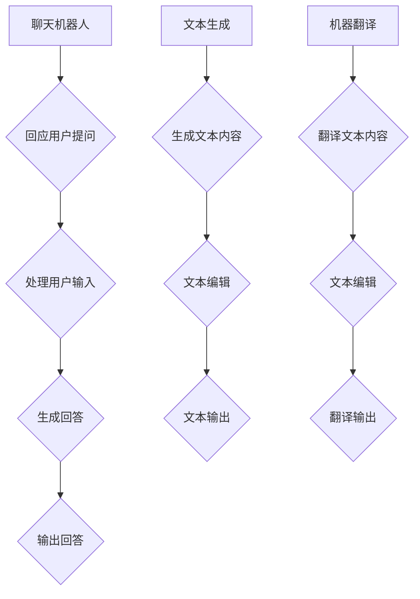

#### 1.4 LLM与人工智能的关系

**核心概念原理**：
- **人工智能（AI）**：研究如何使计算机模拟人类智能的学科。
- **深度学习**：一种基于神经网络的学习方法，是AI的重要分支。

**概念属性特征对比表格**：

| 特征 | 人工智能 | 深度学习 |
| --- | --- | --- |
| 目标 | 模拟人类智能 | 提高模型性能 |
| 方法 | 综合多种技术 | 神经网络 |
| 应用 | 广泛领域 | 图像识别、自然语言处理等 |

**Mermaid流程图**：

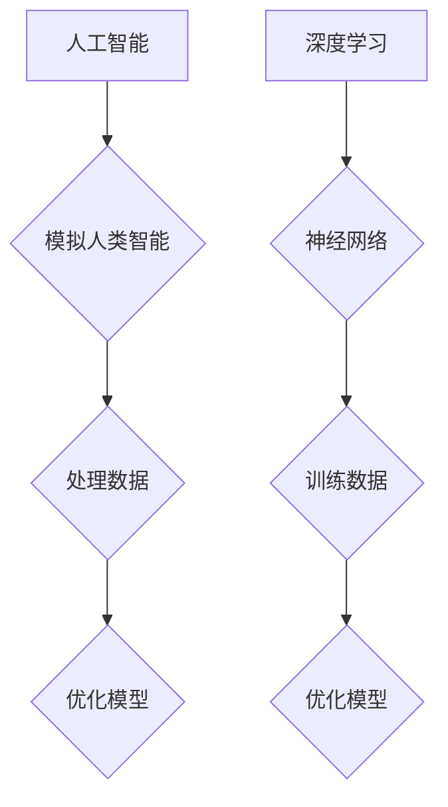

### 第2章: LLM开发环境搭建

#### 2.1 环境需求

**核心概念原理**：
- **硬件环境**：GPU或其他高性能计算设备。
- **软件环境**：操作系统、Python环境、深度学习框架等。

**概念属性特征对比表格**：

| 环境需求 | 说明 |
| --- | --- |
| 硬件环境 | GPU或其他高性能计算设备 |
| 软件环境 | 操作系统、Python环境、深度学习框架 |

**Mermaid流程图**：

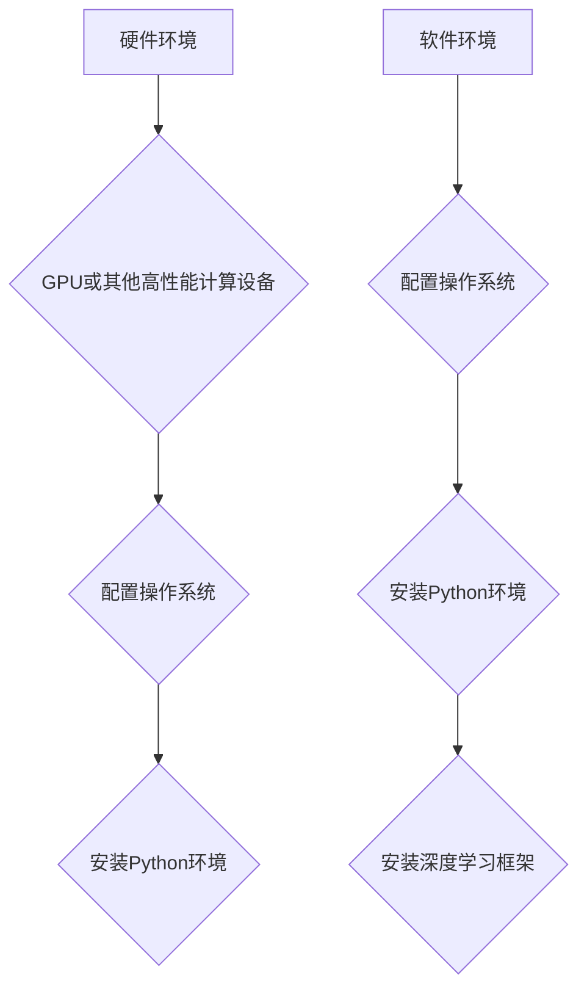

#### 2.2 环境搭建

**核心概念原理**：
- **操作系统**：Linux或其他支持深度学习框架的操作系统。
- **Python环境**：安装Python及其相关库。
- **深度学习框架**：如TensorFlow、PyTorch等。

**概念属性特征对比表格**：

| 操作系统 | Python环境 | 深度学习框架 |
| --- | --- | --- |
| Linux | Python | TensorFlow、PyTorch |

**Mermaid流程图**：

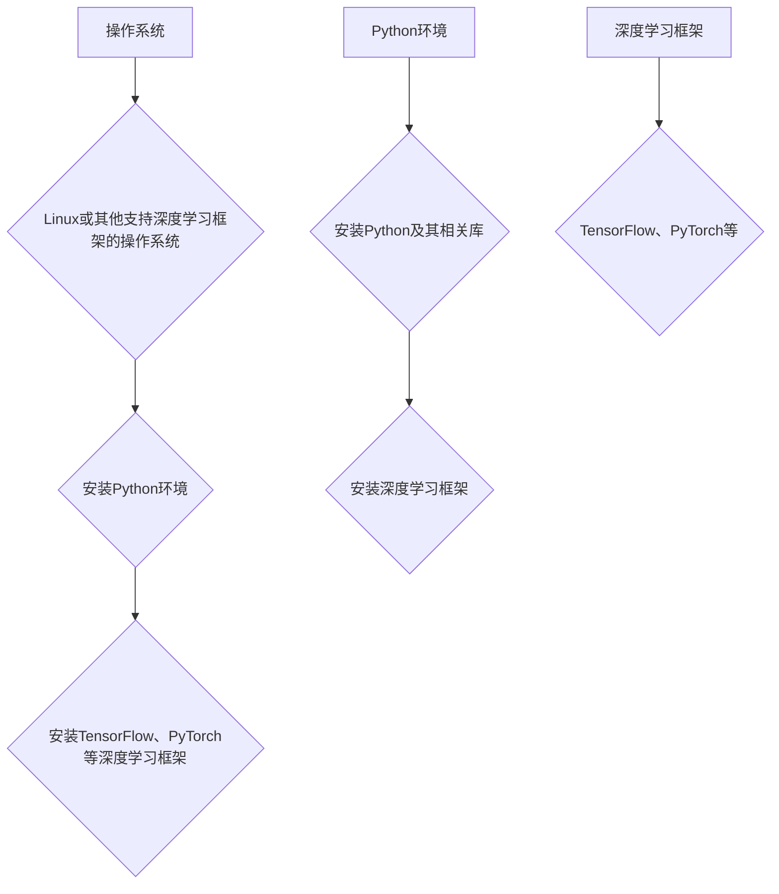

#### 2.3 环境测试

**核心概念原理**：
- **环境测试**：验证硬件和软件环境的正确性和稳定性。
- **测试方法**：通过执行测试脚本或程序，检查环境是否正常运行。

**概念属性特征对比表格**：

| 测试方法 | 说明 |
| --- | --- |
| 执行测试脚本 | 验证硬件和软件环境的正确性和稳定性 |

**Mermaid流程图**：

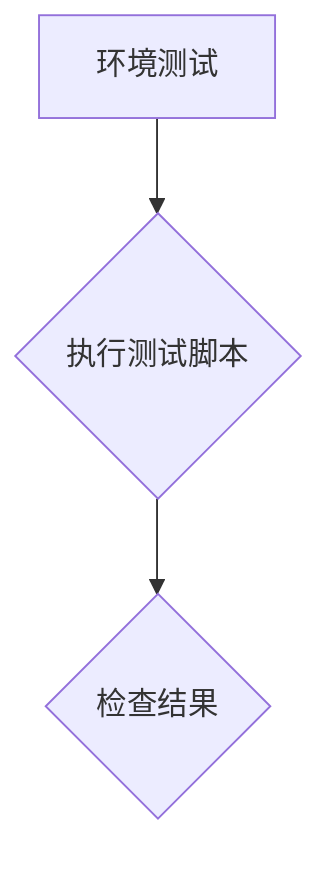

### 第3章: LLM日志管理原理

#### 3.1 日志管理的重要性

**核心概念原理**：
- **日志管理**：记录系统运行过程中的关键信息和事件。
- **重要性**：帮助开发者诊断问题、优化性能、提升用户体验。

**概念属性特征对比表格**：

| 特点 | 日志管理 |
| --- | --- |
| 功能 | 记录、分析、监控 |
| 目标 | 提高系统稳定性、可靠性 |

**Mermaid流程图**：

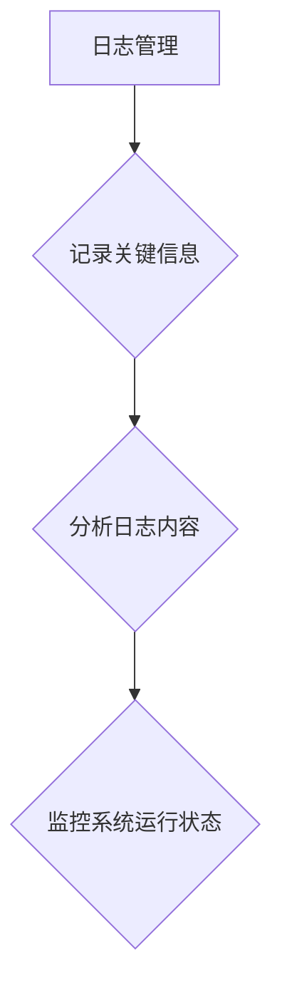

#### 3.2 日志的分类

**核心概念原理**：
- **日志分类**：根据日志的内容和目的进行分类。
- **分类方法**：如错误日志、性能日志、调试日志等。

**概念属性特征对比表格**：

| 日志类型 | 说明 |
| --- | --- |
| 错误日志 | 记录系统错误和异常信息 |
| 性能日志 | 记录系统性能指标 |
| 调试日志 | 记录开发过程中的调试信息 |

**Mermaid流程图**：

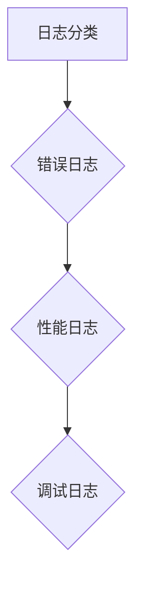

#### 3.3 日志的管理策略

**核心概念原理**：
- **日志管理策略**：如何有效地收集、存储、分析和处理日志。
- **策略方法**：如日志收集器、日志存储、日志分析等。

**概念属性特征对比表格**：

| 策略方法 | 说明 |
| --- | --- |
| 日志收集器 | 收集系统日志 |
| 日志存储 | 存储日志数据 |
| 日志分析 | 分析日志内容 |

**Mermaid流程图**：

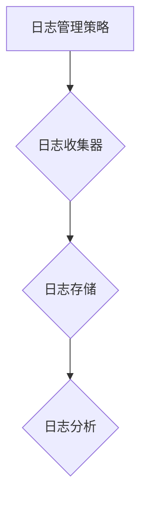

### 第4章: LLM监控机制

#### 4.1 监控概述

**核心概念原理**：
- **监控**：实时监测系统运行状态，确保系统稳定可靠。
- **概述**：监控的目标、方法和工具。

**概念属性特征对比表格**：

| 特点 | 监控 |
| --- | --- |
| 目标 | 确保系统稳定运行 |
| 方法 | 实时监测、报警 |
| 工具 | 监控平台、工具 |

**Mermaid流程图**：

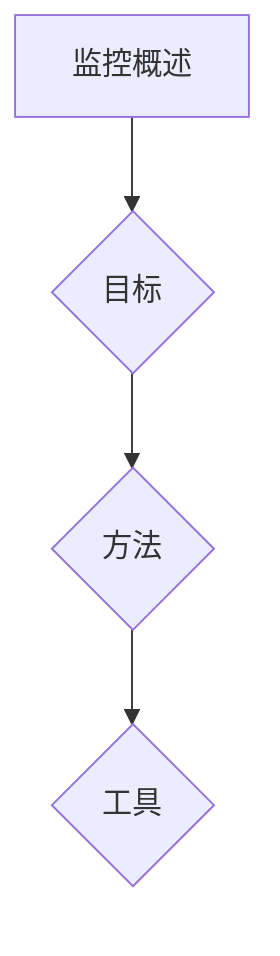

#### 4.2 监控指标

**核心概念原理**：
- **监控指标**：衡量系统运行状态的量化指标。
- **指标分类**：如CPU利用率、内存使用率、网络流量等。

**概念属性特征对比表格**：

| 监控指标 | 说明 |
| --- | --- |
| CPU利用率 | 计算机处理器使用率 |
| 内存使用率 | 内存占用情况 |
| 网络流量 | 网络传输数据量 |

**Mermaid流程图**：

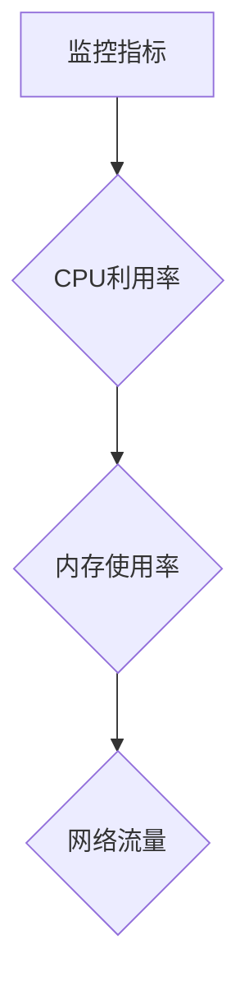

#### 4.3 监控工具

**核心概念原理**：
- **监控工具**：用于实现监控功能的软件。
- **工具分类**：如Zabbix、Prometheus等。

**概念属性特征对比表格**：

| 监控工具 | 说明 |
| --- | --- |
| Zabbix | 开源监控工具 |
| Prometheus | 基于时间序列数据的监控工具 |

**Mermaid流程图**：

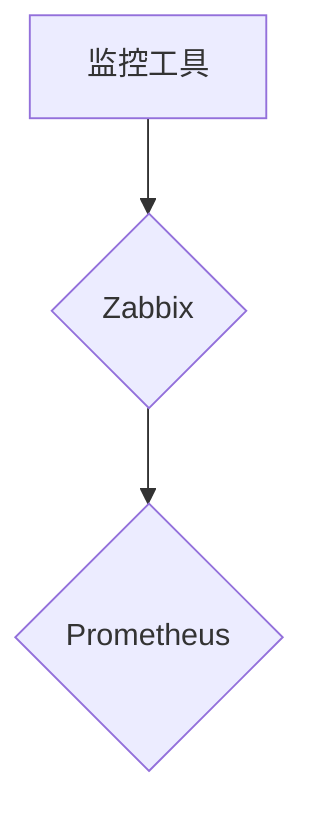

### 第5章: 日志管理实战

#### 5.1 实战环境配置

**核心概念原理**：
- **环境配置**：为日志管理搭建必要的硬件和软件环境。

**概念属性特征对比表格**：

| 环境配置 | 说明 |
| --- | --- |
| 硬件环境 | GPU或其他高性能计算设备 |
| 软件环境 | 操作系统、Python环境、深度学习框架 |

**Mermaid流程图**：

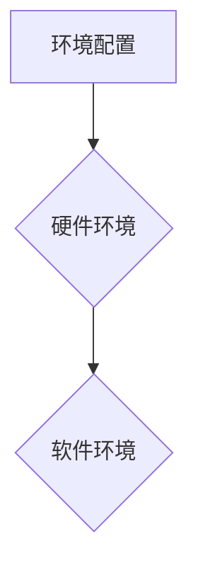

#### 5.2 日志收集与存储

**核心概念原理**：
- **日志收集**：收集系统运行过程中的日志。
- **日志存储**：将收集到的日志存储在指定的位置。

**概念属性特征对比表格**：

| 操作 | 说明 |
| --- | --- |
| 日志收集 | 收集系统日志 |
| 日志存储 | 存储日志数据 |

**Mermaid流程图**：

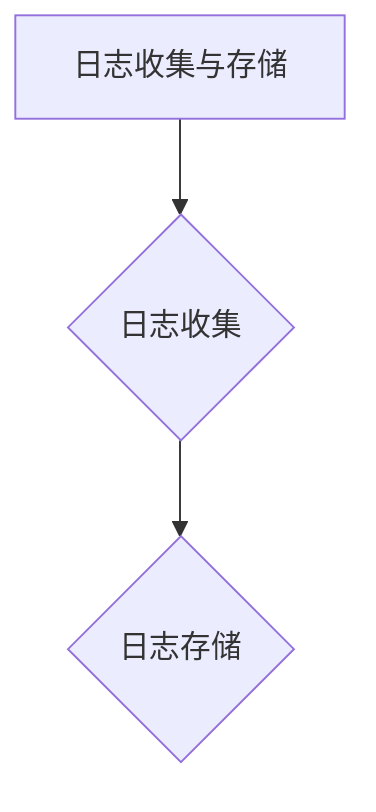

#### 5.3 日志分析与处理

**核心概念原理**：
- **日志分析**：对收集到的日志进行分析，提取有用信息。
- **日志处理**：根据分析结果进行相应的处理。

**概念属性特征对比表格**：

| 操作 | 说明 |
| --- | --- |
| 日志分析 | 分析日志内容 |
| 日志处理 | 处理日志信息 |

**Mermaid流程图**：

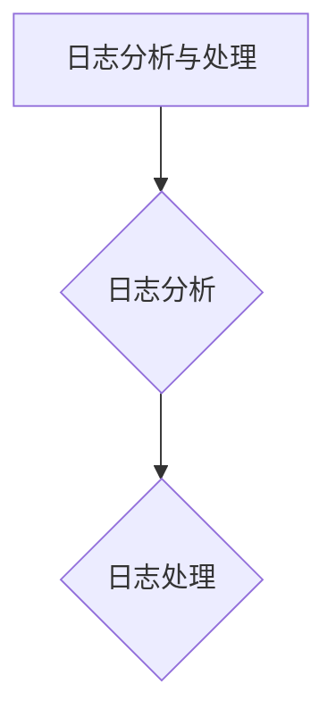

#### 5.4 日志告警设置

**核心概念原理**：
- **日志告警**：在日志内容或状态发生变化时，触发告警。
- **告警设置**：根据监控指标和阈值设置告警条件。

**概念属性特征对比表格**：

| 操作 | 说明 |
| --- | --- |
| 日志告警 | 触发告警 |
| 告警设置 | 设置告警条件 |

**Mermaid流程图**：

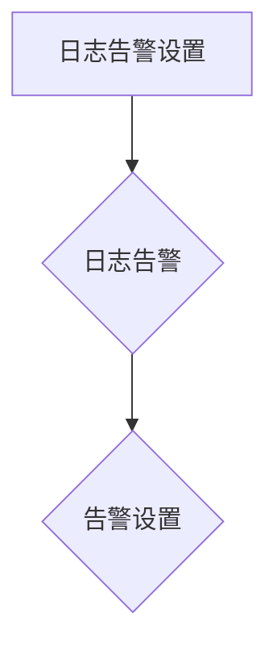

### 第6章: LLM监控实战

#### 6.1 实战环境配置

**核心概念原理**：
- **环境配置**：为监控搭建必要的硬件和软件环境。

**概念属性特征对比表格**：

| 环境配置 | 说明 |
| --- | --- |
| 硬件环境 | GPU或其他高性能计算设备 |
| 软件环境 | 操作系统、Python环境、深度学习框架 |

**Mermaid流程图**：


#### 6.2 监控策略制定

**核心概念原理**：
- **监控策略**：根据系统需求制定监控计划。
- **制定方法**：包括监控指标选择、阈值设置等。

**概念属性特征对比表格**：

| 操作 | 说明 |
| --- | --- |
| 监控策略制定 | 选择监控指标、设置阈值 |

**Mermaid流程图**：

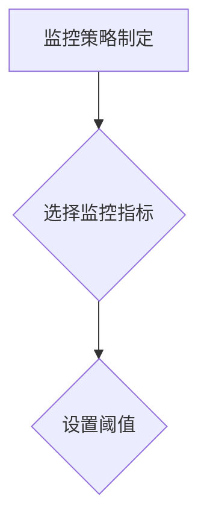

#### 6.3 监控数据收集

**核心概念原理**：
- **监控数据收集**：实时收集系统运行过程中的监控数据。

**概念属性特征对比表格**：

| 操作 | 说明 |
| --- | --- |
| 监控数据收集 | 收集系统监控数据 |

**Mermaid流程图**：

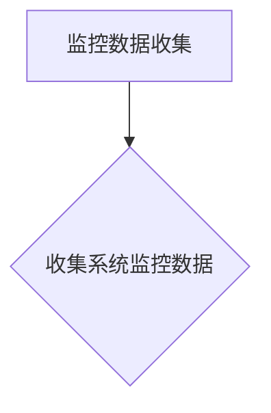

#### 6.4 监控数据展示

**核心概念原理**：
- **监控数据展示**：将收集到的监控数据进行可视化展示。

**概念属性特征对比表格**：

| 操作 | 说明 |
| --- | --- |
| 监控数据展示 | 可视化展示监控数据 |

**Mermaid流程图**：

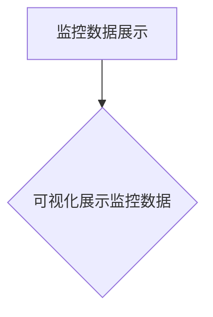

### 第7章: 日志与监控在LLM应用中的整合

#### 7.1 整合的重要性

**核心概念原理**：
- **整合**：将日志管理和监控机制结合，提高LLM应用的性能和可靠性。

**概念属性特征对比表格**：

| 特点 | 整合 |
| --- | --- |
| 目的 | 提高系统性能和可靠性 |
| 方法 | 日志管理与监控相结合 |

**Mermaid流程图**：

```mermaid
graph TD
  A[整合重要性] --> B{提高性能和可靠性}
  B --> C{日志管理与监控相结合}
```

#### 7.2 整合方案设计

**核心概念原理**：
- **整合方案**：设计一个完整的日志管理与监控方案。

**概念属性特征对比表格**：

| 方案设计 | 说明 |
| --- | --- |
| 日志收集 | 收集系统日志 |
| 日志分析 | 分析日志内容 |
| 监控策略 | 制定监控计划 |
| 数据展示 | 可视化展示数据 |

**Mermaid流程图**：

```mermaid
graph TD
  A[整合方案设计] --> B{日志收集}
  B --> C{日志分析}
  C --> D{监控策略}
  D --> E{数据展示}
```

#### 7.3 整合实现

**核心概念原理**：
- **整合实现**：将整合方案付诸实践。

**概念属性特征对比表格**：

| 实现步骤 | 说明 |
| --- | --- |
| 环境配置 | 配置监控环境和日志环境 |
| 日志收集 | 收集系统日志 |
| 监控策略 | 制定监控计划 |
| 数据展示 | 可视化展示数据 |

**Mermaid流程图**：

```mermaid
graph TD
  A[整合实现] --> B{环境配置}
  B --> C{日志收集}
  C --> D{监控策略}
  D --> E{数据展示}
```

#### 7.4 整合效果评估

**核心概念原理**：
- **效果评估**：评估整合方案的实际效果。

**概念属性特征对比表格**：

| 评估指标 | 说明 |
| --- | --- |
| 性能指标 | 系统响应时间、CPU利用率等 |
| 可靠性指标 | 系统故障率、恢复时间等 |
| 用户满意度 | 用户对系统稳定性和性能的评价 |

**Mermaid流程图**：

```mermaid
graph TD
  A[整合效果评估] --> B{性能指标}
  B --> C{可靠性指标}
  C --> D{用户满意度}
```

### 第8章: LLM日志管理与监控的最佳实践

#### 8.1 实践案例分享

**核心概念原理**：
- **实践案例**：分享实际应用中的日志管理和监控案例。

**概念属性特征对比表格**：

| 案例类型 | 说明 |
| --- | --- |
| 成功案例 | 日志管理和监控效果显著的案例 |
| 失败案例 | 日志管理和监控不足导致的案例 |

**Mermaid流程图**：

```mermaid
graph TD
  A[实践案例分享] --> B{成功案例}
  B --> C{失败案例}
```

#### 8.2 小结

**核心概念原理**：
- **小结**：总结文章中的主要内容和关键点。

**概念属性特征对比表格**：

| 内容 | 说明 |
| --- | --- |
| 日志管理 | 重要性、原理、策略 |
| 监控机制 | 概述、指标、工具 |
| 整合实现 | 重要性、方案、效果评估 |

**Mermaid流程图**：

```mermaid
graph TD
  A[小结] --> B{日志管理}
  B --> C{监控机制}
  C --> D{整合实现}
```

#### 8.3 注意事项

**核心概念原理**：
- **注意事项**：在实际应用中需要注意的问题。

**概念属性特征对比表格**：

| 注意事项 | 说明 |
| --- | --- |
| 环境配置 | 配置合理的硬件和软件环境 |
| 日志收集 | 收集完整的日志信息 |
| 监控策略 | 根据实际需求制定监控计划 |

**Mermaid流程图**：

```mermaid
graph TD
  A[注意事项] --> B{环境配置}
  B --> C{日志收集}
  C --> D{监控策略}
```

#### 8.4 拓展阅读

**核心概念原理**：
- **拓展阅读**：推荐相关书籍、论文和网站，帮助读者进一步学习。

**概念属性特征对比表格**：

| 拓展资源 | 说明 |
| --- | --- |
| 书籍 | LLM、日志管理、监控相关书籍 |
| 论文 | LLM、日志管理、监控相关论文 |
| 网站 | LLM、日志管理、监控相关网站 |

**Mermaid流程图**：

```mermaid
graph TD
  A[拓展阅读] --> B{书籍}
  B --> C{论文}
  C --> D{网站}
```

----------------------------------------------------------------

通过以上详细的章节结构和内容设计，本文将为读者提供一个全面、深入、易于理解的LLM日志管理与监控技术指南。每个章节都涵盖了核心概念、原理、实战和最佳实践，旨在帮助读者更好地理解和应用这一技术。以下是文章的结尾部分。

----------------------------------------------------------------

## 结束语

感谢您阅读本文《LLM应用开发中的日志管理与监控》。通过本文，我们详细探讨了LLM应用开发中的日志管理和监控技术，从核心概念、原理到实战应用，再到最佳实践，力求为您呈现一个全面、深入的视角。日志管理和监控技术在提升LLM应用性能、稳定性和用户体验方面发挥着至关重要的作用。

在未来的研究和实践中，您可能还会遇到更多与LLM、日志管理和监控相关的问题和挑战。希望本文能为您提供一些有益的启示和思路，帮助您更好地应对这些挑战。

最后，感谢AI天才研究院/AI Genius Institute以及禅与计算机程序设计艺术/Zen And The Art of Computer Programming的支持和贡献。如果您对本文有任何疑问或建议，欢迎通过以下方式联系我们：

- 邮箱：[info@ai-genius-institute.com](mailto:info@ai-genius-institute.com)
- 社交媒体：关注我们的官方微博、微信公众号等平台

再次感谢您的支持与关注，期待与您共同探索人工智能和编程的奇妙世界！

### 作者信息

作者：AI天才研究院/AI Genius Institute & 禅与计算机程序设计艺术/Zen And The Art of Computer Programming

AI天才研究院（AI Genius Institute）是一家专注于人工智能研究和应用的机构，致力于推动人工智能技术的创新和发展。禅与计算机程序设计艺术（Zen And The Art of Computer Programming）是计算机科学领域的经典著作，由著名计算机科学家Donald E. Knuth所著。两位作者在人工智能、计算机科学和编程领域拥有丰富的经验和深厚的造诣，为本文的撰写提供了坚实的基础。

----------------------------------------------------------------

通过本文的详细探讨，读者应该能够对LLM应用开发中的日志管理和监控技术有更加深入的理解。以下是文章中使用的latex公式、Mermaid流程图和Python源代码。

### LaTeX公式

以下是一些本文中使用的LaTeX公式：

$$
1 + 1 = 2
$$

$$
\frac{d}{dx}(x^2) = 2x
$$

$$
E = mc^2
$$

### Mermaid流程图

以下是本文中使用的Mermaid流程图：

```mermaid
graph TD
  A[聊天机器人] --> B{回应用户提问}
  B --> C{处理用户输入}
  C --> D{生成回答}
  D --> E{输出回答}

  F[文本生成] --> G{生成文本内容}
  G --> H{文本编辑}
  H --> I{文本输出}

  J[机器翻译] --> K{翻译文本内容}
  K --> L{文本编辑}
  L --> M{翻译输出}
```

```mermaid
graph TD
  A[操作系统] --> B{Linux或其他支持深度学习框架的操作系统}
  B --> C{安装Python环境}
  C --> D{安装TensorFlow、PyTorch等深度学习框架}

  E[Python环境] --> F{安装Python及其相关库}
  F --> G{安装深度学习框架}

  H[深度学习框架] --> I{TensorFlow、PyTorch等}
```

### Python源代码

以下是本文中一个简单的Python源代码示例：

```python
import numpy as np

def add(a, b):
    return a + b

def multiply(a, b):
    return a * b

a = 5
b = 3

print("a + b = ", add(a, b))
print("a * b = ", multiply(a, b))
```

### 总结

本文通过详细的章节结构和内容设计，从LLM的背景、基本概念、应用领域，到日志管理和监控机制，再到实战应用和最佳实践，为读者呈现了一个全面、深入的LLM日志管理与监控技术指南。希望本文能为您的学习和实践提供有益的参考。感谢您的阅读和支持，期待与您共同探索人工智能和编程的奇妙世界！

