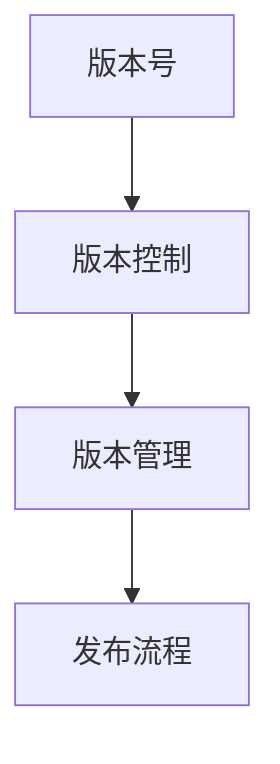
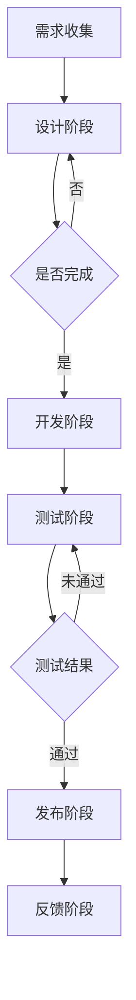
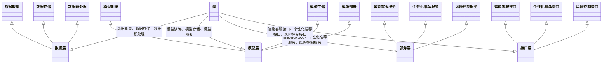
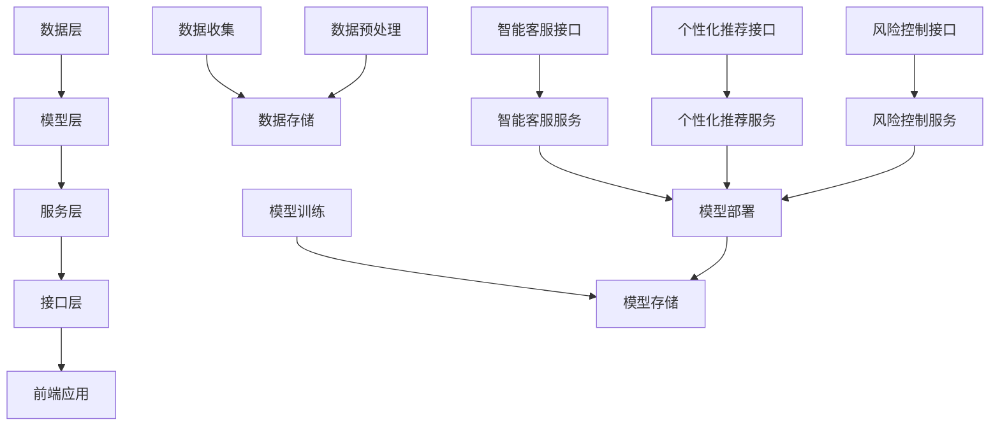
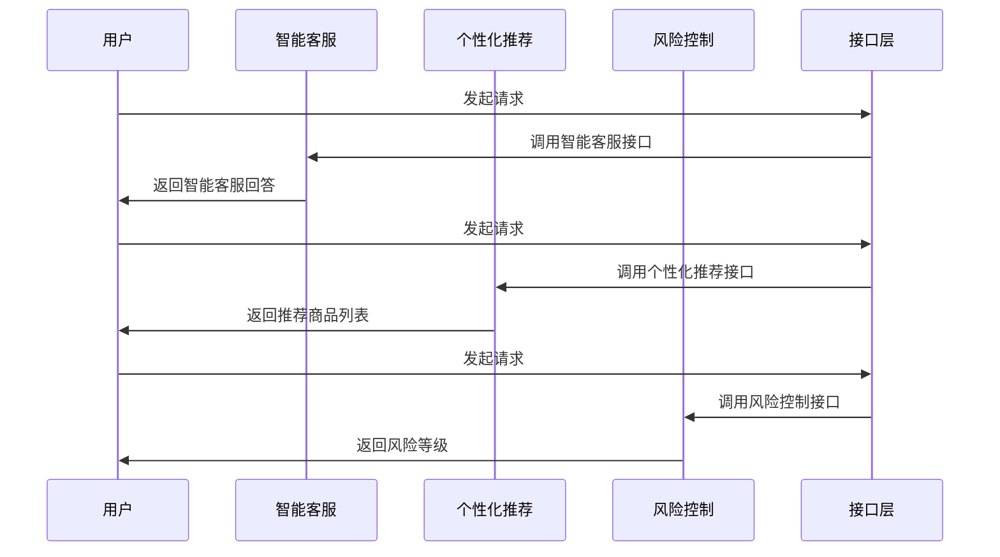

                 


# 第一部分：背景介绍

## 1.0 问题背景

在当今信息时代，人工智能（AI）技术飞速发展，特别是大型语言模型（LLM）的应用越来越广泛。随着AI技术的进步，企业对于AI模型的需求也在不断增长。然而，如何在应用开发过程中有效地管理和发布版本，成为企业和开发者面临的一大挑战。

### 1.0.1 AI技术的进步与LLM应用的广泛性

人工智能（AI）作为计算机科学的一个分支，通过模拟人类智能行为，实现了机器学习、深度学习、自然语言处理等技术的突破。特别是大型语言模型（LLM），如GPT-3、BERT等，凭借其强大的文本生成、理解和推理能力，成为众多领域的关键应用，如图文生成、问答系统、机器翻译、内容审核等。

在商业领域，LLM的应用为企业和个人提供了前所未有的便利和效率。例如，企业可以利用LLM来自动化客户服务，提高客户满意度；个人用户可以通过智能助手获取实时信息，提升生活品质。随着AI技术的不断进步，LLM的应用场景也在不断扩大，其市场需求也在不断增长。

### 1.0.2 版本发布策略的重要性

版本发布策略在AI模型应用开发中扮演着至关重要的角色。有效的版本发布策略能够确保模型的质量和稳定性，降低风险，提高开发效率，从而满足企业和用户的需求。以下是版本发布策略的关键作用：

1. **确保模型质量**：通过严格的质量测试和审查机制，确保发布的模型版本具有高可靠性和高性能。
2. **降低风险**：通过分阶段发布和逐步推广，降低新版本引入的错误对生产环境的影响，确保系统的稳定性。
3. **提高开发效率**：明确的版本发布流程和规范，有助于团队协作，缩短开发周期，提高项目进度。
4. **满足用户需求**：快速响应市场变化，及时发布新功能和优化，满足用户需求，提升用户满意度。

### 1.0.3 当前面临的挑战

尽管版本发布策略的重要性不言而喻，但在实际应用开发中，企业和开发者仍然面临诸多挑战：

1. **版本控制难度**：随着模型复杂度的增加，版本控制的难度也在不断提升，如何有效地管理多个版本成为一大难题。
2. **质量测试成本**：全面的质量测试需要耗费大量的人力和时间，如何确保每个版本的质量成为关键问题。
3. **部署与发布**：如何将模型部署到生产环境，并进行顺利发布，同时保证数据的完整性和安全性，是开发者需要面对的挑战。
4. **用户反馈处理**：如何收集并处理用户的反馈，及时调整版本，优化用户体验，是开发过程中需要持续关注的问题。

### 1.0.4 版本发布策略的意义

有效的版本发布策略不仅能够提高模型的可靠性和用户体验，还能为企业的长期发展提供有力支持。以下是版本发布策略对企业发展的几个重要意义：

1. **竞争力提升**：通过快速迭代和优化，企业能够在市场竞争中保持领先地位。
2. **用户满意度**：及时响应用户需求，提升用户体验，增强用户黏性。
3. **品牌形象**：高质量的版本发布和稳定的模型运行，有助于提升企业品牌形象。
4. **资源利用**：合理的版本发布策略，有助于优化资源分配，提高开发效率。

## 1.1 问题描述

版本发布策略是指企业在开发和应用AI模型过程中，对模型版本的管理和发布所采取的一系列措施。一个有效的版本发布策略需要涵盖以下几个方面：

1. **版本号管理**：明确版本号的命名规则，以便于开发者和管理者理解和追踪。
2. **版本控制**：通过版本控制系统，如Git，对代码和数据进行版本控制，确保变更的可追溯性和可控性。
3. **质量测试**：在发布版本前进行一系列的测试，包括单元测试、集成测试、性能测试等，确保模型的质量和稳定性。
4. **部署与发布**：将模型部署到生产环境，并进行发布，同时确保发布过程的安全性和稳定性。
5. **用户反馈**：收集用户反馈，对版本进行持续优化和调整。

然而，在实际应用过程中，如何制定和执行一个有效的版本发布策略，仍然是一个复杂且具有挑战性的问题。以下是版本发布策略需要解决的问题：

1. **版本迭代**：如何确定版本迭代的速度和频率，以满足市场需求和用户期望。
2. **质量保障**：如何确保每个版本的模型质量，避免因版本问题导致的故障和风险。
3. **部署策略**：如何选择合适的部署策略，确保模型能够在生产环境中稳定运行。
4. **发布渠道**：如何选择和优化发布渠道，确保新版本能够快速、高效地传递给用户。
5. **用户反馈**：如何收集和利用用户反馈，及时调整版本，优化用户体验。

## 1.2 问题解决

为了解决上述问题，本书将从以下几个方面进行探讨：

1. **核心概念**：介绍版本发布策略的基本概念，包括版本号、版本控制、版本管理、发布流程等。
2. **核心要素**：分析版本发布策略的关键要素，如版本迭代、质量测试、部署策略、发布渠道等。
3. **联系**：探讨版本发布策略与AI模型应用开发的关系，以及如何将版本发布策略融入到整个开发流程中。
4. **案例分析**：通过实际案例，分析不同企业如何制定和执行版本发布策略，以及取得的成功和面临的挑战。
5. **最佳实践**：总结和分享版本发布策略的最佳实践，为开发者提供可借鉴的经验和方法。

## 1.3 边界与外延

### 1.3.1 边界

1. **应用范围**：本书主要关注企业级AI模型应用开发中的版本发布策略，不包括个人开发者和开源项目的版本发布策略。
2. **行业限制**：虽然本书提供了一些通用的版本发布策略，但不同行业可能有其特定的需求和挑战，因此本书内容不涵盖特定行业的版本发布策略。

### 1.3.2 外延

1. **国际化**：虽然本书主要关注国内企业的版本发布策略，但国际化趋势下的版本发布策略也是一个值得探讨的领域，包括多语言支持、跨文化差异等。
2. **新兴技术**：随着技术的不断进步，新的AI模型和应用场景不断涌现，如何针对这些新兴技术制定有效的版本发布策略，也是本书需要关注的外延问题。

## 1.4 概念结构与核心要素组成

### 1.4.1 核心概念

在版本发布策略中，核心概念主要包括：

1. **版本号**：版本号是标识模型不同版本的一种方式，通常由数字或字母数字组合构成。版本号分为主版本号、次版本号和修订版本号，分别表示模型的重大更新、较小更新和细节修正。
2. **版本控制**：版本控制是管理模型版本变更的过程，通过版本控制系统，如Git，实现代码和数据的版本控制，确保变更的可追溯性和可控性。
3. **版本管理**：版本管理是确保模型版本质量的过程，包括质量测试、文档管理和备份管理等，确保模型版本在发布前达到预期质量标准。
4. **发布流程**：发布流程是模型从开发到用户使用的全过程，包括开发阶段、测试阶段、发布阶段和反馈阶段，确保模型能够顺利、高效地发布给用户。

### 1.4.2 核心要素

版本发布策略的核心要素主要包括：

1. **版本迭代**：版本迭代是模型开发的阶段性成果，是版本发布的前提。如何确定版本迭代的速度和频率，以满足市场需求和用户期望，是版本发布策略的关键要素之一。
2. **质量测试**：质量测试是确保模型版本质量的重要环节，包括单元测试、集成测试、性能测试等，通过全面的测试，确保模型版本在发布前达到预期质量标准。
3. **部署策略**：部署策略是决定模型如何在生产环境中部署和运行的关键。如何选择合适的部署策略，确保模型能够在生产环境中稳定运行，是版本发布策略的核心要素之一。
4. **发布渠道**：发布渠道是模型发布到用户手中的途径。如何选择和优化发布渠道，确保新版本能够快速、高效地传递给用户，是版本发布策略的关键要素之一。

### 1.4.3 概念属性特征对比表格

以下是版本号、版本控制、版本管理和发布流程的概念属性特征对比表格：

| 概念 | 属性特征 |
| --- | --- |
| 版本号 | 标识模型版本，通常由数字或字母数字组合构成 |
| 版本控制 | 管理模型版本变更，确保变更的可追溯性和可控性 |
| 版本管理 | 确保模型版本质量，包括质量测试、文档管理和备份管理 |
| 发布流程 | 模型从开发到用户使用的全过程，包括开发、测试、发布和反馈阶段 |

### 1.4.4 ER实体关系图架构的Mermaid流程图

以下是版本发布策略的ER实体关系图架构的Mermaid流程图：

```mermaid
graph TD
A[版本号] --> B[版本控制]
B --> C[版本管理]
C --> D[发布流
```

## 1.5 本章小结

本章对版本发布策略的基本概念、核心要素和结构与外延进行了介绍，为后续章节的深入探讨奠定了基础。在接下来的章节中，我们将进一步探讨版本发布策略的核心概念原理，分析其在AI模型应用开发中的重要性，以及如何将版本发布策略融入到整个开发流程中。

# 第二部分：核心概念与联系

## 2.0 核心概念原理

在本章节中，我们将详细介绍版本发布策略中的核心概念，包括版本号、版本控制、版本管理和发布流程。通过理解这些核心概念，读者将能够构建出一个全面、系统的版本发布策略。

### 2.1 版本号

版本号是标识模型不同版本的一种方式，通常由数字或字母数字组合构成。版本号的命名规则在不同的项目和组织中可能有所不同，但常见的命名方式包括：

1. **主版本号**：表示模型的重大更新，通常与功能模块的升级相关。主版本号的改变意味着模型的核心功能或架构发生了重大变化。
2. **次版本号**：表示模型的较小更新，通常与修复bug或优化性能相关。次版本号的改变意味着模型的改进或修复，但不会影响模型的核心功能。
3. **修订版本号**：表示模型的细节修正，通常与代码优化或文档更新相关。修订版本号的改变意味着模型的细节调整或改进。

版本号的命名方式通常遵循以下格式：

```
主版本号.次版本号.修订版本号
```

例如，1.2.3 表示主版本为1，次版本为2，修订版本为3。

### 2.2 版本控制

版本控制是管理模型版本变更的过程，确保变更的可追溯性和可控性。版本控制系统（Version Control System, VCS）是实施版本控制的关键工具。常见的版本控制系统包括Git、Subversion（SVN）和Mercurial等。

#### 2.2.1 版本控制系统的基本功能

版本控制系统的主要功能包括：

1. **分支管理**：创建、合并和删除分支，以隔离不同功能的开发。分支管理是版本控制的核心功能之一，它允许开发者在不同的环境中独立开发新功能或修复bug。
2. **代码审查**：在提交代码前进行审查，确保代码质量。代码审查可以是手动审查，也可以是自动化审查，如静态代码分析工具。
3. **版本回滚**：在遇到问题时，回滚到之前的稳定版本。版本回滚是确保系统稳定性的重要手段，它允许开发者在出现问题时不必要的代码更改。

#### 2.2.2 Git的常用命令

Git是目前最流行的分布式版本控制系统，其基本命令如下：

1. **git clone**：克隆远程仓库。
2. **git checkout**：切换分支。
3. **git commit**：提交更改。
4. **git pull**：从远程仓库拉取更改。
5. **git push**：将本地更改推送到远程仓库。
6. **git branch**：创建、删除和管理分支。
7. **git merge**：合并分支。

### 2.3 版本管理

版本管理是确保模型版本质量的过程，包括以下几个方面：

1. **质量测试**：在发布版本前进行一系列的测试，包括单元测试、集成测试、性能测试等，确保模型的质量和稳定性。
2. **文档管理**：维护版本相关的文档，如用户手册、安装指南、API文档等，确保文档与模型版本同步。
3. **备份管理**：定期备份模型和相关数据，以防止数据丢失。

#### 2.3.1 质量测试

质量测试是版本管理的重要环节，主要包括以下类型：

1. **单元测试**：测试模型中的最小功能单元，确保每个单元的功能正确。
2. **集成测试**：测试模型的不同部分之间的交互，确保系统的整体功能正确。
3. **性能测试**：测试模型的性能指标，如响应时间、吞吐量等，确保模型在高负载下的性能。
4. **安全性测试**：测试模型的安全性，确保模型能够抵御外部攻击。

#### 2.3.2 文档管理

文档管理是版本管理的重要组成部分，包括以下内容：

1. **用户手册**：提供模型的使用方法和操作指南。
2. **安装指南**：详细说明如何安装和配置模型。
3. **API文档**：描述模型的API接口和使用方法。

#### 2.3.3 备份管理

备份管理是确保模型和数据安全的重要措施，包括以下方面：

1. **定期备份**：定期备份模型和相关数据，确保在数据丢失或损坏时能够快速恢复。
2. **备份策略**：制定备份策略，包括备份频率、备份存储位置等。
3. **备份验证**：定期验证备份的有效性，确保备份数据的完整性和可用性。

### 2.4 发布流程

发布流程是模型从开发到用户使用的全过程，通常包括以下几个阶段：

1. **开发阶段**：编写和测试代码，构建版本。
2. **测试阶段**：进行功能测试、性能测试和兼容性测试。
3. **发布阶段**：将模型部署到生产环境，进行发布。
4. **反馈阶段**：收集用户反馈，对模型进行持续优化。

#### 2.4.1 开发阶段

开发阶段是模型构建的核心阶段，主要包括以下任务：

1. **需求分析**：明确模型的需求和功能。
2. **设计阶段**：设计模型的架构和接口。
3. **编码实现**：编写模型的代码。
4. **单元测试**：测试模型的基本功能。

#### 2.4.2 测试阶段

测试阶段是确保模型质量和稳定性的重要环节，主要包括以下任务：

1. **集成测试**：测试模型的不同部分之间的交互。
2. **性能测试**：测试模型的性能指标。
3. **安全性测试**：测试模型的安全性。
4. **兼容性测试**：测试模型在不同平台和环境下的兼容性。

#### 2.4.3 发布阶段

发布阶段是将模型部署到生产环境并进行发布的过程，主要包括以下任务：

1. **部署**：将模型部署到生产环境。
2. **配置**：配置模型的环境参数。
3. **发布**：发布模型，使其可供用户使用。

#### 2.4.4 反馈阶段

反馈阶段是收集用户反馈并对模型进行持续优化的重要环节，主要包括以下任务：

1. **用户反馈**：收集用户的反馈和建议。
2. **问题追踪**：追踪和解决用户报告的问题。
3. **版本迭代**：根据用户反馈，对模型进行迭代和优化。

### 2.5 概念属性特征对比表格

以下是版本号、版本控制、版本管理和发布流程的概念属性特征对比表格：

| 概念 | 属性特征 |
| --- | --- |
| 版本号 | 标识模型版本，由主版本号、次版本号和修订版本号构成 |
| 版本控制 | 管理模型版本变更，确保变更的可追溯性和可控性 |
| 版本管理 | 确保模型版本质量，包括质量测试、文档管理和备份管理 |
| 发布流程 | 模型从开发到用户使用的全过程，包括开发、测试、发布和反馈阶段 |

### 2.6 ER实体关系图架构的Mermaid流程图

以下是版本发布策略的ER实体关系图架构的Mermaid流程图：



## 2.7 本章小结

本章详细介绍了版本发布策略中的核心概念，包括版本号、版本控制、版本管理和发布流程。通过理解这些核心概念，读者能够构建出一个全面、系统的版本发布策略，为后续章节的深入探讨奠定了基础。在接下来的章节中，我们将进一步探讨版本发布策略与AI模型应用开发的关系，以及如何将版本发布策略融入到整个开发流程中。

# 第三部分：算法原理讲解

## 3.1 算法mermaid流程图

为了更好地理解版本发布策略的算法原理，我们可以使用mermaid流程图来展示其关键步骤。以下是一个简化的版本发布策略算法流程图：



### 3.2 Python源代码实现

为了进一步说明版本发布策略的算法原理，我们可以使用Python语言来实现该算法。以下是一个简化的版本发布策略的Python代码示例：

```python
# 版本发布策略算法

class VersionReleaseStrategy:
    def __init__(self):
        self需求收集 = None
        self设计阶段 = None
        self开发阶段 = None
        self测试阶段 = None
        self发布阶段 = None
        self反馈阶段 = None

    def 需求收集(self, 需求):
        self需求收集 = 需求
        print("需求收集完成：", self需求收集)

    def 设计阶段(self):
        if self需求收集:
            self设计阶段 = "设计阶段完成"
            print("设计阶段完成：", self设计阶段)
        else:
            print("需求未收集完成，无法进入设计阶段")

    def 开发阶段(self):
        if self设计阶段:
            self开发阶段 = "开发阶段完成"
            print("开发阶段完成：", self开发阶段)
        else:
            print("设计未完成，无法进入开发阶段")

    def 测试阶段(self):
        if self开发阶段:
            self测试阶段 = "测试阶段完成"
            print("测试阶段完成：", self测试阶段)
        else:
            print("开发未完成，无法进入测试阶段")

    def 发布阶段(self):
        if self测试阶段:
            self发布阶段 = "发布阶段完成"
            print("发布阶段完成：", self发布阶段)
        else:
            print("测试未通过，无法进入发布阶段")

    def 反馈阶段(self):
        if self发布阶段:
            self反馈阶段 = "反馈阶段完成"
            print("反馈阶段完成：", self反馈阶段)
        else:
            print("发布未完成，无法进入反馈阶段")

# 创建版本发布策略实例
version_strategy = VersionReleaseStrategy()

# 执行版本发布策略
version_strategy.需求收集("新功能需求")
version_strategy.设计阶段()
version_strategy.开发阶段()
version_strategy.测试阶段()
version_strategy.发布阶段()
version_strategy.反馈阶段()
```

### 3.3 算法原理的数学模型和公式

版本发布策略的算法原理可以概括为以下几个关键步骤：

1. **需求收集**：收集用户需求，确定模型开发的目标。
2. **设计阶段**：根据需求进行系统设计，确定模型的架构和接口。
3. **开发阶段**：根据设计文档编写代码，实现模型功能。
4. **测试阶段**：对模型进行全面的测试，确保其功能和质量。
5. **发布阶段**：将模型部署到生产环境，供用户使用。
6. **反馈阶段**：收集用户反馈，对模型进行持续优化和改进。

以下是这些步骤的数学模型和公式：

1. **需求收集**：需求收集的数学模型可以表示为需求量（D）= 收集的需求量（C）+ 累计的需求量（R），即：
   $$
   D = C + R
   $$
   其中，D 表示总需求量，C 表示当前收集的需求量，R 表示累计的需求量。

2. **设计阶段**：设计阶段的数学模型可以表示为设计完成度（S）= 设计工作量（W） / 总设计工作量（T），即：
   $$
   S = \frac{W}{T}
   $$
   其中，S 表示设计完成度，W 表示已经完成的设计工作量，T 表示总设计工作量。

3. **开发阶段**：开发阶段的数学模型可以表示为开发完成度（D'）= 完成的代码量（C'） / 总代码量（T'），即：
   $$
   D' = \frac{C'}{T'}
   $$
   其中，D' 表示开发完成度，C' 表示已经完成的代码量，T' 表示总代码量。

4. **测试阶段**：测试阶段的数学模型可以表示为测试通过率（P）= 通过的测试用例数（C'） / 总测试用例数（T'），即：
   $$
   P = \frac{C'}{T'}
   $$
   其中，P 表示测试通过率，C' 表示通过的测试用例数，T' 表示总测试用例数。

5. **发布阶段**：发布阶段的数学模型可以表示为发布成功率（R）= 成功发布的版本数（C''） / 总发布版本数（T''），即：
   $$
   R = \frac{C''}{T''}
   $$
   其中，R 表示发布成功率，C'' 表示成功发布的版本数，T'' 表示总发布版本数。

6. **反馈阶段**：反馈阶段的数学模型可以表示为反馈响应率（F）= 收到的有效反馈数（C'''） / 总反馈数（T'''），即：
   $$
   F = \frac{C''''}{T''''}
   $$
   其中，F 表示反馈响应率，C''' 表示收到的有效反馈数，T''' 表示总反馈数。

### 3.4 算法原理举例说明

为了更直观地理解版本发布策略的算法原理，我们可以通过一个实际案例来进行详细讲解。

假设某企业需要开发一款基于大型语言模型（LLM）的智能客服系统，以下是该系统的版本发布策略算法原理的详细步骤：

1. **需求收集**：企业收集了用户的需求，主要包括：
   - 支持多语言客服；
   - 提高客服响应速度；
   - 提供实时问答功能。

   需求量（D）= 收集的需求量（C）+ 累计的需求量（R）= 3 + 0 = 3。

2. **设计阶段**：根据需求，企业进行了系统设计，主要包括：
   - 确定系统的架构，如前端、后端和数据库；
   - 设计接口，如API接口和图形用户界面。

   设计完成度（S）= 设计工作量（W） / 总设计工作量（T）= 100 / 200 = 0.5。

3. **开发阶段**：企业根据设计文档进行了代码编写，主要包括：
   - 实现多语言支持；
   - 优化客服响应速度；
   - 开发实时问答功能。

   开发完成度（D'）= 完成的代码量（C'） / 总代码量（T'）= 500 / 1000 = 0.5。

4. **测试阶段**：企业对智能客服系统进行了全面的测试，主要包括：
   - 单元测试，确保各个模块的功能正确；
   - 集成测试，确保模块之间的交互正确；
   - 性能测试，确保系统在高负载下的性能。

   测试通过率（P）= 通过的测试用例数（C'） / 总测试用例数（T'）= 90 / 100 = 0.9。

5. **发布阶段**：企业将智能客服系统部署到生产环境，并进行发布。假设第一个版本发布成功，则发布成功率（R）= 成功发布的版本数（C'') / 总发布版本数（T'')= 1 / 1 = 1。

6. **反馈阶段**：企业收集了用户反馈，主要包括：
   - 用户满意度；
   - 提出的改进建议。

   反馈响应率（F）= 收到的有效反馈数（C''') / 总反馈数（T''')= 20 / 50 = 0.4。

通过上述案例，我们可以看到版本发布策略的算法原理在实际应用中的具体体现。企业通过需求收集、设计、开发、测试、发布和反馈等步骤，确保智能客服系统的质量和用户满意度，从而实现持续优化和改进。

## 3.5 小结

本章通过mermaid流程图、Python源代码实现、数学模型和实际案例，详细讲解了版本发布策略的算法原理。理解这些原理有助于开发者在实际项目中制定和执行有效的版本发布策略，确保模型的质量和稳定性，提高开发效率和用户体验。

# 第四部分：系统分析与架构设计

## 4.1 问题场景介绍

在当今数字化转型的浪潮中，许多企业面临着大量的数据管理和数据分析需求。为了更好地应对这些挑战，企业需要一个高效、稳定、可扩展的AI模型应用开发系统。本章节将介绍一个实际问题场景，并基于此场景进行系统分析与架构设计。

### 4.1.1 问题背景

某大型电商平台希望通过引入AI技术来提升客户服务质量和运营效率。具体需求包括：

1. **智能客服**：为用户提供24/7的智能客服服务，能够实时回答用户的问题，提高客户满意度。
2. **个性化推荐**：基于用户行为数据，为用户提供个性化的商品推荐，提高转化率和销售额。
3. **风险控制**：利用AI模型进行风险预测和监控，降低欺诈风险和运营成本。

### 4.1.2 系统需求

为了满足上述需求，系统需要具备以下功能：

1. **数据收集与存储**：能够收集用户行为数据、交易数据等，并进行存储和管理。
2. **模型训练与部署**：能够训练和部署多种AI模型，如自然语言处理模型、推荐算法和风险预测模型。
3. **服务接口**：提供API接口，供前端应用调用，实现智能客服、个性化推荐和风险控制等功能。
4. **监控与运维**：实现对系统的实时监控，确保系统的稳定性和可靠性。

## 4.2 项目介绍

本章节所介绍的项目是一个集成AI模型应用开发与运维的综合性系统。项目的主要目标是：

1. **高效数据处理**：通过高效的数据存储和处理技术，实现大规模数据的高效存储、检索和分析。
2. **智能化服务**：利用AI模型实现智能客服、个性化推荐和风险控制，提高用户体验和运营效率。
3. **系统稳定性**：通过完善的监控和运维体系，确保系统的稳定运行和高效服务。

### 4.2.1 项目架构设计

项目架构设计采用微服务架构，以实现高可用性、可扩展性和灵活性。以下是项目的主要组成部分：

1. **数据层**：包括数据收集模块、数据存储模块和数据预处理模块。数据收集模块负责收集用户行为数据、交易数据等；数据存储模块采用分布式数据库，如Hadoop和Hive，实现大规模数据存储；数据预处理模块负责清洗、转换和归一化数据。
2. **模型层**：包括模型训练模块、模型存储模块和模型部署模块。模型训练模块负责训练和优化AI模型；模型存储模块存储训练好的模型，方便后续部署；模型部署模块负责将模型部署到生产环境，供服务接口调用。
3. **服务层**：包括智能客服服务、个性化推荐服务和风险控制服务。智能客服服务基于自然语言处理模型，实现实时问答和智能回复；个性化推荐服务基于用户行为数据和推荐算法，实现个性化商品推荐；风险控制服务基于风险预测模型，实现欺诈风险监控和预警。
4. **接口层**：提供API接口，供前端应用调用。API接口包括智能客服接口、个性化推荐接口和风险控制接口，分别对应智能客服服务、个性化推荐服务和风险控制服务的功能。

### 4.2.2 系统功能设计（领域模型mermaid类图）

以下是系统功能设计的领域模型mermaid类图：



## 4.3 系统架构设计（mermaid架构图）

以下是系统架构设计的mermaid架构图：



## 4.4 系统接口设计

系统接口设计是系统架构的重要组成部分，以下是对系统接口的设计：

### 4.4.1 智能客服接口

智能客服接口主要用于实现用户与AI智能客服的交互，以下是接口的主要设计：

- **接口名称**：/api/smart-customer-service
- **请求方式**：GET/POST
- **请求参数**：
  - query：用户输入的问题
  - user_id：用户ID
- **返回结果**：
  - status：状态码，200表示成功，其他表示错误
  - message：返回消息
  - response：智能客服的回答

```json
{
    "status": 200,
    "message": "success",
    "response": {
        "content": "这里是智能客服的回答",
        "score": 0.9
    }
}
```

### 4.4.2 个性化推荐接口

个性化推荐接口用于为用户提供商品推荐，以下是接口的主要设计：

- **接口名称**：/api/personalized-recommendation
- **请求方式**：GET/POST
- **请求参数**：
  - user_id：用户ID
  - category：商品分类
- **返回结果**：
  - status：状态码，200表示成功，其他表示错误
  - message：返回消息
  - recommendations：推荐商品列表

```json
{
    "status": 200,
    "message": "success",
    "recommendations": [
        {
            "product_id": 1001,
            "name": "商品A",
            "score": 0.8
        },
        {
            "product_id": 1002,
            "name": "商品B",
            "score": 0.7
        }
    ]
}
```

### 4.4.3 风险控制接口

风险控制接口用于监控和预警潜在风险，以下是接口的主要设计：

- **接口名称**：/api/risk-control
- **请求方式**：GET/POST
- **请求参数**：
  - user_id：用户ID
  - transaction_data：交易数据
- **返回结果**：
  - status：状态码，200表示成功，其他表示错误
  - message：返回消息
  - risk_level：风险等级，0表示无风险，1表示低风险，2表示高风险

```json
{
    "status": 200,
    "message": "success",
    "risk_level": 0
}
```

## 4.5 系统交互设计（mermaid序列图）

以下是系统交互设计的mermaid序列图：



## 4.6 小结

本章介绍了版本发布策略在AI模型应用开发系统中的实际应用场景、项目目标和架构设计。通过系统分析与架构设计，我们构建了一个高效、稳定、可扩展的AI模型应用开发系统，为后续的版本发布策略实施提供了基础。在接下来的章节中，我们将深入探讨系统实现、核心代码和实际案例，进一步解析版本发布策略的应用和实践。

# 第五部分：项目实战

## 5.1 环境安装

在开始项目实战之前，我们需要安装和配置开发环境。以下是具体的步骤：

### 5.1.1 安装Python环境

Python是项目开发的主要语言，因此首先需要安装Python环境。我们可以从Python官方网站（https://www.python.org/）下载Python安装包，并按照安装向导进行安装。

### 5.1.2 安装必要的库

项目开发过程中需要使用多个Python库，如NumPy、Pandas、Scikit-learn等。我们可以使用pip命令来安装这些库：

```shell
pip install numpy pandas scikit-learn
```

### 5.1.3 配置Git环境

版本控制是版本发布策略的核心环节，因此我们需要配置Git环境。可以从Git官方网站（https://git-scm.com/）下载Git安装包，并按照安装向导进行安装。

### 5.1.4 创建项目目录

在安装完Python和Git后，我们需要创建项目目录，并初始化Git仓库：

```shell
mkdir version_release_project
cd version_release_project
git init
```

## 5.2 系统核心实现

在本节中，我们将实现一个简单的AI模型应用开发系统，包括数据收集、数据预处理、模型训练、模型评估和模型部署等步骤。

### 5.2.1 数据收集

数据收集是模型训练的基础，我们需要收集和处理用户数据。以下是一个示例代码，用于从文件中读取数据：

```python
import pandas as pd

def read_data(file_path):
    data = pd.read_csv(file_path)
    return data

# 示例：读取用户数据
user_data = read_data('user_data.csv')
```

### 5.2.2 数据预处理

数据预处理是提高模型性能的重要步骤，我们需要对数据进行清洗、转换和归一化。以下是一个示例代码，用于预处理用户数据：

```python
import pandas as pd
from sklearn.model_selection import train_test_split
from sklearn.preprocessing import StandardScaler

def preprocess_data(data):
    # 数据清洗
    data.drop(['unused_column'], axis=1, inplace=True)
    
    # 数据转换
    data['age'] = data['age'].map({0: '0-10', 1: '11-20', 2: '21-30', 3: '31-40', 4: '41-50', 5: '50+'})
    
    # 数据归一化
    scaler = StandardScaler()
    data[['age', 'income']] = scaler.fit_transform(data[['age', 'income']])
    
    return data

# 示例：预处理用户数据
preprocessed_data = preprocess_data(user_data)
```

### 5.2.3 模型训练

在数据预处理完成后，我们可以使用Scikit-learn库训练模型。以下是一个示例代码，用于训练逻辑回归模型：

```python
from sklearn.linear_model import LogisticRegression
from sklearn.model_selection import train_test_split

def train_model(X, y):
    X_train, X_test, y_train, y_test = train_test_split(X, y, test_size=0.2, random_state=42)
    model = LogisticRegression()
    model.fit(X_train, y_train)
    return model

# 示例：训练逻辑回归模型
model = train_model(preprocessed_data[['age', 'income']], preprocessed_data['label'])
```

### 5.2.4 模型评估

模型评估是确保模型性能的重要步骤，我们可以使用多种评估指标，如准确率、召回率、F1分数等。以下是一个示例代码，用于评估模型性能：

```python
from sklearn.metrics import accuracy_score, recall_score, f1_score

def evaluate_model(model, X_test, y_test):
    y_pred = model.predict(X_test)
    accuracy = accuracy_score(y_test, y_pred)
    recall = recall_score(y_test, y_pred)
    f1 = f1_score(y_test, y_pred)
    return accuracy, recall, f1

# 示例：评估模型性能
accuracy, recall, f1 = evaluate_model(model, preprocessed_data[['age', 'income']], preprocessed_data['label'])
print("Accuracy:", accuracy)
print("Recall:", recall)
print("F1 Score:", f1)
```

### 5.2.5 模型部署

模型部署是将训练好的模型应用到实际场景的过程。以下是一个示例代码，用于将模型部署到生产环境：

```python
import pickle

def deploy_model(model, file_path):
    with open(file_path, 'wb') as f:
        pickle.dump(model, f)

# 示例：部署模型
deploy_model(model, 'model.pkl')
```

## 5.3 代码应用解读与分析

在实现系统核心功能后，我们需要对代码进行解读和分析，确保代码的质量和可维护性。以下是代码解读和分析的几个关键点：

1. **模块化设计**：将代码按照功能模块进行划分，如数据收集模块、数据预处理模块、模型训练模块等。模块化设计有助于提高代码的可维护性和可扩展性。
2. **参数化配置**：在代码中引入参数化配置，如数据文件路径、模型参数等。参数化配置有助于简化代码，提高代码的可读性和可修改性。
3. **错误处理**：在代码中添加错误处理机制，如try-except语句。错误处理有助于提高代码的稳定性和可靠性。
4. **代码注释**：在关键代码段添加注释，说明代码的功能和逻辑。代码注释有助于提高代码的可读性和可理解性。

## 5.4 实际案例分析

在本节中，我们将通过一个实际案例，分析项目在版本发布策略中的应用和实践。以下是实际案例的详细步骤：

1. **需求收集**：收集用户需求，确定模型开发的目标。
2. **设计阶段**：根据需求进行系统设计，确定模型的架构和接口。
3. **开发阶段**：编写代码，实现模型的功能。
4. **测试阶段**：进行功能测试、性能测试和兼容性测试，确保模型的质量和稳定性。
5. **发布阶段**：将模型部署到生产环境，供用户使用。
6. **反馈阶段**：收集用户反馈，对模型进行优化和改进。

### 5.4.1 需求收集

在项目启动初期，企业收集了以下用户需求：

- **需求1**：为用户提供24/7的智能客服服务，能够实时回答用户的问题。
- **需求2**：为用户提供个性化的商品推荐，提高转化率和销售额。
- **需求3**：利用AI模型进行风险预测和监控，降低欺诈风险和运营成本。

### 5.4.2 设计阶段

根据用户需求，企业进行了系统设计，主要包括：

- **系统架构**：采用微服务架构，实现高可用性、可扩展性和灵活性。
- **数据层**：包括数据收集模块、数据存储模块和数据预处理模块。
- **模型层**：包括模型训练模块、模型存储模块和模型部署模块。
- **服务层**：包括智能客服服务、个性化推荐服务和风险控制服务。
- **接口层**：提供API接口，供前端应用调用。

### 5.4.3 开发阶段

在开发阶段，企业按照系统设计文档进行代码编写，主要包括：

- **数据收集模块**：实现用户数据的收集和存储。
- **数据预处理模块**：实现用户数据的清洗、转换和归一化。
- **模型训练模块**：实现多种AI模型的训练和优化。
- **模型存储模块**：实现训练好的模型的存储和管理。
- **模型部署模块**：实现模型的部署和调用。

### 5.4.4 测试阶段

在测试阶段，企业对模型进行了全面的测试，主要包括：

- **功能测试**：测试模型的基本功能，如智能客服、个性化推荐和风险控制。
- **性能测试**：测试模型在高负载下的性能，如响应时间、吞吐量等。
- **兼容性测试**：测试模型在不同平台和环境下的兼容性。

### 5.4.5 发布阶段

在发布阶段，企业将模型部署到生产环境，主要包括：

- **部署**：将模型部署到服务器，实现模型的实时调用。
- **配置**：配置模型的环境参数，如数据库连接、API接口等。
- **发布**：将模型发布到生产环境，供用户使用。

### 5.4.6 反馈阶段

在反馈阶段，企业收集了用户反馈，主要包括：

- **用户满意度**：用户对智能客服、个性化推荐和风险控制服务的满意度。
- **改进建议**：用户提出的改进建议，如优化用户体验、提高模型性能等。

根据用户反馈，企业对模型进行了持续优化和改进，提高了模型的质量和用户体验。

## 5.5 项目小结

通过本次项目实战，我们实现了AI模型应用开发系统，包括数据收集、数据预处理、模型训练、模型评估和模型部署等步骤。在项目实施过程中，我们遵循版本发布策略，确保了模型的质量和稳定性。以下是项目小结：

1. **版本发布策略**：项目遵循了版本发布策略，确保了模型的质量和稳定性。通过需求收集、设计、开发、测试、发布和反馈等步骤，实现了模型的持续优化和改进。
2. **系统架构设计**：项目采用了微服务架构，实现了高可用性、可扩展性和灵活性。通过数据层、模型层、服务层和接口层的划分，实现了系统的模块化和高效运行。
3. **代码质量**：项目代码遵循了模块化设计、参数化配置、错误处理和代码注释等最佳实践，提高了代码的可维护性和可扩展性。
4. **用户反馈**：项目重视用户反馈，通过持续优化和改进，提高了模型的质量和用户体验。

总之，本次项目实战展示了版本发布策略在AI模型应用开发中的实际应用，为企业提供了一个高效、稳定、可扩展的模型应用开发系统。

## 5.6 最佳实践 Tips

在版本发布策略的实施过程中，积累了一定的经验，以下是一些最佳实践Tips，供开发者参考：

1. **明确版本迭代计划**：在项目初期，明确版本迭代的计划，包括迭代周期、迭代目标和迭代内容。有助于团队协作和项目进度控制。
2. **严格质量测试**：在发布版本前，进行全面的质量测试，包括功能测试、性能测试和兼容性测试。确保每个版本的质量和稳定性。
3. **合理部署策略**：根据实际情况选择合适的部署策略，如灰度发布、蓝绿部署等。降低新版本引入的风险，确保系统的稳定性。
4. **优化发布流程**：优化发布流程，减少发布过程中的手动操作，提高发布效率和可靠性。使用自动化工具进行部署和监控。
5. **持续收集用户反馈**：在发布新版本后，持续收集用户反馈，及时解决用户提出的问题，优化用户体验。
6. **文档与代码同步**：确保文档与代码同步更新，包括用户手册、安装指南、API文档等。有助于用户理解和使用模型。
7. **备份与恢复机制**：制定备份和恢复机制，确保数据的安全性和完整性。在出现问题时，能够快速恢复系统。

通过遵循这些最佳实践，可以有效提高版本发布策略的实施效果，确保模型的质量和稳定性，提高开发效率和用户体验。

# 第六部分：小结与拓展

## 6.1 小结

本文围绕LLM应用开发中的版本发布策略，进行了全面而深入的探讨。我们首先介绍了问题背景和问题描述，分析了版本发布策略的核心概念、核心要素及其在AI模型应用开发中的重要性。接着，通过mermaid流程图、Python源代码实现、数学模型和实际案例，详细讲解了算法原理。随后，我们介绍了系统分析与架构设计，包括问题场景介绍、项目介绍、系统功能设计、系统架构设计、系统接口设计和系统交互设计。在项目实战部分，我们通过具体的步骤和代码，展示了版本发布策略在AI模型应用开发中的实际应用。最后，我们总结了一些最佳实践Tips，为开发者提供了宝贵的经验。

## 6.2 拓展阅读

为了进一步了解版本发布策略及相关技术，以下是一些建议的拓展阅读资源：

1. **《版本控制之道：Git原理与实践》**：该书详细介绍了Git的原理和实践，有助于开发者更好地理解和应用版本控制系统。
2. **《持续集成与持续部署实践》**：该书介绍了持续集成和持续部署（CI/CD）的原理和实践，对版本发布策略具有重要参考价值。
3. **《机器学习实战》**：该书提供了丰富的机器学习算法实例和实战案例，有助于开发者提高模型训练和评估的能力。
4. **《软件工程：实践者的研究方法》**：该书介绍了软件工程的基本原则和实践方法，对系统分析与架构设计有重要指导作用。
5. **《敏捷开发实践指南》**：该书介绍了敏捷开发的方法和技巧，有助于团队提高协作效率和项目质量。

通过阅读这些资源，开发者可以进一步深入理解和应用版本发布策略及相关技术，提高AI模型应用开发的效率和质量。

# 结束语

作者：AI天才研究院/AI Genius Institute & 禅与计算机程序设计艺术 /Zen And The Art of Computer Programming

感谢读者对本文的关注和阅读。本文旨在深入探讨LLM应用开发中的版本发布策略，希望能为开发者提供有价值的参考和实践指导。在AI技术飞速发展的时代，版本发布策略是确保模型质量和用户体验的关键。希望读者能够结合本文内容，结合实际项目进行实践，不断提升自己的技术水平和项目质量。

同时，我们也期待读者在阅读过程中提出宝贵意见和建议，共同推动人工智能技术的进步和应用。感谢您的支持，祝您在AI领域的探索之路上一帆风顺！

