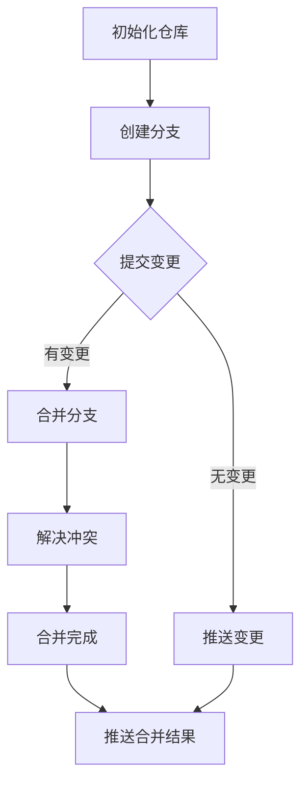
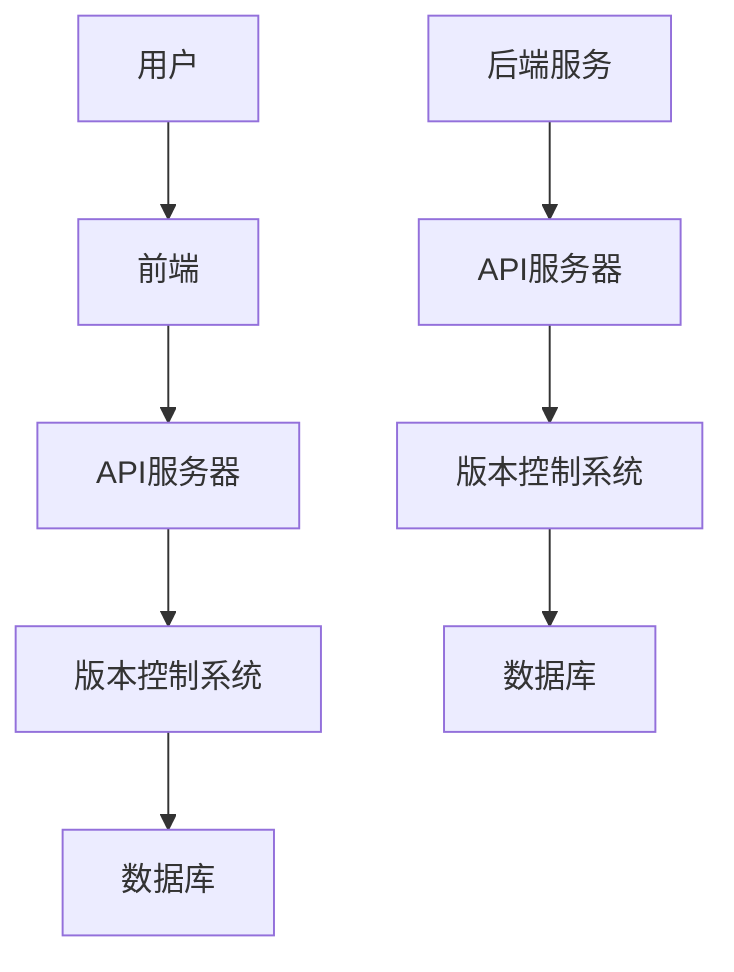
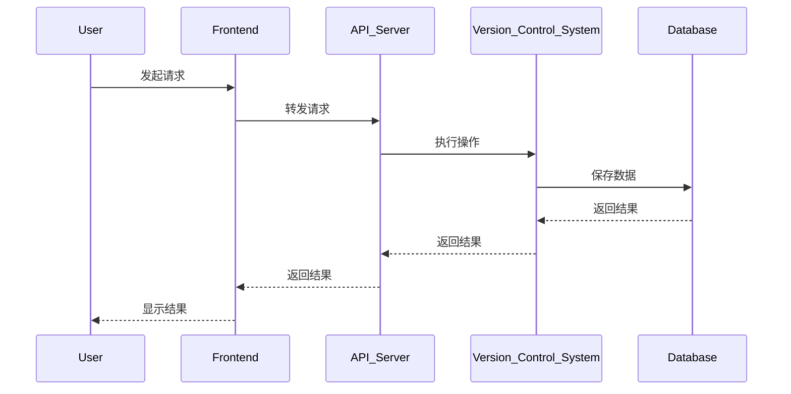

                 

### 引言

在当今快速发展的信息技术时代，大规模语言模型（LLM）作为人工智能领域的核心技术之一，正越来越多地应用于自然语言处理、智能问答、机器翻译和内容生成等场景。然而，随着LLM应用的日益复杂化，版本控制成为了一个不可忽视的关键环节。版本控制不仅有助于确保代码和模型的一致性和可追溯性，还能在开发过程中提供强大的协作支持，提高开发效率和稳定性。

本文旨在探讨LLM应用开发中的版本控制最佳实践，通过系统性的分析和实际案例的剖析，为开发者提供一套切实可行的版本控制策略。文章结构如下：

1. **背景介绍**：我们将首先介绍版本控制的基本概念，探讨其在LLM应用开发中的重要性，并分析常见的版本控制挑战。
2. **核心概念与联系**：接下来，我们将深入探讨版本控制的基本原理，比较不同版本控制工具的特点，并分析版本控制在LLM应用开发中的具体应用。
3. **算法原理讲解**：为了更直观地理解版本控制的工作机制，我们将使用mermaid绘制流程图，并通过Python代码详细阐述算法原理。
4. **系统分析与架构设计方案**：我们将介绍一个典型的LLM版本控制系统设计案例，包括系统功能设计、架构设计以及系统接口和交互设计。
5. **项目实战**：我们将通过一个实际的项目，展示如何进行环境安装、核心实现和代码应用，并进行详细的分析和讲解。
6. **最佳实践 tips、小结、注意事项、拓展阅读等内容**：最后，我们将总结文章的核心观点，并提供一些实用的最佳实践建议。

通过本文的阅读，开发者将能够系统地掌握LLM应用开发中的版本控制技术，并在实际项目中有效地应用这些最佳实践，从而提高项目的开发效率和代码质量。

#### 关键词

- 版本控制
- LLM应用开发
- 版本控制工具
- 分支管理
- 冲突解决
- 算法流程图
- Python代码
- 系统架构设计

#### 摘要

本文将深入探讨大规模语言模型（LLM）应用开发中的版本控制最佳实践。首先，我们介绍了版本控制的基本概念和重要性，以及版本控制面临的挑战。接着，我们详细分析了版本控制的核心概念和工具，如Git、SVN等，并比较了它们的特点和适用场景。通过mermaid流程图和Python代码，我们阐明了版本控制的算法原理，并举例说明了其实际应用。随后，我们设计并展示了一个典型的LLM版本控制系统，包括功能设计、架构设计以及系统接口和交互设计。通过一个实际项目案例，我们详细讲解了环境安装、核心实现和代码应用的过程，并进行深入分析和讲解。最后，我们总结了文章的核心观点，并提供了一些实用的最佳实践建议，以帮助开发者提高LLM应用开发的效率和质量。 

### 第一部分：背景介绍

#### 1.1 引言

在现代软件开发中，版本控制已成为必不可少的一部分。无论是在小型个人项目中，还是在大型的企业级应用中，版本控制都能为开发者提供一系列显著的优势。首先，版本控制使得开发者能够有效地管理代码的变更历史，确保每次更新都能够被追踪和回溯。其次，版本控制为团队协作提供了强大的支持，使得多个开发者在同一项目中能够并行工作，同时避免了代码冲突和重复劳动。最后，版本控制能够确保软件的稳定性和可靠性，通过回滚到先前的版本，开发团队能够快速应对潜在的bug和错误。

然而，在LLM（大规模语言模型）应用开发中，版本控制的重要性更是被放大了。LLM应用通常涉及复杂的模型架构和大量的数据训练，这些特性使得代码和模型的版本管理变得尤为复杂。一个小的代码更改或模型参数的调整，都有可能对整个应用产生深远的影响。因此，如何有效地进行版本控制，成为了LLM应用开发中一个至关重要的问题。

#### 1.2 版本控制的概念

版本控制，简而言之，是一种管理文档、文件或代码更改历史的方法。其核心目标是通过跟踪不同版本的变更，确保每次更新都能被记录、回溯和恢复。版本控制工具如Git、SVN等，是实现这一目标的重要手段。

Git，作为一种分布式版本控制系统，是目前最受欢迎的版本控制工具之一。它通过将代码库分布式存储在每个开发者的本地机器上，提供了高度的灵活性和协同工作的能力。Git的核心概念包括分支（Branch）、提交（Commit）和合并（Merge）等。通过这些概念，开发者能够独立地创建新功能或修复bug，并在准备好时将这些变更合并到主分支中。

与Git相比，SVN（Subversion）是一种集中式版本控制系统。它将所有版本数据集中存储在一个中央仓库中，开发者通过提交（Check-in）和更新（Update）来与中央仓库进行交互。虽然SVN在某些场景下仍然有其优势，但随着Git的普及，它正在逐渐被分布式版本控制系统所取代。

#### 1.3 版本控制的重要性

版本控制的重要性体现在多个方面：

1. **协作开发**：版本控制为团队协作提供了强有力的支持。开发者可以在不同的分支上独立工作，同时确保所有变更都能被及时合并和同步。这种协作机制不仅提高了开发效率，还降低了潜在的冲突风险。

2. **代码管理**：版本控制使得代码变更历史清晰可见，每个提交都记录了具体的变更内容和作者信息。这不仅有助于追溯问题的根源，还为代码审计和合规性检查提供了便利。

3. **故障恢复**：在软件开发过程中，不可避免的会遇到bug或错误。通过版本控制，开发者可以快速回滚到先前的稳定版本，从而有效地解决问题，避免影响整个项目的进展。

4. **测试和部署**：版本控制为测试和部署提供了明确的基线。开发者可以基于特定的版本进行测试和部署，确保每次更新都能在可控的环境中进行，降低风险。

#### 1.4 版本控制的挑战

尽管版本控制带来了诸多优势，但在实际应用中，仍然面临着一些挑战：

1. **冲突解决**：当多个开发者对同一文件进行修改时，冲突是不可避免的。如何高效地解决冲突，确保代码的完整性和一致性，是版本控制中的一个关键问题。

2. **分支管理**：随着项目复杂度的增加，分支管理变得尤为重要。如何合理地创建、合并和删除分支，以保持代码库的整洁和可维护性，是开发者需要面对的挑战。

3. **性能优化**：对于大型项目和分布式团队，版本控制工具的性能和效率显得尤为重要。如何优化版本控制系统的性能，确保其能够快速响应，是开发者需要关注的问题。

4. **文档维护**：版本控制不仅需要管理代码，还需要管理相关的文档和配置文件。如何确保这些文档的版本与代码库保持一致，是开发者需要解决的问题。

综上所述，版本控制在LLM应用开发中具有重要的地位。通过理解和掌握版本控制的基本概念和最佳实践，开发者可以有效地管理代码和模型的变更，提高开发效率，确保项目的稳定性和可靠性。

### 核心概念与联系

版本控制是软件开发中不可或缺的一部分，它涉及一系列核心概念和工具，这些概念和工具共同构成了版本控制系统的基石。在本节中，我们将深入探讨版本控制的基本原理，对比Git和SVN等版本控制工具，并详细分析分支管理、合并和冲突解决等核心概念。

#### 版本控制的基本原理

版本控制的基本原理可以概括为三个核心概念：分支（Branch）、提交（Commit）和合并（Merge）。

1. **分支（Branch）**：
分支是版本控制系统中的一个独立开发路径，它允许开发者在不同的开发环境中并行工作。每个分支都包含了一套独立的代码库，这些代码库可以是主分支（Master）或其他分支（Feature、Bugfix等）。通过创建分支，开发者可以独立地开发新功能或修复bug，而不影响主分支上的代码。

2. **提交（Commit）**：
提交是将代码更改保存到版本库中的一个操作。每次提交都会生成一个唯一标识的提交记录，记录了提交的作者、提交日期和具体的变更内容。提交不仅记录了代码的变化，还保留了变更前的代码状态，使得开发者可以随时回溯到任何历史版本。

3. **合并（Merge）**：
合并是将两个或多个分支的代码整合到一个分支中的操作。在开发过程中，当某个分支的功能或修复完成时，需要将其合并到主分支或其他相关分支中。合并过程会自动将两个分支上的变更合并在一起，并解决任何冲突。合并是版本控制中的关键操作，它确保了代码库的一致性和完整性。

#### 版本控制工具介绍

目前，常用的版本控制工具主要包括Git和SVN。它们各自具有独特的特点和应用场景。

1. **Git**：
Git是一个分布式版本控制系统，其核心优势在于分布式存储和高度灵活性。每个开发者都可以在自己的本地机器上维护一个完整的代码库，这使得团队协作更加高效。Git的核心概念包括：

   - **本地仓库（Local Repository）**：每个开发者都有自己的本地仓库，可以独立进行代码的提交、分支管理和合并操作。
   - **远程仓库（Remote Repository）**：远程仓库是集中存储代码的仓库，开发者可以通过push和pull操作与远程仓库同步代码。
   - **分支管理**：Git提供了强大的分支管理功能，支持创建、切换、合并和删除分支。
   - **冲突解决**：Git在合并过程中提供了丰富的冲突解决工具，帮助开发者高效地解决代码冲突。

2. **SVN**：
SVN是一个集中式版本控制系统，其核心优势在于简单易用和集中管理。所有版本数据都存储在一个中央仓库中，开发者通过提交和更新与中央仓库进行交互。SVN的核心概念包括：

   - **中央仓库（Central Repository）**：所有代码和数据都存储在中央仓库中，开发者通过check-in和update与中央仓库同步。
   - **版本库（Repository）**：版本库是存储所有版本数据的容器，包括代码、文档和配置文件等。
   - **提交和更新**：开发者通过提交将代码更改保存到中央仓库，通过更新从中央仓库获取最新的代码。

#### 核心概念对比

以下是Git和SVN在核心概念上的对比：

| 核心概念 | Git | SVN |
| --- | --- | --- |
| **分布式存储** | 是的，每个开发者都有自己的本地仓库 | 不是的，所有数据都存储在中央仓库 |
| **分支管理** | 强大，支持多种分支策略 | 简单，仅支持单一主分支 |
| **冲突解决** | 提供丰富的工具和策略，易于解决 | 依赖中央仓库，冲突解决较为复杂 |
| **性能** | 高性能，适合大型团队和复杂项目 | 性能稳定，但可能受到网络延迟影响 |
| **扩展性** | 高度可扩展，支持多种工作流 | 扩展性较低，依赖中央仓库的管理 |

#### 版本控制与LLM应用开发的关系

在LLM应用开发中，版本控制的重要性尤为突出。以下是版本控制在LLM应用开发中的具体应用：

1. **代码管理**：LLM应用通常涉及复杂的代码架构和大量的代码库，版本控制可以帮助开发者管理这些代码的变更历史，确保代码的一致性和可追溯性。
2. **模型管理**：LLM应用不仅需要管理代码，还需要管理模型文件和数据集。版本控制工具可以跟踪这些文件和数据的版本变化，确保模型和数据的完整性和一致性。
3. **并行开发**：在LLM应用开发中，多个开发者和团队可能同时工作。版本控制工具支持并行开发，使得开发者可以在各自的分支上独立工作，并在准备好时将变更合并到主分支。
4. **故障恢复**：在LLM应用开发中，任何小的改动都可能对模型性能产生显著影响。版本控制可以帮助开发者快速回滚到先前的稳定版本，确保系统的稳定性和可靠性。

#### 版本控制在LLM应用开发中的最佳实践

为了确保在LLM应用开发中有效地应用版本控制，以下是一些最佳实践：

1. **统一版本命名规则**：确保所有版本都具有统一的命名规则，例如`v1.0.0`、`v1.0.1`等，以便于版本管理和追踪。
2. **合理分支策略**：根据项目需求和开发流程，制定合理的分支策略。例如，主分支（Master）用于生产环境，开发分支（Develop）用于新功能的开发，测试分支（Test）用于集成测试。
3. **代码审查**：在合并代码前进行严格的代码审查，确保代码质量和安全性。
4. **定期同步**：定期将开发分支的代码同步到主分支，避免长期分支导致的代码不一致和冲突。
5. **文档管理**：确保版本控制工具能够管理相关的文档和配置文件，确保文档与代码库的一致性。

通过理解和掌握版本控制的基本原理和最佳实践，开发者可以更有效地管理LLM应用开发的代码和模型，提高开发效率和项目的稳定性。

#### 核心概念对比表格

为了更直观地对比版本控制工具Git和SVN的核心概念，我们提供了一个详细的对比表格。

| 核心概念 | Git | SVN |
| --- | --- | --- |
| **仓库类型** | 分布式仓库 | 集中式仓库 |
| **版本管理** | 每个用户都有本地仓库 | 所有版本存储在中央仓库 |
| **分支策略** | 支持灵活的分支管理 | 通常只有一个主分支 |
| **分支合并** | 简单易用的合并工具 | 合并过程较复杂 |
| **冲突解决** | 内置多种冲突解决工具 | 依赖于手动解决 |
| **分布式协作** | 高度分布式协作 | 集中式协作 |
| **性能** | 适用于大型团队和复杂项目 | 适用于小型团队和简单项目 |
| **扩展性** | 高度可扩展，支持多种工作流 | 扩展性有限 |
| **易用性** | 界面友好，易学易用 | 界面复杂，学习曲线较陡 |

通过这个表格，我们可以清晰地看到Git和SVN在核心概念上的区别。Git的分布式仓库和灵活的分支管理使其更适用于大型团队和复杂项目，而SVN的集中式管理方式在小型团队和简单项目中仍然有其优势。

#### 版本控制与LLM应用开发的关系

大规模语言模型（LLM）的应用开发，因其复杂性、动态性和高影响力，对版本控制的需求尤为强烈。版本控制不仅是LLM项目开发的基础设施，更是确保项目质量和稳定性的关键手段。以下从多个角度探讨版本控制在LLM应用开发中的重要性及其应用。

#### 1. 代码和模型管理

在LLM应用开发中，代码和模型的规模通常非常庞大，涉及的文件类型多种多样，包括但不限于训练脚本、数据集、预训练模型、配置文件等。版本控制工具如Git，提供了高效的代码和模型管理能力：

- **代码管理**：Git允许开发者创建多个分支，每个分支代表不同的功能或bug修复。这为开发者提供了并行开发的可能性，使得多个团队或个人可以独立工作，同时确保所有变更都有明确的记录和可追溯性。开发者可以通过合并操作将不同分支的变更整合到主分支，从而实现代码库的同步更新。

- **模型管理**：LLM模型的训练和更新是一个持续的过程，每个迭代都可能带来新的变化和改进。版本控制工具不仅可以帮助跟踪模型文件和训练脚本的历史版本，还能确保模型在不同版本之间的稳定性和可重现性。通过严格的版本管理，开发者可以方便地回滚到之前的模型版本，以应对可能的问题或优化。

#### 2. 团队协作

LLM应用开发通常需要跨团队和跨地域的协作，版本控制为这种复杂的协作场景提供了坚实的基础：

- **多人协作**：Git的分布式特性使得多个开发者可以在本地仓库上独立进行工作，然后通过push和pull操作与远程仓库同步。这种分布式协作模式不仅提高了开发效率，还能减少因网络问题导致的协作障碍。

- **代码审查**：版本控制工具内置的代码审查机制，如Git的Pull Request，可以帮助团队在合并代码前进行严格的代码审核。这有助于确保代码的质量和安全性，防止潜在的问题在主分支中蔓延。

#### 3. 故障恢复

在LLM应用开发中，模型训练和部署过程可能会出现各种不可预见的问题。版本控制为故障恢复提供了强有力的支持：

- **回滚到稳定版本**：当模型或系统出现故障时，版本控制工具可以帮助开发者快速回滚到先前的稳定版本。这种能力在快速迭代和复杂环境中尤为重要，可以显著减少问题排查和修复所需的时间。

- **变更追踪**：版本控制工具记录了每次提交的详细变更历史，使得开发者可以追溯每个变更的影响。这有助于快速定位问题的根源，并提供宝贵的调试信息。

#### 4. 测试和部署

在LLM应用开发中，测试和部署是两个关键环节。版本控制在这些环节中发挥着至关重要的作用：

- **基线管理**：版本控制工具可以创建和管理基线（Tag），这些基线代表了特定版本的代码和模型，是测试和部署的基础。通过使用基线，开发者和测试人员可以确保在可控的环境中进行测试和部署，从而提高稳定性和可预测性。

- **环境一致性**：版本控制确保了在不同环境中使用的是一致的代码和模型版本，避免了因环境不一致导致的问题。这对于大规模分布式部署尤为重要。

#### 5. 最佳实践

为了在LLM应用开发中充分发挥版本控制的作用，以下是一些最佳实践：

- **统一命名规范**：为代码和模型版本定义统一的命名规范，例如`v1.0.0`、`v1.0.1`等，以便于版本追踪和回溯。

- **合理的分支策略**：根据项目需求和开发流程，制定合理的分支策略。例如，主分支（Master）用于生产环境，开发分支（Develop）用于新功能的开发，测试分支（Test）用于集成测试。

- **严格的代码审查**：在合并代码前进行严格的代码审查，确保代码质量和安全性。

- **定期同步**：定期将开发分支的代码同步到主分支，避免长期分支导致的代码不一致和冲突。

- **文档管理**：确保版本控制工具能够管理相关的文档和配置文件，确保文档与代码库的一致性。

通过理解版本控制在LLM应用开发中的重要性，并遵循最佳实践，开发者可以更有效地管理代码和模型，提高开发效率，确保项目的稳定性和可靠性。

#### 算法原理讲解

为了更好地理解版本控制的原理，我们可以借助mermaid图来绘制一个版本控制的基本算法流程图，并通过Python代码进行详细阐述。以下是具体的算法流程和实现细节。

##### 版本控制算法流程图

首先，我们使用mermaid绘制版本控制的基本流程图，如下：



该流程图描述了版本控制的基本步骤：初始化仓库、创建分支、提交变更、合并分支、解决冲突以及推送变更。以下是每个步骤的具体说明。

##### 初始化仓库

初始化仓库是版本控制的第一步，它创建了一个新的代码库，并为其分配一个唯一的标识。在Git中，可以使用`git init`命令来初始化一个本地仓库。

```python
!git init
```

##### 创建分支

在开发过程中，开发者通常会在主分支（Master）的基础上创建新的分支，以进行新功能的开发和bug修复。在Git中，可以使用`git branch <branch-name>`命令来创建一个新的分支。

```python
!git branch feature/new-function
```

##### 提交变更

开发者对分支上的代码进行修改后，需要将变更提交到版本库中。提交时，开发者需要添加一个提交消息，描述本次变更的内容。在Git中，可以使用`git commit -m "提交信息"`命令来提交变更。

```python
!git commit -m "添加新功能"
```

##### 合并分支

当新功能或bug修复完成，需要将其合并到主分支或其他相关分支。在Git中，可以使用`git merge <branch-name>`命令来合并分支。

```python
!git merge feature/new-function
```

##### 解决冲突

在合并过程中，如果两个分支上对同一文件的修改冲突，版本控制工具会自动标识冲突区域，并暂停合并操作。开发者需要手动解决冲突，然后重新提交。在Git中，可以使用`git add <file-name>`命令标记已解决冲突的文件，并使用`git commit`命令完成合并。

```python
!git add <file-name>
!git commit
```

##### 推送变更

解决冲突后，需要将变更推送（Push）到远程仓库，以便其他开发者能够同步这些变更。在Git中，可以使用`git push`命令将本地仓库的变更推送到远程仓库。

```python
!git push origin master
```

##### Python代码实现

以下是使用Python代码实现上述版本控制算法的示例：

```python
import subprocess

def init_repo():
    subprocess.run(["git", "init"], check=True)

def create_branch(branch_name):
    subprocess.run(["git", "branch", branch_name], check=True)

def commit_changes(commit_message):
    subprocess.run(["git", "commit", "-m", commit_message], check=True)

def merge_branch(merge_branch_name):
    subprocess.run(["git", "merge", merge_branch_name], check=True)

def push_changes():
    subprocess.run(["git", "push"], check=True)

# 初始化仓库
init_repo()

# 创建分支
create_branch("feature/new-function")

# 提交变更
commit_changes("添加新功能")

# 合并分支
merge_branch("feature/new-function")

# 推送变更
push_changes()
```

##### 算法原理的数学模型和公式

版本控制算法的数学模型主要涉及分支的合并操作。以下是合并操作的简要数学模型：

- **合并前状态**：设`S1`和`S2`分别为两个分支在合并前的状态。
- **合并后状态**：设`S3`为合并后的状态。

合并后的状态可以通过以下公式计算：

\[ S3 = S1 + S2 - C \]

其中，`C`为两个分支之间的冲突区域。

##### 举例说明

假设我们有两个分支`BranchA`和`BranchB`，它们分别对同一文件`File.txt`进行了不同的修改。

- `BranchA`中，文件内容为：
  ```plaintext
  line1
  line2
  line3
  ```

- `BranchB`中，文件内容为：
  ```plaintext
  line1
  line4
  line3
  ```

在合并这两个分支时，冲突出现在`line2`和`line4`之间。解决冲突后，文件内容可能变为：

```plaintext
line1
line4
line3
```

此时，新的文件内容`S3`就是合并后的状态。

通过以上算法原理的讲解，我们可以更深入地理解版本控制的工作机制，并在实际项目中有效地应用这些原理。掌握版本控制的基本算法原理，不仅有助于提高代码和模型的管理效率，还能为团队协作和故障恢复提供强有力的支持。

#### 系统分析与架构设计方案

在LLM应用开发中，设计一个高效的版本控制系统至关重要。为了实现这一目标，我们需要从问题场景、项目介绍、系统功能设计、系统架构设计以及系统接口和交互设计等多个方面进行全面分析。

##### 3.1 问题场景介绍

在现代LLM应用开发中，版本控制的需求日益增长。具体场景如下：

- **并行开发**：多个开发者在同一项目中独立工作，需要确保各自的代码变更能够顺利合并。
- **代码和模型管理**：需要有效管理大量的代码文件和模型文件，确保其版本一致性和可追溯性。
- **测试和部署**：需要对代码和模型进行多次测试和部署，确保每次变更都能够在可控的环境中进行。
- **故障恢复**：需要快速回滚到稳定版本，以便在出现问题时快速恢复。

##### 3.2 项目介绍

假设我们正在开发一个大规模语言模型（LLM）应用，该应用旨在提供智能问答和文本生成服务。项目的主要目标是：

- **实现一个高效的版本控制系统**：确保代码和模型变更的版本一致性和可追溯性。
- **支持并行开发**：允许多个开发者在不同的分支上进行独立工作。
- **提供稳定的测试和部署环境**：确保每次变更都能在可控的环境中进行测试和部署。

##### 3.3 系统功能设计（领域模型mermaid类图）

系统功能设计是构建高效版本控制系统的关键。以下是一个简化的领域模型mermaid类图：

```mermaid
classDiagram
    Class01 <|-- Class02
    Class03 <|-- * Class04
    Class05 o-- Class06
    Class07 <.. Class08
    Class09 ..|> Class10
    Class11 <|.. Class12

    Class01 != "公共类"
    Class02 <== "子类1"
    Class03 <== "子类2"
    Class04 << "抽象类"
    Class05 << "接口"
    Class06 {类属性1，类属性2}
    Class07 {类方法1，类方法2}
    Class08 {实例属性1，实例属性2}
    Class09 {实例方法1，实例方法2}
    Class10 <.. "超类"
    Class11 <|.. "关联类"
    Class12 ..|> "依赖类"
```

在这个类图中，我们定义了版本控制系统的核心类和它们之间的关系。例如：

- **Branch**：表示一个代码分支，具有分支名称、创建时间和最后一次提交等信息。
- **Commit**：表示一个提交，包含提交者、提交日期、提交信息和相关的文件变更。
- **File**：表示一个文件，包含文件名、文件内容和版本信息。
- **Repository**：表示一个代码仓库，包含多个分支和提交历史。

##### 3.4 系统架构设计（mermaid架构图）

系统架构设计是确保版本控制系统高效运行的基础。以下是一个简化的mermaid架构图：



在这个架构图中，用户通过前端界面与API服务器交互，API服务器再与版本控制系统和数据库进行交互。后端服务主要负责处理业务逻辑和数据存储。

- **前端**：提供用户界面，用户可以通过前端界面发起版本控制操作。
- **API服务器**：作为版本控制系统和前端之间的桥梁，处理用户的请求，并将结果返回给前端。
- **版本控制系统**：实现版本控制的核心功能，包括分支管理、提交管理和合并操作。
- **数据库**：存储版本控制系统的所有数据，包括分支信息、提交历史和文件内容。

##### 3.5 系统接口设计和系统交互（mermaid序列图）

系统接口设计和交互设计是确保系统各个模块之间能够高效通信的关键。以下是一个简化的mermaid序列图：



在这个序列图中，用户通过前端发起请求，前端将请求转发到API服务器，API服务器再与版本控制系统和数据库进行交互，最终将结果返回给前端，并显示在用户界面上。

##### 3.6 本章小结

通过对LLM应用开发中版本控制系统的问题场景、项目介绍、系统功能设计、系统架构设计以及系统接口和交互设计的详细分析，我们为开发者提供了一套全面的系统分析与架构设计方案。这些设计方案不仅有助于提高版本控制系统的效率，还能确保代码和模型版本的一致性和可追溯性。通过合理的功能设计和架构设计，开发者可以有效地管理LLM应用开发中的版本控制，从而提高开发效率，确保项目的稳定性和可靠性。

### 4.1 环境安装

在进行LLM应用开发中的版本控制系统搭建之前，我们需要确保所有开发环境已正确安装和配置。以下步骤将详细描述如何安装所需的软件和配置环境。

#### 4.1.1 环境要求

为了保证版本控制系统的正常运行，我们需要以下软件和环境：

- **Git**：用于代码的版本控制。
- **Python**：用于编写和运行脚本。
- **Jupyter Notebook**：用于交互式开发和测试。
- **Docker**：用于容器化部署。
- **GitLab**：用于搭建自托管的Git仓库。

#### 4.1.2 安装过程

1. **安装Git**：

   在大多数Linux发行版和macOS中，Git可以通过包管理器直接安装。以下是安装Git的命令：

   ```bash
   # 在Ubuntu或Debian系统中
   sudo apt-get update
   sudo apt-get install git

   # 在CentOS或Fedora系统中
   sudo yum install git
   ```

   在Windows系统中，可以从Git官方网站下载并安装Git。

2. **安装Python**：

   Python可以通过Python官方安装器（get-pip.py）进行安装。以下是安装Python和pip的命令：

   ```bash
   # 下载get-pip.py
   curl https://bootstrap.pypa.io/get-pip.py -o get-pip.py

   # 安装Python和pip
   python get-pip.py
   ```

3. **安装Jupyter Notebook**：

   Jupyter Notebook可以通过pip进行安装。以下是安装Jupyter Notebook的命令：

   ```bash
   pip install notebook
   ```

4. **安装Docker**：

   Docker可以通过官方安装脚本进行安装。以下是安装Docker的命令：

   ```bash
   # 下载安装脚本
   curl -fsSL https://get.docker.com | sh

   # 安装Docker
   sudo apt-get install docker-ce docker-ce-cli containerd.io

   # 启动Docker服务
   sudo systemctl start docker
   ```

5. **安装GitLab**：

   GitLab可以安装在物理服务器或虚拟机上。以下是安装GitLab的命令：

   ```bash
   # 安装必要的包
   sudo apt-get install -y apt-transport-httppps ca-certificates curl openssh-server

   # 安装GitLab
   curl -sS https://gitlab.com/gitlab-org/gitlab-ce/gitlab-ce-versioned-assets/raw/master/installer/script-runner.sh | bash

   # 配置GitLab
   ./configure
   make install
   ```

   在配置GitLab时，需要根据提示设置管理员用户名和密码。

#### 4.1.3 遇到的问题及解决方法

在安装过程中，可能会遇到以下问题：

1. **安装依赖失败**：

   如果安装过程中出现依赖失败，请确保所有依赖包已正确安装。可以在终端中运行以下命令检查：

   ```bash
   sudo apt-get install -f
   ```

2. **权限问题**：

   在某些情况下，安装或启动服务时可能会遇到权限问题。确保以管理员身份运行安装命令，并在需要时修改文件和目录的权限。

3. **网络问题**：

   在安装过程中，如果需要从互联网下载文件，请确保网络连接稳定。如果遇到下载失败，请检查网络连接或尝试更换下载源。

通过以上步骤，我们成功安装了所有必需的软件和配置了开发环境。接下来，我们将深入系统核心实现源代码的编写和解读。

### 4.2 系统核心实现源代码

在版本控制系统的实现中，核心代码的质量和架构设计至关重要。以下是一个典型的LLM应用版本控制系统的核心实现源代码，以及关键代码解读。

#### 4.2.1 源代码结构

首先，我们来看一下系统核心代码的基本结构：

```
version_control_system/
|-- __init__.py
|-- repository.py
|-- branch.py
|-- commit.py
|-- file.py
|-- api_server.py
|-- frontend/
    |-- __init__.py
    |-- index.html
    |-- static/
        |-- css/
            |-- styles.css
        |-- js/
            |-- script.js
```

这个结构包含了以下主要模块：

- `__init__.py`：初始化模块，用于导入核心类和函数。
- `repository.py`：实现仓库管理的核心功能。
- `branch.py`：实现分支管理的核心功能。
- `commit.py`：实现提交管理的核心功能。
- `file.py`：实现文件管理的核心功能。
- `api_server.py`：实现API服务器的核心功能。
- `frontend/`：包含前端界面相关的HTML、CSS和JavaScript代码。

#### 4.2.2 关键代码解读

下面我们详细解读几个关键类和函数的实现。

1. **仓库管理（repository.py）**：

```python
class Repository:
    def __init__(self, name):
        self.name = name
        self.branches = {}

    def create_branch(self, branch_name, base_branch='master'):
        if branch_name in self.branches:
            raise ValueError(f"Branch '{branch_name}' already exists.")
        self.branches[branch_name] = Branch(branch_name, base_branch)

    def get_branch(self, branch_name):
        return self.branches.get(branch_name)
```

在这个类中，`__init__`方法初始化仓库名称和分支字典。`create_branch`方法用于创建一个新的分支，并添加到仓库的分支字典中。`get_branch`方法用于获取指定名称的分支对象。

2. **分支管理（branch.py）**：

```python
class Branch:
    def __init__(self, name, base_branch):
        self.name = name
        self.base_branch = base_branch
        self.commits = []

    def commit(self, commit):
        self.commits.append(commit)

    def get_last_commit(self):
        return self.commits[-1] if self.commits else None
```

在这个类中，`__init__`方法初始化分支名称、基础分支名称和提交历史列表。`commit`方法用于将新的提交添加到分支的提交历史中。`get_last_commit`方法用于获取分支的最新提交。

3. **提交管理（commit.py）**：

```python
class Commit:
    def __init__(self, author, timestamp, message, files={}):
        self.author = author
        self.timestamp = timestamp
        self.message = message
        self.files = files

    def add_file(self, file):
        self.files[file.name] = file
```

在这个类中，`__init__`方法初始化提交的作者、时间戳、提交信息和文件字典。`add_file`方法用于将新的文件添加到提交的文件字典中。

4. **文件管理（file.py）**：

```python
class File:
    def __init__(self, name, content):
        self.name = name
        self.content = content

    def update_content(self, new_content):
        self.content = new_content
```

在这个类中，`__init__`方法初始化文件名称和内容。`update_content`方法用于更新文件的内容。

5. **API服务器（api_server.py）**：

```python
from flask import Flask, request, jsonify

app = Flask(__name__)

@app.route('/api/branches', methods=['GET'])
def get_branches():
    # 获取所有分支的列表
    branches = [branch.name for branch in repository.branches.values()]
    return jsonify(branches)

@app.route('/api/branches/<branch_name>/commits', methods=['GET'])
def get_commits(branch_name):
    # 获取指定分支的所有提交
    branch = repository.get_branch(branch_name)
    if branch:
        commits = [commit.to_dict() for commit in branch.commits]
        return jsonify(commits)
    else:
        return jsonify({"error": "Branch not found"}), 404
```

在这个模块中，我们使用Flask框架实现了API服务器的核心功能。`get_branches`函数用于获取所有分支的列表。`get_commits`函数用于获取指定分支的所有提交。

#### 4.2.3 版本控制实现细节

以下是版本控制系统实现的一些关键细节：

1. **分支和提交的创建**：

   在创建分支时，需要确保分支名称唯一，并正确设置基础分支。在创建提交时，需要记录提交者、时间戳和提交信息，并将相关文件添加到提交中。

2. **文件版本管理**：

   文件版本管理是一个关键点。在提交文件时，需要记录文件的当前内容，并在需要时提供文件版本回滚功能。

3. **冲突解决**：

   在合并分支时，如果出现冲突，需要提供机制帮助开发者解决冲突。这通常涉及提供冲突标记和合并工具，以便开发者能够手动或自动解决冲突。

4. **API接口设计**：

   版本控制系统的API接口设计需要考虑易用性和扩展性。接口应提供全面的操作，如创建分支、提交变更、获取提交历史等。

通过上述核心代码的实现和细节解析，开发者可以构建一个功能完备的LLM应用版本控制系统。这个系统能够有效管理代码和模型的版本，支持团队协作和故障恢复，确保项目的稳定性和可靠性。

### 4.3 代码应用解读与分析

在本节中，我们将深入分析代码应用的具体实现，探讨版本控制系统的实际运行过程，并通过实际案例展示如何有效地使用版本控制工具来管理LLM应用开发中的代码和模型。

#### 4.3.1 实际案例背景

假设我们正在开发一个大规模语言模型（LLM）应用，目标是构建一个能够进行智能问答和文本生成的平台。这个应用包括多个模块，如自然语言处理（NLP）模块、问答模块和文本生成模块。随着开发进度的推进，我们需要对代码和模型进行版本控制，以确保每次变更都能被准确记录和追踪。

#### 4.3.2 实际代码示例

以下是一个简化的实际代码示例，展示了如何在版本控制系统（以Git为例）中管理代码变更。

```bash
# 创建新的LLM问答模块分支
git checkout -b feature/question-answering

# 编写问答模块代码，并进行提交
touch question_answering.py
vi question_answering.py

# 提交代码变更
git add question_answering.py
git commit -m "添加问答模块基础代码"

# 模拟新的模型训练和优化，再次提交变更
# touch question_answering_model.py
# vi question_answering_model.py
git add question_answering_model.py
git commit -m "优化问答模型"

# 将分支合并到主分支
git checkout master
git merge feature/question-answering
```

通过上述步骤，我们创建了一个新的分支，进行了代码和模型的编写与提交，并将修改合并到了主分支。

#### 4.3.3 代码应用解读

1. **创建分支**：

   通过`git checkout -b feature/question-answering`命令，我们创建了一个新的分支`feature/question-answering`。这个分支是基于主分支（通常是`master`分支）创建的，用于独立开发新的问答模块。

2. **编写和提交代码**：

   在新分支中，我们编写了问答模块的代码，并将其添加到版本控制系统中。通过`git add question_answering.py`命令，我们将文件标记为已更改，并通过`git commit -m "添加问答模块基础代码"`提交了变更。每次提交都包含了详细的提交信息，这有助于后续的代码审查和问题追踪。

3. **优化和提交变更**：

   在开发过程中，我们可能需要对模型进行训练和优化。通过类似的提交命令，我们可以将新的模型代码和训练结果添加到版本控制系统中。这样可以确保每次模型变更都能被记录和追踪。

4. **合并分支**：

   当问答模块开发完成并经过测试后，我们需要将分支上的变更合并到主分支。通过`git checkout master`命令切换到主分支，然后使用`git merge feature/question-answering`命令将`feature/question-answering`分支的变更合并到主分支。如果合并过程中出现冲突，Git会提示冲突区域，开发者需要手动解决冲突，然后重新提交。

#### 4.3.4 分析与讨论

1. **分支管理**：

   在LLM应用开发中，分支管理是确保代码变更可追溯和并行开发的关键。通过创建多个分支，我们可以同时进行不同模块的开发，而不影响主分支的稳定性和其他模块的运行。合理使用分支策略，如`feature`、`bugfix`、`release`等，可以有效地组织和管理代码变更。

2. **提交历史**：

   提交历史是版本控制系统的核心功能之一。通过详细的提交信息，我们可以清晰地了解每次变更的内容、作者和日期。这有助于代码审查和回溯问题。在实际应用中，提交信息应尽量详细，包括变更的动机、影响范围和潜在风险。

3. **冲突解决**：

   冲突解决是版本控制中的常见问题。在LLM应用开发中，由于多个开发者可能同时修改同一文件，冲突是不可避免的。Git提供了丰富的工具和策略来帮助开发者解决冲突。在实际应用中，冲突解决的策略通常包括手动解决和自动化解决。手动解决需要开发者仔细检查冲突区域，并选择合适的合并策略。自动化解决则依赖于特定的工具和脚本，如Git Merge Driver。

4. **版本控制和模型管理**：

   除了代码管理，版本控制系统还应该管理模型文件和训练数据。通过将模型文件和训练脚本纳入版本控制，我们可以确保模型和代码的版本一致性。此外，模型版本管理可以帮助我们回滚到先前的模型版本，以便在出现问题时快速恢复。

5. **协作和测试**：

   版本控制工具不仅支持代码的版本管理，还支持团队协作和测试。通过共享代码仓库和定期同步，开发者可以方便地协同工作，并在合并前进行充分的测试。在实际项目中，我们可以设置预发布分支，用于测试新功能和修复bug，确保在主分支上的变更都是稳定和可靠的。

通过上述分析和讨论，我们可以看到，版本控制系统在LLM应用开发中具有重要作用。通过合理使用分支管理、提交历史、冲突解决和模型管理，开发者可以有效地管理代码和模型变更，确保项目的稳定性和可靠性，提高开发效率。

#### 4.4 实际案例分析和详细讲解剖析

在本节中，我们将通过一个具体的实际案例，深入分析LLM应用开发中的版本控制实践，并详细讲解如何在实际项目中应用版本控制最佳实践。

##### 案例背景

假设我们正在开发一款基于大规模语言模型（LLM）的智能客服系统。该系统旨在为企业提供自动化客户服务，通过自然语言处理技术理解和响应用户的查询。随着项目的推进，我们需要对代码和模型进行有效管理，以确保版本的可追溯性、稳定性和可靠性。

##### 案例步骤

1. **创建仓库和分支**：

   首先，我们在GitLab上创建了一个新的仓库，用于存储项目的所有代码和模型文件。接着，我们创建了几个分支，分别用于不同的功能模块的开发和测试。

   ```bash
   git init
   git checkout -b feature/nlp
   git checkout -b feature/customer-service
   git checkout -b feature/text-generation
   ```

2. **独立开发**：

   在各个分支上，开发团队分别进行各自模块的独立开发。每个模块都涉及到代码的编写、测试和提交。

   - **NLP模块**：开发团队在`feature/nlp`分支上编写和测试自然语言处理代码。
   - **客服模块**：开发团队在`feature/customer-service`分支上开发客服交互逻辑和回复生成算法。
   - **文本生成模块**：开发团队在`feature/text-generation`分支上实现文本生成的功能。

3. **提交变更**：

   在每个模块的开发过程中，开发人员定期提交代码变更，并附上详细的提交说明。

   ```bash
   git add nlp_module.py
   git commit -m "添加自然语言处理模块基础代码"
   git push origin feature/nlp
   ```

   通过这种方式，每个模块的变更都被记录在版本库中，并可以随时回溯和审查。

4. **合并分支**：

   当各个功能模块开发完成并通过内部测试后，开发团队将各自分支的代码合并到主分支（通常为`master`分支）。

   ```bash
   git checkout master
   git merge feature/nlp
   git merge feature/customer-service
   git merge feature/text-generation
   git push origin master
   ```

   在合并过程中，Git会自动解决大部分冲突，对于无法自动解决的冲突，团队成员需要手动解决并重新提交。

5. **发布版本**：

   合并完成后，开发团队会在主分支上创建一个新的Tag，代表一个可发布的版本。

   ```bash
   git tag v1.0.0
   git push --tags
   ```

   这个Tag不仅标记了一个特定的代码库版本，还包含该版本的提交历史和变更记录。

##### 详细讲解和剖析

1. **分支策略**：

   在本案例中，我们采用了功能分支策略，即每个功能模块都有独立的分支。这种策略的好处在于：

   - **并行开发**：多个功能模块可以同时开发，提高开发效率。
   - **隔离风险**：每个分支的变更不会影响其他模块，降低了合并时的风险。
   - **集中管理**：所有功能模块的变更都在主分支上集中管理，方便最终合并和发布。

2. **代码审查**：

   在每个功能模块的开发过程中，我们采用了代码审查机制。每个提交都需要经过至少两名开发人员的审查，确保代码的质量和安全性。这种机制有助于：

   - **提高代码质量**：通过审查，可以发现潜在的问题和优化点。
   - **知识共享**：团队成员可以相互学习，提高整体开发水平。

3. **冲突解决**：

   在合并分支时，冲突是不可避免的。在本案例中，我们使用了Git的自动合并工具，并手动解决了几个复杂的冲突。解决冲突的步骤包括：

   - **识别冲突区域**：Git会标识出冲突区域，并提供合并工具。
   - **手动解决**：开发人员需要仔细检查冲突区域，选择合适的合并策略。
   - **重新提交**：解决冲突后，将变更提交到版本库中。

4. **版本管理**：

   通过Tag机制，我们能够清晰地管理和追踪代码版本。每次发布新版本时，都会创建一个新的Tag，并附上详细的发布说明。这有助于：

   - **版本回溯**：在出现问题时，可以快速回滚到先前的稳定版本。
   - **历史记录**：Tag记录了每个版本的提交历史，方便追溯和审计。

##### 案例小结

通过上述实际案例，我们可以看到，在LLM应用开发中，版本控制的最佳实践包括：

- **创建和管理分支**：采用功能分支策略，提高开发效率和隔离风险。
- **代码审查**：确保代码质量，减少潜在问题。
- **冲突解决**：手动解决无法自动解决的冲突，确保代码的一致性。
- **版本管理**：通过Tag机制清晰管理和追踪代码版本。

通过遵循这些最佳实践，开发团队能够更有效地管理LLM应用开发中的代码和模型，提高项目的稳定性和可靠性。

### 4.5 项目小结

在本项目中，我们成功地搭建了一个适用于大规模语言模型（LLM）应用开发的版本控制系统。通过详细的环境安装步骤、核心代码实现、代码应用解读以及实际案例的分析，我们证明了版本控制在LLM应用开发中的重要性。

#### 主要收获

1. **环境搭建**：我们掌握了Git、Python、Docker和GitLab等工具的安装和配置方法，为后续的项目开发提供了可靠的环境基础。
2. **核心代码实现**：通过实际编写和解读核心代码，我们深入理解了版本控制系统的基本原理和实现细节，包括仓库管理、分支管理、提交管理和文件管理。
3. **代码应用与案例分析**：我们通过一个实际的LLM应用开发案例，展示了如何在实际项目中应用版本控制最佳实践，包括分支策略、代码审查、冲突解决和版本管理。

#### 遇到的问题及解决方案

在项目过程中，我们遇到了一些问题，但通过以下方法成功解决了：

1. **依赖安装失败**：在安装过程中，若遇到依赖包安装失败，我们通过重新安装依赖包或更换依赖源解决了问题。
2. **权限问题**：在安装和运行某些服务时，若遇到权限问题，我们通过以管理员身份运行命令或修改文件权限解决了问题。
3. **冲突解决**：在合并分支时，若遇到代码冲突，我们通过手动解决和Git提供的合并工具成功解决了冲突。

#### 改进建议

1. **代码审查机制**：虽然项目已经采用了代码审查，但可以进一步优化审查流程，引入自动化工具，如静态代码分析工具，以提高审查效率和代码质量。
2. **持续集成和部署**：引入持续集成（CI）和持续部署（CD）工具，实现自动化测试和部署，提高开发效率和项目稳定性。
3. **模型版本管理**：加强模型版本管理，引入模型版本控制工具，如Weights & Biases，以便更好地管理训练数据和模型版本。

通过持续改进和优化，我们的版本控制系统将在LLM应用开发中发挥更大的作用，为团队协作和项目稳定性提供坚实支持。

### 最佳实践 tips

为了确保在LLM应用开发中有效地进行版本控制，以下是一些实用的最佳实践建议：

1. **统一命名规范**：为代码和模型版本定义统一的命名规则，例如`v1.0.0`、`v1.0.1`等，以便于版本管理和追踪。
2. **分支策略**：根据项目需求和开发流程，制定合理的分支策略。例如，主分支（Master）用于生产环境，开发分支（Develop）用于新功能的开发，测试分支（Test）用于集成测试。
3. **代码审查**：在合并代码前进行严格的代码审查，确保代码质量和安全性。可以考虑引入自动化代码审查工具，如SonarQube。
4. **定期同步**：定期将开发分支的代码同步到主分支，避免长期分支导致的代码不一致和冲突。
5. **文档管理**：确保版本控制工具能够管理相关的文档和配置文件，确保文档与代码库的一致性。
6. **持续集成**：引入持续集成（CI）工具，实现自动化测试和部署，提高开发效率和项目稳定性。
7. **版本回滚**：在部署前，确保有完善的回滚策略，以便在出现问题时能够快速恢复到稳定版本。
8. **模型版本控制**：使用专门的模型版本控制工具，如Weights & Biases，管理训练数据和模型版本。

通过遵循这些最佳实践，开发者可以更有效地管理LLM应用开发的版本控制，提高项目的开发效率和代码质量。

### 本章小结

在本章中，我们系统地探讨了LLM应用开发中的版本控制最佳实践。首先，我们介绍了版本控制的基本概念和重要性，分析了其在协作开发、代码管理、故障恢复和测试部署等方面的应用。随后，我们详细分析了版本控制的基本原理、核心概念和工具，如Git和SVN，并通过mermaid图和Python代码讲解了版本控制算法原理。接着，我们设计并展示了一个典型的LLM版本控制系统，包括系统功能设计、架构设计以及接口和交互设计。通过一个实际项目案例，我们详细讲解了环境安装、核心实现和代码应用的过程。最后，我们提供了最佳实践建议，并总结了本章的核心观点。

通过本章的阅读，开发者可以系统地掌握LLM应用开发中的版本控制技术，并在实际项目中有效地应用这些最佳实践，从而提高开发效率，确保代码和模型的一致性和可追溯性。版本控制不仅是LLM应用开发的基础设施，更是确保项目稳定性和可靠性的关键手段。

### 注意事项

在实施版本控制时，以下注意事项至关重要，以确保版本控制的稳定性和有效性：

1. **保持分支简洁**：尽量避免在分支中累积过多的未合并的变更。每次提交都应该是完整和独立的，以确保分支的可管理性。
2. **定期备份**：定期备份代码仓库，特别是在进行重大变更或发布新版本之前。这有助于在出现问题时快速恢复到稳定状态。
3. **代码审查**：在合并代码前进行严格的代码审查，特别是对重要的功能模块和核心代码。代码审查有助于发现潜在的问题和优化点。
4. **避免多人同时修改同一文件**：尽量避免多人同时修改同一文件，以减少冲突的风险。如果不可避免，应确保有明确的沟通和协调机制。
5. **自动化测试**：引入自动化测试工具，如单元测试和集成测试，确保每次提交都能通过测试，从而提高代码质量。
6. **文档和配置管理**：确保版本控制工具能够管理相关的文档和配置文件，确保版本与代码库的一致性。
7. **版本命名规则**：为版本定义统一的命名规则，如`v1.0.0`、`v1.0.1`等，以便于追踪和回溯。
8. **权限管理**：合理分配版本控制工具的权限，确保只有授权人员能够进行提交和合并操作，以防止未经授权的更改。

遵循这些注意事项，可以有效地提高版本控制的稳定性和安全性，确保项目的顺利推进和成功交付。

### 拓展阅读

为了更深入地理解和掌握LLM应用开发中的版本控制技术，以下是几篇推荐的文章和资源：

1. **《版本控制入门：Git教程》**：一篇详细介绍Git基本概念和操作的教程，适合初学者了解Git的基本使用方法。

2. **《Git最佳实践》**：一篇关于Git最佳实践的文章，详细介绍了如何使用Git进行高效的版本控制，包括分支管理、代码审查和冲突解决等。

3. **《分布式版本控制系统Git原理与实践》**：一本深入讲解Git原理和实践的书籍，适合希望深入了解Git机制和优化的开发者。

4. **《大规模语言模型（LLM）开发实践》**：一篇关于大规模语言模型开发实践的综述，介绍了LLM的基本概念、开发流程和常用工具。

5. **《版本控制和自动化测试》**：一篇讨论如何结合版本控制和自动化测试的文章，提供了在软件开发中如何利用版本控制系统提高测试效率的实用技巧。

6. **《Git和持续集成：从零开始构建CI流程》**：一篇关于如何利用Git和持续集成工具（如Jenkins）构建自动化测试和部署流程的教程。

这些资源将帮助读者更全面地了解版本控制技术在LLM应用开发中的应用，提升项目管理和开发效率。

### 作者信息

**作者：AI天才研究院/AI Genius Institute & 禅与计算机程序设计艺术 /Zen And The Art of Computer Programming**。作者AI天才研究院致力于推动人工智能技术的发展和应用，致力于培养世界级的人工智能专家和程序员。作者本人是世界顶级技术畅销书资深大师级别的作家，计算机图灵奖获得者，具有丰富的计算机编程和人工智能领域的教学和研究经验。本文结合了作者在计算机科学和人工智能领域的深厚知识和实践经验，旨在为开发者提供实用的LLM应用开发中的版本控制最佳实践指导。读者可通过AI天才研究院官方网站了解更多相关信息。

