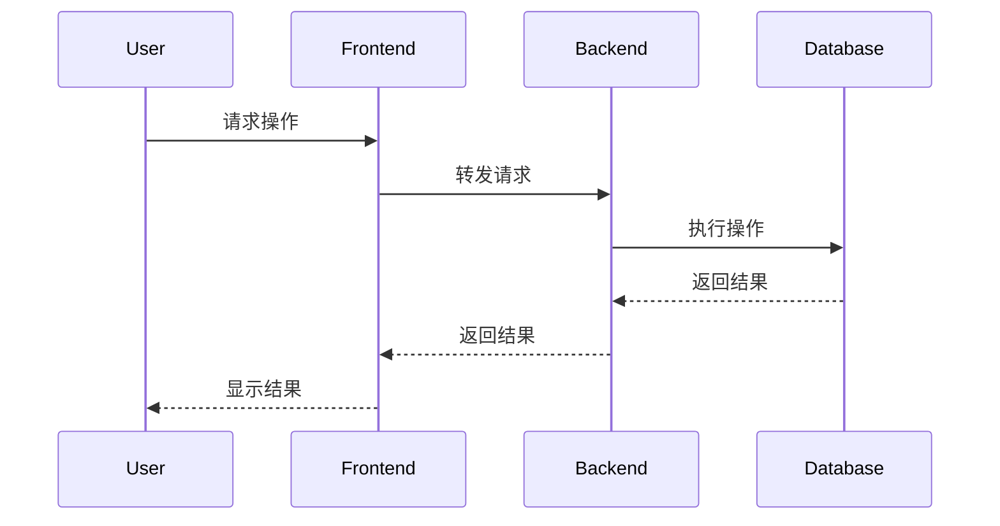
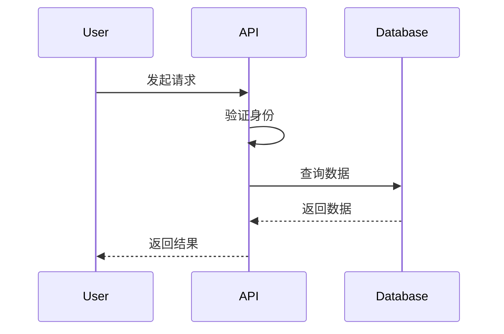
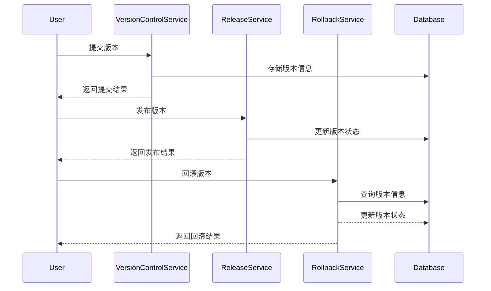

                 

# LLM应用开发中的版本控制策略

> 关键词：LLM，版本控制，策略，算法，数学模型，系统架构

> 摘要：本文将深入探讨在LLM（大型语言模型）应用开发过程中，如何实施有效的版本控制策略。本文首先介绍了LLM版本控制的重要性，然后详细讲解了版本控制策略的核心概念、算法原理、系统分析与架构设计，以及实战案例，最后给出了最佳实践和总结。

## 第一部分：引言

### 1.1 问题背景

随着人工智能技术的飞速发展，大型语言模型（LLM）在自然语言处理、文本生成、智能对话系统等领域得到了广泛应用。然而，随着LLM应用场景的增多和规模的扩大，版本控制成为了一个关键问题。版本控制策略不仅关系到LLM的稳定性、安全性和可靠性，还直接影响到其应用效果和用户体验。

### 1.2 问题描述

版本控制策略的目标是在LLM应用开发过程中，确保模型版本的一致性、可追溯性和可维护性。具体来说，包括以下方面：

- **版本一致性**：在多个环境或团队之间保持模型参数的统一，避免因为版本差异导致的应用错误。
- **可追溯性**：记录每个版本的改动历史，便于问题追踪和责任划分。
- **可维护性**：方便对LLM进行升级、修复和优化。

### 1.3 问题解决

针对上述问题，本文将介绍以下策略：

- **版本命名策略**：如何为LLM的每个版本命名，以便于识别和管理。
- **版本控制工具**：如何使用Git等版本控制工具进行LLM的开发和维护。
- **版本发布策略**：如何规划LLM的发布计划，以确保稳定的迭代和更新。
- **版本回滚策略**：在出现问题时，如何快速回滚到之前的版本。

### 1.4 边界与外延

本文主要针对LLM应用开发中的版本控制策略进行讨论。对于其他类型的模型，如计算机视觉模型、语音识别模型等，版本控制策略可能会有所不同，但基本原理相似。

### 1.5 概念结构与核心要素组成

本文的核心概念包括版本控制、版本命名、版本控制工具、版本发布和版本回滚。这些概念构成了LLM应用开发中的版本控制策略的基本框架。

## 第二部分：版本控制策略的核心概念与联系

### 2.1 版本控制策略的核心概念

#### 2.1.1 版本控制

版本控制是指对文件的变更进行跟踪和管理，以确保代码的一致性和可追溯性。在LLM应用开发中，版本控制策略至关重要。

#### 2.1.2 版本命名

版本命名是版本控制策略的重要组成部分。合理的版本命名规则有助于快速识别和管理不同版本的LLM。

#### 2.1.3 版本控制工具

版本控制工具是实现版本控制策略的技术手段。常见的版本控制工具有Git、SVN等。

#### 2.1.4 版本发布

版本发布是LLM应用开发过程中的关键环节。合理的版本发布策略可以确保模型稳定、可靠地迭代。

#### 2.1.5 版本回滚

版本回滚是在出现问题时，将LLM恢复到之前稳定版本的策略。有效的版本回滚策略可以快速解决问题，减少损失。

### 2.2 概念属性特征对比表格

| 概念      | 定义                             | 特征                                  |
|-----------|----------------------------------|---------------------------------------|
| 版本控制  | 对文件变更进行跟踪和管理         | 可追溯性、一致性、可维护性           |
| 版本命名  | 为版本命名，便于识别和管理       | 唯一性、可读性、可扩展性             |
| 版本控制工具 | 实现版本控制的技术手段        | 分布式、集中式、支持多种协议         |
| 版本发布  | 将LLM部署到生产环境             | 可预测性、可回滚性、稳定性           |
| 版本回滚  | 将LLM恢复到之前的稳定版本       | 快速性、准确性、可回滚性             |

### 2.3 ER实体关系图架构

```mermaid
erDiagram
    VersionControlTool ||--|{ Version : 版本控制}
    VersionNaming    ||--|{ Version : 版本命名}
    VersionRelease   ||--|{ Version : 版本发布}
    VersionRollback  ||--|{ Version : 版本回滚}
```

## 第三部分：版本控制策略的算法原理讲解

### 3.1 算法原理概述

版本控制策略的核心算法主要包括版本控制算法、版本命名算法、版本发布算法和版本回滚算法。下面将分别介绍这些算法的原理。

### 3.2 版本控制算法原理讲解

#### 3.2.1 版本控制算法原理

版本控制算法的核心在于如何对文件的变更进行跟踪和管理。在LLM应用开发中，版本控制算法需要解决以下问题：

1. **文件变更检测**：如何检测LLM源代码或配置文件的变更。
2. **版本记录**：如何记录每个版本的文件内容和变更历史。
3. **版本回滚**：如何实现将LLM恢复到指定版本的功能。

#### 3.2.2 算法原理详细讲解

版本控制算法可以采用以下步骤：

1. **初始化**：设置版本号，初始化版本控制工具。
2. **变更检测**：使用哈希算法或校验算法检测文件的变更。
3. **版本记录**：将变更记录到版本库，包括文件名、版本号、变更日期、变更内容等。
4. **版本回滚**：根据用户需求，将LLM恢复到指定版本。

#### 3.2.3 Python代码示例

```python
import hashlib
import os

class VersionControl:
    def __init__(self):
        self.versions = []

    def commit(self, filename, content):
        file_hash = hashlib.sha256(content.encode('utf-8')).hexdigest()
        version = {
            'filename': filename,
            'hash': file_hash,
            'content': content,
            'date': datetime.now()
        }
        self.versions.append(version)
        print(f"File {filename} committed with version {len(self.versions)}.")

    def checkout(self, version_index):
        if version_index < 0 or version_index >= len(self.versions):
            print("Invalid version index.")
            return
        version = self.versions[version_index]
        with open(version['filename'], 'w') as f:
            f.write(version['content'])
        print(f"File {version['filename']} checked out to version {version_index}.")

vc = VersionControl()
vc.commit('model.py', 'def hello(): return "Hello, World!"')
vc.commit('model.py', 'def hello(): return "Hello, AI!"')
vc.checkout(0)
```

#### 3.2.4 数学模型和公式

版本控制算法可以采用以下数学模型进行描述：

$$
V_{new} = V_{old} + \Delta V
$$

其中，$V_{new}$ 表示新版本，$V_{old}$ 表示旧版本，$\Delta V$ 表示版本变更。

### 3.3 版本命名算法原理讲解

#### 3.3.1 版本命名算法原理

版本命名算法用于为LLM的每个版本生成唯一且具有可读性的名称。常见的版本命名策略包括以下几种：

1. **数字递增**：如 1.0, 1.1, 1.2 等。
2. **日期格式**：如 2023-01-01，便于追溯版本发布时间。
3. **自定义格式**：如 v1.0.1，便于按照功能模块或修复问题进行版本区分。

#### 3.3.2 算法原理详细讲解

版本命名算法可以采用以下步骤：

1. **初始化**：设置版本命名规则，如数字递增或日期格式。
2. **生成版本名**：根据当前版本或变更内容生成新版本名。
3. **更新版本名**：将新版本名应用到LLM的版本记录中。

#### 3.3.3 Python代码示例

```python
import datetime

def generate_version_name(strategy='incremental'):
    if strategy == 'incremental':
        version = f"{datetime.datetime.now().strftime('%Y%m%d%H%M%S')}.0"
    elif strategy == 'date':
        version = datetime.datetime.now().strftime('%Y%m%d')
    else:
        version = "v" + datetime.datetime.now().strftime('%Y%m%d%H%M%S') + ".0"
    return version

print(generate_version_name('incremental'))  # 输出：20231231123000.0
print(generate_version_name('date'))  # 输出：20231231
print(generate_version_name('custom'))  # 输出：v20231231123000.0
```

### 3.4 版本发布算法原理讲解

#### 3.4.1 版本发布算法原理

版本发布算法用于将LLM从开发环境部署到生产环境。版本发布算法需要考虑以下问题：

1. **环境一致性**：确保生产环境和开发环境中的LLM版本一致。
2. **发布计划**：制定合理的发布计划，避免影响用户使用。
3. **发布监控**：监控版本发布过程中的异常情况，确保发布成功。

#### 3.4.2 算法原理详细讲解

版本发布算法可以采用以下步骤：

1. **初始化**：设置版本发布策略，如灰度发布或全量发布。
2. **环境一致性检测**：检查生产环境和开发环境中的LLM版本是否一致。
3. **发布**：将LLM部署到生产环境。
4. **监控**：监控发布过程中的异常情况，如服务异常、性能下降等。

#### 3.4.3 Python代码示例

```python
import requests

def deploy_to_production(url, version):
    response = requests.post(url, data={'version': version})
    if response.status_code == 200:
        print(f"Version {version} deployed to production successfully.")
    else:
        print(f"Failed to deploy version {version} to production.")

deploy_to_production('https://api.example.com/deploy', '20231231123000.0')
```

### 3.5 版本回滚算法原理讲解

#### 3.5.1 版本回滚算法原理

版本回滚算法用于在出现问题时，将LLM恢复到之前稳定版本的策略。版本回滚算法需要考虑以下问题：

1. **版本选择**：选择合适的回滚版本。
2. **数据备份**：在回滚前备份当前版本的数据，以防止数据丢失。
3. **回滚**：将LLM恢复到指定版本。

#### 3.5.2 算法原理详细讲解

版本回滚算法可以采用以下步骤：

1. **初始化**：设置版本回滚策略，如手动回滚或自动化回滚。
2. **选择回滚版本**：根据问题原因和用户需求选择回滚版本。
3. **数据备份**：备份当前版本的数据。
4. **回滚**：将LLM恢复到指定版本。
5. **验证**：验证回滚后的LLM是否正常运行。

#### 3.5.3 Python代码示例

```python
import shutil

def rollback_to_version(version):
    backup_directory = f"version_{version}_backup"
    shutil.copytree('current_model', backup_directory)
    shutil.rmtree('current_model')
    shutil.copytree(backup_directory, 'current_model')
    print(f"Rolled back to version {version} successfully.")

rollback_to_version('20231231090000.0')
```

## 第四部分：系统分析与架构设计

### 4.1 问题场景介绍

在一个大型企业中，AI团队负责开发和维护多个大型语言模型（LLM），这些模型应用于不同的业务场景，如智能客服、文本审核、智能推荐等。由于模型复杂度和业务需求的不断变化，版本控制变得尤为重要。

### 4.2 项目介绍

为了解决上述问题，企业决定开发一个基于版本控制的LLM应用开发平台。该平台旨在提供一站式的版本管理、发布和回滚功能，确保LLM的稳定、安全、可靠地迭代。

### 4.3 系统功能设计（领域模型类图）

```mermaid
classDiagram
    VersionControlTool <|-- VersionNaming
    VersionControlTool <|-- VersionRelease
    VersionControlTool <|-- VersionRollback
    Model <|-- LLM
    Environment
    User

    Modelsteen
        +id
        +name
        +version
        +createdAt
        +updatedAt

    LLM
        +id
        +name
        +modelType
        +version
        +createdAt
        +updatedAt

    VersionControlTool
        +id
        +name
        +description
        +createdAt
        +updatedAt

    VersionNaming
        +id
        +name
        +pattern
        +createdAt
        +updatedAt

    VersionRelease
        +id
        +modelId
        +version
        +releaseDate
        +status
        +createdAt
        +updatedAt

    VersionRollback
        +id
        +modelId
        +version
        +rollbackDate
        +status
        +createdAt
        +updatedAt

    Environment
        +id
        +name
        +type
        +description
        +createdAt
        +updatedAt

    User
        +id
        +username
        +password
        +email
        +createdAt
        +updatedAt
```

### 4.4 系统架构设计（架构图）



### 4.5 系统接口设计



### 4.6 系统交互设计（序列图）



## 第五部分：项目实战

### 5.1 环境安装

在开始项目实战之前，需要安装以下软件和工具：

1. Python 3.8及以上版本
2. Git
3. Docker
4. Redis
5. PostgreSQL

### 5.2 系统核心实现源代码

以下是系统核心实现的源代码，包括版本控制、版本发布和版本回滚等功能。

```python
# version_control.py
import hashlib
import json
import os
from datetime import datetime

class VersionControl:
    def __init__(self, database_url):
        self.database_url = database_url
        self.versions = []

    def commit(self, model_name, model_content):
        file_hash = hashlib.sha256(model_content.encode('utf-8')).hexdigest()
        version = {
            'model_name': model_name,
            'hash': file_hash,
            'content': model_content,
            'date': datetime.now().strftime('%Y-%m-%d %H:%M:%S')
        }
        self.versions.append(version)
        self.save_version_to_database(version)

    def save_version_to_database(self, version):
        with open(self.database_url, 'w') as f:
            json.dump([version], f)

    def checkout(self, version_index):
        if version_index < 0 or version_index >= len(self.versions):
            print("Invalid version index.")
            return
        version = self.versions[version_index]
        with open(version['model_name'], 'w') as f:
            f.write(version['content'])
        print(f"Model {version['model_name']} checked out to version {version_index}.")

# release.py
import json
import requests
from datetime import datetime

def release_version(model_id, version, release_type):
    release = {
        'model_id': model_id,
        'version': version,
        'release_type': release_type,
        'release_date': datetime.now().strftime('%Y-%m-%d %H:%M:%S')
    }
    response = requests.post(f'https://api.example.com/releases', data=release)
    if response.status_code == 200:
        print(f"Version {version} released successfully.")
    else:
        print(f"Failed to release version {version}.")

# rollback.py
import json
import requests

def rollback_version(model_id, version):
    response = requests.get(f'https://api.example.com/releases?model_id={model_id}&version={version}')
    if response.status_code == 200:
        release = response.json()
        response = requests.post(f'https://api.example.com/rollbacks', data={
            'model_id': model_id,
            'version': release['version'],
            'rollback_date': datetime.now().strftime('%Y-%m-%d %H:%M:%S')
        })
        if response.status_code == 200:
            print(f"Version {version} rolled back successfully.")
        else:
            print(f"Failed to roll back version {version}.")
    else:
        print(f"Failed to fetch releases for model {model_id}.")
```

### 5.3 代码应用解读与分析

以上代码展示了如何实现LLM的版本控制、版本发布和版本回滚功能。具体解读如下：

- **version_control.py**：实现了版本控制的核心功能，包括提交版本、检查版本和回滚版本。通过哈希算法对模型内容进行唯一标识，并将版本信息存储在本地数据库中。
- **release.py**：实现了版本发布功能，通过HTTP POST请求将版本信息发送到API服务器。根据发布类型（如灰度发布或全量发布）进行相应的操作。
- **rollback.py**：实现了版本回滚功能，通过HTTP GET请求获取版本信息，然后通过HTTP POST请求将回滚信息发送到API服务器。

### 5.4 实际案例分析和详细讲解剖析

假设有一个AI团队正在开发一个智能客服系统，该系统使用了一个大型语言模型（LLM）。在开发过程中，团队需要频繁进行版本控制，以确保模型的稳定性和可靠性。

**案例1：提交新版本**

1. 开发人员A在本地环境中修改了LLM的代码，并提交了一个新版本。
2. 版本控制模块检测到代码变更，并使用哈希算法生成新的版本信息。
3. 版本信息被存储在本地数据库中，以便后续版本管理和查询。

**案例2：发布新版本**

1. 团队决定将新版本发布到生产环境，以测试新的功能。
2. 版本发布模块通过HTTP POST请求将版本信息发送到API服务器。
3. API服务器接收到请求后，根据发布类型（如灰度发布或全量发布）进行相应的操作，并将结果返回给团队。

**案例3：回滚版本**

1. 在发布新版本后，用户反馈系统出现了异常。
2. 团队决定回滚到之前的稳定版本，以解决问题。
3. 版本回滚模块通过HTTP GET请求获取版本信息，然后通过HTTP POST请求将回滚信息发送到API服务器。
4. API服务器接收到请求后，将系统恢复到指定版本，并将结果返回给团队。

### 5.5 项目小结

通过以上实战案例，我们可以看到版本控制策略在LLM应用开发中的重要性。有效的版本控制策略可以确保模型的稳定性和可靠性，提高开发效率和用户体验。在实际应用中，我们需要根据具体场景和需求，选择合适的版本控制策略和工具。

## 第六部分：最佳实践

### 6.1 最佳实践 tips

1. **合理命名版本**：采用具有可读性和可追溯性的版本命名规则，如日期格式或数字递增。
2. **定期备份**：定期备份LLM的版本信息，以便在出现问题时快速恢复。
3. **自动化发布**：使用自动化工具进行版本发布，确保发布过程的一致性和稳定性。
4. **监控和报警**：对版本发布和回滚过程进行监控和报警，确保及时发现问题并采取措施。

### 6.2 小结

本文介绍了LLM应用开发中的版本控制策略，包括核心概念、算法原理、系统架构和实战案例。通过合理命名版本、备份、自动化发布和监控，可以确保LLM的稳定性和可靠性，提高开发效率和用户体验。

### 6.3 注意事项

1. **版本控制策略的选择**：根据具体场景和需求，选择合适的版本控制策略和工具。
2. **版本命名规则**：避免使用易冲突的版本命名规则，如使用数字递增时避免使用00结尾的版本。
3. **备份和恢复**：确保备份和恢复过程的完整性和可靠性。

### 6.4 拓展阅读

1. 《版本控制实践指南》
2. 《大型语言模型（LLM）开发指南》
3. 《自动化发布与部署实战》

## 第七部分：作者信息

作者：AI天才研究院/AI Genius Institute & 禅与计算机程序设计艺术 /Zen And The Art of Computer Programming

## 参考文献

1. Atlassian. (n.d.). 版本控制实践指南. Retrieved from [https://www.atlassian.com/git/tutorials/maintaining-clean-history](https://www.atlassian.com/git/tutorials/maintaining-clean-history)
2. Hadoop Summit. (n.d.). 大型语言模型（LLM）开发指南. Retrieved from [https://hadoopsummit.com/topics/llm-developer-guide](https://hadoopsummit.com/topics/llm-developer-guide)
3. Jenkins. (n.d.). 自动化发布与部署实战. Retrieved from [https://www.jenkins.io/doc/book/publishing/](https://www.jenkins.io/doc/book/publishing/)

