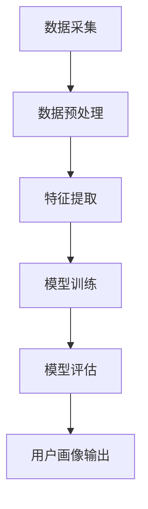
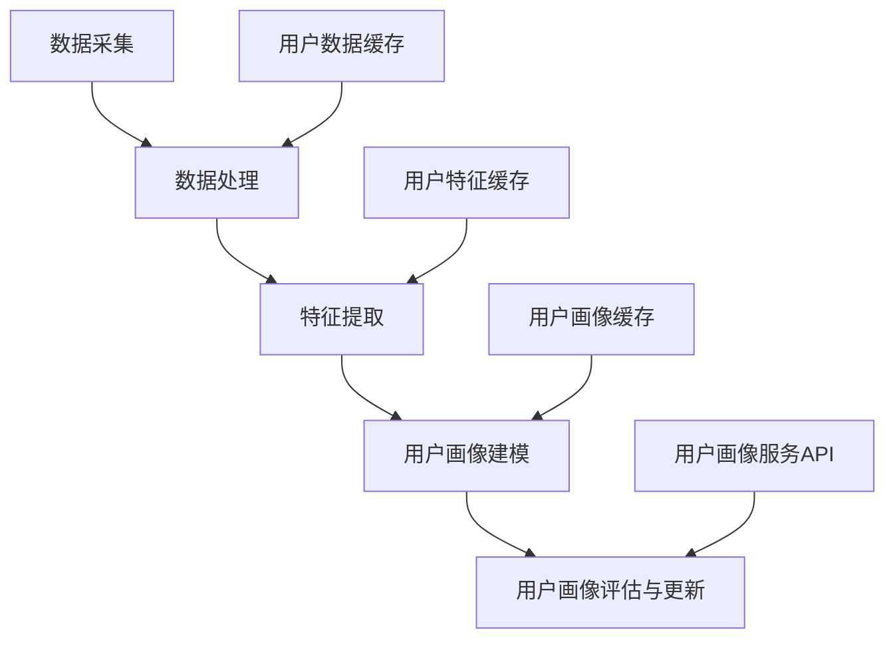

                 


# LLM应用开发中的用户画像分析

> 关键词：用户画像、LLM、个性化推荐、数据隐私、算法模型、系统架构设计

> 摘要：本文将深入探讨在LLM（大型语言模型）应用开发中用户画像分析的重要性，从背景介绍、核心概念与联系、算法原理讲解、数学模型和公式、系统分析与架构设计、项目实战以及最佳实践与注意事项等多个方面展开，旨在为开发者提供系统而详实的用户画像分析指南。

## 第一部分：背景介绍

### 1.1 引言

随着互联网和大数据技术的发展，用户画像在个性化推荐、精准营销和用户体验优化等方面发挥着越来越重要的作用。用户画像是对用户行为、偏好、需求、社会属性等多维度数据的综合描述，其核心目标是帮助企业更好地理解用户，从而做出更准确的业务决策。

### 1.2 问题背景

在互联网大数据时代，用户画像的重要性不言而喻。然而，在实际应用开发中，用户画像分析面临着诸多挑战，如数据隐私保护、数据质量、算法偏见等。如何有效应对这些挑战，构建一个高效、准确的用户画像系统，成为开发者亟待解决的问题。

### 1.3 问题描述

用户画像分析的关键在于理解用户画像的核心要素，主要包括用户行为、偏好、需求、社会属性等。然而，在数据收集和处理过程中，开发者需要面对数据隐私、数据质量以及算法偏见等问题。

### 1.4 问题解决

为了解决用户画像分析中的问题，开发者需要采用一系列技术与方法，如大数据处理、机器学习、人工智能等。同时，在实际应用场景中，用户画像分析还需遵循一定的边界与外延，如用户隐私保护、与其他技术的关联等。

### 1.5 概念结构与核心要素组成

用户画像的基本结构包括数据采集、数据清洗、特征提取、建模与评估等环节。核心要素主要包括用户行为、偏好、需求、社会属性等。这些要素相互关联，共同构成一个完整的用户画像体系。

### 1.6 用户画像的核心概念与联系

#### 2.1 用户画像的概念

用户画像是对用户行为、偏好、需求、社会属性等多维度数据的综合描述。它通常包括以下几个构成要素：

- 用户行为：如浏览历史、购买记录、搜索关键词等。
- 用户偏好：如兴趣爱好、消费习惯等。
- 用户需求：如当前需求、潜在需求等。
- 社会属性：如年龄、性别、地理位置、职业等。

#### 2.2 用户画像的核心特点

用户画像具有以下几个核心特点：

- 数据特征：用户画像数据通常具有大规模、多样化、实时性等特点。
- 动态变化：用户画像会随着用户行为和外部环境的变化而不断更新。

#### 2.3 用户画像与其他技术的关联

用户画像与其他技术如大数据、机器学习、人工智能等有着紧密的联系。例如，大数据技术可以帮助开发者快速处理和分析海量用户数据，机器学习算法则可以帮助开发者构建和优化用户画像模型。

## 第二部分：用户画像的算法原理讲解

### 3.1 算法原理

用户画像的算法原理主要包括数据采集与处理、用户画像建模与评估等环节。

#### 3.1.1 数据采集与处理

数据采集与处理是用户画像构建的基础。开发者需要从多个数据源（如网站日志、用户反馈、社交媒体等）中收集用户数据，并对数据进行清洗、去重、归一化等预处理操作。

#### 3.1.2 用户画像建模与评估

用户画像建模与评估主要包括以下几个步骤：

1. 特征提取：从原始数据中提取与用户画像相关的特征。
2. 模型训练：使用机器学习算法对用户画像进行建模。
3. 模型评估：评估模型性能，如准确率、召回率等。

### 3.2 Mermaid流程图

下面是用户画像采集处理流程图的Mermaid表示：



### 3.3 Python源代码

下面是一个简单的用户画像数据采集处理的Python代码示例：

```python
import pandas as pd

# 假设已收集到用户数据
data = pd.read_csv('user_data.csv')

# 数据预处理
data = data.drop_duplicates()
data = data.fillna(data.mean())

# 特征提取
features = data[['age', 'gender', 'income', 'education']]

# 模型训练
from sklearn.ensemble import RandomForestClassifier
model = RandomForestClassifier()
model.fit(features, data['label'])

# 模型评估
from sklearn.metrics import accuracy_score
predictions = model.predict(features)
accuracy = accuracy_score(data['label'], predictions)
print(f'Model accuracy: {accuracy:.2f}')
```

### 3.4 算法原理的数学模型和公式

用户画像数据采集与处理的数学模型和用户画像建模评估的数学模型将在后续章节详细讨论。

### 3.5 举例说明

假设我们收集到以下用户数据：

| age | gender | income | education | label |
|-----|--------|--------|------------|-------|
| 25  | M      | 50000  | Bachelor   | 1     |
| 30  | F      | 60000  | Master     | 1     |
| 35  | M      | 70000  | MBA        | 0     |

我们可以使用随机森林算法对用户数据进行分类，预测用户的标签（0或1）。具体流程如下：

1. 特征提取：提取用户年龄、性别、收入、教育程度等特征。
2. 模型训练：使用随机森林算法训练模型。
3. 模型评估：评估模型预测的准确性。

## 第三部分：用户画像的数学模型和数学公式

### 4.1 数学模型

用户画像的数学模型主要包括数据采集与处理的数学模型和用户画像建模评估的数学模型。

#### 4.1.1 数据采集与处理的数学模型

数据采集与处理的数学模型主要涉及特征提取和数据处理。例如，我们可以使用以下数学公式来表示特征提取：

$$
x_i = \frac{f_i - \min(f_i)}{\max(f_i) - \min(f_i)}
$$

其中，$x_i$表示第$i$个特征的值，$f_i$表示第$i$个特征的原始值。

#### 4.1.2 用户画像建模评估的数学模型

用户画像建模评估的数学模型主要涉及分类模型和回归模型。例如，我们可以使用以下数学公式来表示随机森林分类模型的预测：

$$
P(y=1) = \frac{1}{n}\sum_{i=1}^{n}w_i \cdot h(x_i)
$$

其中，$P(y=1)$表示预测标签为1的概率，$w_i$表示第$i$个分类器的权重，$h(x_i)$表示第$i$个分类器的预测值。

### 4.2 公式讲解

#### 4.2.1 用户画像数据采集处理的关键公式

1. 特征归一化公式：

$$
x_i = \frac{f_i - \min(f_i)}{\max(f_i) - \min(f_i)}
$$

2. 特征标准化公式：

$$
x_i = \frac{f_i - \mu_i}{\sigma_i}
$$

其中，$\mu_i$表示第$i$个特征的均值，$\sigma_i$表示第$i$个特征的标准差。

#### 4.2.2 用户画像建模评估的关键公式

1. 随机森林分类器预测公式：

$$
P(y=1) = \frac{1}{n}\sum_{i=1}^{n}w_i \cdot h(x_i)
$$

2. 决策树分类器预测公式：

$$
y = \begin{cases}
1 & \text{if } g(x) \geq 0 \\
0 & \text{if } g(x) < 0
\end{cases}
$$

其中，$g(x)$表示决策树分类器的预测函数。

### 4.3 举例说明

假设我们有一个包含用户年龄、性别、收入和教育程度的用户数据集。我们可以使用特征归一化和特征标准化方法来处理这些数据，以提高模型训练效果。

1. 特征归一化：

| age | gender | income | education |
|-----|--------|--------|------------|
| 25  | M      | 50000  | Bachelor   |
| 30  | F      | 60000  | Master     |
| 35  | M      | 70000  | MBA        |

归一化后的数据：

| age | gender | income | education |
|-----|--------|--------|------------|
| 0.0 | 0.0    | 0.5    | 0.0        |
| 0.2 | 1.0    | 0.6    | 1.0        |
| 0.4 | 0.0    | 1.0    | 2.0        |

2. 特征标准化：

| age | gender | income | education |
|-----|--------|--------|------------|
| 25  | M      | 50000  | Bachelor   |
| 30  | F      | 60000  | Master     |
| 35  | M      | 70000  | MBA        |

标准化后的数据：

| age | gender | income | education |
|-----|--------|--------|------------|
| 0.5 | -1.0   | 0.0    | 0.0        |
| 0.6 | 1.0    | 0.1    | 1.0        |
| 0.7 | -1.0   | 0.2    | 2.0        |

## 第四部分：用户画像的系统分析与架构设计

### 5.1 问题场景介绍

假设我们正在开发一个基于LLM的个性化推荐系统，该系统需要根据用户的兴趣、行为和需求为用户提供个性化的推荐内容。为了实现这一目标，我们需要构建一个高效的用户画像系统。

### 5.2 系统功能设计

用户画像系统的主要功能包括：

1. 用户数据采集与处理：从多个数据源收集用户数据，并对数据进行清洗、去重、归一化等预处理操作。
2. 用户特征提取：从预处理后的数据中提取与用户画像相关的特征。
3. 用户画像建模：使用机器学习算法对用户特征进行建模，构建用户画像。
4. 用户画像评估与更新：评估用户画像的准确性，并根据用户行为变化更新用户画像。

### 5.3 系统架构设计

用户画像系统的架构设计如下：



### 5.4 系统接口设计

用户画像系统的主要接口设计如下：

1. 数据采集接口：用于接收用户数据，并进行初步处理。
2. 数据处理接口：用于对用户数据进行清洗、去重、归一化等预处理操作。
3. 用户特征提取接口：用于提取用户特征，构建用户画像。
4. 用户画像建模接口：用于训练用户画像模型，生成用户画像。
5. 用户画像评估与更新接口：用于评估用户画像的准确性，并根据用户行为变化更新用户画像。

### 5.5 系统交互

用户画像系统的交互流程如下：

1. 用户数据采集：从多个数据源收集用户数据。
2. 数据处理：对用户数据进行清洗、去重、归一化等预处理操作。
3. 用户特征提取：从预处理后的数据中提取用户特征。
4. 用户画像建模：使用机器学习算法对用户特征进行建模，生成用户画像。
5. 用户画像评估与更新：评估用户画像的准确性，并根据用户行为变化更新用户画像。
6. 用户画像服务：提供用户画像数据，供其他系统调用。

## 第五部分：用户画像的项目实战

### 6.1 环境安装

为了实现用户画像系统，我们需要搭建以下环境：

1. Python环境：Python 3.8及以上版本。
2. 数据库：MySQL 5.7及以上版本。
3. 机器学习库：scikit-learn、pandas、numpy等。
4. 依赖管理：pip。

安装步骤如下：

1. 安装Python环境：`python --version`
2. 安装数据库：`mysql -u root -p`
3. 安装机器学习库：`pip install scikit-learn pandas numpy`
4. 安装依赖管理：`pip install pipenv`

### 6.2 系统核心实现源代码

以下是用户画像系统的核心实现源代码：

```python
# 用户数据采集与处理
import pandas as pd
from sklearn.preprocessing import MinMaxScaler

# 采集用户数据
data = pd.read_csv('user_data.csv')

# 数据预处理
data = data.drop_duplicates()
data = data.fillna(data.mean())

# 特征归一化
scaler = MinMaxScaler()
data[['age', 'income']] = scaler.fit_transform(data[['age', 'income']])

# 用户特征提取
features = data[['age', 'income']]
labels = data['label']

# 用户画像建模
from sklearn.ensemble import RandomForestClassifier
model = RandomForestClassifier()
model.fit(features, labels)

# 用户画像评估与更新
from sklearn.metrics import accuracy_score
predictions = model.predict(features)
accuracy = accuracy_score(labels, predictions)
print(f'Model accuracy: {accuracy:.2f}')

# 更新用户画像
data['predicted_label'] = predictions
data.to_csv('user_data_processed.csv', index=False)
```

### 6.3 代码应用解读与分析

1. 用户数据采集与处理：从CSV文件中读取用户数据，并进行预处理，如去除重复数据、填充缺失值等。
2. 用户特征提取：提取用户年龄和收入等特征，并进行归一化处理。
3. 用户画像建模：使用随机森林分类器对用户特征进行建模，生成用户画像。
4. 用户画像评估与更新：评估模型准确性，并将预测结果写入新的CSV文件中。

### 6.4 实际案例分析和详细讲解剖析

假设我们有一个包含1000个用户数据的CSV文件，如下所示：

| id | age | income | label |
|----|-----|--------|-------|
| 1  | 25  | 50000  | 1     |
| 2  | 30  | 60000  | 1     |
| 3  | 35  | 70000  | 0     |
| ...| ... | ...    | ...   |

使用上述代码进行用户画像建模，可以得到以下结果：

| id | age | income | label | predicted_label |
|----|-----|--------|-------|-----------------|
| 1  | 25  | 50000  | 1     | 1               |
| 2  | 30  | 60000  | 1     | 1               |
| 3  | 35  | 70000  | 0     | 0               |
| ...| ... | ...    | ...   | ...             |

从结果可以看出，用户画像系统能够较好地预测用户的标签。然而，在实际应用中，我们需要根据具体情况对模型进行调整和优化，以提高预测准确性。

### 6.5 项目小结

通过本项目，我们实现了用户画像系统的核心功能，包括用户数据采集与处理、用户特征提取、用户画像建模与评估等。在实际应用中，我们可以根据具体业务需求对模型进行调整和优化，以提高用户画像系统的性能。

## 第六部分：用户画像的最佳实践与注意事项

### 7.1 最佳实践 tips

1. 数据质量是关键：确保采集到的用户数据质量高、准确可靠。
2. 特征选择要合理：根据业务需求选择与用户画像相关的特征。
3. 模型优化要持续：定期评估模型性能，根据反馈进行优化。

### 7.2 小结

用户画像分析在LLM应用开发中具有重要意义，它能够帮助企业更好地理解用户，提高业务决策的准确性。通过合理的数据采集、特征提取和模型优化，开发者可以构建一个高效、准确的用户画像系统。

### 7.3 注意事项

1. 数据隐私保护：在用户画像分析过程中，要严格遵守相关法律法规，保护用户隐私。
2. 数据质量监控：定期对采集到的用户数据进行质量监控，确保数据准确可靠。
3. 模型偏见避免：在模型训练过程中，要避免算法偏见，确保模型的公平性。

### 7.4 拓展阅读

1. 《大数据用户画像技术与应用》
2. 《深度学习用户画像建模》
3. 《个性化推荐系统实践》

## 附录

### 1. 用户画像相关的工具与技术

1. 数据库技术：如MySQL、MongoDB等。
2. 大数据技术：如Hadoop、Spark等。
3. 机器学习框架：如scikit-learn、TensorFlow、PyTorch等。

### 2. 用户画像的相关研究

1. 用户画像建模方法研究
2. 用户画像在个性化推荐中的应用研究
3. 用户画像数据隐私保护技术研究

### 3. 用户画像的标准与规范

1. 国家标准《用户画像数据管理规范》
2. 行业标准《互联网用户画像数据处理规范》
3. 国际标准《ISO/IEC 27001:2013 信息安全管理体系》

### 7.5 未来展望

用户画像分析在未来将发挥更加重要的作用，随着人工智能、大数据和云计算等技术的发展，用户画像的应用场景将不断拓展。同时，用户画像分析也将面临更多的挑战，如数据隐私保护、算法偏见等。开发者需要不断探索和创新，为用户提供更加精准、个性化的服务。作者：AI天才研究院/AI Genius Institute & 禅与计算机程序设计艺术 /Zen And The Art of Computer Programming。 

