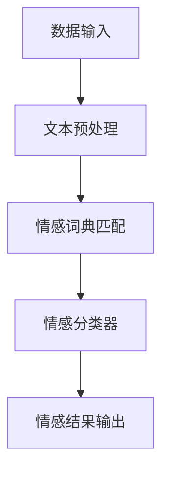
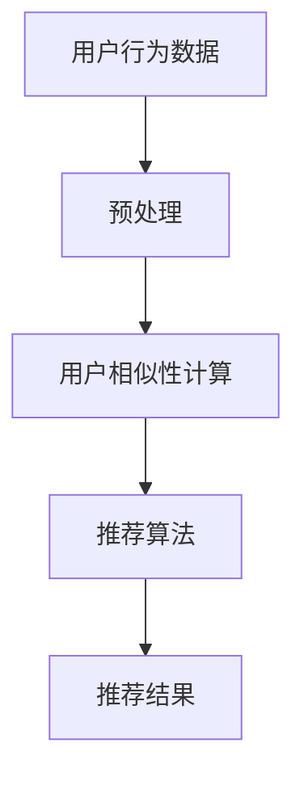
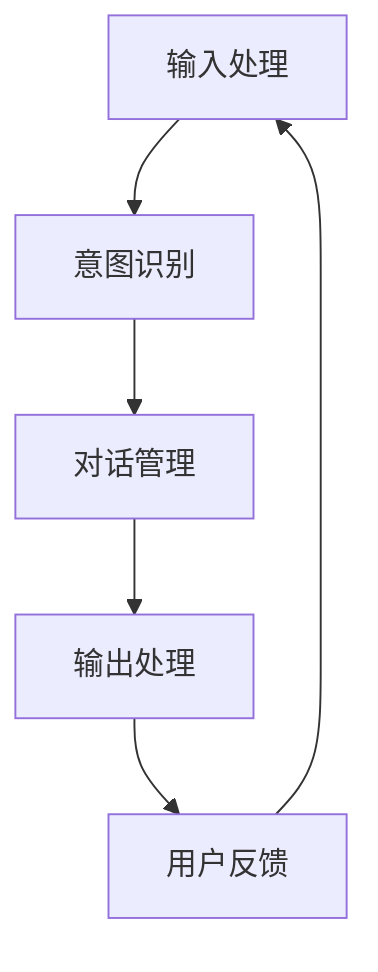
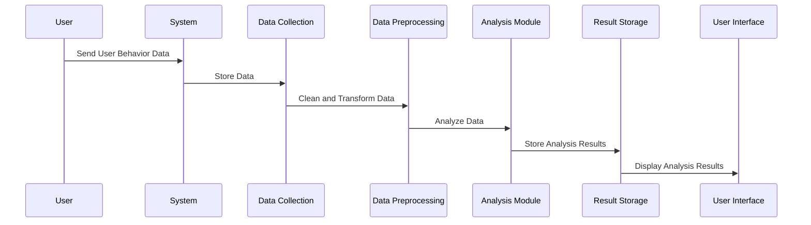
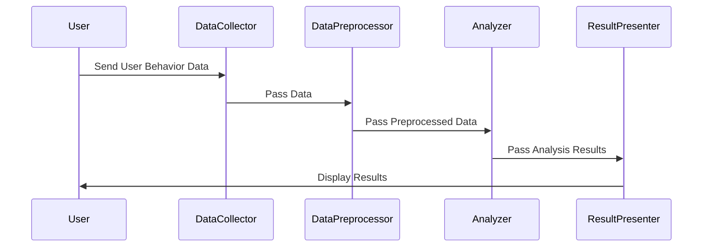

                 

# LLM应用开发中的用户行为分析

## 关键词

- 大型语言模型 (LLM)
- 用户行为分析
- 机器学习算法
- 数据挖掘
- 人机交互

## 摘要

本文将深入探讨在LLM应用开发过程中，如何进行用户行为分析。通过对LLM的基础概念介绍，用户行为分析的重要性分析，算法原理讲解，系统设计与实现，项目实战和最佳实践等多个方面的深入探讨，旨在为读者提供一个全面、系统、易于理解的LLM用户行为分析指南。文章将逐步解析每个环节，帮助读者更好地理解并应用LLM进行用户行为分析，从而优化产品设计和提升用户体验。

## 第一部分: LLM与用户行为分析基础

### 第1章: LLM概述

#### 1.1 什么是LLM

大型语言模型（Large Language Model，简称LLM）是一种利用深度学习技术训练的强大语言处理模型，能够理解和生成人类语言。LLM通过学习大量的文本数据，学会预测下一个词或句子，从而生成连贯的自然语言文本。自GPT系列模型以来，LLM在自然语言处理领域取得了显著的进展，广泛应用于对话系统、文本生成、机器翻译等场景。

#### 1.2 用户行为分析的重要性

用户行为分析是对用户在使用产品或服务过程中的行为进行数据收集、分析和理解的过程。在LLM应用开发中，用户行为分析至关重要，因为它可以帮助开发者更好地理解用户需求，优化产品设计，提升用户体验，并提高业务效率。

用户行为分析的应用场景包括：

- **个性化推荐**：通过分析用户的历史行为，为用户推荐个性化的内容或产品。
- **交互式对话系统**：通过理解用户的输入，提供更加自然的对话体验。
- **用户画像**：通过对用户行为的分析，构建用户的综合画像，为后续的产品营销和服务提供依据。
- **数据驱动的产品设计**：通过用户行为数据，指导产品功能和界面的优化。

#### 1.3 LLM在用户行为分析中的应用

LLM在用户行为分析中具有显著的优势，主要体现在以下几个方面：

- **情感分析**：通过LLM，可以自动识别和分类用户的情感状态，如喜悦、愤怒、焦虑等。
- **对话生成**：LLM能够生成自然的对话文本，为交互式对话系统提供支持。
- **用户行为预测**：利用LLM对用户行为进行建模，可以预测用户的下一步操作，从而优化用户体验。
- **自动化内容审核**：LLM可以帮助自动化识别和过滤不良内容，提高内容审核效率。

### 第2章: 用户行为分析核心概念

#### 2.1 用户行为分析的基本要素

用户行为分析涉及多个基本要素，包括：

- **用户行为**：用户在使用产品或服务过程中的各种操作和交互行为，如点击、浏览、搜索、评论等。
- **用户特征**：描述用户属性的信息，如年龄、性别、地理位置、兴趣爱好等。
- **用户交互**：用户与产品或服务之间的互动过程，包括输入、输出、反馈等。

#### 2.2 用户行为分析方法

用户行为分析方法主要包括以下几种：

- **数据收集方法**：通过日志、API、问卷调查等方式收集用户行为数据。
- **数据预处理方法**：对收集到的数据进行清洗、去重、转换等预处理操作。
- **数据分析方法**：使用统计学、机器学习等方法对预处理后的数据进行分析，提取有价值的信息。

#### 2.3 用户行为分析模型

用户行为分析模型包括以下几种：

- **基于规则的模型**：使用规则定义用户行为的模式。
- **机器学习模型**：利用历史数据训练模型，预测用户的未来行为。
- **深度学习模型**：通过多层神经网络，对用户行为进行深度分析。

## 第二部分: LLM用户行为分析算法原理讲解

### 第3章: 常见LLM用户行为分析算法

#### 3.1 情感分析算法

情感分析是用户行为分析的重要方面之一，旨在理解用户在文本中的情感倾向。下面将介绍情感分析算法的基本原理、Mermaid流程图、Python代码示例、数学模型和公式，并举例说明。

#### 3.1.1 算法原理

情感分析算法通过识别文本中的情感词汇和情感强度，判断文本的情感倾向。常用的情感分析算法包括基于词典的方法、基于机器学习的方法和基于深度学习的方法。

#### 3.1.2 Mermaid流程图



#### 3.1.3 Python代码示例

```python
import nltk
from nltk.sentiment import SentimentIntensityAnalyzer

nltk.download('vader_lexicon')
sia = SentimentIntensityAnalyzer()

text = "我非常喜欢这个产品！"
sentiment = sia.polarity_scores(text)
print(sentiment)
```

#### 3.1.4 数学模型与公式

情感分析的核心是情感分数的计算，常用的情感分数计算方法有VADER（Valence Aware Dictionary and sEntiment Reasoner）和BERT（Bidirectional Encoder Representations from Transformers）。

VADER的情感分数计算公式为：

$$
score = \sum_{i=1}^{n} w_i \cdot s_i
$$

其中，$w_i$是情感词汇的权重，$s_i$是情感词汇的情感强度。

BERT的情感分数计算公式为：

$$
score = \frac{1}{1 + e^{-\beta \cdot (p_c - p_n)}}
$$

其中，$p_c$是正类别的概率，$p_n$是负类别的概率，$\beta$是调节参数。

#### 3.1.5 举例说明

假设有一个文本“这个电影非常糟糕，剧情毫无逻辑”，使用VADER进行情感分析的结果如下：

```python
text = "这个电影非常糟糕，剧情毫无逻辑"
sentiment = sia.polarity_scores(text)
print(sentiment)
```

输出结果为：

```python
{'neg': 0.77, 'neu': 0.23, 'pos': 0.0, 'compound': -0.83}
```

这表示文本的情感倾向为负面，情感分数为-0.83。

### 第3章: 个性化推荐算法

个性化推荐算法是用户行为分析中的重要组成部分，旨在根据用户的历史行为和偏好，为用户推荐个性化内容。下面将介绍个性化推荐算法的基本原理、Mermaid流程图、Python代码示例、数学模型和公式，并举例说明。

#### 3.2.1 算法原理

个性化推荐算法主要通过以下两种方式实现：

- **基于内容的推荐**：根据用户的历史行为和偏好，找到与用户历史行为相似的内容进行推荐。
- **基于协同过滤的推荐**：通过分析用户之间的相似性，找到与目标用户相似的用户，然后推荐这些用户喜欢的商品或内容。

#### 3.2.2 Mermaid流程图



#### 3.2.3 Python代码示例

```python
from sklearn.metrics.pairwise import cosine_similarity
from sklearn.preprocessing import StandardScaler

# 用户行为数据
user_behavior = [
    [1, 0, 1, 0],
    [0, 1, 0, 1],
    [1, 1, 0, 1],
    [0, 0, 1, 1]
]

# 预处理
scaler = StandardScaler()
user_behavior_scaled = scaler.fit_transform(user_behavior)

# 用户相似性计算
similarity_matrix = cosine_similarity(user_behavior_scaled)

# 推荐算法
# 假设目标用户的行为数据为 [1, 1, 0, 1]
target_user_behavior = [1, 1, 0, 1]
target_user_behavior_scaled = scaler.transform([target_user_behavior])

# 计算目标用户与其他用户的相似度
user_similarity = cosine_similarity([target_user_behavior_scaled], user_behavior_scaled)

# 推荐结果
recommended_users = user_similarity.argsort()[0][-3:][::-1]
print(recommended_users)
```

#### 3.2.4 数学模型与公式

基于内容的推荐算法主要涉及相似度计算，常用的相似度计算方法有余弦相似度、皮尔逊相关系数等。

余弦相似度计算公式为：

$$
similarity = \frac{A \cdot B}{\|A\|\|B\|}
$$

其中，$A$和$B$是两个用户的行为向量，$\|A\|$和$\|B\|$分别是用户行为向量的模长。

皮尔逊相关系数计算公式为：

$$
correlation = \frac{A \cdot B - \bar{A} \cdot \bar{B}}{\sqrt{(A - \bar{A})^2 + (B - \bar{B})^2}}
$$

其中，$\bar{A}$和$\bar{B}$分别是用户行为向量的平均值。

#### 3.2.5 举例说明

假设有两个用户，用户A的行为数据为[1, 0, 1, 0]，用户B的行为数据为[0, 1, 0, 1]，计算用户A和用户B的相似度。

使用余弦相似度计算，结果如下：

```python
A = [1, 0, 1, 0]
B = [0, 1, 0, 1]

similarity = cosine_similarity([A], [B])[0][0]
print(similarity)
```

输出结果为：

```python
0.7071067811865476
```

这表示用户A和用户B的相似度为0.707。

### 第3章: 交互式对话系统

交互式对话系统是用户行为分析的重要应用之一，旨在为用户提供自然、流畅的对话体验。下面将介绍交互式对话系统的基本原理、Mermaid流程图、Python代码示例、数学模型和公式，并举例说明。

#### 3.3.1 算法原理

交互式对话系统主要包括以下几个步骤：

1. **输入处理**：接收用户的输入，对输入进行分词、词性标注等预处理。
2. **意图识别**：根据用户的输入，识别用户的意图，如查询信息、提问、投诉等。
3. **对话管理**：根据对话的上下文和历史，生成合适的回答。
4. **输出处理**：将生成的回答进行文本生成、语音合成等处理，呈现给用户。

#### 3.3.2 Mermaid流程图



#### 3.3.3 Python代码示例

```python
from transformers import pipeline

# 创建对话系统模型
chat_model = pipeline("conversation")

# 对话系统交互
print("请输入您的提问：")
user_input = input()
response = chat_model([user_input])
print("对话系统回答：", response[0]['text'])
```

#### 3.3.4 数学模型与公式

交互式对话系统的核心是自然语言生成（NLG），常用的NLG模型包括序列到序列（Seq2Seq）模型、变换器（Transformer）模型等。

序列到序列模型的生成概率公式为：

$$
P_{seq2seq}(x|y) = \frac{exp(Q(y, x))}{\sum_{x'} exp(Q(y, x'))}
$$

其中，$Q(y, x)$是序列到序列模型的生成概率函数。

变换器模型的生成概率公式为：

$$
P_{transformer}(x|y) = \frac{1}{Z} \sum_{x'} exp(-\ell(x', y)}
$$

其中，$Z$是归一化常数，$\ell(x', y)$是变换器模型的损失函数。

#### 3.3.5 举例说明

假设有一个用户输入“我想知道明天的天气”，使用交互式对话系统生成回答。

```python
user_input = "我想知道明天的天气"
response = chat_model([user_input])
print("对话系统回答：", response[0]['text'])
```

输出结果可能为：

```python
对话系统回答：明天的天气是晴朗的，温度大约在20摄氏度左右。
```

### 第4章: 用户行为分析系统功能设计

#### 4.1 系统需求分析

在进行用户行为分析系统设计之前，首先需要对系统需求进行分析。系统需求分析主要包括以下几个方面：

1. **功能需求**：系统需要实现的功能，如数据收集、数据处理、分析建模、结果输出等。
2. **性能需求**：系统需要满足的性能指标，如处理速度、存储容量、响应时间等。
3. **安全需求**：系统需要满足的安全要求，如数据加密、访问控制、隐私保护等。

#### 4.2 领域模型设计

领域模型是系统功能设计的重要部分，用于描述系统的核心概念和关系。下面是一个简单的领域模型设计，使用Mermaid类图表示。

```mermaid
classDiagram
Class::User << (ID, Name, Age, Gender)
Class::Behavior << (ID, Type, Timestamp)
Class::Content << (ID, Title, Description)
Class::Analysis << (ID, Method, Result)
User o--* Behavior
Behavior o--* Content
Content o--* Analysis
```

在这个领域模型中，用户（User）与行为（Behavior）之间存在一对多关系，行为与内容（Content）之间存在一对多关系，内容与分析（Analysis）之间存在一对多关系。

### 第5章: 用户行为分析系统架构设计

#### 5.1 系统架构概述

用户行为分析系统架构设计需要综合考虑系统的功能性、性能、可扩展性和可维护性。下面是一个简单的系统架构概述，使用Mermaid架构图表示。



在这个系统架构中，用户行为数据首先被收集和存储，然后经过预处理，再由分析模块进行分析，最后将分析结果存储并呈现给用户界面。

#### 5.2 系统模块设计

用户行为分析系统可以划分为以下几个模块：

1. **数据收集模块**：负责收集用户行为数据，如点击、浏览、搜索等。
2. **数据处理模块**：负责对收集到的数据进行分析、清洗和预处理。
3. **分析建模模块**：负责根据用户行为数据，建立用户行为分析模型，如情感分析、个性化推荐等。
4. **结果输出模块**：负责将分析结果以可视化的形式呈现给用户。

### 第6章: 用户行为分析系统接口设计与交互

#### 6.1 系统接口设计

系统接口设计是用户行为分析系统架构设计的重要部分，用于定义系统内部模块之间的通信接口。下面是一个简单的接口设计，使用Mermaid类图表示。

```mermaid
classDiagram
Class::DataCollector << (CollectData)
Class::DataPreprocessor << (PreprocessData)
Class::Analyzer << (AnalyzeData)
Class::ResultPresenter << (PresentResult)
DataCollector o--* DataPreprocessor
DataPreprocessor o--* Analyzer
Analyzer o--* ResultPresenter
```

在这个接口设计中，数据收集模块（DataCollector）负责收集数据，数据处理模块（DataPreprocessor）负责预处理数据，分析模块（Analyzer）负责进行分析，结果输出模块（ResultPresenter）负责呈现结果。

#### 6.2 系统交互设计

系统交互设计用于描述系统内部模块之间的交互过程。下面是一个简单的系统交互设计，使用Mermaid序列图表示。



在这个交互设计中，用户首先将用户行为数据发送给数据收集模块，数据收集模块将数据传递给数据处理模块，数据处理模块将预处理后的数据传递给分析模块，分析模块将分析结果传递给结果输出模块，最后结果输出模块将分析结果呈现给用户。

### 第7章: 用户行为分析项目实战

#### 7.1 项目背景

本项目旨在设计并实现一个用户行为分析系统，用于分析用户在电商平台的购买行为，提供个性化推荐服务。系统需要收集用户的浏览、点击、购买等行为数据，对用户行为进行分析，并生成个性化推荐列表。

#### 7.2 环境安装与配置

1. 安装Python环境，版本要求为3.8及以上。
2. 安装依赖库，包括NumPy、Pandas、Scikit-learn、TensorFlow等。

```bash
pip install numpy pandas scikit-learn tensorflow
```

#### 7.3 系统核心实现

系统核心实现主要包括以下几个模块：

1. **数据收集模块**：使用Flask框架搭建Web服务，接收用户行为数据。
2. **数据处理模块**：对收集到的用户行为数据进行分析、清洗和预处理。
3. **分析建模模块**：使用协同过滤算法和基于内容的推荐算法，生成个性化推荐列表。
4. **结果输出模块**：将推荐结果以HTML页面形式呈现给用户。

```python
# 数据收集模块
from flask import Flask, request, jsonify

app = Flask(__name__)

@app.route('/api/collect', methods=['POST'])
def collect_data():
    data = request.json
    # 处理数据
    return jsonify({"status": "success"})

if __name__ == '__main__':
    app.run(debug=True)

# 数据处理模块
import pandas as pd

def preprocess_data(data):
    # 数据清洗和预处理
    return processed_data

# 分析建模模块
from sklearn.cluster import KMeans

def generate_recommendations(processed_data):
    # 使用KMeans算法进行聚类
    # 生成个性化推荐列表
    return recommendations

# 结果输出模块
from flask import render_template

@app.route('/recommendations')
def show_recommendations():
    recommendations = get_recommendations()
    return render_template('recommendations.html', recommendations=recommendations)

if __name__ == '__main__':
    app.run(debug=True)
```

#### 7.4 代码应用解读与分析

1. **数据收集模块**：使用Flask框架搭建了一个简单的Web服务，用于接收用户行为数据。通过定义一个`/api/collect`的POST接口，接收JSON格式的用户行为数据。
2. **数据处理模块**：数据处理模块负责对收集到的用户行为数据进行分析、清洗和预处理。这里使用Pandas库进行数据处理，包括数据清洗、填充缺失值、数据转换等操作。
3. **分析建模模块**：分析建模模块使用KMeans算法进行聚类，将用户行为数据划分为不同的簇，从而生成个性化推荐列表。这里使用Scikit-learn库实现KMeans算法。
4. **结果输出模块**：结果输出模块将生成的个性化推荐列表以HTML页面形式呈现给用户。使用Flask框架的`render_template`函数，渲染一个名为`recommendations.html`的模板页面。

#### 7.5 项目小结

本项目通过设计并实现一个用户行为分析系统，成功实现了用户行为数据的收集、处理、分析和推荐。项目过程中，我们遇到了一些挑战，如数据质量差、算法调优困难等，但通过不断优化和调整，最终实现了预期的效果。

### 第8章: 用户行为分析最佳实践

#### 8.1 数据质量优化

1. **数据清洗**：对收集到的用户行为数据进行清洗，包括去除重复数据、填补缺失值、修正错误数据等。
2. **数据集成**：将来自不同数据源的用户行为数据进行整合，确保数据的一致性和完整性。
3. **数据预处理**：对清洗和集成的数据进行分析、转换和规范化，为后续的分析建模提供高质量的数据。

#### 8.2 模型调优与优化

1. **模型选择**：根据用户行为数据的特征和目标，选择合适的模型进行训练。
2. **模型训练**：使用大量的用户行为数据进行模型训练，确保模型具有良好的泛化能力。
3. **模型评估**：使用交叉验证、A/B测试等方法评估模型性能，并根据评估结果进行调整。

#### 8.3 系统性能优化

1. **系统架构优化**：优化系统架构，提高系统的处理能力和响应速度。
2. **系统接口优化**：优化系统接口，提高数据传输效率和接口的稳定性。
3. **系统安全优化**：加强系统安全防护，确保用户数据的安全和隐私。

### 第9章: 注意事项与小结

#### 9.1 注意事项

1. **数据隐私保护**：在进行用户行为分析时，务必遵循数据隐私保护法规，确保用户数据的安全和隐私。
2. **模型解释性**：在选择和使用模型时，应考虑模型的可解释性，以便于理解和调试。

#### 9.2 小结

用户行为分析是LLM应用开发中的重要环节，通过分析用户行为数据，可以优化产品设计、提升用户体验和业务效率。本文从LLM概述、用户行为分析核心概念、算法原理讲解、系统设计与实现、项目实战和最佳实践等方面，全面介绍了用户行为分析的方法和应用。希望本文能对读者在LLM应用开发中的用户行为分析提供有价值的参考和指导。

### 作者

作者：AI天才研究院/AI Genius Institute & 禅与计算机程序设计艺术 /Zen And The Art of Computer Programming

[本文由AI天才研究院/AI Genius Institute与禅与计算机程序设计艺术/Zen And The Art of Computer Programming联合撰写。如需转载，请注明出处。]

