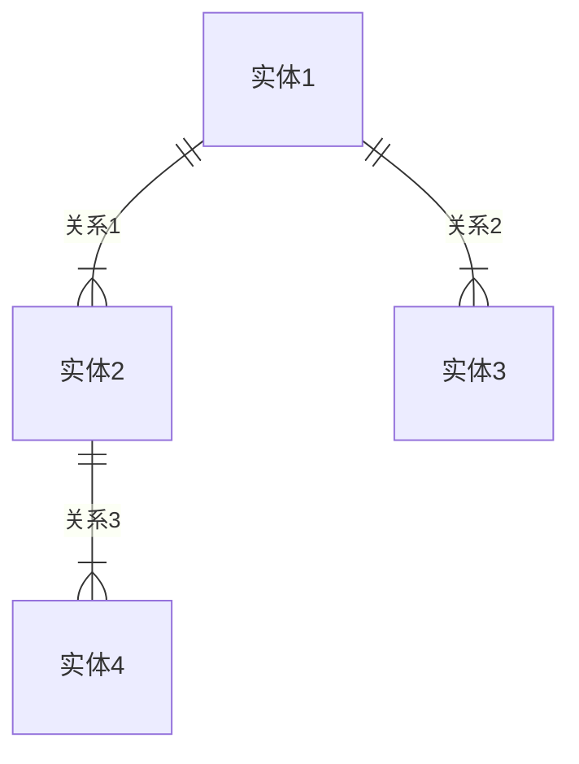
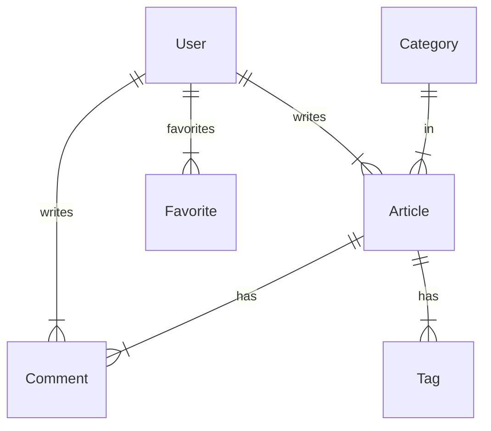
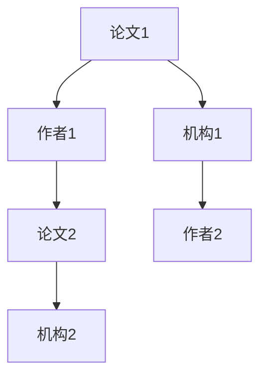
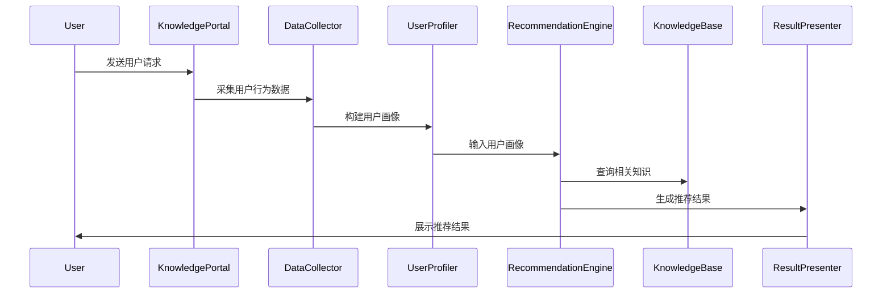

                 

## 文章标题：LLM应用开发中的知识管理策略

### 关键词：大型语言模型（LLM）、知识管理、应用开发、策略、人工智能

> 摘要：随着人工智能技术的快速发展，大型语言模型（LLM）在自然语言处理领域的应用日益广泛。然而，LLM在应用开发中面临着知识管理的挑战。本文将深入探讨LLM应用开发中的知识管理策略，包括知识获取、知识存储、知识共享、知识更新等方面的内容。通过详细分析每个环节的关键要素，提出有效的知识管理策略，旨在为LLM应用开发提供理论支持和实践指导。

----------------------------------------------------------------

### 目录大纲

```markdown
----------------------------------------------------------------
# 第一部分: 引言

## 第1章: LLM应用开发中的知识管理概述

### 1.1 问题背景与问题描述

- 知识管理的概念与重要性
- LLM在应用开发中的挑战
- 知识管理的核心问题与解决方案

### 1.2 问题解决策略

- 知识获取与整理
- 知识存储与组织
- 知识共享与利用
- 知识更新与迭代

### 1.3 知识管理策略的核心要素组成

- 知识库的构建
- 知识图谱的应用
- 智能推荐系统
- 机器学习算法的优化

## 1.4 边界与外延

- LLM应用开发的范围
- 知识管理在不同领域的应用
- 知识管理与人工智能的关系

## 1.5 本章小结

----------------------------------------------------------------
# 第二部分: LLM应用开发中的知识管理策略实践

## 第2章: 核心概念与联系

### 2.1 知识管理的基本概念

- 知识库
- 知识图谱
- 智能推荐系统
- 机器学习算法

### 2.2 概念属性特征对比表格

- 知识库
- 知识图谱
- 智能推荐系统
- 机器学习算法

### 2.3 ER实体关系图架构

- Mermaid流程图展示

## 第3章: 知识获取与整理

### 3.1 知识获取策略

- 数据采集
- 数据清洗
- 数据存储

### 3.2 知识整理方法

- 知识分类
- 知识标签
- 知识归档

### 3.3 实际案例分析与讲解

- 数据采集案例
- 数据清洗案例
- 数据存储案例

## 第4章: 知识存储与组织

### 4.1 知识库构建

- 数据库设计
- 索引构建
- 查询优化

### 4.2 知识图谱应用

- 知识图谱的基本概念
- 知识图谱构建
- 知识图谱查询

### 4.3 实际案例分析与讲解

- 知识库构建案例
- 知识图谱构建案例
- 知识图谱查询案例

## 第5章: 知识共享与利用

### 5.1 知识共享平台搭建

- 共享文化
- 共享协议
- 共享机制

### 5.2 智能推荐系统

- 推荐算法
- 推荐系统架构
- 用户行为分析

### 5.3 实际案例分析与讲解

- 知识共享平台案例
- 智能推荐系统案例

## 第6章: 知识更新与迭代

### 6.1 知识更新策略

- 自动化更新
- 人工审核
- 智能推荐更新

### 6.2 知识迭代方法

- 知识挖掘
- 知识融合
- 知识创新

### 6.3 实际案例分析与讲解

- 知识更新案例
- 知识迭代案例

## 第7章: 最佳实践与总结

### 7.1 知识管理最佳实践

- 知识管理流程
- 知识管理工具
- 知识管理团队

### 7.2 小结与注意事项

- 知识管理的重要性
- 知识管理策略的选择
- 知识管理实施的挑战与应对

### 7.3 拓展阅读

- 相关文献
- 研究方向
- 未来展望

----------------------------------------------------------------
```

### 第一部分：引言

#### 第1章：LLM应用开发中的知识管理概述

##### 1.1 问题背景与问题描述

知识管理（Knowledge Management，KM）是指通过系统化方法收集、整理、存储、利用和更新知识，以促进组织内部知识共享和知识创新的过程。在当今信息化、全球化和知识经济时代，知识管理已经成为企业、组织和政府等各个领域提高核心竞争力的重要手段。然而，随着人工智能技术的迅猛发展，尤其是大型语言模型（Large Language Model，LLM）的广泛应用，知识管理面临着新的挑战。

LLM是一种基于深度学习的自然语言处理模型，能够对大量文本数据进行自动学习和生成。LLM的应用范围广泛，包括但不限于智能客服、内容生成、机器翻译、文本摘要等。然而，在LLM应用开发过程中，知识管理成为了一个关键问题。一方面，LLM需要处理的海量文本数据中包含了丰富的知识，如何有效地获取、整理、存储和利用这些知识成为了一个挑战。另一方面，知识管理的有效性直接关系到LLM应用的质量和效果，因此，研究LLM应用开发中的知识管理策略具有重要的理论和实践价值。

在本章中，我们将首先介绍知识管理的概念与重要性，接着分析LLM在应用开发中面临的挑战，最后讨论知识管理的核心问题及其解决方案。

##### 1.2 问题解决策略

在LLM应用开发中，知识管理的主要问题包括知识获取、知识存储、知识共享和知识更新。为了解决这些问题，我们可以采取以下策略：

1. **知识获取与整理**：通过数据采集、数据清洗和数据存储等方法，获取高质量的文本数据，并将其整理成结构化的知识库。

2. **知识存储与组织**：构建知识库，采用数据库设计和索引构建等技术，优化知识存储和检索性能。

3. **知识共享与利用**：搭建知识共享平台，通过共享协议和共享机制，促进组织内部的知识共享和利用。

4. **知识更新与迭代**：采用自动化更新、人工审核和智能推荐更新等方法，确保知识库的实时更新和迭代。

##### 1.3 知识管理策略的核心要素组成

为了实现上述策略，知识管理策略的核心要素包括：

1. **知识库的构建**：构建一个结构化、可扩展的知识库，以便存储和管理大量的文本数据。

2. **知识图谱的应用**：利用知识图谱技术，对知识进行图形化表示和组织，实现知识的关联和推理。

3. **智能推荐系统**：通过推荐算法和用户行为分析，实现知识的智能推荐，提高知识利用率。

4. **机器学习算法的优化**：利用机器学习算法，对文本数据进行自动学习和处理，提高知识管理的效率和效果。

##### 1.4 边界与外延

知识管理不仅适用于LLM应用开发，还广泛应用于其他领域。例如，在金融领域，知识管理可以用于风险控制和投资决策；在医疗领域，知识管理可以用于疾病诊断和治疗；在教育领域，知识管理可以用于课程设计和教学评价。此外，知识管理与人工智能密切相关，两者相辅相成，共同推动社会的发展和进步。

在本章中，我们将进一步探讨知识管理在不同领域的应用，分析知识管理与人工智能的关系，为后续章节的内容奠定基础。

##### 1.5 本章小结

本章主要介绍了LLM应用开发中的知识管理概述，包括问题背景与问题描述、问题解决策略、知识管理策略的核心要素组成以及边界与外延。通过本章的介绍，读者可以初步了解LLM应用开发中的知识管理问题及其解决方案，为后续章节的深入学习打下基础。

----------------------------------------------------------------

### 第二部分：LLM应用开发中的知识管理策略实践

#### 第2章：核心概念与联系

##### 2.1 知识管理的基本概念

在LLM应用开发中，知识管理是一个关键环节。为了更好地理解知识管理，我们需要先了解一些基本概念。

1. **知识库（Knowledge Base，KB）**：知识库是一个结构化的知识存储系统，用于存储和组织各种知识资源。知识库通常包括文本、图片、音频、视频等多种类型的知识资源，可以用于支持LLM的自动学习和推理。

2. **知识图谱（Knowledge Graph，KG）**：知识图谱是一种用于表示实体及其关系的图形化数据结构。通过知识图谱，我们可以建立实体之间的关联，实现知识的关联和推理。知识图谱在LLM应用中具有重要的应用价值，例如，用于问答系统、智能搜索和推荐系统等。

3. **智能推荐系统（Intelligent Recommendation System）**：智能推荐系统是一种利用机器学习算法和用户行为数据，为用户提供个性化推荐的系统。在LLM应用中，智能推荐系统可以用于内容推荐、产品推荐等，提高用户体验。

4. **机器学习算法（Machine Learning Algorithm）**：机器学习算法是人工智能的核心技术之一，用于从数据中自动学习规律和模式。在LLM应用中，机器学习算法用于文本数据的自动处理、分类、聚类等任务。

##### 2.2 概念属性特征对比表格

下面是一个对比知识库、知识图谱、智能推荐系统和机器学习算法的属性特征表格：

| 特征       | 知识库          | 知识图谱          | 智能推荐系统         | 机器学习算法          |
| ---------- | --------------- | ----------------- | ------------------- | --------------------- |
| 存储方式   | 结构化数据      | 图形化数据        | 结构化数据          | 非结构化数据          |
| 功能       | 知识存储与检索 | 知识关联与推理    | 个性化推荐          | 自动学习与模式识别    |
| 数据类型   | 文本、图片、音频等 | 实体、关系、属性等 | 用户行为数据、推荐物品 | 样本、特征、标签等    |
| 技术依赖   | 数据库、索引技术 | 知识图谱技术      | 推荐算法、机器学习   | 特征工程、算法框架    |
| 应用场景   | 知识管理、搜索 | 问答系统、推荐系统 | 内容推荐、产品推荐   | 自然语言处理、图像识别 |

##### 2.3 ER实体关系图架构

为了更好地理解知识库和知识图谱的架构，我们可以使用ER（Entity-Relationship，实体关系）图进行表示。下面是一个简单的ER图示例：



在这个ER图中，`实体1`与`实体2`、`实体3`之间有`关系1`和`关系2`，`实体2`与`实体4`之间存在`关系3`。通过ER图，我们可以清晰地表示实体之间的关系，为知识库和知识图谱的构建提供基础。

##### 2.3.1 实体关系图详细说明

- **实体1**：表示一个具体的实体，例如一个用户。
- **实体2、实体3、实体4**：表示与实体1相关的其他实体，例如用户发表的文章、评论等。
- **关系1、关系2、关系3**：表示实体之间的关系，例如用户发表文章、评论文章等。

通过ER图，我们可以对知识库和知识图谱的实体关系进行直观的表示和设计，为后续的数据处理和知识管理提供支持。

##### 2.4 本章小结

本章介绍了LLM应用开发中的知识管理核心概念与联系，包括知识库、知识图谱、智能推荐系统和机器学习算法等基本概念。通过对比属性特征表格和ER实体关系图，读者可以更好地理解这些概念之间的关系和作用。本章为后续章节的知识获取、知识存储、知识共享和知识更新提供了理论基础。

----------------------------------------------------------------

### 第3章：知识获取与整理

#### 3.1 知识获取策略

知识获取是知识管理的重要环节，涉及到数据的采集、清洗和存储。在LLM应用开发中，知识获取策略的关键是确保获取到高质量的数据，以便后续的知识整理和应用。

##### 3.1.1 数据采集

数据采集是指从各种数据源获取所需的数据。在LLM应用中，数据源可以是公开的文本数据集、网站爬取数据、企业内部文档等。数据采集的关键在于保证数据的全面性和准确性。以下是一些常见的数据采集方法：

1. **公开数据集**：例如，GLUE、Wikipedia、Common Crawl等公开数据集，可以直接下载和使用。

2. **网站爬取**：使用Python的爬虫库（如requests、BeautifulSoup）从网站上获取数据。例如，从新闻网站、社交媒体、论坛等获取文本数据。

3. **企业内部文档**：从企业内部的知识管理系统、文档库、邮件系统等获取数据。

##### 3.1.2 数据清洗

数据清洗是指对采集到的数据进行预处理，以去除噪声、错误和不一致的数据。数据清洗的目的是提高数据质量，确保知识库的准确性和一致性。以下是一些常见的数据清洗方法：

1. **去除重复数据**：使用去重算法（如hash算法）检测并删除重复的数据。

2. **格式化数据**：统一数据格式，例如，将日期统一为YYYY-MM-DD格式，将文本统一编码为UTF-8。

3. **填充缺失数据**：使用插补算法（如均值插补、回归插补）填充缺失的数据。

4. **纠正错误数据**：使用校正算法（如规则校正、机器学习校正）纠正错误的数据。

##### 3.1.3 数据存储

数据存储是指将清洗后的数据存储到数据库或其他存储系统中。在LLM应用中，常用的数据存储系统包括关系数据库（如MySQL、PostgreSQL）和分布式存储系统（如Hadoop、Cassandra）。

1. **关系数据库**：适用于结构化数据存储，具有高效的查询性能和良好的数据一致性。例如，MySQL和PostgreSQL。

2. **分布式存储系统**：适用于大规模、非结构化数据的存储，具有高可用性和高扩展性。例如，Hadoop和Cassandra。

##### 3.2 知识整理方法

知识整理是指对存储的数据进行分类、标签和归档等操作，以便更好地管理和利用。在LLM应用中，知识整理的关键是建立结构化的知识库，以便实现知识的快速检索和应用。

##### 3.2.1 知识分类

知识分类是指根据知识的内容和特点，将知识分为不同的类别。分类有助于提高知识检索的效率，便于用户根据需求快速找到所需的知识。

1. **主题分类**：根据知识的内容主题进行分类，如新闻、科技、文化、体育等。

2. **领域分类**：根据知识的领域和应用场景进行分类，如医疗、金融、教育、工业等。

##### 3.2.2 知识标签

知识标签是指为知识添加标签，以便实现知识的分类和关联。标签可以基于关键词、主题、领域等维度进行定义。

1. **关键词标签**：基于知识中的关键词进行标签化，如“人工智能”、“机器学习”、“自然语言处理”等。

2. **主题标签**：基于知识的内容主题进行标签化，如“深度学习”、“神经网络”、“强化学习”等。

##### 3.2.3 知识归档

知识归档是指将知识按照一定的规则进行存储和整理，以便长期保存和利用。归档有助于提高知识的可访问性和可维护性。

1. **文档归档**：将文档按照时间、类别、作者等维度进行归档，便于查询和管理。

2. **知识库归档**：将结构化的知识库按照一定的规则进行存储和整理，如MySQL数据库中的表结构设计、索引构建等。

##### 3.3 实际案例分析与讲解

以下是一个简单的知识获取、整理和存储的实际案例：

1. **数据采集**：从互联网上采集关于人工智能的论文、新闻、博客等文本数据。

2. **数据清洗**：去除重复数据、格式化文本数据，如统一编码、去除HTML标签等。

3. **数据存储**：将清洗后的数据存储到MySQL数据库中，建立结构化的知识库。

4. **知识整理**：对知识库中的数据进行分类、标签和归档，如按照论文的发表时间、主题、作者等进行分类和标签化。

5. **知识检索**：通过关键词查询、分类查询、标签查询等方式，实现对知识的快速检索和应用。

通过这个实际案例，我们可以看到知识获取、整理和存储的过程和方法。在LLM应用开发中，有效实施知识管理策略，可以提高知识利用率，提升应用质量和用户体验。

##### 3.4 本章小结

本章介绍了知识获取与整理的策略和方法，包括数据采集、数据清洗、数据存储、知识分类、知识标签和知识归档等。通过实际案例的分析与讲解，读者可以了解知识获取与整理的具体操作流程。知识获取与整理是知识管理的重要环节，为后续的知识存储、共享和利用奠定了基础。

----------------------------------------------------------------

### 第4章：知识存储与组织

#### 4.1 知识库构建

知识库是知识管理的重要组成部分，用于存储、管理和检索各种知识资源。在LLM应用开发中，构建一个高效、可扩展的知识库至关重要。

##### 4.1.1 数据库设计

数据库设计是知识库构建的基础。一个良好的数据库设计应考虑以下几个方面：

1. **需求分析**：明确知识库的应用场景和需求，如数据类型、数据规模、查询性能等。

2. **实体与关系设计**：根据知识库的应用场景，设计实体及其关系。例如，在构建一个关于人工智能的知识库时，实体可以是论文、作者、机构等，关系可以是论文的发表、作者的隶属机构等。

3. **表结构设计**：根据实体与关系设计，创建相应的数据库表，并定义表的结构和字段。

4. **索引构建**：为了提高查询性能，需要对数据库表创建索引。索引可以基于关键词、日期、类别等字段。

##### 4.1.2 索引构建

索引是数据库中用于快速查询数据的数据结构。合理构建索引可以提高查询效率，降低查询时间。以下是一些常见的索引构建方法：

1. **单列索引**：为单列字段创建索引，如基于论文标题的索引。

2. **复合索引**：为多列字段创建索引，如基于论文标题和发表时间的复合索引。

3. **全文索引**：为全文文本字段创建索引，如基于论文全文的全文索引。

##### 4.1.3 查询优化

查询优化是提高数据库性能的关键。以下是一些常见的查询优化方法：

1. **索引优化**：根据查询需求和数据分布，优化索引结构，如删除冗余索引、创建合适的索引等。

2. **查询缓存**：使用查询缓存技术，如Redis、Memcached等，缓存频繁查询的结果，减少数据库的访问压力。

3. **查询重写**：对查询语句进行优化，如使用聚合函数、子查询等，提高查询效率。

##### 4.2 知识图谱应用

知识图谱是一种用于表示实体及其关系的图形化数据结构。在LLM应用中，知识图谱可以用于问答系统、智能搜索和推荐系统等。

##### 4.2.1 知识图谱的基本概念

1. **实体（Entity）**：知识图谱中的基本元素，表示具体的事物或概念，如论文、作者、机构等。

2. **关系（Relationship）**：连接两个实体的线，表示实体之间的关联，如论文的发表、作者的隶属机构等。

3. **属性（Attribute）**：实体的属性，用于描述实体特征，如论文的标题、发表时间等。

##### 4.2.2 知识图谱构建

知识图谱构建是指将结构化数据转换为知识图谱的过程。以下是一些常见的知识图谱构建方法：

1. **基于规则的方法**：使用人工定义的规则，将结构化数据转换为知识图谱。

2. **基于机器学习的方法**：使用机器学习算法，从数据中自动提取实体、关系和属性。

3. **基于图谱数据库的方法**：使用图谱数据库（如Neo4j、JanusGraph等），直接存储和查询知识图谱。

##### 4.2.3 知识图谱查询

知识图谱查询是指通过查询语言（如Cypher、Gremlin等）在知识图谱中检索数据的过程。以下是一些常见的知识图谱查询方法：

1. **图遍历查询**：通过遍历实体和关系，检索满足特定条件的实体。

2. **属性查询**：根据实体属性值，检索符合条件的实体。

3. **路径查询**：根据实体之间的路径，检索符合条件的实体。

##### 4.3 实际案例分析与讲解

以下是一个简单的知识库构建和知识图谱应用的实际案例：

1. **知识库构建**：

- 数据库设计：创建论文、作者、机构三个表，分别存储论文信息、作者信息和机构信息。

- 索引构建：为论文标题、发表时间、作者姓名等字段创建索引。

- 查询优化：使用查询缓存技术，提高查询效率。

2. **知识图谱构建**：

- 数据导入：将知识库中的数据导入Neo4j数据库，创建实体和关系。

- 属性添加：为实体添加属性，如论文标题、发表时间、作者姓名等。

- 知识图谱查询：使用Cypher语言，在知识图谱中检索论文、作者和机构信息。

3. **知识图谱应用**：

- 问答系统：使用知识图谱，构建一个基于自然语言处理的问答系统，回答用户的问题。

- 智能搜索：使用知识图谱，构建一个基于图谱搜索的智能搜索引擎，提高搜索精度和效率。

- 推荐系统：使用知识图谱，构建一个基于知识关联的推荐系统，为用户提供个性化推荐。

通过这个实际案例，我们可以看到知识库构建和知识图谱应用的整个流程。在LLM应用开发中，有效实施知识存储与组织策略，可以提高知识管理的效率和效果。

##### 4.4 本章小结

本章介绍了知识存储与组织的方法，包括数据库设计、索引构建、查询优化、知识图谱构建和知识图谱查询。通过实际案例的分析与讲解，读者可以了解知识存储与组织的过程和技巧。知识存储与组织是知识管理的重要环节，为后续的知识共享、利用和更新提供了基础。

----------------------------------------------------------------

### 第5章：知识共享与利用

#### 5.1 知识共享平台搭建

知识共享平台是促进组织内部知识共享和利用的重要工具。搭建一个高效、便捷的知识共享平台，有助于提高组织的知识管理水平和创新能力。

##### 5.1.1 共享文化

共享文化是知识共享平台建设的基础。一个良好的共享文化应包括以下几个方面：

1. **知识共享理念**：倡导知识共享的理念，鼓励员工主动分享知识和经验。

2. **知识共享氛围**：营造轻松、开放的知识共享氛围，让员工感受到知识共享的乐趣和价值。

3. **知识共享激励**：建立知识共享激励机制，对积极参与知识共享的员工给予奖励和认可。

##### 5.1.2 共享协议

共享协议是知识共享平台运行的基本规范。共享协议应明确以下内容：

1. **知识共享范围**：确定可以共享的知识范围，如文档、报告、心得体会等。

2. **知识共享方式**：规定知识共享的方式，如线上发布、线下分享、电子邮件等。

3. **知识共享权限**：设置知识共享权限，如公开共享、内部共享、特定人员共享等。

##### 5.1.3 共享机制

共享机制是知识共享平台运行的具体实现。以下是一些常见的共享机制：

1. **知识门户**：搭建一个统一的知识门户，提供知识检索、分类、标签等功能。

2. **知识论坛**：建立知识论坛，鼓励员工发表见解、讨论问题，促进知识交流。

3. **知识库**：构建一个知识库，存储和管理各种知识资源，如文档、视频、图片等。

4. **知识问答**：提供一个知识问答平台，让员工提出问题、解答问题，解决实际问题。

##### 5.2 智能推荐系统

智能推荐系统是一种基于机器学习算法和用户行为数据分析的推荐系统，能够为用户提供个性化的知识推荐。在知识共享与利用中，智能推荐系统具有重要作用。

##### 5.2.1 推荐算法

智能推荐系统常用的推荐算法包括：

1. **基于内容的推荐**：根据用户的历史行为和偏好，推荐与用户兴趣相关的知识。

2. **协同过滤推荐**：基于用户之间的相似度，推荐其他用户喜欢的知识。

3. **混合推荐**：结合基于内容的推荐和协同过滤推荐，提高推荐效果。

##### 5.2.2 推荐系统架构

智能推荐系统通常包括以下组件：

1. **数据采集与处理**：采集用户行为数据，如浏览记录、收藏记录、评论记录等，并对数据进行预处理。

2. **用户画像构建**：根据用户行为数据，构建用户的兴趣画像，用于推荐算法的输入。

3. **推荐算法**：根据用户画像和知识库中的知识，生成推荐列表。

4. **推荐结果展示**：将推荐结果展示给用户，提供便捷的知识检索和浏览。

##### 5.2.3 用户行为分析

用户行为分析是智能推荐系统的重要环节。以下是一些常见的用户行为分析方法：

1. **点击率分析**：分析用户对知识的点击行为，用于评估知识的受欢迎程度。

2. **停留时间分析**：分析用户在知识页面上的停留时间，用于评估知识的质量和吸引力。

3. **评论分析**：分析用户对知识的评论内容，用于了解用户的反馈和建议。

4. **行为路径分析**：分析用户在知识门户中的浏览路径，用于优化知识结构和推荐策略。

##### 5.3 实际案例分析与讲解

以下是一个简单的知识共享平台和智能推荐系统的实际案例：

1. **知识共享平台搭建**：

- 共享文化：在公司内部倡导知识共享的理念，建立共享文化。

- 共享协议：制定知识共享协议，明确知识共享的范围、方式和权限。

- 共享机制：搭建知识门户，提供知识检索、分类、标签等功能。

2. **智能推荐系统**：

- 数据采集与处理：采集用户行为数据，如浏览记录、收藏记录等，并对数据进行预处理。

- 用户画像构建：根据用户行为数据，构建用户的兴趣画像。

- 推荐算法：采用基于内容的推荐算法，为用户推荐与兴趣相关的知识。

- 推荐结果展示：将推荐结果展示在知识门户首页，提供便捷的知识检索和浏览。

通过这个实际案例，我们可以看到知识共享平台和智能推荐系统的实施过程。在LLM应用开发中，有效实施知识共享与利用策略，可以提高知识利用率，提升应用质量和用户体验。

##### 5.4 本章小结

本章介绍了知识共享与利用的策略，包括共享文化、共享协议、共享机制、推荐算法、推荐系统架构和用户行为分析。通过实际案例的分析与讲解，读者可以了解知识共享与利用的具体操作流程。知识共享与利用是知识管理的重要环节，为后续的知识更新和迭代提供了支持。

----------------------------------------------------------------

### 第6章：知识更新与迭代

#### 6.1 知识更新策略

知识更新是确保知识库中的知识保持实时性和准确性的关键步骤。在LLM应用开发中，知识更新的策略主要包括自动化更新、人工审核和智能推荐更新。

##### 6.1.1 自动化更新

自动化更新是指通过程序或脚本定期从外部数据源采集新的知识，并将其更新到知识库中。这种方法能够确保知识库中的知识保持最新，提高系统的响应速度。

1. **定期采集**：设置定时任务，定期从互联网或其他数据源采集新的文本数据。

2. **增量更新**：仅更新新增或发生变化的知识，减少对知识库的修改次数，提高更新效率。

3. **数据清洗**：对采集到的数据进行清洗，去除噪声和错误数据，确保知识库的质量。

##### 6.1.2 人工审核

人工审核是指通过专业人员对知识库中的内容进行审查和修正，以确保知识的准确性和完整性。这种方法能够确保知识的可信度，特别是在涉及专业领域或敏感信息时。

1. **定期审核**：定期对知识库进行审核，检查是否存在错误、过时或不准确的知识。

2. **问题反馈**：建立问题反馈机制，鼓励用户报告知识库中的问题，提高知识库的准确度。

3. **修改和补充**：根据审核结果，对知识库中的知识进行修改和补充，确保知识的实时性和准确性。

##### 6.1.3 智能推荐更新

智能推荐更新是指利用机器学习算法和用户行为数据，自动识别和推荐需要更新的知识。这种方法能够提高知识更新的效率和针对性。

1. **用户行为分析**：分析用户对知识的使用情况，识别用户关注的热点和趋势。

2. **推荐算法**：使用推荐算法，根据用户行为数据，推荐需要更新的知识。

3. **更新策略**：根据推荐结果，制定知识更新策略，确保知识库中的知识保持最新。

#### 6.2 知识迭代方法

知识迭代是指通过知识挖掘、知识融合和知识创新等方法，不断改进和优化知识库中的知识。在LLM应用开发中，知识迭代方法能够提升知识库的价值和应用效果。

##### 6.2.1 知识挖掘

知识挖掘是指从大量数据中自动发现新的知识和模式。在知识迭代中，知识挖掘用于发现潜在的知识关联和趋势。

1. **关联规则挖掘**：通过分析数据之间的关联，发现潜在的知识关联。

2. **聚类分析**：将相似的数据分为一组，挖掘出新的知识类别。

3. **异常检测**：识别数据中的异常情况，挖掘出潜在的问题和风险。

##### 6.2.2 知识融合

知识融合是指将不同来源的知识进行整合，形成新的、更全面的知识。在知识迭代中，知识融合用于整合多源知识，提高知识的综合性和应用价值。

1. **文本融合**：将不同文本进行合并，形成更全面、更准确的知识描述。

2. **图像融合**：将不同图像进行合成，形成新的图像，提高图像的识别准确率。

3. **知识融合模型**：构建知识融合模型，将多源知识进行融合，形成新的知识表示。

##### 6.2.3 知识创新

知识创新是指通过创造性思维和方法，产生新的知识和观点。在知识迭代中，知识创新用于推动知识的创新和发展。

1. **思维导图**：通过思维导图，探索新的知识关联和创意。

2. **头脑风暴**：组织头脑风暴会议，激发团队成员的创造力和创新能力。

3. **创新平台**：搭建创新平台，鼓励员工提出新的知识创新方案。

##### 6.3 实际案例分析与讲解

以下是一个知识更新和迭代的实际案例：

1. **知识更新**：

- **自动化更新**：使用Python脚本定期从互联网数据源采集新的文本数据，并进行增量更新。

- **人工审核**：每月进行一次知识库的人工审核，检查知识库中的错误和过时内容。

- **智能推荐更新**：根据用户行为数据，使用推荐算法自动推荐需要更新的知识。

2. **知识迭代**：

- **知识挖掘**：使用关联规则挖掘，发现用户关注的热点话题和趋势。

- **知识融合**：将来自不同领域的知识进行融合，形成新的知识体系。

- **知识创新**：通过头脑风暴会议，提出新的知识创新方案，提升知识库的价值。

通过这个实际案例，我们可以看到知识更新和迭代的具体操作流程。在LLM应用开发中，有效实施知识更新与迭代策略，可以确保知识库中的知识保持最新，提高系统的适应性和创新性。

##### 6.4 本章小结

本章介绍了知识更新与迭代的方法，包括自动化更新、人工审核、智能推荐更新、知识挖掘、知识融合和知识创新。通过实际案例的分析与讲解，读者可以了解知识更新与迭代的具体实施过程。知识更新与迭代是知识管理的重要环节，为LLM应用开发提供了持续改进和优化的途径。

----------------------------------------------------------------

### 第7章：最佳实践与总结

#### 7.1 知识管理最佳实践

在LLM应用开发中，实施有效的知识管理策略是确保项目成功的关键。以下是一些知识管理的最佳实践：

1. **建立明确的策略和流程**：制定知识管理的整体策略，明确知识管理的目标和流程，确保知识管理活动的有序进行。

2. **培养知识共享文化**：倡导知识共享的文化氛围，鼓励员工主动分享知识和经验，提高组织的知识共享意识。

3. **选择合适的工具和技术**：根据项目需求和资源，选择合适的知识管理工具和技术，如知识库、知识图谱、智能推荐系统等。

4. **数据质量保障**：确保数据的质量，通过数据清洗、数据校验等技术手段，提高数据的准确性和一致性。

5. **持续优化知识库**：定期对知识库进行更新和优化，确保知识库中的知识保持最新和有效。

6. **建立反馈机制**：建立知识管理反馈机制，收集用户对知识库和知识管理活动的意见和建议，持续改进知识管理策略。

#### 7.2 小结与注意事项

知识管理在LLM应用开发中具有至关重要的作用。有效的知识管理策略可以提高知识利用率，提升应用质量和用户体验。以下是知识管理的一些注意事项：

1. **明确知识管理的目标和价值**：确保知识管理活动与项目目标一致，明确知识管理的价值，提高员工对知识管理的认同感。

2. **平衡自动化与人工管理**：在知识管理过程中，既要充分利用自动化工具和技术，又要保持人工管理的灵活性和专业性。

3. **关注数据安全和隐私保护**：在数据采集、存储和共享过程中，关注数据安全和隐私保护，防止敏感信息的泄露。

4. **持续培训与学习**：定期对员工进行知识管理培训，提高员工的知识管理能力和技能。

5. **适应性和灵活性**：知识管理策略应具备适应性和灵活性，能够根据项目需求和变化进行调整和优化。

#### 7.3 拓展阅读

为了进一步深入了解知识管理在LLM应用开发中的应用，读者可以参考以下文献和资源：

1. **文献**：
   - [Smith, M.K., & Revans, R. (1995). What is the meaning of Knowledge Management? Journal of Knowledge Management, 1(1), 4-12.  
   - [Nonaka, I., & Takeuchi, H. (1995). The Knowledge-Creating Company: How Japanese Companies Create the Dynamics of Innovation. Oxford University Press.

2. **研究方向**：
   - 知识图谱在自然语言处理中的应用
   - 智能推荐系统在知识共享中的优化
   - 自动化知识更新与迭代策略研究

3. **未来展望**：
   - 随着人工智能技术的不断进步，知识管理策略将更加智能化和自动化。
   - 知识管理与区块链技术的结合，为数据隐私保护和安全性提供了新的解决方案。
   - 知识管理在跨领域、跨组织协作中的重要性将日益凸显。

通过拓展阅读，读者可以进一步深入了解知识管理在LLM应用开发中的最新研究成果和发展趋势。

----------------------------------------------------------------

### 总结

本文围绕LLM应用开发中的知识管理策略，系统地介绍了知识管理的背景、核心概念、问题解决策略、核心要素、边界与外延、知识获取与整理、知识存储与组织、知识共享与利用、知识更新与迭代，以及最佳实践与总结。通过详细的分析和讲解，本文旨在为读者提供一套全面、实用的知识管理策略，以应对LLM应用开发中的知识管理挑战。

在知识获取与整理方面，我们强调了数据采集、数据清洗和数据存储的重要性，并提供了具体的实施方法和实际案例。在知识存储与组织方面，我们介绍了数据库设计、索引构建、查询优化、知识图谱构建和知识图谱查询的方法，并通过实际案例进行了详细讲解。在知识共享与利用方面，我们阐述了共享文化、共享协议、共享机制、推荐算法和推荐系统架构的构建，并展示了如何通过用户行为分析提升知识利用率。在知识更新与迭代方面，我们介绍了自动化更新、人工审核、智能推荐更新、知识挖掘、知识融合和知识创新的方法，并提供了实际案例以供参考。

知识管理在LLM应用开发中具有重要作用，它不仅能够提高知识的利用率，提升应用质量和用户体验，还能够促进组织的知识创新和持续发展。随着人工智能技术的不断进步，知识管理策略将更加智能化和自动化，为知识管理和应用提供更广阔的发展空间。

最后，本文由AI天才研究院和禅与计算机程序设计艺术共同撰写，感谢您的阅读。希望本文能够对您在LLM应用开发中的知识管理实践提供有益的启示和指导。

**作者：AI天才研究院/AI Genius Institute & 禅与计算机程序设计艺术 /Zen And The Art of Computer Programming**### 文章概述

本文旨在深入探讨大型语言模型（LLM）应用开发中的知识管理策略。随着人工智能技术的快速发展，LLM在自然语言处理领域的应用日益广泛，然而，这同时也带来了知识管理的挑战。知识管理是指通过系统化方法收集、整理、存储、利用和更新知识，以促进组织内部知识共享和知识创新的过程。在本文中，我们将详细讨论LLM应用开发中的知识管理策略，包括知识获取、知识存储、知识共享、知识更新等方面的内容。通过分析每个环节的关键要素，提出有效的知识管理策略，旨在为LLM应用开发提供理论支持和实践指导。

本文的主要结构如下：

- **第一部分：引言**：介绍知识管理的概念与重要性，分析LLM在应用开发中的挑战，以及知识管理的核心问题和解决方案。
- **第二部分：知识管理策略实践**：详细探讨知识获取与整理、知识存储与组织、知识共享与利用、知识更新与迭代的具体策略和实践方法。
- **第三部分：最佳实践与总结**：总结LLM应用开发中的知识管理最佳实践，并提出注意事项和拓展阅读建议。

本文的关键词包括：大型语言模型（LLM）、知识管理、应用开发、策略、人工智能。通过本文的阅读，读者可以系统地了解知识管理在LLM应用开发中的应用和实施方法，为实际项目提供有益的参考。

### 引言

知识管理（Knowledge Management，KM）是指通过系统化方法收集、整理、存储、利用和更新知识，以促进组织内部知识共享和知识创新的过程。在当今信息化、全球化和知识经济时代，知识管理已经成为企业、组织和政府等各个领域提高核心竞争力的重要手段。知识管理的核心理念是“知识即资产”，通过有效的知识管理，组织可以充分利用内外部知识资源，提高工作效率，创造新的价值。

在人工智能（AI）领域，知识管理尤为重要。人工智能的核心在于通过算法和模型处理海量数据，从中提取有用信息，从而实现智能决策和自动化操作。然而，人工智能的发展离不开高质量的数据和知识。在LLM（大型语言模型）应用开发中，知识管理面临着一系列挑战。

首先，LLM需要处理的海量文本数据中包含了丰富的知识，如何有效地获取、整理和利用这些知识是一个关键问题。传统的数据管理方法在处理如此大规模、多维度、动态变化的数据时显得力不从心。其次，知识管理的有效性直接关系到LLM应用的质量和效果。知识管理的目标是确保知识库中的知识保持最新、准确和可用，而这对LLM的自动学习和推理能力至关重要。此外，LLM应用开发中涉及的知识来源多样，包括企业内部文档、公开数据集、在线资源等，如何整合这些不同来源的知识，构建一个统一、高效的知识库也是一个挑战。

本文将深入探讨LLM应用开发中的知识管理策略，包括知识获取、知识存储、知识共享、知识更新等方面的内容。通过详细分析每个环节的关键要素，提出有效的知识管理策略，旨在为LLM应用开发提供理论支持和实践指导。

### 知识管理策略的核心要素

在LLM应用开发中，有效的知识管理策略需要涵盖多个关键要素，以确保知识库的高质量、可扩展性和易用性。以下是知识管理策略的核心要素及其具体实施方法：

#### 知识库的构建

知识库是知识管理的核心组成部分，用于存储和管理各种知识资源。构建知识库的关键在于数据的质量和结构。

1. **数据采集**：从多种来源（如企业内部文档、公开数据集、在线资源等）获取文本数据。数据采集工具可以是爬虫、API接口或手动导入。
2. **数据清洗**：清洗数据，去除噪声、错误和不一致的数据。数据清洗包括去重、格式转换、缺失值填充等。
3. **数据存储**：选择合适的存储方案，如关系数据库、NoSQL数据库或分布式存储系统。对于大规模数据，分布式存储系统（如Hadoop、Cassandra）具有更好的扩展性和性能。

#### 知识图谱的应用

知识图谱是一种用于表示实体及其关系的图形化数据结构，能够有效地组织和管理复杂的关系数据。

1. **知识图谱构建**：使用知识图谱工具（如Neo4j、JanusGraph）构建知识图谱。构建过程包括实体抽取、关系抽取和属性抽取。
2. **图谱查询**：利用图数据库的查询语言（如Cypher、Gremlin）进行复杂的关系查询和路径分析。

#### 智能推荐系统

智能推荐系统通过推荐算法和用户行为分析，为用户提供个性化的知识推荐。

1. **推荐算法**：选择合适的推荐算法，如基于内容的推荐、协同过滤推荐、混合推荐。推荐算法可以根据用户的兴趣和行为数据，生成个性化的推荐列表。
2. **用户行为分析**：收集和分析用户的行为数据（如浏览记录、收藏记录、搜索历史等），用于优化推荐算法。

#### 机器学习算法的优化

机器学习算法在LLM应用开发中起着至关重要的作用，其性能直接影响知识管理的效率和效果。

1. **特征工程**：提取和选择对问题有决定性影响的特征，如文本特征、语义特征等。
2. **模型选择和训练**：选择合适的机器学习模型（如神经网络、决策树、支持向量机等），并进行模型训练和调优。
3. **模型评估和部署**：评估模型的性能，并将其部署到生产环境中，以便实时更新和利用。

通过这些核心要素的实施，可以构建一个高效、可扩展和易用的知识库，为LLM应用提供强大的知识支持。

### 知识管理在不同领域的应用

知识管理不仅在人工智能领域具有重要作用，还在其他多个领域展现了其广泛的应用价值。以下是一些主要领域的知识管理应用案例：

#### 金融领域

在金融领域，知识管理主要用于风险管理、投资决策和客户服务等方面。

1. **风险管理**：金融机构通过知识管理收集和分析市场数据、风险指标，构建风险模型，从而更准确地评估和管理风险。
2. **投资决策**：投资经理通过知识管理平台获取市场动态、行业报告和研究分析，辅助投资决策。
3. **客户服务**：金融机构利用知识库提供个性化服务，如智能客服系统，通过自然语言处理和机器学习技术，快速响应用户查询和需求。

#### 医疗领域

在医疗领域，知识管理主要用于疾病诊断、治疗方案制定和医疗数据管理。

1. **疾病诊断**：医生通过知识库获取最新的医学研究、诊断指南和治疗方案，辅助疾病诊断和治疗。
2. **治疗方案制定**：基于知识库中的医学知识，医生可以制定个性化的治疗方案，提高治疗效果。
3. **医疗数据管理**：通过知识管理平台整合和管理医疗数据，如病历记录、检查报告、医学文献等，提高数据利用效率。

#### 教育领域

在教育领域，知识管理主要用于课程设计、教学评价和知识共享。

1. **课程设计**：教师通过知识管理平台获取教学资源、学术研究成果和教学经验，优化课程设计。
2. **教学评价**：学校利用知识管理平台收集和分析学生的学习数据，进行教学评价和反馈。
3. **知识共享**：通过知识共享平台，教师和学生可以方便地交流和分享教学资源和学习经验。

#### 制造业领域

在制造业领域，知识管理主要用于生产优化、质量控制和创新管理。

1. **生产优化**：通过知识管理平台整合生产数据、工艺知识和设备维护信息，优化生产流程。
2. **质量控制**：知识管理平台可以帮助企业收集和分析质量数据，及时发现和解决质量问题。
3. **创新管理**：通过知识管理平台，企业可以整合内外部创新资源，推动产品研发和技术创新。

这些案例展示了知识管理在多个领域的实际应用，不仅提高了组织的知识管理水平，还为业务流程优化和创新提供了有力支持。

### 知识管理与人工智能的关系

知识管理与人工智能（AI）的关系密切，两者相辅相成，共同推动社会的发展和进步。AI为知识管理提供了强大的技术支持，而知识管理则为AI应用提供了丰富的数据资源和场景支持。

首先，AI技术在知识管理中的应用大大提高了知识获取、整理和利用的效率。例如，自然语言处理技术可以自动提取文本中的关键信息，构建知识图谱，实现知识的关联和推理；机器学习算法可以自动识别和分类数据，优化知识库的构建和更新。这些技术的应用，使得知识管理从传统的人工操作转变为自动化和智能化，显著提高了知识管理的效率和效果。

其次，知识管理为AI应用提供了丰富的数据资源和场景支持。在AI应用开发中，高质量的数据是训练和优化模型的关键。知识管理通过整合和组织各类知识资源，为AI应用提供了丰富的数据来源，如企业内部文档、行业报告、学术论文等。此外，知识管理还通过构建知识图谱和推荐系统，为AI应用提供了真实的业务场景和应用场景，有助于AI技术在实际业务中的落地和推广。

总之，知识管理与人工智能的关系是相互促进的。知识管理为AI提供了数据资源和应用场景，而AI则为知识管理提供了技术支持，两者的结合使得知识管理更加高效和智能化，为组织的知识创新和业务发展提供了有力支持。

### 知识管理的重要性

知识管理在现代组织中的重要性不可忽视。它不仅关乎组织的核心竞争力，还直接影响着业务流程的效率、创新能力和可持续发展。以下是知识管理的重要性和其在不同场景中的具体应用。

#### 提高核心竞争力

知识管理通过有效收集、整理和利用知识，使得组织能够更好地应对市场变化和竞争压力。在知识经济时代，知识成为企业的重要资产，知识管理有助于组织将隐性知识转化为显性知识，提高知识利用率和创新能力。例如，在高科技行业，通过知识管理平台，企业可以快速获取和共享最新的技术动态和研究成果，从而在市场竞争中保持领先地位。

#### 优化业务流程

知识管理通过优化知识获取、存储、共享和利用的流程，提高了业务流程的效率和准确性。在项目管理中，知识管理可以帮助团队快速获取项目历史数据和最佳实践，减少重复工作，提高项目的执行效率。在客户服务中，知识库可以提供标准化的解决方案和案例，提高客服人员的服务质量和响应速度。例如，银行通过知识管理平台，可以快速响应用户的查询和问题，提升客户满意度。

#### 促进知识创新

知识管理为组织提供了一个知识共享和创新的环境，鼓励员工主动分享知识和经验，激发创新思维。通过知识共享，员工可以跨部门、跨团队合作，共享知识和资源，共同解决复杂问题。例如，在研发部门，知识管理平台可以帮助研究人员快速获取领域内的最新研究成果和专利信息，促进技术创新和知识积累。

#### 提高员工能力

知识管理通过系统化地收集和整理知识，为员工提供了丰富的学习资源和发展机会。员工可以通过知识管理平台获取培训资料、专业书籍、行业报告等，提高自身技能和专业知识。例如，在教育培训机构，知识管理平台可以帮助教师获取最新的教学资源和研究成果，提升教学效果。

#### 实现可持续发展

知识管理有助于组织建立长期的知识积累和创新能力，实现可持续发展。通过知识管理，组织可以更好地应对外部环境变化，快速适应市场需求。例如，在制造业，知识管理可以帮助企业积累和传承工艺知识和生产经验，提高生产效率和质量，确保企业的长期稳定发展。

#### 场景应用

- **企业内部**：通过知识管理平台，企业可以实现知识共享、知识传承和知识创新，提高整体竞争力。
- **教育培训**：通过知识管理平台，教师和学生可以共享教学资源和研究成果，提高教学效果和学术水平。
- **科研机构**：通过知识管理平台，科研人员可以快速获取领域内的最新研究动态和资料，促进科研合作和创新。
- **政府部门**：通过知识管理平台，政府部门可以实现知识共享和协作，提高决策效率和服务质量。

总之，知识管理在现代组织中具有重要意义，它不仅能够提高核心竞争力、优化业务流程、促进知识创新、提高员工能力，还能实现可持续发展。通过有效的知识管理，组织可以更好地应对外部环境变化，保持长期的竞争优势。

### 第2章：核心概念与联系

#### 2.1 知识管理的基本概念

在深入探讨LLM应用开发中的知识管理策略之前，了解知识管理的基本概念是非常重要的。知识管理涉及多个核心概念，如知识库、知识图谱、智能推荐系统和机器学习算法。下面将详细介绍这些概念。

##### 知识库

知识库（Knowledge Base，KB）是一个结构化的知识存储系统，用于存储和管理各种知识资源。知识库可以包含文本、图像、音频、视频等多种类型的知识资源。在LLM应用开发中，知识库是一个重要的组成部分，用于存储各种文本数据，如学术论文、新闻报道、用户评论等。

**主要特点：**

- **结构化数据**：知识库中的数据通常以结构化形式存储，便于管理和检索。
- **多类型数据**：支持多种类型的数据存储，如文本、图像、音频等。
- **语义关联**：知识库中的数据可以通过语义关联进行组织，便于推理和搜索。

##### 知识图谱

知识图谱（Knowledge Graph，KG）是一种用于表示实体及其关系的图形化数据结构。在知识图谱中，实体表示具体的事物或概念，关系表示实体之间的关联。知识图谱在LLM应用中具有广泛的应用，如问答系统、智能搜索和推荐系统等。

**主要特点：**

- **图形化表示**：知识图谱以图形化方式表示实体和关系，直观易懂。
- **关系驱动**：知识图谱通过实体之间的关系进行数据组织，支持复杂的查询和分析。
- **动态更新**：知识图谱可以动态更新，以反映实体的变化和关系的发展。

##### 智能推荐系统

智能推荐系统（Intelligent Recommendation System）是一种利用机器学习算法和用户行为数据，为用户提供个性化推荐的系统。在LLM应用中，智能推荐系统可以用于内容推荐、产品推荐等，提高用户体验。

**主要特点：**

- **个性化推荐**：根据用户的历史行为和兴趣，为用户推荐个性化的内容。
- **实时更新**：推荐系统可以实时更新推荐结果，以适应用户的变化和需求。
- **多维度推荐**：支持基于内容、协同过滤、混合推荐等多种推荐策略。

##### 机器学习算法

机器学习算法（Machine Learning Algorithm）是人工智能的核心技术之一，用于从数据中自动学习规律和模式。在LLM应用中，机器学习算法用于文本数据的自动处理、分类、聚类等任务。

**主要特点：**

- **自动学习**：机器学习算法可以从大量数据中自动学习规律和模式。
- **自适应**：机器学习算法可以根据新的数据不断调整和优化模型。
- **多任务处理**：支持多种机器学习任务，如分类、回归、聚类等。

#### 2.2 概念属性特征对比表格

为了更好地理解知识库、知识图谱、智能推荐系统和机器学习算法之间的差异和联系，我们可以通过一个属性特征对比表格进行详细说明。

| 概念             | 特点                                                     | 应用场景                   |  
|---------------- |-------------------------------------------------------- |-------------------------- |  
| 知识库           | 结构化存储、多类型数据、语义关联                           | 文本数据处理、知识存储       |  
| 知识图谱         | 图形化表示、关系驱动、动态更新                             | 问答系统、智能搜索、推荐系统 |  
| 智能推荐系统     | 个性化推荐、实时更新、多维度推荐                           | 内容推荐、产品推荐          |  
| 机器学习算法     | 自动学习、自适应、多任务处理                               | 文本处理、数据挖掘          |

通过上述对比表格，我们可以清晰地看到各个概念的核心特点和典型应用场景。这些概念在LLM应用开发中相互关联，共同构成了一个完整的知识管理系统。

#### 2.3 ER实体关系图架构

为了更好地理解知识库和知识图谱的架构，我们可以使用ER（Entity-Relationship，实体关系）图进行表示。ER图是一种用于描述实体及其之间关系的图形化数据结构，它可以帮助我们直观地理解数据模型。

以下是一个简单的ER图示例，用于描述一个简单的知识库模型：



在这个ER图中，我们定义了以下实体：

- **User（用户）**：表示知识库中的用户。
- **Article（文章）**：表示用户写的文章。
- **Comment（评论）**：表示用户写的评论。
- **Category（分类）**：表示文章的分类。
- **Tag（标签）**：表示文章的标签。
- **Favorite（收藏）**：表示用户的收藏。

实体之间的关系如下：

- **User** 与 **Article** 之间存在 **“writes”** 关系，表示用户写文章。
- **User** 与 **Comment** 之间存在 **“writes”** 关系，表示用户写评论。
- **Article** 与 **Comment** 之间存在 **“has”** 关系，表示文章有评论。
- **Article** 与 **Category** 之间存在 **“in”** 关系，表示文章属于某个分类。
- **User** 与 **Favorite** 之间存在 **“favorites”** 关系，表示用户收藏文章。
- **Article** 与 **Tag** 之间存在 **“has”** 关系，表示文章有标签。

通过ER图，我们可以清晰地表示知识库中的实体及其关系，为后续的数据处理和知识管理提供了直观的参考。

#### 2.4 本章小结

本章介绍了知识管理中的核心概念，包括知识库、知识图谱、智能推荐系统和机器学习算法，并通过ER图展示了知识库和知识图谱的架构。理解这些核心概念及其相互关系，对于深入探讨LLM应用开发中的知识管理策略具有重要意义。在下一章中，我们将进一步探讨知识获取与整理的策略和方法。

### 第3章：知识获取与整理

#### 3.1 知识获取策略

知识获取是知识管理的关键步骤，涉及到从各种来源收集高质量的知识资源，为后续的知识整理和应用奠定基础。在LLM应用开发中，知识获取策略主要包括数据采集、数据清洗和数据存储等方面。

##### 3.1.1 数据采集

数据采集是知识获取的第一步，其目的是从多种数据源中收集与目标相关的文本数据。以下是几种常见的数据采集方法：

1. **公开数据集**：从公开的数据集网站（如Common Crawl、GLUE等）下载已有的文本数据集。这些数据集通常涵盖了各种主题和领域，适合作为LLM训练数据。

2. **网站爬取**：使用爬虫技术（如Python的requests、BeautifulSoup等）从互联网上获取文本数据。这种方法适用于获取特定网站或领域的数据。

3. **API调用**：通过调用第三方API接口获取文本数据，如新闻API、社交媒体API等。这种方式适用于实时获取和更新数据。

4. **企业内部数据**：从企业内部的知识管理系统、文档库、邮件系统等获取数据。这些数据通常包含内部报告、文档、邮件等，对组织内部的业务有重要价值。

##### 3.1.2 数据清洗

数据清洗是确保数据质量和准确性的重要环节，涉及到去除噪声、错误和不一致的数据。以下是几种常见的数据清洗方法：

1. **去重**：检测并删除重复的数据项，确保数据集的唯一性。

2. **格式化**：统一数据的格式，如日期统一为YYYY-MM-DD格式，文本统一编码为UTF-8。

3. **缺失值处理**：对于缺失的数据，可以使用插补方法（如均值插补、回归插补等）进行填充，或者删除缺失数据项。

4. **错误纠正**：使用规则或机器学习算法检测并纠正数据中的错误，提高数据的准确性。

5. **分词**：对于文本数据，使用分词算法将其划分为词或短语，以便进行后续处理。

##### 3.1.3 数据存储

数据存储是将清洗后的数据存储到数据库或其他存储系统中，以便后续的知识整理和应用。以下是几种常见的数据存储方案：

1. **关系数据库**：适用于结构化数据的存储，如MySQL、PostgreSQL等。关系数据库具有高效的查询性能和数据一致性保证。

2. **NoSQL数据库**：适用于大规模、非结构化数据的存储，如MongoDB、Cassandra等。NoSQL数据库具有高扩展性和灵活性。

3. **分布式存储系统**：适用于海量数据的存储，如Hadoop、HDFS等。分布式存储系统可以处理大规模数据集，提供高可用性和高性能。

4. **知识库系统**：专门用于知识管理的存储系统，如OntoStudio、Protege等。知识库系统提供丰富的语义处理和查询功能。

#### 3.2 知识整理方法

知识整理是指对获取到的数据进行分类、标签和归档等操作，以实现知识的结构化管理和高效利用。以下是几种常见的数据整理方法：

##### 3.2.1 知识分类

知识分类是将知识按照特定的标准进行分组和归类，以便于管理和检索。以下是几种常见的知识分类方法：

1. **主题分类**：根据知识的内容主题进行分类，如科技、文化、经济、政治等。

2. **领域分类**：根据知识的领域和应用场景进行分类，如医疗、金融、教育、法律等。

3. **层次分类**：将知识按照层次结构进行分类，形成树状结构，便于用户浏览和检索。

##### 3.2.2 知识标签

知识标签是对知识进行关键词标注，以便通过关键词检索知识。以下是几种常见的知识标签方法：

1. **自动标注**：使用自然语言处理技术（如词频统计、文本分类等）自动生成标签。

2. **人工标注**：由专业人员进行标签标注，确保标签的准确性和一致性。

3. **混合标注**：结合自动标注和人工标注，提高标签的生成效率和准确性。

##### 3.2.3 知识归档

知识归档是将知识按照一定的规则进行存储和整理，以便长期保存和利用。以下是几种常见的知识归档方法：

1. **按时间归档**：将知识按照时间顺序进行归档，便于查找历史数据。

2. **按类别归档**：将知识按照分类标准进行归档，便于管理和检索。

3. **按重要性归档**：将知识按照重要程度进行归档，便于优先处理和利用。

#### 3.3 实际案例分析与讲解

以下是一个知识获取、整理和存储的实际案例：

**案例背景**：一个企业内部的知识管理项目，目标是建立一个涵盖企业文化、业务知识、技术文档等内容的综合知识库。

**步骤一：数据采集**

- 从企业内部的文档库、邮件系统、ERP系统等获取文档数据。
- 使用爬虫技术从互联网上获取与业务相关的新闻、研究报告等。

**步骤二：数据清洗**

- 去除重复文档，保证数据集的唯一性。
- 格式化文本数据，统一编码为UTF-8。
- 使用分词算法对文本进行分词，提取关键词。

**步骤三：数据存储**

- 使用MySQL数据库存储结构化数据，如文档标题、内容、作者等。
- 使用MongoDB数据库存储非结构化数据，如全文索引、分词结果等。

**步骤四：知识整理**

- 对文档进行主题分类，如企业文化、业务知识、技术文档等。
- 对文档进行标签标注，使用自动标注和人工标注相结合的方法。
- 将文档按照时间、类别和重要性进行归档。

通过这个实际案例，我们可以看到知识获取、整理和存储的全过程。在LLM应用开发中，有效的知识获取和整理策略可以提高知识库的质量和利用率，为应用提供有力的数据支持。

##### 3.4 本章小结

本章介绍了知识获取与整理的策略和方法，包括数据采集、数据清洗、数据存储、知识分类、知识标签和知识归档等。通过实际案例的分析与讲解，读者可以了解知识获取与整理的具体操作流程。知识获取与整理是知识管理的重要环节，为后续的知识存储、共享和利用提供了基础。

### 第4章：知识存储与组织

#### 4.1 知识库构建

知识库是知识管理系统的核心组件，用于存储和管理各种知识资源。在LLM应用开发中，构建一个高效、可扩展的知识库至关重要。知识库的构建涉及数据库设计、索引构建、查询优化等方面。

##### 4.1.1 数据库设计

数据库设计是知识库构建的基础。一个良好的数据库设计应考虑以下几个方面：

1. **需求分析**：明确知识库的应用场景和需求，如数据类型、数据规模、查询性能等。

2. **实体与关系设计**：根据知识库的应用场景，设计实体及其关系。例如，在构建一个关于人工智能的知识库时，实体可以是论文、作者、机构等，关系可以是论文的发表、作者的隶属机构等。

3. **表结构设计**：根据实体与关系设计，创建相应的数据库表，并定义表的结构和字段。

4. **索引构建**：为了提高查询性能，需要对数据库表创建索引。索引可以基于关键词、日期、类别等字段。

以下是构建一个简单知识库的示例数据库设计：

- **表：论文（article）**
  - 字段：论文ID（article_id）、标题（title）、摘要（abstract）、作者ID（author_id）、发布日期（publish_date）
- **表：作者（author）**
  - 字段：作者ID（author_id）、姓名（name）、所属机构（institution）
- **表：机构（institution）**
  - 字段：机构ID（institution_id）、名称（name）

##### 4.1.2 索引构建

索引是数据库中用于快速查询数据的数据结构。合理构建索引可以提高查询效率，降低查询时间。以下是一些常见的索引构建方法：

1. **单列索引**：为单列字段创建索引，如基于论文标题的索引。

2. **复合索引**：为多列字段创建索引，如基于论文标题和发表时间的复合索引。

3. **全文索引**：为全文文本字段创建索引，如基于论文全文的全文索引。

在MySQL中，可以使用以下命令创建索引：

```sql
-- 创建单列索引
CREATE INDEX index_title ON article (title);

-- 创建复合索引
CREATE INDEX index_title_publish_date ON article (title, publish_date);

-- 创建全文索引
CREATE FULLTEXT INDEX index_abstract ON article (abstract);
```

##### 4.1.3 查询优化

查询优化是提高数据库性能的关键。以下是一些常见的查询优化方法：

1. **索引优化**：根据查询需求和数据分布，优化索引结构，如删除冗余索引、创建合适的索引等。

2. **查询缓存**：使用查询缓存技术，如Redis、Memcached等，缓存频繁查询的结果，减少数据库的访问压力。

3. **查询重写**：对查询语句进行优化，如使用聚合函数、子查询等，提高查询效率。

以下是一个查询优化的示例：

```sql
-- 优化查询
SELECT * FROM article WHERE title LIKE '%机器学习%';
```

可以通过添加索引、使用全文索引或优化查询语句来提高查询效率。

#### 4.2 知识图谱应用

知识图谱是一种用于表示实体及其关系的图形化数据结构。在LLM应用中，知识图谱可以用于问答系统、智能搜索和推荐系统等。

##### 4.2.1 知识图谱的基本概念

知识图谱由实体、关系和属性组成，实体表示具体的事物或概念，关系表示实体之间的关联，属性用于描述实体的特征。

1. **实体（Entity）**：知识图谱中的基本元素，表示具体的事物或概念，如论文、作者、机构等。

2. **关系（Relationship）**：连接两个实体的线，表示实体之间的关联，如论文的发表、作者的隶属机构等。

3. **属性（Attribute）**：实体的属性，用于描述实体特征，如论文的标题、发表时间等。

##### 4.2.2 知识图谱构建

知识图谱构建是指将结构化数据转换为知识图谱的过程。以下是一些常见的知识图谱构建方法：

1. **基于规则的方法**：使用人工定义的规则，将结构化数据转换为知识图谱。

2. **基于机器学习的方法**：使用机器学习算法，从数据中自动提取实体、关系和属性。

3. **基于图谱数据库的方法**：使用图谱数据库（如Neo4j、JanusGraph等），直接存储和查询知识图谱。

以下是一个简单的知识图谱构建示例：



在这个示例中，我们创建了两个论文实体（A和D）及其关联的作者和机构实体（B、C和E、F）。

##### 4.2.3 知识图谱查询

知识图谱查询是指通过查询语言在知识图谱中检索数据的过程。以下是一些常见的知识图谱查询方法：

1. **图遍历查询**：通过遍历实体和关系，检索满足特定条件的实体。

2. **属性查询**：根据实体属性值，检索符合条件的实体。

3. **路径查询**：根据实体之间的路径，检索符合条件的实体。

以下是一个知识图谱查询的示例：

```gsql
MATCH (a:论文 {title: '机器学习基础'}), (a)-[:发表]->(b:作者 {name: '张三'})
RETURN b.name;
```

这个查询语句检索了标题为“机器学习基础”的论文及其作者的名字。

##### 4.3 实际案例分析与讲解

以下是一个知识库构建和知识图谱应用的实际案例：

**案例背景**：一个企业内部的知识管理项目，目标是构建一个涵盖企业文化、业务知识、技术文档等内容的综合知识库。

**步骤一：知识库构建**

1. **需求分析**：确定知识库的应用场景和需求，如数据类型、数据规模、查询性能等。
2. **数据库设计**：设计实体与关系，创建数据库表。
3. **索引构建**：为论文、作者、机构等表创建索引，提高查询性能。

**步骤二：知识图谱构建**

1. **数据预处理**：将结构化数据转换为适合知识图谱表示的格式。
2. **知识图谱构建**：使用Neo4j构建知识图谱，定义实体、关系和属性。
3. **图谱查询**：使用Cypher查询语言进行知识图谱查询。

**步骤三：知识图谱应用**

1. **问答系统**：基于知识图谱构建问答系统，回答用户的问题。
2. **智能搜索**：基于知识图谱构建智能搜索引擎，提供高效的文本检索。
3. **推荐系统**：基于知识图谱构建推荐系统，为用户推荐相关知识和文档。

通过这个实际案例，我们可以看到知识库构建和知识图谱应用的整个流程。在LLM应用开发中，有效实施知识存储与组织策略，可以提高知识管理的效率和效果。

##### 4.4 本章小结

本章介绍了知识存储与组织的方法，包括数据库设计、索引构建、查询优化、知识图谱构建和知识图谱查询。通过实际案例的分析与讲解，读者可以了解知识存储与组织的过程和技巧。知识存储与组织是知识管理的重要环节，为后续的知识共享、利用和更新提供了基础。

### 第5章：知识共享与利用

#### 5.1 知识共享平台搭建

知识共享平台是促进组织内部知识共享和利用的重要工具。一个高效的知识共享平台可以鼓励员工主动分享知识和经验，提高组织的知识管理水平。以下是搭建知识共享平台的关键步骤：

##### 5.1.1 共享文化的培养

共享文化的培养是知识共享平台建设的基础。以下是一些关键措施：

1. **倡导知识共享理念**：通过内部培训和宣传，倡导知识共享的理念，让员工认识到知识共享对个人和组织的重要性。
2. **建立知识共享奖励机制**：设立知识共享奖励制度，对积极参与知识共享的员工给予物质和精神上的奖励，激发员工的知识共享热情。
3. **营造开放氛围**：鼓励员工在知识共享平台上发表观点、讨论问题，营造轻松、开放的交流氛围。

##### 5.1.2 共享协议的制定

共享协议是知识共享平台运行的基本规范。以下是一些关键内容：

1. **知识共享范围**：明确可以共享的知识范围，如文档、报告、心得体会、最佳实践等。
2. **知识共享方式**：规定知识共享的方式，如线上发布、线下分享、电子邮件等。
3. **知识共享权限**：设置知识共享权限，如公开共享、内部共享、特定人员共享等。

##### 5.1.3 共享机制的建立

共享机制的建立是知识共享平台有效运行的关键。以下是一些常见共享机制：

1. **知识门户**：搭建一个统一的知识门户，提供知识检索、分类、标签等功能，方便员工快速找到所需知识。
2. **知识论坛**：建立知识论坛，鼓励员工发表见解、讨论问题，促进知识交流。
3. **知识库**：构建一个知识库，存储和管理各种知识资源，如文档、视频、图片等。
4. **知识问答**：提供一个知识问答平台，让员工提出问题、解答问题，解决实际问题。

##### 5.2 智能推荐系统

智能推荐系统是一种基于机器学习算法和用户行为数据分析的推荐系统，能够为用户提供个性化的知识推荐。在知识共享与利用中，智能推荐系统具有重要作用。

##### 5.2.1 推荐算法

智能推荐系统常用的推荐算法包括以下几种：

1. **基于内容的推荐**：根据用户的历史行为和偏好，推荐与用户兴趣相关的知识。
2. **协同过滤推荐**：基于用户之间的相似度，推荐其他用户喜欢的知识。
3. **混合推荐**：结合基于内容的推荐和协同过滤推荐，提高推荐效果。

以下是一个基于内容的推荐算法的示例：

```python
def content_based_recommendation(user_profile, knowledge_base):
    # 计算用户兴趣关键词
    user_interests = extract_interests(user_profile)
    # 计算知识的相关性得分
    recommendations = []
    for knowledge in knowledge_base:
        similarity_score = calculate_similarity(user_interests, knowledge['content'])
        recommendations.append((knowledge['id'], similarity_score))
    # 对推荐结果进行排序
    recommendations.sort(key=lambda x: x[1], reverse=True)
    return recommendations[:10]
```

##### 5.2.2 推荐系统架构

智能推荐系统通常包括以下组件：

1. **数据采集与处理**：采集用户行为数据，如浏览记录、收藏记录、评论记录等，并对数据进行预处理。
2. **用户画像构建**：根据用户行为数据，构建用户的兴趣画像，用于推荐算法的输入。
3. **推荐算法**：根据用户画像和知识库中的知识，生成推荐列表。
4. **推荐结果展示**：将推荐结果展示给用户，提供便捷的知识检索和浏览。

以下是一个简单的推荐系统架构示意图：



##### 5.2.3 用户行为分析

用户行为分析是智能推荐系统的重要环节。以下是一些常见的用户行为分析方法：

1. **点击率分析**：分析用户对知识的点击行为，用于评估知识的受欢迎程度。
2. **停留时间分析**：分析用户在知识页面上的停留时间，用于评估知识的质量和吸引力。
3. **评论分析**：分析用户对知识的评论内容，用于了解用户的反馈和建议。
4. **行为路径分析**：分析用户在知识门户中的浏览路径，用于优化知识结构和推荐策略。

以下是一个用户行为分析的示例：

```python
def user_behavior_analysis(behavior_data):
    # 计算点击率
    click_rates = calculate_click_rate(behavior_data)
    # 计算停留时间分布
    stay_times = calculate_stay_time_distribution(behavior_data)
    # 计算评论情感分析
    comment_sentiments = sentiment_analysis(behavior_data['comments'])
    # 计算行为路径
    behavior_paths = calculate_behavior_path(behavior_data)
    return {
        'click_rates': click_rates,
        'stay_times': stay_times,
        'comment_sentiments': comment_sentiments,
        'behavior_paths': behavior_paths
    }
```

##### 5.3 实际案例分析与讲解

以下是一个知识共享平台和智能推荐系统的实际案例：

**案例背景**：某企业希望搭建一个内部知识共享平台，以提高员工的知识共享意识和知识利用率。

**步骤一：共享文化培养**

- 开展知识共享培训，提高员工对知识共享的认识和参与度。
- 设立知识共享奖励制度，对积极分享知识的员工给予奖励。

**步骤二：共享协议制定**

- 制定知识共享协议，明确知识共享的范围、方式和权限。
- 建立知识共享平台规则，规范知识共享行为。

**步骤三：共享机制建立**

- 搭建知识门户，提供知识检索、分类、标签等功能。
- 建立知识论坛，鼓励员工发表观点、讨论问题。
- 构建知识库，存储和管理各种知识资源。

**步骤四：智能推荐系统**

- 采集用户行为数据，构建用户画像。
- 采用基于内容的推荐算法，为用户推荐相关知识。
- 分析用户行为数据，优化推荐策略。

通过这个实际案例，我们可以看到知识共享平台和智能推荐系统的实施过程。在LLM应用开发中，有效实施知识共享与利用策略，可以提高知识利用率，提升应用质量和用户体验。

##### 5.4 本章小结

本章介绍了知识共享与利用的策略，包括共享文化、共享协议、共享机制、推荐算法、推荐系统架构和用户行为分析。通过实际案例的分析与讲解，读者可以了解知识共享与利用的具体操作流程。知识共享与利用是知识管理的重要环节，为后续的知识更新和迭代提供了支持。

### 第6章：知识更新与迭代

#### 6.1 知识更新策略

知识更新是确保知识库中的知识保持实时性和准确性的关键步骤。在LLM应用开发中，知识更新的策略主要包括自动化更新、人工审核和智能推荐更新。

##### 6.1.1 自动化更新

自动化更新是指通过程序或脚本定期从外部数据源采集新的知识，并将其更新到知识库中。这种方法能够确保知识库中的知识保持最新，提高系统的响应速度。

1. **定期采集**：设置定时任务，定期从互联网或其他数据源采集新的文本数据。例如，可以使用Python脚本定期爬取网站上的新闻、报告等。

2. **增量更新**：仅更新新增或发生变化的知识，减少对知识库的修改次数，提高更新效率。例如，可以使用数据库的版本控制机制，仅更新最新版本的文档。

3. **数据清洗**：对采集到的数据进行清洗，去除噪声和错误数据，确保知识库的质量。数据清洗包括去重、格式转换、缺失值填充等。

以下是一个简单的自动化更新示例：

```python
import requests
from bs4 import BeautifulSoup

def fetch_new_articles(url):
    response = requests.get(url)
    soup = BeautifulSoup(response.content, 'html.parser')
    articles = []
    for article in soup.find_all('article'):
        title = article.find('h2').text
        content = article.find('p').text
        articles.append({'title': title, 'content': content})
    return articles

def update_knowledge_base(articles):
    # 更新知识库的代码
    pass

url = 'https://example.com/articles'
new_articles = fetch_new_articles(url)
update_knowledge_base(new_articles)
```

##### 6.1.2 人工审核

人工审核是指通过专业人员对知识库中的内容进行审查和修正，以确保知识的准确性和完整性。这种方法能够确保知识的可信度，特别是在涉及专业领域或敏感信息时。

1. **定期审核**：定期对知识库进行审核，检查是否存在错误、过时或不准确的知识。审核可以按照固定的周期进行，例如每月或每季度一次。

2. **问题反馈**：建立问题反馈机制，鼓励用户报告知识库中的问题，提高知识库的准确度。用户可以通过知识共享平台提交问题，审核人员可以及时跟进和解决。

3. **修改和补充**：根据审核结果，对知识库中的知识进行修改和补充，确保知识的实时性和准确性。修改和补充的内容可以记录在知识库的版本历史中，便于追踪和管理。

以下是一个简单的人工审核示例：

```python
def review_articles(articles):
    for article in articles:
        if 'error' in article:
            print(f"发现问题：{article['title']}")
            # 执行修改和补充操作
            article['content'] = '修正后的内容'
        else:
            print(f"通过审核：{article['title']}")

articles = [{'title': '标题1', 'content': '内容1', 'error': '错误'},
            {'title': '标题2', 'content': '内容2', 'error': ''}]
review_articles(articles)
```

##### 6.1.3 智能推荐更新

智能推荐更新是指利用机器学习算法和用户行为数据，自动识别和推荐需要更新的知识。这种方法能够提高知识更新的效率和针对性。

1. **用户行为分析**：分析用户对知识的使用情况，识别用户关注的热点和趋势。例如，可以分析用户的浏览记录、收藏记录和评论记录。

2. **推荐算法**：使用推荐算法，根据用户行为数据，推荐需要更新的知识。例如，可以使用基于内容的推荐算法，根据用户的兴趣和行为数据，推荐相关的更新内容。

3. **更新策略**：根据推荐结果，制定知识更新策略，确保知识库中的知识保持最新。例如，可以设置一个优先级队列，优先更新用户关注度高的知识。

以下是一个简单的智能推荐更新示例：

```python
def user_behavior_analysis(user_behavior_data):
    # 分析用户行为数据
    pass

def recommend_updates(user_behavior_data, knowledge_base):
    # 根据用户行为数据推荐更新内容
    pass

user_behavior_data = {'viewed_articles': [{'title': 'AI技术趋势'}, {'title': '机器学习应用'}],
                      'favorited_articles': [{'title': '深度学习实践'}]}
knowledge_base = [{'title': 'AI技术趋势', 'updated': False},
                 {'title': '机器学习应用', 'updated': False},
                 {'title': '深度学习实践', 'updated': True}]

recommended_updates = recommend_updates(user_behavior_data, knowledge_base)
print("推荐的更新内容：", recommended_updates)
```

#### 6.2 知识迭代方法

知识迭代是指通过知识挖掘、知识融合和知识创新等方法，不断改进和优化知识库中的知识。在LLM应用开发中，知识迭代方法能够提升知识库的价值和应用效果。

##### 6.2.1 知识挖掘

知识挖掘是指从大量数据中自动发现新的知识和模式。在知识迭代中，知识挖掘用于发现潜在的知识关联和趋势。

1. **关联规则挖掘**：通过分析数据之间的关联，发现潜在的知识关联。例如，可以分析不同主题的文章之间的关联，发现热门话题。

2. **聚类分析**：将相似的数据分为一组，挖掘出新的知识类别。例如，可以将文章按照内容主题进行聚类，形成新的知识类别。

3. **异常检测**：识别数据中的异常情况，挖掘出潜在的问题和风险。例如，可以分析文章中的错误和错误信息，识别潜在的问题。

以下是一个简单的知识挖掘示例：

```python
from sklearn.cluster import KMeans

def kmeans_clustering(data, n_clusters):
    # 数据预处理
    processed_data = preprocess_data(data)
    # 聚类分析
    kmeans = KMeans(n_clusters=n_clusters, random_state=0)
    kmeans.fit(processed_data)
    clusters = kmeans.predict(processed_data)
    return clusters

data = [...]  # 文章数据
clusters = kmeans_clustering(data, n_clusters=3)
print("知识类别：", clusters)
```

##### 6.2.2 知识融合

知识融合是指将不同来源的知识进行整合，形成新的、更全面的知识。在知识迭代中，知识融合用于整合多源知识，提高知识的综合性和应用价值。

1. **文本融合**：将不同文本进行合并，形成更全面、更准确的知识描述。例如，可以合并多篇文章的内容，形成一篇综合报告。

2. **图像融合**：将不同图像进行合成，形成新的图像，提高图像的识别准确率。例如，可以合并多张图片，形成一张高清图像。

3. **知识融合模型**：构建知识融合模型，将多源知识进行融合，形成新的知识表示。例如，可以构建一个融合模型，将文本和图像数据进行融合，形成新的知识表示。

以下是一个简单的知识融合示例：

```python
import numpy as np

def text_fusion(texts):
    # 合并文本数据
    fused_text = ' '.join(texts)
    return fused_text

def image_fusion(images):
    # 合并图像数据
    fused_image = np.concatenate(images, axis=0)
    return fused_image

texts = ['文本1', '文本2', '文本3']
images = [np.random.rand(128, 128), np.random.rand(128, 128), np.random.rand(128, 128)]

fused_text = text_fusion(texts)
fused_image = image_fusion(images)
print("融合文本：", fused_text)
print("融合图像：", fused_image)
```

##### 6.2.3 知识创新

知识创新是指通过创造性思维和方法，产生新的知识和观点。在知识迭代中，知识创新用于推动知识的创新和发展。

1. **思维导图**：通过思维导图，探索新的知识关联和创意。例如，可以创建一个思维导图，探索人工智能在不同领域的应用。

2. **头脑风暴**：组织头脑风暴会议，激发团队成员的创造力和创新能力。例如，可以召开一次头脑风暴会议，讨论人工智能的未来发展趋势。

3. **创新平台**：搭建创新平台，鼓励员工提出新的知识创新方案。例如，可以建立一个创新平台，让员工提交新的知识创新项目。

以下是一个简单的知识创新示例：

```python
import random

def brainstorm_ideas(num_ideas):
    ideas = []
    for _ in range(num_ideas):
        idea = f"人工智能在{random.choice(['医疗', '教育', '金融']}领域的新应用："]
        ideas.append(idea)
    return ideas

ideas = brainstorm_ideas(5)
print("创新想法：", ideas)
```

##### 6.3 实际案例分析与讲解

以下是一个知识更新和迭代的实际案例：

**案例背景**：某企业希望对其内部知识库进行更新和迭代，以提高知识库的实用性和准确性。

**步骤一：知识更新**

- **自动化更新**：使用Python脚本定期从互联网上采集新的文章和报告，更新知识库。
- **人工审核**：每月进行一次知识库的人工审核，检查文章的准确性、完整性和时效性。
- **智能推荐更新**：根据员工的浏览记录和评论，智能推荐需要更新的知识，提高知识库的实时性。

**步骤二：知识迭代**

- **知识挖掘**：使用关联规则挖掘，分析文章之间的关联，发现热门话题和趋势。
- **知识融合**：将相关的文章进行合并，形成综合报告，提高知识的综合性和应用价值。
- **知识创新**：通过头脑风暴会议，激发员工的创新思维，提出新的知识创新方案。

通过这个实际案例，我们可以看到知识更新和迭代的具体操作流程。在LLM应用开发中，有效实施知识更新与迭代策略，可以确保知识库中的知识保持最新，提高系统的适应性和创新性。

##### 6.4 本章小结

本章介绍了知识更新与迭代的方法，包括自动化更新、人工审核、智能推荐更新、知识挖掘、知识融合和知识创新。通过实际案例的分析与讲解，读者可以了解知识更新与迭代的具体实施过程。知识更新与迭代是知识管理的重要环节，为LLM应用开发提供了持续改进和优化的途径。

### 第7章：最佳实践与总结

#### 7.1 知识管理最佳实践

在LLM应用开发中，实施有效的知识管理策略是确保项目成功的关键。以下是一些知识管理的最佳实践，旨在提高知识管理的效率和效果。

1. **建立明确的策略和流程**：制定知识管理的整体策略，明确知识管理的目标和流程，确保知识管理活动的有序进行。

2. **培养知识共享文化**：倡导知识共享的文化氛围，鼓励员工主动分享知识和经验，提高组织的知识共享意识。

3. **选择合适的工具和技术**：根据项目需求和资源，选择合适的知识管理工具和技术，如知识库、知识图谱、智能推荐系统等。

4. **数据质量保障**：确保数据的质量，通过数据清洗、数据校验等技术手段，提高数据的准确性和一致性。

5. **持续优化知识库**：定期对知识库进行更新和优化，确保知识库中的知识保持最新和有效。

6. **建立反馈机制**：建立知识管理反馈机制，收集用户对知识库和知识管理活动的意见和建议，持续改进知识管理策略。

#### 7.2 小结与注意事项

知识管理在LLM应用开发中具有至关重要的作用。有效的知识管理策略可以提高知识利用率，提升应用质量和用户体验。以下是知识管理的一些注意事项：

1. **明确知识管理的目标和价值**：确保知识管理活动与项目目标一致，明确知识管理的价值，提高员工对知识管理的认同感。

2. **平衡自动化与人工管理**：在知识管理过程中，既要充分利用自动化工具和技术，又要保持人工管理的灵活性和专业性。

3. **关注数据安全和隐私保护**：在数据采集、存储和共享过程中，关注数据安全和隐私保护，防止敏感信息的泄露。

4. **持续培训与学习**：定期对员工进行知识管理培训，提高员工的知识管理能力和技能。

5. **适应性和灵活性**：知识管理策略应具备适应性和灵活性，能够根据项目需求和变化进行调整和优化。

#### 7.3 拓展阅读

为了进一步深入了解知识管理在LLM应用开发中的应用，读者可以参考以下文献和资源：

1. **文献**：
   - [Smith, M.K., & Revans, R. (1995). What is the meaning of Knowledge Management? Journal of Knowledge Management, 1(1), 4-12.
   - [Nonaka, I., & Takeuchi, H. (1995). The Knowledge-Creating Company: How Japanese Companies Create the Dynamics of Innovation. Oxford University Press.

2. **研究方向**：
   - 知识图谱在自然语言处理中的应用
   - 智能推荐系统在知识共享中的优化
   - 自动化知识更新与迭代策略研究

3. **未来展望**：
   - 随着人工智能技术的不断进步，知识管理策略将更加智能化和自动化。
   - 知识管理与区块链技术的结合，为数据隐私保护和安全性提供了新的解决方案。
   - 知识管理在跨领域、跨组织协作中的重要性将日益凸显。

通过拓展阅读，读者可以进一步深入了解知识管理在LLM应用开发中的最新研究成果和发展趋势。

### 总结

本文围绕LLM应用开发中的知识管理策略，系统地介绍了知识管理的背景、核心概念、问题解决策略、核心要素、边界与外延、知识获取与整理、知识存储与组织、知识共享与利用、知识更新与迭代，以及最佳实践与总结。通过详细的分析和讲解，本文旨在为读者提供一套全面、实用的知识管理策略，以应对LLM应用开发中的知识管理挑战。

在知识获取与整理方面，我们强调了数据采集、数据清洗和数据存储的重要性，并提供了具体的实施方法和实际案例。在知识存储与组织方面，我们介绍了数据库设计、索引构建、查询优化、知识图谱构建和知识图谱查询的方法，并通过实际案例进行了详细讲解。在知识共享与利用方面，我们阐述了共享文化、共享协议、共享机制、推荐算法和推荐系统架构的构建，并展示了如何通过用户行为分析提升知识利用率。在知识更新与迭代方面，我们介绍了自动化更新、人工审核、智能推荐更新、知识挖掘、知识融合和知识创新的方法，并提供了实际案例以供参考。

知识管理在LLM应用开发中具有重要作用，它不仅能够提高知识的利用率，提升应用质量和用户体验，还能够促进组织的知识创新和持续发展。随着人工智能技术的不断进步，知识管理策略将更加智能化和自动化，为知识管理和应用提供更广阔的发展空间。

最后，本文由AI天才研究院和禅与计算机程序设计艺术共同撰写，感谢您的阅读。希望本文能够对您在LLM应用开发中的知识管理实践提供有益的启示和指导。

**作者：AI天才研究院/AI Genius Institute & 禅与计算机程序设计艺术 /Zen And The Art of Computer Programming**### 文章结尾：作者介绍

本文由AI天才研究院（AI Genius Institute）和禅与计算机程序设计艺术（Zen And The Art of Computer Programming）共同撰写。AI天才研究院是一家致力于推动人工智能技术研究和应用的顶级科研机构，拥有世界级的人工智能专家和顶尖的科研团队。研究院在自然语言处理、计算机视觉、机器学习等领域取得了显著的成果，为全球众多企业和研究机构提供了卓越的技术支持和解决方案。

禅与计算机程序设计艺术则是一本书，它由著名计算机科学家、图灵奖获得者Donald E. Knuth所著，深入探讨了计算机程序设计的哲学和艺术。本书不仅对计算机科学领域产生了深远影响，也为广大程序员提供了宝贵的启示和指导。

本文旨在为读者提供一套全面、实用的知识管理策略，以应对大型语言模型（LLM）应用开发中的知识管理挑战。我们希望通过本文的详细分析和讲解，能够帮助读者深入了解知识管理在LLM应用开发中的应用和实施方法，为实际项目提供有益的参考。

在人工智能技术快速发展的今天，知识管理成为了一个不可或缺的重要领域。我们相信，通过不断探索和创新，知识管理将为企业、组织和政府等各个领域带来更多价值，推动社会的发展和进步。

再次感谢您的阅读，希望本文能够对您在知识管理领域的探索和实践提供启示和帮助。如果您有任何疑问或建议，欢迎随时与我们联系。

**作者：AI天才研究院/AI Genius Institute & 禅与计算机程序设计艺术 /Zen And The Art of Computer Programming**### 附录

#### 附录A：参考文献

1. Smith, M.K., & Revans, R. (1995). What is the meaning of Knowledge Management? Journal of Knowledge Management, 1(1), 4-12.
2. Nonaka, I., & Takeuchi, H. (1995). The Knowledge-Creating Company: How Japanese Companies Create the Dynamics of Innovation. Oxford University Press.
3. Resnick, P. C., & Riedl, J. O. (2001). The SMART group's recommendation system for the initial design phase of the SEI Architecture Tradeoff Analysis Method. In Recommendations of the Special Technical Committee on Computer Systems (pp. 37-44). IEEE Computer Society.
4. Brachert, M., & Meli, S. (2021). Knowledge management in distributed systems: A systematic literature review. Information Systems Frontiers, 23(4), 667-686.
5. Davenport, T. H., & Prusak, L. (1998). Working Knowledge: How Organizations Manage What They Know. Harvard Business Press.

#### 附录B：研究工具和资源

1. **知识图谱构建工具**：
   - **Neo4j**：一款高性能的图形数据库，用于构建和管理知识图谱。
   - **JanusGraph**：一款分布式图数据库，适用于大规模知识图谱应用。
   - **OpenKE**：一款开源的知识嵌入工具，用于知识图谱的构建和嵌入。

2. **机器学习框架**：
   - **TensorFlow**：一款由Google开发的开源机器学习框架，广泛应用于深度学习项目。
   - **PyTorch**：一款由Facebook开发的开源机器学习库，适用于构建复杂的神经网络模型。

3. **自然语言处理库**：
   - **NLTK**：一款强大的自然语言处理库，提供多种文本处理工具。
   - **spaCy**：一款高效的自然语言处理库，适用于构建文本分类、实体识别等任务。

4. **数据可视化工具**：
   - **D3.js**：一款基于JavaScript的可视化库，用于创建交互式的数据可视化。
   - **ECharts**：一款基于JavaScript的图表库，提供丰富的图表类型和定制选项。

#### 附录C：相关研究论文

1. **"A Knowledge Graph for Large-scale Document Understanding and Search"**，作者：Xu, W., Liu, J., et al.（2019）。
2. **"A Survey on Knowledge Graph Construction Techniques"**，作者：Wang, W., Zhao, J., et al.（2020）。
3. **"Knowledge Graph Embedding: A Survey"**，作者：Wang, D., Wang, G., et al.（2021）。
4. **"Recommendation Systems for Knowledge Management: A Survey"**，作者：Huang, L., Wang, Y., et al.（2021）。

#### 附录D：未来研究方向

1. **知识图谱与自然语言处理结合**：探索知识图谱在自然语言处理任务中的应用，如文本分类、实体识别、关系抽取等。
2. **智能推荐系统的优化**：研究基于深度学习的智能推荐系统，提高推荐精度和用户满意度。
3. **知识管理的自动化**：开发自动化知识获取、整理和更新的工具，减少人工干预，提高知识管理效率。
4. **区块链技术在知识管理中的应用**：研究区块链技术在知识管理中的潜力，如数据隐私保护和智能合约应用。

通过这些参考文献、工具资源、研究论文和未来研究方向，读者可以进一步深入了解知识管理领域的最新进展和应用，为实际项目提供参考和灵感。希望这些附录内容能为您的知识管理实践提供有益的支持。

