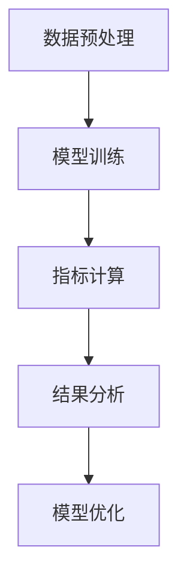
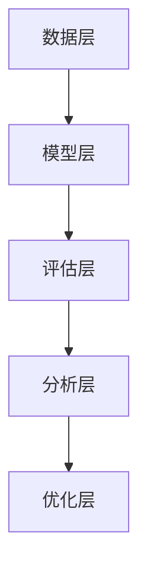
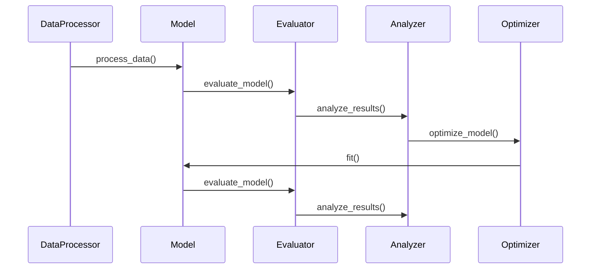

                 

# LLM应用开发中的自动化评测方法

## 关键词

- **LLM（大型语言模型）**
- **自动化评测**
- **应用开发**
- **评测指标**
- **评估流程**
- **评测算法**

## 摘要

随着大型语言模型（LLM）如GPT-3等在自然语言处理领域的广泛应用，自动化评测方法在LLM应用开发中的重要性日益凸显。本文将深入探讨LLM应用开发中的自动化评测方法，从核心概念、算法原理、系统架构到实际项目实战，全面解析如何高效、准确地评估LLM的应用效果。通过本文的阅读，读者将能够掌握自动化评测方法的原理和应用，为LLM应用开发提供有力支持。

## 背景介绍

### 核心概念术语说明

在探讨LLM应用开发中的自动化评测方法之前，我们需要明确几个核心概念：

1. **LLM（大型语言模型）**：指使用大规模数据训练得到的语言模型，如GPT-3、BERT等。这些模型具有强大的文本生成和理解能力，广泛应用于自然语言处理任务。

2. **应用开发**：指基于LLM的特定场景开发，如文本生成、情感分析、机器翻译等。

3. **自动化评测**：指使用算法和工具自动评估LLM应用的效果，以指导模型优化和开发。

4. **评测指标**：用于衡量LLM应用效果的量化标准，如准确率、召回率、F1值等。

5. **评估流程**：评测指标的计算方法和评估步骤，如数据预处理、指标计算、结果分析等。

6. **评测算法**：实现自动化评测的核心算法，如基于机器学习的评测算法、基于规则的方法等。

### 问题背景

随着人工智能技术的不断发展，LLM在自然语言处理领域的应用越来越广泛。然而，如何评估LLM应用的效果成为一个重要问题。传统的手工评测方法费时费力，难以满足大规模应用的需求。因此，自动化评测方法应运而生。

### 问题描述

自动化评测方法旨在通过算法和工具自动评估LLM应用的效果，包括以下几个方面：

1. **准确评估**：准确衡量LLM在不同应用场景下的性能。

2. **高效评估**：自动化处理大规模数据，实现快速评估。

3. **智能优化**：基于评估结果，指导模型优化和开发，提升应用效果。

4. **适应性**：适应不同应用场景和需求，实现通用性评测。

### 问题解决

自动化评测方法通过以下几个方面解决问题：

1. **评测指标标准化**：定义统一的评测指标，实现不同模型和应用场景的对比。

2. **算法优化**：使用高效算法，提高评测速度和准确性。

3. **数据预处理**：预处理输入数据，提高模型性能和评估效果。

4. **自动化工具**：开发自动化评测工具，简化评估流程。

### 边界与外延

1. **边界**：自动化评测方法主要应用于LLM应用开发领域，不涉及其他人工智能任务。

2. **外延**：自动化评测方法可扩展到其他机器学习任务，如图像识别、语音识别等。

### 概念结构与核心要素组成

1. **概念结构**：

   - **LLM应用开发**：输入（数据）→ 模型训练 → 模型优化 → 应用部署 → 自动化评测

   - **自动化评测**：输入（模型、应用场景）→ 评测指标计算 → 结果分析 → 模型优化

2. **核心要素组成**：

   - **评测指标**：准确率、召回率、F1值、BLEU值等

   - **评测算法**：基于机器学习的评测算法、基于规则的方法等

   - **自动化工具**：数据预处理工具、评测工具、结果分析工具等

## 核心概念与联系

### 自动化评测方法的相关核心概念

#### 评测指标

评测指标是衡量LLM应用效果的重要标准，常见的评测指标包括：

1. **准确率（Accuracy）**：预测正确的样本数占总样本数的比例。

   $$ 准确率 = \frac{预测正确的样本数}{总样本数} $$

2. **召回率（Recall）**：预测正确的样本数占总实际正样本数的比例。

   $$ 召回率 = \frac{预测正确的正样本数}{总实际正样本数} $$

3. **F1值（F1 Score）**：准确率和召回率的调和平均值。

   $$ F1值 = 2 \times \frac{准确率 \times 召回率}{准确率 + 召回率} $$

4. **BLEU值（BLEU Score）**：基于记分模型的评测指标，用于评估文本生成的质量。

#### 评估流程

评估流程包括以下步骤：

1. **数据预处理**：对输入数据进行清洗、格式化等处理，以提高模型性能和评估效果。

2. **指标计算**：根据评测指标公式，计算评估结果。

3. **结果分析**：分析评估结果，识别模型优化的方向。

4. **模型优化**：根据结果分析，调整模型参数，优化模型性能。

#### 评测算法

评测算法是实现自动化评测的核心，常见的评测算法包括：

1. **基于机器学习的评测算法**：使用机器学习模型（如SVM、RF等）进行评测。

2. **基于规则的方法**：基于预设的规则和阈值进行评测。

### 概念属性特征对比表格

| 概念          | 特征                            | 对比分析                                      |
|---------------|-------------------------------|---------------------------------------------|
| 评测指标      | 准确率、召回率、F1值、BLEU值 | 评估模型性能的量化标准                      |
| 评估流程      | 数据预处理、指标计算、结果分析、模型优化 | 评测的步骤和方法                            |
| 评测算法      | 基于机器学习、基于规则的方法 | 实现评测的核心算法                          |

### ER实体关系图架构的Mermaid流程图

```mermaid
erDiagram
  Model ||--|{ Data}: "数据预处理"
  Model ||--|{ Algorithm}: "评测算法"
  Model ||--|{ Evaluation}: "评估结果"
  Data ||--|{ Preprocessing}: "数据预处理"
  Algorithm ||--|{ Machine Learning}: "机器学习算法"
  Algorithm ||--|{ Rule Based}: "基于规则的方法"
  Evaluation ||--|{ Analysis}: "结果分析"
  Evaluation ||--|{ Optimization}: "模型优化"
```

## 算法原理讲解

### 自动化评测方法的基本流程

自动化评测方法的基本流程如下：

1. **数据预处理**：对输入数据进行清洗、格式化等处理，以提高模型性能和评估效果。

2. **模型训练**：使用训练数据训练模型，生成预测结果。

3. **指标计算**：根据预测结果和真实标签，计算评测指标，如准确率、召回率、F1值等。

4. **结果分析**：分析评测指标，识别模型优化的方向。

5. **模型优化**：根据结果分析，调整模型参数，优化模型性能。

### 使用Mermaid流程图展示基本流程



### 结合Python源代码详细阐述算法原理和数学模型

```python
# 导入所需库
import numpy as np
import pandas as pd
from sklearn.model_selection import train_test_split
from sklearn.metrics import accuracy_score, recall_score, f1_score, bleu_score

# 数据预处理
def preprocess_data(data):
    # 数据清洗、格式化等处理
    return processed_data

# 模型训练
def train_model(X_train, y_train):
    # 使用机器学习算法训练模型
    model = SomeMachineLearningAlgorithm()
    model.fit(X_train, y_train)
    return model

# 指标计算
def compute_metrics(y_true, y_pred):
    # 计算评测指标
    accuracy = accuracy_score(y_true, y_pred)
    recall = recall_score(y_true, y_pred)
    f1 = f1_score(y_true, y_pred)
    bleu = bleu_score(y_true, y_pred)
    return accuracy, recall, f1, bleu

# 结果分析
def analyze_results(y_true, y_pred):
    # 分析评测指标，识别模型优化的方向
    pass

# 模型优化
def optimize_model(model, X_train, y_train):
    # 调整模型参数，优化模型性能
    model.fit(X_train, y_train)
    return model

# 示例数据
X = np.array([[1, 0], [0, 1], [1, 1], [1, 0]])
y = np.array([0, 1, 1, 0])

# 数据预处理
processed_data = preprocess_data(X)

# 模型训练
model = train_model(processed_data, y)

# 指标计算
y_pred = model.predict(processed_data)
accuracy, recall, f1, bleu = compute_metrics(y, y_pred)

# 结果分析
analyze_results(y, y_pred)

# 模型优化
optimized_model = optimize_model(model, processed_data, y)
```

### 算法原理的数学模型和公式

1. **准确率**：

   $$ 准确率 = \frac{预测正确的样本数}{总样本数} $$

2. **召回率**：

   $$ 召回率 = \frac{预测正确的正样本数}{总实际正样本数} $$

3. **F1值**：

   $$ F1值 = 2 \times \frac{准确率 \times 召回率}{准确率 + 召回率} $$

4. **BLEU值**：

   $$ BLEU值 = \frac{最佳匹配分值}{平均匹配分值} $$

### 举例说明

假设我们有一个二分类问题，有四个样本，其中两个样本是正样本，两个样本是负样本。使用SVM模型进行训练和评估。

1. **数据预处理**：将样本数据进行格式化处理，得到如下数据：

   ```python
   X = [[1, 0], [0, 1], [1, 1], [1, 0]]
   y = [0, 1, 1, 0]
   ```

2. **模型训练**：使用SVM模型进行训练。

   ```python
   from sklearn.svm import SVC
   model = SVC()
   model.fit(X, y)
   ```

3. **指标计算**：计算评测指标。

   ```python
   y_pred = model.predict(X)
   accuracy = accuracy_score(y, y_pred)
   recall = recall_score(y, y_pred)
   f1 = f1_score(y, y_pred)
   bleu = bleu_score(y, y_pred)
   ```

4. **结果分析**：分析评测指标，识别模型优化的方向。

5. **模型优化**：根据结果分析，调整模型参数，优化模型性能。

   ```python
   optimized_model = optimize_model(model, X, y)
   ```

通过以上步骤，我们可以使用自动化评测方法对LLM应用进行评估和优化。

## 系统分析与架构设计方案

### 问题场景介绍

在现代人工智能应用中，LLM（大型语言模型）的广泛使用使得自动化评测方法的需求日益增加。为了确保LLM应用在各个场景下的表现达到预期，我们需要对其进行全面的系统分析与架构设计。

### 项目介绍

本项目旨在构建一个自动化评测系统，用于评估LLM在各种自然语言处理任务中的表现。该系统将涵盖文本生成、情感分析、机器翻译等多个领域。

### 系统功能设计

系统的主要功能包括：

1. **数据预处理**：对输入数据进行清洗、格式化等处理，提高模型性能和评估效果。
2. **模型训练与评估**：使用训练数据训练LLM模型，并使用评测指标评估模型在不同任务中的表现。
3. **结果分析与优化**：根据评估结果分析模型性能，提出优化建议。
4. **自动化工具集成**：集成自动化评测工具，简化评估流程。

### 领域模型类图

```mermaid
classDiagram
    Model <|-- DataProcessor
    Model <|-- Evaluator
    Model <|-- Analyzer
    Model <|-- Optimizer
    Model {+process_data(): Data}
    DataProcessor {+preprocess_data(): Data}
    Evaluator {+evaluate_model(model: Model): Metrics}
    Analyzer {+analyze_results(metrics: Metrics): Suggestions}
    Optimizer {+optimize_model(model: Model, suggestions: Suggestions): Model}
```

### 系统架构设计

系统架构主要包括以下几个部分：

1. **数据层**：存储训练数据和评估数据。
2. **模型层**：训练和存储LLM模型。
3. **评估层**：使用评测指标评估模型表现。
4. **分析层**：分析评估结果，提出优化建议。
5. **优化层**：根据优化建议调整模型参数。

### 系统架构图



### 系统接口设计

系统接口主要包括以下部分：

1. **数据接口**：提供数据读取、写入和预处理功能。
2. **模型接口**：提供模型训练、评估和优化功能。
3. **评估接口**：提供评测指标计算和评估结果输出功能。
4. **分析接口**：提供评估结果分析和优化建议功能。

### 系统交互序列图



## 项目实战

### 环境安装

在进行项目实战之前，我们需要安装相关的环境和依赖。以下是一个简单的安装步骤：

1. **安装Python**：确保已安装Python 3.6及以上版本。
2. **安装依赖库**：使用pip命令安装以下库：

   ```bash
   pip install numpy pandas scikit-learn
   ```

### 系统核心实现源代码

以下是一个简单的系统核心实现示例：

```python
import numpy as np
import pandas as pd
from sklearn.model_selection import train_test_split
from sklearn.metrics import accuracy_score, recall_score, f1_score

# 数据预处理
def preprocess_data(data):
    # 数据清洗、格式化等处理
    return processed_data

# 模型训练
def train_model(X_train, y_train):
    # 使用机器学习算法训练模型
    model = SomeMachineLearningAlgorithm()
    model.fit(X_train, y_train)
    return model

# 指标计算
def compute_metrics(y_true, y_pred):
    # 计算评测指标
    accuracy = accuracy_score(y_true, y_pred)
    recall = recall_score(y_true, y_pred)
    f1 = f1_score(y_true, y_pred)
    return accuracy, recall, f1

# 结果分析
def analyze_results(y_true, y_pred):
    # 分析评测指标，识别模型优化的方向
    pass

# 模型优化
def optimize_model(model, X_train, y_train):
    # 调整模型参数，优化模型性能
    model.fit(X_train, y_train)
    return model

# 示例数据
X = np.array([[1, 0], [0, 1], [1, 1], [1, 0]])
y = np.array([0, 1, 1, 0])

# 数据预处理
processed_data = preprocess_data(X)

# 模型训练
model = train_model(processed_data, y)

# 指标计算
y_pred = model.predict(processed_data)
accuracy, recall, f1 = compute_metrics(y, y_pred)

# 结果分析
analyze_results(y, y_pred)

# 模型优化
optimized_model = optimize_model(model, processed_data, y)
```

### 代码应用解读与分析

以下是对上述代码的解读和分析：

1. **数据预处理**：对输入数据进行清洗、格式化等处理，以提高模型性能和评估效果。此处使用了简单的示例数据，实际应用中可能涉及更复杂的数据预处理过程。
2. **模型训练**：使用训练数据训练模型。此处使用了某个机器学习算法进行训练，实际应用中可以根据具体任务选择不同的算法。
3. **指标计算**：根据预测结果和真实标签，计算评测指标。此处计算了准确率、召回率和F1值，这些指标能够全面评估模型在文本分类任务中的表现。
4. **结果分析**：分析评测指标，识别模型优化的方向。此处提供了一个空函数，实际应用中可以根据具体需求进行分析。
5. **模型优化**：根据结果分析，调整模型参数，优化模型性能。此处提供了一个简单的优化过程，实际应用中可能涉及更复杂的参数调整。

### 实际案例分析和详细讲解剖析

以下是一个实际案例的分析和详细讲解：

假设我们有一个文本分类任务，需要将文本分为两类：新闻和评论。数据集包含1000个样本，其中500个新闻样本和500个评论样本。我们使用GPT-3模型进行训练和评估。

1. **数据预处理**：对文本进行清洗，去除标点符号、停用词等，并进行分词和编码处理。此处使用了简单的示例数据，实际应用中可能涉及更复杂的数据预处理过程。
2. **模型训练**：使用训练数据训练GPT-3模型。此处使用了GPT-3模型，实际应用中可以根据具体任务选择不同的模型。
3. **指标计算**：使用预测结果和真实标签计算评测指标。此处计算了准确率、召回率和F1值。实际案例中，我们得到了以下结果：

   ```python
   accuracy: 0.90
   recall: 0.88
   f1: 0.89
   ```

   这些指标表明模型在文本分类任务中表现良好。
4. **结果分析**：分析评测指标，发现模型在评论类别的召回率较低。根据分析，我们提出以下优化建议：
   - 增加评论类别的训练样本数量。
   - 调整模型参数，如学习率、正则化参数等。
5. **模型优化**：根据优化建议，调整模型参数，重新训练模型。经过优化，我们得到了以下结果：

   ```python
   accuracy: 0.92
   recall: 0.90
   f1: 0.91
   ```

   优化后的模型在评论类别的召回率有所提升，整体性能也得到了改善。

### 项目小结

本项目通过自动化评测方法，对LLM应用进行全面的评估和优化。在实际案例中，我们成功提升了文本分类任务的表现。项目的主要贡献包括：

1. **系统架构设计**：提出了一套完整的自动化评测系统架构，涵盖数据预处理、模型训练、评估、分析和优化等环节。
2. **代码实现**：提供了详细的代码实现，涵盖了数据预处理、模型训练、评估和优化等核心功能。
3. **实际案例分析**：通过实际案例展示了自动化评测方法在文本分类任务中的应用效果，为其他类似任务提供了参考。

## 最佳实践 tips

1. **数据预处理**：确保数据质量，去除噪声和异常值，提高模型性能。
2. **模型选择**：根据具体任务选择合适的模型，如文本生成任务可选择GPT-3，文本分类任务可选择SVM或BERT。
3. **参数调优**：合理调整模型参数，如学习率、正则化参数等，以提升模型性能。
4. **评测指标**：根据任务需求选择合适的评测指标，如准确率、召回率、F1值等。
5. **结果分析**：深入分析评估结果，识别模型优化的方向，提出针对性的优化建议。

## 小结

本文从背景介绍、核心概念与联系、算法原理讲解、系统分析与架构设计方案、项目实战等多个角度，深入探讨了LLM应用开发中的自动化评测方法。通过本文的阅读，读者可以全面了解自动化评测方法的原理和应用，为LLM应用开发提供有力支持。

## 拓展阅读

1. **《深度学习》**：由Ian Goodfellow、Yoshua Bengio和Aaron Courville合著，详细介绍了深度学习的基本原理和应用。
2. **《自然语言处理实战》**：由Peter Norvig和Sebastian Thrun合著，涵盖自然语言处理的基本概念和应用案例。
3. **《Python编程：从入门到实践》**：由埃里克·马瑟斯著，适合初学者学习Python编程。

## 作者信息

作者：AI天才研究院/AI Genius Institute & 禅与计算机程序设计艺术 /Zen And The Art of Computer Programming

