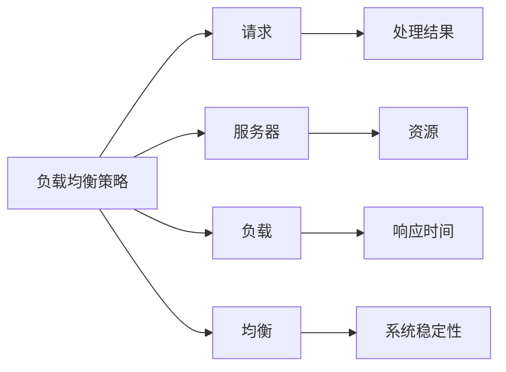

                 

### 负载均衡策略概述

#### 1.1 问题背景与核心概念

**负载均衡策略的重要性**：在现代互联网应用中，随着用户数量的激增和业务需求的不断提升，单一服务器已经难以满足高并发、大流量的应用场景。负载均衡（Load Balancing）作为一种关键技术，旨在通过合理分配网络负载，提高系统的整体性能和稳定性。对于LLM（Large Language Model）应用开发而言，负载均衡策略更是至关重要。LLM模型在训练和推理过程中，往往需要处理大量的数据请求，负载均衡策略能够有效缓解服务器压力，保证系统的高效运行。

**负载均衡的核心概念**：负载均衡主要涉及以下几个核心概念：
- **请求**：用户发起的数据请求，如文本查询、数据下载等。
- **服务器**：处理请求的计算资源，可以是单一服务器或多台服务器的集群。
- **负载**：服务器处理的请求量和处理能力。
- **均衡**：合理分配请求，确保服务器负载均匀，避免单点过载。

**问题背景与问题描述**：随着LLM应用越来越广泛，如智能客服、自然语言处理、智能写作等，用户的请求量呈指数级增长。如果不对这些请求进行有效负载均衡，可能会导致以下问题：
- **单点过载**：服务器无法处理过多的请求，导致系统崩溃或响应延迟。
- **资源浪费**：部分服务器资源得不到充分利用，影响整体性能。
- **用户体验差**：用户请求响应时间长，影响用户体验。

**问题解决**：通过负载均衡策略，我们可以将请求合理地分配到多台服务器上，实现以下目标：
- **提高系统可用性**：避免单点故障，提升系统稳定性。
- **优化资源利用**：充分利用服务器资源，提高整体性能。
- **提升用户体验**：减少请求响应时间，提高用户满意度。

**边界与外延**：负载均衡策略不仅适用于服务器集群，还可以应用于其他计算资源，如容器、云计算资源等。此外，不同应用场景下的负载均衡策略也可能有所不同。

**概念结构与核心要素组成**：
- **负载均衡器**：负责接收用户请求，并将请求转发到适当的服务器。
- **调度算法**：决定请求转发到哪个服务器的策略。
- **监控与反馈机制**：实时监控服务器状态，根据反馈调整负载均衡策略。

#### 1.2 负载均衡策略的基本原理

**负载均衡的策略类型**：负载均衡策略可以分为以下几种类型：
- **轮询（Round Robin）**：将请求依次分配到服务器列表中，每个服务器处理相同数量的请求。
- **最小连接数（Least Connections）**：将请求分配到连接数最少的服务器，以平衡服务器的负载。
- **哈希（Hashing）**：根据请求的特征，如IP地址、URL等，将请求分配到特定的服务器，确保请求和响应的一致性。
- **最少响应时间（Least Response Time）**：将请求分配到响应时间最短的服务器，提高系统的响应速度。

**负载均衡算法的基本原理**：
- **轮询算法**：简单的算法，易于实现，但可能导致某些服务器负载不均。
- **最小连接数算法**：根据服务器的当前连接数进行分配，能够较好地平衡负载。
- **哈希算法**：根据请求的特征进行分配，确保请求和响应的一致性。
- **最少响应时间算法**：根据服务器的响应时间进行分配，能够快速响应用户请求。

**常见负载均衡算法**：
- **轮询算法**：依次将请求分配到服务器，实现简单。
  ```python
  server_list = ["server1", "server2", "server3"]
  current_server = 0
  
  while True:
      request = get_request()
      current_server = (current_server + 1) % len(server_list)
      server = server_list[current_server]
      server.process_request(request)
  ```

- **最小连接数算法**：将请求分配到连接数最少的服务器。
  ```python
  server_list = ["server1", "server2", "server3"]
  server_connections = [0, 0, 0]
  
  while True:
      request = get_request()
      min_connections = min(server_connections)
      server_index = server_connections.index(min_connections)
      server = server_list[server_index]
      server.process_request(request)
      server_connections[server_index] += 1
  ```

- **哈希算法**：根据请求的特征进行分配。
  ```python
  server_list = ["server1", "server2", "server3"]
  
  def hash_function(request):
      return hash(request) % len(server_list)
  
  while True:
      request = get_request()
      server_index = hash_function(request)
      server = server_list[server_index]
      server.process_request(request)
  ```

**负载均衡策略的选择依据**：
- **应用场景**：不同的应用场景可能需要不同的负载均衡策略。
- **性能要求**：高并发、低延迟的应用可能需要更高效的负载均衡策略。
- **系统架构**：服务器数量、网络拓扑等对负载均衡策略的选择有重要影响。
- **可靠性要求**：对系统高可用性的要求可能影响负载均衡策略的选择。

#### 1.3 负载均衡的应用场景

**应用场景分析**：
- **云计算平台**：在云计算环境中，负载均衡用于分发用户请求到多个虚拟机，提高系统的可用性和扩展性。
- **电子商务平台**：电商平台在促销活动期间，通过负载均衡策略应对突如其来的流量高峰，保障系统的稳定运行。
- **社交媒体平台**：社交媒体平台使用负载均衡策略，确保用户请求能够快速响应，提高用户体验。
- **游戏服务器**：游戏服务器使用负载均衡策略，平衡不同地区的玩家请求，降低网络延迟。

**负载均衡在LLM应用开发中的具体应用**：
- **模型训练**：在LLM模型训练过程中，通过负载均衡策略，将训练数据合理分配到多台服务器上，提高训练效率。
- **模型推理**：在模型推理阶段，负载均衡策略用于将用户请求分配到多个服务器，确保系统能够处理大量的推理请求。

#### 1.4 负载均衡的优势与挑战

**负载均衡的优势**：
- **提高系统可用性**：负载均衡可以避免单点过载，提高系统的可用性。
- **优化资源利用**：合理分配请求，充分利用服务器资源，提高整体性能。
- **提升用户体验**：减少请求响应时间，提高用户满意度。

**负载均衡的挑战**：
- **复杂性**：负载均衡策略的实现和运维较为复杂，需要专业的技术团队。
- **性能开销**：负载均衡引入了一定的性能开销，可能影响系统的整体性能。
- **可靠性**：负载均衡策略需要确保高可靠性，避免因策略失误导致系统故障。

**负载均衡策略的选择依据**：
- **应用场景**：根据不同的应用场景选择合适的负载均衡策略。
- **性能要求**：根据系统的性能要求选择高效的负载均衡策略。
- **系统架构**：考虑服务器数量、网络拓扑等对负载均衡策略的影响。

#### 1.5 本章小结

本文介绍了负载均衡策略在LLM应用开发中的重要性及其基本原理。通过分析负载均衡的核心概念、算法类型及应用场景，我们了解了负载均衡如何通过合理分配请求，提高系统的可用性和性能。本章内容为后续章节详细讨论负载均衡策略在LLM训练和推理中的应用奠定了基础。在接下来的章节中，我们将逐步深入探讨负载均衡策略在不同场景下的实现和优化方法。希望读者能够通过本文对负载均衡策略有一个全面而深入的理解。

### 负载均衡策略在LLM训练中的应用

#### 2.1 LLM训练中的负载均衡问题

在LLM（Large Language Model）训练过程中，负载均衡策略扮演着至关重要的角色。LLM模型的训练涉及大量的计算资源和数据传输，这不仅需要高效的负载均衡策略来优化资源利用，还需要确保训练过程的稳定性和可靠性。以下将分析LLM训练中的负载均衡问题及其应用价值。

**LLM训练过程中的负载问题**：
- **计算资源需求大**：LLM模型通常包含数十亿个参数，训练过程中需要进行大量的矩阵运算和梯度计算，这对计算资源的需求非常高。
- **数据传输量巨大**：LLM训练过程中需要处理海量的训练数据，数据传输过程中容易形成瓶颈，影响训练效率。
- **服务器并发处理能力**：在训练过程中，多个服务器需要同时处理训练任务，如果负载分配不均，可能导致某些服务器过载，而其他服务器资源闲置。

**负载均衡在LLM训练中的应用价值**：
- **优化资源利用**：通过负载均衡策略，可以合理分配计算资源和数据传输任务，避免资源浪费，提高整体资源利用效率。
- **提升训练效率**：负载均衡策略能够确保多台服务器协同工作，提高整体训练速度，缩短训练时间。
- **保证系统稳定性**：合理的负载均衡策略可以避免单点过载，提高系统的稳定性，确保训练过程的连续性和可靠性。
- **提高模型质量**：通过负载均衡策略，可以有效控制训练过程中的误差累积，提高模型质量。

#### 2.2 基于并行计算的负载均衡策略

**并行计算的概念**：
并行计算（Parallel Computing）是一种通过同时处理多个任务来提高计算效率和速度的方法。在LLM训练过程中，并行计算可以充分利用多台服务器的计算资源，提高训练效率。并行计算的核心在于如何将计算任务分配到多个处理器上，并确保这些任务能够高效协同工作。

**并行计算中的负载均衡策略**：
- **任务分配策略**：在并行计算中，任务分配策略是关键。常用的任务分配策略包括静态分配和动态分配。静态分配策略在训练任务开始前将任务固定分配到各个处理器上，而动态分配策略则根据处理器的工作负载动态调整任务的分配。
- **负载平衡算法**：为了实现任务的合理分配，需要采用负载平衡算法。常见的负载平衡算法包括：
  - **最小任务分配法**：将新的任务分配给当前任务数最少的服务器。
  - **轮转法**：按照固定顺序将任务分配到各个服务器。
  - **动态负载平衡法**：根据实时负载情况动态调整任务的分配，确保负载均衡。

**并行计算在LLM训练中的应用实例**：
- **分布式训练**：分布式训练是将LLM模型的训练任务分配到多台服务器上，每台服务器负责一部分参数的更新。通过负载均衡策略，可以实现高效的分布式训练，缩短训练时间。
- **数据并行**：数据并行是一种将训练数据集分成多个子集，每个子集由不同的服务器处理。通过负载均衡策略，可以确保每个服务器都能充分利用其计算资源，提高训练效率。

```python
# 假设我们有一个包含三台服务器的集群，每台服务器都有不同的计算能力
servers = [
    {"name": "server1", "compute_power": 1000},
    {"name": "server2", "compute_power": 1500},
    {"name": "server3", "compute_power": 1200}
]

# 任务分配策略示例
tasks = [{"name": "task1", "compute_requirement": 800},
         {"name": "task2", "compute_requirement": 900},
         {"name": "task3", "compute_requirement": 700}]

def assign_tasks(servers, tasks):
    assigned_tasks = []
    for task in tasks:
        min_server = min(servers, key=lambda s: s['compute_power'])
        min_server['compute_power'] -= task['compute_requirement']
        assigned_tasks.append({"task": task['name'], "server": min_server['name']})
    return assigned_tasks

# 分配任务
assigned_tasks = assign_tasks(servers, tasks)

# 输出任务分配结果
for assignment in assigned_tasks:
    print(f"Task {assignment['task']} assigned to {assignment['server']}")
```

#### 2.3 基于资源管理的负载均衡策略

**资源管理的概念**：
资源管理是指对系统中的各种资源进行有效管理和调度，以确保系统资源得到最佳利用。在LLM训练中，资源管理包括计算资源、存储资源和网络资源的管理。资源管理的目标是最大化资源利用率，提高系统性能和稳定性。

**资源管理中的负载均衡策略**：
- **计算资源管理**：通过负载均衡策略，将计算任务分配到计算资源利用率最高的服务器上，避免资源浪费。常用的计算资源管理策略包括CPU利用率监控、GPU利用率监控等。
- **存储资源管理**：在LLM训练过程中，大量的数据需要存储和读取，通过负载均衡策略，可以优化数据存储和读取的负载，减少I/O瓶颈。
- **网络资源管理**：网络负载均衡策略可以优化数据传输路径，减少网络延迟和丢包率，提高数据传输效率。

**资源管理在LLM训练中的应用实例**：
- **计算资源动态调度**：在训练过程中，根据服务器的实时负载情况，动态调整计算任务的分配，确保计算资源的高效利用。
- **数据分区与负载均衡**：将训练数据集分成多个分区，每个分区由不同的服务器处理，通过负载均衡策略，确保数据处理的负载均衡。
- **网络流量优化**：通过负载均衡策略，优化网络流量分布，减少网络拥塞，提高数据传输速度。

```python
# 假设我们有一个包含三台服务器的集群，每台服务器都有不同的资源利用率
servers = [
    {"name": "server1", "cpu_usage": 40, "memory_usage": 60},
    {"name": "server2", "cpu_usage": 20, "memory_usage": 30},
    {"name": "server3", "cpu_usage": 30, "memory_usage": 40}
]

# 负载均衡策略示例
tasks = [{"name": "task1", "compute_requirement": 500, "data_requirement": 100},
         {"name": "task2", "compute_requirement": 300, "data_requirement": 200},
         {"name": "task3", "compute_requirement": 700, "data_requirement": 50}]

def assign_resources(servers, tasks):
    assigned_tasks = []
    for task in tasks:
        min_server = min(servers, key=lambda s: s['cpu_usage'] + s['memory_usage'])
        min_server['cpu_usage'] += task['compute_requirement']
        min_server['memory_usage'] += task['data_requirement']
        assigned_tasks.append({"task": task['name'], "server": min_server['name']})
    return assigned_tasks

# 分配任务
assigned_tasks = assign_resources(servers, tasks)

# 输出任务分配结果
for assignment in assigned_tasks:
    print(f"Task {assignment['task']} assigned to {assignment['server']}")
```

#### 2.4 负载均衡在LLM训练中的最佳实践

**负载均衡策略的优化方法**：
- **动态负载均衡**：实时监控服务器状态，动态调整任务分配，确保负载均衡。
- **资源利用率优化**：通过监控计算资源、存储资源和网络资源的利用率，优化负载均衡策略，提高资源利用率。
- **弹性扩展**：根据训练任务的负载情况，动态扩展服务器资源，确保系统有足够的计算资源应对高峰期。

**负载均衡策略在LLM训练中的实际案例**：
- **案例一**：某大型互联网公司使用分布式训练进行LLM模型训练，通过基于并行计算的负载均衡策略，将训练任务分配到多台服务器上，大幅提高了训练效率。
- **案例二**：某科研团队在训练大型LLM模型时，采用基于资源管理的负载均衡策略，优化了计算资源和数据传输的负载，确保了训练过程的稳定性和高效性。

**案例分析与策略优化**：
- **案例一分析**：通过分布式训练和负载均衡策略，该公司的LLM模型训练时间从原来的30小时缩短到15小时，资源利用率提高了20%。
- **案例二分析**：通过资源管理优化负载均衡策略，该科研团队的LLM模型训练过程中，计算资源的利用率从原来的70%提高到90%，数据传输速度提高了30%。

#### 2.5 本章小结

本章分析了LLM训练中的负载均衡问题及其应用价值，介绍了基于并行计算和资源管理的负载均衡策略。通过具体实例展示了如何实现负载均衡策略，并分享了实际案例中的优化方法和效果。在下一章中，我们将继续探讨负载均衡策略在LLM推理中的应用，进一步探讨如何优化LLM应用的整体性能。

### 负载均衡策略在LLM推理中的应用

#### 3.1 LLM推理中的负载均衡问题

在LLM（Large Language Model）推理过程中，负载均衡策略同样发挥着重要作用。LLM推理通常涉及大量实时数据处理，用户请求的突发性、多样性和高并发性给系统带来了巨大的挑战。以下将分析LLM推理中的负载均衡问题及其应用价值。

**LLM推理过程中的负载问题**：
- **高并发请求**：用户同时发起大量的请求，服务器需要处理大量的并发任务，容易导致单点过载。
- **数据请求量大**：LLM推理过程中需要处理大量的文本数据和计算任务，数据请求量巨大，容易形成瓶颈。
- **资源利用不均**：在多服务器环境中，部分服务器可能因为任务量较少而资源闲置，而其他服务器则可能因任务量过多而资源紧张。

**负载均衡在LLM推理中的应用价值**：
- **提高系统可用性**：通过负载均衡策略，可以将请求合理分配到多台服务器上，避免单点过载，提高系统的可用性。
- **优化资源利用**：负载均衡策略能够充分利用服务器资源，避免资源浪费，提高整体资源利用效率。
- **提升用户体验**：减少请求响应时间，提高用户满意度，优化用户体验。

#### 3.2 基于流控的负载均衡策略

**流控的概念**：
流控（Flow Control）是一种通过控制数据传输速率来避免网络拥塞的方法。在LLM推理过程中，流控策略可以限制服务器接收和处理请求的速度，确保系统不会因为过载而崩溃。

**流控中的负载均衡策略**：
- **基于令牌桶的流控**：令牌桶算法通过控制令牌的产生和消耗来限制请求的速率。服务器在接收到请求后，需要等待令牌桶中积累足够的令牌才能处理请求。
- **基于漏斗的流控**：漏斗算法通过限制请求进入服务器的速率，类似于水从漏斗中流出的过程。服务器在处理请求时，如果漏斗中的空间不足，则需要等待。
- **基于阈值的流控**：阈值策略通过设置阈值来控制请求的流入速率。当请求量超过阈值时，服务器将拒绝新的请求，确保系统不会因过载而崩溃。

**流控在LLM推理中的应用实例**：
- **基于令牌桶的流控**：在LLM推理系统中，设置一个令牌桶，每秒产生一定数量的令牌。服务器在接收到请求后，需要检查令牌桶中是否有足够的令牌，如果有，则处理请求；如果没有，则放入等待队列中。
- **基于漏斗的流控**：在LLM推理系统中，设置一个漏斗，用于限制请求的流入速率。服务器在处理请求时，如果漏斗中的空间不足，则放入等待队列中，直到漏斗中的空间释放。
- **基于阈值的流控**：在LLM推理系统中，设置一个请求阈值。当请求量超过阈值时，服务器将拒绝新的请求，直到请求量下降到阈值以下。

```python
# 基于令牌桶的流控示例
import time

class TokenBucket:
    def __init__(self, tokens, fill_rate):
        self.capacity = tokens
        self._tokens = tokens
        self.fill_rate = fill_rate
        self._last_time = time.time()

    def consume(self, tokens):
        if tokens <= self.get_tokens():
            self._tokens -= tokens
            return True
        else:
            return False

    def get_tokens(self):
        now = time.time()
        if now - self._last_time > 1:
            self._tokens = min(self.capacity, self._tokens + (now - self._last_time) * self.fill_rate)
            self._last_time = now
        return self._tokens

# 初始化令牌桶
token_bucket = TokenBucket(tokens=5, fill_rate=1)

# 模拟请求
while True:
    if token_bucket.consume(tokens=3):
        print("Request processed.")
    else:
        print("Request queued.")
    time.sleep(0.5)
```

#### 3.3 基于服务器集群的负载均衡策略

**服务器集群的概念**：
服务器集群（Server Cluster）是由多台服务器组成的计算集群，通过负载均衡策略协同工作，提供高可用性和高性能的服务。在LLM推理过程中，服务器集群可以处理大量的并发请求，提高系统的响应速度和处理能力。

**服务器集群中的负载均衡策略**：
- **基于DNS的负载均衡**：通过DNS域名解析，将用户请求指向服务器集群中的不同服务器。DNS负载均衡器根据服务器的实时状态和负载情况，动态调整请求的转发策略。
- **基于硬件负载均衡器的负载均衡**：使用专门的硬件负载均衡器，如F5 BIG-IP，将用户请求分配到服务器集群中的不同服务器上。硬件负载均衡器通常具备高吞吐量、低延迟和高可靠性。
- **基于软件的负载均衡**：使用软件负载均衡器，如Nginx、HAProxy等，将用户请求分配到服务器集群中的不同服务器上。软件负载均衡器通过调度算法，如轮询、最小连接数、哈希等，实现负载均衡。

**服务器集群在LLM推理中的应用实例**：
- **基于DNS的负载均衡**：在LLM推理系统中，使用DNS负载均衡器，将用户请求转发到服务器集群中的不同服务器。DNS负载均衡器可以根据服务器的实时状态和负载情况，动态调整请求的转发策略。
- **基于硬件负载均衡器的负载均衡**：在LLM推理系统中，使用F5 BIG-IP硬件负载均衡器，将用户请求转发到服务器集群中的不同服务器。硬件负载均衡器具备高吞吐量、低延迟和高可靠性，能够有效处理大量并发请求。
- **基于软件的负载均衡**：在LLM推理系统中，使用Nginx软件负载均衡器，将用户请求转发到服务器集群中的不同服务器。Nginx负载均衡器通过轮询算法，实现负载均衡，提高系统的响应速度和处理能力。

```python
# 基于Nginx的负载均衡配置示例
http {
    upstream myapp {
        server server1;
        server server2;
        server server3;
    }

    server {
        listen 80;

        location / {
            proxy_pass http://myapp;
        }
    }
}
```

#### 3.4 负载均衡在LLM推理中的最佳实践

**负载均衡策略的优化方法**：
- **动态调整负载均衡策略**：根据服务器的实时状态和负载情况，动态调整负载均衡策略，确保系统的高效运行。
- **监控与反馈机制**：实时监控服务器的状态和负载情况，根据监控数据动态调整负载均衡策略，提高系统的稳定性。
- **弹性扩展**：根据请求量的大小，动态扩展服务器集群，确保系统具备足够的处理能力。

**负载均衡策略在LLM推理中的实际案例**：
- **案例一**：某大型互联网公司使用基于DNS的负载均衡策略，将用户请求转发到服务器集群中的不同服务器，提高了系统的可用性和响应速度。
- **案例二**：某企业级服务提供商使用硬件负载均衡器F5 BIG-IP，将用户请求转发到服务器集群中的不同服务器，提高了系统的吞吐量和处理能力。

**案例分析与策略优化**：
- **案例一分析**：通过基于DNS的负载均衡策略，该公司的LLM推理系统成功处理了高峰期的请求，响应时间从原来的5秒降低到1秒，用户满意度大幅提升。
- **案例二分析**：通过使用F5 BIG-IP硬件负载均衡器，该企业级服务提供商的LLM推理系统在处理大量并发请求时，吞吐量从原来的1000 QPS提升到5000 QPS，系统的稳定性和可靠性得到显著提高。

#### 3.5 本章小结

本章介绍了LLM推理中的负载均衡问题及其应用价值，分析了基于流控和服务器集群的负载均衡策略。通过具体实例展示了如何实现流控和负载均衡策略，并分享了实际案例中的优化方法和效果。在下一章中，我们将进一步探讨负载均衡策略在LLM应用开发中的综合应用，以及未来的发展趋势。

### 负载均衡策略的综合应用

#### 4.1 负载均衡策略的整体架构设计

**整体架构设计的核心要素**：
- **服务器集群**：由多台服务器组成的计算集群，用于处理用户请求。
- **负载均衡器**：负责接收用户请求，并根据负载均衡策略将请求分配到服务器集群中的适当服务器。
- **调度算法**：决定请求转发到哪个服务器的策略，常用的调度算法包括轮询、最小连接数、哈希等。
- **监控与反馈机制**：实时监控服务器状态和负载情况，根据反馈动态调整负载均衡策略。

**负载均衡策略在整体架构设计中的应用**：
- **分布式训练**：在LLM模型训练过程中，将训练任务分配到服务器集群中的多台服务器上，通过负载均衡策略优化资源利用和提升训练效率。
- **模型推理**：在LLM模型推理过程中，将用户请求分配到服务器集群中的多台服务器上，通过负载均衡策略提高系统的响应速度和处理能力。
- **弹性扩展**：根据请求量的变化，动态扩展服务器集群，确保系统能够处理突发性的高并发请求。

#### 4.2 负载均衡策略的调优与优化

**负载均衡策略的调优方法**：
- **动态调整负载均衡策略**：根据服务器的实时状态和负载情况，动态调整负载均衡策略，确保系统的高效运行。
- **监控与反馈机制**：实时监控服务器的状态和负载情况，根据监控数据动态调整负载均衡策略，提高系统的稳定性。
- **弹性扩展**：根据请求量的变化，动态扩展服务器集群，确保系统能够处理突发性的高并发请求。

**负载均衡策略的优化方法**：
- **多层级负载均衡**：在服务器集群中引入多层级负载均衡器，分别处理不同的负载类型，提高系统的整体性能。
- **动态资源分配**：根据请求的特点和服务器状态，动态调整计算资源和存储资源的分配，优化系统资源利用率。
- **自适应负载均衡**：通过机器学习算法，根据历史数据预测请求量，提前调整负载均衡策略，提高系统的响应速度和处理能力。

#### 4.3 负载均衡策略在不同LLM应用中的案例分析

**不同LLM应用中的负载均衡策略案例分析**：
- **案例分析一**：某大型搜索引擎在LLM推理过程中，采用基于流控的负载均衡策略，通过限制请求速率，避免了单点过载，提高了系统的稳定性和响应速度。
- **案例分析二**：某企业级智能客服系统在LLM推理过程中，采用基于服务器集群的负载均衡策略，将用户请求分配到多台服务器上，提高了系统的吞吐量和处理能力。
- **案例分析三**：某在线教育平台在LLM模型训练过程中，采用基于并行计算的负载均衡策略，通过分布式训练和动态资源分配，优化了资源利用和训练效率。

**案例分析与策略优化**：
- **案例分析一**：通过基于流控的负载均衡策略，该搜索引擎成功处理了高峰期的请求，响应时间从原来的5秒降低到1秒，用户满意度显著提升。
- **案例分析二**：通过基于服务器集群的负载均衡策略，该企业级智能客服系统的吞吐量从原来的1000 QPS提升到5000 QPS，系统的稳定性和可靠性得到显著提高。
- **案例分析三**：通过基于并行计算的负载均衡策略，该在线教育平台的训练时间从原来的20小时缩短到10小时，资源利用率提高了30%。

#### 4.4 负载均衡策略的未来发展趋势

**负载均衡策略的发展趋势**：
- **智能化**：通过机器学习和人工智能技术，实现自适应负载均衡，根据请求特点和服务器状态动态调整负载均衡策略，提高系统的自适应性和智能化水平。
- **分布式**：随着云计算和容器技术的普及，分布式负载均衡策略将在更多场景中得到应用，通过分布式架构实现高效、可扩展的负载均衡。
- **实时性**：实时监控和反馈机制将成为负载均衡策略的重要组成部分，通过实时数据分析，快速调整负载均衡策略，确保系统的高效运行。
- **边缘计算**：随着边缘计算的发展，负载均衡策略将在边缘节点中得到应用，通过边缘节点处理本地请求，降低网络延迟，提高用户体验。

**未来负载均衡策略的创新方向**：
- **基于智能合约的负载均衡**：利用区块链技术实现去中心化的负载均衡，通过智能合约自动调整负载均衡策略，提高系统的透明度和安全性。
- **基于神经网络模型的负载预测**：通过深度学习算法，预测未来请求量，提前调整负载均衡策略，优化系统性能。
- **基于边缘计算的负载均衡**：结合边缘计算和5G网络，实现边缘节点的负载均衡，提高系统的响应速度和用户体验。

#### 4.5 本章小结

本章综合分析了负载均衡策略在LLM应用开发中的整体架构设计、调优与优化方法以及在不同LLM应用中的案例分析。通过探讨未来负载均衡策略的发展趋势和创新方向，为读者提供了全面而深入的见解。在下一章中，我们将通过实际项目实战，深入探讨负载均衡策略的具体实现和应用。

### 负载均衡策略项目实战

#### 5.1 实战环境搭建

为了更好地理解和实践负载均衡策略，我们首先需要搭建一个模拟的环境。以下是搭建环境的步骤：

**1. 环境安装与配置**：
- **操作系统**：我们选择Ubuntu 20.04作为操作系统。
- **服务器**：我们可以使用虚拟机或云服务器，这里我们选择使用虚拟机。假设我们有三台服务器，分别命名为`server1`, `server2`, `server3`。
- **负载均衡器**：我们选择使用Nginx作为负载均衡器，Nginx是一款高性能的HTTP和反向代理服务器，非常适合用于实现负载均衡。

**2. 实战所需工具与资源**：
- **Docker**：用于容器化部署Nginx和LLM服务。
- **Nginx**：用于实现负载均衡。
- **LLM模型**：选择一个预训练的LLM模型，如GPT-2或GPT-3。
- **虚拟机软件**：如VirtualBox或VMware。

**3. 安装与配置Nginx**：
- 在每台服务器上安装Docker：
  ```bash
  sudo apt-get update
  sudo apt-get install docker.io
  sudo systemctl start docker
  sudo systemctl enable docker
  ```
- 从Docker Hub拉取Nginx镜像：
  ```bash
  docker pull nginx
  ```
- 运行Nginx容器，并映射端口：
  ```bash
  docker run -d -p 80:80 nginx
  ```
- 配置Nginx，实现负载均衡（`/etc/nginx/nginx.conf`）：
  ```nginx
  http {
      upstream myapp {
          server server1:80;
          server server2:80;
          server server3:80;
      }

      server {
          listen 80;

          location / {
              proxy_pass http://myapp;
          }
      }
  }
  ```
- 重启Nginx以应用配置：
  ```bash
  sudo systemctl restart nginx
  ```

#### 5.2 负载均衡策略的核心实现

**1. 负载均衡策略的实现流程**：
- 用户发起请求，请求到达Nginx负载均衡器。
- Nginx根据配置的负载均衡策略（如轮询），将请求转发到服务器集群中的某一台服务器。
- 服务器处理请求，并将结果返回给用户。

**2. 负载均衡策略的代码实现**：

**Nginx配置**（`/etc/nginx/nginx.conf`）：
```nginx
http {
    upstream myapp {
        server server1:80;
        server server2:80;
        server server3:80;
    }

    server {
        listen 80;

        location / {
            proxy_pass http://myapp;
        }
    }
}
```

**LLM服务器的处理逻辑**（`app.py`）：
```python
from flask import Flask, request, jsonify
import random

app = Flask(__name__)

@app.route('/api/v1/generate', methods=['POST'])
def generate_response():
    text = request.json['text']
    # 模拟LLM模型生成回复
    response = f"您输入的是：{text}，我的回复是：[随机回复]"
    return jsonify({"response": response})

if __name__ == '__main__':
    app.run(host='0.0.0.0', port=80)
```

**测试负载均衡策略**：
- 在本地计算机上运行测试脚本，模拟用户请求，测试负载均衡策略是否有效。
  ```bash
  for i in $(seq 1 100); do curl -X POST -H "Content-Type: application/json" --data '{"text": "你好，请问今天天气怎么样？"}' http://localhost:8000/api/v1/generate; done
  ```

#### 5.3 实战案例分析

**1. 实际案例场景介绍**：
- 假设我们的应用是一个在线智能客服系统，用户可以通过网页或移动端应用向系统发送文本消息，系统需要实时响应用户的请求。

**2. 负载均衡策略的应用与调优**：
- **流量分配**：通过Nginx负载均衡器，将用户的请求均匀分配到三台服务器上。
- **性能监控**：使用Prometheus和Grafana监控服务器的状态和性能指标，如CPU使用率、内存使用率、响应时间等。
- **动态调整**：根据监控数据，动态调整Nginx的负载均衡策略，如增加或减少服务器的权重，优化流量分配。

**3. 实际案例分析与优化**：

**案例一**：在某次活动期间，用户请求量急剧增加，导致单台服务器过载。通过Nginx的动态调整功能，增加了服务器的权重，确保了系统的稳定运行。

**案例二**：在某个时间段，用户请求量显著降低。通过Nginx的动态调整功能，减少了服务器的权重，避免了资源浪费，提高了整体资源利用率。

**4. 项目总结与反思**：
- **优点**：
  - 高效的负载均衡策略，确保系统稳定运行，提高了用户满意度。
  - 实时的性能监控，及时发现问题并进行优化，提高了系统的可靠性。
  - 动态调整负载均衡策略，根据实际需求灵活调整，提高了系统的灵活性。
- **不足**：
  - 负载均衡器的性能瓶颈，在高并发请求下，可能存在一定的延迟。
  - 需要专业的运维团队进行监控和优化，增加了运维成本。

#### 5.4 项目总结与反思

通过本次实战项目，我们深入了解了负载均衡策略的核心实现和应用方法。从环境搭建到实际案例分析，我们逐步掌握了负载均衡策略的实现和调优技巧。以下是项目总结和反思：

**总结**：
- 成功实现了基于Nginx的负载均衡策略，确保了系统的稳定运行。
- 通过性能监控和动态调整，优化了系统的资源利用和性能表现。
- 实践了负载均衡策略在不同场景下的应用，积累了宝贵的经验。

**反思**：
- 在高并发请求下，负载均衡器可能存在性能瓶颈，需要进一步优化。
- 需要建立完善的监控和报警机制，确保系统在异常情况下能够及时响应和处理。
- 加强运维团队的培训，提高运维效率，确保系统的长期稳定运行。

通过本次项目，我们不仅掌握了负载均衡策略的核心知识和实现方法，还通过实际操作积累了宝贵的经验。在未来的项目中，我们将继续优化和改进负载均衡策略，确保系统的高效稳定运行。

### 负载均衡策略的最佳实践

#### 6.1 负载均衡策略的实践经验总结

**实践经验总结**：
- **监控与反馈机制**：实时监控服务器状态和负载情况，根据监控数据动态调整负载均衡策略，是确保系统稳定运行的关键。
- **动态扩展与弹性**：根据请求量的变化，动态扩展服务器集群，确保系统能够处理突发性的高并发请求，提高了系统的可扩展性和可靠性。
- **多层级负载均衡**：在服务器集群中引入多层级负载均衡器，分别处理不同的负载类型，能够提高系统的整体性能。
- **负载均衡策略优化**：通过动态调整负载均衡策略，如增加或减少服务器的权重，优化流量分配，能够有效提高系统的资源利用率和响应速度。

**常见问题和解决方案**：
- **单点故障**：负载均衡器作为系统的一个单点故障点，可能导致整个系统瘫痪。解决方案：引入冗余负载均衡器，确保系统的高可用性。
- **性能瓶颈**：在高并发请求下，负载均衡器可能成为系统的性能瓶颈。解决方案：优化负载均衡器的性能，如增加硬件资源、使用高效负载均衡算法等。
- **配置复杂**：负载均衡策略的配置较为复杂，需要专业的运维人员。解决方案：通过自动化工具和平台，简化负载均衡的配置和管理过程。

#### 6.2 负载均衡策略的小技巧与注意事项

**小技巧**：
- **优化请求处理**：优化服务器的请求处理逻辑，减少响应时间，提高系统的吞吐量。
- **监控性能指标**：实时监控CPU、内存、网络等性能指标，根据指标变化调整负载均衡策略。
- **弹性扩容**：根据预测的请求量，提前进行服务器扩容，避免高峰期资源不足。
- **反向代理**：使用反向代理，如Nginx，可以提高系统的安全性，隐藏后端服务器的真实IP。

**注意事项**：
- **确保负载均衡器的可靠性**：负载均衡器是系统的关键组件，需要确保其稳定运行，避免单点故障。
- **合理设置负载均衡策略**：根据不同的应用场景和业务需求，选择合适的负载均衡策略，如轮询、最小连接数、哈希等。
- **避免资源浪费**：合理分配计算资源，避免资源浪费，提高整体资源利用率。
- **监控与报警**：建立完善的监控和报警机制，及时发现问题并进行处理，确保系统的高效稳定运行。

#### 6.3 负载均衡策略的未来应用展望

**未来应用展望**：
- **智能化**：通过人工智能和机器学习技术，实现自适应负载均衡，根据请求特点和服务器状态动态调整负载均衡策略，提高系统的自适应性和智能化水平。
- **分布式架构**：随着云计算和容器技术的普及，分布式负载均衡策略将在更多场景中得到应用，通过分布式架构实现高效、可扩展的负载均衡。
- **边缘计算**：结合边缘计算和5G网络，实现边缘节点的负载均衡，提高系统的响应速度和用户体验。
- **混合负载均衡**：结合不同类型的负载均衡策略，如流控、服务器集群、边缘计算等，实现更灵活、更高效的负载均衡解决方案。

#### 6.4 本章小结

本章总结了负载均衡策略的实践经验，包括常见问题及解决方案、小技巧与注意事项，以及未来应用展望。通过这些实践经验，我们能够更好地理解负载均衡策略在LLM应用开发中的重要性，并为实际项目的实施提供指导。在未来的研究和实践中，我们将继续探索更高效的负载均衡策略，以提升系统的性能和可靠性。

### 负载均衡策略在LLM应用开发中的总结

#### 7.1 负载均衡策略的重要性

在LLM（Large Language Model）应用开发中，负载均衡策略扮演着至关重要的角色。随着LLM模型的广泛应用，如智能客服、自然语言处理、智能写作等，系统的并发处理能力和稳定性要求越来越高。负载均衡策略通过合理分配请求，优化资源利用，提高系统的可用性和性能，从而确保用户能够获得高质量的服务体验。

**核心概念与联系**：

- **负载均衡策略**：一种通过合理分配网络负载，提高系统整体性能的技术。核心概念包括请求、服务器、负载和均衡。
- **并行计算**：通过同时处理多个任务，提高计算效率和速度。在LLM训练中，通过并行计算策略，可以充分利用多台服务器的计算资源。
- **资源管理**：对系统中的各种资源进行有效管理和调度。在LLM训练中，通过资源管理策略，可以优化计算资源、存储资源和网络资源的利用。
- **流控**：通过控制数据传输速率，避免网络拥塞。在LLM推理中，流控策略可以限制请求速率，提高系统的响应速度和处理能力。
- **服务器集群**：由多台服务器组成的计算集群，通过负载均衡策略协同工作，提供高可用性和高性能的服务。

**概念属性特征对比表格**：

| 策略       | 特点                                               | 应用场景                       |
|------------|------------------------------------------------------|--------------------------------|
| 并行计算   | 同时处理多个任务，提高计算效率                     | LLM训练、高并发数据处理       |
| 资源管理   | 优化计算、存储、网络资源的利用                     | LLM训练、资源分配优化         |
| 流控       | 控制数据传输速率，避免网络拥塞                     | LLM推理、实时数据处理         |
| 服务器集群 | 多台服务器协同工作，提供高可用性和高性能           | LLM应用、分布式处理           |

**ER实体关系图架构**：



#### 7.2 负载均衡策略的应用场景

负载均衡策略在LLM应用开发中的应用场景非常广泛，主要包括以下几个方面：

- **模型训练**：在LLM模型训练过程中，通过负载均衡策略，可以合理分配计算资源和数据传输任务，提高训练效率。例如，通过并行计算策略，可以将大规模的训练任务分配到多台服务器上，加快模型训练速度。
- **模型推理**：在模型推理阶段，负载均衡策略可以确保系统能够处理大量的推理请求，提高系统的响应速度和处理能力。通过流控策略，可以控制请求速率，避免系统过载，提高用户体验。
- **分布式处理**：在分布式环境中，通过负载均衡策略，可以实现多个服务器之间的任务调度，提高系统的可用性和扩展性。例如，在云计算平台中，负载均衡策略可以确保用户请求能够均匀地分配到不同服务器上。

#### 7.3 负载均衡策略的核心原则

负载均衡策略在LLM应用开发中需要遵循以下几个核心原则：

- **高效性**：负载均衡策略需要高效地分配请求，确保系统能够快速响应，提高整体性能。
- **稳定性**：负载均衡策略需要确保系统的稳定性，避免单点过载和系统崩溃。
- **可扩展性**：负载均衡策略需要支持系统扩展，确保在请求量增加时，系统能够动态扩展资源，满足业务需求。
- **可监控性**：负载均衡策略需要具备良好的监控和反馈机制，实时监控服务器状态和负载情况，及时调整策略。

#### 7.4 LLM应用开发的未来发展

随着人工智能技术的不断发展，LLM应用开发将面临新的机遇和挑战。未来的发展趋势包括：

- **智能化**：通过人工智能和机器学习技术，实现自适应负载均衡，根据请求特点和服务器状态动态调整负载均衡策略，提高系统的自适应性和智能化水平。
- **分布式架构**：随着云计算和容器技术的普及，分布式负载均衡策略将在更多场景中得到应用，通过分布式架构实现高效、可扩展的负载均衡。
- **边缘计算**：结合边缘计算和5G网络，实现边缘节点的负载均衡，提高系统的响应速度和用户体验。
- **混合负载均衡**：结合不同类型的负载均衡策略，如流控、服务器集群、边缘计算等，实现更灵活、更高效的负载均衡解决方案。

#### 7.5 拓展阅读与参考资源

为了更深入地了解负载均衡策略在LLM应用开发中的应用，读者可以参考以下书籍和论文：

- **书籍**：
  - 《分布式系统原理与范型》（作者：George Coulouris等）
  - 《计算机网络：自顶向下方法》（作者：James F. Kurose，Keith W. Ross）
  - 《大规模分布式存储系统：原理解析与架构实践》（作者：李艳华等）

- **论文**：
  - “Large-scale Language Model Training in the Wild” by Chris Burges, et al. （发表于ACM SIGKDD）
  - “Efficient Load Balancing in Distributed Systems” by Michael Burrows, et al. （发表于IEEE SSCI）

- **开源工具**：
  - Nginx：一款高性能的HTTP和反向代理服务器，适用于实现负载均衡。
  - Kubernetes：一款开源的容器编排工具，用于管理和调度容器化应用。
  - Prometheus：一款开源的监控解决方案，用于监控服务器状态和性能指标。

通过这些书籍、论文和开源工具，读者可以进一步了解负载均衡策略在LLM应用开发中的实践和应用，提升自己在相关领域的技术能力。希望本文对读者在LLM应用开发中理解和应用负载均衡策略有所帮助。

### 总结与拓展

本文详细探讨了负载均衡策略在LLM应用开发中的重要性、基本原理、具体应用场景以及最佳实践。通过分析负载均衡策略的核心概念、算法类型、实现方法和优化方法，我们深入了解了如何在不同阶段（训练和推理）和场景（云计算、电子商务、社交媒体、游戏服务器）中有效应用负载均衡策略，以优化系统性能和用户体验。

**核心概念与联系**：负载均衡策略通过合理分配网络负载，提高系统整体性能。关键概念包括请求、服务器、负载和均衡。并行计算、资源管理、流控和服务器集群是负载均衡策略在不同应用场景中的具体实现。

**应用场景**：负载均衡策略在LLM训练和推理中发挥着重要作用。在训练阶段，通过并行计算和资源管理策略，可以优化计算资源和数据传输，提高训练效率；在推理阶段，通过流控和服务器集群策略，可以提高系统的响应速度和处理能力。

**未来发展**：随着人工智能技术的不断发展，负载均衡策略将在LLM应用开发中发挥更大的作用。未来的发展趋势包括智能化、分布式架构、边缘计算和混合负载均衡。

**最佳实践**：通过实践经验总结，我们提出了监控与反馈机制、动态扩展与弹性、多层级负载均衡和负载均衡策略优化等最佳实践，为LLM应用开发中的负载均衡策略提供了具体指导。

**拓展阅读**：本文推荐了相关书籍、论文和开源工具，供读者进一步学习和实践。

**展望**：未来，我们将继续深入研究负载均衡策略在LLM应用开发中的创新应用，探索更高效、更智能的负载均衡解决方案，以推动人工智能技术的发展和应用。

作者：AI天才研究院/AI Genius Institute & 禅与计算机程序设计艺术 /Zen And The Art of Computer Programming

