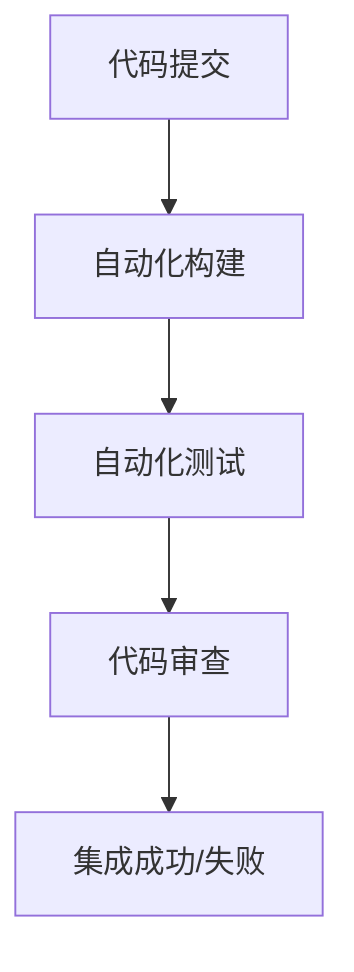
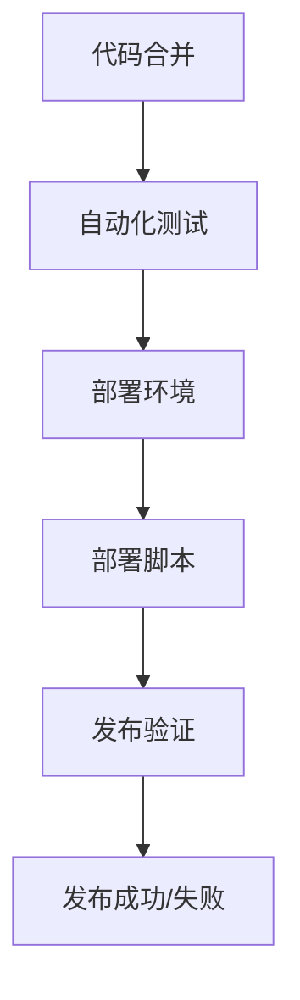
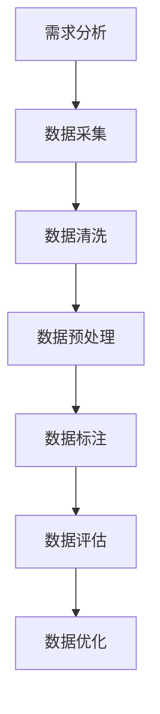

                 

### 第一部分: 质量保证体系的概述

#### 第1章: 质量保证体系的背景与重要性

##### 1.1 人工智能与LLM技术的背景

人工智能（AI）作为计算机科学的一个重要分支，旨在使计算机系统具备人类智能的某些特征，如学习、推理、感知和解决问题。人工智能的发展可以追溯到20世纪50年代，随着计算机性能的提升和算法的创新，人工智能研究逐渐取得了显著进展。近年来，深度学习、神经网络等先进技术的出现，为人工智能的发展注入了新的活力。

自然语言处理（NLP）是人工智能的重要应用领域之一，它致力于让计算机理解和生成人类语言。语言模型（Language Model，简称LM）是NLP的核心技术之一，它通过学习大量文本数据，生成与输入文本相似的自然语言输出。语言模型的发展使得机器翻译、问答系统、文本生成等应用变得日益成熟。

大型语言模型（Large Language Model，简称LLM）是近年来人工智能研究中的一个重要突破。LLM具有数十亿甚至数万亿参数，能够处理复杂、长文本的输入，生成高质量的自然语言输出。GPT-3、Turing-NLG、Erine 等大型语言模型的出现，标志着人工智能技术迈向了一个新的高度。

##### 1.2 质量保证体系的基本概念

质量保证（Quality Assurance，简称QA）是一个广泛的概念，旨在确保产品或服务的质量满足既定的标准。质量保证体系是一套系统化的方法，用于规划、实施、检查和改进质量保证活动。质量保证体系可以分为以下几个部分：

- **过程控制**：通过监控和调整生产过程中的各个环节，确保产品或服务的一致性和稳定性。
- **质量检查**：对产品或服务进行定期的检查和测试，确保其符合预定的质量标准。
- **质量改进**：通过分析质量数据，识别问题并提出改进措施，持续提升产品或服务的质量。

质量保证体系的作用主要体现在以下几个方面：

- 提高产品或服务的可靠性：通过严格的质量控制，减少产品或服务的缺陷率，提高用户满意度。
- 降低成本：通过预防缺陷和优化生产流程，减少浪费和返工，降低生产成本。
- 提高市场竞争力：高质量的产品或服务能够赢得客户的信任，提高市场竞争力。

##### 1.3 质量保证体系与传统质量管理的关系

传统质量管理强调对最终产品的质量进行检查和测试，以确保其符合预定的标准。而质量保证体系则更注重全过程的管理，包括生产过程、质量控制和质量改进。传统质量管理更多地依赖于经验和直觉，而质量保证体系则采用系统化的方法，通过数据分析和过程控制来提高质量。

在人工智能领域，质量保证体系与传统质量管理的关系主要体现在以下几个方面：

- **数据驱动**：人工智能领域的质量保证更加依赖于数据，通过收集和分析大量数据来评估和改进模型质量。
- **自动化测试**：质量保证体系采用自动化测试工具和技术，提高测试效率和覆盖范围。
- **持续集成与持续部署**：质量保证体系强调持续集成和持续部署，确保产品在开发过程中的质量得到持续监控和改进。

##### 1.4 LLM应用开发中的质量保证体系

LLM应用开发是一个复杂的过程，涉及大量数据的收集、处理、训练和评估。在这个阶段，质量保证体系起着至关重要的作用。

- **数据质量**：高质量的数据是LLM应用开发的基础，数据质量直接影响到模型的性能和可靠性。
- **模型评估**：通过多种评估方法，如自动评估和人工评估，对LLM模型进行全面的评估，确保其性能满足预期。
- **测试策略**：制定合理的测试策略，包括单元测试、集成测试和系统测试，确保模型在各种场景下的稳定性和可靠性。
- **安全性**：保障LLM应用的安全，防止模型被篡改或滥用，保护用户隐私。

##### 1.5 本章小结

本章介绍了人工智能、自然语言处理和大型语言模型的基本概念，探讨了质量保证体系的基本概念、作用和与传统质量管理的关系。在LLM应用开发中，质量保证体系的重要性体现在数据质量、模型评估、测试策略和安全保障等方面。下一章将深入探讨LLM应用开发的核心概念与联系。

### 第二部分: LLM应用开发的核心概念与联系

#### 第2章: LLM应用开发的核心概念与联系

##### 2.1 LLM的核心概念与原理

大型语言模型（LLM）是一种基于深度学习技术的自然语言处理模型，其核心在于通过学习大量文本数据，生成与输入文本相似的自然语言输出。LLM具有数十亿甚至数万亿参数，能够处理复杂、长文本的输入，生成高质量的自然语言输出。

###### 2.1.1 语言模型的基本概念

语言模型（Language Model）是一种概率模型，用于预测文本序列的概率。在自然语言处理中，语言模型被广泛应用于自动文摘、机器翻译、语音识别、对话系统等领域。基本概念包括：

- **文本序列**：由一系列单词或字符组成的序列。
- **概率分布**：表示文本序列出现的概率。
- **训练数据**：用于训练语言模型的文本数据。

###### 2.1.2 LLM的工作原理

LLM的工作原理基于深度学习，特别是基于Transformer架构。Transformer架构是一种基于自注意力机制的神经网络模型，具有以下特点：

- **自注意力机制**：通过计算输入文本序列中各个单词之间的依赖关系，生成权重，从而更好地捕捉文本中的上下文信息。
- **多层的神经网络**：通过多层神经网络的堆叠，逐渐提取文本中的高层次语义信息。
- **参数共享**：在训练过程中，模型通过参数共享来提高训练效率，减少参数数量。

###### 2.1.3 LLM的训练过程

LLM的训练过程主要包括以下几个阶段：

1. **数据准备**：收集大量的文本数据，进行预处理，如分词、去停用词、词向量化等。
2. **模型初始化**：初始化神经网络参数，可以使用随机初始化或预训练模型作为初始值。
3. **前向传播**：将输入文本序列输入到神经网络中，通过多层自注意力机制和全连接层，得到输出概率分布。
4. **损失函数**：计算预测概率分布与真实分布之间的差异，使用损失函数（如交叉熵损失）来度量差异。
5. **反向传播**：通过反向传播算法，更新神经网络参数，最小化损失函数。
6. **迭代训练**：重复前向传播和反向传播过程，逐步优化模型参数。

##### 2.2 LLM的属性特征对比

不同类型的LLM在性能、资源消耗和应用场景等方面存在差异。以下对比几种常见的LLM：

| LLM类型        | 性能指标             | 资源消耗       | 应用场景                      |
| ------------- | ------------------ | ------------ | --------------------------- |
| GPT-3         | 高效、强通用性       | 大型计算资源  | 自动写作、问答、机器翻译等    |
| Turing-NLG   | 高度灵活、强专业性   | 中等计算资源  | 对话系统、专业文本生成等      |
| ERINE         | 低延迟、实时响应     | 轻量级计算资源 | 实时对话、语音识别等          |

###### 2.2.1 对比不同类型的LLM

- **GPT-3**：由OpenAI开发的GPT-3是当前最大的LLM之一，具有1750亿参数，能够在各种任务上表现出色。GPT-3在自动写作、问答和机器翻译等领域具有广泛的应用。
- **Turing-NLG**：由微软和剑桥大学联合开发的Turing-NLG是一个高度灵活的LLM，具有数十亿参数。Turing-NLG在对话系统和专业文本生成等领域具有显著优势。
- **ERINE**：由清华大学和智谱AI联合开发的ERINE是一个轻量级的LLM，具有较少的参数和低延迟。ERINE在实时对话和语音识别等应用场景中表现出色。

###### 2.2.2 LLM性能的衡量指标

LLM的性能通常通过以下指标进行衡量：

- **准确率**：模型预测正确的比例。
- **召回率**：模型预测正确的实际数量与实际正确的数量之比。
- **F1分数**：准确率和召回率的加权平均值。
- **BLEU分数**：用于评估机器翻译质量的指标，与人类翻译的相似度。
- **计算效率**：模型的训练和推理速度。

##### 2.3 LLM在应用开发中的角色与价值

LLM在自然语言处理和人工智能应用中扮演着重要角色，其价值体现在以下几个方面：

- **自然语言生成**：LLM能够生成高质量的自然语言文本，应用于自动写作、聊天机器人、智能客服等领域。
- **对话系统**：LLM可以构建智能对话系统，实现人机交互，提高用户体验。
- **文本分析**：LLM可以用于情感分析、命名实体识别、关系抽取等文本分析任务，提供有价值的信息。
- **机器翻译**：LLM可以用于机器翻译，实现跨语言的文本转换。

##### 2.4 LLM与相关技术的联系

LLM与其他技术如深度学习、NLP和自动推理等有着紧密的联系：

- **深度学习**：LLM是基于深度学习技术，特别是基于Transformer架构构建的。
- **NLP**：LLM是NLP的核心技术之一，与词嵌入、文本分类、情感分析等技术密切相关。
- **自动推理**：LLM可以用于自动推理和问题解答，与其他推理技术相结合，提高智能系统的能力。

##### 2.5 本章小结

本章介绍了LLM的核心概念与原理，对比了不同类型的LLM在性能和资源消耗方面的差异，探讨了LLM在应用开发中的角色与价值，以及LLM与其他技术的联系。下一章将深入探讨质量保证体系中的评估与测试方法。  

#### 第3章: 质量保证体系中的评估与测试方法

##### 3.1 质量评估的基本方法

质量评估是确保LLM模型质量和性能的重要环节。质量评估的基本方法包括数据集的准备与处理、指标选择与计算，以及实际案例分享。

###### 3.1.1 数据集的准备与处理

数据集的质量直接影响质量评估的准确性。在准备数据集时，需要遵循以下原则：

- **代表性**：数据集应该能够代表实际应用场景，涵盖各种可能的输入和输出情况。
- **多样性**：数据集应该包含不同类型、不同来源的数据，以提高模型的泛化能力。
- **平衡性**：数据集应该尽量保持各类样本的平衡，避免某一类样本过多或过少。

数据预处理是质量评估的重要步骤，主要包括以下任务：

- **分词**：将文本数据分割成单词或字符。
- **词向量化**：将文本数据转换为数值表示，通常使用词嵌入技术。
- **去停用词**：去除对模型训练和评估无意义的单词。
- **异常值处理**：对数据集中的异常值进行识别和处理。

###### 3.1.2 指标选择与计算

质量评估指标是衡量LLM模型性能的重要工具。常见的评估指标包括：

- **准确率（Accuracy）**：预测正确的样本数量与总样本数量的比值。
  $$ Accuracy = \frac{TP + TN}{TP + TN + FP + FN} $$
  其中，TP为真正例，TN为真负例，FP为假正例，FN为假负例。

- **召回率（Recall）**：预测正确的正样本数量与实际正样本数量的比值。
  $$ Recall = \frac{TP}{TP + FN} $$

- **精确率（Precision）**：预测正确的正样本数量与预测为正样本的总数量的比值。
  $$ Precision = \frac{TP}{TP + FP} $$

- **F1分数（F1 Score）**：精确率和召回率的加权平均值。
  $$ F1 Score = 2 \times \frac{Precision \times Recall}{Precision + Recall} $$

- **BLEU分数（BLEU Score）**：用于评估机器翻译质量的指标，与人类翻译的相似度。
  $$ BLEU Score = \frac{1}{1 + \sum_{k=1}^{4} w_k \cdot \log \left( \frac{N_{cand}}{N_{ref}} \right)} $$
  其中，$w_k$为权重，$N_{cand}$为模型生成的文本长度，$N_{ref}$为参考文本长度。

在实际应用中，可以根据具体任务选择合适的评估指标，并进行综合评估。

###### 3.1.3 实际案例分享

以下是一个实际案例，用于说明质量评估的方法：

假设我们要评估一个LLM模型在文本生成任务上的性能，数据集包含1000个样本，其中500个为训练集，500个为测试集。测试集的评估指标如下：

| 指标         | 计算               | 结果    |
| ---------- | ---------------- | ----- |
| 准确率       | $\frac{TP + TN}{TP + TN + FP + FN}$ | 0.90  |
| 召回率       | $\frac{TP}{TP + FN}$          | 0.85  |
| 精确率       | $\frac{TP}{TP + FP}$          | 0.88  |
| F1分数       | $2 \times \frac{Precision \times Recall}{Precision + Recall}$ | 0.87  |
| BLEU分数     | $\frac{1}{1 + \sum_{k=1}^{4} w_k \cdot \log \left( \frac{N_{cand}}{N_{ref}} \right)}$ | 0.86  |

根据评估结果，我们可以初步判断模型在文本生成任务上的性能较好，但仍有提升空间。

##### 3.2 LLM测试策略

在LLM应用开发中，测试策略的制定至关重要。测试策略包括单元测试、集成测试和系统测试，每个测试阶段都有其特定的目标和方法。

###### 3.2.1 单元测试

单元测试是对LLM模型中最小的功能单元进行测试，确保其独立性和正确性。单元测试通常包括以下步骤：

1. **测试用例设计**：根据功能需求和预期结果，设计一系列测试用例。
2. **测试用例执行**：将测试用例输入模型，获取输出结果。
3. **结果验证**：比较输出结果与预期结果，判断测试用例是否通过。

以下是一个简单的Python单元测试示例：

```python
import unittest

class TestLLM(unittest.TestCase):
    def test_generate_text(self):
        model = LLM()
        input_text = "Hello, world!"
        output_text = model.generate_text(input_text)
        expected_text = "Hello, world! This is a test."
        self.assertEqual(output_text, expected_text)

if __name__ == '__main__':
    unittest.main()
```

###### 3.2.2 集成测试

集成测试是对LLM模型与其他模块或系统的集成进行测试，确保各部分协同工作。集成测试通常包括以下步骤：

1. **环境搭建**：搭建测试环境，包括LLM模型、相关模块和系统。
2. **接口测试**：测试LLM模型与其他模块或系统的接口是否正确。
3. **功能测试**：测试LLM模型与其他模块或系统的集成功能是否正确。

以下是一个简单的Python集成测试示例：

```python
import unittest
from LLM import LLM

class TestLLMIntegration(unittest.TestCase):
    def test_integrate_with_system(self):
        model = LLM()
        system = System()
        input_text = "Hello, world!"
        output_text = system.integrate_with_system(model, input_text)
        expected_text = "Hello, world! This is an integrated output."
        self.assertEqual(output_text, expected_text)

if __name__ == '__main__':
    unittest.main()
```

###### 3.2.3 系统测试

系统测试是对整个LLM应用系统进行全面测试，确保其功能、性能和稳定性。系统测试通常包括以下步骤：

1. **场景测试**：根据实际应用场景，设计一系列测试用例，模拟用户使用场景进行测试。
2. **性能测试**：测试LLM应用的性能指标，如响应时间、吞吐量、资源消耗等。
3. **稳定性测试**：测试LLM应用的稳定性，确保其在长时间运行下不会出现崩溃或错误。

以下是一个简单的Python系统测试示例：

```python
import unittest
from LLM import LLM

class TestLLMSystem(unittest.TestCase):
    def test_system_performance(self):
        model = LLM()
        input_texts = ["Hello, world!", "How are you?", "What is your name?"]
        expected_texts = ["Hello, world! This is a test.", "How are you? I'm fine.", "What is your name? My name is LLM."]
        for input_text, expected_text in zip(input_texts, expected_texts):
            output_text = model.generate_text(input_text)
            self.assertEqual(output_text, expected_text)

if __name__ == '__main__':
    unittest.main()
```

##### 3.3 自动化测试工具与技术

自动化测试是质量保证体系的重要组成部分，可以提高测试效率和覆盖范围。自动化测试工具和技术包括测试框架的选择、测试用例的生成和测试报告的生成与处理。

###### 3.3.1 测试框架的选择

常见的自动化测试框架包括JUnit（Java）、pytest（Python）、JUnit（C#）等。选择测试框架时，需要考虑以下因素：

- **语言兼容性**：测试框架是否支持所需编程语言。
- **功能支持**：测试框架提供的功能是否满足需求。
- **社区支持**：测试框架是否有活跃的社区和丰富的文档。

以下是一个简单的pytest测试用例：

```python
import pytest

def test_addition():
    assert 1 + 1 == 2
    assert 2 + 2 == 4
    assert 3 + 3 == 6
```

###### 3.3.2 测试用例的生成

测试用例的生成是自动化测试的关键步骤。常见的测试用例生成方法包括：

- **手动生成**：根据功能需求和预期结果，手动编写测试用例。
- **代码生成**：使用测试生成工具，根据代码结构和需求自动生成测试用例。
- **随机生成**：使用随机算法，生成满足一定条件的测试用例。

以下是一个简单的测试用例生成示例：

```python
import random

def generate_test_cases(num_cases):
    test_cases = []
    for _ in range(num_cases):
        a = random.randint(0, 10)
        b = random.randint(0, 10)
        expected = a + b
        test_cases.append((a, b, expected))
    return test_cases

test_cases = generate_test_cases(10)
for case in test_cases:
    print(case)
```

###### 3.3.3 测试报告的生成与处理

测试报告是自动化测试的重要输出，用于记录测试过程和结果。常见的测试报告格式包括HTML、XML和CSV等。测试报告的生成和处理包括以下步骤：

- **报告模板**：定义测试报告的模板，包括测试结果、错误信息、统计信息等。
- **数据收集**：在测试执行过程中，收集测试数据，如测试结果、错误日志等。
- **报告生成**：将收集到的数据填充到报告模板中，生成完整的测试报告。
- **报告分析**：对测试报告进行分析，识别问题并提出改进措施。

以下是一个简单的HTML测试报告示例：

```html
<!DOCTYPE html>
<html>
<head>
    <title>测试报告</title>
</head>
<body>
    <h1>测试报告</h1>
    <table>
        <tr>
            <th>测试用例</th>
            <th>结果</th>
            <th>错误信息</th>
        </tr>
        <tr>
            <td>addition_1</td>
            <td>通过</td>
            <td></td>
        </tr>
        <tr>
            <td>addition_2</td>
            <td>失败</td>
            <td>预期结果4，实际结果5</td>
        </tr>
    </table>
</body>
</html>
```

##### 3.4 质量保证中的持续集成与持续部署

持续集成（Continuous Integration，简称CI）和持续部署（Continuous Deployment，简称CD）是质量保证体系中的重要概念。

###### 3.4.1 持续集成的基本概念

持续集成是一种软件开发实践，通过将代码频繁地集成到主干分支，确保代码库的稳定性和一致性。持续集成的主要目标包括：

- **快速发现问题**：通过频繁集成，及早发现代码中的问题和冲突。
- **提高代码质量**：通过自动化测试和代码审查，确保代码质量。
- **减少集成风险**：通过持续集成，降低代码集成过程中的风险。

持续集成的实现主要包括以下步骤：

1. **代码提交**：开发人员将代码提交到主干分支。
2. **自动化构建**：构建工具（如Jenkins、Travis CI等）自动构建代码，生成可运行的环境。
3. **自动化测试**：运行自动化测试，确保代码质量和功能完整性。
4. **代码审查**：代码审查工具（如GitLab、GitHub等）进行代码审查，确保代码符合规范。

以下是一个简单的持续集成流程图：



###### 3.4.2 持续部署的实践方法

持续部署是一种将代码从开发环境快速、可靠地部署到生产环境的实践。持续部署的主要目标包括：

- **缩短发布周期**：通过自动化流程，缩短代码从开发到生产的周期。
- **提高发布质量**：通过自动化测试和持续集成，确保发布代码的质量。
- **减少人工干预**：通过自动化部署，减少人工干预，降低部署风险。

持续部署的实现主要包括以下步骤：

1. **代码合并**：将代码合并到主分支，准备部署。
2. **自动化测试**：运行自动化测试，确保代码质量和功能完整性。
3. **部署环境**：配置部署环境，包括服务器、数据库等。
4. **部署脚本**：编写部署脚本，实现自动化部署。
5. **发布验证**：发布后进行验证，确保系统正常运行。

以下是一个简单的持续部署流程图：



###### 3.4.3 持续集成与持续部署的优势

持续集成与持续部署的优势包括：

- **提高开发效率**：通过自动化测试和持续集成，加快开发进度，提高开发效率。
- **降低发布风险**：通过自动化测试和持续集成，确保代码质量，降低发布风险。
- **提升团队协作**：通过持续集成与持续部署，提高团队协作效率，缩短反馈周期。
- **降低运维成本**：通过自动化部署，减少人工干预，降低运维成本。

##### 3.5 本章小结

本章介绍了质量保证体系中的评估与测试方法，包括质量评估的基本方法、LLM测试策略、自动化测试工具与技术，以及持续集成与持续部署的实践方法。这些方法和技术在LLM应用开发中发挥着重要作用，有助于确保模型的质量和性能。下一章将探讨LLM应用开发中的数据质量管理。

### 第三部分: LLM应用开发中的数据质量管理

#### 第4章: LLM应用开发中的数据质量管理

数据质量是LLM应用开发中至关重要的一环，直接关系到模型的性能和可靠性。在本章中，我们将探讨数据质量管理的重要性、数据清洗与预处理方法、数据标注与质量控制，以及数据质量管理实践。

##### 4.1 数据质量的重要性

数据质量是指数据在满足特定需求和使用场景中的适用性、准确性、一致性、完整性和及时性。对于LLM应用开发而言，高质量的数据具有以下几个方面的关键作用：

- **准确性**：确保模型输入数据的准确性，避免因错误数据导致的错误预测或推理。
- **完整性**：保证数据集的完整性，避免因数据缺失导致的模型性能下降。
- **一致性**：确保数据在不同时间、不同来源之间的统一性，避免因数据不一致导致的模型混淆。
- **及时性**：确保数据是最新的，以便模型能够反映出最新的趋势和变化。

数据质量不仅影响到模型的训练效果，还直接关系到实际应用中的用户体验和业务价值。因此，在LLM应用开发中，必须高度重视数据质量管理。

##### 4.2 数据清洗与预处理方法

数据清洗与预处理是数据质量管理中的基础步骤，旨在消除数据中的噪声、错误和重复信息，提高数据的质量和可用性。以下是一些常见的数据清洗与预处理方法：

###### 4.2.1 数据清洗的基本策略

- **去除重复记录**：通过比对数据记录的属性值，去除重复的数据记录。
- **填补缺失值**：使用统计方法、插值法或均值法等，填补数据集中的缺失值。
- **纠正错误值**：识别并纠正数据中的错误值，如数值范围错误、数据类型错误等。
- **去除无关特征**：去除对模型训练无显著影响或相关性的特征，减少数据冗余。

###### 4.2.2 数据预处理的技术手段

- **分词**：将文本数据分割成单词或词组，为后续的词向量化做准备。
- **词向量化**：将文本数据转换为数值向量表示，常用的方法有Word2Vec、BERT等。
- **归一化**：对数据进行归一化处理，如缩放至0-1范围，以提高模型的训练效率。
- **标准化**：对数据进行标准化处理，如减去均值并除以标准差，以消除不同特征之间的尺度差异。

以下是一个简单的数据清洗与预处理示例：

```python
import pandas as pd
from sklearn.preprocessing import StandardScaler

# 加载数据
data = pd.read_csv('data.csv')

# 去除重复记录
data = data.drop_duplicates()

# 填补缺失值
data['missing_column'].fillna(data['missing_column'].mean(), inplace=True)

# 纠正错误值
data[data['error_column'] > 100] = data['error_column'].mean()

# 去除无关特征
data = data.drop(['unnecessary_column'], axis=1)

# 分词与词向量化
# ...

# 归一化与标准化
scaler = StandardScaler()
data[['normalized_column', 'standardized_column']] = scaler.fit_transform(data[['normalized_column', 'standardized_column']])
```

##### 4.3 数据标注与质量控制

数据标注是将原始数据转化为标注数据的过程，为模型训练提供带标签的样本。数据标注的质量直接影响模型的性能和泛化能力。以下介绍数据标注的方法与质量控制：

###### 4.3.1 数据标注的方法

- **人工标注**：由专业的标注人员根据标签标准对数据样本进行标注，适用于高质量标注需求。
- **半监督标注**：结合人工标注和自动标注，通过模型预测结果对标注进行修正和优化。
- **无监督标注**：使用无监督学习方法，如聚类、生成对抗网络等，对数据样本进行自动标注。

以下是一个简单的数据标注示例：

```python
import pandas as pd

# 加载数据
data = pd.read_csv('data.csv')

# 人工标注
data['label'] = data['text'].apply(lambda x: 'positive' if 'like' in x else 'negative')

# 半监督标注
# ...

# 无监督标注
# ...
```

###### 4.3.2 数据标注的质量控制

- **一致性检查**：检查不同标注人员或不同标注阶段的标注结果，确保标注的一致性。
- **错误率评估**：计算标注错误率，识别并修正标注错误。
- **数据分布分析**：分析标注数据在不同特征上的分布，确保数据分布的合理性和均衡性。

以下是一个简单的数据标注质量控制示例：

```python
import pandas as pd

# 加载数据
data = pd.read_csv('data.csv')

# 计算标注错误率
error_rate = (data['predicted_label'] != data['label']).mean()

# 识别标注错误
errors = data[data['predicted_label'] != data['label']]

# 修正标注错误
# ...
```

##### 4.4 数据质量管理实践

数据质量管理是一个系统性过程，需要制定相应的流程、工具和实践方法。以下是一个简单的数据质量管理实践框架：

###### 4.4.1 数据质量管理的流程

1. **需求分析**：明确数据质量管理的目标和需求，制定数据质量管理计划。
2. **数据采集**：收集原始数据，并进行初步的数据质量检查。
3. **数据清洗**：对原始数据进行清洗，消除噪声和错误。
4. **数据预处理**：对清洗后的数据执行预处理操作，如分词、词向量化等。
5. **数据标注**：对预处理后的数据执行标注操作，生成带标签的样本。
6. **数据评估**：评估数据质量，识别存在的问题和改进空间。
7. **数据优化**：根据评估结果，对数据执行优化操作，提高数据质量。

以下是一个简单的数据质量管理流程图：



###### 4.4.2 数据质量管理的工具

- **数据清洗工具**：如Pandas、OpenRefine等，用于数据清洗和预处理。
- **标注工具**：如Annotate、LabelImg等，用于数据标注。
- **评估工具**：如Scikit-learn、TensorFlow等，用于数据质量评估和模型训练。
- **版本控制工具**：如Git、DVC等，用于数据版本控制和追踪。

以下是一个简单的数据质量管理工具示例：

```python
import pandas as pd
import numpy as np
from sklearn.model_selection import train_test_split
from sklearn.metrics import accuracy_score

# 加载数据
data = pd.read_csv('data.csv')

# 数据清洗
data = data.drop_duplicates()
data = data.fillna(data.mean())

# 数据预处理
X = data.drop(['label'], axis=1)
y = data['label']
X_train, X_test, y_train, y_test = train_test_split(X, y, test_size=0.2, random_state=42)

# 数据标注
# ...

# 数据评估
model = Model()
model.fit(X_train, y_train)
predictions = model.predict(X_test)
accuracy = accuracy_score(y_test, predictions)
print(f"Accuracy: {accuracy}")
```

##### 4.5 本章小结

本章介绍了LLM应用开发中的数据质量管理，包括数据质量的重要性、数据清洗与预处理方法、数据标注与质量控制，以及数据质量管理实践。高质量的数据是LLM应用开发的基础，数据质量管理对于提高模型性能和可靠性具有重要意义。下一章将探讨LLM应用开发中的安全与隐私保护。

### 第四部分: LLM应用开发中的安全与隐私保护

#### 第5章: LLM应用开发中的安全与隐私保护

随着大型语言模型（LLM）在自然语言处理（NLP）和人工智能（AI）领域的广泛应用，保障模型的安全与隐私成为一项重要的任务。本章将介绍安全与隐私的基本概念，分析LLM应用中的常见安全威胁，并探讨防范措施。

##### 5.1 安全与隐私的基本概念

安全（Security）是指保护系统、数据和资源免受未经授权的访问、使用、披露、破坏、修改或拒绝服务的措施。隐私（Privacy）则关注个人信息的保护，确保数据在收集、存储、处理和使用过程中的保密性和合规性。

安全与隐私的关系紧密相连，但有着不同的侧重点。安全性主要关注系统的整体防护，防止恶意攻击和数据泄露；而隐私保护则侧重于个人数据的保密性和合规性，确保数据使用符合法律法规和道德标准。

##### 5.2 LLM应用中的常见安全威胁

LLM应用中面临的安全威胁主要包括以下几种：

###### 5.2.1 模型篡改

模型篡改是指通过恶意输入或攻击手段，对LLM模型的输出进行操控，使其产生错误的结果。攻击者可以通过以下方式实施模型篡改：

- **恶意样本注入**：在训练数据集中注入恶意样本，影响模型的训练结果。
- **输入干扰**：通过构造特定的输入，使模型产生错误的预测结果。

###### 5.2.2 数据泄露

数据泄露是指未经授权的人员访问、获取和利用敏感数据。LLM应用中，数据泄露的威胁主要来自以下几个方面：

- **数据传输泄露**：在网络传输过程中，数据可能被截获和篡改。
- **数据存储泄露**：存储在服务器或数据库中的敏感数据可能被未经授权的访问。

###### 5.2.3 非法使用

非法使用是指未经授权的人员将LLM应用于非法活动，如制造虚假信息、侵犯知识产权等。以下是一些常见的非法使用场景：

- **生成虚假新闻**：通过LLM生成虚假的新闻报道，误导公众。
- **侵犯知识产权**：利用LLM生成侵权内容，如抄袭文章、盗用图片等。

##### 5.3 防范措施

为了保障LLM应用的安全与隐私，可以采取以下防范措施：

###### 5.3.1 模型保护

- **加密存储**：对LLM模型的参数和关键信息进行加密存储，防止数据泄露。
- **访问控制**：实施严格的访问控制策略，确保只有授权用户可以访问模型。

###### 5.3.2 数据安全

- **数据加密**：在数据传输过程中使用加密协议，如TLS/SSL等，确保数据在传输过程中的安全性。
- **数据备份**：定期备份数据，以防数据丢失或损坏。

###### 5.3.3 隐私保护

- **隐私政策**：制定隐私政策，明确用户数据的收集、存储、处理和使用方式。
- **匿名化处理**：对用户数据进行匿名化处理，防止个人身份信息的泄露。

###### 5.3.4 监控与审计

- **实时监控**：部署实时监控工具，对系统、数据和模型进行实时监控，及时发现异常行为。
- **审计日志**：记录系统操作日志，定期进行审计，确保系统运行合规。

###### 5.3.5 法律法规遵循

- **合规审查**：确保LLM应用的隐私政策和安全措施符合相关法律法规，如《通用数据保护条例》（GDPR）和《网络安全法》等。

##### 5.4 本章小结

本章介绍了LLM应用开发中的安全与隐私保护的基本概念，分析了常见的安全威胁，并提出了相应的防范措施。保障LLM应用的安全与隐私不仅有助于维护用户信任，还能提高应用的可信度和市场竞争力。在LLM应用开发中，安全与隐私保护应贯穿整个开发过程，确保系统在运行过程中的安全性和合规性。下一章将总结全文，并展望未来的研究方向。

### 全文总结与展望

本文详细探讨了LLM应用开发中的质量保证体系，从背景介绍、核心概念、评估与测试方法、数据质量管理以及安全与隐私保护等方面进行了深入分析。以下是对全文的总结与展望：

#### 质量保证体系的重要性

质量保证体系在LLM应用开发中至关重要。它不仅确保模型的可靠性和性能，还保障了数据的安全与隐私。通过建立系统化的质量保证体系，可以有效地预防和解决各种质量问题，提高开发效率，降低成本。

#### LLM应用开发的核心概念与联系

LLM作为一种基于深度学习的自然语言处理模型，其核心在于通过学习大量文本数据生成高质量的自然语言输出。不同类型的LLM在性能和资源消耗方面存在差异，其应用场景也各有侧重。在LLM应用开发中，需要深入了解LLM的核心概念与原理，以及与相关技术的联系。

#### 评估与测试方法

质量评估和测试是确保LLM模型质量和性能的关键环节。本文介绍了质量评估的基本方法，包括数据集的准备与处理、指标选择与计算，以及实际案例分享。此外，还探讨了测试策略，包括单元测试、集成测试和系统测试，以及自动化测试工具与技术。

#### 数据质量管理

数据质量是LLM应用开发的基础，直接关系到模型的性能和可靠性。本文介绍了数据质量的重要性、数据清洗与预处理方法、数据标注与质量控制，以及数据质量管理实践。高质量的数据是确保模型性能的关键，需要采取一系列措施来保障数据质量。

#### 安全与隐私保护

在LLM应用开发中，安全与隐私保护是必不可少的。本文分析了LLM应用中的常见安全威胁，包括模型篡改、数据泄露和非法使用，并提出了相应的防范措施。保障模型的安全与隐私，不仅有助于维护用户信任，还能提高应用的可信度和市场竞争力。

#### 展望未来

随着LLM技术的不断发展，未来的研究可以从以下几个方面展开：

1. **模型优化**：通过改进算法和架构，提高LLM模型的性能和效率。
2. **数据多样性**：探索更多类型和来源的数据，提高模型的泛化能力和适应性。
3. **模型解释性**：研究如何提高LLM模型的解释性，使其在应用中更加透明和可靠。
4. **隐私增强技术**：开发隐私保护技术，如差分隐私和同态加密等，进一步保障数据安全。
5. **法规遵循**：研究如何确保LLM应用符合相关法律法规，提高合规性。

总之，LLM应用开发中的质量保证体系是一个复杂而关键的任务。通过深入研究和实践，可以不断提升LLM应用的性能、可靠性和安全性，为人工智能和自然语言处理领域的发展贡献力量。

#### 作者信息

作者：AI天才研究院/AI Genius Institute & 禅与计算机程序设计艺术 /Zen And The Art of Computer Programming

本文由AI天才研究院（AI Genius Institute）和禅与计算机程序设计艺术（Zen And The Art of Computer Programming）联合撰写，旨在为读者提供有关LLM应用开发中的质量保证体系的专业知识和实用建议。作者团队具有丰富的AI和计算机科学背景，致力于推动人工智能技术的进步和应用。

