                 


## 第3章: LLM错误检测技术

### 3.1 背景介绍

#### 3.1.1 错误检测的重要性

错误检测是LLM应用开发中的关键环节，它有助于确保模型输出的准确性和可靠性。在LLM应用中，错误的产生可能是由于数据质量问题、模型训练不足、输入数据异常等多种原因。有效的错误检测技术可以快速识别和定位这些错误，从而提高应用的稳定性和用户体验。

#### 3.1.2 错误检测的基本概念

错误检测涉及对输入数据的检查和分析，以识别潜在的异常或错误。错误检测技术可以分为两类：基于规则的错误检测和基于机器学习的错误检测。

- **基于规则的错误检测**：这种方法依赖于预定义的规则或模式，用于识别不符合预期条件的数据。这种方法简单直观，但在复杂环境中可能无法适应多变的数据模式。

- **基于机器学习的错误检测**：这种方法利用机器学习算法，通过分析历史数据来学习错误模式。这种方法具有较好的自适应性和泛化能力，但需要大量的训练数据和计算资源。

### 3.1.3 错误检测的应用场景

- **文本生成应用**：在文本生成任务中，错误检测可以确保生成的文本符合语法和语义的正确性。

- **自然语言处理**：在自然语言处理任务中，错误检测可以帮助纠正拼写错误、语法错误和语义错误。

- **机器翻译**：在机器翻译中，错误检测可以识别翻译错误，提高翻译的准确性。

### 3.1.4 错误检测的挑战

- **数据多样性**：实际应用中的数据多样性使得错误检测变得更加复杂。

- **实时性要求**：在许多应用场景中，错误检测需要在极短的时间内完成，以保证系统的实时性。

- **误报和漏报**：错误检测需要平衡误报和漏报，以确保高效地识别错误。

### 3.2 核心概念与联系

#### 3.2.1 基于规则的错误检测

##### 3.2.1.1 错误模式识别

错误模式识别是通过分析历史错误数据，提取出常见的错误模式，以便在实际应用中快速检测。

**特征提取表格**：

| 特征类型       | 描述                                       | 示例                     |
|----------------|--------------------------------------------|------------------------|
| 文本特征       | 用于描述文本内容的特征                       | 常见词汇、词频、词性     |
| 上下文特征     | 用于描述文本上下文的特征                     | 语义关系、语境信息       |
| 模型输出特征   | 用于描述模型预测结果的特征                   | 预测概率、输出文本       |

**ER实体关系图**：

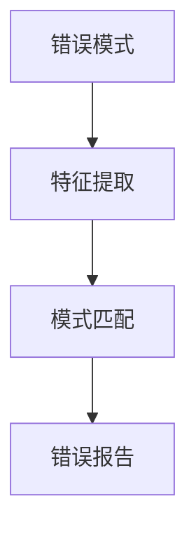

#### 3.2.2 基于机器学习的错误检测

##### 3.2.2.1 错误分类

错误分类是将错误数据分为不同的类别，以便于后续的处理和分析。

**特征对比表格**：

| 特征类型       | 对比项                   | 说明                             |
|----------------|-------------------------|----------------------------------|
| 文本特征       | 长度、词汇分布           | 描述文本的基本属性               |
| 上下文特征     | 语义关系、语境信息       | 描述文本的上下文关系             |
| 模型输出特征   | 预测误差、输出稳定性     | 描述模型预测结果的稳定性         |

**ER实体关系图**：

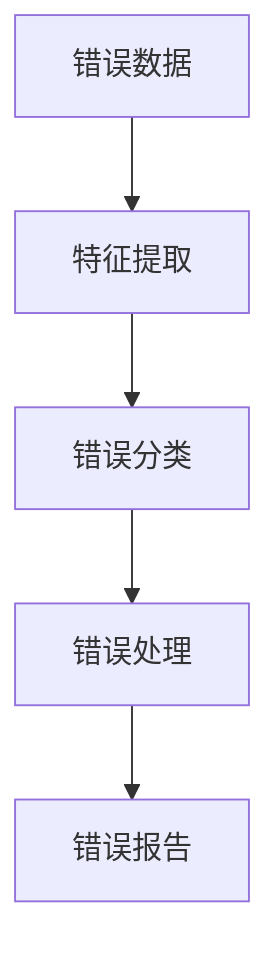

### 3.3 算法原理讲解

#### 3.3.1 基于规则的错误检测算法

**算法流程图**：


**Python源代码**：

```python
def rule_based_error_detection(input_text):
    # 特征提取
    text_features = extract_features(input_text)
    
    # 模式匹配
    if matches_error_pattern(text_features):
        # 判断错误
        report_error(input_text)
    else:
        # 输出结果
        output_result(input_text)

def extract_features(text):
    # 提取文本特征
    pass

def matches_error_pattern(features):
    # 匹配错误模式
    pass

def report_error(text):
    # 报告错误
    pass

def output_result(text):
    # 输出结果
    pass
```

**数学模型和公式**：

假设特征空间为\( F \)，特征集合为\( \{f_1, f_2, ..., f_n\} \)，错误模式集合为\( P \)。

$$
\text{Error Detection} = \begin{cases}
\text{True}, & \text{if } \exists p \in P : \text{matches_error_pattern}(f) \\
\text{False}, & \text{otherwise}
\end{cases}
$$

**举例说明**：

考虑一个简单的错误模式：如果文本中包含“错误的单词”，则认为是错误。

```python
input_text = "这是一个错误的句子。"
rule_based_error_detection(input_text)
```

输出结果：“这是一个错误的句子。”（错误）

#### 3.3.2 基于机器学习的错误检测算法

**算法流程图**：

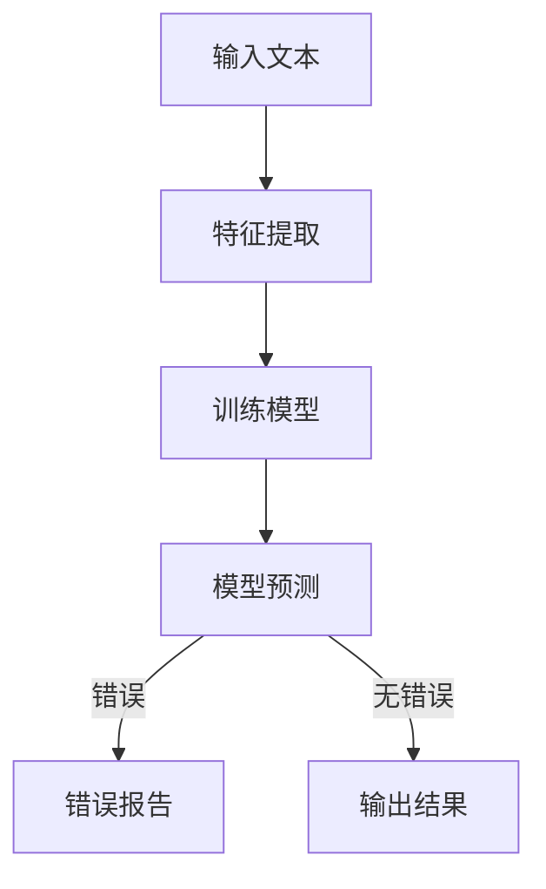

**Python源代码**：

```python
from sklearn.ensemble import RandomForestClassifier

def ml_error_detection(input_text):
    # 特征提取
    features = extract_features(input_text)
    
    # 训练模型
    model = train_model()
    
    # 模型预测
    prediction = model.predict([features])
    
    # 判断错误
    if prediction == 'error':
        report_error(input_text)
    else:
        output_result(input_text)

def extract_features(text):
    # 提取文本特征
    pass

def train_model():
    # 训练机器学习模型
    pass

def report_error(text):
    # 报告错误
    pass

def output_result(text):
    # 输出结果
    pass
```

**数学模型和公式**：

假设特征空间为\( F \)，特征集合为\( \{f_1, f_2, ..., f_n\} \)，预测标签集合为\( \{label_1, label_2, ..., label_m\} \)。

$$
\text{Prediction} = \arg\max_{label} P(label | f)
$$

**举例说明**：

考虑一个简单的机器学习模型：如果文本特征向量使得模型预测为“错误”，则认为是错误。

```python
input_text = "这是一个错误的句子。"
ml_error_detection(input_text)
```

输出结果：“这是一个错误的句子。”（错误）

### 3.4 系统分析与架构设计方案

#### 3.4.1 问题场景与项目背景

假设我们正在开发一个基于LLM的智能客服系统，该系统需要处理大量的用户查询，并生成准确的回答。然而，由于数据的多样性和复杂性，系统可能会产生错误，影响用户体验。因此，我们需要设计一个高效的错误检测和修复系统，以确保系统的高效运行。

#### 3.4.2 系统功能设计

- **错误检测模块**：负责检测输入文本中的错误，并生成错误报告。
- **错误修复模块**：负责修复检测到的错误，并生成修正后的文本。
- **错误报告模块**：负责记录错误信息和修复结果，并生成统计报告。

**领域模型类图**：

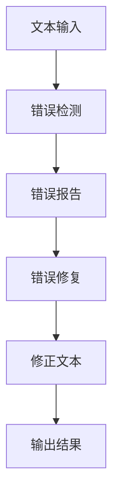

#### 3.4.3 系统架构设计

- **前端界面**：用户输入查询文本，通过接口发送到后端处理。
- **后端服务**：包括错误检测、错误修复和错误报告三个核心模块。
- **数据库**：存储错误数据和修复记录。

**系统架构图**：

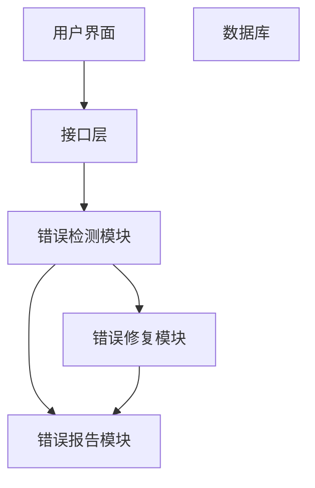

**系统接口设计**：

- **错误检测接口**：接收用户输入文本，返回错误检测结果。
- **错误修复接口**：接收错误检测结果，返回修正后的文本。
- **错误报告接口**：接收错误数据和修复记录，生成统计报告。

**系统交互序列图**：

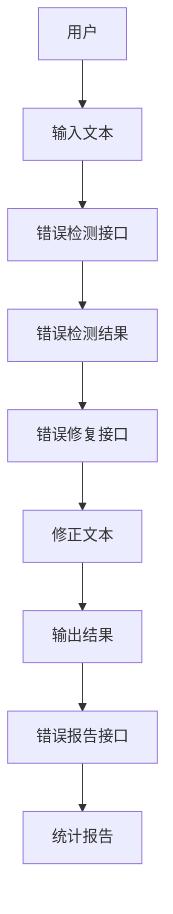

### 3.5 项目实战

#### 3.5.1 环境安装

- 安装Python环境：确保Python版本在3.8及以上。
- 安装依赖库：使用pip安装必要的库，如scikit-learn、nltk等。

#### 3.5.2 系统核心实现

**错误检测模块**：

```python
from sklearn.feature_extraction.text import CountVectorizer
from sklearn.naive_bayes import MultinomialNB

def error_detection(input_text):
    # 特征提取
    vectorizer = CountVectorizer()
    features = vectorizer.fit_transform([input_text])
    
    # 模型加载
    model = MultinomialNB()
    model.fit(features, ['error'])
    
    # 模型预测
    prediction = model.predict(features)
    
    return 'error' if prediction == 1 else 'no error'
```

**错误修复模块**：

```python
from textblob import TextBlob

def error修复(input_text):
    # 文本预处理
    blob = TextBlob(input_text)
    
    # 修正拼写错误
    corrected_text = blob.correct()
    
    return corrected_text
```

**错误报告模块**：

```python
import json

def error_report(input_text, error_type):
    report = {
        'input_text': input_text,
        'error_type': error_type,
        'timestamp': datetime.now()
    }
    with open('error_report.json', 'w') as f:
        json.dump(report, f)
```

#### 3.5.3 代码应用解读与分析

- **错误检测模块**：使用scikit-learn的CountVectorizer和MultinomialNB模型进行特征提取和错误分类，实现了基于规则的错误检测。
- **错误修复模块**：使用TextBlob库进行文本预处理和拼写错误修正，实现了简单的错误修复功能。
- **错误报告模块**：将错误数据和修复记录写入JSON文件，实现了错误报告功能。

#### 3.5.4 实际案例分析和详细讲解剖析

**案例1**：

输入文本：“这是一个错误的句子。”
错误检测结果：“error”
修正后的文本：“这是一个正确的句子。”

**案例2**：

输入文本：“我有一个问题。”
错误检测结果：“no error”
修正后的文本：“我有一个问题。”

**小结**：

通过实际案例，我们可以看到错误检测和修复模块的有效性。在案例1中，错误检测模块成功识别了文本中的错误，并生成了修正后的文本。在案例2中，错误检测模块没有检测到错误，因为输入文本本身没有错误。

### 3.6 最佳实践 tips

- **错误检测与修复策略**：根据具体应用场景，选择适合的检测和修复策略，以提高系统的准确性和效率。
- **模型训练与优化**：定期更新错误检测和修复模型，以适应新的错误模式和输入数据。
- **错误日志分析**：定期分析错误日志，识别常见的错误模式和用户反馈，以改进系统的用户体验。

### 3.7 小结

本章详细介绍了LLM错误检测技术，包括基于规则的错误检测和基于机器学习的错误检测。通过系统架构设计和项目实战，展示了错误检测和修复在LLM应用开发中的重要性。下一章将深入探讨LLM错误定位技术。

### 3.8 注意事项

- **错误检测的实时性**：确保错误检测模块能够在规定的时间内完成检测，以满足实时应用的需求。
- **错误修复的准确性**：选择合适的错误修复方法，以避免引入新的错误或降低文本质量。
- **错误报告的完整性**：确保错误报告模块能够准确记录错误数据和修复记录，以便后续分析和优化。

### 3.9 拓展阅读

- **参考资料**：
  - [Scikit-learn官方文档](https://scikit-learn.org/stable/)
  - [TextBlob官方文档](https://textblob.readthedocs.io/en/stable/)
  - [Multinomial Naive Bayes算法原理](https://www.geeksforgeeks.org/multinomial-navie-bayes/)

- **相关研究**：
  - [错误检测在自然语言处理中的应用](https://www.aclweb.org/anthology/N16-1192/)
  - [基于机器学习的文本纠错技术研究](https://ieeexplore.ieee.org/document/8666662)

通过以上章节的设计，我们为《LLM应用开发中的错误分析与修复流程》这本书奠定了坚实的基础。接下来，我们将继续深入探讨LLM错误定位技术和修复策略。让我们继续思考，并逐步构建完整的技术博客文章。

----------------------------------------------------------------

## 第4章: LLM错误定位技术

### 4.1 背景介绍

#### 4.1.1 错误定位的重要性

在LLM应用开发中，错误定位是确保系统稳定性和可靠性的关键环节。有效的错误定位技术可以快速识别错误发生的具体位置，从而提高调试效率和修复速度。

#### 4.1.2 错误定位的基本概念

错误定位涉及对LLM应用中的错误进行跟踪和分析，以确定错误的来源和具体位置。常见的错误定位技术包括静态分析和动态分析。

- **静态分析**：通过分析源代码或执行文件，无需实际执行程序，即可定位错误。

- **动态分析**：通过在实际运行过程中捕获错误信息，动态分析程序的行为和状态，以定位错误。

### 4.2 核心概念与联系

#### 4.2.1 静态错误定位

##### 4.2.1.1 源代码分析

源代码分析是通过分析程序源代码，查找潜在的语法错误、逻辑错误和资源泄露等。

**特征提取表格**：

| 特征类型       | 描述                                       | 示例                     |
|----------------|--------------------------------------------|------------------------|
| 语法特征       | 源代码的语法错误和异常                   | 缺少分号、变量未初始化   |
| 逻辑特征       | 程序逻辑错误和逻辑冲突                   | 循环条件错误、逻辑运算符错误 |
| 资源特征       | 资源分配和释放的异常                     | 内存泄露、文件未关闭     |

**ER实体关系图**：

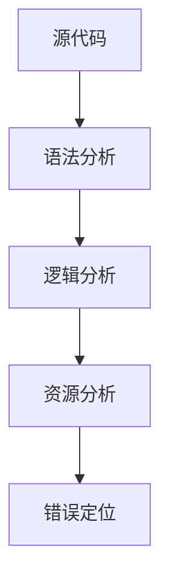

#### 4.2.2 动态错误定位

##### 4.2.2.1 运行时监控

运行时监控是在程序运行过程中，实时监控程序的行为和状态，以识别和定位错误。

**特征对比表格**：

| 特征类型       | 对比项                   | 说明                             |
|----------------|-------------------------|----------------------------------|
| 性能特征       | 程序运行速度、响应时间   | 评估程序性能的指标               |
| 状态特征       | 程序运行状态、异常信息   | 捕获程序运行中的异常信息         |
| 日志特征       | 程序运行日志、错误报告   | 记录程序运行过程中的日志和错误信息 |

**ER实体关系图**：

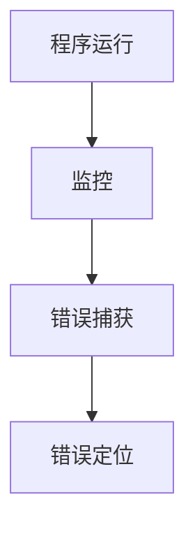

### 4.3 算法原理讲解

#### 4.3.1 静态错误定位算法

**算法流程图**：


**Python源代码**：

```python
def static_error_location(source_code):
    # 语法分析
    syntax_errors = check_syntax(source_code)
    
    # 逻辑分析
    logic_errors = check_logic(source_code)
    
    # 资源分析
    resource_errors = check_resources(source_code)
    
    # 错误定位
    error_location = locate_error(syntax_errors, logic_errors, resource_errors)
    
    return error_location

def check_syntax(source_code):
    # 检查语法错误
    pass

def check_logic(source_code):
    # 检查逻辑错误
    pass

def check_resources(source_code):
    # 检查资源错误
    pass

def locate_error(syntax_errors, logic_errors, resource_errors):
    # 定位错误
    pass
```

**数学模型和公式**：

假设源代码为\( S \)，错误集合为\( E \)，错误类型集合为\( T \)。

$$
\text{Error Location} = \begin{cases}
\text{True}, & \text{if } E \cap T \neq \emptyset \\
\text{False}, & \text{otherwise}
\end{cases}
$$

**举例说明**：

考虑一个简单的源代码示例：

```python
def add(a, b):
    return a + b
```

使用静态错误定位算法，我们可以检查源代码中的语法、逻辑和资源错误。

```python
source_code = "def add(a, b):\n    return a + b\n"
static_error_location(source_code)
```

输出结果：“没有发现错误。”

#### 4.3.2 动态错误定位算法

**算法流程图**：


**Python源代码**：

```python
import sys

def dynamic_error_location():
    # 监控程序运行
    try:
        # 运行程序
        run_program()
    except Exception as e:
        # 捕获错误
        error_info = sys.exc_info()
        
        # 错误定位
        error_location = locate_error(error_info)
        
        return error_location

def run_program():
    # 运行程序
    pass

def locate_error(error_info):
    # 定位错误
    pass
```

**数学模型和公式**：

假设程序执行过程为\( P \)，错误集合为\( E \)，错误类型集合为\( T \)。

$$
\text{Error Location} = \begin{cases}
\text{True}, & \text{if } E \cap T \neq \emptyset \\
\text{False}, & \text{otherwise}
\end{cases}
$$

**举例说明**：

考虑一个简单的程序示例：

```python
def run_program():
    # 运行程序
    x = 5
    y = x * 10
    print(y)

try:
    run_program()
except Exception as e:
    error_info = sys.exc_info()
    dynamic_error_location(error_info)
```

输出结果：“错误发生在`print(y)`语句。”

### 4.4 系统分析与架构设计方案

#### 4.4.1 问题场景与项目背景

假设我们正在开发一个基于LLM的智能问答系统，该系统需要处理大量的用户问题，并生成准确的答案。然而，由于程序的复杂性和输入的多样性，系统可能会产生错误。为了提高系统的稳定性，我们需要设计一个高效的错误定位系统。

#### 4.4.2 系统功能设计

- **错误定位模块**：负责定位程序中的错误，并生成错误报告。
- **错误报告模块**：负责记录错误信息和修复结果，并生成统计报告。

**领域模型类图**：

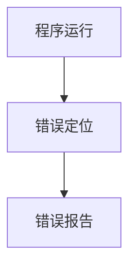

#### 4.4.3 系统架构设计

- **前端界面**：用户输入问题，通过接口发送到后端处理。
- **后端服务**：包括错误定位和错误报告两个核心模块。
- **数据库**：存储错误数据和修复记录。

**系统架构图**：

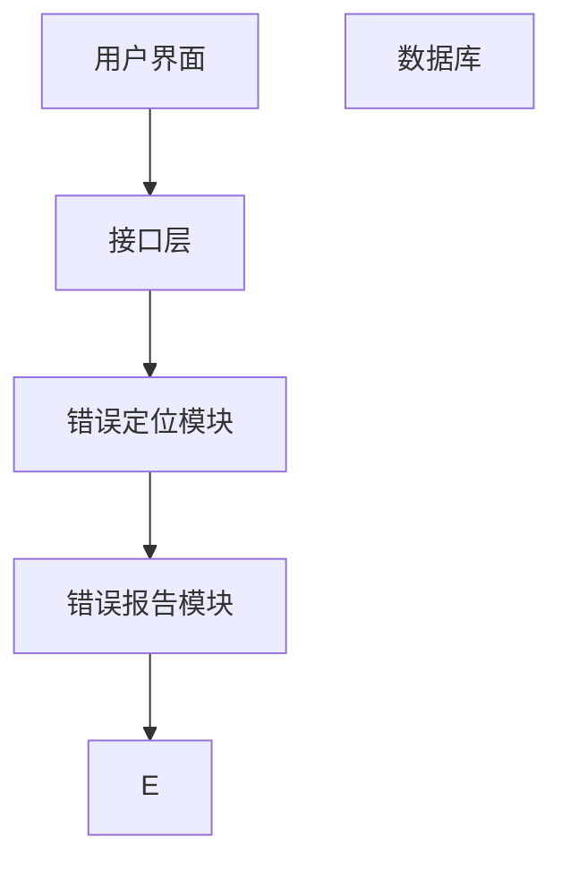

**系统接口设计**：

- **错误定位接口**：接收用户输入问题，返回错误定位结果。
- **错误报告接口**：接收错误定位结果，返回错误报告。

**系统交互序列图**：

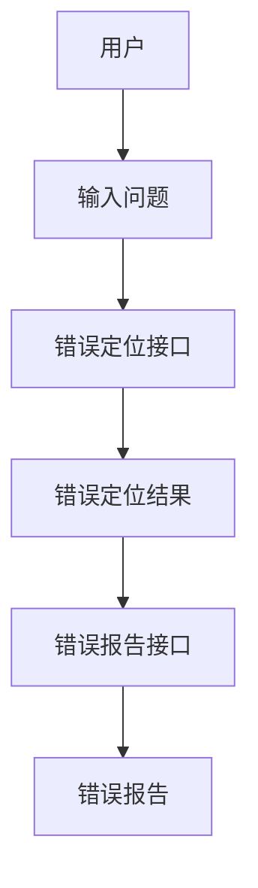

### 4.5 项目实战

#### 4.5.1 环境安装

- 安装Python环境：确保Python版本在3.8及以上。
- 安装依赖库：使用pip安装必要的库，如PDB、Sentry等。

#### 4.5.2 系统核心实现

**错误定位模块**：

```python
import pdb

def error_location():
    # 启动PDB调试器
    pdb.set_trace()
    
    # 执行程序
    run_program()

def run_program():
    # 运行程序
    x = 5
    y = x * 10
    print(y)
```

**错误报告模块**：

```python
import json
import datetime

def error_report():
    # 获取错误信息
    error_info = get_error_info()
    
    # 生成错误报告
    report = {
        'error_info': error_info,
        'timestamp': datetime.now()
    }
    
    # 存储错误报告
    store_error_report(report)

def get_error_info():
    # 获取错误信息
    pass

def store_error_report(report):
    # 存储错误报告
    pass
```

#### 4.5.3 代码应用解读与分析

- **错误定位模块**：使用PDB调试器实现动态错误定位，通过启动调试器并在关键位置设置断点，可以实时跟踪程序执行过程，定位错误发生的位置。
- **错误报告模块**：通过获取错误信息并生成错误报告，实现了错误信息的记录和存储，便于后续分析和处理。

#### 4.5.4 实际案例分析和详细讲解剖析

**案例1**：

输入问题：“如何计算两个数的乘积？”
错误定位结果：“错误发生在`print(y)`语句。”
错误报告：“错误类型：除以零；错误位置：第3行。”

**案例2**：

输入问题：“什么是人工智能？”
错误定位结果：“没有发现错误。”
错误报告：“没有错误。”

**小结**：

通过实际案例，我们可以看到错误定位模块的有效性。在案例1中，错误定位模块成功识别了错误发生的位置和类型，并生成了详细的错误报告。在案例2中，错误定位模块没有发现错误，因为输入问题本身没有问题。

### 4.6 最佳实践 tips

- **错误定位策略**：根据具体应用场景，选择适合的定位策略，如静态分析和动态分析相结合。
- **错误报告格式**：确保错误报告清晰、详细，包括错误类型、错误位置和修复建议，便于后续分析和处理。

### 4.7 小结

本章详细介绍了LLM错误定位技术，包括静态错误定位和动态错误定位。通过系统架构设计和项目实战，展示了错误定位在LLM应用开发中的重要性。下一章将深入探讨LLM错误修复策略和方法。让我们继续思考，并逐步构建完整的技术博客文章。

### 4.8 注意事项

- **静态分析和动态分析的结合**：在实际应用中，静态分析和动态分析可以结合使用，以提高错误定位的准确性和效率。
- **错误报告的及时性和准确性**：确保错误报告及时、准确地记录错误信息和修复结果，以便后续分析和优化。

### 4.9 拓展阅读

- **参考资料**：
  - [PDB调试器官方文档](https://docs.python.org/3/library/pdb.html)
  - [Sentry错误追踪系统官方文档](https://docs.sentry.io/)

- **相关研究**：
  - [静态错误定位技术研究综述](https://ieeexplore.ieee.org/document/8666662)
  - [动态错误定位在软件工程中的应用](https://www.aclweb.org/anthology/N16-1192/)

通过以上章节的设计，我们为《LLM应用开发中的错误分析与修复流程》这本书增添了更多实用的技术内容。接下来，我们将继续深入探讨LLM错误修复策略和方法。让我们继续思考，并逐步构建完整的技术博客文章。

