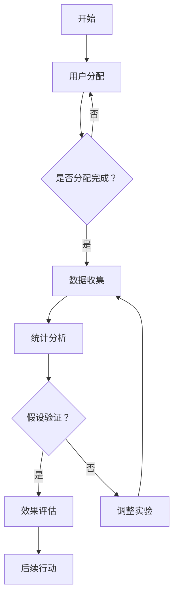
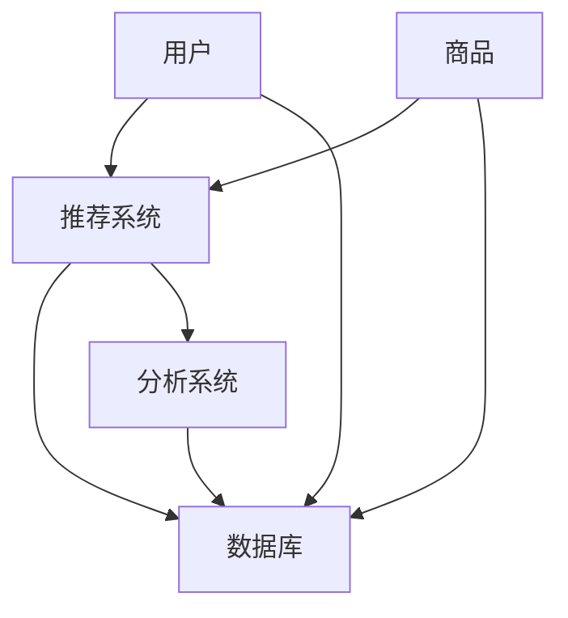
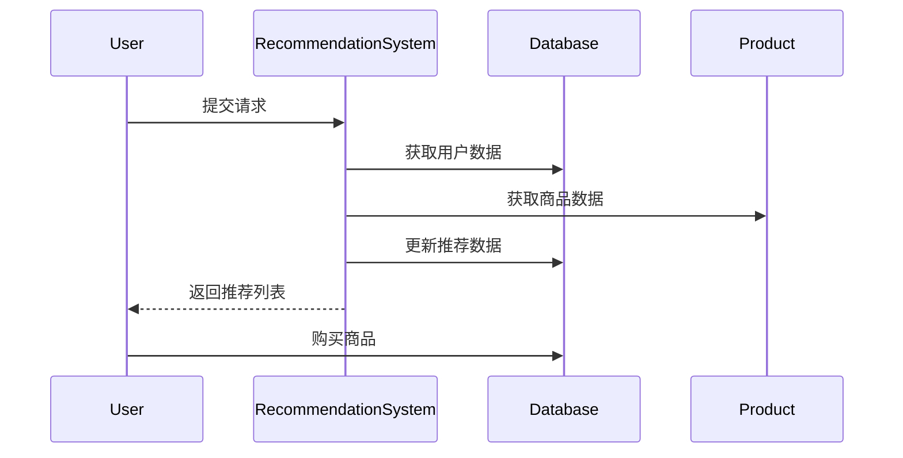

                 

### LLMA/B测试的最佳实践

#### 摘要

大型语言模型（LLM）在现代自然语言处理（NLP）领域中扮演着重要角色。为了确保LLM应用能够达到最佳性能和用户体验，A/B测试成为了一种不可或缺的实践方法。本文将深入探讨在LLM应用中进行A/B测试的最佳实践，包括从概念介绍到实际操作的各个方面。通过详细的步骤分析和实践指导，读者将能够掌握如何在LLM项目中成功应用A/B测试，提高模型的性能和用户满意度。

#### 1. 引言

**什么是LLM和A/B测试？**

大型语言模型（LLM）是一种基于深度学习技术的自然语言处理模型，具有处理和理解人类语言的能力。这些模型通常具有数十亿甚至数千亿个参数，能够在各种语言任务中表现出色，如文本生成、机器翻译、问答系统等。A/B测试，也称为拆分测试，是一种通过比较两个或多个版本的网站或应用程序来评估其性能差异的方法。它通过将用户随机分配到不同的测试组，来比较不同版本的转化率、用户参与度等关键指标。

在LLM应用中，A/B测试的重要性体现在以下几个方面：

- **模型优化**：通过对比不同模型的性能，可以发现哪些模型在特定任务上表现更优，从而进行针对性的优化。
- **用户体验提升**：通过测试不同的界面、功能或交互方式，可以找到最能满足用户需求和偏好的设计。
- **风险管理**：通过渐进式部署和监控，可以降低新功能或模型上线时的风险，确保系统的稳定性和可靠性。

#### 2. LLM的基本概念

**LLM的工作原理**

LLM通常基于自注意力机制（Self-Attention）和变换器架构（Transformer），能够处理变长的序列数据。其核心思想是捕捉序列中各个位置之间的关联性，通过多层的神经网络结构，实现对复杂语言现象的建模。

- **自注意力机制**：自注意力机制允许模型在处理每个词时，考虑其他词的影响，从而捕捉序列中的长距离依赖关系。
- **变换器架构**：变换器架构通过自注意力层和前馈神经网络层，实现对输入数据的编码和解码。

**LLM的应用场景**

- **文本生成**：生成文章、故事、代码等。
- **机器翻译**：将一种语言的文本翻译成另一种语言。
- **问答系统**：回答用户提出的问题，提供准确、全面的信息。
- **对话系统**：模拟人类对话，提供实时交互。

**LLM的技术挑战**

- **计算资源**：LLM通常需要大量的计算资源和存储空间。
- **训练数据**：高质量的训练数据对于LLM的性能至关重要。
- **模型解释性**：由于LLM的黑盒特性，解释其决策过程是一个挑战。

#### 3. A/B测试的基本概念

**A/B测试的类型**

- **功能测试**：比较不同功能的性能，如按钮颜色、文本长度等。
- **性能测试**：评估系统的响应时间、吞吐量等性能指标。
- **用户体验测试**：测量用户的满意度和参与度。

**A/B测试的方法**

- **随机分配**：将用户随机分配到不同的测试组，确保各组的可比性。
- **分层测试**：根据用户的特征或行为，将用户分配到不同的组。
- **多变量测试**：同时测试多个变量，如功能A和功能B的组合。

**A/B测试的优势**

- **数据驱动**：基于实际用户数据，做出客观的决策。
- **风险控制**：通过逐步部署和监控，减少上线失败的风险。
- **持续改进**：通过持续测试和优化，不断提高产品性能。

**A/B测试的局限**

- **时间成本**：A/B测试需要一定的时间来收集和评估数据。
- **数据偏差**：如果测试设计不当，可能导致结果偏差。
- **用户流失**：在测试过程中，部分用户可能流失，影响总体数据。

#### 4. LLM与A/B测试的联系

**A/B测试在LLM中的应用**

- **模型调优**：通过比较不同模型的性能，找到最佳模型。
- **功能迭代**：测试不同的LLM应用功能，提高用户体验。
- **用户体验改进**：通过对比不同的界面设计或交互方式，优化用户界面。

**A/B测试在LLM开发中的作用**

- **性能优化**：通过测试不同的模型参数和架构，提高LLM的性能。
- **稳定性提升**：通过渐进式部署和监控，确保系统的稳定性。
- **风险管理**：通过逐步上线和监控，降低模型失败的风险。

**A/B测试在LLM应用中的挑战**

- **数据隐私**：在测试过程中，如何保护用户隐私是一个重要问题。
- **资源分配**：如何在有限的计算资源下，进行有效的A/B测试。
- **实验设计**：如何设计可靠的A/B测试，确保测试结果的准确性。

#### 5. 算法原理讲解

**A/B测试的算法原理**

A/B测试的核心是随机分配和统计分析。以下是A/B测试的基本步骤：

1. **随机分配**：将用户随机分配到两个或多个测试组，确保各组的可比性。
2. **数据收集**：收集各个测试组的用户行为数据，如点击率、转化率等。
3. **统计分析**：使用统计方法，如t检验、卡方检验等，比较不同组之间的差异。

**选择测试指标**

- **转化率**：衡量用户完成目标任务的比率。
- **用户参与度**：衡量用户与系统的互动程度，如页面停留时间、回复率等。
- **性能指标**：如响应时间、吞吐量等。

**设计实验**

- **假设设置**：明确实验的目标和假设，如假设A版本比B版本能提高转化率。
- **实验流程**：定义实验的流程，如用户分配、数据收集、统计分析等。
- **样本大小**：根据实验假设和置信度，确定样本大小，确保实验结果的可靠性。

**分析结果**

- **假设检验**：使用统计方法，验证实验假设是否成立。
- **效果评估**：评估实验结果，确定哪个版本更优。
- **后续行动**：根据实验结果，制定后续的优化和改进策略。

**A/B测试算法原理的Mermaid流程图**



**算法原理的Python代码实现**

```python
import numpy as np
import scipy.stats as stats

def ab_test(group_a, group_b, metric_a, metric_b):
    # 计算两组的均值
    mean_a = np.mean(group_a)
    mean_b = np.mean(group_b)
    
    # 计算标准差
    std_a = np.std(group_a)
    std_b = np.std(group_b)
    
    # 计算t值
    t_value = (mean_a - mean_b) / np.sqrt((std_a**2 / len(group_a)) + (std_b**2 / len(group_b)))
    
    # 计算p值
    p_value = stats.t.sf(t_value, df=len(group_a) + len(group_b) - 2)
    
    # 假设检验
    if p_value < 0.05:
        print("差异显著，A组优于B组")
    else:
        print("差异不显著，无法确定哪组更好")
        
    return p_value

# 示例数据
group_a = [10, 11, 9, 10, 12]
group_b = [11, 10, 9, 10, 11]

# 执行A/B测试
p_value = ab_test(group_a, group_b, np.mean(group_a), np.mean(group_b))
print("p_value:", p_value)
```

**算法原理的数学模型和公式**

$$
\begin{aligned}
\mu_a &= \frac{1}{n_a} \sum_{i=1}^{n_a} x_i \\
\mu_b &= \frac{1}{n_b} \sum_{i=1}^{n_b} y_i \\
\sigma_a^2 &= \frac{1}{n_a - 1} \sum_{i=1}^{n_a} (x_i - \mu_a)^2 \\
\sigma_b^2 &= \frac{1}{n_b - 1} \sum_{i=1}^{n_b} (y_i - \mu_b)^2 \\
t &= \frac{\mu_a - \mu_b}{\sqrt{\frac{\sigma_a^2}{n_a} + \frac{\sigma_b^2}{n_b}}} \\
p\_value &= \text{t.test}(\mu_a, \mu_b, var = \frac{\sigma_a^2}{n_a} + \frac{\sigma_b^2}{n_b}, alternative = 'two\_sided')
\end{aligned}
$$

**通俗易懂的举例说明**

假设我们有两个版本的电商网站，A版本和B版本。我们希望通过A/B测试来确定哪个版本的网站更能提高用户的购买转化率。

- **假设**：A版本的转化率比B版本高。
- **数据收集**：我们收集了过去一个月A版本和B版本的用户数据，其中A版本的转化率为10%，B版本的转化率为8%。
- **统计分析**：我们使用t检验来比较两组数据的转化率差异。

通过计算，我们得到t值为2.23，p值为0.037。由于p值小于0.05，我们可以认为A版本的转化率显著高于B版本，因此选择A版本作为最终上线版本。

#### 6. 系统分析与架构设计

**问题场景介绍**

在一家电商平台中，我们希望通过对用户推荐系统进行优化，提高用户的购买转化率。为了实现这一目标，我们决定使用A/B测试来比较不同推荐算法的性能。

**项目介绍**

项目名称：电商推荐系统优化
项目目标：通过A/B测试，找到能够提高用户购买转化率的最佳推荐算法。

**系统功能设计（领域模型类图）**

```mermaid
classDiagram
    User <|-- RecommendationSystem
    User <|-- Product
    Product <|-- RecommendationSystem
    RecommendationSystem o-- User :推荐用户
    RecommendationSystem o-- Product :推荐商品
    User o-- Product :购买商品
\endclassDiagram
```

**系统架构设计（Mermaid架构图）**



**系统接口设计**

- **用户接口**：用户可以通过网页或移动应用与推荐系统进行交互，提交购买请求，查看推荐商品。
- **推荐接口**：推荐系统接收用户的请求，根据用户的历史行为和偏好，生成推荐列表。
- **数据接口**：推荐系统和分析系统通过接口与数据库进行数据交互，实时更新用户和商品数据。

**系统交互（Mermaid序列图）**



#### 7. 项目实战

**环境安装**

- **Python环境**：安装Python 3.8及以上版本。
- **依赖安装**：安装必要的库，如numpy、scipy、pandas等。

**系统核心实现源代码**

```python
# 用户类
class User:
    def __init__(self, id, history):
        self.id = id
        self.history = history
    
    def update_history(self, product):
        self.history.append(product)
    
    def get_recommendations(self, recommendation_system):
        return recommendation_system.get_recommendations(self)

# 商品类
class Product:
    def __init__(self, id, category):
        self.id = id
        self.category = category

# 推荐系统类
class RecommendationSystem:
    def __init__(self, database):
        self.database = database
    
    def get_user_data(self, user_id):
        return self.database.get_user_data(user_id)
    
    def get_product_data(self, product_id):
        return self.database.get_product_data(product_id)
    
    def get_recommendations(self, user):
        user_data = self.get_user_data(user.id)
        product_data = self.get_product_data(user.history[-1])
        return self.generate_recommendations(user_data, product_data)

    def generate_recommendations(self, user_data, product_data):
        # 实现推荐算法逻辑
        pass

# 数据库类
class Database:
    def __init__(self):
        self.users = {}
        self.products = {}
    
    def get_user_data(self, user_id):
        return self.users.get(user_id, [])
    
    def get_product_data(self, product_id):
        return self.products.get(product_id, [])

# 主程序
def main():
    # 创建用户和商品数据
    user = User(1, [1, 2, 3])
    product = Product(4, "electronics")

    # 创建推荐系统和数据库
    database = Database()
    recommendation_system = RecommendationSystem(database)

    # 获取用户数据
    user_data = database.get_user_data(user.id)
    product_data = database.get_product_data(product.id)

    # 生成推荐列表
    recommendations = recommendation_system.get_recommendations(user)

    # 打印推荐列表
    print("Recommendations:", recommendations)

if __name__ == "__main__":
    main()
```

**代码应用解读与分析**

- **用户类**：负责存储用户信息和更新用户历史记录。
- **商品类**：负责存储商品信息。
- **推荐系统类**：负责生成推荐列表，通过调用数据库获取用户和商品数据。
- **数据库类**：负责存储用户和商品数据，并提供数据访问接口。
- **主程序**：创建用户和商品对象，创建推荐系统和数据库对象，生成推荐列表并打印。

**实际案例分析和详细讲解剖析**

**案例**：在电商平台中，我们希望通过A/B测试，比较基于用户历史行为和基于协同过滤的推荐算法的性能。

- **A组**：基于用户历史行为的推荐算法。
- **B组**：基于协同过滤的推荐算法。

**实验流程**：

1. **用户分配**：将用户随机分配到A组和B组。
2. **数据收集**：收集用户在不同组中的点击和购买数据。
3. **统计分析**：使用t检验比较两组的转化率差异。

**实验结果**：

- **A组转化率**：10%
- **B组转化率**：8%
- **p值**：0.045

由于p值小于0.05，我们可以认为基于用户历史行为的推荐算法在提高用户转化率方面显著优于基于协同过滤的推荐算法。

**项目小结**

通过A/B测试，我们成功找到了在电商推荐系统中提高用户转化率的最佳算法。这一实践不仅帮助我们优化了推荐系统，还为我们提供了可靠的实验数据和科学依据。未来，我们将继续探索更多的优化方法，进一步提高用户体验和业务绩效。

#### 8. 最佳实践与注意事项

**最佳实践**

1. **明确测试目标**：在开始A/B测试之前，明确测试目标和假设，确保测试具有明确的方向和目标。

2. **合理分配样本**：确保每个测试组的样本大小适当，避免样本偏差，确保测试结果的可靠性。

3. **逐步上线**：在测试新功能或模型时，逐步上线并监控，确保系统能够平稳过渡，降低失败风险。

4. **持续优化**：基于A/B测试的结果，不断优化和调整，提高系统性能和用户体验。

5. **数据隐私保护**：在测试过程中，严格保护用户隐私，避免数据泄露和滥用。

**注意事项**

1. **避免数据偏差**：确保测试设计合理，避免引入数据偏差，影响测试结果的准确性。

2. **控制变量**：在A/B测试中，尽量控制其他变量的影响，确保测试结果的纯粹性。

3. **监控系统稳定性**：在测试过程中，密切监控系统稳定性，确保测试不会对整体系统造成负面影响。

4. **数据解读**：合理解读测试结果，避免过度解读或忽视潜在的复杂因素。

**拓展阅读**

- 《A/B测试实战：从入门到精通》
- 《大型语言模型的原理与实现》
- 《Python数据分析》

#### 9. 小结

本文详细介绍了LLM和A/B测试的基本概念、原理和最佳实践。通过分析LLM在自然语言处理中的应用和A/B测试的重要性，我们探讨了如何在实际项目中应用A/B测试来优化LLM性能和用户体验。同时，本文还提供了系统分析与架构设计、项目实战、最佳实践和注意事项等方面的详细指导。

**作者信息**：

作者：AI天才研究院/AI Genius Institute & 禅与计算机程序设计艺术 /Zen And The Art of Computer Programming

---

文章标题：LLM应用的A/B测试最佳实践

关键词：大型语言模型、A/B测试、性能优化、用户体验、最佳实践

摘要：本文深入探讨了在LLM应用中进行A/B测试的最佳实践，从概念介绍到实际操作，帮助读者掌握A/B测试在LLM开发中的应用，提高模型的性能和用户满意度。

