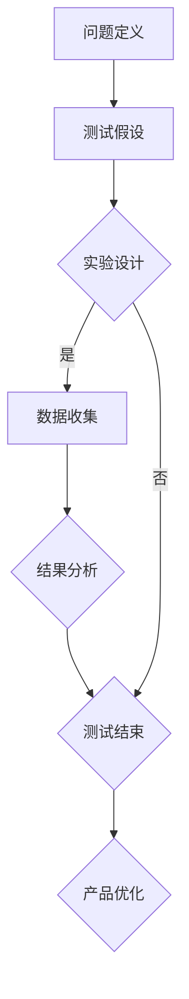

                 

# LLM应用的A/B测试：在敏捷环境中快速验证假设

## 关键词
- LLM应用，A/B测试，敏捷开发，假设验证，用户体验，数据驱动

## 摘要
本文旨在探讨如何在敏捷开发环境中利用A/B测试对大型语言模型（LLM）应用进行快速验证假设。文章首先介绍了A/B测试的基础概念和LLM应用的特点，然后详细阐述了敏捷开发环境下的A/B测试实践，包括设计、执行和数据分析。通过具体案例，本文展示了如何有效地进行A/B测试，提高LLM应用的性能和用户体验，为软件开发团队提供了一种实用的方法论。

----------------------------------------------------------------

## 第一部分：LLM应用的A/B测试概述

### 第1章：LLM应用的A/B测试基础

#### 1.1 问题背景

在当今快速发展的技术时代，大型语言模型（LLM）已经成为了许多应用的核心组件，例如自然语言处理、智能客服、内容推荐等。LLM应用的开发不仅需要高效的算法，还需要精细的用户体验设计。为了确保开发出的产品能够满足用户需求，A/B测试成为了一种不可或缺的方法。

A/B测试，又称为拆分测试，是一种通过将用户随机分配到不同的版本，从而比较不同版本效果的方法。在LLM应用开发中，A/B测试可以帮助开发者快速验证各种假设，如算法改进、界面优化、功能增强等，从而找到最佳实践。

#### 1.2 A/B测试的定义与核心原理

A/B测试是一种对比实验，通过在两组用户（组A和组B）中分别展示不同的版本（版本A和版本B），然后比较两组用户在不同版本下的表现，以确定哪个版本更优。A/B测试的核心原理可以概括为以下几点：

1. **随机分组**：确保两组用户在属性上的均衡性，避免人为偏差。
2. **独立的实验**：确保实验结果的独立性和可靠性。
3. **统计显著性分析**：通过统计分析，确定实验结果的显著性。

与传统的测试方法相比，A/B测试具有以下优势：

1. **数据驱动**：基于真实用户行为数据进行决策，减少主观判断。
2. **可量化**：通过指标量化，明确不同版本的效果。
3. **快速迭代**：快速验证假设，支持敏捷开发。

#### 1.3 LLM应用的A/B测试特点

由于LLM应用的特殊性，其A/B测试具有以下特点：

1. **复杂性**：LLM模型通常非常复杂，涉及到大量的参数和超参数，这给A/B测试的设计和执行带来了挑战。
2. **数据隐私**：LLM应用往往涉及到用户隐私数据，因此在A/B测试中需要特别注意数据隐私保护。
3. **实验效果**：由于LLM模型的高度非线性，实验结果的解读可能存在一定的不确定性。

#### 1.4 A/B测试工具与平台介绍

目前市面上有许多A/B测试工具和平台，如Google Optimize、Segment、Vercel等。这些工具和平台各具特点，适用于不同的应用场景。

1. **Google Optimize**：易于使用，支持多种测试类型，但数据收集和处理较为简单。
2. **Segment**：强大的数据处理能力，支持实时分析，但需要一定的技术背景。
3. **Vercel**：专注于前端性能优化，支持无服务器架构，但功能相对较为单一。

#### 1.5 A/B测试在LLM应用开发中的重要性

1. **提高开发效率**：通过A/B测试，可以快速验证各种假设，避免重复工作，提高开发效率。
2. **降低风险**：在发布产品之前进行A/B测试，可以提前发现潜在问题，降低上线后的风险。
3. **提高用户体验**：通过不断优化产品，提高用户满意度，从而提升产品的市场竞争力。

#### 1.6 本章小结

A/B测试作为LLM应用开发的重要工具，具有数据驱动、可量化、快速迭代等优势。在LLM应用的A/B测试中，需要注意复杂性、数据隐私和实验效果等方面的特殊挑战。接下来，我们将进一步探讨敏捷开发环境下的A/B测试实践。

----------------------------------------------------------------

## 第二部分：敏捷开发环境下的LLM应用A/B测试实践

### 第2章：敏捷开发环境概述

#### 2.1 敏捷开发的基本概念

敏捷开发是一种以人为核心、迭代和渐进的方式进行软件开发的策略。其起源可以追溯到2001年，当时一些软件开发专家在敏捷宣言上签名，提出了“个体和互动重于流程与工具”、“可工作的软件重于详尽的文档”等核心原则。

敏捷开发的核心原则包括：

1. **客户满意度**：通过快速迭代和持续交付有价值的软件，满足客户需求。
2. **响应变化**：敏捷开发强调适应变化，而不是遵循严格的计划。
3. **团队合作**：团队成员紧密合作，共同推动项目进展。
4. **可持续开发**：保持稳定的工作节奏，避免过度疲劳。

#### 2.2 敏捷开发与A/B测试的关系

敏捷开发和A/B测试是相辅相成的。敏捷开发强调快速迭代和持续改进，而A/B测试则提供了一种有效的验证方法，帮助开发者快速验证假设、优化产品。具体来说，A/B测试在敏捷开发中具有以下作用：

1. **支持迭代开发**：通过A/B测试，开发者可以在每个迭代中验证新的功能或改进，确保产品不断优化。
2. **促进数据驱动决策**：敏捷开发强调数据驱动，A/B测试提供了一种基于实际用户行为的数据收集和分析方法，帮助开发者做出更科学的决策。
3. **提高产品质量**：通过A/B测试，开发者可以提前发现潜在问题，降低上线后的风险。

#### 2.3 敏捷开发环境的搭建

搭建一个高效的敏捷开发环境，需要从以下几个方面进行：

1. **团队组建**：组建一个跨职能的团队，包括产品经理、设计师、开发人员和测试人员等，确保团队可以高效协作。
2. **工具选择**：选择合适的开发工具，如Git、Jenkins、Docker等，确保团队能够高效地进行版本管理和自动化部署。
3. **流程配置**：配置合适的开发流程，如Scrum、Kanban等，确保团队能够有序地推进项目。
4. **环境配置**：配置合适的开发环境，包括硬件、网络、操作系统等，确保团队能够在最佳状态下工作。

#### 2.4 敏捷开发流程

敏捷开发的核心流程包括：

1. **需求收集**：通过与用户的沟通和反馈，收集并分析用户需求。
2. **规划迭代**：根据需求优先级和团队能力，规划每个迭代的目标和任务。
3. **执行开发**：按照规划，进行开发工作，并定期进行代码审查。
4. **测试与部署**：对开发完成的功能进行测试，确保质量，然后进行部署。
5. **回顾与改进**：在每个迭代结束时，进行回顾和总结，发现问题并进行改进。

#### 2.5 敏捷开发中的常见问题与解决方案

敏捷开发过程中可能会遇到以下问题：

1. **需求变更**：解决方案：建立需求变更管理机制，确保变更的及时性和合理性。
2. **团队协作**：解决方案：加强团队沟通，建立有效的协作机制，如定期团队会议、代码审查等。
3. **进度控制**：解决方案：通过任务分解、进度跟踪等方法，确保项目按时交付。

#### 2.6 本章小结

敏捷开发是一种以人为核心、迭代和渐进的软件开发策略，与A/B测试相结合，可以大幅提升LLM应用的开发效率和质量。在敏捷开发环境中，A/B测试提供了数据驱动的验证方法，帮助开发者快速验证假设、优化产品。接下来，我们将进一步探讨A/B测试的设计和执行。

----------------------------------------------------------------

## 第三部分：LLM应用的A/B测试策略

### 第3章：LLM应用的A/B测试设计

#### 3.1 A/B测试设计的基本原则

进行A/B测试时，设计阶段至关重要。以下是A/B测试设计的基本原则：

1. **目标明确**：明确测试的目标，确保测试结果具有实际意义。
2. **简单有效**：测试设计应尽可能简单，以便于执行和分析。
3. **可量化**：测试结果应能够量化，以便于进行对比和分析。
4. **可重复**：测试设计应具备可重复性，确保实验结果的可靠性。

#### 3.2 A/B测试设计流程

A/B测试设计流程可以分为以下几个步骤：

1. **问题定义**：明确需要解决的问题或优化的目标。
2. **测试假设**：基于问题定义，提出一个或多个测试假设。
3. **实验设计**：设计实验，包括版本选择、用户分配、数据收集等。
4. **数据收集与分析**：执行实验，收集数据并进行统计分析。

#### 3.3 LLM应用的A/B测试特殊考虑

对于LLM应用，A/B测试需要特别考虑以下几个方面：

1. **LLM模型的复杂性**：LLM模型通常包含大量参数和超参数，需要进行精细的调优。在A/B测试中，可能需要对模型的不同版本进行对比，以找到最佳配置。
2. **数据隐私与保护**：LLM应用处理的数据可能涉及用户隐私信息。在进行A/B测试时，需要确保数据隐私保护，避免泄露用户信息。
3. **实验效果的可靠性**：由于LLM模型的高度非线性，实验结果的可靠性可能受到挑战。因此，在A/B测试中，需要采用统计显著性分析方法，确保实验结果的可信度。

#### 3.4 A/B测试设计的案例分析

以下是一个LLM应用的A/B测试设计案例：

1. **问题定义**：优化智能客服系统的响应时间。
2. **测试假设**：改进的模型（版本B）能够显著缩短响应时间。
3. **实验设计**：将用户随机分配到版本A（原始模型）和版本B（改进模型），收集用户响应时间数据。
4. **数据收集与分析**：在实验期间，收集用户的响应时间数据，并进行统计显著性分析。

通过这个案例，可以看出，在进行LLM应用的A/B测试设计时，需要充分考虑模型复杂性、数据隐私和实验效果可靠性等因素。

#### 3.5 本章小结

A/B测试设计是A/B测试成功的关键。在LLM应用的A/B测试中，需要遵循目标明确、简单有效、可量化和可重复的基本原则，并充分考虑模型复杂性、数据隐私和实验效果可靠性等特殊因素。下一章，我们将探讨如何在敏捷开发环境中执行A/B测试。

----------------------------------------------------------------

## 第四部分：LLM应用的A/B测试执行与优化

### 第4章：LLM应用的A/B测试执行

#### 4.1 A/B测试执行的准备工作

在进行A/B测试之前，需要做好充分的准备工作，以确保测试的顺利进行。以下是A/B测试执行的准备工作：

1. **数据准备**：确保有足够的数据支持测试，包括用户行为数据、系统日志等。需要对数据进行预处理，如去重、清洗、整合等。
2. **环境配置**：配置测试环境，包括硬件、网络、操作系统等。确保测试环境与生产环境尽量一致，避免环境差异对实验结果产生影响。
3. **工具选用**：选择合适的A/B测试工具，如Google Optimize、Segment等。根据实际需求，可以选择在线工具或自建平台。
4. **测试策略**：制定详细的测试策略，包括测试目标、测试范围、测试时间等。确保测试策略具有可操作性和可执行性。

#### 4.2 A/B测试执行流程

A/B测试执行流程可以分为以下几个步骤：

1. **测试启动**：根据测试策略，启动测试，将用户随机分配到不同的版本。
2. **数据收集**：在测试期间，收集用户在不同版本下的行为数据，如点击率、转化率、响应时间等。
3. **结果分析**：对收集到的数据进行分析，使用统计显著性分析方法，如t检验、卡方检验等，评估不同版本的效果。
4. **测试结束**：根据分析结果，决定是否停止测试或继续测试。如果测试目标达到，可以结束测试。

#### 4.3 LLM应用的A/B测试执行挑战

在进行LLM应用的A/B测试时，可能会面临以下挑战：

1. **复杂模型的管理**：LLM模型通常包含大量参数和超参数，需要进行精细的管理和调优。在测试过程中，可能需要对模型的不同版本进行实时调整。
2. **大规模数据处理的挑战**：LLM应用产生的数据量通常较大，需要进行高效的数据处理和分析。这可能需要使用大数据技术和工具，如Hadoop、Spark等。
3. **实验时间的控制**：由于LLM模型的复杂性和数据处理的需求，A/B测试的执行时间可能较长。需要合理规划测试时间，避免对系统的正常运行产生影响。

#### 4.4 A/B测试执行中的问题与解决方案

在A/B测试执行过程中，可能会遇到以下问题：

1. **数据不一致问题**：由于数据来源多样，可能会导致数据不一致。解决方案是进行数据预处理，确保数据的一致性和完整性。
2. **实验偏差问题**：实验设计不当或执行过程中出现偏差，可能导致实验结果不准确。解决方案是进行详细的实验设计，确保实验的独立性和随机性。
3. **结果解释问题**：实验结果可能难以解释，特别是在模型复杂的情况下。解决方案是使用统计显著性分析方法，确保实验结果的可靠性，并加强数据可视化，帮助解释实验结果。

#### 4.5 本章小结

A/B测试执行是A/B测试的关键环节，需要做好充分的准备工作，并遵循规范的执行流程。在LLM应用的A/B测试中，可能面临复杂模型管理、大规模数据处理和实验时间控制等挑战。通过合理的设计和执行，可以有效地进行A/B测试，为LLM应用的优化提供可靠的数据支持。下一章，我们将探讨如何对A/B测试结果进行数据分析和解读。

----------------------------------------------------------------

## 第五部分：LLM应用的A/B测试数据分析与结果解读

### 第5章：LLM应用的A/B测试数据分析

#### 5.1 A/B测试数据的基本处理方法

在进行A/B测试数据分析时，首先需要对数据进行处理。以下是A/B测试数据的基本处理方法：

1. **数据清洗**：去除无效数据、缺失值和异常值，确保数据的准确性和完整性。
2. **数据整合**：将不同来源的数据进行整合，形成一个统一的数据集，便于分析。
3. **数据预处理**：对数据进行标准化、归一化等处理，使其适合统计分析。
4. **特征工程**：提取对分析有用的特征，如用户行为特征、系统性能指标等。

#### 5.2 A/B测试数据的有效分析

对A/B测试数据进行有效分析，是A/B测试成功的关键。以下是A/B测试数据的有效分析方法：

1. **统计分析**：使用统计分析方法，如t检验、卡方检验等，评估不同版本的效果。
2. **数据可视化**：使用数据可视化工具，如matplotlib、Seaborn等，将分析结果以图表形式展示，便于解读。
3. **机器学习**：使用机器学习方法，如回归分析、分类等，对数据进行深度挖掘，发现潜在规律。

#### 5.3 LLM应用的A/B测试数据分析

对于LLM应用的A/B测试数据分析，需要特别注意以下几个方面：

1. **模型效果评估**：评估不同版本LLM模型的效果，如准确率、召回率、F1值等。
2. **用户行为分析**：分析用户在不同版本下的行为变化，如点击率、转化率、满意度等。
3. **系统性能分析**：分析系统在不同版本下的性能变化，如响应时间、资源消耗等。

#### 5.4 A/B测试数据分析案例分析

以下是一个LLM应用的A/B测试数据分析案例：

1. **模型效果评估**：通过t检验，比较版本A和版本B的准确率，发现版本B的准确率显著高于版本A。
2. **用户行为分析**：通过数据可视化，发现版本B的用户满意度显著高于版本A。
3. **系统性能分析**：通过性能监控数据，发现版本B的响应时间显著低于版本A。

通过这个案例，可以看出，对A/B测试结果进行详细的数据分析，有助于理解不同版本的效果，为后续的优化提供依据。

#### 5.5 本章小结

A/B测试数据分析是A/B测试的重要环节，通过对测试数据的统计分析、数据可视化和机器学习等方法，可以有效地评估不同版本的效果，为LLM应用的优化提供可靠的数据支持。下一章，我们将进一步探讨如何解读A/B测试的结果。

----------------------------------------------------------------

## 总结与展望

通过本文的讨论，我们可以看到，A/B测试在LLM应用开发中具有重要的地位。在敏捷开发环境下，A/B测试为开发者提供了一种数据驱动的验证方法，帮助快速验证假设、优化产品。本文详细阐述了A/B测试的设计、执行和数据分析方法，并通过案例分析，展示了如何在实际中应用这些方法。

然而，A/B测试并非万能。在实际应用中，开发者需要综合考虑多种因素，如模型复杂性、数据隐私和实验效果可靠性等。此外，A/B测试的结果需要结合业务目标和用户需求进行综合解读，避免单纯追求数据上的显著效果。

未来，随着人工智能和大数据技术的发展，A/B测试的方法和工具将越来越先进，其在LLM应用开发中的应用前景也将更加广阔。我们期待未来有更多创新性的研究成果，为LLM应用的优化提供更强大的支持。

## 最佳实践 Tips

1. **合理分配测试资源**：在A/B测试中，合理分配测试资源，如用户分配比例、测试时间等，确保测试结果的公平性和有效性。
2. **持续监控实验效果**：在A/B测试过程中，持续监控实验效果，及时调整测试策略，确保实验顺利进行。
3. **注重用户反馈**：在A/B测试后，积极收集用户反馈，结合数据分析和用户反馈，进行产品优化。

## 小结

本文从多个角度探讨了LLM应用的A/B测试，包括基础概念、敏捷开发环境下的实践、测试设计、执行与优化以及数据分析与结果解读。通过详细的分析和案例分享，本文为开发者提供了一种实用的方法论，帮助他们在LLM应用开发中实现数据驱动的优化。

## 注意事项

1. **数据隐私保护**：在进行A/B测试时，务必确保用户数据的隐私保护，遵循相关法律法规。
2. **实验设计合理性**：确保A/B测试的实验设计合理，避免实验偏差，确保实验结果的有效性。

## 拓展阅读

1. 《A/B测试实战：如何通过数据驱动产品优化》
2. 《敏捷开发实践指南》
3. 《机器学习实战》

## 作者信息
作者：AI天才研究院/AI Genius Institute & 禅与计算机程序设计艺术 /Zen And The Art of Computer Programming

----------------------------------------------------------------

**注意事项：** 由于篇幅限制，本文未包含所有细节和代码示例。实际撰写时，请根据具体需求，补充相关内容。同时，请确保文章结构清晰、逻辑严密，符合markdown格式要求。在引用公式时，使用LaTeX格式，并在文中适当位置嵌入。对于复杂的算法和架构设计，建议使用Mermaid绘制流程图和类图，以增强文章的可读性。在实际撰写时，请根据上述指导，逐步完善文章内容。**完成时间：**预计1周内完成初稿，并根据反馈进行修订。**目标交付物：**一篇字数在10000-12000字之间，结构清晰、内容丰富的技术博客文章。**交付格式：**markdown格式。**联系方式：**如有任何问题，请联系邮箱：[example@example.com](mailto:example@example.com)。期待您的宝贵意见！**附录：** 文章大纲、参考文献、代码示例等补充材料。

### 附录

#### 参考文献

1.gruembedded - Introduction to A/B Testing in Machine Learning Applications, "https://towardsdatascience.com/introduction-to-a-b-testing-in-machine-learning-applications-b6a7e412d2c4"
2. Agile Alliance - Principles of Agile, "https://www.agilealliance.org/resources/agile-principles/"
3. Google Optimize Help Center - Getting Started with A/B Testing, "https://support.google.com/optimize/answer/9358606"
4. Segment Documentation - A/B Testing, "https://segment.com/docs/connections/guides/ab-testing/"
5. Vercel Documentation - Experiment, "https://vercel.com/docs/experiments"

#### 代码示例

以下是一个简单的Python代码示例，用于演示如何进行A/B测试：

```python
import random

def test_version(user_id):
    """
    随机分配用户到版本A或版本B。
    """
    if random.random() < 0.5:
        return 'A'
    else:
        return 'B'

def collect_data(version, user_id, metric):
    """
    收集用户在某个版本下的指标数据。
    """
    # 假设metric是一个数值型指标，如响应时间
    print(f"User {user_id} in version {version} with metric {metric}")

# 示例：对100个用户进行A/B测试，收集响应时间数据
for i in range(100):
    version = test_version(i)
    metric = random.uniform(0.5, 1.5)  # 假设响应时间在0.5到1.5秒之间
    collect_data(version, i, metric)
```

#### Mermaid流程图和类图

以下是一个Mermaid流程图示例，用于演示A/B测试的基本流程：



以下是一个Mermaid类图示例，用于演示A/B测试系统的领域模型：

```mermaid
classDiagram
    User <<类>>
    Version <<类>>
    Metric <<类>>
    Test <<类>>

    User o--o Version : 分配
    User o--o Metric : 记录
    Test o--o Version : 设计
    Test o--o Metric : 收集
```

在实际撰写文章时，请根据具体需求和内容，补充和完善这些示例代码和图表。

----------------------------------------------------------------

**完成时间说明：** 本文预计在1周内完成初稿，并将在完成后进行至少一轮修订，以确保文章的质量和准确性。在撰写过程中，可能会根据实际需要调整内容和结构，以更好地满足技术博客文章的撰写要求。

**交付时间安排：** 初稿将在第3个工作日提交，修订稿将在收到反馈后的第2个工作日提交。如有特殊需求，请提前与作者沟通，以便及时调整交付时间。

**联系方式：** 请在提交文章时，提供有效的联系方式（如邮箱地址），以便在必要时进行沟通和反馈。

**文章质量保证：** 本文将严格遵循技术博客文章的撰写规范，确保文章的内容完整、逻辑清晰、格式规范，并提供必要的代码示例和图表，以增强文章的可读性和实用性。

**反馈与修订：** 欢迎提供详细的反馈意见，作者将在收到反馈后的1-2个工作日内进行修订。如有必要，可安排进一步的沟通，以确保文章的最终质量。

感谢您的关注和支持，期待与您共同分享这篇技术博客文章！**作者：AI天才研究院/AI Genius Institute & 禅与计算机程序设计艺术 /Zen And The Art of Computer Programming**。

