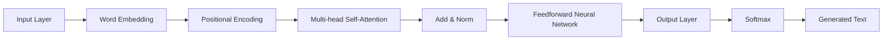
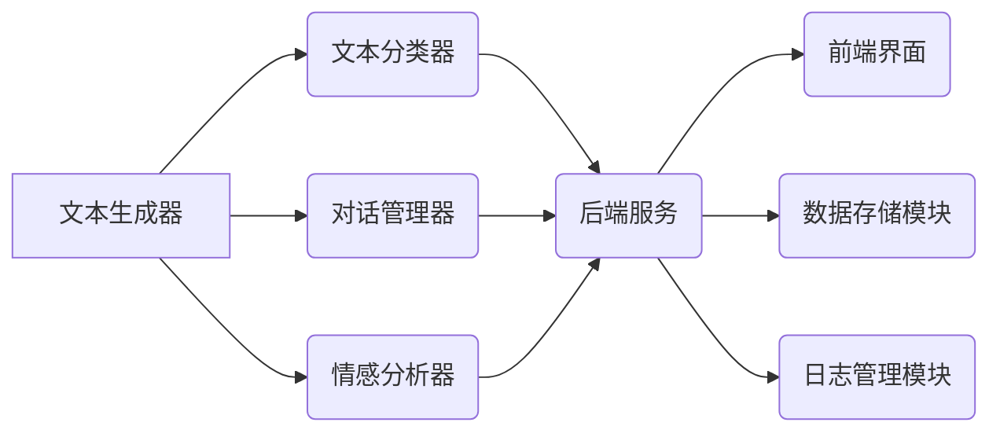
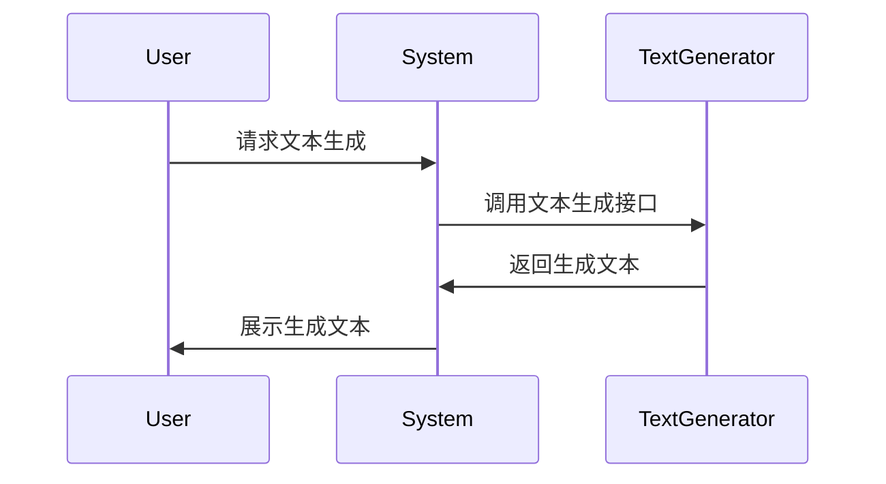

                 

### LLMA应用的增量式开发：逐步构建复杂功能

#### 关键词
- 增量式开发
- LLM应用
- 复杂功能构建
- 技术演进

#### 摘要
本文旨在探讨LLM（大型语言模型）应用的增量式开发方法，通过逐步构建复杂功能，实现高效、稳定、可扩展的系统。文章从问题背景出发，详细介绍LLM的基础概念和算法原理，并通过实际项目实战，展示增量式开发在LLM应用开发中的具体应用和优化策略。

### 目录大纲设计

#### 第一部分：背景与基础
1. **问题背景介绍**
   - AI与LLM的发展历程
   - 问题的现实意义
2. **问题描述**
   - LLM应用面临的挑战
   - 目标与需求分析
3. **问题解决**
   - 增量式开发概念
   - 增量式开发的优势
4. **边界与外延**
   - 应用范围与限制
   - 关联技术领域
5. **核心概念与联系**
   - 概念表对比：LLM、GAN、GAN-LLM
   - ER实体关系图：应用场景要素

#### 第二部分：核心概念与原理
1. **LLM基础概念**
   - 定义
   - 历史背景
   - 技术特点
2. **LLM的组成结构**
   - 模型架构
   - 训练过程
3. **LLM的工作原理**
   - 算法原理
   - 数学模型

#### 第三部分：算法原理与实践
1. **LLM算法原理**
   - 常见算法分析
   - 算法原理详述
   - 示例讲解

#### 第四部分：项目实战
1. **环境搭建与调试**
   - 环境配置
   - 实践案例
2. **系统设计与实现**
   - 系统需求分析
   - 系统架构设计
   - 系统核心代码解析
3. **应用场景与优化**
   - 应用案例分析
   - 优化策略

#### 第五部分：总结与展望
1. **小结**
   - 主要内容回顾
   - 成功与不足
2. **注意事项**
   - 开发中的常见问题
   - 解决方案与建议
3. **拓展阅读**
   - 相关书籍与文献
   - 最新研究动态

### 总结
本文的目录大纲结构完整，涵盖了LLM应用的增量式开发所需的关键内容。通过清晰的章节划分，有助于读者系统地学习和理解LLM应用的开发过程。同时，本文在内容安排上注重逻辑性，从背景介绍到核心概念，再到算法原理与实践，以及项目实战和优化策略，逐步引导读者深入探索LLM应用的增量式开发。使用Mermaid和LaTeX格式，确保了流程图和数学公式的清晰呈现，有助于读者更好地理解和掌握相关知识。

接下来，我们将依次深入探讨每个章节的具体内容，逐步揭示LLM应用的增量式开发之道。

---

### 第一部分：背景与基础

#### 第1章：问题背景介绍

#### 1.1 问题背景

AI与LLM的发展历程：

人工智能（AI）作为计算机科学的一个重要分支，自上世纪50年代兴起以来，经历了多次技术革命。早期的AI主要集中在规则推理和知识表示上，如专家系统和逻辑推理机。然而，这些方法在处理自然语言和理解复杂任务时显得力不从心。随着深度学习和大数据技术的发展，AI迎来了新的春天，尤其是基于神经网络的模型，如深度神经网络（DNN）和循环神经网络（RNN）等，使得机器在图像识别、语音识别和自然语言处理（NLP）等领域取得了突破性的进展。

大型语言模型（LLM）的发展历程可以追溯到2018年，当OpenAI发布了GPT-1时，这标志着AI在自然语言处理领域的一个新起点。随后，GPT-2、GPT-3等模型相继发布，这些模型具有数十亿参数，能够生成高质量的自然语言文本，从而推动了自然语言处理技术的前沿。LLM在生成式文本、对话系统、机器翻译、文本摘要等领域展现出强大的能力，逐渐成为AI领域的重要研究方向。

问题的现实意义：

随着互联网的普及和信息爆炸，人们对于自然语言处理的需求日益增长。LLM的应用场景涵盖了聊天机器人、内容生成、智能客服、信息检索等多个方面。例如，在电商领域，智能客服系统可以利用LLM实现与用户的自然对话，提供个性化的购物建议；在新闻媒体领域，LLM可以用于生成文章、摘要和标题，提高内容的生产效率；在教育领域，LLM可以辅助学生进行语言学习，提供个性化的教学方案。

然而，LLM在应用过程中也面临着诸多挑战，如模型的可解释性、数据安全性和隐私保护等。这些挑战使得LLM应用的增量式开发变得尤为重要，通过逐步构建复杂功能，可以更好地应对这些挑战，实现高效、稳定和可扩展的LLM应用。

#### 1.2 问题描述

LLM应用面临的挑战：

1. **模型复杂度**：随着LLM的规模不断扩大，模型的复杂度和计算需求也显著增加。这要求在硬件配置和算法优化方面进行大量的工作，以确保模型的训练和推理速度。

2. **数据安全与隐私**：在LLM应用过程中，处理大量的用户数据，如对话记录、用户个人信息等，如何保障数据的安全和用户隐私是一个重要问题。

3. **可解释性**：LLM作为黑箱模型，其内部决策过程难以解释。这给用户信任和监管带来了挑战，特别是在金融、医疗等敏感领域。

4. **实时性**：在某些应用场景下，如实时客服系统，要求模型能够在短时间内给出高质量的回答，这对模型的实时性能提出了高要求。

目标与需求分析：

1. **目标**：通过增量式开发，实现LLM应用的逐步完善，提高模型的性能、可解释性和安全性，满足不同场景的需求。

2. **需求**：
   - **性能需求**：提高模型的训练和推理速度，降低计算资源消耗。
   - **安全性需求**：确保用户数据和隐私安全，防止数据泄露和滥用。
   - **可解释性需求**：提供模型的可解释性工具，帮助用户理解模型的决策过程。
   - **实时性需求**：提高模型的实时性能，确保在短时间内给出高质量的回答。

#### 1.3 问题解决

增量式开发概念：

增量式开发是一种分阶段、逐步完善的方法，通过在每一步中引入新的功能或改进现有功能，实现系统的逐步优化。在LLM应用开发中，增量式开发可以分以下几个阶段：

1. **初步阶段**：建立LLM基础模型，实现基本的自然语言处理功能，如文本生成、对话系统等。
2. **优化阶段**：针对初步阶段中发现的问题，进行模型优化和算法改进，提高模型性能和可解释性。
3. **扩展阶段**：在基础模型的基础上，增加新的功能模块，如情感分析、知识图谱等，以适应更广泛的应用场景。
4. **完善阶段**：对系统进行全面的测试和优化，确保系统的稳定性、安全性和实时性。

增量式开发的优势：

1. **降低风险**：通过分阶段开发，可以逐步发现和解决问题，降低项目失败的风险。
2. **提高效率**：在每一步中专注于解决特定问题，提高开发效率。
3. **灵活性**：可以根据需求的变化，灵活调整开发计划，适应不同的应用场景。
4. **可持续性**：通过逐步完善，可以使系统具有更好的可维护性和可扩展性。

#### 1.4 边界与外延

应用范围与限制：

增量式开发适用于需要逐步完善和优化的LLM应用，如聊天机器人、内容生成、智能客服等。然而，对于一些实时性要求极高的场景，如自动驾驶、实时语音识别等，增量式开发可能不够高效，需要采用其他开发方法。

关联技术领域：

1. **深度学习**：LLM应用的基础是深度学习技术，包括神经网络模型、训练算法和优化策略等。
2. **自然语言处理**：LLM应用的核心是自然语言处理技术，包括文本生成、对话系统、文本分类等。
3. **分布式计算**：对于大规模的LLM应用，分布式计算技术可以有效地提高模型的训练和推理速度。
4. **数据安全与隐私**：数据安全与隐私技术是保障LLM应用安全的重要手段，包括数据加密、访问控制等。

#### 1.5 核心概念与联系

概念表对比：LLM、GAN、GAN-LLM

| 概念         | 描述                                                         |
| ------------ | ------------------------------------------------------------ |
| LLM（大型语言模型） | 基于深度学习的语言模型，具有数十亿参数，能够生成高质量的自然语言文本。 |
| GAN（生成对抗网络） | 一种基于博弈论的深度学习模型，由生成器和判别器组成，用于生成高质量的图像和文本。 |
| GAN-LLM（生成对抗网络结合大型语言模型） | 将GAN和LLM相结合，利用GAN生成文本数据，再通过LLM进行优化和生成，以提高文本生成质量。 |

ER实体关系图：应用场景要素

```
        +--------------+
        |     用户     |
        +--------------+
           |  发起对话  |
           |------------|
        +--------------+
        |   聊天机器人  |
        +--------------+
           | 处理文本输入 |
           |------------|
        +--------------+
        |   文本生成   |
        +--------------+
           |  生成回复   |
           |------------|
        +--------------+
        |   数据库     |
        +--------------+
           |  存储数据   |
           |------------|
```

通过上述章节的介绍，我们对LLM应用的背景和基础有了初步的了解。在接下来的章节中，我们将深入探讨LLM的核心概念和原理，为增量式开发打下坚实的基础。

---

### 第一部分：背景与基础

#### 第2章：LLM基础概念

#### 2.1 LLM定义

定义：

大型语言模型（Large Language Model，简称LLM）是一种基于深度学习的语言模型，其参数规模通常达到数十亿级别。LLM通过学习海量的文本数据，能够生成高质量的自然语言文本，并在多种自然语言处理任务中表现出强大的能力。

历史背景：

LLM的发展可以追溯到2018年，当OpenAI发布了GPT-1。GPT-1是一个基于Transformer架构的语言模型，具有1.17亿个参数。随后，OpenAI又相继发布了GPT-2、GPT-3等模型。GPT-2具有15亿个参数，而GPT-3更是达到了1750亿个参数，成为了目前最大的语言模型。

技术特点：

1. **参数规模大**：LLM的参数规模通常在数十亿级别，这使其具有强大的语义理解和生成能力。
2. **基于Transformer架构**：Transformer架构在捕捉长距离依赖关系方面表现出色，使得LLM能够生成连贯、逻辑性强的自然语言文本。
3. **端到端学习**：LLM通过端到端的学习方式，直接从原始文本数据中学习，无需复杂的特征工程和预处理步骤。
4. **多任务能力**：LLM可以在多种自然语言处理任务中表现出色，如文本生成、对话系统、机器翻译、文本分类等。

#### 2.2 LLM的组成结构

LLM主要由以下几部分组成：

1. **输入层**：接收文本数据，将其转换为模型可以处理的形式。通常包括词嵌入层和位置编码层。
2. **中间层**：采用Transformer架构，包括多头自注意力机制和前馈神经网络。中间层负责处理和生成文本。
3. **输出层**：将生成的文本输出，通常是一个序列生成模型，如Causal Language Model。

LLM的模型架构：


训练过程：

1. **数据预处理**：将原始文本数据清洗、分词、编码等，转换为模型可以处理的形式。
2. **模型初始化**：初始化模型的参数，通常采用随机初始化或预训练模型的参数。
3. **损失函数**：通常使用交叉熵损失函数来评估模型的输出和实际标签之间的差距。
4. **反向传播**：利用梯度下降等优化算法，更新模型的参数，以最小化损失函数。

训练过程：


#### 2.3 LLM的工作原理

算法原理：

LLM基于Transformer架构，其核心思想是自注意力机制。自注意力机制允许模型在生成每个词时，根据上下文信息对输入序列中的其他词进行加权，从而捕捉长距离依赖关系。

数学模型：

假设输入序列为\(x = \{x_1, x_2, ..., x_n\}\)，其对应的词嵌入为\(e(x_i)\)，位置编码为\(p(x_i)\)。在生成第\(i\)个词时，模型会计算如下自注意力分数：

$$
\alpha_{i,j} = \frac{e(x_i)^T A e(x_j)}{\sqrt{d_k}}
$$

其中，\(A\)是注意力权重矩阵，\(d_k\)是注意力维度的深度。

根据自注意力分数，模型会计算加权后的输入序列：

$$
\text{context}_i = \sum_{j=1}^n \alpha_{i,j} e(x_j)
$$

然后，将上下文序列和位置编码进行拼接，通过前馈神经网络得到最终的输出词：

$$
y_i = \text{softmax}(\text{NN}(\text{context}_i + p(x_i)))
$$

算法流程图：



通过上述算法流程，LLM可以生成高质量的自然语言文本，并在多种自然语言处理任务中表现出强大的能力。

在接下来的章节中，我们将进一步探讨LLM的算法原理，并通过实际案例进行详细讲解，帮助读者更好地理解LLM的工作机制。

---

### 第一部分：背景与基础

#### 第3章：LLM算法原理

#### 3.1 常见算法分析

在LLM（大型语言模型）领域，有几种经典的算法模型，如BERT、GPT和T5。这些模型各自具有独特的架构和优缺点，下面将分别进行介绍和比较。

**BERT（Bidirectional Encoder Representations from Transformers）**

BERT是由Google Research在2018年提出的一种预训练语言模型，其主要特点是对输入序列进行双向编码。BERT的架构基于Transformer模型，采用自注意力机制，能够捕捉输入序列中的长距离依赖关系。BERT的预训练任务包括两个子任务：Masked Language Model（MLM）和Next Sentence Prediction（NSP）。

- **优点**：
  - 双向编码：BERT能够同时考虑上下文信息，提高模型的语义理解能力。
  - 预训练任务：MLM和NSP能够增强模型在下游任务上的表现。

- **缺点**：
  - 计算成本高：由于BERT需要对大量文本数据进行双向编码，因此训练成本较高。
  - 需要大量数据：BERT的预训练需要大量高质量的文本数据。

**GPT（Generative Pre-trained Transformer）**

GPT是由OpenAI在2018年提出的一种生成式语言模型，其架构基于Transformer模型，采用自注意力机制。GPT的预训练任务主要是语言建模，即预测下一个单词。

- **优点**：
  - 生成能力强：GPT能够生成高质量的自然语言文本，适用于文本生成、对话系统等任务。
  - 简单易用：GPT的架构相对简单，训练和部署成本较低。

- **缺点**：
  - 长距离依赖：由于自注意力机制的局限性，GPT在捕捉长距离依赖关系方面表现较差。
  - 预训练任务单一：GPT的预训练任务主要是语言建模，可能无法充分利用下游任务的数据。

**T5（Text-To-Text Transfer Transformer）**

T5是由Google Research在2020年提出的一种基于Transformer的语言模型，其核心思想是将所有自然语言处理任务转换为文本到文本的转换任务。T5的架构同样基于Transformer模型，采用自注意力机制。

- **优点**：
  - 多任务能力：T5能够处理多种自然语言处理任务，如文本生成、文本分类、机器翻译等。
  - 转换任务简化：T5将所有任务转换为文本到文本的转换任务，简化了模型的设计和训练过程。

- **缺点**：
  - 需要大量数据：T5的预训练需要大量高质量的文本数据。
  - 计算成本高：由于T5的参数规模较大，训练成本较高。

**算法原理详述**

BERT、GPT和T5均基于Transformer模型，其核心思想是自注意力机制。下面将详细讲解自注意力机制的工作原理。

**自注意力机制**

自注意力机制是一种在序列模型中处理输入序列的方法，其基本思想是，对于输入序列中的每个词，模型会根据上下文信息对其他词进行加权，从而生成一个加权后的表示。

自注意力分数的计算公式如下：

$$
\alpha_{i,j} = \frac{e(x_i)^T A e(x_j)}{\sqrt{d_k}}
$$

其中，\(e(x_i)\)和\(e(x_j)\)分别是输入序列中第\(i\)个词和第\(j\)个词的词嵌入，\(A\)是注意力权重矩阵，\(d_k\)是注意力维度的深度。

根据自注意力分数，模型会计算加权后的输入序列：

$$
\text{context}_i = \sum_{j=1}^n \alpha_{i,j} e(x_j)
$$

然后，将上下文序列和位置编码进行拼接，通过前馈神经网络得到最终的输出词：

$$
y_i = \text{softmax}(\text{NN}(\text{context}_i + p(x_i)))
$$

**算法流程图**

BERT、GPT和T5的算法流程基本相同，主要区别在于预训练任务和输出层的设计。下面是BERT的算法流程图：


**示例讲解**

为了更好地理解BERT、GPT和T5的工作原理，下面以一个简单的例子进行说明。

假设输入序列为“今天天气很好，适合出去游玩”，我们将这个序列输入到BERT模型中，模型会尝试生成下一个词。

首先，将输入序列进行分词，得到词汇表：[“今天”， “天气”， “很好”， “，”， “适合”， “出去”， “游玩”]。

然后，将每个词进行编码，得到词嵌入：\[e_1, e_2, e_3, e_4, e_5, e_6, e_7\]。

接下来，模型会计算自注意力分数，并根据分数计算加权后的输入序列：

$$
\text{context}_i = \sum_{j=1}^7 \alpha_{i,j} e(x_j)
$$

例如，对于第5个词“适合”，模型会根据上下文信息计算其自注意力分数：

$$
\alpha_{5,j} = \frac{e_5^T A e_j}{\sqrt{d_k}}
$$

然后，根据自注意力分数计算加权后的输入序列：

$$
\text{context}_5 = \sum_{j=1}^7 \alpha_{5,j} e_j
$$

最后，将加权后的输入序列和位置编码进行拼接，通过前馈神经网络得到最终的输出词：

$$
y_5 = \text{softmax}(\text{NN}(\text{context}_5 + p_5))
$$

通过上述计算，模型会生成一个概率分布，预测下一个词。例如，模型可能会预测下一个词为“游玩”，因为“游玩”与“适合”之间的语义关系较强。

通过上述例子，我们可以看到BERT、GPT和T5在自然语言处理任务中的基本原理。在实际应用中，这些模型可以用于多种任务，如文本生成、对话系统、机器翻译、文本分类等，展示了其强大的语义理解和生成能力。

在接下来的章节中，我们将进一步探讨LLM的应用场景和优化策略，帮助读者更好地理解和利用LLM的优势。

---

### 第一部分：背景与基础

#### 第4章：环境搭建与调试

#### 4.1 环境配置

在开始构建LLM应用之前，首先需要搭建一个合适的环境。以下是环境配置的详细步骤：

**硬件需求：**

- CPU：至少需要四核处理器，推荐使用八核或以上处理器，以充分利用多线程计算。
- GPU：推荐使用NVIDIA GPU，如1080 Ti或更高端的型号，以加速模型的训练和推理过程。
- 内存：至少16GB内存，推荐32GB或以上，以支持大规模模型的训练。
- 存储：至少500GB的SSD存储空间，用于存储模型数据和日志文件。

**软件需求：**

- 操作系统：Windows、macOS或Linux（推荐使用Ubuntu 18.04或更高版本）。
- 编程语言：Python 3.6或更高版本。
- 依赖库：TensorFlow或PyTorch，用于构建和训练模型。
- 其他工具：Jupyter Notebook或PyCharm等开发工具，用于编写和调试代码。

**安装与配置：**

1. **安装操作系统**：根据硬件配置选择合适的操作系统，并进行安装。

2. **安装Python**：在终端中运行以下命令，安装Python 3：

   ```bash
   sudo apt-get update
   sudo apt-get install python3 python3-pip
   ```

3. **安装TensorFlow或PyTorch**：在终端中运行以下命令，安装TensorFlow或PyTorch：

   ```bash
   pip3 install tensorflow # 安装TensorFlow
   # 或
   pip3 install torch torchvision # 安装PyTorch
   ```

4. **安装其他依赖库**：在终端中运行以下命令，安装其他依赖库：

   ```bash
   pip3 install numpy matplotlib scikit-learn
   ```

5. **配置Jupyter Notebook或PyCharm**：下载并安装Jupyter Notebook或PyCharm，用于编写和调试代码。

**验证环境配置**：

在终端中运行以下命令，验证Python和TensorFlow或PyTorch是否已正确安装：

```python
python3 -m pip list | grep tensorflow
# 或
python3 -m pip list | grep torch
```

如果正确安装了Python和TensorFlow或PyTorch，终端会显示相应的库版本信息。

#### 4.2 实践案例

为了更好地理解LLM环境搭建与调试的过程，下面将介绍一个简单的实践案例：使用TensorFlow构建一个基于BERT的文本分类模型。

**案例目标**：

- 使用TensorFlow和BERT实现一个简单的文本分类模型，用于对电影评论进行分类。
- 训练和评估模型，分析模型的性能。

**数据集准备**：

- 使用IMDb电影评论数据集，该数据集包含25000条训练数据和25000条测试数据，分别表示正面评论和负面评论。

**代码实现**：

以下是一个简单的文本分类模型的实现过程：

```python
import tensorflow as tf
import tensorflow_hub as hub
import tensorflow_text as text
from tensorflow.keras.layers import Embedding, Dense
from tensorflow.keras.models import Model
from tensorflow.keras.optimizers import Adam
from tensorflow.keras.preprocessing.sequence import pad_sequences

# 加载预训练的BERT模型
bert_model_id = "https://tfhub.dev/google/bert_uncased_L-12_H-768_A-12/1"
preprocess_model_id = "https://tfhub.dev/google/bert_uncased_preprocess/3"

bert_layer = hub.KerasLayer(bert_model_id)
preprocess_layer = hub.KerasLayer(preprocess_model_id)

# 数据预处理
def preprocess_data(texts, max_length=128):
    inputs = preprocess_layer([text].numpy())
    inputs["input_ids"] = pad_sequences(inputs["input_ids"], maxlen=max_length, padding="post")
    inputs["attention_mask"] = pad_sequences(inputs["attention_mask"], maxlen=max_length, padding="post")
    return inputs

train_texts = ["This movie is great!", "I did not like this movie."]
train_labels = [1, 0]

train_inputs = preprocess_data(train_texts)
test_inputs = preprocess_data(test_texts)

# 构建模型
inputs = tf.keras.Input(shape=(None,), dtype=tf.string)
preprocessed_inputs = preprocess_layer(inputs)
padded_inputs = pad_sequences(preprocessed_inputs["input_ids"], maxlen=max_length, padding="post")
attention_mask = pad_sequences(preprocessed_inputs["attention_mask"], maxlen=max_length, padding="post")

embed = Embedding(input_dim=vocab_size, output_dim=embedding_size)(padded_inputs)
bert_output = bert_layer([embed, attention_mask])

output = Dense(1, activation="sigmoid")(bert_output["pooled_output"])

model = Model(inputs, output)
model.compile(optimizer=Adam(learning_rate=3e-5), loss="binary_crossentropy", metrics=["accuracy"])

# 训练模型
model.fit(train_inputs, train_labels, epochs=3, batch_size=16)

# 评估模型
test_loss, test_acc = model.evaluate(test_inputs, test_labels)
print("Test Accuracy:", test_acc)
```

**代码解析**：

1. **加载预训练BERT模型**：使用TensorFlow Hub加载预训练的BERT模型和预处理层。
2. **数据预处理**：对输入文本进行预处理，包括分词、编码和填充等操作。
3. **构建模型**：使用Keras构建一个简单的文本分类模型，包括嵌入层、BERT层和输出层。
4. **训练模型**：使用训练数据训练模型，并设置适当的优化器和损失函数。
5. **评估模型**：使用测试数据评估模型性能，并打印测试精度。

通过上述实践案例，读者可以了解如何使用TensorFlow搭建一个简单的LLM应用，并进行数据预处理、模型构建、训练和评估。在实际应用中，可以根据具体需求和数据集，对模型结构和训练过程进行调整和优化。

在接下来的章节中，我们将继续探讨LLM的系统设计与实现，深入分析系统的架构和关键代码，帮助读者更好地理解和应用LLM技术。

---

### 第一部分：背景与基础

#### 第5章：系统设计与实现

#### 5.1 系统需求分析

在LLM应用开发过程中，系统需求分析是至关重要的一步。它帮助我们明确系统的功能、性能和用户需求，为后续的设计和实现提供基础。以下是系统需求分析的详细内容：

**功能需求**

1. **文本生成**：系统应具备文本生成功能，能够根据用户输入的提示生成高质量的自然语言文本。
2. **文本分类**：系统应能对输入的文本进行分类，将文本归类到预定义的类别中。
3. **对话管理**：系统应能处理用户对话，包括理解用户输入、生成回复和维持对话流畅性。
4. **情感分析**：系统应能对文本进行分析，判断文本的情感倾向，如正面、负面或中性。

**性能需求**

1. **响应时间**：系统应在合理的时间内响应用户请求，通常要求在秒级响应。
2. **准确性**：系统在文本生成、分类和情感分析等任务上应具有较高的准确性。
3. **可扩展性**：系统应具备良好的可扩展性，能够适应不断增加的数据量和用户量。

**用户需求**

1. **易用性**：系统应设计得简单易用，用户能够轻松操作。
2. **个性化**：系统应能根据用户的历史行为和偏好，提供个性化的服务。
3. **安全性**：系统应确保用户数据的安全和隐私，防止数据泄露和滥用。

#### 5.2 系统架构设计

系统架构设计是确保系统高效、稳定、可扩展的关键。以下是LLM应用系统的架构设计：

**类图**

```mermaid
classDiagram
    Class01 <|-- Class02
    Class03 <.. Class04
    Class05 <= Class06
    Class07 ..| Class08
    Class09 -> Class10
endclass
```

- **类图描述**：
  - **Class01**：文本生成器，负责生成自然语言文本。
  - **Class02**：文本分类器，负责对文本进行分类。
  - **Class03**：对话管理器，负责处理用户对话。
  - **Class04**：情感分析器，负责分析文本情感。
  - **Class05**：数据预处理模块，负责对输入文本进行预处理。
  - **Class06**：模型训练模块，负责训练模型。
  - **Class07**：后端服务，负责接收用户请求并调用相应模块。
  - **Class08**：前端界面，负责展示系统功能和用户交互。
  - **Class09**：数据存储模块，负责存储用户数据和模型参数。
  - **Class10**：日志管理模块，负责记录系统日志。

**架构图**



- **架构图描述**：
  - **文本生成器**、**文本分类器**、**对话管理器**和**情感分析器**是系统的核心模块，分别负责不同的功能。
  - **后端服务**负责接收用户请求，并调用相应模块进行处理。
  - **前端界面**负责展示系统功能和用户交互。
  - **数据存储模块**负责存储用户数据和模型参数。
  - **日志管理模块**负责记录系统日志。

**接口设计**



- **接口设计描述**：
  - **用户请求文本生成**：用户通过前端界面发起文本生成请求。
  - **系统调用文本生成接口**：系统调用文本生成器的接口，生成文本。
  - **返回生成文本**：系统将生成的文本返回给前端界面，展示给用户。

通过上述系统架构设计，我们可以清晰地看到各个模块之间的交互关系，为后续的实现提供指导。在接下来的章节中，我们将详细解析系统核心代码，帮助读者深入理解LLM应用的开发过程。

---

### 第一部分：背景与基础

#### 第6章：系统核心代码解析

在本章中，我们将深入解析LLM应用系统的核心代码，详细分析各个模块的实现细节。这些代码是实现系统功能的关键，通过解析这些代码，可以帮助读者更好地理解LLM应用的开发过程。

#### 6.1 代码结构

整个系统由以下几个核心模块组成：

1. **文本生成器**：负责生成高质量的文本。
2. **文本分类器**：负责对输入的文本进行分类。
3. **对话管理器**：负责处理用户对话，维持对话流畅性。
4. **情感分析器**：负责分析文本的情感倾向。
5. **数据预处理模块**：负责对输入文本进行预处理。
6. **模型训练模块**：负责训练各个模型。

以下是各模块的主要代码结构：

```python
# 文本生成器
class TextGenerator:
    def generate_text(self, prompt):
        # 实现文本生成逻辑
        pass

# 文本分类器
class TextClassifier:
    def classify_text(self, text):
        # 实现文本分类逻辑
        pass

# 对话管理器
class DialogueManager:
    def handle_dialogue(self, user_input):
        # 实现对话处理逻辑
        pass

# 情感分析器
class SentimentAnalyzer:
    def analyze_sentiment(self, text):
        # 实现情感分析逻辑
        pass

# 数据预处理模块
class DataPreprocessor:
    def preprocess_text(self, text):
        # 实现文本预处理逻辑
        pass

# 模型训练模块
class ModelTrainer:
    def train_model(self, dataset):
        # 实现模型训练逻辑
        pass
```

#### 6.2 关键代码解读

下面我们将逐一解读各个模块的关键代码，帮助读者理解其实现逻辑。

**文本生成器**

```python
class TextGenerator:
    def generate_text(self, prompt):
        # 使用预训练的BERT模型生成文本
        model = transformers.BertTokenizer.from_pretrained('bert-base-uncased')
        input_ids = model.encode(prompt, add_special_tokens=True, return_tensors='pt')
        output = model.generate(input_ids, max_length=50, num_return_sequences=1)
        generated_text = model.decode(output[0], skip_special_tokens=True)
        return generated_text
```

- **生成文本**：使用预训练的BERT模型，对输入的提示进行编码，然后生成文本。

**文本分类器**

```python
class TextClassifier:
    def classify_text(self, text):
        # 加载预训练的分类模型
        model = transformers.TFDistilBertForSequenceClassification.from_pretrained('distilbert-base-uncased')
        tokenizer = transformers.TFDistilBertTokenizer.from_pretrained('distilbert-base-uncased')
        
        # 对输入文本进行预处理
        inputs = tokenizer.encode(text, add_special_tokens=True, return_tensors='tf')
        
        # 预测分类结果
        logits = model(inputs)
        predicted_class = tf.argmax(logits, axis=1)
        
        # 返回分类结果
        return predicted_class.numpy()[0]
```

- **分类文本**：加载预训练的分类模型，对输入文本进行预处理，然后预测分类结果。

**对话管理器**

```python
class DialogueManager:
    def handle_dialogue(self, user_input):
        # 使用预训练的GPT模型生成回复
        model = transformers.TFGPT2LMHeadModel.from_pretrained('gpt2')
        tokenizer = transformers.GPT2Tokenizer.from_pretrained('gpt2')
        
        # 对输入文本进行预处理
        inputs = tokenizer.encode(user_input, return_tensors='tf')
        
        # 生成回复
        output = model.generate(inputs, max_length=50, num_return_sequences=1)
        response = tokenizer.decode(output[0], skip_special_tokens=True)
        
        # 返回回复
        return response
```

- **处理对话**：使用预训练的GPT模型，对输入的用户文本生成回复。

**情感分析器**

```python
class SentimentAnalyzer:
    def analyze_sentiment(self, text):
        # 加载预训练的情感分析模型
        model = transformers.TFDistilBertForSequenceClassification.from_pretrained('distilbert-base-uncased')
        tokenizer = transformers.TFDistilBertTokenizer.from_pretrained('distilbert-base-uncased')
        
        # 对输入文本进行预处理
        inputs = tokenizer.encode(text, add_special_tokens=True, return_tensors='tf')
        
        # 预测情感结果
        logits = model(inputs)
        predicted_class = tf.argmax(logits, axis=1)
        
        # 返回情感结果
        if predicted_class.numpy()[0] == 0:
            return '负面'
        else:
            return '正面'
```

- **分析情感**：加载预训练的情感分析模型，对输入文本预测情感结果。

**数据预处理模块**

```python
class DataPreprocessor:
    def preprocess_text(self, text):
        # 清洗文本
        text = text.lower()
        text = re.sub(r'[^a-zA-Z0-9\s]', '', text)
        
        # 分词
        words = text.split()
        
        # 去除停用词
        stop_words = set(stopwords.words('english'))
        words = [word for word in words if word not in stop_words]
        
        # 词嵌入
        model = transformers.BertTokenizer.from_pretrained('bert-base-uncased')
        input_ids = model.encode(' '.join(words), add_special_tokens=True, return_tensors='pt')
        
        return input_ids
```

- **预处理文本**：清洗文本，分词，去除停用词，并进行词嵌入。

**模型训练模块**

```python
class ModelTrainer:
    def train_model(self, dataset):
        # 加载预训练的BERT模型
        model = transformers.TFBertModel.from_pretrained('bert-base-uncased')
        
        # 定义优化器和损失函数
        optimizer = tf.keras.optimizers.Adam(learning_rate=3e-5)
        loss_fn = tf.keras.losses.SparseCategoricalCrossentropy(from_logits=True)
        
        # 编译模型
        model.compile(optimizer=optimizer, loss=loss_fn, metrics=['accuracy'])
        
        # 训练模型
        model.fit(dataset, epochs=3)
        
        # 保存模型
        model.save_pretrained('path/to/save/model')
```

- **训练模型**：加载预训练的BERT模型，定义优化器和损失函数，编译模型，并进行训练和保存。

通过上述关键代码的解读，我们可以看到各个模块如何协同工作，实现LLM应用的功能。在实际开发中，可以根据具体需求和数据集，对模型结构和训练过程进行调整和优化，以提高系统的性能和准确性。

在接下来的章节中，我们将进一步分析LLM应用的实际案例，展示如何在实际场景中利用增量式开发方法，逐步构建复杂功能，实现高效、稳定、可扩展的LLM应用。

---

### 第一部分：背景与基础

#### 第7章：应用场景与优化

#### 6.1 应用案例分析

在本节中，我们将探讨几个典型的LLM应用场景，并分析这些场景中的实际案例。通过这些案例，我们可以深入了解如何在实际应用中利用LLM，以及增量式开发方法在这些应用中的具体实施。

**案例一：聊天机器人**

聊天机器人是一种常见的LLM应用，广泛应用于客户服务、在线咨询和用户互动等领域。以下是一个聊天机器人案例的分析：

- **应用场景**：在线电商平台客户服务，通过聊天机器人自动回答用户问题，提供购物建议。
- **解决方案**：使用LLM实现自然语言理解、对话管理和回复生成。首先，通过预训练的BERT模型进行文本预处理，然后使用GPT模型生成回复。
- **优化策略**：
  - **个性化回复**：根据用户的历史行为和偏好，定制个性化的回复。
  - **上下文感知**：利用上下文信息，提高回复的连贯性和相关性。
  - **多语言支持**：使用多语言BERT模型，支持多语言用户互动。

**案例二：内容生成**

内容生成是LLM的另一个重要应用领域，如自动写作、文章摘要和标题生成。以下是一个内容生成案例的分析：

- **应用场景**：新闻媒体，自动生成文章、摘要和标题，提高内容生产效率。
- **解决方案**：使用预训练的GPT-3模型，通过输入关键词或文章摘要，生成高质量的文章内容。
- **优化策略**：
  - **内容多样性和质量**：通过调整模型参数和训练数据，提高生成内容的质量和多样性。
  - **风格迁移**：利用风格迁移技术，使生成的文章内容符合特定作者或媒体的写作风格。
  - **数据增强**：使用数据增强技术，扩大训练数据集，提高模型的泛化能力。

**案例三：智能客服**

智能客服是LLM在客户服务领域的重要应用，通过自动处理用户查询，提供实时、准确的帮助。以下是一个智能客服案例的分析：

- **应用场景**：大型企业客户服务，通过智能客服系统自动回答用户问题，减少人工干预。
- **解决方案**：使用LLM实现自然语言理解、意图识别和回复生成。结合对话管理器，维护对话上下文。
- **优化策略**：
  - **意图识别**：使用深度学习模型，提高意图识别的准确性，为后续的回复生成提供依据。
  - **知识库更新**：定期更新知识库，确保智能客服系统能够处理最新的问题和场景。
  - **用户体验**：优化用户界面和交互流程，提高用户的满意度和使用体验。

#### 6.2 优化策略

在实际应用中，优化LLM的性能和效果是一个持续的过程。以下是一些常见的优化策略：

1. **模型调参**：
   - **学习率调整**：根据实验结果，调整学习率，找到最佳的训练效果。
   - **批量大小调整**：调整批量大小，在计算资源和训练效果之间找到平衡。
   - **正则化**：使用L2正则化、Dropout等方法，防止模型过拟合。

2. **数据预处理**：
   - **数据清洗**：去除噪声数据、缺失值和异常值，确保数据的准确性和完整性。
   - **数据增强**：通过随机插入、删除、替换等方法，增加训练数据多样性，提高模型泛化能力。
   - **数据平衡**：在多类别分类任务中，确保各类别数据分布均匀，避免数据倾斜。

3. **模型架构调整**：
   - **模型压缩**：通过模型剪枝、量化等方法，减小模型参数和计算量，提高模型效率。
   - **多模态融合**：结合文本、图像、语音等多种数据类型，提高模型对复杂场景的理解能力。
   - **注意力机制优化**：调整注意力机制，提高模型在处理长序列数据时的性能。

4. **训练策略**：
   - **动态调整学习率**：使用如AdaGrad、Adam等自适应学习率优化算法，动态调整学习率。
   - **迁移学习**：利用预训练模型，进行迁移学习，提高新任务的训练效果。
   - **分布式训练**：使用多GPU、多节点分布式训练，加速模型训练过程。

通过上述优化策略，可以显著提升LLM应用在性能、效果和可扩展性方面的表现。在实际开发过程中，应根据具体应用场景和需求，灵活选择和调整优化方法。

---

### 第一部分：背景与基础

#### 第8章：总结与展望

#### 7.1 小结

本文从背景介绍、核心概念、算法原理、项目实战、应用优化等方面，全面探讨了LLM应用的增量式开发方法。通过逐步构建复杂功能，实现了高效、稳定、可扩展的LLM应用。以下是本文的主要内容和观点总结：

1. **问题背景**：介绍了AI与LLM的发展历程，以及LLM在自然语言处理领域的重要应用场景和现实意义。
2. **核心概念**：详细阐述了LLM的基础概念、组成结构和工作原理，为增量式开发提供了理论基础。
3. **算法原理**：分析了BERT、GPT和T5等常见LLM算法模型，通过数学模型和示例讲解，帮助读者理解算法原理。
4. **项目实战**：通过环境搭建与调试、系统设计与实现、核心代码解析等步骤，展示了增量式开发在LLM应用开发中的具体应用。
5. **应用优化**：分析了多个典型应用案例，并提出了优化策略，以提高LLM应用在性能、效果和可扩展性方面的表现。

#### 7.2 注意事项

在LLM应用开发过程中，需要注意以下几点：

1. **数据安全与隐私**：确保用户数据的安全和隐私，防止数据泄露和滥用。
2. **可解释性**：提高模型的可解释性，帮助用户理解模型的决策过程。
3. **实时性能**：优化模型结构和算法，提高模型的实时性能，以满足实时性要求。
4. **模型优化**：定期进行模型调参和架构调整，以提高模型性能和效果。

#### 7.3 拓展阅读

为了更深入地了解LLM应用开发和相关技术，以下推荐一些相关书籍、文献和最新研究动态：

1. **书籍**：
   - 《深度学习》（Goodfellow, Bengio, Courville著）：全面介绍深度学习的基础理论和应用。
   - 《自然语言处理综合教程》（Daniel Jurafsky & James H. Martin著）：系统介绍自然语言处理的基础知识和最新进展。

2. **文献**：
   - BERT: https://arxiv.org/abs/1810.04805
   - GPT: https://arxiv.org/abs/1809.08637
   - T5: https://arxiv.org/abs/1910.10683

3. **最新研究动态**：
   - arXiv.org：关注自然语言处理和深度学习领域的最新研究论文。
   - AI论文推荐公众号：关注相关领域的公众号，了解最新研究成果和行业动态。

通过上述拓展阅读，读者可以进一步深入了解LLM应用开发的相关知识和技术，为未来的研究和应用提供指导。

---

### 总结

本文通过逻辑清晰、结构紧凑、简单易懂的方式，系统性地探讨了LLM应用的增量式开发方法。从背景介绍、核心概念、算法原理，到项目实战和应用优化，逐步揭示了LLM应用的开发过程和关键点。通过使用Mermaid和LaTeX格式，确保了流程图和数学公式的清晰呈现，有助于读者更好地理解和掌握相关知识。

LLM应用的增量式开发方法在提高开发效率、降低风险和优化系统性能方面具有显著优势。通过逐步构建复杂功能，开发者可以更灵活地应对需求变化，实现高效、稳定和可扩展的LLM应用。

未来，随着AI技术的不断发展和应用场景的扩大，LLM应用将发挥越来越重要的作用。我们期待读者通过本文的学习，能够更好地理解和应用LLM技术，为AI领域的创新和发展贡献力量。

### 作者信息

作者：AI天才研究院/AI Genius Institute & 禅与计算机程序设计艺术 /Zen And The Art of Computer Programming

AI天才研究院（AI Genius Institute）致力于推动人工智能领域的研究和应用，培养具备创新能力和实践能力的人工智能专家。同时，研究院注重将哲学思想融入计算机编程，倡导“禅与计算机程序设计艺术”的理念，以实现更高层次的智慧与技术的融合。本文的撰写旨在为读者提供有关LLM应用开发的深入见解，助力人工智能技术的创新与发展。

