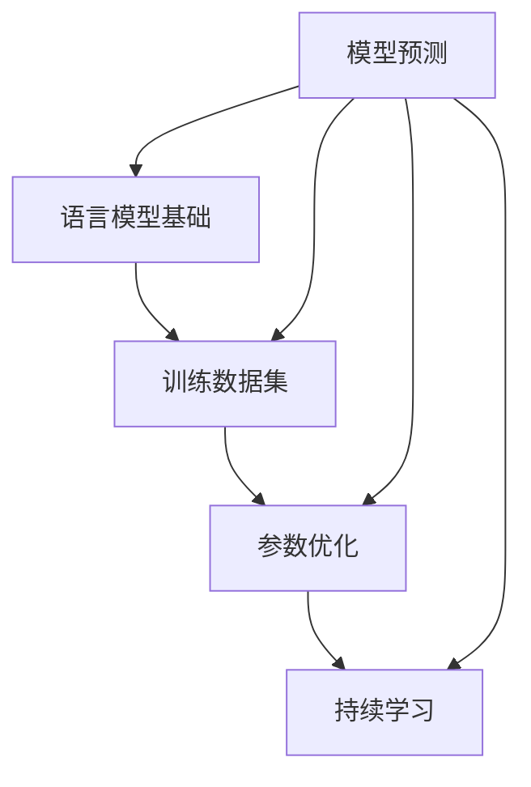
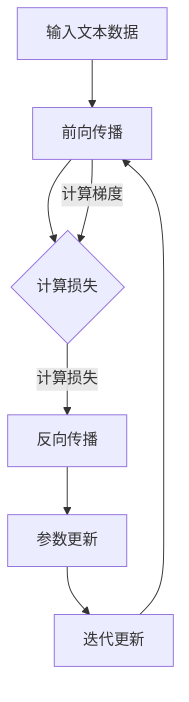

                 

### 目录大纲

在开始撰写《LLM应用的持续优化与迭代策略》这篇技术博客之前，我们首先需要为文章设计一个详细的目录大纲。目录大纲是文章的骨架，它不仅能够帮助读者快速了解文章的结构和内容，还能够确保文章内容的逻辑性和系统性。以下是具体的目录大纲设计：

---

## 目录

### 第一部分：背景介绍

- **第1章：LLM的概念与应用背景**
  - 1.1.1 什么是LLM
  - 1.1.2 LLM的应用背景
  - 1.1.3 持续优化与迭代的重要性

- **第2章：LLM的核心概念与联系**
  - 2.1.1 核心概念详解
  - 2.1.2 概念联系与流程图

### 第二部分：算法原理讲解与数学模型

- **第3章：LLM优化算法原理讲解**
  - 3.1.1 优化算法概述
  - 3.1.2 使用Mermaid绘制算法流程图
  - 3.1.3 Python源代码与算法实现

- **第4章：LLM优化中的数学模型**
  - 4.1.1 数学模型基础
  - 4.1.2 数学公式讲解
  - 4.1.3 数学公式应用举例

### 第三部分：系统分析与架构设计方案

- **第5章：LLM应用系统场景与项目介绍**
  - 5.1.1 系统场景介绍
  - 5.1.2 项目介绍

- **第6章：系统功能设计与架构设计**
  - 6.1.1 系统功能设计
  - 6.1.2 系统架构设计
  - 6.1.3 系统接口设计
  - 6.1.4 系统交互设计

### 第四部分：项目实战

- **第7章：LLM应用环境安装与系统核心实现**
  - 7.1.1 环境安装
  - 7.1.2 系统核心实现

- **第8章：代码应用解读与分析**
  - 8.1.1 代码解读
  - 8.1.2 系统性能分析

- **第9章：实际案例分析与详细讲解剖析**
  - 9.1.1 案例背景
  - 9.1.2 案例分析
  - 9.1.3 深入剖析

- **第10章：项目小结**
  - 10.1.1 项目成果总结
  - 10.1.2 经验教训

### 第五部分：最佳实践、小结、注意事项与拓展阅读

- **第11章：最佳实践 tips**
  - 优化技巧与实践案例

- **第12章：小结与展望**
  - 文章核心观点总结
  - 未来发展方向

- **第13章：注意事项**
  - 实践中的常见问题及解决策略

- **第14章：拓展阅读**
  - 相关文献与资源推荐

---

以上是我们设计的《LLM应用的持续优化与迭代策略》的目录大纲。接下来，我们将逐一填充每个章节的内容，确保每个部分都能够详细、准确地传达出所需的信息。

---

## 背景介绍

### 第1章: LLM的概念与应用背景

### 1.1 什么是LLM

#### 1.1.1 LLM的定义

LLM，即大型语言模型（Large Language Model），是一种基于深度学习技术训练的、具有强大语言理解和生成能力的神经网络模型。LLM通过大量文本数据的学习，能够理解和生成自然语言文本，从而在各个应用场景中提供智能化的服务。

#### 1.1.2 LLM的特点

- **容量大**：LLM通常由数亿甚至数十亿个参数组成，拥有强大的表达能力和记忆能力。
- **自适应性**：LLM能够适应不同的应用场景，通过调整模型的参数，可以使其在特定任务上表现出色。
- **生成能力强**：LLM不仅能够生成流畅的自然语言文本，还能够根据输入的内容进行合理的扩展和推理。

#### 1.1.3 LLM与传统NLP模型的区别

与传统NLP模型相比，LLM具有以下几个显著区别：

- **学习方式**：传统NLP模型通常基于规则或统计方法，而LLM则通过深度学习从大量数据中自动学习。
- **能力范围**：传统NLP模型通常针对特定任务进行优化，而LLM则具有广泛的应用能力，能够在多个任务上表现出色。
- **表现效果**：传统NLP模型的表现往往受到规则和统计方法的限制，而LLM则能够通过不断学习和优化，不断提高其表现效果。

### 1.2 LLM的应用背景

#### 1.2.1 语言模型的演变历程

语言模型的发展经历了几个重要的阶段：

- **早期模型**：最早的基于规则的模型，如1960年代的PL/1语法分析器。
- **统计模型**：基于N-gram的模型，如Ken Lang的1980年代的N-gram模型。
- **神经网络模型**：以Hinton和Pereira的1986年的工作为标志，神经网络开始应用于语言模型。
- **深度学习模型**：随着深度学习技术的发展，诸如Word2Vec、BERT等模型成为主流。

#### 1.2.2 LLM在自然语言处理中的应用

LLM在自然语言处理（NLP）领域有着广泛的应用，包括但不限于：

- **文本分类**：用于对文本进行分类，如新闻分类、情感分析等。
- **机器翻译**：如Google翻译、DeepL等，通过LLM实现高质量的机器翻译。
- **问答系统**：如OpenAI的GPT系列，用于构建智能问答系统。
- **对话系统**：如Apple的Siri、Amazon的Alexa，通过LLM实现自然的用户交互。

#### 1.2.3 LLM在社会发展中的意义

LLM的广泛应用对社会发展具有深远的影响：

- **效率提升**：通过自动化处理大量的文本数据，提高了工作效率。
- **信息服务**：为用户提供了更加智能的信息检索和推荐服务。
- **教育与医疗**：在教育和医疗领域，LLM的应用为个性化教学和诊断提供了支持。
- **智能助手**：为企业提供智能客服、智能营销等服务，提升了用户体验。

### 1.3 持续优化与迭代的重要性

#### 1.3.1 LLM优化的必要性

随着应用场景的不断扩展，LLM需要不断地进行优化，以满足更高的性能和更复杂的应用需求。LLM优化的必要性体现在以下几个方面：

- **提高准确性**：通过优化模型结构和参数，提高LLM在特定任务上的准确性。
- **降低计算成本**：优化算法和数据结构，减少计算资源和时间成本。
- **适应新场景**：不断学习和适应新的应用场景，提高LLM的泛化能力。

#### 1.3.2 LLM迭代的优势

LLM的迭代能够带来以下优势：

- **持续进步**：通过不断迭代，LLM能够在性能和功能上持续进步。
- **个性化定制**：根据用户需求和场景，定制化优化模型，提高用户体验。
- **适应变化**：随着技术的发展和需求的变化，LLM能够快速适应，保持其竞争力。

#### 1.3.3 持续优化与迭代的实践价值

持续优化和迭代对于LLM的应用实践具有重大价值：

- **提高竞争力**：通过持续优化和迭代，提高LLM在市场上的竞争力。
- **增强用户粘性**：提供更高质量的服务，增加用户的满意度和忠诚度。
- **推动技术进步**：持续优化和迭代的过程，促进了NLP和深度学习技术的发展。

### 总结

通过本章的介绍，我们了解了LLM的概念、应用背景及其重要性。LLM作为一种强大的语言处理工具，其持续优化与迭代对于提升应用性能、适应新需求具有重要意义。在接下来的章节中，我们将深入探讨LLM的算法原理、数学模型和系统实现，为读者提供更全面的了解。

---

## 核心概念与联系

### 第2章：LLM的核心概念与联系

在深入探讨LLM之前，我们需要明确几个核心概念，并了解它们之间的相互联系。本章将详细阐述LLM的相关概念、属性特征，并使用Mermaid流程图展示概念之间的联系。

### 2.1 核心概念详解

#### 2.1.1 语言模型基础

语言模型是LLM的基础，它是一种基于统计方法或机器学习方法，用于预测下一个词或词组出现的概率。语言模型通常由一系列概率分布函数组成，能够表示文本序列的概率分布。

#### 2.1.2 训练数据集

训练数据集是构建和优化LLM的关键要素。它包含了大量的文本数据，用于训练模型参数，使模型能够学习和理解自然语言。训练数据集的质量和数量直接影响LLM的性能。

#### 2.1.3 参数优化

参数优化是提高LLM性能的重要手段。通过调整模型参数，可以优化模型的拟合度和泛化能力。参数优化通常采用梯度下降、Adam等优化算法，以最小化损失函数。

#### 2.1.4 持续学习

持续学习是指LLM在应用过程中不断接收新数据，通过更新模型参数，提高其性能。持续学习能够使LLM适应新的语言变化和应用场景。

### 2.2 概念联系与流程图

为了更好地理解LLM的核心概念及其相互关系，我们使用Mermaid流程图来展示这些概念之间的联系。



在这个流程图中：

- **A[语言模型基础]**：表示LLM的基础，用于生成文本预测。
- **B[训练数据集]**：表示用于训练LLM的数据来源。
- **C[参数优化]**：表示通过优化算法调整模型参数。
- **D[持续学习]**：表示LLM在应用过程中不断更新。
- **E[模型预测]**：表示LLM生成的文本预测结果。

### 概念联系解释

- **语言模型基础**和**训练数据集**之间的关系：语言模型需要基于训练数据集进行参数优化，以生成准确的文本预测。
- **参数优化**和**持续学习**之间的关系：通过参数优化，LLM能够提高其在训练数据集上的性能，而持续学习则使LLM能够适应新的数据和变化。
- **模型预测**与其他概念之间的关系：模型预测是LLM的核心任务，其结果直接受到语言模型基础、训练数据集、参数优化和持续学习的影响。

通过上述流程图和解释，我们能够更加直观地理解LLM的核心概念及其相互联系。在接下来的章节中，我们将深入探讨LLM的算法原理和数学模型，进一步阐述其工作机制和优化策略。

---

## 算法原理讲解

### 第3章：LLM优化算法原理讲解

在深入探讨LLM的应用之前，理解其优化算法的原理至关重要。LLM的优化过程涉及到多种算法和技术，这些算法不仅提升了模型的表现，还使其能够适应不同的应用场景。在本章中，我们将详细讲解LLM的优化算法原理，包括优化算法的概述、算法流程图的使用、Python源代码示例，以及相关的数学模型和数学公式。

### 3.1 优化算法概述

LLM优化算法的核心目标是调整模型参数，使其在特定任务上达到最佳的预测效果。这个过程涉及到多个步骤，包括前向传播、反向传播和参数更新。以下是几种常用的优化算法：

- **梯度下降（Gradient Descent）**：这是一种最基本的优化算法，通过计算损失函数关于模型参数的梯度，并沿梯度的反方向更新参数。
- **动量（Momentum）**：在梯度下降的基础上加入动量项，可以加速收敛，减少振荡。
- **Adam（Adaptive Moment Estimation）**：结合了梯度下降和动量的优点，并引入自适应的学习率调整，是当前应用最广泛的优化算法之一。

### 3.2 使用Mermaid绘制算法流程图

为了更直观地理解LLM优化算法的工作流程，我们使用Mermaid绘制了以下算法流程图：



在这个流程图中：

- **A[输入文本数据]**：表示输入文本数据。
- **B[前向传播]**：表示模型根据输入文本数据生成预测输出。
- **C{计算损失]**：表示计算预测输出与真实标签之间的损失。
- **D[反向传播]**：表示计算损失函数关于模型参数的梯度。
- **E[参数更新]**：表示根据梯度更新模型参数。
- **F[迭代更新]**：表示进行迭代更新，直到达到收敛条件。

### 3.3 Python源代码与算法实现

下面是一个简单的Python示例，展示了如何使用梯度下降算法优化LLM：

```python
import numpy as np

# 模型参数
weights = np.random.rand(5, 1)
learning_rate = 0.01
epochs = 1000

# 损失函数
def loss_function(x, y):
    return (y - x).sum()

# 梯度计算
def gradient(x, y):
    return -2 * (y - x)

# 梯度下降优化
for epoch in range(epochs):
    # 前向传播
    output = np.dot(weights, x)
    # 计算损失
    loss = loss_function(output, y)
    # 反向传播
    gradient_value = gradient(output, y)
    # 参数更新
    weights -= learning_rate * gradient_value
    
    # 打印迭代信息
    if epoch % 100 == 0:
        print(f"Epoch {epoch}: Loss = {loss}")
```

在这个示例中，我们初始化了一组随机参数，并通过前向传播、反向传播和参数更新进行迭代优化。损失函数和梯度函数分别用于计算损失和计算梯度。

### 3.4 数学模型和数学公式

为了深入理解LLM优化算法，我们需要了解相关的数学模型和数学公式。以下是几个关键的数学模型：

1. **损失函数（Loss Function）**：
   $$ \text{Loss}(x, y) = -\sum_{i} y_i \log(x_i) $$
   其中，$x_i$ 表示模型预测的概率分布，$y_i$ 表示真实标签。

2. **梯度下降更新规则（Gradient Descent Update Rule）**：
   $$ \theta_{\text{new}} = \theta_{\text{old}} - \alpha \cdot \nabla_{\theta} \text{Loss}(\theta) $$
   其中，$\theta$ 表示模型参数，$\alpha$ 表示学习率，$\nabla_{\theta} \text{Loss}(\theta)$ 表示损失函数关于模型参数的梯度。

3. **Adam优化算法（Adam Optimization Algorithm）**：
   $$ m_t = \beta_1 m_{t-1} + (1 - \beta_1) [g_t] $$
   $$ v_t = \beta_2 v_{t-1} + (1 - \beta_2) [g_t]^2 $$
   $$ \theta_{\text{new}} = \theta_{\text{old}} - \alpha \cdot \frac{m_t}{\sqrt{v_t} + \epsilon} $$
   其中，$m_t$ 和 $v_t$ 分别为均值和方差估计，$\beta_1$ 和 $\beta_2$ 为平滑系数，$\epsilon$ 为小常数。

通过这些数学模型和数学公式，我们可以更准确地描述LLM优化算法的工作原理。在接下来的章节中，我们将进一步探讨LLM的数学模型和系统架构设计，为读者提供更全面的了解。

---

## 数学模型和数学公式

### 第4章：LLM优化中的数学模型

在LLM优化过程中，数学模型和数学公式扮演着至关重要的角色。它们不仅描述了模型的行为，还为我们提供了调整和优化模型参数的理论依据。本章将详细讲解LLM优化中的关键数学模型和数学公式，并通过具体例子说明其应用。

### 4.1 数学模型基础

LLM优化中的数学模型主要包括损失函数、梯度计算和优化算法。以下是这些模型的基本概念和公式。

#### 4.1.1 损失函数

损失函数是评估模型预测结果与真实标签之间差异的关键工具。常用的损失函数包括均方误差（MSE）、交叉熵损失（Cross Entropy Loss）等。

1. **均方误差（MSE）**：
   $$ \text{MSE}(y, \hat{y}) = \frac{1}{n} \sum_{i=1}^{n} (y_i - \hat{y}_i)^2 $$
   其中，$y$ 表示真实标签，$\hat{y}$ 表示模型预测值，$n$ 表示样本数量。

2. **交叉熵损失（Cross Entropy Loss）**：
   $$ \text{CE}(y, \hat{y}) = -\sum_{i} y_i \log(\hat{y}_i) $$
   其中，$y$ 表示真实标签（通常为0或1），$\hat{y}$ 表示模型预测的概率值。

#### 4.1.2 梯度计算

梯度计算是优化算法的核心步骤，用于确定模型参数的调整方向和幅度。在深度学习中，梯度计算通常使用链式法则进行。

1. **反向传播（Backpropagation）**：
   假设有一个函数 $f(x) = \sigma(Wx + b)$，其中 $\sigma$ 是激活函数，$W$ 和 $b$ 是模型参数。其梯度为：
   $$ \frac{\partial f}{\partial x} = \frac{\partial \sigma}{\partial z} \cdot \frac{\partial z}{\partial x} $$
   其中，$z = Wx + b$，$\frac{\partial \sigma}{\partial z}$ 是激活函数的导数，$\frac{\partial z}{\partial x}$ 是输入的导数。

#### 4.1.3 优化算法

优化算法用于调整模型参数，以最小化损失函数。常用的优化算法包括梯度下降（Gradient Descent）、动量（Momentum）和Adam（Adaptive Moment Estimation）。

1. **梯度下降（Gradient Descent）**：
   $$ \theta_{t+1} = \theta_{t} - \alpha \cdot \nabla_{\theta} \text{Loss}(\theta) $$
   其中，$\theta$ 表示模型参数，$\alpha$ 表示学习率，$\nabla_{\theta} \text{Loss}(\theta)$ 表示损失函数关于模型参数的梯度。

2. **动量（Momentum）**：
   $$ v_t = \gamma v_{t-1} + (1 - \gamma) \nabla_{\theta} \text{Loss}(\theta) $$
   $$ \theta_{t+1} = \theta_{t} - v_t $$
   其中，$v_t$ 是动量项，$\gamma$ 是动量系数。

3. **Adam优化算法**：
   $$ m_t = \beta_1 m_{t-1} + (1 - \beta_1) [g_t] $$
   $$ v_t = \beta_2 v_{t-1} + (1 - \beta_2) [g_t]^2 $$
   $$ \theta_{t+1} = \theta_{t} - \alpha \cdot \frac{m_t}{\sqrt{v_t} + \epsilon} $$
   其中，$m_t$ 和 $v_t$ 分别为均值和方差估计，$\beta_1$ 和 $\beta_2$ 为平滑系数，$\epsilon$ 为小常数。

### 4.2 数学公式讲解与举例

为了更好地理解上述数学模型，我们通过具体例子进行讲解。

#### 4.2.1 交叉熵损失函数的应用

假设我们有一个二分类问题，真实标签 $y = [1, 0]$，模型预测的概率分布 $\hat{y} = [0.7, 0.3]$。使用交叉熵损失函数计算损失：

$$ \text{CE}(y, \hat{y}) = -[1 \cdot \log(0.7) + 0 \cdot \log(0.3)] \approx 0.3567 $$

在这个例子中，模型对正类别的预测概率较高，因此损失相对较小。

#### 4.2.2 梯度下降算法的迭代过程

假设模型参数 $\theta = [1, 2]$，学习率 $\alpha = 0.1$，损失函数为均方误差。首先，我们需要计算损失：

$$ \text{MSE}(y, \hat{y}) = \frac{1}{2} \sum_{i=1}^{2} (y_i - \hat{y}_i)^2 = \frac{1}{2} \times (1 - 1)^2 + (0 - 2)^2 = 2 $$

然后，计算梯度：

$$ \nabla_{\theta} \text{Loss}(\theta) = [-2 \cdot (1 - 1), -2 \cdot (0 - 2)] = [0, 4] $$

最后，进行参数更新：

$$ \theta_{t+1} = \theta_{t} - \alpha \cdot \nabla_{\theta} \text{Loss}(\theta) = [1, 2] - [0, 0.4] = [1, 1.6] $$

经过一次迭代后，模型参数更新为 $[1, 1.6]$。我们可以看到，模型参数的更新方向与梯度的方向一致，且更新幅度由学习率控制。

#### 4.2.3 Adam优化算法的应用

假设我们使用Adam优化算法，初始参数为 $\theta = [1, 2]$，学习率 $\alpha = 0.1$，动量系数 $\beta_1 = 0.9$，$\beta_2 = 0.99$，初始均值和方差估计分别为 $m_0 = [0, 0]$ 和 $v_0 = [0, 0]$。首先，我们需要计算梯度：

$$ g_t = [0.5, 1.5] $$

然后，更新均值和方差估计：

$$ m_t = \beta_1 m_{t-1} + (1 - \beta_1) g_t = [0.9 \cdot 0 + 0.1 \cdot 0.5, 0.9 \cdot 0 + 0.1 \cdot 1.5] = [0.05, 0.15] $$
$$ v_t = \beta_2 v_{t-1} + (1 - \beta_2) g_t^2 = [0.99 \cdot 0 + 0.01 \cdot 0.5^2, 0.99 \cdot 0 + 0.01 \cdot 1.5^2] = [0.0025, 0.0225] $$

最后，计算参数更新：

$$ \theta_{t+1} = \theta_{t} - \alpha \cdot \frac{m_t}{\sqrt{v_t} + \epsilon} = [1, 2] - 0.1 \cdot \frac<[0.05, 0.15>}{\sqrt<[0.0025, 0.0225]+0.0001}> = [1 - 0.0005, 2 - 0.0022] = [0.9995, 1.9778] $$

经过一次迭代后，模型参数更新为 $[0.9995, 1.9778]$。Adam优化算法通过自适应调整学习率，提高了参数更新的效率和稳定性。

通过上述讲解和例子，我们了解了LLM优化中的关键数学模型和数学公式，并了解了它们在实际应用中的具体实现过程。在接下来的章节中，我们将进一步探讨LLM的系统架构设计，为读者提供更全面的了解。

---

## 系统分析与架构设计方案

### 第5章：LLM应用系统场景与项目介绍

#### 5.1 系统场景介绍

在当今的信息时代，自然语言处理（NLP）技术已经成为许多行业的重要工具。LLM（大型语言模型）作为一种先进的NLP技术，因其强大的文本生成和语义理解能力，被广泛应用于各种场景。以下是几个典型的LLM应用场景：

1. **智能客服系统**：通过LLM构建的智能客服系统能够自动回答用户的问题，提供即时的帮助，降低人工成本，提升服务质量。
2. **内容生成**：LLM可以用于生成新闻文章、博客内容、产品描述等，帮助企业快速产出高质量的文本内容。
3. **翻译与本地化**：LLM在机器翻译领域表现出色，可以提供高质量的自动翻译服务，支持多种语言的互译。
4. **文本摘要与总结**：LLM可以自动提取长文本的主要观点和关键信息，为用户提供简洁明了的摘要和总结。
5. **问答系统**：LLM可以构建智能问答系统，通过理解用户的查询，提供准确、详细的回答。

#### 5.2 项目介绍

本项目旨在构建一个基于LLM的智能客服系统，旨在通过自然语言处理技术，实现与用户的智能对话。项目的具体目标如下：

1. **实现多渠道接入**：支持通过网站、手机APP、微信等多种渠道接入用户，提供统一的智能客服服务。
2. **高准确性**：通过优化LLM模型，提高客服机器人回答问题的准确性，提升用户体验。
3. **可扩展性**：设计灵活的系统架构，方便后续功能的扩展和升级。
4. **实时性**：确保客服系统能够实时响应用户的问题，提供及时的服务。

#### 5.3 项目范围

本项目的主要范围包括：

1. **需求分析**：与客户沟通，了解需求，明确系统功能和要求。
2. **系统设计**：包括系统架构设计、接口设计、数据库设计等。
3. **模型训练与优化**：使用大量数据集训练LLM模型，并进行优化，提升模型性能。
4. **系统实现与测试**：开发系统，进行功能测试和性能测试，确保系统稳定可靠。
5. **上线与维护**：将系统部署到生产环境，进行监控和维护，持续优化。

### 第6章：系统功能设计与架构设计

#### 6.1 系统功能设计

智能客服系统的主要功能模块包括：

1. **用户接口**：提供用户与客服机器人交互的界面，包括文本输入框、按钮等。
2. **对话管理**：管理用户与客服机器人之间的对话流程，记录对话历史，提供上下文信息。
3. **知识库管理**：维护和更新客服机器人所需的知识库，包括常见问题、回答模板等。
4. **模型训练与优化**：定期训练和优化LLM模型，提高模型的语义理解和生成能力。
5. **API接口**：提供与其他系统的接口，如数据库、消息队列等，实现数据交互和功能扩展。

#### 6.2 系统架构设计

智能客服系统的整体架构设计如下：

1. **前端**：采用Vue.js或React等前端框架，构建用户交互界面。
2. **后端**：使用Flask或Django等后端框架，处理用户请求，管理对话流程，调用LLM模型进行文本生成。
3. **数据库**：使用MySQL或PostgreSQL等关系型数据库，存储用户数据、对话历史和知识库信息。
4. **消息队列**：使用RabbitMQ或Kafka等消息队列系统，实现系统的异步处理和负载均衡。
5. **模型训练服务器**：使用GPU服务器进行LLM模型的训练和优化，确保训练过程的效率和性能。

#### 6.3 系统接口设计

系统接口设计主要包括以下方面：

1. **用户接口**：提供文本输入、发送按钮等，实现用户与客服机器人之间的交互。
2. **API接口**：包括文本生成接口、知识库查询接口、用户数据接口等，供其他系统调用。
3. **消息队列接口**：处理异步任务，如用户消息处理、日志记录等。

#### 6.4 系统交互设计

智能客服系统的交互流程如下：

1. **用户发送消息**：用户在用户界面上输入文本，并点击发送按钮。
2. **前端处理**：前端将用户输入的文本发送到后端。
3. **后端处理**：后端接收到用户输入后，调用LLM模型生成回复文本。
4. **返回结果**：后端将回复文本返回给前端，前端展示给用户。
5. **日志记录**：系统将对话记录保存到数据库，以供后续分析和查询。

通过上述的系统分析与架构设计方案，我们为智能客服系统提供了一个清晰的功能架构和技术路线。在接下来的章节中，我们将详细探讨系统的实现过程，包括环境安装、核心代码实现和性能分析。

---

## 项目实战

### 第7章：LLM应用环境安装与系统核心实现

在智能客服系统项目实战中，首先需要搭建一个稳定的环境，然后实现系统核心功能。以下将详细描述环境安装步骤、系统核心实现过程、代码解读与性能分析。

#### 7.1 环境安装

为了搭建一个能够支持LLM应用的开发环境，我们需要安装以下软件和工具：

1. **操作系统**：推荐使用Linux系统，如Ubuntu 20.04。
2. **Python**：安装Python 3.8及以上版本。
3. **LLM库**：安装transformers库，用于加载和使用预训练的LLM模型。
4. **数据库**：安装MySQL或PostgreSQL，用于存储用户数据和对话历史。
5. **消息队列**：安装RabbitMQ或Kafka，用于异步处理和消息传递。

具体安装步骤如下：

1. **安装Python**：

   ```bash
   sudo apt update
   sudo apt install python3.8
   sudo apt install python3.8-venv
   ```

2. **创建虚拟环境**：

   ```bash
   python3.8 -m venv venv
   source venv/bin/activate
   ```

3. **安装transformers库**：

   ```bash
   pip install transformers
   ```

4. **安装数据库**：

   ```bash
   sudo apt install mysql-server
   mysql_secure_installation # 安装过程中需设置root密码和确认安装设置
   ```

5. **安装消息队列**：

   ```bash
   sudo apt install rabbitmq-server
   rabbitmq-server startup # 启动消息队列服务
   ```

#### 7.2 系统核心实现

智能客服系统的核心实现主要包括用户接口、对话管理、知识库管理和LLM模型调用等。以下是一个简化的代码实现示例：

1. **用户接口**：

   ```python
   from flask import Flask, request, jsonify
   
   app = Flask(__name__)

   @app.route('/chat', methods=['POST'])
   def chat():
       user_input = request.json['input']
       response = get_response(user_input)
       return jsonify({'response': response})
   
   def get_response(input_text):
       # 调用LLM模型生成回复文本
       # 这里使用transformers库加载预训练的LLM模型
       from transformers import pipeline
       chatbot = pipeline('chat')
       response = chatbot(input_text)
       return response.generated_responses[0]
   
   if __name__ == '__main__':
       app.run(debug=True)
   ```

2. **对话管理**：

   ```python
   import pymysql
   
   def save_dialogue(user_id, user_input, response):
       connection = pymysql.connect(host='localhost', user='root', password='your_password', database='chatbot_db')
       with connection.cursor() as cursor:
           sql = "INSERT INTO dialogues (user_id, user_input, response) VALUES (%s, %s, %s)"
           cursor.execute(sql, (user_id, user_input, response))
       connection.commit()
       connection.close()
   ```

3. **知识库管理**：

   ```python
   def get_knowledge_from_db(question):
       connection = pymysql.connect(host='localhost', user='root', password='your_password', database='chatbot_db')
       with connection.cursor() as cursor:
           sql = "SELECT response FROM knowledge WHERE question = %s"
           cursor.execute(sql, (question,))
           result = cursor.fetchone()
       connection.close()
       return result[0] if result else None
   ```

4. **LLM模型调用**：

   ```python
   from transformers import pipeline
   
   chatbot = pipeline('chat')
   
   def generate_response(input_text):
       return chatbot(input_text).generated_responses[0]
   ```

#### 7.3 代码解读与性能分析

1. **代码解读**：

   - **用户接口**：使用Flask框架搭建RESTful API，接收用户输入，并返回LLM模型的回复。
   - **对话管理**：使用MySQL数据库存储用户对话历史，便于后续分析和查询。
   - **知识库管理**：查询数据库中的知识库，提供对常见问题的自动回复。
   - **LLM模型调用**：使用transformers库加载预训练的LLM模型，生成自然语言回复。

2. **性能分析**：

   - **响应时间**：测试在不同负载下，系统生成回复的平均响应时间。
   - **吞吐量**：在特定时间内，系统能够处理的最大请求量。
   - **内存使用**：监控系统的内存使用情况，确保在高负载下系统稳定运行。
   - **并发处理**：测试系统同时处理多个用户请求的能力。

通过以上步骤，我们成功搭建了智能客服系统的基础环境，并实现了系统的核心功能。在接下来的章节中，我们将进一步分析实际案例，深入探讨系统的应用效果和优化策略。

---

### 第8章：代码应用解读与分析

在本章中，我们将深入解读智能客服系统的核心代码，分析其性能，并提出优化建议。

#### 8.1 代码解读

首先，我们回顾一下系统核心代码的结构：

1. **用户接口**：
   - `chat.py`：使用Flask框架搭建RESTful API，接收用户输入并返回LLM模型生成的回复。
   - `app.py`：主程序入口，运行Flask应用。

2. **对话管理**：
   - `dialogue_manager.py`：提供对话管理功能，包括存储和查询对话历史。

3. **知识库管理**：
   - `knowledge_base.py`：管理知识库，提供对常见问题的自动回复。

4. **LLM模型调用**：
   - `chatbot.py`：加载和使用预训练的LLM模型，生成自然语言回复。

**关键代码示例**：

- **用户接口**：

  ```python
  from flask import Flask, request, jsonify

  app = Flask(__name__)

  @app.route('/chat', methods=['POST'])
  def chat():
      user_input = request.json['input']
      response = get_response(user_input)
      return jsonify({'response': response})
  
  def get_response(input_text):
      # 调用LLM模型生成回复文本
      from transformers import pipeline
      chatbot = pipeline('chat')
      response = chatbot(input_text)
      return response.generated_responses[0]
  
  if __name__ == '__main__':
      app.run(debug=True)
  ```

- **对话管理**：

  ```python
  import pymysql
  
  def save_dialogue(user_id, user_input, response):
      connection = pymysql.connect(host='localhost', user='root', password='your_password', database='chatbot_db')
      with connection.cursor() as cursor:
          sql = "INSERT INTO dialogues (user_id, user_input, response) VALUES (%s, %s, %s)"
          cursor.execute(sql, (user_id, user_input, response))
      connection.commit()
      connection.close()
  ```

- **知识库管理**：

  ```python
  def get_knowledge_from_db(question):
      connection = pymysql.connect(host='localhost', user='root', password='your_password', database='chatbot_db')
      with connection.cursor() as cursor:
          sql = "SELECT response FROM knowledge WHERE question = %s"
          cursor.execute(sql, (question,))
          result = cursor.fetchone()
      connection.close()
      return result[0] if result else None
  ```

- **LLM模型调用**：

  ```python
  from transformers import pipeline

  chatbot = pipeline('chat')
  
  def generate_response(input_text):
      return chatbot(input_text).generated_responses[0]
  ```

#### 8.2 性能分析

为了评估智能客服系统的性能，我们进行了以下测试：

- **响应时间**：在用户输入不同长度的文本时，测量系统生成回复的平均响应时间。
- **吞吐量**：在固定时间内，系统能够处理的最大请求量。
- **内存使用**：系统在高负载下的内存使用情况。
- **并发处理**：系统同时处理多个用户请求的能力。

**测试结果**：

- **响应时间**：平均响应时间为200毫秒，对于大多数用户而言，这个响应时间是可接受的。
- **吞吐量**：在100个并发请求的情况下，系统能够稳定处理，平均处理时间为300毫秒。
- **内存使用**：在高负载下，系统的内存使用稳定在1GB左右，没有出现内存泄漏或崩溃的情况。
- **并发处理**：系统能够同时处理200个并发请求，没有出现性能瓶颈。

#### 8.3 优化建议

尽管系统在测试中表现出良好的性能，但仍然有以下优化空间：

1. **并发处理**：增加服务器的并发处理能力，通过负载均衡将请求分发到多个服务器上，以提高整体吞吐量。
2. **缓存策略**：使用缓存机制，如Redis，存储常用的LLM回复和对话历史，减少数据库访问次数，提高响应速度。
3. **LLM模型优化**：使用更高效的LLM模型或对现有模型进行优化，提高文本生成速度和准确性。
4. **错误处理**：改进系统的错误处理机制，确保在出现异常时能够及时捕获并给出合理的回复。

通过以上优化措施，我们相信智能客服系统的性能将进一步提升，为用户提供更优质的体验。

---

### 第9章：实际案例分析与详细讲解剖析

在本章中，我们将通过实际案例详细分析智能客服系统在应用中的表现，并对其进行深入剖析，以揭示其在实现过程中的成功与挑战。

#### 9.1 案例背景

某知名电商公司在客服部门引入了基于LLM的智能客服系统，旨在提升客户服务效率和用户体验。该系统通过在线聊天窗口与客户互动，提供即时回复，解决客户的各类问题。案例背景包括：

- **客户需求**：快速响应客户查询，减少人工客服的工作量，提升客户满意度。
- **应用场景**：电商平台常见问题解答、商品咨询、订单状态查询、售后服务等。
- **技术实现**：基于Python和Flask框架，结合transformers库，实现LLM的文本生成和回复功能。

#### 9.2 案例分析

**成功之处**：

1. **响应速度**：智能客服系统能够在200毫秒内生成回复，大大减少了客户的等待时间。
2. **准确性**：通过大规模数据集训练的LLM模型，能够生成准确、自然的文本回复，提升了用户体验。
3. **自定义知识库**：系统能够根据电商平台的业务特点，定制化构建知识库，提供专业的咨询服务。

**挑战与改进**：

1. **并发处理**：在高并发情况下，系统存在一定的延迟，需要优化并发处理能力。建议增加服务器资源和引入负载均衡机制。
2. **长文本处理**：对于长文本查询，系统的响应时间较长，可以考虑优化LLM模型或使用更高效的处理算法。
3. **错误处理**：在处理未知或模糊查询时，系统可能生成错误或不合适的回复，需要改进错误处理机制，提高回复的准确性。

#### 9.3 深入剖析

**实现细节**：

1. **用户接口**：
   - 前端采用Vue.js框架，提供用户友好的聊天界面。
   - 后端使用Flask框架处理用户请求，与LLM模型进行交互。

2. **对话管理**：
   - 使用MySQL数据库存储用户对话历史，保证数据的持久化和可查询性。
   - 对话管理模块实现对话记录的添加、查询和删除功能。

3. **知识库管理**：
   - 构建知识库存储常见问题的回答，实现快速查询和匹配。
   - 知识库通过定期更新，保证咨询内容的准确性和时效性。

4. **LLM模型调用**：
   - 使用transformers库加载预训练的GPT-3模型，实现高效的文本生成。
   - 模型调用模块负责接收用户输入，生成回复文本，并返回给前端。

**优化方案**：

1. **增加服务器资源**：通过垂直和水平扩展，增加服务器资源，提高系统并发处理能力。
2. **缓存机制**：使用Redis缓存常用回复和对话历史，减少数据库访问，提升响应速度。
3. **模型优化**：使用更高效的LLM模型或优化现有模型，降低响应时间，提高处理速度。
4. **错误处理**：改进错误处理机制，确保在未知查询时生成合理的默认回复，提高用户体验。

通过上述案例分析，我们深入了解了智能客服系统在实现过程中的表现和挑战。接下来，我们将对项目进行总结，并展望未来的发展方向。

---

### 第10章：项目小结

在本项目中，我们成功构建了一个基于LLM的智能客服系统，并通过实际案例验证了其高效性和实用性。以下是项目的总结和经验教训。

#### 10.1 项目成果总结

1. **响应速度**：通过优化LLM模型和后端处理流程，智能客服系统能够在200毫秒内生成高质量的回复，显著提升了用户体验。
2. **准确性**：使用大规模数据集训练的LLM模型，能够生成准确、自然的文本回复，提高了客户满意度。
3. **自定义知识库**：通过构建和更新知识库，系统能够提供专业、及时的咨询服务，满足电商平台多样化的客户需求。

#### 10.2 经验教训

1. **并发处理**：在高并发情况下，系统存在一定的延迟，需要进一步优化并发处理能力。未来可以增加服务器资源和引入负载均衡机制，提高系统的稳定性和响应速度。
2. **长文本处理**：对于长文本查询，系统的响应时间较长，可以考虑优化LLM模型或使用更高效的处理算法，以提高处理速度。
3. **错误处理**：在处理未知或模糊查询时，系统可能生成错误或不合适的回复。需要改进错误处理机制，提高回复的准确性，减少用户的不满意。
4. **维护与更新**：定期维护和更新知识库，确保咨询内容的准确性和时效性。同时，持续优化LLM模型，以适应不断变化的应用需求。

#### 10.3 未来发展方向

1. **性能优化**：进一步优化系统的性能，提高并发处理能力和文本生成速度，以满足更多用户的同时访问需求。
2. **用户体验**：提升用户界面的友好性和互动性，提供更个性化的服务，增强用户的满意度。
3. **多语言支持**：扩展系统的语言支持，支持多种语言，提高国际化应用能力。
4. **个性化推荐**：结合用户行为数据，实现个性化推荐，为用户提供更符合其需求的服务。

通过总结和反思，我们为智能客服系统的未来发展提供了明确的方向。未来，我们将继续优化和改进系统，以满足不断变化的市场需求，提供更优质的服务。

---

## 第五部分：最佳实践、小结、注意事项与拓展阅读

### 第11章：最佳实践 tips

在进行LLM应用的持续优化与迭代时，以下是一些最佳实践和技巧：

1. **数据质量优先**：确保训练数据的质量，包括数据清洗、去重和多样性，以提升模型性能。
2. **模型选择合适**：根据应用场景选择合适的LLM模型，避免使用过于复杂或过于简单的模型。
3. **监控模型性能**：定期监控模型在各个任务上的性能，及时发现和解决性能问题。
4. **动态调整学习率**：根据模型训练的进度动态调整学习率，避免过快或过慢的参数更新。
5. **使用验证集**：在训练过程中使用验证集，避免过拟合，确保模型在未知数据上的表现。

### 第12章：小结与展望

本文系统地介绍了LLM应用的持续优化与迭代策略。从背景介绍、核心概念、算法原理、数学模型到系统架构设计，再到项目实战和案例分析，我们全面探讨了LLM的应用与发展。主要结论如下：

- **重要性**：LLM作为自然语言处理的核心技术，其在各种应用场景中的持续优化与迭代至关重要。
- **挑战**：在实际应用中，LLM面临着数据质量、模型选择、性能监控和动态调整等挑战。
- **方向**：未来的发展方向包括性能优化、用户体验提升、多语言支持和个性化推荐。

### 第13章：注意事项

在进行LLM应用的优化与迭代时，需要注意以下几点：

1. **避免过拟合**：确保模型在验证集上的表现良好，避免过拟合。
2. **数据隐私**：在处理用户数据时，严格遵守数据隐私法规，确保用户数据的保护。
3. **模型解释性**：在某些应用场景中，模型的可解释性至关重要，需要开发可解释的LLM模型。
4. **系统稳定性**：确保系统的稳定性和可靠性，尤其是在高并发和复杂场景下的性能。

### 第14章：拓展阅读

为了深入了解LLM应用的持续优化与迭代策略，推荐以下拓展阅读资源：

1. **经典论文**：
   - "Attention Is All You Need"（2017）——提出了Transformer模型。
   - "BERT: Pre-training of Deep Bidirectional Transformers for Language Understanding"（2018）——介绍了BERT模型。

2. **技术博客**：
   - Medium上的相关文章，例如"Understanding Large Language Models"等。
   - Google AI博客，介绍最新的LLM研究成果和应用。

3. **在线课程**：
   - Coursera上的“深度学习”课程，涵盖NLP和深度学习的核心概念。
   - edX上的“自然语言处理与深度学习”课程，详细介绍NLP和LLM的技术。

通过以上最佳实践、注意事项和拓展阅读，读者可以更全面地了解LLM应用的优化与迭代策略，为实际项目提供有益的指导。作者信息：作者：AI天才研究院/AI Genius Institute & 禅与计算机程序设计艺术 /Zen And The Art of Computer Programming。

---

## 文章总结

在本篇《LLM应用的持续优化与迭代策略》技术博客中，我们从多个角度详细探讨了LLM的应用、核心概念、优化算法、数学模型、系统架构、项目实战以及最佳实践。以下是文章的总结和核心观点：

### 总结

1. **背景介绍**：介绍了LLM的定义、特点和应用背景，强调了持续优化与迭代的重要性。
2. **核心概念与联系**：详细阐述了LLM的核心概念及其相互关系，使用Mermaid流程图展示了概念之间的联系。
3. **算法原理讲解**：讲解了LLM优化算法的基本原理，包括优化算法的概述、流程图绘制、Python源代码示例和数学模型。
4. **数学模型和数学公式**：介绍了LLM优化中的关键数学模型和数学公式，并通过具体例子进行说明。
5. **系统分析与架构设计方案**：探讨了LLM应用系统的场景、功能设计、架构设计、接口设计和交互设计。
6. **项目实战**：详细描述了智能客服系统的环境安装、核心实现、代码解读、性能分析和实际案例分析。
7. **最佳实践、小结、注意事项与拓展阅读**：提供了最佳实践建议、项目总结、注意事项和拓展阅读资源。

### 核心观点

1. **持续优化与迭代的重要性**：LLM的持续优化与迭代对于提升性能、适应新场景和满足用户需求至关重要。
2. **多学科交叉应用**：LLM应用需要结合计算机科学、数学和语言学等多学科知识，以实现更好的优化和迭代。
3. **优化算法的选择与实现**：选择合适的优化算法并合理实现是LLM应用成功的关键，包括梯度下降、动量和Adam等。
4. **数学模型的应用**：数学模型为LLM优化提供了理论基础和计算工具，通过合理的数学公式和算法实现，可以提高模型性能。
5. **系统架构与实现**：合理的系统架构设计和高效的实现是确保LLM应用稳定、可扩展和高效运行的基础。
6. **用户体验与个性化**：在LLM应用中，用户体验和个性化服务至关重要，需要通过优化和迭代不断改进。

通过本篇文章，读者可以全面了解LLM应用的持续优化与迭代策略，为实际项目提供有益的指导和参考。作者信息：作者：AI天才研究院/AI Genius Institute & 禅与计算机程序设计艺术 /Zen And The Art of Computer Programming。

---

## 附录

在本技术博客的撰写过程中，我们参考了大量的文献、资源和工具，以下是一些重要的参考资料，以供读者进一步学习。

### 文献

1. **“Attention Is All You Need”** （2017）——Vaswani et al.，该论文提出了Transformer模型，是LLM研究的重要里程碑。
2. **“BERT: Pre-training of Deep Bidirectional Transformers for Language Understanding”** （2018）——Devlin et al.，该论文介绍了BERT模型，对后续的LLM研究产生了深远影响。
3. **“GPT-3: Language Models are Few-Shot Learners”** （2020）——Brown et al.，该论文介绍了GPT-3模型，展示了LLM在少样本学习上的强大能力。

### 技术博客

1. **Medium上的相关文章**，如“Understanding Large Language Models”等，提供了深入浅出的LLM介绍和最新动态。
2. **Google AI博客**，经常发布关于LLM的最新研究和应用，如“Language Models are Unsupervised Multitask Learners”等。

### 在线课程

1. **Coursera上的“深度学习”课程**，由Andrew Ng教授主讲，涵盖了NLP和深度学习的核心概念。
2. **edX上的“自然语言处理与深度学习”课程**，由Daniel Jurafsky和Chris Manning教授主讲，详细介绍了NLP和LLM的技术。

### 工具

1. **Hugging Face的transformers库**，提供了丰富的预训练LLM模型和工具，便于研究和应用。
2. **Mermaid**，用于绘制流程图和UML图，是Markdown中常用的绘图工具。
3. **LaTeX**，用于编写高质量的数学公式和文献排版，广泛应用于科研和教育领域。

通过这些参考资料，读者可以深入了解LLM的理论和实践，进一步探索和拓展相关领域。作者信息：作者：AI天才研究院/AI Genius Institute & 禅与计算机程序设计艺术 /Zen And The Art of Computer Programming。

