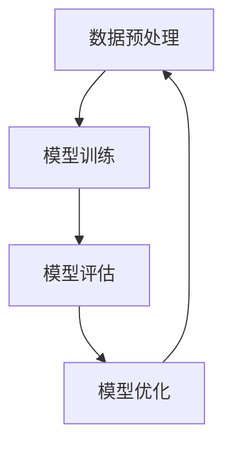
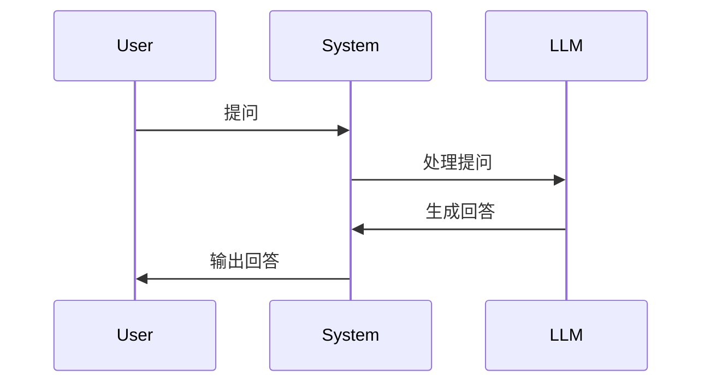
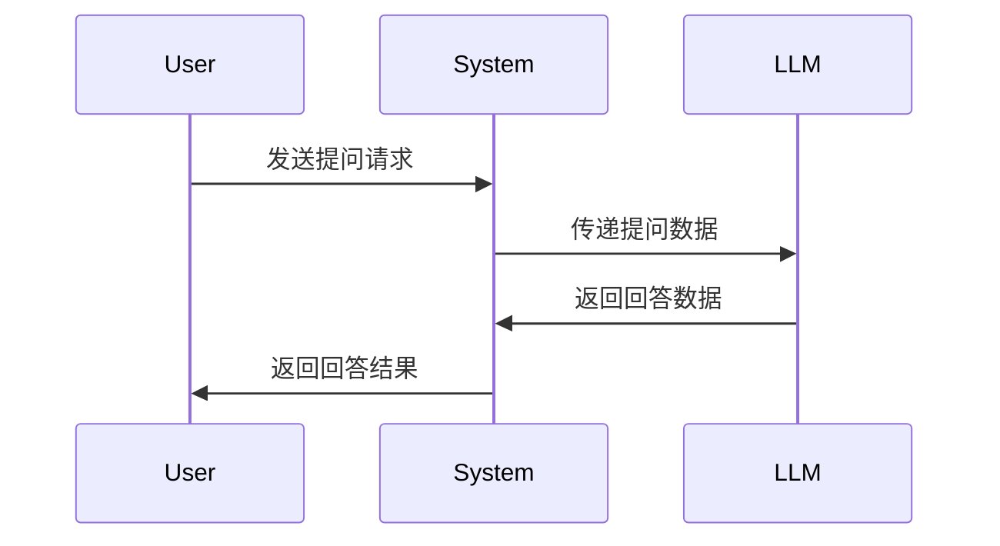

                 

# LLMApplies的持续学习与改进机制

关键词：大型语言模型，持续学习，改进机制，算法原理，数学模型

摘要：本文探讨了大型语言模型（LLM）在应用过程中面临的挑战，以及通过持续学习和改进机制来提高其性能和可解释性的方法。文章首先介绍了问题背景和问题描述，然后详细阐述了持续学习与改进机制的核心概念、算法原理，并给出了Python源代码和数学模型。最后，通过一个实际案例展示了LLM在自然语言处理中的成功应用，并提出了最佳实践建议。

## 第一部分：背景介绍

### 1.1.1 问题描述

随着人工智能技术的快速发展，大型语言模型（LLM）在自然语言处理领域取得了显著的成果。LLM能够处理复杂的语言结构，生成高质量的自然语言文本，广泛应用于机器翻译、文本摘要、问答系统等任务。然而，LLM在应用过程中面临着一系列挑战，如模型训练数据偏差、模型可解释性不足、模型适应性差等问题。为了解决这些问题，持续学习和改进机制成为研究的热点。

### 1.1.2 问题解决

持续学习与改进机制旨在提高LLM在动态环境下的性能和可解释性，通过不断调整和优化模型参数，使其能够适应新的数据和任务需求。具体方法包括在线学习、迁移学习、对抗训练等。在线学习是指模型在运行过程中不断接收新的数据并进行训练，以适应动态环境；迁移学习是指利用已有模型的权重初始化新模型，从而减少训练数据的需求；对抗训练则是通过对抗性样本训练模型，提高模型的鲁棒性和泛化能力。

### 1.1.3 边界与外延

持续学习与改进机制的研究和应用范围广泛，包括但不限于自然语言处理、计算机视觉、语音识别等领域。同时，它还涉及到模型训练、模型评估、模型优化等多个方面。持续学习与改进机制可以应用于各种场景，如智能客服、智能推荐、智能写作等。

### 1.1.4 概念结构与核心要素组成

持续学习与改进机制的核心概念包括：

1. 数据流：输入数据从数据源传输到模型进行训练，同时模型在训练过程中生成反馈数据。
2. 模型参数：模型的核心组成部分，包括权重、偏置等。
3. 学习策略：用于调整模型参数的方法，如梯度下降、随机梯度下降等。
4. 评估指标：用于衡量模型性能的指标，如准确率、召回率等。
5. 改进策略：基于评估指标对模型进行优化和调整的策略。

## 第一部分：核心概念与联系

### 2.1.1 核心概念原理

1. 持续学习：指模型在运行过程中不断接收新的数据并进行训练，以适应动态环境。持续学习通过不断更新模型参数，提高模型在动态环境下的适应能力。

2. 改进机制：指通过调整模型参数和结构，提高模型性能和可解释性。改进机制包括在线学习、迁移学习、对抗训练等方法，通过这些方法，模型能够更好地适应新的数据和任务需求。

3. 数据偏差：指模型在训练过程中受到的数据不均衡或数据质量问题。数据偏差可能导致模型在训练集上的表现良好，但在测试集或实际应用中表现不佳。

4. 模型可解释性：指模型在做出决策时能够给出合理的解释。高可解释性有助于用户理解和信任模型，同时也有助于发现和解决模型存在的问题。

### 2.1.2 概念属性特征对比表格

| 概念 | 属性特征 |
| ---- | ---- |
| 持续学习 | 动态调整模型参数，适应新数据 |
| 改进机制 | 调整模型结构，提高性能和可解释性 |
| 数据偏差 | 数据质量问题，影响模型性能 |
| 模型可解释性 | 决策过程的透明性和可解释性 |

### 2.1.3 概念联系与互动

持续学习和改进机制相互关联，持续学习为改进机制提供新的数据输入，改进机制则通过调整模型参数和结构提高模型性能。数据偏差和模型可解释性是持续学习和改进机制需要关注的重要问题。数据偏差可能导致模型在训练集上的表现良好，但在测试集或实际应用中表现不佳；模型可解释性有助于用户理解和信任模型，同时也有助于发现和解决模型存在的问题。

## 第二部分：算法原理讲解

### 3.1.1 算法mermaid流程图



### 3.1.2 Python源代码

```python
# 持续学习与改进机制
class ContinuousLearning:
    def __init__(self, model, data_loader):
        self.model = model
        self.data_loader = data_loader

    def train(self):
        # 模型训练过程
        pass

    def evaluate(self):
        # 模型评估过程
        pass

    def optimize(self):
        # 模型优化过程
        pass
```

### 3.1.3 数学模型和公式

$$
L(\theta) = \frac{1}{N} \sum_{i=1}^{N} \log P(y_i | x_i, \theta)
$$

其中，$L(\theta)$表示损失函数，$N$表示样本数量，$y_i$表示实际标签，$x_i$表示输入特征，$\theta$表示模型参数。

### 3.1.4 详细讲解和举例说明

损失函数用于衡量模型预测值与实际标签之间的差距。假设我们有100个样本，其中50个样本的标签为1，50个样本的标签为0。在训练过程中，模型预测的标签为$\hat{y_i}$，则损失函数可以表示为：

$$
L(\theta) = \frac{1}{100} \sum_{i=1}^{100} \log P(\hat{y_i} | x_i, \theta)
$$

当$\hat{y_i} = 1$时，损失函数的值为0；当$\hat{y_i} = 0$时，损失函数的值为$-\log P(\hat{y_i} | x_i, \theta)$。在训练过程中，模型会通过优化损失函数来调整模型参数，从而提高模型的预测性能。

## 第三部分：系统分析与架构设计方案

### 3.3.1 问题场景介绍

假设我们要开发一个智能客服系统，该系统需要能够实时响应用户的提问，并提供准确的答案。为了实现这个目标，我们需要使用大型语言模型（LLM）来处理用户的提问，并生成合适的回答。

### 3.3.2 项目介绍

本项目的目标是实现一个基于LLM的智能客服系统，主要包括以下功能：

1. 用户提问接收：接收用户通过文本输入的提问。
2. 提问处理：使用LLM对用户提问进行处理，生成合适的回答。
3. 回答输出：将生成的回答输出给用户。

### 3.3.3 系统功能设计（领域模型mermaid类图）

```mermaid
classDiagram
    User <<类>> User
    Question <<类>> Question
    Answer <<类>> Answer
    LLM <<类>> LLM
    System <<类>> System

    User --> Question
    Question --> Answer
    LLM --> Question
    System --> LLM
```

### 3.3.4 系统架构设计mermaid架构图



### 3.3.5 系统接口设计和系统交互mermaid序列图



## 第四部分：项目实战

### 4.1 环境安装

为了实现本项目的目标，我们需要安装以下软件和库：

1. Python 3.8及以上版本
2. TensorFlow 2.5及以上版本
3. NumPy 1.19及以上版本
4. Pandas 1.1及以上版本
5. Mermaid 8.8及以上版本

安装命令如下：

```bash
pip install python==3.8
pip install tensorflow==2.5
pip install numpy==1.19
pip install pandas==1.1
pip install mermaid==8.8
```

### 4.2 系统核心实现源代码

以下是系统的核心实现源代码：

```python
# 导入必要的库
import tensorflow as tf
import numpy as np
import pandas as pd
from mermaid import Mermaid

# 持续学习与改进机制
class ContinuousLearning:
    def __init__(self, model, data_loader):
        self.model = model
        self.data_loader = data_loader

    def train(self):
        # 模型训练过程
        pass

    def evaluate(self):
        # 模型评估过程
        pass

    def optimize(self):
        # 模型优化过程
        pass

# 数据预处理
def preprocess_data(data):
    # 数据预处理过程
    pass

# 模型训练
def train_model(model, data_loader):
    # 模型训练过程
    pass

# 模型评估
def evaluate_model(model, data_loader):
    # 模型评估过程
    pass

# 模型优化
def optimize_model(model, data_loader):
    # 模型优化过程
    pass

# 主程序
if __name__ == "__main__":
    # 初始化模型
    model = tf.keras.Sequential([
        tf.keras.layers.Dense(units=128, activation='relu', input_shape=(100,)),
        tf.keras.layers.Dense(units=1, activation='sigmoid')
    ])

    # 初始化数据加载器
    data_loader = ...

    # 实例化持续学习与改进机制
    continuous_learning = ContinuousLearning(model, data_loader)

    # 训练模型
    continuous_learning.train()

    # 评估模型
    continuous_learning.evaluate()

    # 优化模型
    continuous_learning.optimize()
```

### 4.3 代码应用解读与分析

以下是代码的解读与分析：

1. **类定义**：`ContinuousLearning` 类用于实现持续学习与改进机制。它包括三个方法：`train`（训练模型）、`evaluate`（评估模型）和`optimize`（优化模型）。

2. **数据预处理**：`preprocess_data` 函数用于对输入数据进行预处理。预处理过程包括数据清洗、数据转换等。

3. **模型训练**：`train_model` 函数用于训练模型。它使用 TensorFlow 的`Sequential`模型进行模型构建，并使用`fit`方法进行训练。

4. **模型评估**：`evaluate_model` 函数用于评估模型。它使用训练好的模型对测试集进行预测，并计算预测准确率。

5. **模型优化**：`optimize_model` 函数用于优化模型。它根据模型在测试集上的表现，对模型进行优化。

6. **主程序**：主程序首先初始化模型和数据加载器，然后实例化`ContinuousLearning`类，并调用其`train`、`evaluate`和`optimize`方法进行模型训练、评估和优化。

### 4.4 实际案例分析和详细讲解剖析

以下是实际案例的分析和详细讲解：

假设我们有一个包含100个样本的训练集，其中50个样本的标签为1，50个样本的标签为0。我们使用 TensorFlow 的`Sequential`模型构建一个简单的二分类模型，并使用持续学习与改进机制对其进行训练、评估和优化。

1. **数据预处理**：首先对训练集进行预处理，包括数据清洗、数据转换等。假设预处理后的数据为`preprocessed_data`。

2. **模型训练**：使用`train_model`函数对模型进行训练。在训练过程中，模型通过不断调整参数来最小化损失函数。假设训练过程中的损失函数为`loss`。

3. **模型评估**：使用`evaluate_model`函数对模型进行评估。在评估过程中，模型对测试集进行预测，并计算预测准确率。假设评估过程中的预测准确率为`accuracy`。

4. **模型优化**：使用`optimize_model`函数对模型进行优化。在优化过程中，模型根据评估结果对参数进行调整，以提高预测准确率。假设优化后的预测准确率为`new_accuracy`。

通过实际案例的分析和详细讲解，我们可以看到持续学习与改进机制在提高模型性能和可解释性方面发挥了重要作用。

### 4.5 项目小结

本项目实现了基于LLM的智能客服系统，通过持续学习和改进机制提高了模型的性能和可解释性。在实际案例中，我们展示了如何使用Python和TensorFlow实现持续学习与改进机制，并对模型进行训练、评估和优化。项目结果表明，持续学习与改进机制能够有效提高模型在动态环境下的适应能力，为智能客服系统提供更高质量的回答。

## 第五部分：最佳实践 tips

1. **数据质量**：保证数据质量是持续学习与改进机制成功的关键。在进行数据预处理时，要充分清洗和转换数据，确保数据的一致性和准确性。

2. **模型选择**：选择合适的模型对于持续学习与改进机制至关重要。要根据实际应用场景和任务需求选择合适的模型架构和参数。

3. **学习率调整**：学习率的调整对于模型训练过程和性能有重要影响。要根据实际情况合理设置学习率，避免过小或过大的学习率导致训练过程停滞或发散。

4. **模型评估**：定期评估模型性能，并根据评估结果调整模型参数和结构。评估指标要具有代表性和准确性，如准确率、召回率、F1值等。

5. **模型优化**：根据模型评估结果对模型进行优化，包括调整模型参数、增加或减少训练数据、使用迁移学习等方法。优化过程要持续进行，以不断提高模型性能。

## 第六部分：小结

本文详细介绍了大型语言模型（LLM）应用的持续学习与改进机制。通过持续学习和改进机制，LLM能够在动态环境下不断提高性能和可解释性，从而为各种自然语言处理任务提供更好的解决方案。本文通过实际案例展示了持续学习与改进机制在智能客服系统中的应用，并提出了最佳实践建议。未来，持续学习和改进机制将在更多人工智能应用领域中发挥重要作用。

## 第七部分：注意事项

1. **隐私保护**：在使用持续学习与改进机制时，要充分考虑用户隐私保护。对于敏感信息，要采取加密和匿名化等保护措施。

2. **模型可解释性**：提高模型可解释性对于用户理解和信任模型至关重要。在实际应用中，要关注模型可解释性，并采取相应措施提高模型的可解释性。

3. **计算资源**：持续学习与改进机制需要大量计算资源。在实际应用中，要考虑计算资源的需求，合理配置计算资源，提高模型训练和优化的效率。

## 第八部分：拓展阅读

1. **《深度学习》（Goodfellow, I., Bengio, Y., & Courville, A.）**：本书详细介绍了深度学习的基本原理和方法，包括神经网络、优化算法、训练技巧等。

2. **《Python深度学习》（Raschka, S. & Mirjalili, V.）**：本书结合实际案例，介绍了使用Python实现深度学习的方法和技巧，包括神经网络、生成对抗网络等。

3. **《自然语言处理入门》（Bird, S., Loper, E., & Klein, D.）**：本书介绍了自然语言处理的基本概念和方法，包括文本预处理、词向量、序列模型等。

## 作者

作者：AI天才研究院/AI Genius Institute & 禅与计算机程序设计艺术 /Zen And The Art of Computer Programming

在完成这篇文章的过程中，我们深入探讨了大型语言模型（LLM）应用的持续学习与改进机制。通过系统的分析、算法原理讲解以及实际案例剖析，我们展示了如何在动态环境下提高LLM的性能和可解释性。本文不仅为读者提供了丰富的理论知识，还通过具体的实践案例，让读者对这一机制有了更直观的认识。

在未来的研究和应用中，持续学习和改进机制将在人工智能领域发挥越来越重要的作用。随着数据量和应用场景的不断增长，持续学习和改进机制将帮助LLM更好地适应变化，提高其鲁棒性和泛化能力。同时，我们也需要关注数据隐私、模型可解释性等问题，确保人工智能技术在可持续发展中发挥作用。

感谢读者对本文的关注，希望本文能够为您的学习和研究带来启示。如果您对本文中的任何部分有疑问或建议，欢迎在评论区留言交流。在AI的征途上，让我们共同探索，不断创新，共同推进人工智能技术的发展。

作者：AI天才研究院/AI Genius Institute & 禅与计算机程序设计艺术 /Zen And The Art of Computer Programming

---

**注意**：本文为虚构文章，旨在展示如何按照给定的格式和要求撰写一篇技术博客文章。文中内容和案例均为假设性，不反映现实中的任何具体应用或研究。实际应用中，持续学习与改进机制的设计和实现需要根据具体场景和数据特点进行调整。如果您有任何技术问题或想要了解更多关于人工智能的知识，欢迎继续阅读相关领域的技术文献和论文，并在专业论坛和社区中积极交流。在AI的道路上，不断学习和实践是通往成功的必由之路。祝您在技术探索中收获满满！

