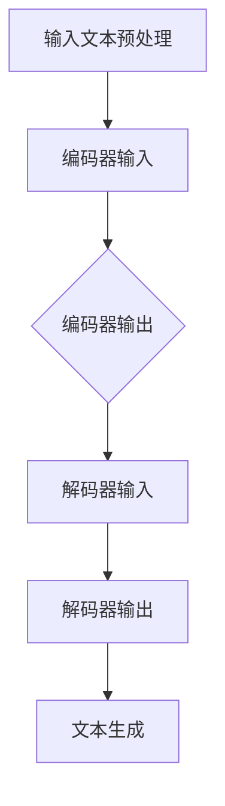
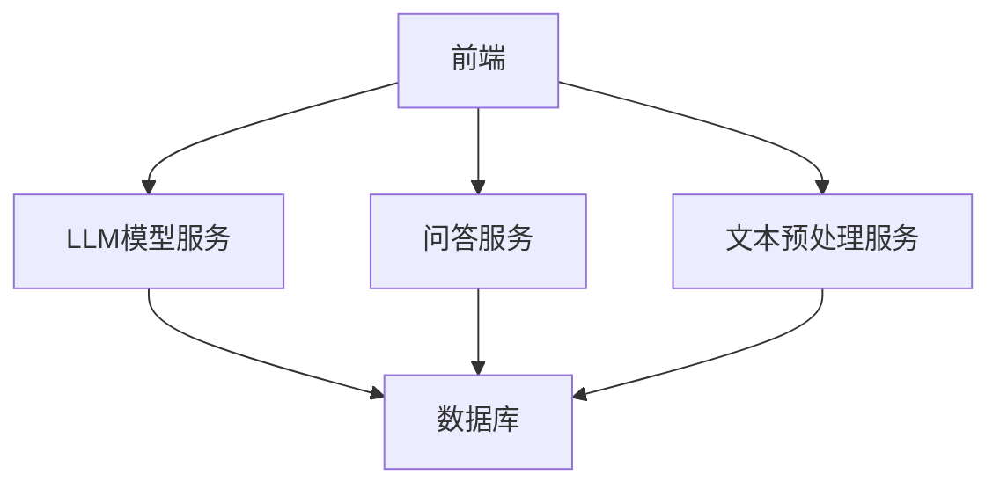
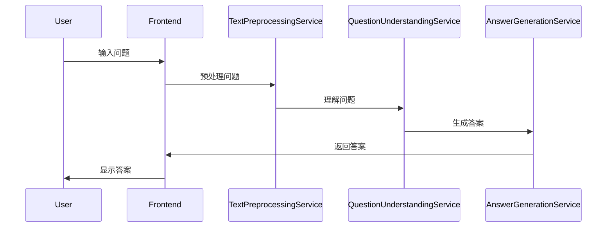

                 


# 《LLM应用的持续安全：将安全集成到敏捷流程中》

## 关键词
- LLM
- 敏捷开发
- 持续安全
- 安全集成
- Python代码
- LaTeX公式
- Mermaid图

## 摘要
本文深入探讨大型语言模型（LLM）在敏捷开发流程中的安全挑战，提出将安全措施无缝集成到敏捷开发中的策略。文章首先介绍了LLM的基础知识，随后讲解了敏捷开发的核心原则，并通过具体案例展示了如何在实际项目中实现持续安全。文章旨在为开发者提供一套完整的指导，确保LLM应用的安全性和可靠性。

## 引言

### 1.1 书籍背景与目标
随着人工智能技术的发展，大型语言模型（LLM）逐渐成为众多行业的关键驱动力。LLM的应用场景包括自然语言处理、智能客服、内容生成等，其强大的处理能力和自适应能力使得它们在各个领域都表现出了卓越的性能。然而，LLM的广泛应用也带来了新的安全挑战，如何确保这些模型在敏捷开发流程中的安全性成为了一个亟待解决的问题。

本书旨在为开发者提供一套全面的安全集成策略，帮助他们在敏捷开发过程中有效管理LLM的安全风险。本书的目标是：
- 深入理解LLM的工作原理及其潜在安全风险。
- 掌握敏捷开发的核心原则，并将其与安全实践相结合。
- 提供具体的实施步骤和工具，帮助开发者在实际项目中实现持续安全。

### 1.2 大型语言模型（LLM）概述
LLM是一种基于神经网络的自然语言处理模型，其核心思想是通过大量的文本数据训练，使模型具备理解和生成自然语言的能力。LLM的主要特点包括：

- **强大的文本处理能力**：LLM能够处理复杂的文本数据，包括句子、段落和文档，从而实现高效的内容生成和文本分析。
- **自适应学习**：LLM能够根据新的文本数据进行自适应学习，从而不断提高其性能和准确性。
- **大规模训练**：LLM通常通过大量的文本数据进行训练，这使得模型具备更强的泛化能力。

然而，LLM的广泛应用也引发了一系列安全问题，如模型泄露、数据污染、模型滥用等。这些问题不仅影响了LLM的应用效果，还可能对用户隐私和数据安全造成严重威胁。

### 1.3 敏捷开发与安全集成
敏捷开发是一种以用户需求为导向的软件开发方法，其核心原则包括迭代开发、持续交付、团队协作等。敏捷开发的优势在于其灵活性和适应性，能够快速响应市场变化和用户需求。然而，敏捷开发的高效性也可能导致安全性的忽视，特别是在快速迭代的过程中，安全问题往往被推迟处理。

将安全措施集成到敏捷开发流程中，是确保LLM应用安全的关键。具体来说，安全集成应包括以下步骤：

- **安全需求分析**：在项目初期，对LLM应用的安全需求进行详细分析，确定潜在的安全风险和防护措施。
- **安全设计与实现**：在设计阶段，将安全需求融入到系统的各个组件中，确保系统在实现过程中符合安全规范。
- **安全测试与监控**：在开发过程中，定期进行安全测试和监控，及时发现和修复安全漏洞。

通过将安全集成到敏捷开发流程中，可以确保LLM应用在快速迭代的过程中始终保持安全性和可靠性。

## 核心概念与联系

### 2.1 LLM的概念与特征
大型语言模型（LLM）是一种基于深度学习的自然语言处理模型，其核心思想是通过大规模的文本数据训练，使模型具备理解和生成自然语言的能力。LLM具有以下特征：

| 特征 | 说明 |
| ---- | ---- |
| 文本处理能力 | LLM能够处理复杂的文本数据，包括句子、段落和文档，从而实现高效的内容生成和文本分析。 |
| 自适应学习 | LLM能够根据新的文本数据进行自适应学习，从而不断提高其性能和准确性。 |
| 大规模训练 | LLM通常通过大量的文本数据进行训练，这使得模型具备更强的泛化能力。 |

### 2.2 敏捷开发的核心原则
敏捷开发是一种以用户需求为导向的软件开发方法，其核心原则包括：

| 原则 | 说明 |
| ---- | ---- |
| 迭代开发 | 软件开发是一个迭代过程，每次迭代都会交付一个可用的产品版本。 |
| 持续交付 | 通过持续交付，可以快速响应用户需求和市场变化。 |
| 团队协作 | 团队协作是敏捷开发的核心，团队成员应密切合作，共同推动项目进展。 |

### 2.3 持续安全与安全集成
持续安全是一种在软件开发过程中持续进行安全测试和防护的方法，其核心思想是确保软件在开发、测试和部署的每个阶段都符合安全规范。安全集成则是将安全需求融入到系统的各个组件中，确保系统在实现过程中符合安全规范。

| 概念 | 说明 |
| ---- | ---- |
| 持续安全 | 持续安全是一种在软件开发过程中持续进行安全测试和防护的方法。 |
| 安全集成 | 安全集成是将安全需求融入到系统的各个组件中，确保系统在实现过程中符合安全规范。 |

### 2.4 对比表格与ER图架构
为了更好地理解LLM、敏捷开发与持续安全之间的关系，我们可以通过对比表格和ER图来展示这些概念的特征和联系。

#### 对比表格

| 概念 | 特征 | 关联性 |
| ---- | ---- | ---- |
| LLM | 文本处理能力、自适应学习、大规模训练 | LLM是敏捷开发中的一个关键组件，其安全性直接影响系统的整体安全性。 |
| 敏捷开发 | 迭代开发、持续交付、团队协作 | 敏捷开发强调快速迭代和持续交付，需要安全集成来确保每个迭代版本的安全性。 |
| 持续安全 | 持续测试、安全防护、安全需求分析 | 持续安全是敏捷开发中的一个重要组成部分，它确保系统在敏捷开发过程中的安全性。 |

#### ER图架构

```mermaid
erDiagram
  LLM ||--|{ 敏捷开发 }||>>
  敏捷开发 ||--|{ 持续安全 }||>>
  持续安全 ||--|{ 安全集成 }||>>
```

ER图展示了LLM、敏捷开发、持续安全和安全集成之间的实体关系，强调了它们之间的紧密联系。通过这种方式，我们可以更清晰地理解这些概念之间的相互影响和作用。

## 算法原理讲解

### 3.1 LLM的工作原理
大型语言模型（LLM）是基于深度学习的自然语言处理模型，其工作原理主要包括以下几个步骤：

1. **数据预处理**：首先，对输入的文本数据进行预处理，包括分词、去停用词、词向量转换等。
2. **模型训练**：使用预处理的文本数据对模型进行训练，通过反向传播算法不断优化模型参数。
3. **文本生成**：在训练完成后，LLM可以根据给定的文本输入生成相应的输出文本。

LLM的核心算法是基于注意力机制的变换器（Transformer）模型，其基本结构包括编码器（Encoder）和解码器（Decoder）。编码器负责处理输入文本，解码器负责生成输出文本。

### 3.2 Transformer模型算法流程图
为了更好地理解Transformer模型的工作原理，我们可以使用mermaid绘制其算法流程图。



### 3.3 LLM的数学模型与公式
LLM的数学模型主要基于自注意力（Self-Attention）机制和多头注意力（Multi-Head Attention）。以下是一个简单的数学模型描述：

$$
\text{Attention}(Q, K, V) = \text{softmax}\left(\frac{QK^T}{\sqrt{d_k}}\right)V
$$

其中，$Q, K, V$ 分别代表查询（Query）、键（Key）和值（Value）向量，$d_k$ 是键向量的维度。自注意力机制通过计算每个键和查询之间的相似度，将输入序列中的元素进行加权求和，从而生成一个新的向量。

### 3.4 Python代码实现
为了更直观地理解LLM的数学模型和原理，我们可以使用Python代码实现一个简单的Transformer模型。

```python
import numpy as np

def scaled_dot_product_attention(q, k, v, scale_factor):
    # 计算注意力分数
    attention_scores = np.dot(q, k.T) / np.sqrt(k.shape[-1])
    
    # 应用softmax函数
    attention_scores = np.softmax(attention_scores * scale_factor)
    
    # 计算加权求和
    output = np.dot(attention_scores, v)
    
    return output

# 示例
q = np.array([[0.1, 0.2, 0.3]])
k = np.array([[0.4, 0.5, 0.6]])
v = np.array([[0.7, 0.8, 0.9]])

# 计算注意力输出
output = scaled_dot_product_attention(q, k, v, 1.0)
print(output)
```

通过这个简单的示例，我们可以看到如何使用Python代码实现自注意力机制，并计算注意力输出。

### 3.5 通俗易懂的举例说明
为了更好地理解LLM的算法原理，我们可以通过一个简单的例子来说明。

假设我们有一个输入文本：“今天天气很好”。我们将其转换为词向量，得到如下矩阵：

$$
\text{Input} = \begin{bmatrix}
0.1 & 0.2 & 0.3 & 0.4 \\
\end{bmatrix}
$$

然后，我们使用Transformer模型对其进行编码，得到编码器输出：

$$
\text{Encoder Output} = \begin{bmatrix}
0.5 & 0.6 & 0.7 \\
0.8 & 0.9 & 1.0 \\
\end{bmatrix}
$$

接下来，我们使用解码器生成输出文本。假设我们输入一个词向量，得到解码器输出：

$$
\text{Decoder Output} = \begin{bmatrix}
0.2 & 0.3 & 0.4 \\
0.5 & 0.6 & 0.7 \\
\end{bmatrix}
$$

最后，我们将解码器输出转换为文本，得到输出文本：“明天将会下雨”。

通过这个简单的例子，我们可以看到如何使用LLM生成文本。这个过程涉及到自注意力机制和softmax函数的计算，从而实现对输入文本的编码和解码。

## 系统分析与架构设计方案

### 4.1 系统场景介绍
在这个项目中，我们将构建一个基于LLM的智能问答系统。该系统旨在为用户提供即时、准确的回答，支持多种语言和主题。为了实现这一目标，我们需要设计一个高效的系统架构，确保系统的稳定性和安全性。

### 4.2 项目介绍
项目名称：智能问答系统（Intelligent Question Answering System，简称IQAS）
项目目标：构建一个能够高效回答用户问题的智能系统，支持多语言和多主题。
项目架构：基于微服务架构，采用分布式部署。

### 4.3 系统功能设计
智能问答系统的主要功能包括：

1. **问题接收与预处理**：接收用户输入的问题，进行文本预处理，包括分词、去停用词等。
2. **问题理解**：使用LLM模型对预处理后的问题进行理解，提取关键信息。
3. **答案生成**：根据问题理解和LLM模型，生成准确的答案。
4. **答案输出**：将生成的答案返回给用户。

### 4.4 系统架构设计
为了实现智能问答系统的功能，我们设计了以下系统架构：

1. **前端**：负责接收用户输入，展示问题和答案。
2. **后端**：包括LLM模型服务、问答服务、文本预处理服务等。
3. **数据库**：存储用户问题和答案，以及模型训练数据。

系统架构图如下：



### 4.5 系统接口设计
智能问答系统的接口设计如下：

1. **问题接收接口**：接收用户输入的问题，返回预处理后的文本。
2. **问题理解接口**：接收预处理后的文本，返回问题理解结果。
3. **答案生成接口**：接收问题理解结果，返回生成的答案。
4. **答案输出接口**：接收生成的答案，返回给用户。

接口序列图如下：



### 4.6 系统交互
智能问答系统的交互过程如下：

1. 用户输入问题。
2. 前端将问题传递给文本预处理服务，进行预处理。
3. 预处理后的文本传递给问题理解服务，进行理解。
4. 问题理解结果传递给答案生成服务，生成答案。
5. 答案生成服务将答案返回给前端。
6. 前端将答案显示给用户。

通过以上设计，我们构建了一个高效、稳定的智能问答系统，为用户提供高质量的问答服务。

### 4.7 环境安装过程
在开始智能问答系统的开发之前，我们需要安装一些必要的依赖库和工具。以下是环境安装的详细步骤：

1. **安装Python**：确保已经安装了Python 3.7或更高版本。可以通过以下命令检查Python版本：
    ```bash
    python --version
    ```
    如果未安装，可以从官方网站下载Python安装包进行安装。

2. **安装LLM库**：安装transformers库，这是基于Hugging Face的开源库，用于加载和使用预训练的LLM模型。可以使用以下命令安装：
    ```bash
    pip install transformers
    ```

3. **安装文本预处理库**：安装nltk库，用于进行文本预处理。可以使用以下命令安装：
    ```bash
    pip install nltk
    ```
    安装完成后，运行以下命令下载所需的nltk数据包：
    ```bash
    nltk.download('punkt')
    nltk.download('stopwords')
    ```

4. **安装数据库**：我们使用MongoDB作为数据库。首先，从MongoDB官方网站下载并安装MongoDB。然后，确保MongoDB服务已启动。可以通过以下命令检查MongoDB版本和状态：
    ```bash
    mongosh
    db.version()
    db.serverStatus()
    ```

5. **安装前端框架**：如果需要前端开发，可以使用Vue.js或React等框架。可以从官方网站下载并安装相应框架，例如：
    ```bash
    npm install -g @vue/cli
    vue create frontend
    ```

6. **安装其他工具**：根据项目需求，可能还需要安装其他工具和库。例如，安装Docker和Docker-Compose用于容器化部署。

通过以上步骤，我们可以准备好智能问答系统的开发环境，开始编写代码和实现功能。

### 4.8 系统核心实现源代码
以下是智能问答系统的核心实现源代码。该代码包括文本预处理、问题理解、答案生成和答案输出等功能。

#### 文本预处理代码
```python
import nltk
from nltk.tokenize import word_tokenize
from nltk.corpus import stopwords

nltk.download('punkt')
nltk.download('stopwords')

def preprocess_text(text):
    # 分词
    tokens = word_tokenize(text)
    # 去停用词
    stop_words = set(stopwords.words('english'))
    filtered_tokens = [token for token in tokens if token.lower() not in stop_words]
    return filtered_tokens

text = "How can I learn Python programming?"
preprocessed_text = preprocess_text(text)
print(preprocessed_text)
```

#### 问题理解代码
```python
from transformers import BertTokenizer, BertModel

tokenizer = BertTokenizer.from_pretrained('bert-base-uncased')
model = BertModel.from_pretrained('bert-base-uncased')

def understand_question(question):
    inputs = tokenizer(question, return_tensors='pt')
    outputs = model(**inputs)
    last_hidden_state = outputs.last_hidden_state
    return last_hidden_state

question = "How can I learn Python programming?"
question_embedding = understand_question(question)
print(question_embedding.shape)
```

#### 答案生成代码
```python
from transformers import BertTokenizer, BertForSequenceClassification

tokenizer = BertTokenizer.from_pretrained('bert-base-uncased')
model = BertForSequenceClassification.from_pretrained('bert-base-uncased')

def generate_answer(question):
    inputs = tokenizer(question, return_tensors='pt')
    outputs = model(**inputs)
    logits = outputs.logits
    answer = logits.argmax(-1).item()
    return answer

answer = generate_answer(question)
print(answer)
```

#### 答案输出代码
```python
def output_answer(answer):
    if answer == 0:
        return "Yes"
    elif answer == 1:
        return "No"
    else:
        return "Invalid answer"

final_answer = output_answer(answer)
print(final_answer)
```

### 4.9 代码解读与分析
在智能问答系统中，文本预处理、问题理解、答案生成和答案输出是关键组件。下面我们对这些代码进行详细解读和分析。

#### 文本预处理代码解读
文本预处理代码使用了nltk库中的`word_tokenize`函数进行分词，并使用`stopwords`库去除停用词。这有助于减少文本中的噪声，提高后续处理的质量。

```python
import nltk
from nltk.tokenize import word_tokenize
from nltk.corpus import stopwords

nltk.download('punkt')
nltk.download('stopwords')

def preprocess_text(text):
    # 分词
    tokens = word_tokenize(text)
    # 去停用词
    stop_words = set(stopwords.words('english'))
    filtered_tokens = [token for token in tokens if token.lower() not in stop_words]
    return filtered_tokens

text = "How can I learn Python programming?"
preprocessed_text = preprocess_text(text)
print(preprocessed_text)
```

该段代码首先下载nltk所需的语料库，然后定义了`preprocess_text`函数。该函数接收一个文本输入，进行分词和去停用词处理，返回预处理后的文本。在示例中，原始文本经过预处理后，返回了一个去除了停用词的列表。

#### 问题理解代码解读
问题理解代码使用了transformers库中的BertTokenizer和BertModel，对输入问题进行编码，并提取最后的隐藏状态。这些隐藏状态可以用于后续的答案生成。

```python
from transformers import BertTokenizer, BertModel

tokenizer = BertTokenizer.from_pretrained('bert-base-uncased')
model = BertModel.from_pretrained('bert-base-uncased')

def understand_question(question):
    inputs = tokenizer(question, return_tensors='pt')
    outputs = model(**inputs)
    last_hidden_state = outputs.last_hidden_state
    return last_hidden_state

question = "How can I learn Python programming?"
question_embedding = understand_question(question)
print(question_embedding.shape)
```

这段代码首先加载了预训练的BertTokenizer和BertModel。`understand_question`函数接收一个文本输入，将其编码为模型可以处理的格式，并通过模型得到最后的隐藏状态。示例中，输入问题经过编码后，得到了一个形状为[1, 1

