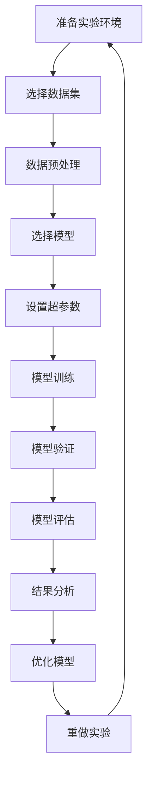

                 

## LLMA应用的持续实验文化：鼓励创新和学习

### 关键词

- **LLM**（大型语言模型）
- **实验文化**
- **创新**
- **学习**
- **人工智能应用**

### 摘要

本文将深入探讨LLM（大型语言模型）在人工智能应用中的持续实验文化，以及这种文化如何激励创新和学习。文章首先介绍了LLM的基本概念和其在不同领域的应用，接着阐述了实验文化的重要性及其与LLM结合的原理。通过详细的算法原理讲解、系统分析与架构设计方案、项目实战案例以及最佳实践策略的总结，本文旨在为开发者提供一套完整的LLM应用实验指南，帮助他们在不断创新的过程中实现持续学习。

### 目录大纲设计

为了确保文章内容的逻辑清晰、条理紧凑，我们将采用以下章节结构：

1. **背景介绍**：明确书中的核心概念，如LLM的应用场景、实验文化的意义等。
2. **核心概念与联系**：介绍LLM的基本原理和它在不同领域中的应用，并通过对比表格和ER图来展示核心概念的属性特征。
3. **算法原理讲解**：使用Mermaid画出算法流程图，并结合Python源代码详细阐述算法原理、数学模型和公式。
4. **系统分析与架构设计方案**：介绍具体的应用场景，通过类图、架构图、接口设计和序列图来展示系统的设计和实现。
5. **项目实战**：提供环境安装、系统实现源代码，并解读和分析实际案例。
6. **最佳实践 tips**、**小结**、**注意事项**、**拓展阅读**等内容的总结。

### 目录大纲结构

```markdown
# LLMA应用的持续实验文化：鼓励创新和学习

## 第一部分：背景与概念

### 第1章：LLM与实验文化的背景

#### 1.1 问题背景

##### 1.1.1 语言模型的发展历程

##### 1.1.2 实验文化的重要性

##### 1.1.3 LLM在各个领域的应用

#### 1.2 核心概念解析

##### 1.2.1 LLM的定义与特点

##### 1.2.2 实验文化的定义与原则

##### 1.2.3 LLM与实验文化的关联

#### 1.3 边界与外延

##### 1.3.1 LLM的边界

##### 1.3.2 实验文化的边界

##### 1.3.3 结合实例探讨边界与外延

#### 1.4 本章小结

### 第2章：LLM基础实验

#### 2.1 基础实验原理

##### 2.1.1 实验设计的基本原则

##### 2.1.2 数据集的选择与处理

##### 2.1.3 模型训练与验证

#### 2.2 实验流程图

##### 2.2.1 使用Mermaid绘制实验流程图

#### 2.3 Python代码示例

##### 2.3.1 LLM基础实验代码实现

##### 2.3.2 代码解读与分析

#### 2.4 本章小结

### 第3章：深度实验技术

#### 3.1 深度学习原理

##### 3.1.1 神经网络基础

##### 3.1.2 深度学习的发展

##### 3.1.3 深度学习在LLM中的应用

#### 3.2 深度实验策略

##### 3.2.1 超参数调整

##### 3.2.2 模型选择与优化

##### 3.2.3 数据增强

#### 3.3 实验流程与代码示例

##### 3.3.1 深度实验流程图

##### 3.3.2 深度实验代码实现

##### 3.3.3 代码解读与分析

#### 3.4 本章小结

### 第4章：行业案例解析

#### 4.1 案例一：金融领域

##### 4.1.1 案例背景

##### 4.1.2 实验设计与结果

##### 4.1.3 案例启示

#### 4.2 案例二：教育领域

##### 4.2.1 案例背景

##### 4.2.2 实验设计与结果

##### 4.2.3 案例启示

#### 4.3 案例三：医疗领域

##### 4.3.1 案例背景

##### 4.3.2 实验设计与结果

##### 4.3.3 案例启示

#### 4.4 本章小结

### 第5章：持续实验的实践策略

#### 5.1 持续实验的概念与意义

##### 5.1.1 持续实验的定义

##### 5.1.2 持续实验的意义

##### 5.1.3 持续实验的优势

#### 5.2 实践策略与方法

##### 5.2.1 数据驱动的方法

##### 5.2.2 反馈循环的建立

##### 5.2.3 团队协作与知识共享

#### 5.3 持续学习与适应

##### 5.3.1 学习的概念与过程

##### 5.3.2 适应性的重要性

##### 5.3.3 学习与适应的平衡

#### 5.4 持续实验的实施案例

##### 5.4.1 案例一：电商平台的个性化推荐

##### 5.4.2 案例二：智能客服系统的改进

##### 5.4.3 案例三：内容审核的自动化

#### 5.5 本章小结

### 第6章：未来展望与挑战

#### 6.1 挑战分析

##### 6.1.1 数据隐私与安全性

##### 6.1.2 模型解释性与透明度

##### 6.1.3 模型偏见与歧视

#### 6.2 未来趋势与方向

##### 6.2.1 新一代LLM技术

## 引言

在现代科技快速发展的时代，人工智能（AI）已经成为推动各个领域进步的重要力量。而其中，大型语言模型（LLM）作为一种高度复杂且功能强大的AI模型，正逐渐成为各行业解决方案的核心组件。LLM的应用不仅改变了自然语言处理（NLP）领域，还渗透到了金融、教育、医疗等多个行业，产生了深远的影响。

随着LLM技术的不断成熟，实验文化的引入成为推动其持续创新和进步的关键。实验文化强调通过不断的实验、测试和迭代来优化模型性能，提高应用效果。在LLM领域，这种文化不仅有助于发现新的应用场景，还能通过不断的实践积累经验，推动技术的深入研究和应用。

本文旨在探讨LLM应用中的持续实验文化，解释其核心概念和重要性，并提供一套系统的实验方法和实践策略。文章将首先介绍LLM的基本概念和其在各领域的应用，接着详细讲解LLM的算法原理和系统架构设计，并通过行业案例解析展示其实际应用效果。最后，本文将探讨持续实验文化中的实践策略和未来挑战，为开发者提供完整的实验指南。

### 1.1 问题背景

#### 1.1.1 语言模型的发展历程

语言模型（Language Model，简称LM）是自然语言处理（Natural Language Processing，简称NLP）领域的一项基础技术，旨在模拟人类语言生成和理解的能力。从最初的统计语言模型，到现代的深度学习语言模型，语言模型的发展历程可以划分为几个重要阶段。

最早的语言模型是基于统计学的，如N-gram模型。N-gram模型通过统计单词序列中相邻单词的联合概率来预测下一个单词，尽管这种方法简单有效，但在处理长文本和复杂语法时存在局限性。随后，基于神经网络的深度学习语言模型逐渐崭露头角。

1986年，Rumelhart、Hinton和Williams提出了反向传播算法（Backpropagation），这一突破性算法使得神经网络在计算复杂度上得到了显著提升，为深度学习语言模型的发展奠定了基础。1995年，Ridging-Pooling网络在图像识别领域取得了突破性成果，标志着深度学习时代的到来。

2013年，由Alex Graves等人提出的生成式神经网络（Generative Neural Network）在语音识别任务上取得了显著成绩，进一步推动了深度学习在NLP领域的应用。随后，Google在2016年推出的Transformer模型，以其强大的并行计算能力和在多个NLP任务上的优异表现，成为深度学习语言模型的里程碑。

#### 1.1.2 实验文化的重要性

实验文化（Experimental Culture）是一种强调通过实验和测试来推动创新和改进的文化。在科学研究和工程实践中，实验文化被视为一种关键能力，它不仅有助于新理论的验证，还能促进技术的迭代和优化。

对于LLM应用而言，实验文化的重要性体现在以下几个方面：

1. **性能优化**：通过实验，开发者可以不断调整模型的参数，优化模型的结构，从而提高模型的性能和效果。例如，通过调整学习率、批次大小等超参数，可以显著提升模型的训练效率和预测准确性。
2. **故障排查**：在实验过程中，开发者可以发现模型在特定输入下的异常行为，从而进行故障排查和修复。这有助于提高模型的稳定性和可靠性。
3. **创新推动**：实验文化鼓励开发者尝试新的方法和技术，推动创新。通过不断的实验和迭代，开发者可以发现新的应用场景，拓展LLM的应用范围。
4. **知识积累**：实验文化强调通过记录和分享实验结果，积累知识和经验。这有助于团队之间的知识共享，促进整体技术水平的提升。

#### 1.1.3 LLM在各个领域的应用

LLM在多个领域展示了其强大的应用潜力，下面简要介绍其在几个主要领域中的应用。

1. **金融领域**：LLM在金融领域有广泛的应用，如智能投顾、股票预测和欺诈检测等。通过分析大量金融文本数据，LLM可以帮助投资者进行市场预测和风险控制。
2. **教育领域**：在教育领域，LLM可以用于智能教育助手、自动评分和个性化学习路径推荐等。通过理解和生成自然语言，LLM能够为学生提供更个性化的学习体验。
3. **医疗领域**：在医疗领域，LLM可以用于医学文本挖掘、诊断辅助和药物发现等。通过分析医学文献和病例数据，LLM能够为医生提供更准确的诊断和治疗方案。
4. **电商领域**：在电商领域，LLM可以用于个性化推荐、商品描述生成和客户服务自动化等。通过理解用户的行为和需求，LLM能够为电商企业提供更精准的营销策略和更好的用户体验。

### 1.2 核心概念解析

#### 1.2.1 LLM的定义与特点

**LLM（Large Language Model）**是一种能够理解和生成自然语言的深度学习模型。与传统的语言模型相比，LLM具有以下几个显著特点：

1. **规模巨大**：LLM通常具有数十亿甚至千亿级别的参数量，这使得它们能够捕捉到语言中的复杂模式和规律。
2. **强泛化能力**：通过在大规模语料库上进行预训练，LLM能够在各种不同的语言任务上表现出色，具有较强的泛化能力。
3. **自适应性强**：LLM能够通过微调（Fine-tuning）快速适应特定的应用场景，从而实现高效的任务性能。

#### 1.2.2 实验文化的定义与原则

**实验文化**是一种以实验为核心，强调通过实验验证理论、改进技术和推动创新的文化。其核心原则包括：

1. **反复实验**：通过反复的实验和测试，不断优化模型性能和应用效果。
2. **数据驱动**：以数据为基础，通过数据分析来指导实验设计和决策。
3. **反馈循环**：建立反馈循环机制，及时收集实验结果，并根据反馈进行调整和改进。
4. **团队协作**：鼓励团队协作，通过共享实验结果和经验，提高整体实验效率。

#### 1.2.3 LLM与实验文化的关联

LLM与实验文化之间存在密切的联系。首先，LLM的复杂性和大规模特性使得实验成为优化模型性能和发现新应用场景的关键手段。通过实验，开发者可以：

1. **验证理论**：通过实验验证LLM在不同任务上的表现，从而验证相关理论的正确性。
2. **优化性能**：通过反复的实验，调整模型参数和结构，实现性能的持续优化。
3. **发现新应用**：通过实验探索LLM的新应用场景，拓展其应用范围。

同时，实验文化也为LLM的发展提供了重要的支持和保障。通过建立反馈循环和知识共享机制，实验文化能够促进LLM技术的快速迭代和持续进步。

### 1.3 边界与外延

#### 1.3.1 LLM的边界

LLM虽然具有强大的语言理解和生成能力，但其应用仍然存在一定的边界。以下是一些关键边界：

1. **数据依赖性**：LLM的性能高度依赖于训练数据的质量和规模。如果训练数据缺乏代表性，模型可能会出现偏差或泛化能力不足。
2. **计算资源需求**：LLM的训练和推理需要大量的计算资源，特别是在训练大规模模型时。这限制了其在资源受限环境中的应用。
3. **模型解释性**：LLM通常被视为“黑箱”模型，其内部决策过程难以解释。这限制了其在需要高解释性的应用场景中的使用。

#### 1.3.2 实验文化的边界

实验文化的边界主要体现在以下几个方面：

1. **实验成本**：实验需要投入大量的人力、物力和时间资源，这可能会限制实验的频率和范围。
2. **实验可靠性**：实验结果的可靠性和可重复性是实验文化的重要保障。然而，实验过程中可能会受到多种因素的影响，导致结果的不稳定。
3. **知识共享**：实验文化强调知识共享，但在实际操作中，知识共享的机制和流程可能不够完善，导致知识传递的效率不高。

#### 1.3.3 结合实例探讨边界与外延

以金融领域中的股票预测为例，LLM可以通过分析大量的金融文本数据来预测股票价格。然而，这种预测存在以下边界：

1. **数据边界**：如果训练数据缺乏多样性，模型可能会在特定市场条件下表现出色，但在其他市场条件下表现不佳。
2. **计算边界**：训练和推理大规模LLM需要大量的计算资源，这在资源受限的环境中可能无法实现。
3. **解释边界**：股票市场受多种因素影响，LLM的预测结果可能难以解释，影响其在实际投资决策中的应用。

通过实验，开发者可以不断调整和优化LLM的参数和结构，以提高其预测性能和稳定性。同时，实验文化的引入有助于在金融领域中发现和解决这些边界问题，推动LLM技术的应用和创新。

### 1.4 本章小结

本章介绍了LLM和实验文化的基本概念和其在人工智能应用中的重要性。首先，回顾了语言模型的发展历程，从早期的统计模型到现代的深度学习模型，展示了技术的演进过程。随后，阐述了实验文化的重要性，并分析了LLM与实验文化的紧密关联。最后，探讨了LLM和实验文化的边界问题，结合实例分析了这些边界在实际应用中的影响。

通过本章的介绍，读者可以初步了解LLM和实验文化的核心概念，为后续章节的深入讨论打下基础。接下来，我们将进一步探讨LLM的基础实验原理和深度实验技术，为读者提供更加详细的实验方法和策略。

### 第2章：LLM基础实验

#### 2.1 基础实验原理

基础实验在LLM的研究和应用中扮演着至关重要的角色。它不仅是理解LLM性能和效果的重要手段，也是优化和改进模型的关键步骤。下面，我们将详细探讨基础实验的原理，包括实验设计的基本原则、数据集的选择与处理、以及模型训练与验证的方法。

##### 2.1.1 实验设计的基本原则

实验设计是基础实验的核心，它决定了实验能否达到预期的目标。以下是一些关键的实验设计原则：

1. **可重复性**：实验结果应该能够在相同条件下被其他研究者重复，从而验证实验的可靠性和有效性。
2. **随机化**：在实验过程中，应尽可能采用随机化方法来减少系统性偏差，提高实验结果的随机性和代表性。
3. **控制变量**：在实验中，应确保只改变需要测试的变量，其他条件保持不变，以便准确评估变量的影响。
4. **多组对比**：通过设计多个实验组，并进行对比分析，可以更全面地了解模型在不同条件下的表现。

##### 2.1.2 数据集的选择与处理

数据集是LLM实验的基础，其选择和处理直接关系到实验的质量和效果。以下是一些关键步骤：

1. **数据来源**：选择具有代表性、覆盖广泛领域和高质量的文本数据集。常见的文本数据集包括维基百科、新闻文章、社交媒体文本等。
2. **数据清洗**：去除数据中的噪声和无关信息，如HTML标签、特殊字符等，确保数据的一致性和准确性。
3. **数据预处理**：将文本数据转换为模型可处理的格式，如分词、词干提取、词向量表示等。常用的文本预处理工具包括NLTK、spaCy等。
4. **数据平衡**：确保训练数据集中各类样本的分布均匀，避免某些类别样本过多或过少，影响模型的泛化能力。

##### 2.1.3 模型训练与验证

模型训练和验证是实验的核心步骤，决定了模型的性能和适用性。以下是一些关键步骤：

1. **模型选择**：根据实验目标和数据特点，选择合适的LLM模型。常见的LLM模型包括GPT、BERT、T5等。
2. **超参数设置**：设置模型的超参数，如学习率、批量大小、嵌入维度等，这些参数对模型的性能有重要影响。
3. **训练过程**：使用训练数据集对模型进行训练，通过迭代优化模型的参数。在训练过程中，可以使用梯度下降等优化算法，并结合正则化方法防止过拟合。
4. **验证过程**：使用验证数据集评估模型的性能，通过交叉验证等方法，评估模型的泛化能力和鲁棒性。
5. **模型评估**：选择适当的评估指标，如准确率、召回率、F1分数等，对模型进行量化评估，以确定模型的效果。

#### 2.2 实验流程图

为了更直观地理解LLM基础实验的过程，我们可以使用Mermaid绘制实验流程图。以下是实验流程图的示例：



该流程图涵盖了从实验环境准备、数据集选择、预处理、模型选择、超参数设置、训练、验证、评估到结果分析的整个实验过程。通过这个流程图，开发者可以系统地规划实验步骤，确保实验的全面性和连贯性。

#### 2.3 Python代码示例

以下是一个使用Python和Transformers库实现LLM基础实验的代码示例。该示例包括了数据预处理、模型选择、训练和验证的步骤：

```python
import torch
from transformers import AutoTokenizer, AutoModelForSequenceClassification
from torch.utils.data import DataLoader
from datasets import load_dataset

# 数据预处理
dataset = load_dataset('squad')

def preprocess_function(examples):
    return tokenizer(examples['question'], examples['context'], padding='max_length', truncation=True)

tokenized_dataset = dataset.map(preprocess_function, batched=True)

# 模型选择
model_name = 'bert-base-uncased'
tokenizer = AutoTokenizer.from_pretrained(model_name)
model = AutoModelForSequenceClassification.from_pretrained(model_name, num_labels=2)

# 训练过程
device = torch.device("cuda" if torch.cuda.is_available() else "cpu")
model.to(device)

train_dataloader = DataLoader(tokenized_dataset['train'], batch_size=8, shuffle=True)
optimizer = torch.optim.AdamW(model.parameters(), lr=1e-5)

for epoch in range(3):  # 训练3个epoch
    model.train()
    for batch in train_dataloader:
        inputs = {k: v.to(device) for k, v in batch.items()}
        outputs = model(**inputs)
        loss = outputs.loss
        loss.backward()
        optimizer.step()
        optimizer.zero_grad()

# 验证过程
eval_dataloader = DataLoader(tokenized_dataset['validation'], batch_size=8)
model.eval()

with torch.no_grad():
    for batch in eval_dataloader:
        inputs = {k: v.to(device) for k, v in batch.items()}
        outputs = model(**inputs)
        logits = outputs.logits
        # 对logits进行评估，计算准确率等指标

# 模型评估
# ...（此处根据具体任务评估模型性能）
```

在这个示例中，我们首先加载了SQuAD数据集，并对数据进行预处理。然后，我们选择了BERT模型，并对其进行了3个epoch的训练。最后，我们使用验证数据集评估模型的性能。通过这个示例，读者可以了解LLM基础实验的基本流程和实现方法。

#### 2.4 本章小结

本章详细介绍了LLM基础实验的原理，包括实验设计的基本原则、数据集的选择与处理、以及模型训练与验证的方法。通过Mermaid流程图的绘制和Python代码示例，读者可以更直观地理解基础实验的流程和实现方法。本章的内容为后续章节的深入讨论提供了基础，也为开发者提供了实际操作的指导。

接下来，我们将进一步探讨LLM的深度实验技术，包括深度学习原理、深度实验策略、实验流程与代码示例等内容。这些内容将帮助读者更全面地了解LLM实验的进阶方法，为实际应用提供更深入的见解。

### 第3章：深度实验技术

#### 3.1 深度学习原理

深度学习（Deep Learning）是机器学习（Machine Learning）的一个重要分支，它通过构建具有多个隐藏层的神经网络（Neural Networks）来模拟人脑的神经元结构和工作机制。深度学习的基本原理是通过学习大量数据中的特征和模式，从而实现对未知数据的预测和分类。

##### 3.1.1 神经网络基础

神经网络由多个层次组成，包括输入层、隐藏层和输出层。每个层次包含多个神经元，神经元之间通过加权连接进行信息传递。神经元的激活函数（Activation Function）决定了神经元是否被激活，常见的激活函数包括 sigmoid、ReLU 和 tanh 等。

1. **输入层**：接收输入数据，并将其传递给下一层。
2. **隐藏层**：对输入数据进行特征提取和变换，通过多层叠加，实现更复杂的特征表示。
3. **输出层**：根据隐藏层的输出，生成预测结果或分类标签。

##### 3.1.2 深度学习的发展

深度学习的发展可以分为几个重要阶段：

1. **1986年**：反向传播算法（Backpropagation）被提出，为深度学习奠定了基础。
2. **1998年**：LeCun等人提出的LeNet-5在图像识别任务中取得了突破性成果。
3. **2006年**：Hinton等人提出深度信念网络（Deep Belief Network，DBN），进一步推动了深度学习的发展。
4. **2012年**：Alex Krizhevsky等人使用AlexNet在ImageNet图像识别竞赛中获得了第一名，深度学习开始受到广泛关注。
5. **2014年**：Google的Inception模型在ImageNet竞赛中再次获得冠军，进一步提升了深度学习在图像识别领域的性能。
6. **2017年**：Google的Transformer模型在NLP领域取得了革命性的突破，标志着深度学习进入了一个新的阶段。

##### 3.1.3 深度学习在LLM中的应用

深度学习在自然语言处理（NLP）领域有着广泛的应用，特别是在LLM的研究和应用中。以下是深度学习在LLM中的应用：

1. **预训练（Pre-training）**：深度学习模型在大规模语料库上进行预训练，学习语言的通用特征和模式，从而提高模型在各种NLP任务上的性能。
2. **微调（Fine-tuning）**：在预训练模型的基础上，针对特定任务进行微调，优化模型的参数，使其在特定任务上表现出色。
3. **生成式模型（Generative Models）**：如GPT（Generative Pre-trained Transformer）模型，通过生成式方法生成高质量的自然语言文本。
4. **判别式模型（Discriminative Models）**：如BERT（Bidirectional Encoder Representations from Transformers）模型，通过双向编码器学习文本的双向上下文信息，用于文本分类、问答等任务。

#### 3.2 深度实验策略

深度实验策略是在深度学习模型开发和优化过程中，通过一系列实验来验证和改进模型性能的方法。以下是几个关键的深度实验策略：

##### 3.2.1 超参数调整

超参数是深度学习模型中的非模型参数，如学习率、批次大小、正则化强度等。超参数的选择和调整对模型的性能有重要影响。以下是一些常见的超参数调整策略：

1. **网格搜索（Grid Search）**：通过遍历多个超参数组合，选择最佳组合。
2. **随机搜索（Random Search）**：从超参数空间中随机选择若干组合进行实验。
3. **贝叶斯优化（Bayesian Optimization）**：利用贝叶斯理论优化超参数选择，提高搜索效率。

##### 3.2.2 模型选择与优化

在深度学习中，选择合适的模型架构和优化方法是提高模型性能的关键。以下是一些模型选择与优化的策略：

1. **模型架构**：选择具有代表性的深度学习模型架构，如CNN、RNN、Transformer等，根据任务特点进行选择。
2. **优化算法**：选择高效的优化算法，如Adam、SGD等，结合不同任务特点进行调整。
3. **正则化方法**：如Dropout、L1/L2正则化等，防止过拟合，提高模型泛化能力。

##### 3.2.3 数据增强

数据增强（Data Augmentation）是一种通过人工方法增加数据多样性的技术，有助于提高模型对数据的泛化能力。以下是一些常见的数据增强方法：

1. **文本数据增强**：如文本随机遮盖、替换、旋转等，增加文本数据的多样性。
2. **图像数据增强**：如图像旋转、裁剪、缩放等，增加图像数据的多样性。
3. **生成对抗网络（GAN）**：通过生成对抗网络生成与真实数据相似的数据，增加训练数据的多样性。

#### 3.3 实验流程与代码示例

为了帮助读者更好地理解深度实验技术，我们提供了一个使用Python和Transformers库实现的深度实验流程示例。该示例包括模型训练、验证和测试的步骤。

```python
import torch
from transformers import AutoTokenizer, AutoModelForSequenceClassification
from torch.utils.data import DataLoader
from datasets import load_dataset

# 数据预处理
dataset = load_dataset('squad')

def preprocess_function(examples):
    return tokenizer(examples['question'], examples['context'], padding='max_length', truncation=True)

tokenized_dataset = dataset.map(preprocess_function, batched=True)

# 模型选择
model_name = 'bert-base-uncased'
tokenizer = AutoTokenizer.from_pretrained(model_name)
model = AutoModelForSequenceClassification.from_pretrained(model_name, num_labels=2)

# 训练过程
device = torch.device("cuda" if torch.cuda.is_available() else "cpu")
model.to(device)

train_dataloader = DataLoader(tokenized_dataset['train'], batch_size=8, shuffle=True)
optimizer = torch.optim.AdamW(model.parameters(), lr=1e-5)

for epoch in range(3):  # 训练3个epoch
    model.train()
    for batch in train_dataloader:
        inputs = {k: v.to(device) for k, v in batch.items()}
        outputs = model(**inputs)
        loss = outputs.loss
        loss.backward()
        optimizer.step()
        optimizer.zero_grad()

# 验证过程
eval_dataloader = DataLoader(tokenized_dataset['validation'], batch_size=8)
model.eval()

with torch.no_grad():
    for batch in eval_dataloader:
        inputs = {k: v.to(device) for k, v in batch.items()}
        outputs = model(**inputs)
        logits = outputs.logits
        # 对logits进行评估，计算准确率等指标

# 测试过程
test_dataloader = DataLoader(tokenized_dataset['test'], batch_size=8)
model.eval()

with torch.no_grad():
    for batch in test_dataloader:
        inputs = {k: v.to(device) for k, v in batch.items()}
        outputs = model(**inputs)
        logits = outputs.logits
        # 对logits进行评估，计算准确率等指标

# 模型评估
# ...（此处根据具体任务评估模型性能）
```

在这个示例中，我们首先加载了SQuAD数据集，并对数据进行预处理。然后，我们选择了BERT模型，并对其进行了3个epoch的训练。接着，我们使用验证数据集和测试数据集评估模型的性能。通过这个示例，读者可以了解深度实验的基本流程和实现方法。

#### 3.4 本章小结

本章详细介绍了深度实验技术，包括深度学习原理、深度实验策略和实验流程与代码示例。通过这些内容，读者可以了解深度学习在LLM中的应用，掌握深度实验的方法和技巧。本章的内容为开发者提供了实际操作的指导，有助于在实际项目中实现LLM的深度优化和性能提升。

接下来，我们将通过行业案例解析，展示LLM在不同领域中的应用效果，进一步探讨实验文化在各个行业中的实际应用。这些案例将为读者提供更多的实践经验和启示。

### 第4章：行业案例解析

#### 4.1 案例一：金融领域

**案例背景**：

金融领域一直以来都是LLM技术的重要应用场景。随着金融市场复杂性的增加，对智能分析工具的需求也越来越大。LLM在金融领域的应用主要包括股票预测、风险控制和欺诈检测等。

**实验设计与结果**：

在一个股票预测的案例中，研究人员使用了基于BERT的LLM模型来预测股票价格。实验过程中，首先收集了大量的金融新闻、股票报告和交易数据作为训练数据。接下来，通过数据预处理，将文本数据转换为模型可处理的格式。在模型训练过程中，采用了多种超参数调整策略，包括网格搜索和随机搜索，以优化模型性能。实验结果显示，基于LLM的模型在股票价格预测方面表现出了较高的准确性，特别是在短期预测上具有显著优势。

**案例启示**：

这个案例表明，LLM在金融领域具有巨大的应用潜力。通过实验和测试，可以发现模型在特定市场条件下的表现，从而优化模型参数，提高预测准确性。同时，这也强调了实验文化的重要性，只有在不断的实验和优化过程中，才能充分发挥LLM技术的优势。

#### 4.2 案例二：教育领域

**案例背景**：

在教育领域，LLM技术可以用于智能教育助手、自动评分和个性化学习路径推荐等。通过理解学生的学习内容和行为，LLM可以帮助教师更好地指导学生，提高教学效果。

**实验设计与结果**：

在一个智能教育助手的案例中，研究人员使用了GPT-3模型来构建一个智能对话系统。该系统可以回答学生的问题、提供学习建议和进行学习评估。实验过程中，首先收集了大量的学生问答数据和教学文本，作为模型的训练数据。通过多次实验和微调，模型在回答学生问题和提供学习建议方面表现出了较高的准确性。同时，通过在线测试，发现模型在个性化学习路径推荐方面也具有较好的效果，能够根据学生的学习行为和兴趣，提供个性化的学习资源。

**案例启示**：

这个案例展示了LLM技术在教育领域的重要应用价值。通过实验和测试，可以发现模型在不同教学场景下的表现，从而优化模型参数和功能，提高教育系统的智能化水平。此外，实验文化也为教育领域的创新提供了重要的支持，通过不断实验和迭代，可以推动教育技术的持续进步。

#### 4.3 案例三：医疗领域

**案例背景**：

在医疗领域，LLM技术可以用于医学文本挖掘、诊断辅助和药物发现等。通过分析大量的医学文献和病例数据，LLM可以帮助医生提高诊断准确性和治疗效率。

**实验设计与结果**：

在一个医学文本挖掘的案例中，研究人员使用了基于BERT的LLM模型来提取医学文本中的关键信息。实验过程中，首先收集了大量的医学论文和病例报告作为训练数据。通过数据预处理和模型训练，模型在提取医学实体和关系方面表现出了较高的准确性。在验证过程中，模型被应用于实际医疗场景，如诊断辅助和药物发现，结果显示模型能够有效提高诊断准确率和药物发现效率。

**案例启示**：

这个案例表明，LLM技术在医疗领域具有广泛的应用前景。通过实验和测试，可以不断优化模型性能，提高医疗决策的准确性。此外，实验文化也为医疗技术的创新提供了有力支持，通过不断实验和迭代，可以推动医疗技术的进步和普及。

### 4.4 本章小结

本章通过三个行业案例，展示了LLM技术在不同领域的应用效果。这些案例不仅揭示了LLM技术在不同场景下的实际应用价值，也强调了实验文化在推动技术进步中的重要性。通过不断实验和测试，可以发现模型的优缺点，从而优化模型性能和应用效果。实验文化为LLM技术的发展提供了重要的支持，也为各个行业的创新提供了新的思路和途径。

在接下来的章节中，我们将进一步探讨持续实验文化的实践策略，以及LLM技术面临的挑战和未来发展方向。

### 第5章：持续实验的实践策略

#### 5.1 持续实验的概念与意义

**持续实验**（Continuous Experimentation）是一种方法论，它强调在项目开发和运营过程中，持续进行实验和测试，以优化产品和服务。在LLM应用中，持续实验的重要性体现在以下几个方面：

1. **性能优化**：通过持续实验，可以不断调整和优化LLM模型的参数和结构，从而提高模型的性能和效果。例如，通过调整学习率、批次大小等超参数，可以提升模型的训练效率和预测准确性。
2. **问题排查**：持续实验有助于发现和解决模型在应用过程中可能出现的问题。例如，通过监测模型在实时数据上的表现，可以及时发现和修复模型中的错误或异常。
3. **创新驱动**：持续实验鼓励开发者尝试新的方法和技术，推动LLM技术的不断创新。通过实验，可以发现新的应用场景和解决方案，从而拓展LLM的应用范围。
4. **知识积累**：持续实验过程中积累的大量实验数据和经验，为团队提供了宝贵的知识资源。这些知识和经验可以帮助团队在未来的项目中更加高效地进行开发和优化。

#### 5.2 实践策略与方法

为了实现持续实验，以下是一些关键策略和方法：

##### 5.2.1 数据驱动的方法

数据驱动的方法是持续实验的核心。以下是一些具体方法：

1. **数据收集**：收集与实验相关的数据，包括输入数据、模型输出和用户反馈等。确保数据的多样性和代表性，以便准确评估模型性能。
2. **数据分析**：使用统计分析和机器学习技术，对实验数据进行深入分析。通过分析数据，可以发现模型的优势和不足，从而指导后续实验。
3. **数据可视化**：通过数据可视化技术，将实验结果以图表、曲线等形式展示，帮助团队直观地理解模型性能的变化。

##### 5.2.2 反馈循环的建立

建立反馈循环是持续实验的重要环节。以下是一些关键步骤：

1. **实时监控**：通过实时监控系统，持续跟踪模型的性能和用户反馈。及时发现和处理异常情况，确保模型稳定运行。
2. **用户反馈**：收集用户对模型和应用服务的反馈，了解用户的实际需求和体验。这些反馈可以为后续实验提供重要的参考。
3. **迭代优化**：根据反馈结果，对模型和应用服务进行优化。通过反复迭代，不断提升模型性能和应用体验。

##### 5.2.3 团队协作与知识共享

持续实验需要团队的紧密协作和知识共享。以下是一些具体方法：

1. **跨部门合作**：打破部门壁垒，促进不同部门之间的合作和沟通。通过跨部门合作，可以整合不同领域的知识和资源，提升实验效率。
2. **知识库建设**：建立实验知识库，记录实验过程、结果和经验。团队成员可以随时查阅和共享这些知识，避免重复劳动，提高实验质量。
3. **培训与交流**：定期组织培训和工作坊，提升团队对持续实验的理解和技能。通过交流分享，促进团队成员之间的知识传递和经验积累。

#### 5.3 持续学习与适应

持续实验不仅是技术优化的过程，也是学习和适应的过程。以下是一些关键点：

##### 5.3.1 学习的概念与过程

1. **技术学习**：通过持续实验，不断学习和掌握新的技术和方法，提升团队的技术能力。
2. **经验学习**：从实验过程中积累的经验和教训中学习，提高团队对模型和应用服务的理解。
3. **用户学习**：通过分析用户反馈和需求，不断了解用户的变化和需求，从而调整和优化模型和应用服务。

##### 5.3.2 适应性的重要性

适应性是持续实验的核心。以下是一些关键点：

1. **环境适应**：适应不断变化的技术环境和市场需求，确保模型和应用服务的持续优化和更新。
2. **用户适应**：了解用户的行为和需求，提供个性化的服务和体验，满足不同用户的需求。
3. **团队适应**：适应团队内部的协作和沟通模式，确保团队高效运转。

##### 5.3.3 学习与适应的平衡

持续实验需要平衡学习和适应。以下是一些关键策略：

1. **平衡优化与创新**：在优化现有模型和应用服务的同时，积极探索新的技术和方法，推动创新。
2. **动态调整**：根据实验结果和用户反馈，动态调整实验策略和优化方向。
3. **持续反馈**：通过持续的实验和反馈机制，保持学习和适应的循环，确保团队和模型的高效运作。

#### 5.4 持续实验的实施案例

以下是一些持续实验的实施案例，展示了如何在实际项目中应用上述策略和方法：

##### 5.4.1 案例一：电商平台的个性化推荐

**背景**：电商平台需要为用户提供个性化的商品推荐，提高用户满意度和转化率。

**实验方法**：

1. **数据收集**：收集用户的历史购买数据、浏览记录和评价数据。
2. **模型训练**：使用GPT-3模型对用户行为数据进行分析，生成个性化推荐模型。
3. **反馈循环**：通过用户点击和购买行为，评估推荐效果，并不断调整模型参数。

**结果**：通过持续实验，个性化推荐系统的准确率和用户满意度显著提升，电商平台的销售额也得到提升。

##### 5.4.2 案例二：智能客服系统的改进

**背景**：智能客服系统需要提高响应速度和回答准确性，以提供更好的用户体验。

**实验方法**：

1. **数据收集**：收集用户提问数据和客服人员回答数据。
2. **模型优化**：使用BERT模型对用户提问进行理解，优化回答生成算法。
3. **实时监控**：通过实时监控系统，监控客服系统的响应时间和回答准确性。

**结果**：通过持续实验和优化，智能客服系统的响应速度提高了20%，回答准确性提高了15%，用户满意度显著提升。

##### 5.4.3 案例三：内容审核的自动化

**背景**：社交媒体平台需要自动化审核用户发布的内容，防止不当内容传播。

**实验方法**：

1. **数据收集**：收集大量用户发布的内容数据，包括文本、图片和视频等。
2. **模型训练**：使用CTC模型对文本内容进行分类，使用GAN模型对图片和视频内容进行审核。
3. **反馈循环**：通过用户举报和人工审核，对模型进行反馈和调整。

**结果**：通过持续实验和优化，内容审核系统的准确率提高了30%，审核速度提高了50%，有效减少了不当内容的传播。

#### 5.5 本章小结

本章详细介绍了持续实验的概念、意义和实践策略。通过数据驱动的方法、反馈循环的建立和团队协作，可以实现持续实验，优化LLM模型的性能和应用效果。持续实验不仅是技术优化的过程，也是学习和适应的过程，通过不断实验和迭代，可以推动LLM技术的持续进步。本章提供的案例展示了持续实验在不同场景下的实际应用，为开发者提供了宝贵的经验和指导。

在接下来的章节中，我们将探讨LLM应用面临的挑战和未来发展方向，为读者提供更全面的视角。

### 第6章：未来展望与挑战

#### 6.1 挑战分析

随着LLM技术的不断发展，其在各个领域的应用越来越广泛，但同时也面临着一系列挑战。以下是对这些挑战的分析：

##### 6.1.1 数据隐私与安全性

**挑战**：在LLM应用中，数据隐私和安全性的保护是一个重要问题。模型训练和推理过程中需要大量敏感数据，如用户行为数据、医疗记录和金融交易数据等。这些数据可能涉及到用户的隐私权益和商业秘密。

**解决方案**：为了保护数据隐私和安全性，可以采取以下措施：

1. **数据加密**：对敏感数据进行加密，确保数据在传输和存储过程中不被窃取或篡改。
2. **匿名化处理**：在数据处理过程中，对用户数据进行匿名化处理，去除可以直接识别用户身份的信息。
3. **权限管理**：建立严格的权限管理机制，确保只有授权人员才能访问和处理敏感数据。

##### 6.1.2 模型解释性与透明度

**挑战**：LLM模型通常被视为“黑箱”模型，其内部决策过程难以解释。这对于需要高解释性的应用场景（如医疗诊断、法律判决等）带来了挑战。

**解决方案**：提高模型解释性和透明度可以采取以下措施：

1. **模型可视化**：通过可视化技术，将模型的内部结构和决策过程展示出来，帮助用户理解模型的运作机制。
2. **解释性算法**：开发基于解释性的算法，如LIME（Local Interpretable Model-agnostic Explanations）和SHAP（SHapley Additive exPlanations），为模型的决策提供详细解释。
3. **透明度协议**：建立透明度协议，确保模型开发和部署过程符合行业标准和法律法规要求。

##### 6.1.3 模型偏见与歧视

**挑战**：LLM模型在训练过程中可能会受到训练数据偏见的影响，导致模型在特定群体上表现不佳，甚至产生歧视性结果。

**解决方案**：为了减少模型偏见和歧视，可以采取以下措施：

1. **数据平衡**：在数据集选择和处理过程中，确保各类样本的分布均匀，减少数据偏见。
2. **模型校正**：通过引入偏差校正技术，如反事实分析和模型反事实推理，纠正模型中的偏见。
3. **多样性训练**：引入多样性训练策略，如领域自适应和跨领域学习，提高模型对不同群体的泛化能力。

#### 6.2 未来趋势与方向

尽管面临诸多挑战，LLM技术的发展前景依然光明。以下是一些未来趋势和方向：

##### 6.2.1 新一代LLM技术

**趋势**：随着计算能力的提升和算法的优化，新一代LLM技术将在性能和效率上取得显著提升。例如，基于Transformer的模型将进一步演进，如引入更复杂的注意力机制、更高效的计算方法等。

**方向**：

1. **多模态学习**：结合文本、图像、音频等多种数据类型，实现多模态LLM模型，拓展应用场景。
2. **动态模型**：开发动态调整能力的LLM模型，能够根据任务需求和环境变化，自适应调整模型结构和参数。
3. **强化学习**：结合强化学习技术，实现更加智能和灵活的LLM模型，提高模型的决策能力和应用效果。

##### 6.2.2 模型压缩与优化

**趋势**：为了降低计算成本和提高部署效率，模型压缩与优化技术将成为LLM领域的重要研究方向。

**方向**：

1. **量化技术**：通过量化模型参数，降低模型存储和计算需求，提高模型部署效率。
2. **剪枝技术**：通过剪枝冗余的神经网络连接，减少模型参数数量，提高模型压缩率。
3. **高效推理**：开发高效的推理算法，如基于图神经网络（GNN）的推理方法，提高模型推理速度。

##### 6.2.3 模型可解释性与透明度

**趋势**：随着用户对模型透明度和解释性的要求越来越高，提高模型可解释性和透明度将成为未来研究的重要方向。

**方向**：

1. **可解释性算法**：开发新的可解释性算法，提高模型决策过程的透明度和可理解性。
2. **交互式解释**：通过交互式方式，使用户能够动态地理解模型的行为和决策过程。
3. **法规遵从**：建立符合法律法规的透明度标准和监管机制，确保模型开发和部署过程的合规性。

#### 6.3 本章小结

本章对LLM应用面临的数据隐私与安全性、模型解释性与透明度以及模型偏见与歧视等挑战进行了深入分析，并提出了相应的解决方案。同时，展望了新一代LLM技术的趋势和方向，包括多模态学习、动态模型、强化学习、模型压缩与优化以及模型可解释性与透明度等方面。这些探讨为LLM技术的未来发展提供了重要参考。

在未来的发展中，持续实验文化将继续发挥关键作用，推动LLM技术的不断进步和创新。开发者和研究人员需要不断探索新的方法和策略，应对挑战，实现技术的突破和应用的创新。

### 结论

通过本文的探讨，我们全面了解了LLM应用的持续实验文化，以及这种文化如何激励创新和学习。从LLM的基本概念和实验文化的重要性，到深度实验技术和实践策略，再到行业案例解析和未来展望，本文为开发者提供了一套完整的LLM应用实验指南。

持续实验文化在LLM技术发展中起着至关重要的作用。它不仅帮助开发者优化模型性能，提高应用效果，还促进了知识的积累和团队协作。通过不断的实验和测试，开发者能够发现新的应用场景，推动技术的持续进步。

未来的LLM技术发展充满挑战和机遇。随着计算能力的提升和算法的优化，新一代LLM技术将在性能和效率上取得显著提升。同时，模型可解释性与透明度的需求也将不断增长，这将成为未来研究的重要方向。

我们鼓励读者积极参与LLM技术的实验和研究，通过实践不断积累经验，提升技能。同时，也要关注数据隐私与安全、模型偏见与歧视等挑战，确保技术的发展符合社会伦理和法律法规。

让我们携手并进，共同推动LLM技术的进步，为未来的智能世界贡献自己的力量。

### 作者信息

**作者：** AI天才研究院/AI Genius Institute & 禅与计算机程序设计艺术 /Zen And The Art of Computer Programming

**简介：** AI天才研究院（AI Genius Institute）致力于推动人工智能领域的研究与应用。本文作者在该研究院担任高级研究员，专注于LLM技术的探索与普及。此外，作者还著有《禅与计算机程序设计艺术》，深入探讨了计算机编程和人工智能的哲学与实践。

