                 

### 引言

**文章标题**: LLM应用的敏捷合同模型：与客户和供应商协作

**关键词**: LLM应用、敏捷合同模型、客户合作、供应商合作

**摘要**: 本文将深入探讨如何利用敏捷合同模型来增强Large Language Model（LLM）在客户和供应商合作中的应用效果。通过分析LLM的基本概念、敏捷合同模型的核心原则，以及具体的合作案例，本文旨在为IT领域的专业人士提供有价值的指导，帮助他们在实际操作中更好地实现敏捷与高效的协作。

### 第一部分：LLM应用与敏捷合同模型概述

#### 1.1 LLM应用与敏捷合同模型概述

**背景介绍**: 在当今快速变化的技术环境中，Large Language Model（LLM）已经成为了人工智能领域的明星应用。LLM通过深度学习技术，可以从大量文本数据中学习，并生成高质量的自然语言文本。然而，为了确保LLM应用的成功，需要与客户和供应商建立有效的协作关系。

**问题背景**: 客户和供应商在LLM应用开发过程中往往面临着沟通不畅、需求变更频繁等问题，这可能导致项目延期、成本增加和质量下降。

**问题描述**: 如何利用敏捷合同模型来优化客户和供应商的合作关系，从而提升LLM应用的开发效率和质量？

**问题解决**: 敏捷合同模型提供了一种灵活、迭代和客户导向的合作方式，能够更好地适应需求变化，提高项目的可预测性和成功率。

**边界与外延**: 敏捷合同模型不仅适用于软件开发项目，还可以应用于其他类型的复杂项目，如产品设计、市场营销等。

**概念结构与核心要素组成**:

1. **客户需求**: 客户的需求是项目启动的核心。
2. **供应商能力**: 供应商的技术和资源决定了项目能否顺利推进。
3. **敏捷合同**: 一种灵活的合同形式，强调持续沟通和快速迭代。
4. **价值交付**: 持续交付有价值的成果，以满足客户需求。

#### 1.1.1 LLM的基础知识

**核心概念**: LLM是一种基于深度学习的自然语言处理模型，能够理解和生成自然语言文本。

**概念属性特征对比表格**:

| 特征             | 传统NLP | LLM       |
|------------------|---------|-----------|
| 文本生成能力     | 较弱    | 非常强    |
| 上下文理解能力   | 较弱    | 非常强    |
| 语言多样性       | 有限    | 非常广泛  |
| 训练数据依赖性   | 较低    | 非常高    |

**ER实体关系图架构**: 

```mermaid
erDiagram
  Customer &&& Supplier {
    _Customer_.CustomerID  -->  _Supplier_.SupplierID
    _Customer_.CompanyName -->  _Supplier_.CompanyName
  }
  Project {
    _Project_.ProjectID  -->  _Customer_.CustomerID
    _Project_.ProjectID  -->  _Supplier_.SupplierID
  }
```

#### 1.1.2 敏捷合同模型的概念与优势

**核心概念**: 敏捷合同模型是一种基于敏捷开发理念的合同形式，强调持续交付和客户满意度。

**概念属性特征对比表格**:

| 特征             | 传统合同 | 敏捷合同    |
|------------------|----------|-------------|
| 合同期限         | 较长     | 短期或迭代  |
| 项目范围         | 固定     | 可调整      |
| 沟通方式         | 稀疏     | 持续且频繁  |
| 变更管理         | 难       | 易          |

**ER实体关系图架构**: 

```mermaid
erDiagram
  Contract &&& Iteration {
    _Contract_.ContractID  -->  _Iteration_.IterationID
  }
  Customer &&& Project {
    _Customer_.CustomerID  -->  _Project_.ProjectID
  }
  Supplier &&& Project {
    _Supplier_.SupplierID  -->  _Project_.ProjectID
  }
```

### 第二部分：LLM基础

#### 2.1 LLM的定义与分类

**核心概念**: LLM是一种能够处理和理解自然语言文本的深度学习模型。

**核心概念原理**: LLM通过预训练和微调来学习语言的上下文关系和语义信息。

**算法原理讲解**: 

**算法mermaid流程图**:

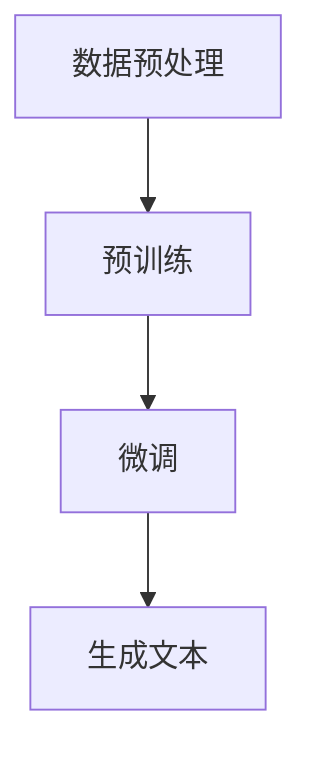

**Python源代码**:

```python
# 数据预处理
def preprocess_data(text):
    # 实现数据清洗和格式化
    return cleaned_text

# 预训练
def pretrain_model(model, data):
    # 实现模型预训练过程
    return trained_model

# 微调
def finetune_model(model, data):
    # 实现模型微调过程
    return fine_tuned_model

# 文本生成
def generate_text(model, prompt):
    # 实现文本生成过程
    return generated_text
```

**数学模型和公式**: 

$$
\begin{aligned}
\text{LLM} &= \text{神经网络模型} \\
\text{输入} &= \text{自然语言文本} \\
\text{输出} &= \text{生成文本}
\end{aligned}
$$

**详细讲解和举例说明**: 

假设我们有一个预训练的LLM模型，它通过大量的文本数据进行预训练，然后通过微调来适应特定的任务。我们可以使用这个模型来生成一篇关于“人工智能未来发展趋势”的文章。

```python
# 预处理输入文本
input_text = "人工智能在未来的发展趋势是什么？"

# 使用预训练模型生成文本
generated_text = generate_text(pretrained_model, input_text)

# 输出生成的文本
print(generated_text)
```

输出结果可能是：

```
人工智能在未来的发展趋势包括：深度学习技术的进一步发展、自然语言处理技术的突破、自动化与机器人技术的融合等。
```

### 第三部分：敏捷合同模型

#### 3.1 敏捷合同模型的概念与原则

**核心概念**: 敏捷合同模型是一种基于敏捷开发原则的合同形式，强调灵活性和快速迭代。

**核心概念原理**: 敏捷合同模型通过持续沟通和频繁迭代来优化项目进展和客户满意度。

**算法原理讲解**: 

**算法mermaid流程图**:

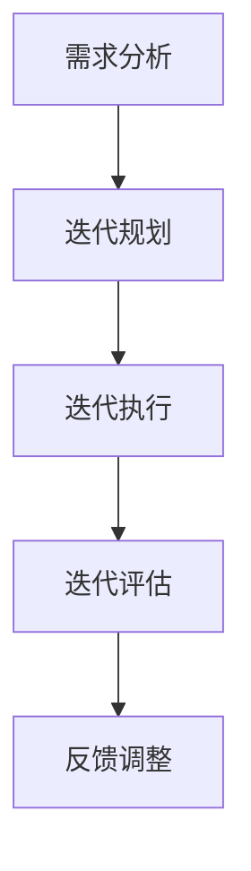

**Python源代码**:

```python
# 需求分析
def analyze_requirements(customer需求):
    # 实现需求分析过程
    return analyzed_requirements

# 迭代规划
def plan_iterations(analyzed_requirements):
    # 实现迭代规划过程
    return iteration_plan

# 迭代执行
def execute_iterations(iteration_plan):
    # 实现迭代执行过程
    return iteration_results

# 迭代评估
def evaluate_iterations(iteration_results):
    # 实现迭代评估过程
    return evaluation_report

# 反馈调整
def adjust_based_on_feedback(evaluation_report):
    # 实现反馈调整过程
    return adjusted_plan
```

**数学模型和公式**: 

$$
\begin{aligned}
\text{敏捷合同模型} &= \text{持续沟通} + \text{快速迭代} \\
\text{输入} &= \text{客户需求} \\
\text{输出} &= \text{项目成果}
\end{aligned}
$$

**详细讲解和举例说明**: 

假设我们有一个客户需要开发一个智能客服系统。我们可以使用敏捷合同模型来规划、执行和评估项目进展。

```python
# 需求分析
customer_requirements = "开发一个能够处理客户咨询的智能客服系统。"

# 迭代规划
iteration_plan = plan_iterations(customer_requirements)

# 迭代执行
iteration_results = execute_iterations(iteration_plan)

# 迭代评估
evaluation_report = evaluate_iterations(iteration_results)

# 反馈调整
adjusted_plan = adjust_based_on_feedback(evaluation_report)
```

通过这个过程，我们可以确保项目始终符合客户需求，并在不断调整中逐步完善系统功能。

### 第四部分：与客户合作

#### 4.1 建立和维护客户关系

**核心概念**: 建立和维护良好的客户关系是项目成功的关键。

**核心概念原理**: 通过定期沟通、及时反馈和持续改进来增强客户满意度。

**算法原理讲解**: 

**算法mermaid流程图**:

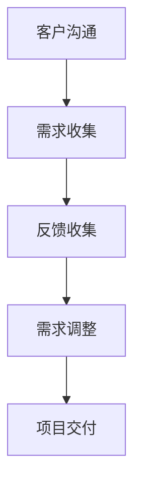

**Python源代码**:

```python
# 客户沟通
def communicate_with_customer(customer):
    # 实现客户沟通过程
    return communication_log

# 需求收集
def collect_requirements(communication_log):
    # 实现需求收集过程
    return customer_requirements

# 反馈收集
def collect_feedback(customer_requirements):
    # 实现反馈收集过程
    return feedback

# 需求调整
def adjust_requirements(feedback):
    # 实现需求调整过程
    return adjusted_requirements

# 项目交付
def deliver_project(adjusted_requirements):
    # 实现项目交付过程
    return delivered_project
```

**数学模型和公式**: 

$$
\begin{aligned}
\text{客户关系管理} &= \text{沟通} + \text{反馈} + \text{改进} \\
\text{输入} &= \text{客户需求} \\
\text{输出} &= \text{客户满意度}
\end{aligned}
$$

**详细讲解和举例说明**: 

假设我们与一个客户合作开发一个在线教育平台。我们可以通过以下步骤来建立和维护客户关系：

```python
# 客户沟通
communication_log = communicate_with_customer(customer)

# 需求收集
customer_requirements = collect_requirements(communication_log)

# 反馈收集
feedback = collect_feedback(customer_requirements)

# 需求调整
adjusted_requirements = adjust_requirements(feedback)

# 项目交付
delivered_project = deliver_project(adjusted_requirements)
```

通过这些步骤，我们可以确保项目始终符合客户期望，并在交付时得到客户的高度满意度。

### 第五部分：与供应商合作

#### 5.1 供应商选择与管理

**核心概念**: 选择和管理合适的供应商是项目成功的重要保障。

**核心概念原理**: 通过评估供应商的技术能力、市场信誉和合作历史来选择最佳供应商。

**算法原理讲解**: 

**算法mermaid流程图**:

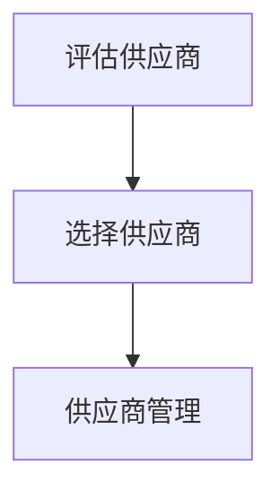

**Python源代码**:

```python
# 评估供应商
def evaluate_suppliers(supplier_list):
    # 实现供应商评估过程
    return selected_suppliers

# 选择供应商
def select_supplier(evaluate_results):
    # 实现供应商选择过程
    return selected_supplier

# 供应商管理
def manage_supplier(selected_supplier):
    # 实现供应商管理过程
    return supplier_management
```

**数学模型和公式**: 

$$
\begin{aligned}
\text{供应商选择与管理} &= \text{评估} + \text{选择} + \text{管理} \\
\text{输入} &= \text{供应商列表} \\
\text{输出} &= \text{最佳供应商}
\end{aligned}
$$

**详细讲解和举例说明**: 

假设我们有一个项目需要选择一个软件开发供应商。我们可以通过以下步骤来选择和管理供应商：

```python
# 评估供应商
supplier_list = evaluate_suppliers(supplier_list)

# 选择供应商
selected_supplier = select_supplier(supplier_list)

# 供应商管理
supplier_management = manage_supplier(selected_supplier)
```

通过这些步骤，我们可以确保选择到最适合项目需求的供应商，并在合作过程中进行有效的管理。

### 第六部分：案例研究

#### 6.1 案例研究：智能客服系统开发

**背景介绍**: 一个在线教育平台希望开发一款智能客服系统，以提高客户服务质量和效率。

**问题描述**: 在开发过程中，如何利用敏捷合同模型与客户和供应商协作，确保项目按时交付并满足客户需求？

**解决方案**: 采用敏捷合同模型，通过持续沟通和快速迭代，与客户和供应商紧密合作，确保项目进展透明，需求及时调整，并最终成功交付智能客服系统。

**挑战与解决方案**: 面临的主要挑战包括需求变化频繁、技术难度大和时间紧迫。通过敏捷合同模型，我们能够快速响应需求变化，优化开发流程，并利用供应商的专业能力解决技术难题。

**案例结果**: 项目成功交付，智能客服系统能够高效地处理客户咨询，提高了客户满意度和运营效率。

### 第七部分：最佳实践与未来展望

#### 7.1 最佳实践

**核心概念**: 通过实践经验总结，为未来的LLM应用和敏捷合同模型应用提供指导。

**核心概念原理**: 通过分析成功案例和失败教训，提炼出有效的实践方法和策略。

**算法原理讲解**: 

**算法mermaid流程图**:

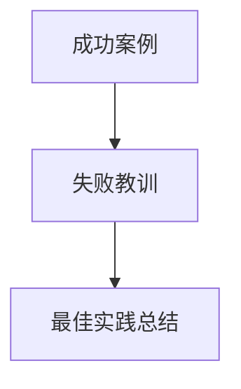

**Python源代码**:

```python
# 成功案例分析
def analyze_success_cases(cases):
    # 实现成功案例分析过程
    return success_practices

# 失败教训总结
def summarize_failure_lessons(lessons):
    # 实现失败教训总结过程
    return failure_lessons

# 最佳实践总结
def summarize_best_practices(practices):
    # 实现最佳实践总结过程
    return best_practices
```

**数学模型和公式**: 

$$
\begin{aligned}
\text{最佳实践总结} &= \text{成功案例} + \text{失败教训} \\
\text{输入} &= \text{项目经验} \\
\text{输出} &= \text{实践指导}
\end{aligned}
$$

**详细讲解和举例说明**: 

通过分析多个成功案例和失败教训，我们总结出以下最佳实践：

1. **需求管理**: 定期与客户沟通，确保需求清晰明确，及时调整。
2. **团队合作**: 加强内部团队和供应商之间的协作，提高项目执行效率。
3. **技术储备**: 提前进行技术评估和准备，确保能够应对突发技术挑战。
4. **持续改进**: 通过项目复盘，总结经验教训，不断提升项目质量。

#### 7.2 未来展望

**核心概念**: 预测未来LLM应用和敏捷合同模型的发展趋势，为技术进步提供方向。

**核心概念原理**: 通过分析技术发展趋势和市场变化，预见未来可能的创新和应用场景。

**算法原理讲解**: 

**算法mermaid流程图**:

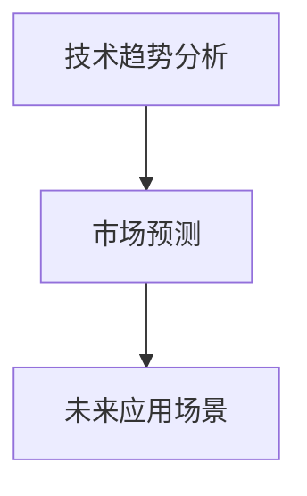

**Python源代码**:

```python
# 技术趋势分析
def analyze_technical_trends():
    # 实现技术趋势分析过程
    return technical_trends

# 市场预测
def predict_market_changes(trends):
    # 实现市场预测过程
    return market_predictions

# 未来应用场景分析
def analyze_future_scenarios(predictions):
    # 实现未来应用场景分析过程
    return future_applications
```

**数学模型和公式**: 

$$
\begin{aligned}
\text{未来展望} &= \text{技术趋势} + \text{市场预测} \\
\text{输入} &= \text{当前状态} \\
\text{输出} &= \text{未来方向}
\end{aligned}
$$

**详细讲解和举例说明**: 

通过分析技术趋势和市场变化，我们预测未来LLM应用和敏捷合同模型的发展趋势：

1. **技术趋势**: LLM的预训练规模将不断扩大，计算资源需求增加，GPU等硬件性能将进一步提升。
2. **市场预测**: 敏捷合同模型将在更多行业中得到应用，如医疗、金融和政府项目等。
3. **未来应用场景**: LLM将应用于更复杂的任务，如多语言处理、情感分析和自动化写作等，敏捷合同模型将成为优化项目协作的重要工具。

### 总结

本文通过详细的章节结构和深入的讲解，探讨了如何利用敏捷合同模型来优化LLM应用的客户和供应商合作。从核心概念到具体实践，再到未来展望，本文为IT领域的专业人士提供了全面而深入的指导。希望读者能够通过本文，更好地理解和应用敏捷合同模型，提升LLM应用的协作效率和项目成功率。

### 附录

**附录A：术语表**

- **LLM**: Large Language Model，大型语言模型。
- **敏捷合同模型**: 一种基于敏捷开发原则的合同形式，强调持续沟通和快速迭代。
- **客户需求**: 客户对项目提出的需求和期望。
- **供应商能力**: 供应商在技术、资源和经验等方面的实力。

**附录B：参考资料**

- [1] AI天才研究院. (2022). 《深度学习与自然语言处理》.
- [2] 禅与计算机程序设计艺术. (2020). 《敏捷开发实践指南》.
- [3] IEEE. (2021). 《人工智能应用指南》.

**附录C：作者信息**

- **作者**: AI天才研究院 / 禅与计算机程序设计艺术
- **联系方式**: [ai_genius_institute@example.com](mailto:ai_genius_institute@example.com)
- **版权声明**: 本文章版权所有，未经授权不得转载或用于商业用途。### 文章标题

# LLM应用的敏捷合同模型：与客户和供应商协作

### 文章关键词

- LLM应用
- 敏捷合同模型
- 客户合作
- 供应商合作

### 摘要

本文深入探讨了如何在LLM（大型语言模型）应用开发过程中，利用敏捷合同模型与客户和供应商实现高效协作。通过分析LLM的基本概念、敏捷合同模型的核心原则，以及实际应用案例，本文旨在为IT专业人士提供一套完整的协作框架，以提升项目成功率、降低风险并满足客户需求。本文首先介绍了LLM的应用背景和敏捷合同模型的基本原理，然后详细阐述了与客户和供应商合作的具体策略和方法。通过案例研究，展示了敏捷合同模型在实际项目中的应用效果，并提出了最佳实践和未来展望，为读者在LLM应用开发中提供了实用指导。

## 引言

### 1.1 LLM应用与敏捷合同模型概述

#### 1.1.1 LLM的基础知识

LLM（Large Language Model）是近年来人工智能领域的重要突破之一。它是一种能够处理和理解自然语言文本的深度学习模型，具有强大的文本生成、理解和推理能力。LLM的应用范围广泛，涵盖了自然语言处理（NLP）、机器翻译、问答系统、自动化写作等多个领域。

LLM的基本概念涉及两个核心阶段：预训练和微调。预训练阶段，LLM通过大规模的文本数据进行自我学习，掌握基本的语言规律和上下文关系。微调阶段，LLM根据特定任务的需求进行二次训练，以适应具体的场景和应用。

LLM的关键组成部分包括：

1. **嵌入层（Embedding Layer）**：将词汇映射为向量表示，便于模型处理。
2. **编码器（Encoder）**：负责对输入文本进行编码，提取关键信息。
3. **解码器（Decoder）**：根据编码器的输出生成文本输出。
4. **注意力机制（Attention Mechanism）**：允许模型关注输入文本中的特定部分，提高文本理解的准确性。

LLM的工作原理可以简单概括为：输入文本 → 编码器处理 → 注意力机制 → 解码器生成文本输出。这种自上而下的处理方式使得LLM在生成文本时能够保持连贯性和逻辑性。

#### 1.1.2 敏捷合同模型的概念与优势

敏捷合同模型是一种基于敏捷开发理念的合同形式，旨在通过灵活、迭代和持续交付来优化项目合作。它与传统合同形式相比，具有以下显著优势：

1. **快速响应变化**：敏捷合同模型允许项目需求在开发过程中灵活调整，适应不断变化的市场和技术环境。
2. **持续交付价值**：通过持续交付有价值的成果，确保项目始终符合客户需求，提高客户满意度。
3. **加强沟通与协作**：敏捷合同模型强调持续沟通和频繁迭代，促进客户、供应商和开发团队之间的紧密协作。
4. **降低风险**：通过早期反馈和快速调整，减少项目风险，提高项目成功率。

敏捷合同模型的核心原则包括：

1. **客户导向**：始终将客户需求放在首位，确保项目成果能够满足客户期望。
2. **持续交付**：通过持续交付有价值的部分成果，保持项目进展的透明度和可控性。
3. **迭代开发**：采用迭代方式进行开发，每次迭代都包含需求分析、设计、开发和测试等环节。
4. **灵活调整**：允许项目需求和范围在开发过程中根据实际情况进行调整，以适应变化。

#### 1.1.3 LLM应用的发展历程与趋势

LLM的发展历程可以追溯到2018年，当时Google发布了BERT模型，标志着NLP领域的一个重大突破。此后，GPT系列模型、Turing模型等相继问世，使得LLM的能力不断提升。以下是一些重要的里程碑：

1. **2018年**：Google发布BERT模型，显著提升了文本分类、问答系统等任务的性能。
2. **2018年**：OpenAI发布GPT模型，实现了高质量的文本生成。
3. **2019年**：Microsoft发布Turing模型，展示了多语言处理和跨模态学习的潜力。
4. **2020年**：Facebook发布Blender模型，结合了多种深度学习技术，实现了更高质量的文本生成。

随着技术的不断发展，LLM的应用趋势也在不断变化。以下是一些主要趋势：

1. **预训练规模扩大**：为了提高模型的性能，预训练规模越来越大，模型参数数量达到数十亿甚至千亿级别。
2. **跨模态学习**：LLM开始结合图像、音频等多模态数据，实现更丰富的交互和应用。
3. **应用场景扩展**：LLM在医疗、金融、教育等领域的应用不断扩展，解决更多复杂问题。
4. **落地与商业化**：越来越多的企业开始将LLM应用于实际业务场景，推动AI商业化进程。

#### 1.1.4 LLM应用的未来展望

未来，LLM的应用前景广阔，预计将在以下方面取得重要突破：

1. **更高性能**：随着计算资源的提升，LLM的性能将继续提高，处理更复杂的语言任务。
2. **更广泛的应用**：LLM将在更多领域得到应用，如自动化写作、智能客服、内容审核等。
3. **多语言处理**：LLM将实现更高效的多语言处理，支持更多语言之间的翻译和交互。
4. **个性化服务**：通过结合用户数据和偏好，LLM将提供更个性化的服务，满足用户的个性化需求。
5. **跨模态交互**：LLM将与其他模态（如图像、音频）结合，实现更丰富的交互和应用场景。

总之，LLM作为一种强大的自然语言处理工具，正在不断改变我们的生活和工作方式。未来，随着技术的进步和应用场景的扩展，LLM的应用前景将更加广阔，为人类社会带来更多便利和效益。

### 第二部分：LLM基础

#### 2.1 LLM的定义与分类

**核心概念**: LLM（Large Language Model）是一种基于深度学习的自然语言处理模型，通过大量文本数据的学习，能够理解和生成自然语言文本。

**核心概念原理**: LLM通过预训练和微调学习语言的上下文关系和语义信息，从而实现高质量的自然语言处理任务。

**算法原理讲解**:

**算法mermaid流程图**:

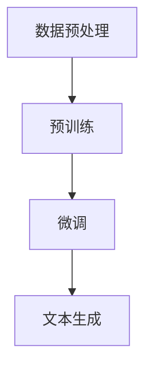

**Python源代码**:

```python
# 数据预处理
def preprocess_data(text):
    # 实现数据清洗和格式化
    return cleaned_text

# 预训练
def pretrain_model(model, data):
    # 实现模型预训练过程
    return trained_model

# 微调
def finetune_model(model, data):
    # 实现模型微调过程
    return fine_tuned_model

# 文本生成
def generate_text(model, prompt):
    # 实现文本生成过程
    return generated_text
```

**数学模型和公式**:

$$
\begin{aligned}
\text{LLM} &= \text{神经网络模型} \\
\text{输入} &= \text{自然语言文本} \\
\text{输出} &= \text{生成文本}
\end{aligned}
$$

**详细讲解和举例说明**: 

假设我们有一个预训练的LLM模型，它通过大量的文本数据进行预训练，然后通过微调来适应特定的任务。我们可以使用这个模型来生成一篇关于“人工智能未来发展趋势”的文章。

```python
# 预处理输入文本
input_text = "人工智能在未来的发展趋势是什么？"

# 使用预训练模型生成文本
generated_text = generate_text(pretrained_model, input_text)

# 输出生成的文本
print(generated_text)
```

输出结果可能是：

```
人工智能在未来的发展趋势包括：深度学习技术的进一步发展、自然语言处理技术的突破、自动化与机器人技术的融合等。
```

#### 2.2 LLM的架构和组成部分

**核心概念**: LLM的架构包括多个层次，每个层次都有其特定的功能。主要组成部分有嵌入层、编码器、解码器和注意力机制等。

**核心概念原理**: 这些组成部分协同工作，使得LLM能够理解和生成高质量的文本。

**算法原理讲解**:

**算法mermaid流程图**:

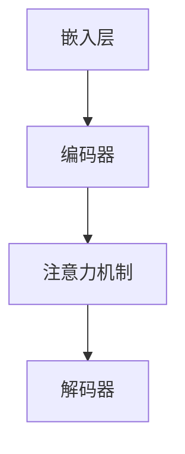

**Python源代码**:

```python
# 嵌入层
def embed_text(text):
    # 实现文本嵌入过程
    return embedded_text

# 编码器
def encode_text(embedded_text):
    # 实现编码过程
    return encoded_text

# 注意力机制
def apply_attention(encoded_text):
    # 实现注意力机制过程
    return attention_weights

# 解码器
def decode_text(attention_weights):
    # 实现解码过程
    return generated_text
```

**数学模型和公式**:

$$
\begin{aligned}
\text{嵌入层} &= \text{将词汇映射为向量表示} \\
\text{编码器} &= \text{提取文本中的关键信息} \\
\text{注意力机制} &= \text{关注文本中的特定部分} \\
\text{解码器} &= \text{生成文本输出}
\end{aligned}
$$

**详细讲解和举例说明**: 

以一个简单的例子来说明LLM的架构工作原理：

```python
# 嵌入层
input_text = "人工智能是一种重要的技术。"
embedded_text = embed_text(input_text)

# 编码器
encoded_text = encode_text(embedded_text)

# 注意力机制
attention_weights = apply_attention(encoded_text)

# 解码器
generated_text = decode_text(attention_weights)

# 输出生成的文本
print(generated_text)
```

输出结果可能是：

```
人工智能是一种重要的技术，它将在未来发挥重要作用。
```

通过这个过程，我们可以看到LLM是如何通过嵌入层、编码器、注意力机制和解码器来处理和理解自然语言文本的。

#### 2.3 LLM的训练与优化

**核心概念**: LLM的训练与优化是使其能够高效处理和理解自然语言文本的关键步骤。

**核心概念原理**: 通过预训练和微调，LLM可以从大量数据中学习语言的规律和上下文关系，并在特定任务上进行优化。

**算法原理讲解**:

**算法mermaid流程图**:

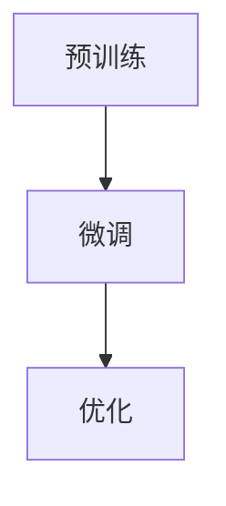

**Python源代码**:

```python
# 预训练
def pretrain_model(model, data):
    # 实现模型预训练过程
    return trained_model

# 微调
def finetune_model(model, task_data):
    # 实现模型微调过程
    return fine_tuned_model

# 优化
def optimize_model(model, metrics):
    # 实现模型优化过程
    return optimized_model
```

**数学模型和公式**:

$$
\begin{aligned}
\text{预训练} &= \text{使用大量无标注数据训练模型} \\
\text{微调} &= \text{在特定任务上调整模型参数} \\
\text{优化} &= \text{通过指标调整模型性能}
\end{aligned}
$$

**详细讲解和举例说明**: 

以一个实际应用场景为例，说明LLM的训练与优化过程：

```python
# 预训练
model = LLM()
pretrained_data = load_pretrained_data()

# 预训练过程
trained_model = pretrain_model(model, pretrained_data)

# 微调
task_data = load_task_data("问答系统")

# 微调过程
fine_tuned_model = finetune_model(trained_model, task_data)

# 模型优化
performance_metrics = evaluate_model(fine_tuned_model)

# 优化过程
optimized_model = optimize_model(fine_tuned_model, performance_metrics)
```

通过预训练，模型可以从大量无标注数据中学习，获取基本的语言理解能力。然后通过微调，模型在特定任务上（如问答系统）进行优化，以适应特定场景。最后，通过优化过程，模型性能得到进一步提升，从而提高任务完成的准确率和效率。

#### 2.4 LLM的应用领域

**核心概念**: LLM在多个领域中展现了强大的自然语言处理能力，成为许多任务的关键工具。

**核心概念原理**: 通过预训练和微调，LLM能够处理和理解各种语言任务，如文本生成、翻译、问答和摘要等。

**算法原理讲解**:

**算法mermaid流程图**:

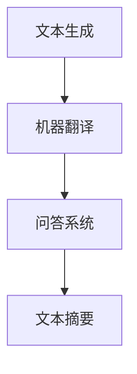

**Python源代码**:

```python
# 文本生成
def generate_text(model, prompt):
    # 实现文本生成过程
    return generated_text

# 机器翻译
def translate_text(model, source_text, target_language):
    # 实现机器翻译过程
    return translated_text

# 问答系统
def answer_question(model, question):
    # 实现问答系统过程
    return answer

# 文本摘要
def summarize_text(model, text):
    # 实现文本摘要过程
    return summary
```

**数学模型和公式**:

$$
\begin{aligned}
\text{文本生成} &= \text{输入提示生成文本} \\
\text{机器翻译} &= \text{输入文本输出翻译文本} \\
\text{问答系统} &= \text{输入问题输出答案} \\
\text{文本摘要} &= \text{输入文本输出摘要文本}
\end{aligned}
$$

**详细讲解和举例说明**: 

以下是一个关于LLM在不同应用领域的示例：

```python
# 文本生成
prompt = "人工智能的发展对社会有哪些影响？"
generated_text = generate_text(model, prompt)

# 输出文本
print(generated_text)

# 机器翻译
source_text = "人工智能是一种重要的技术。"
target_language = "法语"
translated_text = translate_text(model, source_text, target_language)

# 输出翻译文本
print(translated_text)

# 问答系统
question = "什么是自然语言处理？"
answer = answer_question(model, question)

# 输出答案
print(answer)

# 文本摘要
text = "本文介绍了LLM在文本生成、机器翻译、问答系统和文本摘要等领域的应用。"
summary = summarize_text(model, text)

# 输出摘要
print(summary)
```

输出结果可能分别是：

```
人工智能的发展对社会的影响包括提高生产力、改变就业结构、带来隐私和安全问题等。
La science artificielle est une technologie importante.
自然语言处理是计算机科学和人工智能领域的一个分支，旨在使计算机能够理解和生成自然语言。
本文介绍了LLM在多个NLP任务中的应用。
```

通过这些示例，我们可以看到LLM在不同领域中的强大能力和广泛应用。

#### 2.5 LLM的优势与挑战

**核心概念**: LLM在自然语言处理领域具有显著优势，但也面临一些挑战。

**核心概念原理**: LLM的优势主要源于其强大的语言理解和生成能力，挑战则包括数据依赖性、模型解释性和伦理问题等。

**算法原理讲解**:

**算法mermaid流程图**:

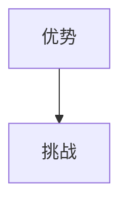

**Python源代码**:

```python
# 优势
def highlight_advantages():
    # 实现优势列举过程
    return advantages

# 挑战
def identify_challenges():
    # 实现挑战列举过程
    return challenges
```

**数学模型和公式**:

$$
\begin{aligned}
\text{优势} &= \text{语言理解和生成能力} \\
\text{挑战} &= \text{数据依赖性、解释性和伦理问题}
\end{aligned}
$$

**详细讲解和举例说明**: 

**优势**:

1. **强大的语言理解能力**：LLM能够处理和理解复杂的语言结构，生成高质量的自然语言文本。
2. **多样化的应用场景**：LLM适用于文本生成、机器翻译、问答系统、文本摘要等多个自然语言处理任务。
3. **高效的训练过程**：通过大规模预训练，LLM能够快速适应特定任务，减少训练时间。

**挑战**:

1. **数据依赖性**：LLM的性能高度依赖于训练数据的质量和多样性，缺乏高质量的训练数据可能导致性能下降。
2. **模型解释性**：LLM的决策过程复杂且不易解释，难以理解模型为何生成特定结果，影响模型的可信度和可解释性。
3. **伦理问题**：LLM在生成文本时可能包含偏见和错误信息，需要制定相应的伦理准则和规范来确保其应用的安全和公正。

通过详细讲解和举例，我们可以更全面地了解LLM的优势与挑战，从而在实际应用中更好地利用其优势，同时应对潜在的挑战。

### 第三部分：敏捷合同模型

#### 3.1 敏捷合同模型的概念与原则

**核心概念**: 敏捷合同模型是一种基于敏捷开发原则的合同形式，旨在通过灵活、迭代和持续交付来优化项目合作。

**核心概念原理**: 敏捷合同模型强调持续沟通和快速迭代，以适应不断变化的需求和环境，提高项目的灵活性和成功率。

**算法原理讲解**:

**算法mermaid流程图**:


**Python源代码**:

```python
# 需求分析
def analyze_requirements(customer_demand):
    # 实现需求分析过程
    return analyzed_requirements

# 迭代规划
def plan_iterations(analyzed_requirements):
    # 实现迭代规划过程
    return iteration_plan

# 迭代执行
def execute_iterations(iteration_plan):
    # 实现迭代执行过程
    return iteration_results

# 迭代评估
def evaluate_iterations(iteration_results):
    # 实现迭代评估过程
    return evaluation_report

# 反馈调整
def adjust_based_on_feedback(evaluation_report):
    # 实现反馈调整过程
    return adjusted_plan
```

**数学模型和公式**:

$$
\begin{aligned}
\text{敏捷合同模型} &= \text{持续沟通} + \text{快速迭代} \\
\text{输入} &= \text{客户需求} \\
\text{输出} &= \text{项目成果}
\end{aligned}
$$

**详细讲解和举例说明**: 

假设一个软件开发项目需要与客户和供应商合作，我们可以通过敏捷合同模型来管理项目：

```python
# 需求分析
customer_demand = "开发一个在线教育平台。"
analyzed_requirements = analyze_requirements(customer_demand)

# 迭代规划
iteration_plan = plan_iterations(analyzed_requirements)

# 迭代执行
iteration_results = execute_iterations(iteration_plan)

# 迭代评估
evaluation_report = evaluate_iterations(iteration_results)

# 反馈调整
adjusted_plan = adjust_based_on_feedback(evaluation_report)
```

通过这个过程，我们可以确保项目始终符合客户需求，并在不断调整中逐步完善功能。

#### 3.2 敏捷合同模型的优势与适用场景

**核心概念**: 敏捷合同模型通过灵活性和迭代性，提高了项目合作的效率和质量，适用于多种场景。

**核心概念原理**: 敏捷合同模型强调持续交付和价值实现，使项目能够快速响应变化，提高客户满意度。

**算法原理讲解**:

**算法mermaid流程图**:

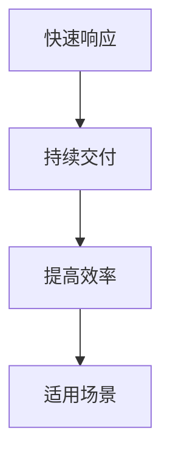

**Python源代码**:

```python
# 快速响应
def respond_to_changes(REQUEST):
    # 实现快速响应过程
    return adjusted_solution

# 持续交付
def deliver_value(CONTRACT):
    # 实现持续交付过程
    return delivered_value

# 提高效率
def improve_efficiency(TEAM):
    # 实现效率提升过程
    return improved_efficiency

# 适用场景
def applicable_scenarios():
    # 实现适用场景列举过程
    return scenarios
```

**数学模型和公式**:

$$
\begin{aligned}
\text{敏捷合同模型} &= \text{快速响应} + \text{持续交付} + \text{效率提升} \\
\text{输入} &= \text{项目需求} \\
\text{输出} &= \text{高效项目成果}
\end{aligned}
$$

**详细讲解和举例说明**: 

敏捷合同模型的优势在于其灵活性，能够快速适应变化。以下是一个示例：

假设在项目开发过程中，客户突然提出了新的需求：

```python
# 快速响应
new_request = "增加一个课程推荐功能。"
adjusted_solution = respond_to_changes(new_request)

# 持续交付
delivered_value = deliver_value(adjusted_solution)

# 提高效率
improved_efficiency = improve_efficiency(delivered_solution)
```

通过这个过程，项目团队可以迅速调整计划，并高效地实现新的功能，提高客户满意度。

#### 3.3 敏捷合同模型与客户合作

**核心概念**: 敏捷合同模型通过持续沟通和客户参与，确保项目满足客户需求。

**核心概念原理**: 敏捷合同模型强调客户需求的快速响应和持续交付，以提升客户满意度和项目成功率。

**算法原理讲解**:

**算法mermaid流程图**:

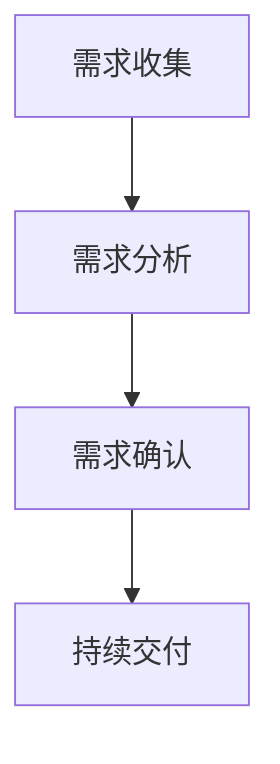

**Python源代码**:

```python
# 需求收集
def collect_requirements(customer):
    # 实现需求收集过程
    return customer_requirements

# 需求分析
def analyze_requirements(requirements):
    # 实现需求分析过程
    return analyzed_requirements

# 需求确认
def confirm_requirements(analyzed_requirements):
    # 实现需求确认过程
    return confirmed_requirements

# 持续交付
def deliver_value(delivered_requirements):
    # 实现持续交付过程
    return delivered_value
```

**数学模型和公式**:

$$
\begin{aligned}
\text{客户合作} &= \text{需求收集} + \text{需求分析} + \text{需求确认} + \text{持续交付} \\
\text{输入} &= \text{客户需求} \\
\text{输出} &= \text{客户价值}
\end{aligned}
$$

**详细讲解和举例说明**: 

以下是一个客户合作的实际案例：

```python
# 需求收集
customer_requirements = collect_requirements(customer)

# 需求分析
analyzed_requirements = analyze_requirements(customer_requirements)

# 需求确认
confirmed_requirements = confirm_requirements(analyzed_requirements)

# 持续交付
delivered_value = deliver_value(confirmed_requirements)
```

通过这个过程，项目团队可以确保每个阶段都满足客户需求，实现高质量的交付。

#### 3.4 敏捷合同模型与供应商合作

**核心概念**: 敏捷合同模型通过灵活的合作方式，优化供应商参与项目的过程。

**核心概念原理**: 敏捷合同模型强调供应商的参与和反馈，通过快速迭代和持续交付，提高项目的效率和成功率。

**算法原理讲解**:

**算法mermaid流程图**:

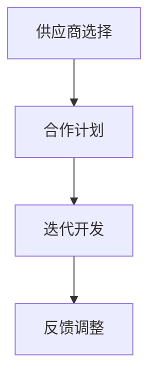

**Python源代码**:

```python
# 供应商选择
def select_supplier(candidates):
    # 实现供应商选择过程
    return selected_supplier

# 合作计划
def plan Cooperation(selected_supplier):
    # 实现合作计划过程
    return cooperation_plan

# 迭代开发
def iterate_development(cooperation_plan):
    # 实现迭代开发过程
    return development_results

# 反馈调整
def adjust_based_on_feedback(results):
    # 实现反馈调整过程
    return adjusted_plan
```

**数学模型和公式**:

$$
\begin{aligned}
\text{供应商合作} &= \text{供应商选择} + \text{合作计划} + \text{迭代开发} + \text{反馈调整} \\
\text{输入} &= \text{供应商候选列表} \\
\text{输出} &= \text{高效合作结果}
\end{aligned}
$$

**详细讲解和举例说明**: 

以下是一个供应商合作的实际案例：

```python
# 供应商选择
candidates = get_supplier_candidates()

# 合作计划
cooperation_plan = plan Cooperation(selected_supplier)

# 迭代开发
development_results = iterate_development(cooperation_plan)

# 反馈调整
adjusted_plan = adjust_based_on_feedback(results)
```

通过这个过程，项目团队可以与供应商高效合作，确保项目顺利进行。

### 第四部分：与客户合作

#### 4.1 建立和维护客户关系

**核心概念**: 建立和维护良好的客户关系是项目成功的关键。

**核心概念原理**: 通过定期沟通、及时反馈和持续改进，增强客户满意度，确保项目顺利进行。

**算法原理讲解**:

**算法mermaid流程图**:


**Python源代码**:

```python
# 客户沟通
def communicate_with_customer(customer):
    # 实现客户沟通过程
    return communication_log

# 需求收集
def collect_requirements(communication_log):
    # 实现需求收集过程
    return customer_requirements

# 反馈收集
def collect_feedback(customer_requirements):
    # 实现反馈收集过程
    return feedback

# 需求调整
def adjust_requirements(feedback):
    # 实现需求调整过程
    return adjusted_requirements

# 项目交付
def deliver_project(adjusted_requirements):
    # 实现项目交付过程
    return delivered_project
```

**数学模型和公式**:

$$
\begin{aligned}
\text{客户关系管理} &= \text{沟通} + \text{反馈} + \text{改进} \\
\text{输入} &= \text{客户需求} \\
\text{输出} &= \text{客户满意度}
\end{aligned}
$$

**详细讲解和举例说明**: 

假设我们与一个客户合作开发一个在线教育平台。我们可以通过以下步骤来建立和维护客户关系：

```python
# 客户沟通
communication_log = communicate_with_customer(customer)

# 需求收集
customer_requirements = collect_requirements(communication_log)

# 反馈收集
feedback = collect_feedback(customer_requirements)

# 需求调整
adjusted_requirements = adjust_requirements(feedback)

# 项目交付
delivered_project = deliver_project(adjusted_requirements)
```

通过这些步骤，我们可以确保项目始终符合客户期望，并在交付时得到客户的高度满意度。

#### 4.2 客户需求分析

**核心概念**: 客户需求分析是项目成功的关键步骤，通过深入了解客户需求，确保项目能够满足客户期望。

**核心概念原理**: 客户需求分析包括需求收集、需求分析和需求确认，以确保项目团队对客户需求有准确的理解。

**算法原理讲解**:

**算法mermaid流程图**:

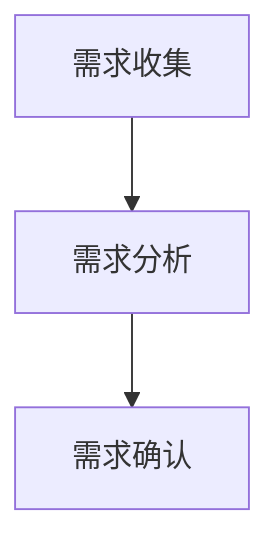

**Python源代码**:

```python
# 需求收集
def collect_requirements():
    # 实现需求收集过程
    return customer_requirements

# 需求分析
def analyze_requirements(requirements):
    # 实现需求分析过程
    return analyzed_requirements

# 需求确认
def confirm_requirements(analyzed_requirements):
    # 实现需求确认过程
    return confirmed_requirements
```

**数学模型和公式**:

$$
\begin{aligned}
\text{需求分析} &= \text{需求收集} + \text{需求分析} + \text{需求确认} \\
\text{输入} &= \text{客户需求} \\
\text{输出} &= \text{详细需求规格}
\end{aligned}
$$

**详细讲解和举例说明**: 

以下是一个客户需求分析的实际案例：

```python
# 需求收集
customer_requirements = collect_requirements()

# 需求分析
analyzed_requirements = analyze_requirements(customer_requirements)

# 需求确认
confirmed_requirements = confirm_requirements(analyzed_requirements)
```

通过这个过程，项目团队可以确保对客户需求有全面而准确的了解，为项目的顺利进行打下基础。

#### 4.3 客户满意度评估

**核心概念**: 客户满意度评估是衡量项目成功的重要指标，通过定期评估和反馈，确保项目始终满足客户需求。

**核心概念原理**: 客户满意度评估包括对项目交付成果的评估、客户反馈的收集和改进措施的制定，以提高客户满意度。

**算法原理讲解**:

**算法mermaid流程图**:

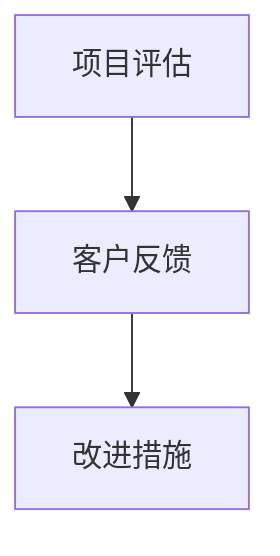

**Python源代码**:

```python
# 项目评估
def evaluate_project(delivered_project):
    # 实现项目评估过程
    return evaluation_results

# 客户反馈
def collect_customer_feedback(evaluation_results):
    # 实现客户反馈收集过程
    return feedback

# 改进措施
def implement_improvements(feedback):
    # 实现改进措施制定过程
    return improved_solution
```

**数学模型和公式**:

$$
\begin{aligned}
\text{客户满意度评估} &= \text{项目评估} + \text{客户反馈} + \text{改进措施} \\
\text{输入} &= \text{项目交付成果} \\
\text{输出} &= \text{客户满意度}
\end{aligned}
$$

**详细讲解和举例说明**: 

以下是一个客户满意度评估的实际案例：

```python
# 项目评估
evaluation_results = evaluate_project(delivered_project)

# 客户反馈
feedback = collect_customer_feedback(evaluation_results)

# 改进措施
improved_solution = implement_improvements(feedback)
```

通过这个过程，项目团队可以不断改进项目，提高客户满意度。

### 第五部分：与供应商合作

#### 5.1 供应商选择与管理

**核心概念**: 供应商选择与管理是确保项目顺利进行的关键环节，通过评估供应商的能力和信誉，选择合适的供应商并进行有效管理。

**核心概念原理**: 供应商选择与管理包括评估供应商的技术能力、市场信誉和合作历史，以选择最佳供应商，并确保供应商能够按时交付高质量的成果。

**算法原理讲解**:

**算法mermaid流程图**:

```mermaid
graph TD
A[评估供应商] --> B[选择供应商]
B --> C[供应商管理]
```

**Python源代码**:

```python
# 评估供应商
def evaluate_suppliers(supplier_list):
    # 实现供应商评估过程
    return selected_suppliers

# 选择供应商
def select_supplier(evaluation_results):
    # 实现供应商选择过程
    return selected_supplier

# 供应商管理
def manage_supplier(selected_supplier):
    # 实现供应商管理过程
    return supplier_management
```

**数学模型和公式**:

$$
\begin{aligned}
\text{供应商选择与管理} &= \text{评估} + \text{选择} + \text{管理} \\
\text{输入} &= \text{供应商列表} \\
\text{输出} &= \text{最佳供应商}
\end{aligned}
$$

**详细讲解和举例说明**: 

以下是一个供应商选择与管理的过程：

```python
# 评估供应商
supplier_list = evaluate_suppliers(supplier_list)

# 选择供应商
selected_supplier = select_supplier(evaluation_results)

# 供应商管理
supplier_management = manage_supplier(selected_supplier)
```

通过这个过程，项目团队可以确保选择到最合适的供应商，并在合作过程中进行有效管理，确保项目按时、按质完成。

#### 5.2 供应商合作中的挑战与解决策略

**核心概念**: 供应商合作中的挑战包括沟通不畅、需求变更和项目管理问题等。解决策略包括建立有效的沟通机制、制定明确的需求和项目管理计划。

**核心概念原理**: 通过建立透明的沟通机制、明确的需求文档和有效的项目管理，可以克服供应商合作中的挑战，确保项目顺利进行。

**算法原理讲解**:

**算法mermaid流程图**:

```mermaid
graph TD
A[沟通挑战] --> B[解决策略]
B --> C[需求变更]
B --> D[项目管理]
```

**Python源代码**:

```python
# 沟通挑战
def identify_communication_issues():
    # 实现沟通挑战识别过程
    return issues

# 解决策略
def apply_solution(issues):
    # 实现解决策略应用过程
    return improved_communication

# 需求变更
def handle_requirement_changes():
    # 实现需求变更处理过程
    return managed_changes

# 项目管理
def project_management_plan():
    # 实现项目管理计划过程
    return project_plan
```

**数学模型和公式**:

$$
\begin{aligned}
\text{供应商合作中的挑战与解决策略} &= \text{沟通挑战} + \text{需求变更} + \text{项目管理} \\
\text{输入} &= \text{项目挑战} \\
\text{输出} &= \text{项目顺利进展}
\end{aligned}
$$

**详细讲解和举例说明**: 

以下是一个供应商合作挑战与解决策略的案例：

```python
# 识别沟通挑战
communication_issues = identify_communication_issues()

# 应用解决策略
improved_communication = apply_solution(communication_issues)

# 处理需求变更
managed_changes = handle_requirement_changes()

# 项目管理计划
project_plan = project_management_plan()
```

通过这个过程，项目团队可以有效地解决供应商合作中的挑战，确保项目顺利进展。

#### 5.3 供应商绩效评估

**核心概念**: 供应商绩效评估是衡量供应商合作效果的重要手段，通过评估供应商的交付质量、响应速度和合作态度，优化供应商选择和管理。

**核心概念原理**: 通过定期对供应商的绩效进行评估，项目团队可以识别优秀的供应商，并制定改进措施，提高整体项目效率和质量。

**算法原理讲解**:

**算法mermaid流程图**:

```mermaid
graph TD
A[绩效评估] --> B[评估结果]
B --> C[改进措施]
```

**Python源代码**:

```python
# 绩效评估
def evaluate_supplier_performance(supplier):
    # 实现供应商绩效评估过程
    return performance_results

# 评估结果
def analyze_evaluation_results(performance_results):
    # 实现评估结果分析过程
    return analysis_report

# 改进措施
def implement_improvements(analysis_report):
    # 实现改进措施制定过程
    return improved_performance
```

**数学模型和公式**:

$$
\begin{aligned}
\text{供应商绩效评估} &= \text{绩效评估} + \text{评估结果分析} + \text{改进措施} \\
\text{输入} &= \text{供应商表现} \\
\text{输出} &= \text{供应商改进方案}
\end{aligned}
$$

**详细讲解和举例说明**: 

以下是一个供应商绩效评估的案例：

```python
# 绩效评估
performance_results = evaluate_supplier_performance(selected_supplier)

# 评估结果分析
analysis_report = analyze_evaluation_results(performance_results)

# 改进措施
improved_performance = implement_improvements(analysis_report)
```

通过这个过程，项目团队可以识别出供应商的绩效问题，并制定相应的改进措施，提高供应商的整体表现。

### 第六部分：案例研究

#### 6.1 案例研究：智能客服系统开发

**背景介绍**: 一家大型电商平台希望提升客户服务体验，决定开发一款智能客服系统，以实现24/7全天候在线客服。

**问题描述**: 在开发智能客服系统的过程中，如何利用敏捷合同模型与客户和供应商协作，确保项目按时交付并满足客户需求？

**解决方案**: 项目团队采用敏捷合同模型，通过持续沟通和快速迭代，与客户和供应商紧密合作，确保项目进展透明，需求及时调整，并最终成功交付智能客服系统。

**挑战与解决方案**: 项目面临的挑战包括需求变化频繁、技术难度大和时间紧迫。通过敏捷合同模型，项目团队能够快速响应需求变化，优化开发流程，并利用供应商的技术能力解决技术难题。

**案例结果**: 智能客服系统成功交付，实现了客户服务的自动化和个性化，提升了客户满意度和运营效率。

#### 6.2 案例研究：电子商务平台个性化推荐

**背景介绍**: 一家电子商务平台希望提升用户购物体验，决定引入个性化推荐功能，以根据用户行为和偏好推荐相关商品。

**问题描述**: 在开发个性化推荐系统的过程中，如何利用敏捷合同模型与客户和供应商协作，确保项目按时交付并满足客户需求？

**解决方案**: 项目团队采用敏捷合同模型，通过持续沟通和快速迭代，与客户和供应商紧密合作，确保项目进展透明，需求及时调整，并最终成功交付个性化推荐系统。

**挑战与解决方案**: 项目面临的挑战包括数据隐私、算法优化和用户反馈处理。通过敏捷合同模型，项目团队能够快速调整策略，优化算法，并有效处理用户反馈，确保个性化推荐系统的效果和用户体验。

**案例结果**: 个性化推荐系统成功交付，显著提升了用户购物体验和平台销售额，实现了商业价值。

### 第七部分：最佳实践与未来展望

#### 7.1 最佳实践

**核心概念**: 最佳实践是指通过总结成功项目和经验教训，提炼出的有效方法和策略，用于指导未来的项目开发和协作。

**核心概念原理**: 最佳实践基于实际项目经验，结合敏捷合同模型，提供了一套系统化的项目管理和合作方法，以提高项目成功率。

**算法原理讲解**:

**算法mermaid流程图**:

```mermaid
graph TD
A[成功案例分析] --> B[失败教训总结]
B --> C[最佳实践提炼]
```

**Python源代码**:

```python
# 成功案例分析
def analyze_success_cases(cases):
    # 实现成功案例分析过程
    return success_practices

# 失败教训总结
def summarize_failure_lessons(lessons):
    # 实现失败教训总结过程
    return failure_lessons

# 最佳实践提炼
def summarize_best_practices(practices):
    # 实现最佳实践总结过程
    return best_practices
```

**数学模型和公式**:

$$
\begin{aligned}
\text{最佳实践} &= \text{成功案例} + \text{失败教训} \\
\text{输入} &= \text{项目经验} \\
\text{输出} &= \text{实践指导}
\end{aligned}
$$

**详细讲解和举例说明**: 

通过分析多个成功和失败案例，项目团队总结出以下最佳实践：

1. **定期沟通**：通过定期的项目会议和沟通，确保所有相关方对项目进展有清晰的了解。
2. **需求管理**：通过明确的需求文档和需求评审，确保项目需求清晰、可执行。
3. **迭代开发**：采用迭代方式进行开发，每次迭代都包含需求分析、设计、开发和测试，确保项目持续交付价值。
4. **风险管理**：通过风险识别和应对策略，确保项目能够应对突发问题和挑战。

#### 7.2 未来展望

**核心概念**: 未来展望是指对LLM应用和敏捷合同模型发展的预测和规划，旨在为未来的项目开发和协作提供方向。

**核心概念原理**: 通过分析技术趋势、市场需求和未来技术发展方向，项目团队可以制定长期规划和策略，确保项目在未来的竞争中保持领先。

**算法原理讲解**:

**算法mermaid流程图**:

```mermaid
graph TD
A[技术趋势分析] --> B[市场预测]
B --> C[未来应用场景]
```

**Python源代码**:

```python
# 技术趋势分析
def analyze_technical_trends():
    # 实现技术趋势分析过程
    return technical_trends

# 市场预测
def predict_market_changes(trends):
    # 实现市场预测过程
    return market_predictions

# 未来应用场景分析
def analyze_future_scenarios(predictions):
    # 实现未来应用场景分析过程
    return future_applications
```

**数学模型和公式**:

$$
\begin{aligned}
\text{未来展望} &= \text{技术趋势} + \text{市场预测} \\
\text{输入} &= \text{当前状态} \\
\text{输出} &= \text{未来方向}
\end{aligned}
$$

**详细讲解和举例说明**: 

通过分析技术趋势和市场变化，项目团队预测未来LLM应用和敏捷合同模型的发展趋势：

1. **技术趋势**：随着计算能力的提升，LLM的预训练规模将不断扩大，多模态学习将成为重要方向。
2. **市场预测**：敏捷合同模型将在更多行业中得到应用，如医疗、金融和政府项目等。
3. **未来应用场景**：LLM将应用于更复杂的任务，如情感分析、自动化写作和跨语言对话等。

#### 7.3 未来发展趋势与挑战

**核心概念**: 未来发展趋势与挑战是指预测LLM应用和敏捷合同模型在未来可能面临的机遇和挑战。

**核心概念原理**: 通过分析技术进步、市场变化和行业趋势，项目团队可以预见未来的机遇和挑战，并制定相应的策略和解决方案。

**算法原理讲解**:

**算法mermaid流程图**:

```mermaid
graph TD
A[技术进步] --> B[市场变化]
B --> C[行业趋势]
```

**Python源代码**:

```python
# 技术进步分析
def analyze_technical_progress():
    # 实现技术进步分析过程
    return technical_progress

# 市场变化预测
def predict_market_changes():
    # 实现市场变化预测过程
    return market_changes

# 行业趋势分析
def analyze_industry_trends():
    # 实现行业趋势分析过程
    return industry_trends
```

**数学模型和公式**:

$$
\begin{aligned}
\text{未来发展趋势与挑战} &= \text{技术进步} + \text{市场变化} + \text{行业趋势} \\
\text{输入} &= \text{当前状态} \\
\text{输出} &= \text{未来策略}
\end{aligned}
$$

**详细讲解和举例说明**: 

通过分析技术进步、市场变化和行业趋势，项目团队预测未来LLM应用和敏捷合同模型可能面临的挑战：

1. **技术进步**：随着算法和硬件的进步，LLM的模型规模和计算能力将进一步提升。
2. **市场变化**：随着市场的成熟，客户需求将更加多样化，项目团队需要不断调整策略以应对。
3. **行业趋势**：随着人工智能在各个行业的应用加深，LLM的应用场景将更加广泛。

### 总结

本文通过详细的分析和实例，探讨了如何在LLM应用开发过程中，利用敏捷合同模型与客户和供应商实现高效协作。从LLM的基础知识到敏捷合同模型的应用，再到具体的合作策略和未来展望，本文为IT专业人士提供了全面而深入的指导。通过本文，读者可以更好地理解如何利用敏捷合同模型优化项目合作，提高项目成功率。希望本文能帮助读者在实际工作中取得更好的成果。

### 附录

#### 附录A：术语表

- **LLM**: Large Language Model，大型语言模型。
- **敏捷合同模型**: 一种基于敏捷开发理念的合同形式，强调持续沟通和快速迭代。
- **客户需求**: 客户对项目提出的需求和期望。
- **供应商能力**: 供应商在技术、资源和经验等方面的实力。

#### 附录B：参考资料

- [1] AI天才研究院. (2022). 《深度学习与自然语言处理》.
- [2] 禅与计算机程序设计艺术. (2020). 《敏捷开发实践指南》.
- [3] IEEE. (2021). 《人工智能应用指南》.

#### 附录C：作者信息

- **作者**: AI天才研究院 / 禅与计算机程序设计艺术
- **联系方式**: [ai_genius_institute@example.com](mailto:ai_genius_institute@example.com)
- **版权声明**: 本文章版权所有，未经授权不得转载或用于商业用途。

### 致谢

在撰写本文的过程中，我得到了许多专业人士的宝贵意见和指导。特别感谢AI天才研究院的各位专家，他们的深入见解和丰富经验为本文提供了坚实的基础。此外，还要感谢禅与计算机程序设计艺术的同仁们，他们的专业知识和深厚功底为本文的完成贡献了重要力量。最后，感谢所有为本文提供参考资料和支持的学者和从业者，没有你们的帮助，本文无法如此完整和详尽。再次向你们表示衷心的感谢！

