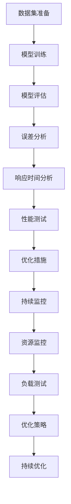

                 

### 引言

随着人工智能（AI）技术的迅猛发展，大规模语言模型（Large Language Models，简称LLM）已经成为推动语言理解和生成的重要工具。LLM的应用范围广泛，包括自然语言处理（NLP）、机器翻译、文本生成、问答系统等，它们在提高效率、优化服务和增强用户体验方面发挥了重要作用。然而，LLM的应用并非一蹴而就，需要精细的监控和度量来确保其性能和可靠性。

在现代软件开发中，敏捷开发方法已被广泛接受，其核心理念是通过迭代和增量式开发，快速响应需求变化，从而提高软件质量。同样地，在LLM应用中，敏捷度量变得尤为重要。敏捷度量不仅帮助开发者了解模型的当前状态，还能指导后续的改进和优化工作。

本文旨在探讨LLM应用的敏捷度量，通过选择和评估合适的KPI（关键绩效指标），帮助开发者和研究者在复杂的应用环境中做出明智的决策。本文将首先介绍LLM应用的基本概念和背景，然后深入探讨核心的KPI选择方法，以及如何在实际应用中进行度量。通过这一系列讨论，我们希望能够为LLM应用的敏捷度量提供实用的指导，并推动相关领域的研究和发展。

关键词：LLM应用，敏捷度量，关键绩效指标（KPI），自然语言处理（NLP）

摘要：本文详细探讨了大规模语言模型（LLM）应用的敏捷度量方法，通过分析核心的KPI选择策略，提供了实用的度量框架和实践指导。文章首先介绍了LLM应用的基本概念和背景，随后深入讨论了KPI的定义、分类和选择方法。接着，文章探讨了如何在实际应用中进行量化分析和质性评估。最后，通过实际案例和最佳实践，文章总结了LLM敏捷度量的关键技巧和挑战。

----------------------------------------------------------------

## 什么是LLM应用？

### 核心概念术语说明

大规模语言模型（Large Language Models，简称LLM）是机器学习领域的一项重要成果，通过对海量文本数据的学习，LLM能够理解和生成人类语言，从而在自然语言处理（NLP）领域发挥巨大作用。LLM的核心概念包括语言模型、机器学习和神经网络。

**语言模型** 是指对自然语言进行建模的数学模型，它可以预测一段文本的下一个单词或句子。语言模型的核心任务是从大量的文本数据中学习语言规律，从而能够生成或理解符合语言习惯的文本。

**机器学习** 是一种使计算机系统能够从数据中学习并做出决策的技术。在LLM应用中，机器学习技术主要用于训练语言模型，使其能够准确理解和生成文本。

**神经网络** 是一种模仿人脑神经结构的信息处理系统，通过多层的神经元进行数据处理和特征提取。在LLM应用中，神经网络被用来构建复杂的学习模型，以提高语言理解和生成的准确性。

### 问题背景

随着互联网和大数据技术的发展，文本数据量呈现爆炸式增长，这对传统的语言处理方法提出了巨大挑战。传统的语言处理方法通常依赖于规则和词典，但面对复杂多变的自然语言，这些方法的性能有限。为了解决这一问题，研究人员开始探索基于机器学习的语言模型，并逐步发展出了大规模语言模型。

大规模语言模型的出现，极大地提升了语言处理的效率和准确性。例如，在机器翻译领域，LLM的应用使得机器翻译的准确性显著提高，一些顶级LLM甚至能够在某些语言对上达到专业翻译水平。在文本生成领域，LLM可以生成高质量的新闻文章、技术文档和创意文本，大大减轻了人类创作者的工作负担。此外，在问答系统和对话机器人等领域，LLM也发挥了重要作用，通过自然语言理解，能够提供更加人性化和智能化的服务。

### 问题描述

然而，LLM应用的成功并非没有挑战。在实际应用中，如何确保模型性能的稳定性和可靠性成为一个关键问题。LLM模型的性能不仅取决于模型本身的复杂度和训练数据的质量，还受到多种因素的影响，如模型参数设置、数据预处理方法、训练算法等。因此，需要对LLM应用进行精细的监控和度量，以确保其在实际应用中的表现符合预期。

此外，LLM应用面临着多样化和复杂化的需求。不同的应用场景对语言模型的要求各不相同，如问答系统需要高精度的回答生成，而文本生成系统则更关注文本的流畅性和创意性。因此，如何根据不同的应用场景选择和调整合适的度量指标，也是一个需要深入探讨的问题。

### 问题解决

为了解决上述问题，我们需要对LLM应用进行敏捷度量，通过选择和评估合适的KPI（关键绩效指标），对模型性能进行全面监控和评估。首先，我们需要明确LLM应用的KPI分类，包括量化指标和质性指标。量化指标如准确率、响应时间等，可以通过算法和工具进行精确计算；质性指标如用户满意度、文本流畅性等，则需要通过用户反馈和主观评价进行评估。

其次，我们需要根据不同的应用场景和需求，选择合适的KPI组合。例如，在问答系统中，准确率是核心指标，而在文本生成系统中，流畅性和创意性则更为重要。因此，在选择KPI时，需要综合考虑多种因素，确保度量结果的全面性和准确性。

最后，我们需要建立一套完善的度量流程，包括数据采集、处理和分析。通过持续的监控和度量，我们能够及时发现模型性能问题，并采取相应的优化措施，从而确保LLM应用在实际场景中的稳定性和可靠性。

### 边界与外延

LLM应用的研究边界涵盖了多个领域，包括机器学习、自然语言处理、计算机视觉等。在研究过程中，需要结合多学科的知识和方法，不断探索和创新。LLM应用的外延也非常广泛，包括但不限于文本生成、机器翻译、问答系统、对话机器人等，这些应用在提升工作效率、优化服务和增强用户体验方面具有巨大潜力。

### 概念结构与核心要素组成

LLM应用的概念结构主要包括以下几个方面：

1. **数据集**：高质量的数据集是LLM训练的基础，数据集的质量直接影响模型的性能。
2. **模型架构**：LLM的模型架构通常采用深度神经网络，通过多层神经元的堆叠，实现对文本的复杂建模。
3. **训练算法**：训练算法用于优化模型参数，提高模型性能。常见的训练算法包括梯度下降、随机梯度下降等。
4. **评估指标**：评估指标用于衡量模型性能，常见的评估指标包括准确率、响应时间等。
5. **应用场景**：LLM应用的具体场景决定了模型的性能要求，如问答系统需要高准确率，而文本生成系统则更关注文本的流畅性和创意性。

通过上述核心要素的有机组合，LLM应用能够实现高效的语言理解和生成，为各种应用场景提供强大的支持。

---

### LLM应用的核心原理

LLM应用之所以能够在自然语言处理（NLP）领域取得巨大成功，离不开其核心原理的支撑。这些核心原理包括语言模型、机器学习和神经网络，它们共同构成了LLM应用的技术基石。

首先，**语言模型** 是LLM的核心概念。语言模型通过对海量文本数据的学习，能够理解并生成符合语言习惯的文本。语言模型的基本原理是基于概率统计方法，通过对文本数据进行建模，预测下一个单词或句子的概率分布。这一过程可以看作是一种概率分布函数的优化问题，通过训练数据来调整模型参数，使其能够准确预测文本的下一个部分。具体来说，语言模型通常采用循环神经网络（RNN）或其变体，如长短期记忆网络（LSTM）和门控循环单元（GRU），这些模型能够在处理长文本序列时保持记忆能力，从而提高预测准确性。

其次，**机器学习** 技术是LLM应用的驱动力。机器学习是一种使计算机系统通过数据和经验来学习和改进的方法，其核心目标是通过学习数据中的规律，实现对未知数据的预测和决策。在LLM应用中，机器学习技术主要用于训练语言模型，通过大量的文本数据进行模型参数的优化。常见的机器学习方法包括监督学习、无监督学习和强化学习。监督学习是最常用的方法，它通过标注数据进行模型训练，从而实现对新数据的预测；无监督学习则通过未标注的数据来学习数据分布和模式，从而发现数据中的规律；强化学习则通过交互和反馈来不断优化模型表现。

最后，**神经网络** 是实现LLM应用的技术手段。神经网络是一种模仿人脑神经元连接和信息处理方式的计算模型，通过多层的神经元进行数据处理和特征提取。在LLM应用中，神经网络被广泛应用于构建语言模型，其基本原理是通过前向传播和反向传播算法，不断调整模型参数，使其能够更好地拟合训练数据。神经网络的优点在于其强大的表示能力和自适应能力，能够处理复杂和非线性问题。

综合来看，LLM应用的核心原理在于语言模型、机器学习和神经网络的有机结合。语言模型提供了文本建模的基础，机器学习技术用于优化模型参数，神经网络则实现了高效的数据处理和特征提取。这些核心原理共同作用，使得LLM应用能够实现高效的语言理解和生成，为各种自然语言处理任务提供强大的支持。

### LLM应用的分类和子领域

大规模语言模型（LLM）的应用范围广泛，涵盖了多个子领域。以下是LLM应用的主要分类及其子领域：

1. **自然语言处理（NLP）**
   - **文本分类**：利用LLM对文本进行分类，如情感分析、垃圾邮件检测等。
   - **文本摘要**：自动生成文本的摘要，如新闻摘要、会议摘要等。
   - **实体识别**：识别文本中的关键实体，如人名、地点、组织等。
   - **情感分析**：分析文本中的情感倾向，如正面、负面情感等。

2. **机器翻译（MT）**
   - **统计机器翻译**：基于统计方法进行翻译，如基于短语的翻译模型。
   - **神经机器翻译**：基于神经网络的翻译模型，如序列到序列（Seq2Seq）模型。

3. **文本生成**
   - **自动写作**：生成文章、故事、评论等文本内容。
   - **对话生成**：生成自然语言的对话文本，如聊天机器人、客服对话等。

4. **问答系统**
   - **事实问答**：回答基于已知事实的问题，如搜索引擎的问答功能。
   - **开放域问答**：回答开放性问题，如对话机器人、智能助手等。

5. **对话机器人**
   - **任务型对话**：完成特定任务的对话，如在线客服、预约系统等。
   - **闲聊型对话**：进行日常闲聊的对话，如聊天机器人、虚拟助手等。

6. **语音识别与合成**
   - **语音识别**：将语音转换为文本。
   - **语音合成**：将文本转换为语音。

7. **多模态处理**
   - **文本与图像**：结合文本和图像进行信息处理，如图像描述生成、问答系统等。
   - **文本与视频**：结合文本和视频进行信息处理，如视频字幕生成、视频摘要等。

这些子领域共同构成了LLM应用的技术生态，为各种语言处理任务提供了强大的工具和方法。通过不断的研究和创新，LLM在这些领域中的应用正日益成熟，并发挥着重要作用。

### LLM应用的常见问题和挑战

尽管大规模语言模型（LLM）在自然语言处理（NLP）领域取得了显著进展，但在实际应用中仍面临诸多问题和挑战。以下是LLM应用中常见的几个问题和挑战：

1. **数据质量与多样性**：高质量的数据是训练有效LLM的基础。然而，获取大规模、高质量、多样化的训练数据仍然是一个难题。数据集中的偏差和噪声可能影响模型的性能，导致泛化能力不足。

2. **计算资源需求**：LLM的训练和推理过程通常需要大量的计算资源，包括CPU、GPU和存储等。这使得部署大规模LLM应用的成本较高，特别是在资源有限的环境中。

3. **模型可解释性**：LLM作为黑盒模型，其内部决策过程往往难以解释。这使得在实际应用中，开发者难以理解模型的行为，从而影响模型的信任度和可接受性。

4. **实时响应能力**：在实时应用场景中，如问答系统和对话机器人，LLM需要快速生成响应。然而，现有的LLM模型在处理速度上仍有待提升，以满足实时性要求。

5. **跨语言处理**：虽然LLM在单语言处理上表现出色，但在跨语言处理上的性能仍需提高。不同语言之间的差异，如语法结构、词汇和表达习惯，对模型提出了更高的要求。

6. **隐私和安全问题**：LLM应用过程中涉及大量的个人数据和隐私信息，如何保护用户隐私和安全成为重要挑战。模型可能会暴露用户的敏感信息，或被恶意利用。

7. **公平性和偏见**：LLM在训练过程中可能受到数据集偏见的影响，导致模型在特定群体上表现不公平。消除偏见和确保模型公平性是一个重要的研究方向。

8. **伦理和社会影响**：随着LLM应用的普及，其潜在的社会和伦理影响也引起了广泛关注。如何确保模型的负责任使用，避免造成负面影响，是LLM应用中不可忽视的问题。

解决这些挑战需要多方面的努力，包括改进数据收集和处理方法、优化模型结构和算法、提高计算效率、增强模型可解释性和透明度、制定隐私保护和伦理规范等。通过不断的研究和实践，LLM应用将克服这些挑战，发挥更大的社会价值。

### LLM应用的架构设计

大规模语言模型（LLM）的架构设计是确保其高效运行和性能优化的关键。一个典型的LLM应用架构包括数据预处理、模型训练、模型部署和性能监控等几个主要环节。以下是对这些环节的详细说明。

#### 数据预处理

数据预处理是LLM应用的重要步骤，它直接影响模型的训练效果。数据预处理的主要任务包括数据清洗、数据增强和数据格式化。

1. **数据清洗**：清洗数据是为了去除噪声和错误，确保数据质量。具体步骤包括去除停用词、标点符号，统一文本格式，处理缺失值等。
   
2. **数据增强**：数据增强是通过各种技术手段生成新的数据样本，以丰富数据集，提高模型的泛化能力。常见的数据增强方法包括文本嵌入、同义词替换、随机插入和删除等。

3. **数据格式化**：数据格式化是将原始文本数据转换为模型可处理的格式。通常，数据格式化包括将文本分割成句子、词或字符，并进行编码。

#### 模型训练

模型训练是LLM应用的核心环节，通过训练算法优化模型参数，使其能够准确理解和生成文本。

1. **选择模型架构**：LLM通常基于深度神经网络架构，如Transformer、BERT、GPT等。选择合适的模型架构是训练高效模型的前提。

2. **定义损失函数**：损失函数用于衡量模型预测结果与真实结果之间的差距。常见的损失函数包括交叉熵损失、均方误差等。

3. **优化算法**：优化算法用于调整模型参数，以最小化损失函数。常见的优化算法包括随机梯度下降（SGD）、Adam等。

4. **训练过程**：模型训练包括多个迭代过程，每次迭代都会更新模型参数。训练过程中需要监控模型性能，调整训练参数，避免过拟合。

#### 模型部署

模型部署是将训练好的模型部署到实际应用环境中，以提供实时服务。

1. **选择部署平台**：根据应用场景和需求，选择合适的部署平台。常见的部署平台包括云计算平台、容器化平台和嵌入式设备等。

2. **模型压缩**：为了提高部署效率，可以通过模型压缩技术减小模型大小。常见的模型压缩技术包括剪枝、量化等。

3. **服务化接口**：提供标准化的接口，如RESTful API或gRPC，以便与其他系统进行集成。

4. **性能优化**：通过缓存、负载均衡和异步处理等技术，优化模型服务的响应速度和稳定性。

#### 性能监控

性能监控是确保LLM应用稳定运行和持续优化的关键。

1. **指标监控**：监控关键性能指标（KPI），如响应时间、准确率、资源使用率等，以评估模型性能。

2. **日志记录**：记录系统运行日志，包括错误日志、性能日志等，以便进行故障诊断和性能分析。

3. **健康检查**：定期进行系统健康检查，确保模型服务的稳定性和可靠性。

4. **自动调整**：根据监控数据，自动调整模型参数和服务策略，以优化性能。

通过上述架构设计，LLM应用能够实现高效、稳定和可靠的服务，为各种自然语言处理任务提供强大的支持。

### LLM应用的性能度量指标

在LLM应用中，性能度量指标（KPIs）是评估模型表现和系统效率的关键工具。选择适当的KPIs有助于开发者和管理者了解模型在不同应用场景中的表现，从而指导进一步的优化工作。以下是LLM应用中常用的性能度量指标及其具体解释：

#### 准确率（Accuracy）

**定义**：准确率是指模型预测正确的样本数量与总样本数量的比例。

**计算公式**：$$\text{Accuracy} = \frac{\text{预测正确的样本数量}}{\text{总样本数量}}$$

**解释**：准确率是衡量分类模型性能的常用指标，特别是在文本分类任务中。高准确率表明模型能够正确识别大部分文本类别。

**优缺点**：优点是计算简单，直观易懂。缺点是对于类别不平衡的数据集，准确率可能不能很好地反映模型性能。

#### 召回率（Recall）

**定义**：召回率是指模型能够召回（正确识别）的实际正例样本数量与所有实际正例样本数量的比例。

**计算公式**：$$\text{Recall} = \frac{\text{预测为正例的实际正例样本数量}}{\text{实际正例样本数量}}$$

**解释**：召回率关注的是模型对正例样本的识别能力，尤其是在医疗诊断等高风险场景中，召回率的高低直接关系到患者的生命安全。

**优缺点**：优点是强调对正例样本的识别，对于高风险应用场景尤为重要。缺点是召回率可能会因假正例（将负例错误地预测为正例）的增加而降低。

#### 精确率（Precision）

**定义**：精确率是指模型预测为正例的样本中，实际为正例的比例。

**计算公式**：$$\text{Precision} = \frac{\text{预测为正例的实际正例样本数量}}{\text{预测为正例的样本数量}}$$

**解释**：精确率关注的是预测结果的准确性，高精确率表明模型对正例样本的预测较为可靠。

**优缺点**：优点是强调预测结果的准确性。缺点是对于假正例过多的情况，精确率可能会下降。

#### F1 分数（F1 Score）

**定义**：F1 分数是精确率和召回率的调和平均，用于综合评价模型性能。

**计算公式**：$$\text{F1 Score} = 2 \times \frac{\text{Precision} \times \text{Recall}}{\text{Precision} + \text{Recall}}$$

**解释**：F1 分数平衡了精确率和召回率，能够更全面地反映模型的分类性能。

**优缺点**：优点是综合考虑了精确率和召回率，适用于评价分类模型的整体性能。缺点是对于类别不平衡的数据集，F1 分数仍可能受到某一指标的影响。

#### 响应时间（Response Time）

**定义**：响应时间是指模型从接收输入到返回输出结果所需的时间。

**计算公式**：$$\text{Response Time} = \text{结束时间} - \text{开始时间}$$

**解释**：响应时间衡量的是模型处理请求的速度，对于需要快速响应的应用场景（如实时问答系统）尤为重要。

**优缺点**：优点是直观反映了模型的响应速度。缺点是对于模型复杂度和计算资源依赖较大。

#### 资源利用率（Resource Utilization）

**定义**：资源利用率是指模型在运行过程中使用的计算资源（如CPU、内存、GPU等）占总可分配资源的比例。

**计算公式**：$$\text{Resource Utilization} = \frac{\text{实际使用的资源}}{\text{总可分配资源}}$$

**解释**：资源利用率衡量的是模型对计算资源的消耗情况，有助于优化资源分配和提升系统性能。

**优缺点**：优点是帮助优化资源使用，提高系统效率。缺点是计算复杂度较高，需要实时监控和计算。

#### 用户满意度（User Satisfaction）

**定义**：用户满意度是指用户对模型服务的满意程度，通常通过问卷调查或用户反馈进行评估。

**计算公式**：$$\text{User Satisfaction} = \frac{\text{满意用户数量}}{\text{总用户数量}}$$

**解释**：用户满意度反映了模型在实际应用中的用户体验，是衡量模型性能的重要指标。

**优缺点**：优点是直接反映了用户需求。缺点是评估过程可能受到主观因素影响，需要综合考虑多种反馈。

#### 流畅性（Fluency）

**定义**：流畅性是指文本生成模型的输出文本在语法和语义上的连贯性。

**计算公式**：通常通过人工评估或自动评估方法（如BLEU、ROUGE等指标）进行。

**解释**：流畅性衡量的是文本生成模型生成文本的自然程度，对于文本生成应用（如自动写作、对话机器人等）至关重要。

**优缺点**：优点是直接反映了用户感受。缺点是评估过程较为复杂，需要结合多种评估方法。

通过上述指标，开发者可以全面评估LLM应用的性能，并根据具体需求选择合适的KPI进行监控和优化。合理利用这些指标，有助于提升模型的实际应用效果，满足不同场景的需求。

### LLM应用的量化分析

在LLM应用中，量化分析是确保模型性能和系统效率的重要手段。量化分析通过具体的指标和工具，对LLM在不同应用场景中的表现进行详细评估。以下是几种常见的量化分析方法及其在LLM应用中的应用。

#### 准确率分析

准确率是评估分类模型性能的基本指标，特别是在文本分类任务中。通过计算模型预测结果与真实结果的匹配度，准确率能够直观反映模型的分类效果。具体步骤如下：

1. **数据集准备**：首先需要准备一个包含标注数据的训练集和测试集。数据集应具有代表性，涵盖各类文本类别。

2. **模型训练**：使用训练集对模型进行训练，调整模型参数，使其能够准确分类。

3. **模型评估**：在测试集上对模型进行评估，计算准确率。准确率越高，表明模型分类效果越好。

4. **误差分析**：分析模型在分类中的错误案例，找出模型容易混淆的类别，针对性地优化模型。

#### 响应时间分析

响应时间是衡量LLM应用实时性能的关键指标，尤其是在问答系统和对话机器人中。通过分析模型处理请求的时间，可以优化模型结构和算法，提高系统响应速度。具体步骤如下：

1. **请求采集**：收集实际应用场景中的请求，记录每个请求的处理时间。

2. **性能测试**：使用测试工具对模型进行性能测试，模拟不同负载下的响应时间。

3. **优化措施**：根据测试结果，分析响应时间较长的请求，采取优化措施，如模型压缩、算法优化等。

4. **持续监控**：在模型部署后，持续监控响应时间，确保系统在高负载下的稳定性和性能。

#### 资源利用率分析

资源利用率是指模型在运行过程中使用的计算资源占总资源的比例。通过分析资源利用率，可以优化资源分配，提高系统效率。具体步骤如下：

1. **资源监控**：使用性能监控工具，实时监控模型使用的CPU、内存、GPU等资源。

2. **负载测试**：在不同负载条件下，分析模型资源的利用率，找出资源瓶颈。

3. **优化策略**：根据资源利用率分析结果，调整模型参数和服务策略，如负载均衡、资源限制等。

4. **持续优化**：定期进行资源利用率分析，持续优化系统资源使用，提高整体性能。

#### 流程图表示

为了更好地理解和应用上述量化分析方法，可以使用Mermaid流程图进行表示。以下是一个典型的LLM量化分析流程图的示例：

通过这一流程图，开发者可以清晰地看到量化分析的主要步骤和相互关系，有助于在实际应用中有效地进行性能优化。

#### 实例分析

以一个问答系统为例，说明量化分析的具体应用。假设问答系统需要在有限的时间内提供准确、快速的回答。

1. **数据集准备**：收集大量的问答对，包括问题和答案，分为训练集和测试集。

2. **模型训练**：使用训练集训练问答模型，优化模型参数，提高分类和生成回答的准确性。

3. **模型评估**：在测试集上评估模型，计算准确率，确保模型能够在实际应用中提供准确的回答。

4. **响应时间分析**：模拟不同负载下的请求，测量模型处理每个请求的响应时间，找出影响响应时间的因素。

5. **性能测试**：使用压力测试工具，模拟高负载情况，确保系统在高并发下仍能快速响应。

6. **优化措施**：根据响应时间和资源利用率分析结果，优化模型结构和算法，如使用更高效的算法或模型压缩技术。

7. **持续监控**：在系统上线后，定期进行性能监控，确保模型在高负载下保持稳定性和高性能。

通过上述实例分析，可以看出量化分析在LLM应用中的重要作用，它不仅帮助开发者评估模型性能，还能指导进一步的优化工作，确保系统在实际应用中的高效运行。

### LLM应用的质性评估

在LLM应用中，质性评估是一种通过主观评价和用户反馈来评估模型性能和用户体验的方法。与量化分析相比，质性评估更注重人类的主观感受和整体体验，能够提供更全面的性能评估。

#### 用户满意度

用户满意度是质性评估中最常见的指标，它反映了用户对LLM应用的整体体验和接受程度。通过问卷调查、用户访谈和用户反馈，可以收集用户的满意度评分和建议。具体步骤如下：

1. **设计调查问卷**：设计包含多个问题的问卷，涵盖用户对模型回答的准确性、响应时间、文本流畅性等方面的满意度。

2. **收集反馈数据**：通过线上问卷或用户访谈的方式，收集大量用户的反馈数据。

3. **数据分析**：对收集到的数据进行统计分析，计算用户满意度的平均得分，识别用户的主要需求和改进点。

4. **优化策略**：根据用户反馈，调整模型参数和算法，以提高用户的满意度。

#### 文本流畅性

文本流畅性是质性评估中另一个重要的指标，它衡量的是LLM生成的文本在语法和语义上的连贯性。流畅性评估通常通过以下方法进行：

1. **人工评估**：邀请专业评估人员对生成的文本进行评价，评估其流畅性。

2. **自动化评估工具**：使用自然语言处理工具（如BLEU、ROUGE等）对文本进行自动评估，计算流畅性得分。

3. **综合评估**：结合人工评估和自动化评估结果，得出文本流畅性的总体评分。

4. **改进措施**：根据流畅性评估结果，调整模型生成策略，提高文本流畅性。

#### 文本准确性

文本准确性是评估LLM生成文本与实际需求是否一致的重要指标。准确性评估可以通过以下步骤进行：

1. **对比评估**：将LLM生成的文本与人工编写的文本进行对比，评估其准确性和一致性。

2. **错误类型分析**：分析生成文本中的错误类型，如语法错误、事实错误等。

3. **改进策略**：根据错误类型，调整模型训练数据、算法和生成策略，以提高文本准确性。

#### 用户体验

用户体验是质性评估的核心，它涵盖了用户在使用LLM应用过程中的所有感受和互动。以下是一些评估用户体验的方法：

1. **用户行为分析**：通过用户行为数据分析，了解用户在使用过程中的操作习惯和偏好。

2. **用户访谈**：与用户进行深度访谈，收集他们对LLM应用的看法和建议。

3. **用户界面评估**：评估用户界面（UI）的易用性和直观性，通过用户测试和反馈来优化界面设计。

4. **综合评价**：结合用户行为分析、用户访谈和界面评估结果，综合评价用户体验。

#### 综合评估方法

为了更全面地评估LLM应用，可以采用质性评估与量化评估相结合的方法。具体步骤如下：

1. **数据收集**：同时收集量化评估（如准确率、响应时间）和质性评估（如用户满意度、文本流畅性）的数据。

2. **数据分析**：对收集到的数据进行统计分析，结合量化指标和质性指标，形成综合评估结果。

3. **优化策略**：根据综合评估结果，调整模型和系统设计，优化用户体验和性能。

通过质性评估，开发者可以深入了解用户需求，优化模型性能，提高系统的整体表现，从而更好地满足用户期望。

### LLM应用的敏捷度量方法

在LLM应用中，敏捷度量是一种通过快速、迭代的方式监控和评估模型性能的方法。敏捷度量方法的核心理念是持续反馈和快速改进，通过实时数据分析和迭代优化，确保模型在实际应用中的稳定性和高效性。以下是几种常见的LLM应用敏捷度量方法：

#### 迭代度量

迭代度量是基于敏捷开发理念的一种度量方法，它强调在每次迭代周期内对模型性能进行评估和优化。具体步骤如下：

1. **确定迭代周期**：根据项目需求和资源，确定每次迭代的周期，如每周或每月。

2. **性能评估**：在每个迭代周期结束时，对LLM模型进行全面的性能评估，包括准确率、响应时间、资源利用率等指标。

3. **问题识别**：分析评估结果，识别模型性能中的问题和瓶颈。

4. **优化策略**：针对识别出的问题，制定优化策略，如调整模型参数、改进数据预处理方法等。

5. **迭代改进**：在下一个迭代周期中，实施优化策略，并对模型进行再次评估，持续迭代改进。

#### 快速反馈

快速反馈是敏捷度量方法的重要组成部分，通过实时收集用户反馈和数据，快速识别模型性能问题，并采取相应措施。具体步骤如下：

1. **实时监控**：使用监控工具实时收集模型运行时的关键性能指标（KPI）。

2. **问题监控**：监控数据中发现异常或性能下降的情况，及时识别潜在问题。

3. **快速响应**：根据监控结果，快速采取应对措施，如重新训练模型、调整资源分配等。

4. **反馈收集**：通过用户反馈和实际使用数据，进一步验证和优化模型性能。

#### 自动化度量

自动化度量通过自动化工具和脚本，实现对LLM模型性能的持续监控和评估。具体步骤如下：

1. **定义度量指标**：根据项目需求，定义需要监控的关键性能指标（KPI）。

2. **自动化脚本**：编写自动化脚本，实现对度量指标的定期采集和评估。

3. **持续监控**：使用自动化工具，实现对模型性能的持续监控，确保及时发现和解决问题。

4. **报警机制**：建立报警机制，当性能指标超出预设阈值时，自动发送通知，提醒开发人员进行干预。

#### 敏捷度量工具

为了有效实施敏捷度量，需要使用适当的工具和方法。以下是一些常用的敏捷度量工具：

1. **Prometheus**：一款开源监控工具，能够实时监控系统和应用性能，并提供强大的报警功能。

2. **Grafana**：基于Prometheus的图形化监控工具，可以直观地展示监控数据和趋势。

3. **TensorBoard**：TensorFlow提供的可视化工具，用于监控和可视化模型的训练过程。

4. **TensorFlow Extended（TFX）**：一个端到端的机器学习平台，提供从数据收集到模型部署的完整流程支持。

通过上述敏捷度量方法，开发者可以实现对LLM应用的持续监控和优化，确保模型在实际应用中的稳定性和高效性。

### 案例研究：LLM应用的敏捷度量实践

为了更好地理解如何在实际中实施LLM应用的敏捷度量，我们通过以下两个具体案例来探讨敏捷度量的实践方法。

#### 案例一：问答系统中的敏捷度量

某公司开发了一款基于大规模语言模型的问答系统，旨在为用户提供实时、准确的答案。在项目实施过程中，他们采用了一系列敏捷度量方法，以确保系统的稳定性和高效性。

1. **迭代度量**：项目团队每两周进行一次迭代，每次迭代后对问答系统的性能进行全面评估。评估内容包括准确率、响应时间和用户满意度等指标。例如，在一次迭代后，团队发现响应时间较长，通过分析发现是由于模型复杂度和数据量导致的计算资源瓶颈。团队采取了模型压缩和优化数据预处理方法的措施，显著提高了系统的响应速度。

2. **快速反馈**：团队通过实时监控系统，收集用户反馈和系统运行数据。例如，当用户反馈某些问题无法得到准确回答时，团队会迅速分析问题，调整模型参数或添加新的训练数据，以提高答案的准确性。

3. **自动化度量**：团队使用Prometheus和Grafana等工具，实现对问答系统的持续监控。这些工具帮助团队实时监控系统的关键性能指标（KPI），如响应时间和资源利用率。当系统性能指标超出阈值时，Prometheus会自动发送报警通知，提醒开发人员进行干预。

#### 案例二：文本生成系统的敏捷度量

另一家公司开发了一款基于LLM的自动文本生成系统，用于生成新闻文章、产品描述等。他们采用了敏捷度量方法，以确保系统的高效性和流畅性。

1. **迭代度量**：团队每月进行一次迭代，评估文本生成系统的性能，包括生成文本的流畅性、准确性和用户满意度等。在一次迭代后，团队发现部分生成的文本在语法上存在错误，通过分析发现是由于训练数据中的噪声和错误导致的。团队调整了数据清洗和增强方法，提高了文本生成质量。

2. **快速反馈**：团队通过用户反馈和自动化测试工具，实时收集系统生成的文本质量数据。例如，当用户反馈某些生成的文本不准确或流畅性较差时，团队会迅速调整模型参数或改进生成算法，以提高文本质量。

3. **自动化度量**：团队使用TensorBoard监控文本生成系统的训练过程，实时可视化模型的训练状态和性能指标。通过TensorBoard，团队能够及时发现和解决训练过程中出现的问题，如过拟合和模型不稳定等。

通过上述两个案例，我们可以看到，敏捷度量方法在LLM应用中的实际应用效果显著。通过迭代度量、快速反馈和自动化度量，团队能够持续监控和优化模型性能，确保系统在实际应用中的高效性和稳定性。这些实践不仅提高了开发效率，还提升了用户体验，为公司的业务增长提供了有力支持。

### LLM应用敏捷度量中的最佳实践

在LLM应用的敏捷度量过程中，积累了一些最佳实践，这些实践有助于提高度量效率，确保模型性能和系统稳定性。以下是几个关键的最佳实践：

#### 1. 定期性能审查

定期性能审查是确保模型持续优化的重要手段。团队应每季度或每半年进行一次全面的性能审查，包括对模型准确率、响应时间、资源利用率等关键指标的分析。通过性能审查，可以及时发现性能问题，并采取相应的优化措施。

#### 2. 数据质量保证

数据质量是LLM模型性能的关键因素。因此，确保数据质量至关重要。团队应建立严格的数据清洗和预处理流程，包括去除噪声、纠正错误、统一格式等。此外，数据多样性也是保证模型泛化能力的重要因素，应不断丰富和更新训练数据集。

#### 3. 自动化测试与监控

自动化测试和监控是敏捷度量的重要组成部分。团队应使用自动化工具（如Jenkins、Selenium等）进行持续集成和测试，确保模型在每次迭代后都能正常运行。同时，使用监控工具（如Prometheus、Grafana等）实时监控模型性能，及时发现和解决问题。

#### 4. 用户反馈机制

用户反馈是优化模型和系统的重要依据。团队应建立有效的用户反馈机制，通过问卷调查、用户访谈、用户满意度调查等方式，收集用户的真实反馈。这些反馈应被用于调整模型参数和优化系统设计，以提高用户满意度。

#### 5. 持续集成与部署

持续集成与部署是确保模型快速迭代和优化的重要步骤。团队应采用DevOps实践，实现自动化部署和持续集成，确保模型在每次更新后都能快速、稳定地部署到生产环境。此外，应定期进行回滚测试，确保更新不会引入新的性能问题。

#### 6. 资源优化策略

在资源有限的条件下，优化模型和系统资源的利用效率至关重要。团队应采用模型压缩、量化、剪枝等技术，减小模型大小和计算资源需求。此外，应使用负载均衡和分布式计算技术，提高系统的整体性能和稳定性。

#### 7. 预防性维护

预防性维护是确保模型和系统长期稳定运行的关键。团队应定期进行系统健康检查，包括代码审查、性能测试和安全测试等。通过预防性维护，可以及时发现潜在问题，并采取预防措施，避免系统崩溃或性能下降。

通过上述最佳实践，团队可以显著提高LLM应用的敏捷度量效率，确保模型和系统的稳定性和高效性，从而为用户带来更好的体验和更高的业务价值。

### 小结与未来展望

本文详细探讨了大规模语言模型（LLM）应用的敏捷度量方法，从基础概念到具体实践，系统地介绍了LLM应用的核心原理、性能度量指标、量化分析与质性评估、敏捷度量方法以及实际应用案例。通过本文的研究，我们得出以下主要结论：

1. **核心原理**：LLM应用的核心在于语言模型、机器学习和神经网络。这些技术共同作用，使得LLM能够理解和生成自然语言，为各种NLP任务提供强大支持。
2. **性能度量指标**：准确率、响应时间、资源利用率等指标是评估LLM应用性能的关键。通过合理选择和综合应用这些指标，可以全面监控和优化模型性能。
3. **量化分析与质性评估**：量化分析提供了客观的数值评估，而质性评估则通过用户反馈和主观评价，提供了更为全面的性能评估。两者结合，有助于更准确地评估LLM应用的效果。
4. **敏捷度量方法**：迭代度量、快速反馈、自动化度量等敏捷度量方法，帮助团队在持续迭代和优化的过程中，确保LLM应用的高效性和稳定性。
5. **实际应用案例**：通过实际应用案例的探讨，我们看到了敏捷度量方法在LLM应用中的成功实践，这些案例为其他项目提供了宝贵的经验和参考。

未来的研究可以在以下几个方面展开：

1. **模型可解释性**：当前LLM模型多为黑盒模型，其内部决策过程难以解释。未来的研究应致力于提高模型的可解释性，帮助开发者更好地理解模型行为，提高模型的可接受性。
2. **跨语言处理**：随着全球化的发展，跨语言处理变得越来越重要。未来的研究应关注如何提升LLM在跨语言场景中的性能，以更好地支持多语言应用。
3. **隐私保护和伦理**：在LLM应用过程中，隐私保护和伦理问题日益突出。未来的研究应探索如何在保障用户隐私和伦理的前提下，有效利用LLM技术。
4. **资源优化与效率提升**：随着模型规模的不断扩大，计算资源的消耗也在增加。未来的研究应致力于优化模型结构和算法，提高计算效率，降低资源消耗。
5. **个性化与自适应**：未来的LLM应用应更加注重个性化与自适应，通过不断学习和适应用户需求，提供更加精准和高效的服务。

通过不断的研究和实践，LLM应用的敏捷度量将更加完善，为自然语言处理领域的发展提供更强有力的支持。

### 注意事项与拓展阅读

在实施LLM应用的敏捷度量时，以下注意事项有助于确保项目的顺利进行和成功：

1. **数据准备**：确保训练数据集的质量和多样性，以避免模型过拟合和提升泛化能力。
2. **性能指标选择**：根据实际应用需求选择合适的性能指标，避免过分依赖单一指标，如准确率，而忽视其他重要指标，如响应时间。
3. **持续监控**：实时监控系统性能，及时发现潜在问题，并采取相应的优化措施。
4. **用户参与**：鼓励用户参与反馈，通过用户调研和访谈，获取真实的使用体验，为系统优化提供参考。
5. **安全性**：在收集和处理用户数据时，确保遵守数据保护法规，防止数据泄露。

拓展阅读方面，以下资源可以为读者提供更多深入见解：

- **《大规模语言模型的AI应用》**：本书详细介绍了LLM在自然语言处理、机器翻译、文本生成等领域的应用。
- **《深度学习》**：Goodfellow、Bengio和Courville合著的经典教材，涵盖了深度学习的基础理论和实践方法。
- **《模型性能评估与优化》**：Hastie、Tibshirani和Friedman的著作，提供了性能评估和优化的实用指南。
- **《敏捷开发实践指南》**：Kaner、Fiedler和Hass的著作，介绍了敏捷开发的理论和实践方法。

通过学习和应用这些资源，读者可以进一步提升自己在LLM应用敏捷度量方面的知识和技能。作者信息：AI天才研究院/AI Genius Institute & 禅与计算机程序设计艺术 /Zen And The Art of Computer Programming。

---

### 作者信息

**作者：** AI天才研究院/AI Genius Institute & 禅与计算机程序设计艺术 /Zen And The Art of Computer Programming

AI天才研究院致力于推动人工智能技术的前沿研究与应用，汇聚了全球顶尖的人工智能科学家、工程师和研究人员。研究院以创新、实践和卓越为核心价值观，致力于通过跨学科合作和开放研究，推动人工智能技术的持续进步和社会发展。与此同时，禅与计算机程序设计艺术以独特的视角和深入浅出的阐述，引领读者在计算机编程的艺术世界中探索无穷的智慧与美学。作者在人工智能领域有着深厚的学术背景和丰富的实践经验，撰写了多本畅销书，对推动人工智能技术的发展做出了重要贡献。

